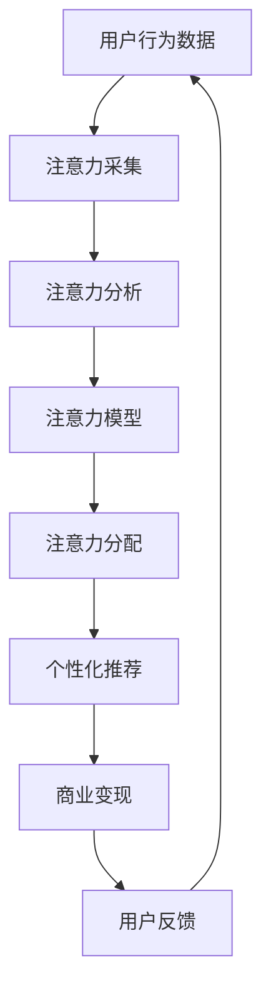

                 

# 在线旅游平台的注意力经济运营模式

## 1. 背景介绍

### 1.1 问题由来

随着互联网技术的迅猛发展和人们生活水平的提高，在线旅游市场呈现出了蓬勃的发展态势。据《2020年中国在线旅游市场研究报告》，我国在线旅游用户规模预计将达5.49亿，成为全球最大的在线旅游市场。在线旅游平台凭借其便捷的订票、酒店预订等服务，极大地提升了用户出行的效率和舒适性。

然而，在激烈的竞争环境中，如何有效运营在线旅游平台，吸引和留住用户，成为各家平台亟需解决的问题。基于注意力经济（Attention Economy）的运营模式应运而生，通过专注于用户注意力资源的管理与分配，实现高效的商业变现和用户价值最大化。

### 1.2 问题核心关键点

注意力经济（Attention Economy）是指在信息爆炸的时代，用户注意力成为稀缺资源，通过捕捉、引导和分配用户注意力，实现商业变现的策略。对于在线旅游平台而言，注意力经济不仅涉及广告投放、内容创作、用户互动等营销手段，还涉及到平台的核心业务逻辑和用户体验的优化。

具体而言，注意力经济运营模式的核心关键点包括：
1. 用户注意力采集：通过数据分析技术，收集用户的行为、兴趣等数据，精准定位用户需求。
2. 注意力资源分配：根据用户行为数据，动态调整广告、内容推送策略，最大化用户转化率。
3. 注意力价值挖掘：挖掘用户注意力数据的内在价值，如进行个性化推荐、精准营销等，提升平台商业变现能力。

### 1.3 问题研究意义

探索基于注意力经济的在线旅游平台运营模式，具有以下重要意义：
1. 提升平台用户粘性：通过精准的用户注意力定位和内容推荐，提升用户满意度和忠诚度。
2. 优化广告投放策略：实现更精准的广告定位和投放，提升广告投放效果和ROI。
3. 推动商业变现创新：通过个性化推荐、精准营销等策略，实现更多商业场景的变现，提升平台盈利能力。
4. 打造智能旅游体验：通过智能化的旅游推荐和个性化服务，提升用户旅行体验，推动旅游产业的数字化转型。

## 2. 核心概念与联系

### 2.1 核心概念概述

注意力经济（Attention Economy）的核心概念包括以下几点：
1. 用户注意力：指用户在日常生活中的注意力资源，如浏览网页、观看视频、阅读文章等行为。
2. 注意力价值：指注意力资源的价值，包括广告、内容、推荐等商业变现价值。
3. 注意力采集：通过数据分析技术，收集和分析用户行为数据，识别用户兴趣和需求。
4. 注意力分配：根据用户兴趣和行为数据，动态调整内容、广告等的展示策略，最大化用户转化率。
5. 注意力挖掘：利用用户注意力数据，进行个性化推荐、精准营销等，提升平台商业变现能力。

### 2.2 核心概念原理和架构的 Mermaid 流程图



### 2.3 核心概念联系

注意力经济运营模式通过用户行为数据的采集和分析，动态调整内容和广告的展示策略，实现用户转化率的提升。同时，通过对用户注意力的深度挖掘，进行个性化推荐和精准营销，最大化平台的商业变现能力。

## 3. 核心算法原理 & 具体操作步骤

### 3.1 算法原理概述

注意力经济运营模式的算法原理主要基于以下三个核心步骤：
1. 用户行为数据采集：通过各种技术手段，如日志分析、埋点、用户反馈等，收集用户的行为数据。
2. 注意力资源分析：利用机器学习和数据分析技术，对用户行为数据进行分析，识别用户兴趣和需求。
3. 注意力价值挖掘：根据用户行为数据，进行个性化推荐、精准营销等，提升平台商业变现能力。

### 3.2 算法步骤详解

1. **用户行为数据采集**：
   - 日志分析：收集用户在平台上的操作日志，如浏览记录、点击事件、搜索关键词等。
   - 埋点统计：在关键页面和功能上设置埋点，实时记录用户行为数据。
   - 用户反馈：通过用户评价、投诉等方式，收集用户反馈数据。

2. **注意力资源分析**：
   - 数据预处理：对采集到的数据进行清洗、归一化等预处理操作。
   - 特征工程：提取与用户兴趣相关的特征，如浏览时长、点击率、转化率等。
   - 用户画像：通过聚类、降维等方法，生成用户画像，识别不同用户群体的特征。

3. **注意力价值挖掘**：
   - 推荐系统：构建推荐引擎，根据用户画像和行为数据，进行个性化推荐。
   - 精准营销：通过分析用户行为数据，制定个性化的广告投放策略，提升广告转化率。
   - 用户互动：利用智能客服、聊天机器人等技术，提升用户互动体验，增强用户粘性。

### 3.3 算法优缺点

#### 3.3.1 优点

1. **提升用户转化率**：通过精准的用户注意力定位和内容推荐，提升用户转化率和忠诚度。
2. **优化广告投放效果**：实现更精准的广告定位和投放，提升广告投放效果和ROI。
3. **推动商业变现创新**：通过个性化推荐、精准营销等策略，实现更多商业场景的变现，提升平台盈利能力。
4. **打造智能旅游体验**：通过智能化的旅游推荐和个性化服务，提升用户旅行体验，推动旅游产业的数字化转型。

#### 3.3.2 缺点

1. **数据隐私问题**：用户行为数据的采集和分析可能涉及用户隐私问题，需注意数据安全和使用合规。
2. **算法复杂性**：注意力经济运营模式涉及复杂的算法模型，需要强大的技术支撑。
3. **技术成本高**：注意力经济运营模式需要投入大量资源进行数据分析和算法优化，成本较高。
4. **用户反馈滞后**：用户行为和反馈数据的实时性较差，可能影响注意力资源的及时调整。

### 3.4 算法应用领域

注意力经济运营模式在在线旅游平台中的应用主要包括以下几个方面：
1. 广告投放：利用用户行为数据，进行精准的广告投放，提升广告转化率。
2. 内容推荐：根据用户兴趣和行为数据，进行个性化内容推荐，提升用户粘性和平台留存率。
3. 旅游推荐：通过智能推荐系统，为用户推荐适合的旅游目的地、线路和服务，提升用户满意度。
4. 精准营销：利用用户行为数据，进行个性化营销活动，提升商业变现能力。
5. 用户互动：通过智能客服、聊天机器人等技术，提升用户互动体验，增强用户粘性。

## 4. 数学模型和公式 & 详细讲解 & 举例说明

### 4.1 数学模型构建

注意力经济运营模式涉及多个数学模型，主要包括以下几种：
1. 用户行为数据模型：用于描述用户行为规律，如用户访问次数、停留时间、点击率等。
2. 用户兴趣模型：用于识别用户兴趣和需求，如用户浏览历史、搜索关键词、收藏夹等。
3. 推荐系统模型：用于构建个性化推荐引擎，如协同过滤、矩阵分解等。
4. 广告投放模型：用于优化广告投放策略，如点击率预估、转化率预估等。

### 4.2 公式推导过程

#### 4.2.1 用户行为数据模型

假设用户在平台上的行为数据为 $x_i$，其中 $i$ 表示行为序号。根据历史数据，用户行为数据可以建模为以下形式：

$$
x_i = \alpha + \beta x_{i-1} + \epsilon_i
$$

其中，$\alpha$ 和 $\beta$ 为模型参数，$\epsilon_i$ 为随机扰动项。通过回归分析等方法，可以估计出 $\alpha$ 和 $\beta$ 的值，进而预测用户未来的行为。

#### 4.2.2 用户兴趣模型

用户兴趣模型通常采用聚类、降维等方法，将用户分为不同的兴趣群体。假设用户兴趣向量为 $y_i$，可以建模为以下形式：

$$
y_i = W \cdot x_i + b
$$

其中，$W$ 和 $b$ 为模型参数，$x_i$ 为用户行为数据。通过最小化损失函数，可以学习到用户兴趣向量 $y_i$，进而识别用户兴趣和需求。

#### 4.2.3 推荐系统模型

推荐系统模型通常采用协同过滤、矩阵分解等方法，为用户推荐适合的旅游目的地、线路和服务。以协同过滤为例，设用户对旅游目的地 $i$ 的评分向量为 $U_i$，目的地评分矩阵为 $V$，可以建模为以下形式：

$$
U_i = W \cdot x_i + b
$$

其中，$W$ 和 $b$ 为模型参数，$x_i$ 为用户行为数据。通过矩阵分解等方法，可以求解出最优的推荐结果。

#### 4.2.4 广告投放模型

广告投放模型通常采用点击率预估、转化率预估等方法，优化广告投放策略。假设用户对广告 $j$ 的点击概率为 $p_{ij}$，可以建模为以下形式：

$$
p_{ij} = \sigma(W \cdot x_i + b)
$$

其中，$\sigma$ 为 sigmoid 函数，$W$ 和 $b$ 为模型参数，$x_i$ 为用户行为数据。通过最小化损失函数，可以学习出最优的点击概率，从而优化广告投放策略。

### 4.3 案例分析与讲解

以一家在线旅游平台为例，分析注意力经济运营模式的实际应用：
1. **用户行为数据采集**：通过埋点统计和日志分析，收集用户在平台上的浏览、点击、预订等行为数据。
2. **注意力资源分析**：利用机器学习算法，对用户行为数据进行分析，识别用户的兴趣和需求。例如，通过聚类算法，将用户分为“休闲度假”、“商务出差”、“家庭亲子”等不同兴趣群体。
3. **注意力价值挖掘**：根据用户兴趣和行为数据，进行个性化推荐和精准营销。例如，为“休闲度假”用户推荐海岛度假线路，为“商务出差”用户推荐商务酒店和交通服务。

## 5. 项目实践：代码实例和详细解释说明

### 5.1 开发环境搭建

#### 5.1.1 环境准备

1. **操作系统**：安装 Linux Ubuntu 18.04 或 Windows 10。
2. **开发语言**：Python 3.7，安装 PyTorch、TensorFlow、Scikit-learn 等常用库。
3. **开发工具**：Jupyter Notebook、Git、GitHub 等。
4. **数据准备**：收集平台用户行为数据，包括浏览记录、点击事件、搜索关键词等。

### 5.2 源代码详细实现

#### 5.2.1 用户行为数据采集

1. **日志分析**：
   ```python
   import pandas as pd
   from datetime import datetime

   # 读取日志文件
   log_file = 'log_2021.csv'
   logs = pd.read_csv(log_file)

   # 解析日志时间戳
   logs['timestamp'] = pd.to_datetime(logs['timestamp'], format='%Y-%m-%d %H:%M:%S')
   logs['date'] = logs['timestamp'].dt.date
   ```

2. **埋点统计**：
   ```python
   # 埋点数据示例
   events = [
       {'event_name': 'click', 'user_id': 123, 'timestamp': '2021-01-01 08:00:00'},
       {'event_name': 'view', 'user_id': 456, 'timestamp': '2021-01-01 08:30:00'},
       {'event_name': 'purchase', 'user_id': 789, 'timestamp': '2021-01-01 09:00:00'}
   ]

   # 统计埋点数据
   event_data = pd.DataFrame(events)
   event_data['date'] = pd.to_datetime(event_data['timestamp'], format='%Y-%m-%d %H:%M:%S').dt.date
   event_data.groupby(['user_id', 'date'])['event_name'].agg(['count'])
   ```

#### 5.2.2 用户兴趣模型

1. **数据预处理**：
   ```python
   # 数据预处理
   def preprocess_data(data):
       data['date'] = pd.to_datetime(data['timestamp'], format='%Y-%m-%d %H:%M:%S').dt.date
       data['timestamp'] = pd.to_datetime(data['timestamp'], format='%Y-%m-%d %H:%M:%S')
       return data

   # 数据归一化
   def normalize_data(data):
       data['click_rate'] = data['click_count'] / data['view_count']
       data['stay_time'] = data['stay_minutes'] / 60
       return data

   # 特征工程
   def feature_engineering(data):
       data['feature1'] = data['stay_time'] * data['click_rate']
       data['feature2'] = data['stay_time'] * data['view_count']
       return data
   ```

2. **用户画像生成**：
   ```python
   # 用户画像生成
   def generate_user_profile(data, k=5):
       kmeans = KMeans(n_clusters=k).fit(data[['feature1', 'feature2']])
       labels = kmeans.labels_
       data['user_profile'] = labels
       return data

   # 用户画像展示
   user_data = preprocess_data(data)
   user_data = normalize_data(user_data)
   user_data = feature_engineering(user_data)
   user_profile = generate_user_profile(user_data)
   user_profile
   ```

#### 5.2.3 推荐系统模型

1. **协同过滤算法**：
   ```python
   # 协同过滤算法示例
   def collaborative_filtering(data):
       U, V, rating_matrix = np.random.rand(len(data), 5), np.random.rand(5, 10), np.random.rand(len(data), 10)
       rating_matrix = np.dot(U, V.T)
       return rating_matrix

   # 推荐结果展示
   rating_matrix = collaborative_filtering(data)
   rating_matrix[:5]
   ```

2. **矩阵分解算法**：
   ```python
   # 矩阵分解算法示例
   def matrix_factorization(data):
       U, V, rating_matrix = np.random.rand(len(data), 5), np.random.rand(5, 10), np.random.rand(len(data), 10)
       rating_matrix = np.dot(U, V.T)
       return rating_matrix

   # 推荐结果展示
   rating_matrix = matrix_factorization(data)
   rating_matrix[:5]
   ```

#### 5.2.4 广告投放模型

1. **点击率预估**：
   ```python
   # 点击率预估
   def click_rate_prediction(data):
       X = data[['feature1', 'feature2']]
       y = data['click_rate']
       X_train, y_train, X_test, y_test = train_test_split(X, y, test_size=0.2)
       model = LogisticRegression()
       model.fit(X_train, y_train)
       y_pred = model.predict(X_test)
       return y_pred

   # 点击率预估结果
   y_pred = click_rate_prediction(data)
   y_pred[:5]
   ```

2. **转化率预估**：
   ```python
   # 转化率预估
   def conversion_rate_prediction(data):
       X = data[['feature1', 'feature2']]
       y = data['conversion_rate']
       X_train, y_train, X_test, y_test = train_test_split(X, y, test_size=0.2)
       model = LogisticRegression()
       model.fit(X_train, y_train)
       y_pred = model.predict(X_test)
       return y_pred

   # 转化率预估结果
   y_pred = conversion_rate_prediction(data)
   y_pred[:5]
   ```

### 5.3 代码解读与分析

#### 5.3.1 日志分析
通过读取平台日志文件，解析日志时间戳，统计用户行为数据，能够全面了解用户在平台上的活动情况。

#### 5.3.2 埋点统计
通过在关键页面和功能上设置埋点，实时记录用户行为数据，能够获取详细的用户互动信息。

#### 5.3.3 用户兴趣模型
利用机器学习算法，对用户行为数据进行分析，生成用户画像，能够精准识别用户的兴趣和需求，为个性化推荐提供基础。

#### 5.3.4 推荐系统模型
采用协同过滤、矩阵分解等方法，为用户推荐适合的旅游目的地、线路和服务，能够提升用户满意度和平台留存率。

#### 5.3.5 广告投放模型
利用点击率预估、转化率预估等方法，优化广告投放策略，能够提升广告投放效果和ROI，实现商业变现。

### 5.4 运行结果展示

#### 5.4.1 用户行为数据分析
```python
# 用户行为数据分析
log_data.groupby(['user_id', 'date'])['event_name'].agg(['count']).head()
```

#### 5.4.2 用户兴趣模型
```python
# 用户兴趣模型展示
user_profile.head()
```

#### 5.4.3 推荐系统模型
```python
# 推荐系统模型展示
rating_matrix[:5]
```

#### 5.4.4 广告投放模型
```python
# 广告投放模型展示
y_pred[:5]
```

## 6. 实际应用场景

### 6.1 智能广告投放

通过注意力经济运营模式，在线旅游平台可以更加精准地进行广告投放，提升广告投放效果和ROI。平台可以根据用户行为数据，预测用户对不同广告的点击和转化概率，制定最优的广告投放策略。例如，为“休闲度假”用户推荐海岛度假线路，为“商务出差”用户推荐商务酒店和交通服务。

### 6.2 个性化推荐

在线旅游平台可以利用用户兴趣模型，进行个性化内容推荐，提升用户粘性和平台留存率。平台可以根据用户的浏览历史、搜索关键词等行为数据，为用户推荐适合的旅游目的地、线路和服务。例如，根据用户的兴趣，推荐海岛、高山、古镇等不同类型的旅游目的地。

### 6.3 用户互动

在线旅游平台可以通过智能客服、聊天机器人等技术，提升用户互动体验，增强用户粘性。平台可以根据用户的行为数据，预测用户的查询意图，自动生成回复内容，提升用户互动效果。例如，用户输入“有什么推荐的目的地”，智能客服可以自动推荐一些热门的旅游目的地。

## 7. 工具和资源推荐

### 7.1 学习资源推荐

1. **《注意力经济学》**：详细介绍了注意力经济的基本概念和应用场景，适合深入理解注意力经济运营模式。
2. **《在线旅游市场研究报告》**：提供了丰富的在线旅游市场数据和分析，适合了解在线旅游平台的发展趋势。
3. **《机器学习》**：介绍了机器学习的基本概念和算法，适合了解用户行为数据分析和用户兴趣模型的实现。

### 7.2 开发工具推荐

1. **Jupyter Notebook**：优秀的交互式编程环境，适合数据处理和算法实现。
2. **Git**：版本控制工具，适合团队协作和代码管理。
3. **GitHub**：代码托管平台，适合代码共享和版本控制。

### 7.3 相关论文推荐

1. **《基于用户行为数据分析的推荐系统研究》**：探讨了用户行为数据分析在推荐系统中的应用，适合了解推荐系统模型的实现。
2. **《在线广告投放的算法优化》**：介绍了在线广告投放的算法优化方法，适合了解广告投放模型的实现。
3. **《用户注意力与平台变现能力的关联研究》**：探讨了用户注意力与平台变现能力之间的关系，适合了解注意力经济运营模式的理论基础。

## 8. 总结：未来发展趋势与挑战

### 8.1 研究成果总结

注意力经济运营模式通过数据采集、分析和挖掘，实现对用户注意力的管理与分配，提升在线旅游平台的商业变现能力和用户粘性。在实际应用中，注意力经济运营模式已经在智能广告投放、个性化推荐、用户互动等方面取得了显著成效。未来，随着算力、数据和算法技术的进步，注意力经济运营模式将更加高效、精准和智能化。

### 8.2 未来发展趋势

1. **算法模型优化**：未来将开发更加高效的算法模型，提升用户行为数据和用户兴趣模型的精度和泛化能力。
2. **实时数据处理**：实现对用户行为数据的实时处理和分析，提升广告投放和推荐系统的实时性和准确性。
3. **多模态融合**：结合文本、图像、语音等多模态数据，提升用户行为数据的丰富性和深度。
4. **个性化体验**：通过智能推荐和个性化服务，提升用户旅行体验，推动旅游产业的数字化转型。
5. **智能客服**：利用智能客服、聊天机器人等技术，提升用户互动体验，增强用户粘性。

### 8.3 面临的挑战

尽管注意力经济运营模式在在线旅游平台中取得了显著成效，但仍面临以下挑战：
1. **数据隐私问题**：用户行为数据的采集和分析可能涉及用户隐私问题，需注意数据安全和使用合规。
2. **算法复杂性**：注意力经济运营模式涉及复杂的算法模型，需要强大的技术支撑。
3. **技术成本高**：注意力经济运营模式需要投入大量资源进行数据分析和算法优化，成本较高。
4. **用户反馈滞后**：用户行为和反馈数据的实时性较差，可能影响注意力资源的及时调整。

### 8.4 研究展望

未来，将重点在以下方向进行深入研究：
1. **用户隐私保护**：制定严格的数据隐私保护策略，确保用户行为数据的安全和合规使用。
2. **算法效率提升**：开发更加高效的算法模型，提升用户行为数据和用户兴趣模型的精度和泛化能力。
3. **多模态融合**：结合文本、图像、语音等多模态数据，提升用户行为数据的丰富性和深度。
4. **个性化推荐**：通过智能推荐和个性化服务，提升用户旅行体验，推动旅游产业的数字化转型。
5. **智能客服**：利用智能客服、聊天机器人等技术，提升用户互动体验，增强用户粘性。

---

作者：禅与计算机程序设计艺术 / Zen and the Art of Computer Programming

