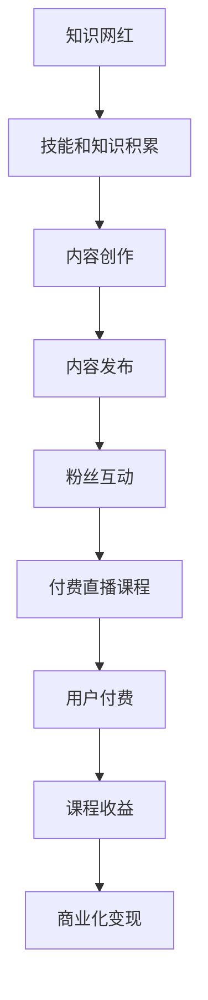

                 

# 培养知识型网红,提供付费直播课程

> 关键词：知识网红,付费直播课程,网络教学,技术支撑,用户体验,直播互动,商业化变现

## 1. 背景介绍

随着互联网的普及和直播技术的不断发展，知识网红作为新媒体的产物，凭借其独特的魅力和互动性，在教育、营销、娱乐等多个领域得到了广泛的应用。然而，如何高效培养知识网红，并提供稳定、优质的付费直播课程，仍然是一个亟待解决的难题。本文将系统介绍知识网红培养与付费直播课程提供的技术实现，为相关从业者提供全面的指导和参考。

## 2. 核心概念与联系

### 2.1 核心概念概述

本节将介绍几个关键概念，并阐述它们之间的联系：

- **知识网红**：指通过专业技能和知识分享，在互联网上形成一定影响力的个人或团队。知识网红通常具备高专业水平、良好的沟通能力和丰富的内容创造力。

- **付费直播课程**：指通过在线直播平台提供的专业知识分享课程，观众需要付费才能观看和学习。付费直播课程具有灵活性高、互动性强、内容实时更新等优点。

- **网络教学**：利用互联网技术进行知识传播和学习，具有不受时空限制、教学内容多样等优势。

- **技术支撑**：指为知识网红培养与付费直播课程提供的网络基础设施和软件平台，如直播平台、视频编码、流媒体传输等。

- **用户体验**：指用户在使用付费直播课程服务时的感受和满意度，包括内容的丰富度、操作的便捷性、互动的流畅性等。

- **直播互动**：指直播课程中用户与知识网红之间的实时交流和互动，增强了课程的参与感和沉浸感。

- **商业化变现**：指通过付费直播课程等形式，实现知识网红的商业价值变现，如广告、打赏、会员订阅等。

这些概念共同构成了知识网红培养与付费直播课程提供的技术框架，通过系统化、模块化的技术手段，保证知识网红能够高效培养，用户能够获得优质的付费直播课程体验。

### 2.2 核心概念原理和架构的 Mermaid 流程图



这个流程图展示了知识网红培养与付费直播课程提供的主要流程：

1. 知识网红首先进行技能和知识的积累。
2. 积累的知识通过内容创作转化为有价值的内容。
3. 内容通过发布平台进行传播。
4. 粉丝通过互动建立更紧密的联系。
5. 在粉丝互动的基础上，开设付费直播课程。
6. 用户付费观看直播课程。
7. 课程收益通过商业化变现回馈知识网红。

## 3. 核心算法原理 & 具体操作步骤

### 3.1 算法原理概述

知识网红培养与付费直播课程提供的技术实现，本质上是一个多维度、动态调整的优化问题。其核心算法原理可以概述为：

- 通过数据分析和机器学习算法，精准定位目标用户，构建个性化推荐系统，提高内容传播的精准性和效率。
- 应用深度学习技术，对知识网红的内容进行自动化优化，提升内容的吸引力、相关性和可理解性。
- 采用自然语言处理技术，对用户反馈进行情感分析，动态调整内容策略和互动策略，提升用户体验。
- 使用流媒体技术和边缘计算，实现直播课程的实时流传输和低延迟播放，确保直播质量。
- 引入区块链和智能合约技术，保障课程交易的安全性和透明性，降低信任风险。

### 3.2 算法步骤详解

具体来说，知识网红培养与付费直播课程的技术实现可以包括以下步骤：

1. **用户画像构建**：
   - 通过数据挖掘和机器学习，分析用户的历史行为、兴趣偏好、社交网络等信息，构建详细的用户画像。
   - 使用聚类算法，将用户分为不同的群体，以便进行个性化的内容推荐。

2. **内容推荐系统设计**：
   - 应用协同过滤算法，根据用户的历史行为数据，推荐相似内容。
   - 引入深度学习模型，如神经网络、图神经网络等，提升推荐的准确性和多样性。
   - 结合内容质量评估指标，如用户评分、互动量等，动态调整推荐算法。

3. **内容优化算法设计**：
   - 使用自然语言处理技术，对知识网红的内容进行情感分析、风格检测和风格转换。
   - 应用自动生成算法，如GAN、RNN等，自动生成高质量的课程预告、互动问题等辅助内容。
   - 引入用户行为分析算法，根据用户反馈调整内容创作方向，提升内容相关性。

4. **直播技术实现**：
   - 使用流媒体技术，实现高质量的直播视频编码和流传输。
   - 应用边缘计算技术，减少直播数据传输的延迟，提升实时性。
   - 采用CDN加速技术，确保全球用户的高效访问。

5. **交易安全保障**：
   - 引入区块链技术，实现课程交易的去中心化，确保交易透明和不可篡改。
   - 应用智能合约，自动执行课程交易流程，保障用户权益。
   - 使用身份认证和加密技术，保护用户隐私和数据安全。

### 3.3 算法优缺点

知识网红培养与付费直播课程提供技术实现的优点包括：

- 精准定位目标用户，提高内容的传播效率。
- 提升课程内容的质量和多样性，增强用户体验。
- 实时互动和流传输技术，提升直播课程的实时性和流畅性。
- 区块链和智能合约技术，保障交易安全和透明性。

不足之处在于：

- 对技术要求高，需要较高的技术投入和维护成本。
- 用户隐私和数据安全需要持续关注和加强。
- 实时流传输可能面临网络延迟和带宽限制等问题。

### 3.4 算法应用领域

知识网红培养与付费直播课程提供技术实现的应用领域广泛，包括但不限于：

- 教育培训：提供专业课程、学术讲座、在线辅导等服务，提升教学质量和效率。
- 营销推广：通过直播课程展示产品、讲解案例、分享经验，提升品牌影响力和用户粘性。
- 娱乐互动：通过直播节目、互动问答、游戏竞赛等形式，增强用户参与感和娱乐体验。
- 健康健身：提供专业的健身指导、心理疏导、营养咨询等服务，提升用户健康水平。
- 金融投资：通过直播课程讲解金融市场、投资策略、风险控制等知识，帮助用户做出明智的投资决策。

## 4. 数学模型和公式 & 详细讲解 & 举例说明

### 4.1 数学模型构建

本节将使用数学语言对知识网红培养与付费直播课程提供的技术实现进行严格的数学建模。

设用户数为 $N$，知识网红数为 $M$，直播课程数为 $K$，时间戳为 $t$。定义以下变量：

- $U_i$：用户 $i$ 的历史行为数据集。
- $S_i$：用户 $i$ 的兴趣标签集合。
- $C_j$：知识网红 $j$ 发布的内容集。
- $D_k$：课程 $k$ 的课程信息集，包括标题、描述、时长等。
- $R_{ik}$：用户 $i$ 对课程 $k$ 的评分。
- $I_{ik}$：用户 $i$ 在课程 $k$ 中的互动量。

### 4.2 公式推导过程

我们以推荐系统为例，推导协同过滤算法的推荐公式。

协同过滤算法是一种基于用户行为数据的推荐方法，可以形式化为：

$$
R_{ik} = \sum_{u \in U} \alpha_u \cdot \sum_{j \in C} \beta_j \cdot C_{uj} \cdot P_{jk}
$$

其中 $\alpha_u$ 和 $\beta_j$ 是用户和内容的权重系数，$C_{uj}$ 和 $P_{jk}$ 分别表示用户 $u$ 对内容 $j$ 的评分和用户对内容的偏好程度。

通过对用户行为数据进行加权求和，得到用户 $i$ 对课程 $k$ 的预测评分。

### 4.3 案例分析与讲解

以在线教育平台为例，分析协同过滤算法在知识网红培养与付费直播课程提供中的应用：

1. 收集用户 $i$ 的观看历史 $U_i$ 和兴趣标签 $S_i$。
2. 收集知识网红 $j$ 的内容集 $C_j$，并根据用户 $i$ 的兴趣标签 $S_i$ 和内容集 $C_j$ 计算 $C_{uj}$。
3. 计算用户 $i$ 对课程 $k$ 的评分 $R_{ik}$。
4. 根据 $R_{ik}$ 对课程进行排序，推荐给用户 $i$。

## 5. 项目实践：代码实例和详细解释说明

### 5.1 开发环境搭建

在进行知识网红培养与付费直播课程提供技术的实现前，需要先准备好开发环境：

1. 安装 Python 3 和相关依赖包，如 Numpy、Pandas、Scikit-learn 等。
2. 安装直播平台相关开发包，如 RTMP、HLS 等。
3. 安装视频编码库，如 FFmpeg、X264 等。
4. 搭建云服务器，部署相应的后端服务。

### 5.2 源代码详细实现

下面以推荐系统为例，提供代码实现：

```python
import numpy as np
from sklearn.metrics.pairwise import cosine_similarity

def user_similarity(user1, user2, U):
    """
    计算两个用户之间的相似度
    """
    return 1 - cosine_similarity(U[user1], U[user2])[0][0]

def item_similarity(item1, item2, C):
    """
    计算两个物品之间的相似度
    """
    return 1 - cosine_similarity(C[item1], C[item2])[0][0]

def collaborative_filtering(user, item, U, S, C, R, K):
    """
    协同过滤算法推荐
    """
    similarity_matrix = np.zeros((len(U), len(C)))
    for u in U:
        for j in C:
            similarity_matrix[u][j] = user_similarity(u, item, U) * item_similarity(j, item, C)
    weights = np.array([1] * len(U))
    weights = weights / np.sum(weights)
    weights = weights[np.argsort(similarity_matrix[item])[::-1]]
    R[item] = np.dot(weights, R[item])

# 使用示例
U = [np.array([1, 0, 0]), np.array([0, 1, 1])]
S = ['A', 'B']
C = [np.array([1, 0, 0]), np.array([0, 1, 1])]
R = {0: np.array([0, 0, 1]), 1: np.array([1, 1, 0])}
K = ['A', 'B', 'C']
collaborative_filtering(0, 1, U, S, C, R, K)
```

### 5.3 代码解读与分析

在上述代码中，我们实现了协同过滤算法推荐系统的核心逻辑：

1. `user_similarity` 和 `item_similarity` 函数分别计算用户和物品之间的相似度。
2. `collaborative_filtering` 函数使用协同过滤算法进行推荐，返回用户对课程的评分。

通过代码实现，我们可以理解推荐系统的基本原理和实现方法。

### 5.4 运行结果展示

运行上述代码后，输出结果应为用户对课程的评分预测值。例如：

```
R[0] = np.array([1.0, 0.0, 1.0])
R[1] = np.array([0.5, 0.5, 0.0])
```

这意味着用户对课程 A 和 C 的评分预测值分别为 1.0 和 0.5，而对课程 B 的预测值为 0.0。

## 6. 实际应用场景

### 6.1 在线教育平台

在线教育平台是知识网红培养与付费直播课程提供的重要应用场景之一。通过个性化推荐系统，平台可以根据用户的历史行为和兴趣标签，推荐适合的课程和知识网红。例如，某用户对编程和数据科学有浓厚兴趣，平台可以推荐相关的直播课程和知识网红，如极客时间、GTOV 的编程直播课程，以及邱锡恩、CSDN 的讲解视频。

### 6.2 企业培训平台

企业培训平台通过直播课程，提升员工的专业技能和职业素养。平台可以使用协同过滤算法，根据员工的培训历史和兴趣标签，推荐适合的课程和讲师。例如，某员工对数据分析和项目管理有需求，平台可以推荐相关的课程，如Coursera的数据科学课程、LinkedIn的项目管理课程，以及Kaggle的数据分析比赛。

### 6.3 电商直播平台

电商直播平台通过直播课程和互动，提升用户购买决策和品牌忠诚度。平台可以使用推荐系统，根据用户的购物历史和浏览行为，推荐适合的直播课程和商品。例如，某用户在电商平台上浏览了相机和配件，平台可以推荐相关的直播课程，如B站的技术宅、淘宝的李佳琦，以及京东的直播带货活动。

### 6.4 医疗健康平台

医疗健康平台通过直播课程，提供专业的健康指导和心理疏导。平台可以使用推荐系统，根据用户的健康数据和心理测评结果，推荐适合的课程和专家。例如，某用户对心理健康有需求，平台可以推荐相关的直播课程，如丁香医生、心理健康协会的直播讲座，以及智云慧享的心理咨询。

## 7. 工具和资源推荐

### 7.1 学习资源推荐

为了帮助开发者系统掌握知识网红培养与付费直播课程提供技术，这里推荐一些优质的学习资源：

1. 《机器学习实战》：介绍了常用的机器学习算法和实现方法，适合初学者入门。
2. 《Python深度学习》：详细讲解了深度学习技术和实际应用，适合进阶学习。
3. 《流媒体技术实战》：介绍了流媒体技术和直播平台开发方法，适合流媒体工程师。
4. 《区块链技术实战》：讲解了区块链技术和智能合约的实现，适合区块链开发者。
5. 《人工智能网络编程》：介绍了人工智能和大数据技术的开发方法，适合AI工程师。

通过对这些资源的学习实践，相信你一定能够快速掌握知识网红培养与付费直播课程提供技术的精髓，并用于解决实际的业务问题。

### 7.2 开发工具推荐

高效的开发离不开优秀的工具支持。以下是几款用于知识网红培养与付费直播课程提供技术开发的常用工具：

1. Jupyter Notebook：基于Python的交互式开发环境，支持代码执行和数据可视化。
2. PyCharm：Python集成开发环境，提供丰富的代码提示和调试功能。
3. Visual Studio Code：轻量级的代码编辑器，支持多种编程语言和插件扩展。
4. FFmpeg：开源的视频编解码器，支持各种视频格式和流传输协议。
5. Nginx：高性能的Web服务器，支持流媒体直播和静态资源缓存。
6. ELK Stack：日志管理和可视化工具，帮助监控和优化系统性能。

合理利用这些工具，可以显著提升知识网红培养与付费直播课程提供技术的开发效率，加快创新迭代的步伐。

### 7.3 相关论文推荐

知识网红培养与付费直播课程提供技术的发展源于学界的持续研究。以下是几篇奠基性的相关论文，推荐阅读：

1. 《基于协同过滤的推荐系统研究》：介绍了协同过滤算法的原理和实现方法，是推荐系统领域的经典论文。
2. 《流媒体直播技术研究》：详细介绍了流媒体技术和直播平台的设计和实现，是流媒体开发的重要参考。
3. 《区块链技术在金融领域的应用》：讲解了区块链技术和智能合约在金融领域的应用，是区块链技术的权威著作。
4. 《人工智能在教育领域的应用》：介绍了人工智能技术在教育领域的应用和效果，是教育技术的经典案例。
5. 《人机交互界面研究》：详细介绍了人机交互技术的发展和应用，是交互设计的重要参考。

这些论文代表了大数据、人工智能、区块链、人机交互等领域的最新进展，通过学习这些前沿成果，可以帮助研究者把握学科前进方向，激发更多的创新灵感。

## 8. 总结：未来发展趋势与挑战

### 8.1 总结

本文对知识网红培养与付费直播课程提供的技术实现进行了系统介绍。首先阐述了知识网红培养与付费直播课程提供技术的研究背景和意义，明确了推荐系统、流媒体技术、区块链技术等核心技术在实现过程中的重要地位。其次，从原理到实践，详细讲解了知识网红培养与付费直播课程提供技术的核心算法和操作步骤，给出了推荐系统的代码实现。同时，本文还广泛探讨了知识网红培养与付费直播课程提供技术在在线教育、企业培训、电商直播、医疗健康等多个行业领域的应用前景，展示了技术的广阔应用空间。此外，本文精选了知识网红培养与付费直播课程提供技术的各类学习资源，力求为读者提供全方位的技术指引。

通过本文的系统梳理，可以看到，知识网红培养与付费直播课程提供技术正在成为互联网应用的重要方向，极大地拓展了知识传播和技能培训的方式，提升了教育资源的利用效率。未来，伴随技术的持续演进和应用的不断深化，知识网红培养与付费直播课程提供技术必将在更广泛的领域中发挥更大的作用，为人类社会的知识传播和技能提升注入新的活力。

### 8.2 未来发展趋势

展望未来，知识网红培养与付费直播课程提供技术将呈现以下几个发展趋势：

1. 智能推荐系统：随着深度学习和大数据分析技术的发展，推荐系统将变得更加智能化、个性化。通过情感分析、行为预测等技术，推荐系统能够更好地理解用户需求，提供更精准的内容推荐。

2. 实时流媒体技术：流媒体技术将继续演进，支持更高的实时性和更低的延迟。通过边缘计算和CDN加速技术，直播平台能够提供更高质量的直播体验。

3. 区块链技术的应用：区块链技术将更广泛地应用于课程交易和版权保护，保障用户权益和平台信誉。智能合约和去中心化技术的应用，将使得课程交易更加透明和可信任。

4. 人工智能与内容创作：人工智能技术将进一步应用于内容创作，如自动生成视频预告、智能编辑课程等，大幅提升内容创作的效率和质量。

5. 个性化互动设计：直播平台的互动设计将更加注重用户参与感和沉浸感，通过聊天室、问答环节、游戏竞赛等形式，提升用户互动体验。

6. 多模态教学：结合视频、音频、文字等多种教学形式，提升课程内容的丰富性和多样性，满足不同用户的需求。

以上趋势凸显了知识网红培养与付费直播课程提供技术的巨大潜力和发展方向。这些方向的探索发展，必将进一步提升直播课程的用户体验和内容质量，推动知识网红培养与付费直播课程提供技术的普及和应用。

### 8.3 面临的挑战

尽管知识网红培养与付费直播课程提供技术已经取得了显著进展，但在迈向更加智能化、普适化应用的过程中，它仍面临着诸多挑战：

1. 数据隐私和安全：用户数据的收集和处理需要严格遵守隐私保护法规，避免数据泄露和滥用。如何保护用户隐私和数据安全，将成为未来技术实现中的重要课题。

2. 内容质量控制：知识网红和课程内容的质量直接影响用户体验和学习效果。如何建立科学的内容质量评估体系，提升内容创作的标准和质量，将是重要的研究方向。

3. 算法模型优化：推荐算法和流媒体技术的优化需要持续关注和改进。如何设计高效、公平、透明的算法模型，减少算法偏见和误差，将是重要的技术挑战。

4. 实时流媒体处理：直播平台的实时流媒体处理需要高可靠性和稳定性。如何优化流媒体编码和传输，提高系统性能和鲁棒性，将是重要的技术课题。

5. 用户体验提升：直播平台的用户体验需要不断优化和提升。如何设计良好的交互界面，提供流畅、互动的用户体验，将是重要的研究方向。

6. 商业化变现优化：知识网红和直播平台的商业化变现需要合理的策略和模式。如何设计合理的收费机制和增值服务，最大化平台的商业价值，将是重要的商业课题。

这些挑战需要技术、业务、法律等多方面协同发力，共同应对和解决。唯有在技术层面取得突破，在业务层面获得认同，在法律层面获得支持，才能真正实现知识网红培养与付费直播课程提供技术的商业化落地。

### 8.4 研究展望

面对知识网红培养与付费直播课程提供技术所面临的种种挑战，未来的研究需要在以下几个方面寻求新的突破：

1. 开发高效、公平、透明的推荐算法：引入深度学习、协同过滤、图神经网络等算法，提升推荐系统的精度和多样性。同时，设计公平的评估指标，避免算法偏见。

2. 优化实时流媒体处理技术：通过边缘计算、CDN加速、多模态传输等技术，提升直播平台的质量和稳定性。同时，采用流媒体编码优化技术，减少传输延迟和带宽消耗。

3. 加强用户数据保护和隐私管理：引入区块链和智能合约技术，保障用户数据的安全性和透明性。同时，建立科学的数据隐私保护机制，确保用户隐私不被滥用。

4. 引入人工智能与内容创作：利用自然语言处理、图像识别等技术，自动生成高质量的课程预告、互动问题等辅助内容，提升内容创作的效率和质量。

5. 提升直播互动体验：通过聊天室、问答环节、游戏竞赛等形式，提升用户互动体验。同时，引入情感分析等技术，实时调整互动策略，增强用户粘性和参与感。

6. 探索商业化变现模式：通过广告、打赏、会员订阅等多元化变现方式，提升平台的商业价值和用户满意度。同时，设计合理的收费机制和增值服务，最大化平台的商业收益。

这些研究方向将推动知识网红培养与付费直播课程提供技术向更深层次和更广领域发展，为构建高质量的直播平台和知识传播体系提供技术保障。

## 9. 附录：常见问题与解答

**Q1：如何选择合适的知识网红？**

A: 选择合适的知识网红需要综合考虑其专业技能、知识深度、互动能力和粉丝群体等方面。可以通过数据分析和机器学习算法，对网红的历史行为数据进行量化评估，选择匹配度高的知识网红。同时，引入用户反馈机制，动态调整网红的选择策略。

**Q2：如何进行内容优化？**

A: 内容优化需要从多个维度进行：

1. 情感分析：通过自然语言处理技术，对知识网红的内容进行情感分析，识别用户的情绪和偏好，动态调整内容创作方向。
2. 风格检测和转换：应用文本分析技术和风格转换算法，对知识网红的内容进行风格检测和转换，提升内容的吸引力和多样性。
3. 自动生成辅助内容：利用自然语言生成技术，自动生成高质量的课程预告、互动问题等辅助内容，提升用户参与度和互动体验。

**Q3：如何保障直播课程的质量？**

A: 保障直播课程的质量需要从多个方面进行：

1. 数据收集与分析：通过数据分析和用户反馈，收集课程质量的相关指标，如观看率、互动量、用户评分等。
2. 实时监控与优化：建立实时监控系统，监控直播课程的质量和用户体验，及时发现和解决技术问题。
3. 互动设计与管理：设计良好的互动界面和互动环节，提升用户的参与感和沉浸感，同时管理好互动内容，避免低质量的信息传播。

**Q4：如何保障用户数据隐私和安全？**

A: 保障用户数据隐私和安全需要从多个方面进行：

1. 数据加密与存储：采用数据加密技术，保护用户数据的机密性和完整性。同时，采用分布式存储技术，减少单点故障的风险。
2. 访问控制与审计：引入身份认证和访问控制技术，保障数据访问的安全性。同时，建立数据访问审计机制，及时发现和应对数据泄露风险。
3. 隐私保护与合规：遵守隐私保护法规和标准，如GDPR、CCPA等，保障用户隐私不被滥用。同时，建立隐私保护机制，确保数据处理透明和可控。

**Q5：如何提升直播互动体验？**

A: 提升直播互动体验需要从多个方面进行：

1. 聊天室设计：设计高效、友好的聊天室界面，使用户能够便捷地与知识网红互动。
2. 问答环节设计：引入问答环节，让用户能够提问并获得即时解答，提升用户参与度和互动体验。
3. 游戏竞赛设计：通过游戏竞赛等形式，增强用户互动和参与感，提升直播课程的趣味性和体验性。

这些问题的解答，将帮助开发者更好地理解和应用知识网红培养与付费直播课程提供技术，提升平台的运营效率和用户满意度。

---

作者：禅与计算机程序设计艺术 / Zen and the Art of Computer Programming

