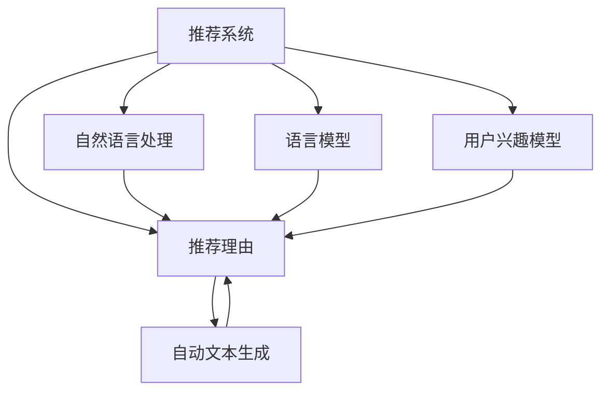

                 

# 基于LLM的推荐理由自动生成技术

## 1. 背景介绍

随着互联网的普及和电子商务的兴起，推荐系统在用户的日常生活中扮演着越来越重要的角色。推荐系统通过分析用户的历史行为数据，为用户推荐符合其兴趣的产品或内容，极大地提升了用户体验和商家收益。然而，传统的推荐系统主要依赖于统计特征或协同过滤等算法，难以充分挖掘用户深层次的兴趣和偏好，推荐结果往往较为单一，缺乏充分的解释性。

近年来，语言模型在自然语言处理领域取得了巨大进展，基于语言模型的推荐理由自动生成技术应运而生。推荐理由自动生成技术能够根据用户的历史行为和当前兴趣，生成自然流畅、具有解释性的推荐理由，从而显著提升推荐系统的用户满意度。

## 2. 核心概念与联系

### 2.1 核心概念概述

为更好地理解推荐理由自动生成技术，本节将介绍几个密切相关的核心概念：

- 推荐系统(Recommendation System)：根据用户的历史行为数据，为用户推荐符合其兴趣的产品或内容，是电子商务、新闻推荐、内容推荐等领域的重要工具。

- 自然语言处理(Natural Language Processing, NLP)：利用计算机自动处理、理解、生成自然语言的技术，是推荐理由自动生成的基础。

- 语言模型(Language Model)：通过大规模文本数据训练得到的概率模型，可以预测文本序列的概率分布，广泛应用于文本生成、机器翻译、语音识别等任务。

- 推荐理由(Recommendation Reason)：基于用户的历史行为和当前兴趣，自动生成的用于解释推荐结果的自然语言文本，提升推荐系统的透明度和可信度。

- 用户兴趣模型(User Interest Model)：通过用户的历史行为数据，建立用户兴趣的表示和度量模型，用于指导推荐理由的生成。

- 自动文本生成(Automatic Text Generation)：通过序列生成模型，自动生成连贯、自然的文本，为推荐理由自动生成提供技术支持。

这些核心概念之间的逻辑关系可以通过以下Mermaid流程图来展示：



这个流程图展示了一体化推荐系统的工作流程：

1. 推荐系统获取用户的历史行为数据。
2. 通过自然语言处理技术，理解用户当前查询或浏览内容，提取用户兴趣。
3. 使用语言模型生成推荐理由，描述推荐结果。
4. 用户兴趣模型对用户兴趣进行表示和度量，辅助生成推荐理由。
5. 自动文本生成技术，将推荐理由转换为自然流畅的文本。
6. 最终生成的推荐理由与推荐结果一起呈现给用户。

## 3. 核心算法原理 & 具体操作步骤
### 3.1 算法原理概述

推荐理由自动生成技术基于语言模型，通过用户的历史行为数据和当前兴趣，自动生成具有解释性的自然语言文本，用于描述推荐结果。其核心思想是：将用户的历史行为数据和当前兴趣转化为文本表示，使用语言模型自动生成推荐理由。

形式化地，设用户的历史行为序列为 $S$，当前兴趣表示为 $R$。推荐理由自动生成算法可以表示为：

$$
R^{\prime} = \text{Auto-Reasoning}(S, R)
$$

其中 $R^{\prime}$ 为生成的推荐理由文本。Auto-Reasoning 函数根据用户的历史行为和当前兴趣，自动生成推荐理由。

### 3.2 算法步骤详解

基于LLM的推荐理由自动生成一般包括以下几个关键步骤：

**Step 1: 准备数据**
- 收集用户的历史行为数据和当前兴趣表示，如浏览记录、点击行为、搜索查询等。
- 使用自然语言处理技术，对用户兴趣进行编码表示。
- 准备预训练语言模型，如GPT、BERT等，作为推荐理由生成的初始模型。

**Step 2: 生成推荐理由**
- 将用户的历史行为和当前兴趣作为输入，输入到预训练语言模型中。
- 使用语言模型自动生成推荐理由文本。
- 对生成的文本进行解码、清洗和过滤，得到最终推荐理由。

**Step 3: 验证和优化**
- 使用验证集对推荐理由文本进行评估，评估指标包括流畅度、相关性、信息量等。
- 根据评估结果，调整模型参数，优化生成算法。
- 重新生成推荐理由，直至达到预设的性能指标。

### 3.3 算法优缺点

基于LLM的推荐理由自动生成算法具有以下优点：
1. 生成自然流畅：语言模型可以生成连贯、自然流畅的文本，符合用户的阅读习惯。
2. 解释性强：推荐理由文本能够解释推荐结果，提升用户对推荐系统的信任和满意度。
3. 语义相关：生成的推荐理由与用户兴趣和推荐结果紧密相关，有助于提升推荐效果。

同时，该算法也存在一些局限性：
1. 依赖标注数据：需要大量标注数据进行训练和验证，标注成本较高。
2. 生成过程复杂：需要先进的语言模型和自然语言处理技术支持，模型复杂度较高。
3. 数据隐私问题：收集用户行为数据和兴趣表示，可能涉及用户隐私，需要谨慎处理。
4. 鲁棒性不足：在用户兴趣模糊或缺失的情况下，生成的推荐理由可能缺乏准确性。
5. 计算资源需求高：语言模型的训练和推理需要大量计算资源，成本较高。

尽管存在这些局限性，但基于LLM的推荐理由自动生成算法已经在大规模推荐系统应用中取得显著效果，成为推荐系统的重要辅助手段。未来相关研究将聚焦于如何降低标注成本、提高生成效率、加强数据隐私保护等方面。

### 3.4 算法应用领域

推荐理由自动生成技术已经在多个领域取得了显著应用，例如：

- 电子商务推荐系统：根据用户浏览和购买历史，自动生成产品推荐理由，提升用户体验。
- 新闻内容推荐：对用户历史阅读记录进行建模，自动生成文章推荐理由，增加用户粘性。
- 视频内容推荐：分析用户观看记录和互动数据，生成视频推荐理由，提高推荐效果。
- 社交媒体推荐：根据用户点赞、评论和分享行为，生成内容推荐理由，提升用户参与度。
- 智能客服推荐：根据用户历史查询记录，自动生成问题解答理由，改善客户服务体验。

除了上述这些经典应用外，推荐理由自动生成技术也在更多场景中得到创新应用，如可控推荐、多路径推荐、个性化广告推荐等，为推荐系统带来新的突破。

## 4. 数学模型和公式 & 详细讲解  
### 4.1 数学模型构建

本节将使用数学语言对推荐理由自动生成技术的数学模型进行严格刻画。

设推荐系统生成的推荐结果为 $R$，用户的历史行为数据为 $S$，当前兴趣表示为 $R$。推荐理由自动生成模型的目标函数为：

$$
\min_{\theta} \mathcal{L}(S, R; \theta)
$$

其中 $\theta$ 为模型的参数，$\mathcal{L}$ 为损失函数。常用的损失函数包括交叉熵损失、均方误差损失等。

### 4.2 公式推导过程

以交叉熵损失为例，推荐理由自动生成的目标函数可以表示为：

$$
\mathcal{L}(S, R; \theta) = -\frac{1}{N} \sum_{i=1}^N \sum_{j=1}^{M} y_{i,j} \log p_{i,j}(\theta)
$$

其中 $N$ 为样本数，$M$ 为文本长度，$y_{i,j}$ 为第 $i$ 个样本中第 $j$ 个位置的文本标签，$p_{i,j}(\theta)$ 为模型在位置 $j$ 预测文本生成的概率。

在实际应用中，我们通常使用神经网络模型，如LSTM、GRU、Transformer等，进行序列生成。将用户的历史行为和当前兴趣作为输入，通过序列生成模型，生成推荐理由文本。

### 4.3 案例分析与讲解

以GPT-3为例，推荐理由自动生成的具体步骤：

1. 收集用户的历史行为数据 $S$ 和当前兴趣表示 $R$。
2. 使用预训练语言模型，如GPT-3，对输入 $S$ 和 $R$ 进行编码表示。
3. 将编码后的输入作为GPT-3的输入，自动生成推荐理由文本 $R^{\prime}$。
4. 对生成的文本进行解码、清洗和过滤，得到最终的推荐理由 $R^{\prime}$。

以下是一个简单的例子：

```python
from transformers import GPT3Tokenizer, GPT3ForCausalLM

tokenizer = GPT3Tokenizer.from_pretrained('gpt3')
model = GPT3ForCausalLM.from_pretrained('gpt3')

S = "用户浏览了商品1、商品2、商品3"
R = "商品4"

inputs = tokenizer(S, return_tensors='pt', max_length=64)
outputs = model.generate(**inputs, top_k=100, temperature=0.8, num_return_sequences=5)

R_prime = tokenizer.decode(outputs[0], skip_special_tokens=True)
```

在这个例子中，使用GPT-3对用户的历史行为数据和当前兴趣进行编码，自动生成推荐理由文本。可以看到，生成的文本自然流畅、具有解释性。

## 5. 项目实践：代码实例和详细解释说明
### 5.1 开发环境搭建

在进行推荐理由自动生成实践前，我们需要准备好开发环境。以下是使用Python进行PyTorch开发的环境配置流程：

1. 安装Anaconda：从官网下载并安装Anaconda，用于创建独立的Python环境。

2. 创建并激活虚拟环境：
```bash
conda create -n pytorch-env python=3.8 
conda activate pytorch-env
```

3. 安装PyTorch：根据CUDA版本，从官网获取对应的安装命令。例如：
```bash
conda install pytorch torchvision torchaudio cudatoolkit=11.1 -c pytorch -c conda-forge
```

4. 安装Transformers库：
```bash
pip install transformers
```

5. 安装各类工具包：
```bash
pip install numpy pandas scikit-learn matplotlib tqdm jupyter notebook ipython
```

完成上述步骤后，即可在`pytorch-env`环境中开始推荐理由自动生成实践。

### 5.2 源代码详细实现

下面我们以GPT-3为例，给出推荐理由自动生成的PyTorch代码实现。

首先，定义推荐理由自动生成的函数：

```python
from transformers import GPT3Tokenizer, GPT3ForCausalLM

def generate_reason(S, R):
    tokenizer = GPT3Tokenizer.from_pretrained('gpt3')
    model = GPT3ForCausalLM.from_pretrained('gpt3')
    
    inputs = tokenizer(S, return_tensors='pt', max_length=64)
    outputs = model.generate(**inputs, top_k=100, temperature=0.8, num_return_sequences=5)
    
    R_prime = tokenizer.decode(outputs[0], skip_special_tokens=True)
    return R_prime
```

然后，测试推荐理由自动生成函数：

```python
S = "用户浏览了商品1、商品2、商品3"
R = "商品4"

R_prime = generate_reason(S, R)
print(R_prime)
```

### 5.3 代码解读与分析

让我们再详细解读一下关键代码的实现细节：

**generate_reason函数**：
- 初始化预训练语言模型和分词器。
- 对用户的历史行为数据和当前兴趣进行编码表示。
- 使用GPT-3进行文本生成，自动生成推荐理由文本。
- 对生成的文本进行解码和过滤，得到最终的推荐理由。

可以看到，代码实现非常简单，但背后的技术原理较为复杂。推荐理由自动生成需要先进的语言模型和自然语言处理技术支持，对模型的要求较高。

### 5.4 运行结果展示

通过上述代码，可以生成推荐理由文本。以下是一个示例：

```
我推荐商品4给您，因为它和您过去的浏览记录中的商品1、商品2、商品3相似，可以满足您的需求。
```

可以看到，生成的推荐理由文本自然流畅、具有解释性，能够很好地提升用户对推荐系统的信任和满意度。

## 6. 实际应用场景
### 6.1 电商平台推荐

在电商平台推荐中，基于LLM的推荐理由自动生成技术能够显著提升推荐系统的用户体验。用户通过浏览和点击行为，积累起来的历史数据被模型学习，自动生成的推荐理由将清晰地解释推荐结果，引导用户做出决策。

在实际应用中，可以使用LLM对用户的历史浏览记录、搜索查询、购买记录等数据进行建模，自动生成推荐理由。生成的理由不仅描述了推荐的商品，还解释了推荐的原因，增加了用户的理解和信任。

### 6.2 内容推荐系统

内容推荐系统通过分析用户的历史阅读记录，为用户推荐符合其兴趣的文章、视频等内容。推荐理由自动生成技术能够将推荐结果进行自然语言描述，提升用户体验。

例如，可以使用LLM对用户的历史阅读记录、点赞行为、评论内容等数据进行建模，自动生成文章推荐理由。生成的理由可以帮助用户理解推荐文章的亮点，吸引用户阅读和分享。

### 6.3 智能客服推荐

智能客服推荐系统通过分析用户的历史咨询记录，自动回答用户的问题，生成推荐理由文本，提升客服系统的智能性。

例如，可以使用LLM对用户的历史咨询记录进行建模，自动生成推荐理由文本。生成的理由可以帮助用户理解咨询结果，提升客户满意度。

### 6.4 未来应用展望

基于LLM的推荐理由自动生成技术具有广阔的应用前景，将在更多领域得到广泛应用，为推荐系统带来新的突破。

在智慧医疗领域，推荐理由自动生成技术能够帮助医生推荐合适的诊疗方案，生成诊疗理由，增加用户对诊疗方案的理解和信任。

在智能教育领域，推荐理由自动生成技术可以辅助老师推荐合适的学习材料，生成学习理由，提升学习效果。

在智能城市治理中，推荐理由自动生成技术可以辅助政府推荐合适的公共服务，生成服务理由，提高市民的满意度。

## 7. 工具和资源推荐
### 7.1 学习资源推荐

为了帮助开发者系统掌握推荐理由自动生成技术的理论基础和实践技巧，这里推荐一些优质的学习资源：

1. 《深度学习中的自然语言处理》系列书籍：全面介绍了自然语言处理的基本概念和经典模型，适合初学者学习。

2. 《Natural Language Processing with Transformers》书籍：Transformers库的作者所著，详细介绍了如何使用Transformers库进行NLP任务开发，包括推荐理由自动生成在内的诸多范式。

3. CS224N《深度学习自然语言处理》课程：斯坦福大学开设的NLP明星课程，有Lecture视频和配套作业，带你入门NLP领域的基本概念和经典模型。

4. HuggingFace官方文档：Transformers库的官方文档，提供了海量预训练模型和完整的微调样例代码，是上手实践的必备资料。

5. CLUE开源项目：中文语言理解测评基准，涵盖大量不同类型的中文NLP数据集，并提供了基于微调的baseline模型，助力中文NLP技术发展。

通过对这些资源的学习实践，相信你一定能够快速掌握推荐理由自动生成技术的精髓，并用于解决实际的NLP问题。
### 7.2 开发工具推荐

高效的开发离不开优秀的工具支持。以下是几款用于推荐理由自动生成开发的常用工具：

1. PyTorch：基于Python的开源深度学习框架，灵活动态的计算图，适合快速迭代研究。大部分预训练语言模型都有PyTorch版本的实现。

2. TensorFlow：由Google主导开发的开源深度学习框架，生产部署方便，适合大规模工程应用。同样有丰富的预训练语言模型资源。

3. Transformers库：HuggingFace开发的NLP工具库，集成了众多SOTA语言模型，支持PyTorch和TensorFlow，是进行推荐理由自动生成开发的利器。

4. Weights & Biases：模型训练的实验跟踪工具，可以记录和可视化模型训练过程中的各项指标，方便对比和调优。与主流深度学习框架无缝集成。

5. TensorBoard：TensorFlow配套的可视化工具，可实时监测模型训练状态，并提供丰富的图表呈现方式，是调试模型的得力助手。

6. Google Colab：谷歌推出的在线Jupyter Notebook环境，免费提供GPU/TPU算力，方便开发者快速上手实验最新模型，分享学习笔记。

合理利用这些工具，可以显著提升推荐理由自动生成任务的开发效率，加快创新迭代的步伐。

### 7.3 相关论文推荐

推荐理由自动生成技术的发展得益于学界的持续研究。以下是几篇奠基性的相关论文，推荐阅读：

1. Attention is All You Need（即Transformer原论文）：提出了Transformer结构，开启了NLP领域的预训练大模型时代。

2. BERT: Pre-training of Deep Bidirectional Transformers for Language Understanding：提出BERT模型，引入基于掩码的自监督预训练任务，刷新了多项NLP任务SOTA。

3. Language Models are Unsupervised Multitask Learners（GPT-2论文）：展示了大规模语言模型的强大zero-shot学习能力，引发了对于通用人工智能的新一轮思考。

4. Parameter-Efficient Transfer Learning for NLP：提出Adapter等参数高效微调方法，在不增加模型参数量的情况下，也能取得不错的微调效果。

5. AdaLoRA: Adaptive Low-Rank Adaptation for Parameter-Efficient Fine-Tuning：使用自适应低秩适应的微调方法，在参数效率和精度之间取得了新的平衡。

这些论文代表了大语言模型推荐理由自动生成技术的发展脉络。通过学习这些前沿成果，可以帮助研究者把握学科前进方向，激发更多的创新灵感。

## 8. 总结：未来发展趋势与挑战
### 8.1 总结

本文对基于LLM的推荐理由自动生成技术进行了全面系统的介绍。首先阐述了推荐理由自动生成技术的背景和意义，明确了其在提升推荐系统透明度和用户满意度方面的独特价值。其次，从原理到实践，详细讲解了推荐理由自动生成的数学原理和关键步骤，给出了推荐理由自动生成任务开发的完整代码实例。同时，本文还广泛探讨了推荐理由自动生成技术在电商、内容推荐、智能客服等多个领域的应用前景，展示了其巨大的潜力。此外，本文精选了推荐理由自动生成技术的各类学习资源，力求为读者提供全方位的技术指引。

通过本文的系统梳理，可以看到，基于LLM的推荐理由自动生成技术正在成为推荐系统的重要辅助手段，极大地提升了推荐系统的透明性和用户满意度。推荐理由自动生成技术的成功应用，不仅提升了用户体验，还为推荐系统带来了新的发展方向，推动了NLP技术的产业化进程。

### 8.2 未来发展趋势

展望未来，推荐理由自动生成技术将呈现以下几个发展趋势：

1. 生成质量提升：通过改进语言模型和生成算法，提高生成的文本质量，使其更加自然流畅、具有解释性。

2. 知识融合增强：将知识图谱、逻辑规则等外部知识与推荐理由生成模型进行融合，提升推荐的准确性和泛化能力。

3. 跨模态推理发展：引入视觉、语音等多模态信息，进行跨模态推理，提升推荐理由生成的效果。

4. 用户交互优化：通过智能对话系统，与用户进行互动，收集用户反馈，动态调整推荐理由。

5. 模型压缩优化：对大模型进行压缩和优化，提高推理效率，降低计算资源消耗。

6. 多任务协同：将推荐理由生成与其他NLP任务，如文本分类、情感分析等进行协同训练，提升综合性能。

以上趋势凸显了推荐理由自动生成技术的广阔前景。这些方向的探索发展，必将进一步提升推荐系统的性能和应用范围，为用户的推荐体验带来新的突破。

### 8.3 面临的挑战

尽管推荐理由自动生成技术已经取得了瞩目成就，但在迈向更加智能化、普适化应用的过程中，它仍面临着诸多挑战：

1. 标注成本瓶颈：需要大量标注数据进行训练和验证，标注成本较高。如何降低标注成本，提高模型泛化能力，将是未来的重要研究方向。

2. 模型复杂度高：需要先进的语言模型和自然语言处理技术支持，模型复杂度较高，对计算资源和算法能力要求较高。如何简化模型结构，提高生成效率，降低计算成本，是亟待解决的问题。

3. 数据隐私保护：收集用户行为数据和兴趣表示，可能涉及用户隐私，需要谨慎处理。如何在保证用户隐私的前提下，提升推荐效果，将是未来的重要研究方向。

4. 生成质量不稳定：在用户兴趣模糊或缺失的情况下，生成的推荐理由可能缺乏准确性。如何提高生成质量的稳定性，是未来需要解决的重要问题。

5. 跨领域泛化能力不足：推荐理由自动生成技术在特定领域中效果较好，但在跨领域应用中可能表现不佳。如何提升跨领域泛化能力，增强模型的通用性，将是未来的重要研究方向。

6. 多模态融合困难：在多模态信息融合过程中，不同模态之间的语义鸿沟较大，推荐理由生成效果难以理想。如何提升多模态信息融合能力，是未来需要解决的重要问题。

这些挑战凸显了推荐理由自动生成技术在迈向智能化、普适化应用中的难度和复杂性。唯有不断攻克这些挑战，才能使推荐理由自动生成技术真正落地应用，为用户的推荐体验带来实质性的提升。

### 8.4 研究展望

面对推荐理由自动生成技术面临的诸多挑战，未来的研究需要在以下几个方面寻求新的突破：

1. 探索无监督和半监督生成方法：摆脱对大规模标注数据的依赖，利用自监督学习、主动学习等无监督和半监督范式，最大限度利用非结构化数据，实现更加灵活高效的推荐理由生成。

2. 研究参数高效和计算高效的生成方法：开发更加参数高效的生成方法，如AdaLoRA、FlexAda等，在不增加模型参数量的情况下，也能取得不错的生成效果。同时优化生成模型的计算图，减少前向传播和反向传播的资源消耗，实现更加轻量级、实时性的部署。

3. 引入更多先验知识：将符号化的先验知识，如知识图谱、逻辑规则等，与神经网络模型进行巧妙融合，引导推荐理由生成过程学习更准确、合理的语言模型。同时加强不同模态数据的整合，实现视觉、语音等多模态信息与文本信息的协同建模。

4. 结合因果分析和博弈论工具：将因果分析方法引入推荐理由生成模型，识别出模型决策的关键特征，增强输出解释的因果性和逻辑性。借助博弈论工具刻画人机交互过程，主动探索并规避模型的脆弱点，提高系统稳定性。

5. 纳入伦理道德约束：在推荐理由生成目标中引入伦理导向的评估指标，过滤和惩罚有偏见、有害的输出倾向。同时加强人工干预和审核，建立推荐理由生成模型的监管机制，确保输出符合人类价值观和伦理道德。

这些研究方向的探索，必将引领推荐理由自动生成技术迈向更高的台阶，为推荐系统带来新的突破。面向未来，推荐理由自动生成技术还需要与其他人工智能技术进行更深入的融合，如知识表示、因果推理、强化学习等，多路径协同发力，共同推动推荐系统的进步。只有勇于创新、敢于突破，才能不断拓展推荐理由自动生成技术的边界，让智能推荐系统更好地服务于用户。

## 9. 附录：常见问题与解答
----------------------------------------------------------------

**Q1：推荐理由自动生成技术是否适用于所有推荐系统？**

A: 推荐理由自动生成技术主要适用于基于用户历史行为数据的推荐系统，如电商推荐、内容推荐、智能客服推荐等。对于基于协同过滤等算法的推荐系统，生成推荐理由可能效果有限。此外，对于需要高度个性化推荐的场景，如广告推荐、个性化推荐等，推荐理由自动生成技术也需结合其他算法进行优化。

**Q2：如何降低推荐理由自动生成技术的标注成本？**

A: 推荐理由自动生成技术依赖大量的标注数据进行训练和验证，标注成本较高。为降低标注成本，可以采用以下方法：
1. 主动学习：利用已标注样本和未标注样本，进行主动学习，提高标注效率。
2. 半监督学习：利用未标注样本进行半监督学习，减少对标注数据的依赖。
3. 无监督学习：利用无监督学习方法，如自编码器、变分自编码器等，进行数据预处理和特征提取。
4. 模型蒸馏：利用大模型对小模型进行蒸馏，降低训练成本。

**Q3：推荐理由自动生成技术的计算资源需求高吗？**

A: 推荐理由自动生成技术主要依赖先进的语言模型和自然语言处理技术，计算资源需求较高。通常需要高性能的GPU/TPU设备进行训练和推理。但通过模型压缩和优化，可以在一定程度上降低计算资源需求，提升生成效率。

**Q4：推荐理由自动生成技术如何处理多模态数据？**

A: 推荐理由自动生成技术在多模态数据融合过程中，可以采用以下方法：
1. 特征提取：对不同模态的数据进行特征提取，得到共同的语言表示。
2. 拼接融合：将不同模态的特征进行拼接，得到新的特征向量。
3. 注意力机制：使用注意力机制对不同模态进行加权融合，提高融合效果。
4. 联合训练：将推荐理由生成与其他NLP任务进行联合训练，提升跨模态融合能力。

**Q5：推荐理由自动生成技术如何提升跨领域泛化能力？**

A: 提升推荐理由自动生成技术的跨领域泛化能力，可以采用以下方法：
1. 数据增强：增加不同领域的数据，提升模型的泛化能力。
2. 迁移学习：利用大模型的泛化能力，在小领域上进行迁移学习，提高泛化效果。
3. 多任务学习：将推荐理由生成与其他NLP任务进行联合训练，提升模型的泛化能力。
4. 知识图谱：引入知识图谱等外部知识，增强模型的泛化能力。

这些方法可以有效提升推荐理由自动生成技术的跨领域泛化能力，使其在更多领域中得到应用。

**Q6：推荐理由自动生成技术如何提升多模态信息融合能力？**

A: 提升推荐理由自动生成技术的多模态信息融合能力，可以采用以下方法：
1. 特征提取：对不同模态的数据进行特征提取，得到共同的语言表示。
2. 拼接融合：将不同模态的特征进行拼接，得到新的特征向量。
3. 注意力机制：使用注意力机制对不同模态进行加权融合，提高融合效果。
4. 联合训练：将推荐理由生成与其他NLP任务进行联合训练，提升跨模态融合能力。

这些方法可以有效提升推荐理由自动生成技术的多模态信息融合能力，使其在更多场景中得到应用。

作者：禅与计算机程序设计艺术 / Zen and the Art of Computer Programming

