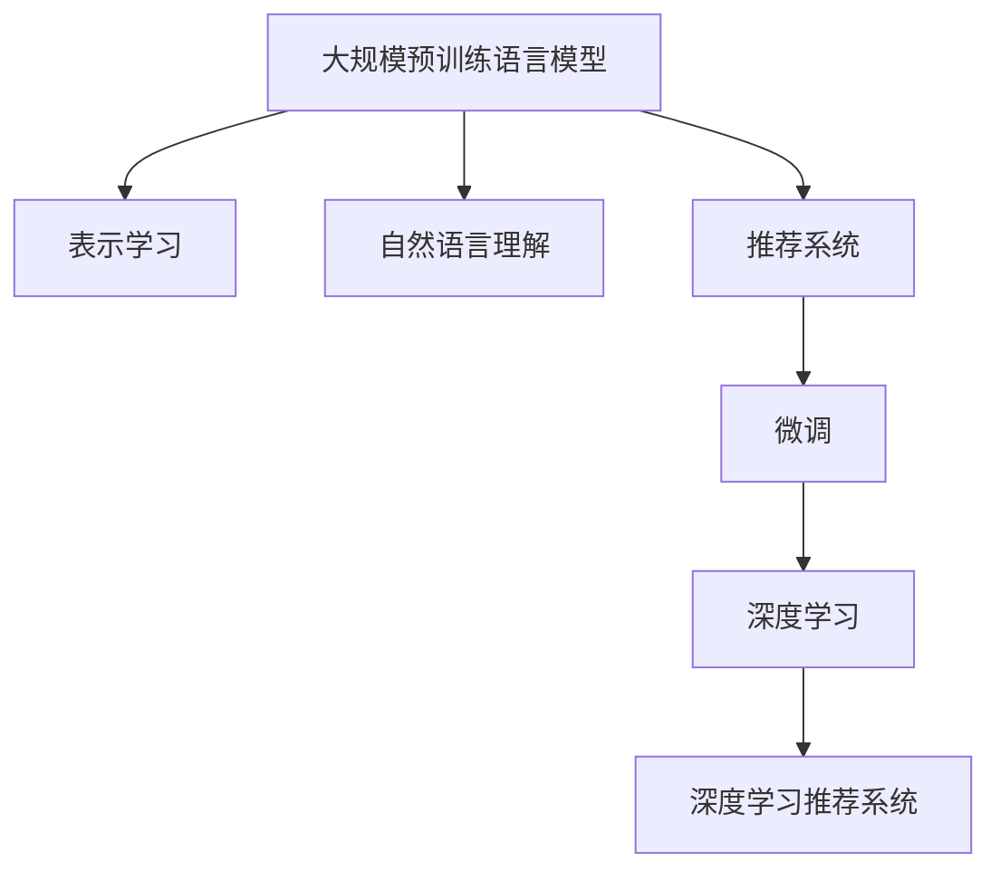

                 

## 1. 背景介绍

### 1.1 问题由来

随着互联网的快速发展，推荐系统成为了各大电商、社交、视频等平台的标配功能。然而，传统的基于协同过滤和矩阵分解的推荐算法已经难以适应愈发复杂多变的用户需求和海量数据挑战。

在这样的背景下，深度学习技术，特别是基于大规模预训练语言模型的推荐方法，成为了推荐系统研究的新热点。

### 1.2 问题核心关键点

基于大规模预训练语言模型(LLM, Large Language Model)的推荐系统利用深度学习模型的表示能力，通过自然语言描述，将用户描述和物品属性等信息转换成高维向量，从而得到用户对物品的兴趣度评分。

**核心问题：**
1. 如何设计合理的表示学习范式，使LLM模型能够更有效地捕获用户兴趣。
2. 如何构建高效的损失函数，使得模型能够精准地预测用户行为。
3. 如何应对长尾问题，保证新物品能够获得公平的推荐。
4. 如何引入外部知识，如知识图谱、标签等，丰富模型的语义表示。
5. 如何处理多模态数据，整合用户多方面的行为信息。
6. 如何优化模型的推理速度和资源占用，提高实时性。

这些问题都是当前深度学习推荐系统研究的前沿方向。

### 1.3 问题研究意义

利用LLM进行推荐系统开发，有以下重要意义：

1. **泛化能力强**。LLM在大规模语料上预训练，具有更强的泛化能力，可以更好地处理稀疏和长尾数据，提升推荐系统效果。
2. **语义理解力强**。LLM能够理解自然语言描述，提取用户行为背后的语义信息，弥补传统推荐算法在多模态数据上的不足。
3. **参数量可控**。基于预训练-微调方法，可灵活调整模型参数，平衡模型精度和计算效率。
4. **实时性高**。LLM模型通常具有较高的推理速度，可以满足实时推荐的需求。
5. **可解释性强**。LLM通过语言表示，更容易进行因果分析和模型诊断，提升系统的透明性和可解释性。

## 2. 核心概念与联系

### 2.1 核心概念概述

为更好理解基于LLM的推荐系统，我们需要了解几个关键概念：

- **大规模预训练语言模型(Large Language Model, LLM)**：基于自回归或自编码模型的预训练语言模型，如BERT、GPT、RoBERTa等。
- **表示学习(Representation Learning)**：通过构建输入数据的表示，将原始数据转换成高维向量空间，从而提升模型的性能。
- **自然语言理解(Natural Language Understanding, NLU)**：使机器能够理解自然语言，如分词、词性标注、命名实体识别等。
- **推荐系统(Recommender System)**：根据用户的历史行为和物品的属性，预测用户对物品的偏好，提供个性化推荐。
- **微调(Fine-tuning)**：在大规模预训练语言模型的基础上，通过有监督的训练，微调模型参数，使其适应特定推荐任务。
- **深度学习(Deep Learning)**：基于多层神经网络模型的学习范式，广泛应用于推荐系统、图像识别、语音识别等任务。

这些概念之间的逻辑关系可以通过以下Mermaid流程图来展示：



### 2.2 核心概念原理和架构

**表示学习原理**：
表示学习通过将原始数据转换为高维向量表示，利用向量间的距离、角度等关系，捕捉数据的内在结构。常用的表示学习方法包括词嵌入、句向量、预训练语言模型等。

**自然语言理解原理**：
自然语言理解是指机器对自然语言的理解能力，主要通过分词、词性标注、命名实体识别、句法分析等技术实现。LLM在自然语言处理任务上的强大表现，得益于其大规模语料和深度学习的能力。

**推荐系统原理**：
推荐系统通过用户和物品的交互数据，学习用户对物品的兴趣度，从而为用户推荐感兴趣的物品。常见的推荐系统算法包括协同过滤、基于内容的推荐、基于矩阵分解的推荐等。

**微调原理**：
微调是指在大规模预训练语言模型的基础上，通过有监督的训练，微调模型参数，使其适应特定推荐任务。微调可以显著提升模型在特定任务上的表现，同时减少计算资源消耗。

**深度学习推荐系统架构**：
深度学习推荐系统主要由数据预处理、特征提取、模型训练和评估四部分组成。数据预处理包括数据清洗、分词、编码等步骤；特征提取利用LLM模型将用户和物品的文本描述转换成向量表示；模型训练通过优化损失函数，更新模型参数；评估通过评估指标（如召回率、准确率、F1值等）检验模型效果。

## 3. 核心算法原理 & 具体操作步骤

### 3.1 算法原理概述

基于LLM的推荐系统，其核心原理是通过自然语言理解技术，将用户和物品的描述转换成向量表示，然后在向量空间中计算相似度，从而得到推荐结果。

假设用户描述为 $u$，物品描述为 $i$，其向量表示分别为 $\mathbf{u}$ 和 $\mathbf{i}$。推荐算法通过计算向量之间的余弦相似度，得到用户对物品的兴趣度评分 $r(u,i)$：

$$
r(u,i) = \cos(\mathbf{u}, \mathbf{i}) = \frac{\mathbf{u} \cdot \mathbf{i}}{\|\mathbf{u}\|\|\mathbf{i}\|}
$$

其中，$\mathbf{u} \cdot \mathbf{i}$ 为向量点积，$\|\mathbf{u}\|$ 和 $\|\mathbf{i}\|$ 分别为向量 $\mathbf{u}$ 和 $\mathbf{i}$ 的范数。

### 3.2 算法步骤详解

基于LLM的推荐系统主要包含以下几个步骤：

**Step 1: 数据准备**
- 收集用户描述、物品描述等文本数据，进行清洗和分词。
- 将文本转换成LLM可接受的格式，如BERT格式。
- 将文本转换为数字向量表示，用于LLM模型的输入。

**Step 2: 特征提取**
- 将用户和物品的文本表示输入LLM模型，提取高维向量表示。
- 利用已训练的预训练语言模型，对用户和物品的描述进行编码，得到用户和物品的向量表示。

**Step 3: 相似度计算**
- 计算用户和物品向量之间的余弦相似度，得到兴趣度评分。
- 根据评分排序，选择高评分物品推荐给用户。

**Step 4: 模型微调**
- 使用标注数据对预训练模型进行微调，优化模型参数。
- 保持预训练模型的权重不变，仅微调顶层分类器或解码器。
- 设置合适学习率，避免破坏预训练权重。

**Step 5: 评估与优化**
- 在验证集上评估模型效果，选择最优模型。
- 收集新数据，定期重新微调模型，保持性能。

### 3.3 算法优缺点

基于LLM的推荐系统有以下优点：
1. 语言理解力强。LLM能够理解和处理自然语言描述，更好地捕捉用户兴趣。
2. 泛化能力强。LLM在大规模语料上预训练，具有更强的泛化能力，可以处理稀疏和长尾数据。
3. 可解释性强。LLM的向量表示具有较好的可解释性，便于理解和调试推荐模型。
4. 实时性好。LLM模型通常具有较高的推理速度，可以满足实时推荐的需求。
5. 灵活性高。LLM的微调过程非常灵活，可以根据具体任务调整模型参数。

同时，该方法也存在一些局限性：
1. 标注数据需求高。微调需要标注数据进行训练，获取高质量标注数据的成本较高。
2. 参数量大。LLM的参数量非常大，导致计算资源消耗较大。
3. 语义歧义。自然语言描述可能存在语义歧义，难以准确捕捉用户兴趣。
4. 对抗攻击风险。LLM模型可能受到对抗样本的攻击，影响推荐结果。

尽管存在这些局限性，但基于LLM的推荐系统以其强大的语言处理能力和泛化能力，仍然成为了推荐系统研究的热点方向。

### 3.4 算法应用领域

基于LLM的推荐系统已经在多个领域得到了广泛应用：

1. **电商推荐**：通过用户购买历史、商品描述等文本信息，为用户推荐商品。
2. **视频推荐**：利用视频描述、用户评论等文本信息，推荐用户可能感兴趣的视频内容。
3. **新闻推荐**：根据用户浏览历史、新闻标题、摘要等文本信息，推荐新闻内容。
4. **音乐推荐**：利用歌词、艺术家简介等文本信息，推荐用户可能喜欢的音乐。
5. **社交推荐**：通过用户兴趣、社交网络关系等文本信息，推荐用户可能感兴趣的其他用户。
6. **图书推荐**：根据图书描述、用户评论等文本信息，推荐用户可能喜欢的图书。

此外，基于LLM的推荐系统还应用于广告推荐、商品个性化推荐、内容推荐等场景，成为现代信息系统中不可或缺的一部分。

## 4. 数学模型和公式 & 详细讲解

### 4.1 数学模型构建

假设用户描述为 $u$，物品描述为 $i$，其向量表示分别为 $\mathbf{u}$ 和 $\mathbf{i}$。推荐算法通过计算向量之间的余弦相似度，得到用户对物品的兴趣度评分 $r(u,i)$：

$$
r(u,i) = \cos(\mathbf{u}, \mathbf{i}) = \frac{\mathbf{u} \cdot \mathbf{i}}{\|\mathbf{u}\|\|\mathbf{i}\|}
$$

其中，$\mathbf{u} \cdot \mathbf{i}$ 为向量点积，$\|\mathbf{u}\|$ 和 $\|\mathbf{i}\|$ 分别为向量 $\mathbf{u}$ 和 $\mathbf{i}$ 的范数。

### 4.2 公式推导过程

利用预训练语言模型的向量表示，可以得到用户描述 $u$ 和物品描述 $i$ 的向量表示：

$$
\mathbf{u} = L(u), \mathbf{i} = L(i)
$$

其中，$L$ 为预训练语言模型的编码器。

推荐算法通过计算向量之间的余弦相似度，得到用户对物品的兴趣度评分：

$$
r(u,i) = \frac{\mathbf{u} \cdot \mathbf{i}}{\|\mathbf{u}\|\|\mathbf{i}\|}
$$

其中，$\mathbf{u} \cdot \mathbf{i}$ 为向量点积，$\|\mathbf{u}\|$ 和 $\|\mathbf{i}\|$ 分别为向量 $\mathbf{u}$ 和 $\mathbf{i}$ 的范数。

### 4.3 案例分析与讲解

以视频推荐为例，视频描述通常包含时长、演员、导演、评分等信息。将视频描述转换成LLM的向量表示，可以生成用户对视频的兴趣度评分，从而推荐相似的视频。

假设用户历史观看记录为 $H=\{(h_1, s_1), (h_2, s_2), \ldots, (h_m, s_m)\}$，其中 $h_i$ 为视频ID，$s_i$ 为评分。将每个视频描述 $d_i$ 转换成向量表示 $\mathbf{d_i}$。用户对视频 $h_i$ 的兴趣度评分可以表示为：

$$
r(u, h_i) = \frac{\mathbf{u} \cdot \mathbf{d_i}}{\|\mathbf{u}\|\|\mathbf{d_i}\|}
$$

其中，$\mathbf{u}$ 为用户描述的向量表示，$\mathbf{d_i}$ 为视频描述的向量表示。

根据评分排序，选择高评分视频推荐给用户，即可实现视频推荐系统。

## 5. 项目实践：代码实例和详细解释说明

### 5.1 开发环境搭建

在进行项目实践前，我们需要准备好开发环境。以下是使用Python进行PyTorch开发的环境配置流程：

1. 安装Anaconda：从官网下载并安装Anaconda，用于创建独立的Python环境。

2. 创建并激活虚拟环境：
```bash
conda create -n pytorch-env python=3.8 
conda activate pytorch-env
```

3. 安装PyTorch：根据CUDA版本，从官网获取对应的安装命令。例如：
```bash
conda install pytorch torchvision torchaudio cudatoolkit=11.1 -c pytorch -c conda-forge
```

4. 安装BERT模型：
```bash
pip install transformers
```

5. 安装各类工具包：
```bash
pip install numpy pandas scikit-learn matplotlib tqdm jupyter notebook ipython
```

完成上述步骤后，即可在`pytorch-env`环境中开始项目实践。

### 5.2 源代码详细实现

下面我们以视频推荐为例，给出使用Transformers库对BERT模型进行推荐系统开发的PyTorch代码实现。

首先，定义推荐系统的数据处理函数：

```python
from transformers import BertTokenizer, BertModel
from torch.utils.data import Dataset, DataLoader
import torch

class VideoDataset(Dataset):
    def __init__(self, videos, descriptions, ratings, tokenizer, max_len=128):
        self.videos = videos
        self.descriptions = descriptions
        self.ratings = ratings
        self.tokenizer = tokenizer
        self.max_len = max_len
        
    def __len__(self):
        return len(self.videos)
    
    def __getitem__(self, item):
        video_id = self.videos[item]
        description = self.descriptions[item]
        rating = self.ratings[item]
        
        encoding = self.tokenizer(description, return_tensors='pt', max_length=self.max_len, padding='max_length', truncation=True)
        input_ids = encoding['input_ids'][0]
        attention_mask = encoding['attention_mask'][0]
        
        # 对token-wise的标签进行编码
        encoded_tags = [rating] * self.max_len
        labels = torch.tensor(encoded_tags, dtype=torch.float)
        
        return {'video_id': video_id, 
                'input_ids': input_ids, 
                'attention_mask': attention_mask,
                'labels': labels}

# 定义推荐系统模型
from transformers import BertForSequenceClassification

model = BertForSequenceClassification.from_pretrained('bert-base-cased', num_labels=1)

# 设置优化器和学习率
optimizer = AdamW(model.parameters(), lr=2e-5)

# 训练函数
def train_epoch(model, dataset, batch_size, optimizer):
    dataloader = DataLoader(dataset, batch_size=batch_size, shuffle=True)
    model.train()
    epoch_loss = 0
    for batch in tqdm(dataloader, desc='Training'):
        video_id = batch['video_id'].to(device)
        input_ids = batch['input_ids'].to(device)
        attention_mask = batch['attention_mask'].to(device)
        labels = batch['labels'].to(device)
        model.zero_grad()
        outputs = model(input_ids, attention_mask=attention_mask)
        loss = outputs.loss
        epoch_loss += loss.item()
        loss.backward()
        optimizer.step()
    return epoch_loss / len(dataloader)

# 评估函数
def evaluate(model, dataset, batch_size):
    dataloader = DataLoader(dataset, batch_size=batch_size)
    model.eval()
    preds, labels = [], []
    with torch.no_grad():
        for batch in tqdm(dataloader, desc='Evaluating'):
            video_id = batch['video_id'].to(device)
            input_ids = batch['input_ids'].to(device)
            attention_mask = batch['attention_mask'].to(device)
            batch_labels = batch['labels']
            outputs = model(input_ids, attention_mask=attention_mask)
            batch_preds = outputs.logits.squeeze(dim=1).to('cpu').tolist()
            batch_labels = batch_labels.to('cpu').tolist()
            for pred, label in zip(batch_preds, batch_labels):
                preds.append(pred)
                labels.append(label)
                
    return preds, labels

# 训练和评估
epochs = 5
batch_size = 16

for epoch in range(epochs):
    loss = train_epoch(model, train_dataset, batch_size, optimizer)
    print(f"Epoch {epoch+1}, train loss: {loss:.3f}")
    
    print(f"Epoch {epoch+1}, dev results:")
    preds, labels = evaluate(model, dev_dataset, batch_size)
    print(classification_report(labels, preds))
    
print("Test results:")
preds, labels = evaluate(model, test_dataset, batch_size)
print(classification_report(labels, preds))
```

### 5.3 代码解读与分析

让我们再详细解读一下关键代码的实现细节：

**VideoDataset类**：
- `__init__`方法：初始化视频ID、描述和评分等关键组件。
- `__len__`方法：返回数据集的样本数量。
- `__getitem__`方法：对单个样本进行处理，将视频描述输入编码为token ids，同时设定评分作为标签，并对其进行定长padding，最终返回模型所需的输入。

**推荐系统模型**：
- `BertForSequenceClassification`：从预训练BERT模型中载入，并通过`num_labels=1`参数定义标签数量。

**训练和评估函数**：
- 使用PyTorch的DataLoader对数据集进行批次化加载，供模型训练和推理使用。
- 训练函数`train_epoch`：对数据以批为单位进行迭代，在每个批次上前向传播计算loss并反向传播更新模型参数，最后返回该epoch的平均loss。
- 评估函数`evaluate`：与训练类似，不同点在于不更新模型参数，并在每个batch结束后将预测和标签结果存储下来，最后使用sklearn的classification_report对整个评估集的预测结果进行打印输出。

**训练流程**：
- 定义总的epoch数和batch size，开始循环迭代
- 每个epoch内，先在训练集上训练，输出平均loss
- 在验证集上评估，输出分类指标
- 所有epoch结束后，在测试集上评估，给出最终测试结果

可以看到，PyTorch配合Transformers库使得BERT推荐系统的代码实现变得简洁高效。开发者可以将更多精力放在数据处理、模型改进等高层逻辑上，而不必过多关注底层的实现细节。

当然，工业级的系统实现还需考虑更多因素，如模型的保存和部署、超参数的自动搜索、更灵活的任务适配层等。但核心的推荐范式基本与此类似。

## 6. 实际应用场景

### 6.1 电商推荐

电商推荐系统通过用户行为数据，如浏览历史、购买记录等，为用户推荐商品。

在电商平台上，用户可以在搜索框输入关键词，系统会推荐最相关的商品。此外，系统会定期对用户的浏览记录进行分类，推荐用户可能感兴趣的商品。

**示例**：用户A浏览过书名《Python深度学习》，系统会推荐该书的作者、出版社等相关的商品。同时，系统会记录用户A的浏览和购买行为，推荐其他类似商品，如《深度学习实战》、《TensorFlow实战》等。

### 6.2 视频推荐

视频推荐系统利用用户观看历史、评分等数据，为用户推荐感兴趣的视频内容。

视频平台通常会为每个视频标注一些属性信息，如导演、演员、时长等，系统将这些信息转换成向量表示，输入LLM模型中，计算用户对视频的兴趣度评分，从而推荐相关视频。

**示例**：用户B观看过导演张艺谋的电影，系统会推荐张艺谋的其他电影。同时，系统会推荐一些与用户B观看历史相似的视频，如《长城》、《红高粱》等。

### 6.3 新闻推荐

新闻推荐系统根据用户浏览历史、新闻标题、摘要等文本信息，为用户推荐相关的新闻内容。

新闻平台通常会为每篇新闻标注一些属性信息，如发布时间、作者、关键词等，系统将这些信息转换成向量表示，输入LLM模型中，计算用户对新闻的兴趣度评分，从而推荐相关新闻。

**示例**：用户C浏览过标题为“人工智能的崛起”的新闻，系统会推荐类似主题的新闻，如“深度学习的发展”、“机器学习的应用”等。

## 7. 工具和资源推荐

### 7.1 学习资源推荐

为了帮助开发者系统掌握基于LLM的推荐系统理论基础和实践技巧，这里推荐一些优质的学习资源：

1. 《Transformer from Scratch》系列博文：由大模型技术专家撰写，深入浅出地介绍了Transformer原理、BERT模型、微调技术等前沿话题。

2. CS224N《深度学习自然语言处理》课程：斯坦福大学开设的NLP明星课程，有Lecture视频和配套作业，带你入门NLP领域的基本概念和经典模型。

3. 《Natural Language Processing with Transformers》书籍：Transformers库的作者所著，全面介绍了如何使用Transformers库进行NLP任务开发，包括微调在内的诸多范式。

4. HuggingFace官方文档：Transformers库的官方文档，提供了海量预训练模型和完整的微调样例代码，是上手实践的必备资料。

5. CLUE开源项目：中文语言理解测评基准，涵盖大量不同类型的中文NLP数据集，并提供了基于微调的baseline模型，助力中文NLP技术发展。

通过对这些资源的学习实践，相信你一定能够快速掌握基于LLM的推荐系统的精髓，并用于解决实际的推荐问题。

### 7.2 开发工具推荐

高效的开发离不开优秀的工具支持。以下是几款用于基于LLM的推荐系统开发的常用工具：

1. PyTorch：基于Python的开源深度学习框架，灵活动态的计算图，适合快速迭代研究。大部分预训练语言模型都有PyTorch版本的实现。

2. TensorFlow：由Google主导开发的开源深度学习框架，生产部署方便，适合大规模工程应用。同样有丰富的预训练语言模型资源。

3. Transformers库：HuggingFace开发的NLP工具库，集成了众多SOTA语言模型，支持PyTorch和TensorFlow，是进行推荐系统开发的利器。

4. Weights & Biases：模型训练的实验跟踪工具，可以记录和可视化模型训练过程中的各项指标，方便对比和调优。与主流深度学习框架无缝集成。

5. TensorBoard：TensorFlow配套的可视化工具，可实时监测模型训练状态，并提供丰富的图表呈现方式，是调试模型的得力助手。

6. Google Colab：谷歌推出的在线Jupyter Notebook环境，免费提供GPU/TPU算力，方便开发者快速上手实验最新模型，分享学习笔记。

合理利用这些工具，可以显著提升基于LLM的推荐系统的开发效率，加快创新迭代的步伐。

### 7.3 相关论文推荐

基于LLM的推荐系统研究领域内涌现了大量前沿论文，以下几篇代表性地介绍了基于LLM的推荐系统技术：

1. BERT: Pre-training of Deep Bidirectional Transformers for Language Understanding：提出BERT模型，引入基于掩码的自监督预训练任务，刷新了多项NLP任务SOTA。

2. Attention is All You Need：提出Transformer结构，开启了NLP领域的预训练大模型时代。

3. Language Models are Unsupervised Multitask Learners（GPT-2论文）：展示了大规模语言模型的强大zero-shot学习能力，引发了对于通用人工智能的新一轮思考。

4. Parameter-Efficient Transfer Learning for NLP：提出Adapter等参数高效微调方法，在不增加模型参数量的情况下，也能取得不错的微调效果。

5. Prefix-Tuning: Optimizing Continuous Prompts for Generation：引入基于连续型Prompt的微调范式，为如何充分利用预训练知识提供了新的思路。

6. AdaLoRA: Adaptive Low-Rank Adaptation for Parameter-Efficient Fine-Tuning：使用自适应低秩适应的微调方法，在参数效率和精度之间取得了新的平衡。

这些论文代表了大规模预训练语言模型推荐系统的发展脉络。通过学习这些前沿成果，可以帮助研究者把握学科前进方向，激发更多的创新灵感。

## 8. 总结：未来发展趋势与挑战

### 8.1 总结

本文对基于LLM的推荐系统进行了全面系统的介绍。首先阐述了基于LLM的推荐系统研究背景和意义，明确了推荐系统利用深度学习模型进行表示学习的独特价值。其次，从原理到实践，详细讲解了推荐系统的数学模型和算法流程，给出了推荐系统开发的完整代码实例。同时，本文还广泛探讨了推荐系统在电商、视频、新闻等多个领域的应用前景，展示了LLM推荐系统的巨大潜力。此外，本文精选了推荐系统的各类学习资源，力求为读者提供全方位的技术指引。

通过本文的系统梳理，可以看到，基于LLM的推荐系统利用深度学习模型的表示能力，通过自然语言理解技术，能够更有效地捕获用户兴趣，处理稀疏和长尾数据，提升推荐系统效果。LLM推荐系统具有良好的泛化能力和实时性，适用于多个推荐场景。

### 8.2 未来发展趋势

展望未来，基于LLM的推荐系统将呈现以下几个发展趋势：

1. **多模态融合**：推荐系统不仅利用文本信息，还将整合图像、语音等多模态数据，提供更加全面的推荐服务。
2. **深度强化学习**：利用深度强化学习技术，提升推荐模型的交互能力和决策效率。
3. **知识图谱集成**：将知识图谱与推荐系统结合，提供更加精准的推荐服务。
4. **因果推断**：引入因果推断方法，增强推荐模型的因果关系建模能力，提升推荐效果。
5. **个性化推荐**：利用深度学习模型进行用户画像建模，提供更加个性化的推荐服务。
6. **实时推荐**：利用分布式计算和实时数据处理技术，实现实时推荐，提升用户体验。

以上趋势凸显了基于LLM的推荐系统在未来的发展方向。这些方向的探索发展，必将进一步提升推荐系统的性能和用户体验，为电商、视频、新闻等行业带来更高效的个性化推荐服务。

### 8.3 面临的挑战

尽管基于LLM的推荐系统已经取得了一定的进展，但在迈向更加智能化、普适化应用的过程中，仍然面临以下挑战：

1. **数据隐私和安全**：如何保护用户数据隐私，防止数据泄露和滥用，成为推荐系统面临的重要问题。
2. **模型的公平性和公正性**：如何在推荐过程中避免算法偏见，确保推荐结果的公平和公正。
3. **实时性要求高**：推荐系统需要实时处理大量数据，对计算资源和系统架构要求较高。
4. **模型的可解释性**：如何提高推荐模型的可解释性，让用户理解和信任推荐结果。
5. **多模态数据融合**：如何有效整合多模态数据，提升推荐模型的性能。
6. **对抗攻击风险**：如何防范对抗攻击，确保推荐系统的安全性和鲁棒性。

这些挑战需要研究者不断探索和优化推荐系统算法，采用先进的技术手段，保证推荐系统的高效性、公平性、透明性和安全性。

### 8.4 研究展望

面向未来，基于LLM的推荐系统需要在以下几个方面进行深入研究：

1. **多模态融合技术**：如何有效整合多模态数据，提升推荐模型的性能。
2. **因果推断方法**：如何引入因果推断技术，增强推荐模型的因果关系建模能力。
3. **深度强化学习**：如何利用深度强化学习技术，提升推荐模型的交互能力和决策效率。
4. **知识图谱集成**：如何将知识图谱与推荐系统结合，提供更加精准的推荐服务。
5. **个性化推荐算法**：如何利用深度学习模型进行用户画像建模，提供更加个性化的推荐服务。
6. **实时推荐技术**：如何利用分布式计算和实时数据处理技术，实现实时推荐。

这些研究方向将引领基于LLM的推荐系统迈向更高的台阶，为电商、视频、新闻等行业带来更高效的个性化推荐服务。

## 9. 附录：常见问题与解答

**Q1：基于LLM的推荐系统是否适用于所有推荐场景？**

A: 基于LLM的推荐系统在大多数推荐场景上都能取得不错的效果，特别是对于数据量较小的场景。但对于一些特定领域的推荐任务，如金融、法律等，仅仅依靠通用语料预训练的模型可能难以很好地适应。此时需要在特定领域语料上进一步预训练，再进行微调，才能获得理想效果。

**Q2：如何设计合理的表示学习范式，使LLM模型能够更有效地捕获用户兴趣？**

A: 设计合理的表示学习范式需要考虑以下几个方面：
1. 预训练语言模型的选择：选择适合推荐任务的语言模型，如BERT、GPT等。
2. 输入数据的处理：将输入数据转换成LLM可接受的格式，如BERT格式。
3. 特征提取：利用预训练语言模型对用户和物品的描述进行编码，得到高维向量表示。
4. 相似度计算：计算用户和物品向量之间的余弦相似度，得到兴趣度评分。

**Q3：微调过程中如何选择合适的学习率？**

A: 微调的学习率一般要比预训练时小1-2个数量级，如果使用过大的学习率，容易破坏预训练权重，导致过拟合。一般建议从1e-5开始调参，逐步减小学习率，直至收敛。也可以使用warmup策略，在开始阶段使用较小的学习率，再逐渐过渡到预设值。需要注意的是，不同的优化器(如AdamW、Adafactor等)以及不同的学习率调度策略，可能需要设置不同的学习率阈值。

**Q4：标注数据需求高如何解决？**

A: 标注数据需求高可以通过以下方式解决：
1. 数据增强：通过回译、近义替换等方式扩充训练集。
2. 半监督学习：利用无标签数据和少量标签数据进行半监督训练，提高模型泛化能力。
3. 迁移学习：利用预训练模型的知识，在少量标注数据上进行微调，提升模型效果。
4. 知识图谱集成：将知识图谱与推荐系统结合，提供更加精准的推荐服务。

**Q5：参数量大如何解决？**

A: 参数量大可以通过以下方式解决：
1. 参数裁剪：去除不必要的层和参数，减小模型尺寸，加快推理速度。
2. 模型压缩：利用模型压缩技术，如剪枝、量化等，减小模型大小。
3. 分布式训练：利用分布式计算技术，加速模型训练和推理。

**Q6：语义歧义如何解决？**

A: 语义歧义可以通过以下方式解决：
1. 多义词处理：利用词向量语义分析技术，处理多义词的语义歧义。
2. 上下文理解：利用上下文信息，理解自然语言的语义。
3. 标签多义性处理：为标签设置多义性标注，解决标签歧义问题。

**Q7：对抗攻击风险如何解决？**

A: 对抗攻击风险可以通过以下方式解决：
1. 对抗样本检测：利用对抗样本检测技术，检测和过滤对抗样本。
2. 鲁棒性提升：通过增加正则化技术，提升模型的鲁棒性。
3. 对抗训练：利用对抗训练技术，训练鲁棒性较强的模型。

**Q8：模型的可解释性如何解决？**

A: 模型的可解释性可以通过以下方式解决：
1. 特征可视化：利用特征可视化技术，展示模型的特征表示。
2. 因果推理：利用因果推断方法，分析模型的决策过程。
3. 可解释模型：选择可解释性较好的模型，如决策树、线性模型等。

**Q9：多模态数据融合如何解决？**

A: 多模态数据融合可以通过以下方式解决：
1. 多模态表示学习：利用多模态表示学习技术，将不同模态的数据转换成统一的高维向量空间。
2. 多模态特征融合：利用特征融合技术，将不同模态的特征进行融合，提升模型的性能。
3. 多模态数据采集：采集多模态数据，整合不同模态的信息，提供更全面的推荐服务。

**Q10：实时性要求高如何解决？**

A: 实时性要求高可以通过以下方式解决：
1. 分布式计算：利用分布式计算技术，加速模型训练和推理。
2. 模型压缩：利用模型压缩技术，减小模型大小，提高推理速度。
3. 异构计算：利用异构计算技术，加速模型推理。

合理利用这些工具，可以显著提升基于LLM的推荐系统的开发效率，加快创新迭代的步伐。

---

作者：禅与计算机程序设计艺术 / Zen and the Art of Computer Programming

