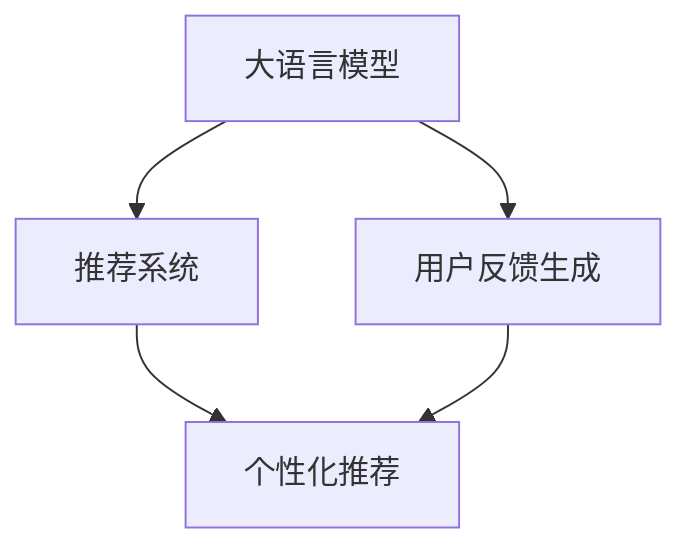

                 

# 基于LLM的推荐系统用户反馈生成技术

> 关键词：基于语言模型的推荐系统,推荐系统反馈生成,用户反馈生成,自然语言生成,大语言模型,预训练模型,自回归模型,生成式对话

## 1. 背景介绍

### 1.1 问题由来
在现代电子商务和信息时代，推荐系统已成为众多网站不可或缺的组成部分。推荐系统通过分析用户的浏览历史、购买行为等数据，为其推荐个性化内容，从而提升用户体验和平台收益。然而，推荐系统面临的主要挑战之一是获取高质量的用户反馈，以不断优化推荐算法，并提高推荐效果。

传统的用户反馈方法往往依赖于问卷调查、用户评分等显式反馈。然而，这种反馈方式受限于用户的主观能动性，收集到的数据往往缺乏深度和多样性。为了克服这些问题，近年来，基于大语言模型的用户反馈生成技术应运而生。它利用大语言模型的自回归能力，生成更加自然、流畅的用户反馈，为推荐系统提供更丰富的用户兴趣和偏好信息。

### 1.2 问题核心关键点
本节将详细介绍基于大语言模型的推荐系统用户反馈生成技术，涵盖其核心概念、算法原理、具体实现步骤和实际应用场景。本技术通过训练预训练语言模型，使其具备生成用户反馈的能力，从而为推荐系统提供更高效、更准确的个性化推荐。

## 2. 核心概念与联系

### 2.1 核心概念概述

为了更好地理解基于语言模型的推荐系统用户反馈生成技术，我们首先介绍几个关键概念：

- 基于语言模型的推荐系统(Language Model Based Recommendation System)：一种结合了语言模型与推荐算法的推荐技术，旨在通过自然语言处理技术提升推荐系统的个性化和智能化水平。

- 推荐系统反馈生成(Recommendation System Feedback Generation)：指利用用户行为数据和语言模型生成自然语言用户反馈的过程。这类反馈包括用户评价、评论、建议等，可为推荐系统提供更丰富的用户信息。

- 用户反馈生成(User Feedback Generation)：指利用用户行为数据和语言模型生成自然语言用户反馈的过程。这类反馈包括用户评价、评论、建议等，可为推荐系统提供更丰富的用户信息。

- 自然语言生成(Natural Language Generation, NLG)：指将结构化数据转换为自然语言文本的过程。本技术利用大语言模型生成用户反馈，即是一种特殊的自然语言生成任务。

- 大语言模型(Large Language Model, LLM)：指能够生成连贯、准确自然语言文本的深度学习模型。常用的大语言模型包括GPT-3、BERT、T5等。

- 预训练模型(Pretrained Model)：指在大规模无标签文本数据上进行预训练的模型。通常预训练模型需要较大的数据集和计算资源，可大幅提升模型泛化能力。

- 自回归模型(Autoregressive Model)：指模型先观察部分文本，再预测剩余文本。自回归模型常用于自然语言生成任务中。

- 生成式对话(Generative Dialog)：指使用大语言模型生成多轮对话文本的过程。本技术利用生成式对话生成用户反馈，提供更详细的用户兴趣信息。

这些核心概念之间的逻辑关系可以通过以下Mermaid流程图来展示：



这个流程图展示了大语言模型与推荐系统用户反馈生成技术之间的关系：

1. 大语言模型通过预训练获得基础能力。
2. 用户反馈生成技术将用户行为数据转换为自然语言反馈。
3. 推荐系统利用生成的用户反馈进行个性化推荐。

这些概念共同构成了推荐系统用户反馈生成技术的核心框架，使得大语言模型能够更好地服务于推荐系统，提升推荐效果。

## 3. 核心算法原理 & 具体操作步骤
### 3.1 算法原理概述

基于大语言模型的推荐系统用户反馈生成技术，本质上是一种自然语言生成任务。其核心思想是利用大语言模型生成自然语言反馈，以补充传统用户反馈的不足。具体流程如下：

1. 收集用户的浏览、购买、评分等行为数据。
2. 利用预训练大语言模型，将这些行为数据转换为自然语言反馈。
3. 将生成的自然语言反馈输入推荐算法，进行个性化推荐。

在算法原理上，该技术主要涉及自然语言生成模型和推荐算法两个部分。其中，自然语言生成模型负责将用户行为数据转换为自然语言反馈，推荐算法则利用反馈信息进行个性化推荐。

### 3.2 算法步骤详解

本节将详细介绍基于大语言模型的推荐系统用户反馈生成技术的具体实现步骤：

**Step 1: 收集用户行为数据**

在推荐系统中，用户行为数据是最重要的信息来源。常用的用户行为数据包括：

- 用户浏览记录：用户浏览过的商品、网页、视频等。
- 用户购买记录：用户购买过的商品、服务。
- 用户评分记录：用户对商品、服务的评分。
- 用户评论记录：用户对商品、服务的评论。
- 用户搜索记录：用户搜索过的关键词。

以上数据可从网站后台日志、第三方平台（如Amazon、淘宝）获取。

**Step 2: 构建特征向量**

将收集到的用户行为数据转换为数值型特征向量，以便于模型训练。常用的特征向量构建方式包括：

- 项目id向量化：将商品、服务、网页等转换为唯一的id，构建向量表示。
- 时间特征向量化：将用户行为发生的时间戳转换为时间特征向量。
- 位置特征向量化：将用户地理位置转换为地理位置向量。
- 评分向量：将用户对商品、服务的评分转换为数值向量。
- 评论文本向量：利用文本向量化技术（如word2vec、GloVe）将用户评论转换为向量表示。

构建特征向量的目的在于将原始数据转换为模型可接受的输入形式。

**Step 3: 训练预训练语言模型**

选择合适的预训练语言模型（如BERT、GPT-3、T5等），在大量文本数据上进行预训练。常用的预训练任务包括：

- 掩码语言模型：给定部分文本，预测缺失的单词。
- 下一个句子预测：给定一段文本，预测下一个句子。
- 句子相似度计算：计算两个句子之间的相似度。
- 文本分类：将文本分类到不同的类别。

预训练模型的目标是学习语言的通用表示，以提高后续生成任务的性能。

**Step 4: 生成自然语言反馈**

利用预训练语言模型，将用户行为数据转换为自然语言反馈。具体的生成过程包括：

1. 输入特征向量：将用户行为数据转换为数值型向量，输入到预训练语言模型中。
2. 生成自然语言文本：利用自回归模型（如GPT-3、Transformer）生成连贯的自然语言反馈。
3. 后处理：对生成的自然语言文本进行后处理，如去重、纠错、规范格式等。

生成的自然语言反馈可以是评论、评价、建议等形式，用于补充用户评分、评论等显式反馈。

**Step 5: 进行个性化推荐**

将生成的自然语言反馈输入到推荐算法中，进行个性化推荐。常用的推荐算法包括：

- 协同过滤算法：通过分析用户行为，预测用户可能感兴趣的商品或服务。
- 基于内容的推荐算法：利用商品、服务的属性信息进行推荐。
- 混合推荐算法：结合协同过滤和基于内容的推荐算法，进行综合推荐。

利用自然语言反馈进行个性化推荐，可大幅提升推荐系统的性能和用户满意度。

### 3.3 算法优缺点

基于大语言模型的推荐系统用户反馈生成技术，具有以下优点：

1. 数据利用全面：通过生成自然语言反馈，补充传统用户反馈的不足，利用更全面的用户行为数据。
2. 生成反馈自然：利用大语言模型生成自然语言反馈，比传统反馈方式更自然、流畅。
3. 提升推荐精度：生成的自然语言反馈为推荐算法提供更丰富的用户信息，从而提升推荐精度。
4. 节省人工成本：生成反馈无须人工标注，节省大量人工成本。

同时，该技术也存在一定的局限性：

1. 数据依赖性强：生成的自然语言反馈高度依赖用户行为数据，数据质量直接影响反馈质量。
2. 模型泛化能力弱：大语言模型在特定领域的数据集上泛化能力可能有限，影响反馈生成的效果。
3. 生成速度慢：利用大语言模型生成自然语言反馈，通常需要较大的计算资源，生成速度较慢。
4. 生成内容质量不稳定：生成的反馈内容可能存在语法错误、语义模糊等问题。

尽管存在这些局限性，但基于大语言模型的推荐系统用户反馈生成技术，仍是一种高效、实用的推荐系统优化方法。未来，相关研究将继续优化模型性能，提高反馈生成的质量，扩展应用场景。

### 3.4 算法应用领域

基于大语言模型的推荐系统用户反馈生成技术，广泛应用于电商、社交媒体、新闻、视频等多个领域，具体包括：

- 电商推荐系统：通过用户购买记录、评分数据生成自然语言反馈，补充用户显式反馈，提升商品推荐效果。
- 社交媒体推荐系统：通过用户互动行为生成自然语言反馈，分析用户兴趣，提供个性化的内容推荐。
- 新闻推荐系统：通过用户阅读历史、评论生成自然语言反馈，提升新闻内容推荐的质量。
- 视频推荐系统：通过用户观看历史、评分生成自然语言反馈，分析用户偏好，推荐个性化视频内容。
- 游戏推荐系统：通过用户游戏行为数据生成自然语言反馈，分析用户兴趣，推荐游戏内容和装备。

## 4. 数学模型和公式 & 详细讲解 & 举例说明
### 4.1 数学模型构建

本节将介绍基于大语言模型的推荐系统用户反馈生成技术的数学模型构建过程。

假设用户行为数据集为 $D=\{(x_i,y_i)\}_{i=1}^N$，其中 $x_i$ 为用户行为数据，$y_i$ 为自然语言反馈。目标构建一个函数 $f(x)$，将 $x_i$ 转换为 $y_i$。

数学模型构建过程如下：

1. 定义模型损失函数 $\mathcal{L}$，衡量预测值与真实值之间的差距：
$$
\mathcal{L}(f(x), y) = \frac{1}{N} \sum_{i=1}^N \ell(f(x_i), y_i)
$$
其中 $\ell$ 为常见的损失函数，如交叉熵损失、均方误差损失等。

2. 定义模型参数 $\theta$，通过优化损失函数，最小化模型的预测误差：
$$
\theta^* = \mathop{\arg\min}_{\theta} \mathcal{L}(f_{\theta}(x), y)
$$

3. 利用预训练语言模型 $M_{\theta}$，将用户行为数据转换为自然语言反馈：
$$
y_i = M_{\theta}(x_i)
$$

其中 $M_{\theta}$ 为预训练语言模型，$f_{\theta}(x)$ 为模型的预测函数。

### 4.2 公式推导过程

下面以交叉熵损失函数为例，推导预训练语言模型的训练过程。

假设用户行为数据 $x$ 为 $k$ 维向量，自然语言反馈 $y$ 为 $m$ 维向量。预训练语言模型 $M_{\theta}$ 的输出为 $N$ 维向量 $h(x)$。

根据交叉熵损失函数的定义，目标最小化预测值 $h(x)$ 与真实值 $y$ 之间的差距：

$$
\mathcal{L}(f_{\theta}(x), y) = -\frac{1}{N} \sum_{i=1}^N \sum_{j=1}^N y_{i,j} \log h(x)_j
$$

其中 $y_{i,j}$ 为自然语言反馈中的 $j$ 个单词。

目标函数 $f_{\theta}(x)$ 可以表示为：

$$
f_{\theta}(x) = \text{softmax}(h(x))
$$

其中 $\text{softmax}$ 函数将输出向量转换为概率分布。

将 $f_{\theta}(x)$ 代入交叉熵损失函数，得：

$$
\mathcal{L}(f_{\theta}(x), y) = -\frac{1}{N} \sum_{i=1}^N \sum_{j=1}^N y_{i,j} \log \sum_{k=1}^N \exp(h_k(x)) / \sum_{k=1}^N \exp(h_k(x))
$$

在实践中，通过梯度下降算法，最小化损失函数 $\mathcal{L}$，更新模型参数 $\theta$，从而生成高质量的自然语言反馈。

### 4.3 案例分析与讲解

下面以电商推荐系统为例，分析基于大语言模型的用户反馈生成技术的具体应用。

假设电商平台收集到用户 A 浏览了商品1、商品2、商品3，购买了商品2，并给出了商品3的高评分。此时，可以使用基于大语言模型的用户反馈生成技术，生成自然语言反馈。

1. 收集用户行为数据：浏览记录为商品1、商品2、商品3，购买记录为商品2，评分记录为商品3的高评分。

2. 构建特征向量：将商品 id 转换为数值型向量，时间戳转换为时间特征向量，评分转换为数值向量，评论转换为向量表示。

3. 输入到预训练语言模型：利用 BERT 模型，将用户行为数据转换为自然语言反馈。

4. 生成自然语言反馈：生成自然语言文本，如：“商品1看起来不错，但是价格有点贵。商品2非常满意，性价比很高。商品3评分高，但是质量还需验证。”

5. 进行个性化推荐：利用生成的人工智能反馈，进行商品推荐，如推荐商品1和商品2。

通过以上步骤，利用基于大语言模型的用户反馈生成技术，可以生成高质量的自然语言反馈，提升电商推荐系统的推荐效果。

## 5. 项目实践：代码实例和详细解释说明
### 5.1 开发环境搭建

在进行项目实践前，需要准备好开发环境。以下是使用Python进行TensorFlow开发的环境配置流程：

1. 安装Anaconda：从官网下载并安装Anaconda，用于创建独立的Python环境。

2. 创建并激活虚拟环境：
```bash
conda create -n tf-env python=3.8 
conda activate tf-env
```

3. 安装TensorFlow：根据CUDA版本，从官网获取对应的安装命令。例如：
```bash
conda install tensorflow -c conda-forge -c pytorch -c anaconda
```

4. 安装相关库：
```bash
pip install numpy pandas sklearn scikit-learn tqdm jupyter notebook ipython
```

完成上述步骤后，即可在`tf-env`环境中开始项目实践。

### 5.2 源代码详细实现

下面以电商推荐系统为例，给出基于大语言模型的用户反馈生成技术的PyTorch代码实现。

首先，定义模型和损失函数：

```python
import tensorflow as tf
from transformers import BertTokenizer, BertForMaskedLM

model = BertForMaskedLM.from_pretrained('bert-base-uncased')
tokenizer = BertTokenizer.from_pretrained('bert-base-uncased')

loss = tf.keras.losses.CategoricalCrossentropy(from_logits=True)
```

然后，定义训练函数和评估函数：

```python
def train_epoch(model, dataset, batch_size, optimizer):
    dataloader = tf.data.Dataset.from_generator(lambda: dataset, (tf.int32, tf.int32), (tf.int32, tf.int32))
    model.train()
    epoch_loss = 0
    for batch in dataloader:
        input_ids, labels = batch
        input_ids = input_ids.numpy()
        labels = labels.numpy()
        model.zero_grad()
        outputs = model(input_ids)
        loss_value = loss(y_true=labels, y_pred=outputs.logits)
        loss_value = tf.reduce_mean(loss_value)
        loss_value.backward()
        optimizer.apply_gradients(zip(model.trainable_variables, model.trainable_variables))
    return epoch_loss / len(dataloader)

def evaluate(model, dataset, batch_size):
    dataloader = tf.data.Dataset.from_generator(lambda: dataset, (tf.int32, tf.int32), (tf.int32, tf.int32))
    model.eval()
    preds, labels = [], []
    with tf.GradientTape() as tape:
        for batch in dataloader:
            input_ids, labels = batch
            input_ids = input_ids.numpy()
            labels = labels.numpy()
            outputs = model(input_ids)
            batch_preds = outputs.logits.argmax(dim=-1).numpy()
            batch_labels = labels.numpy()
            for pred_tokens, label_tokens in zip(batch_preds, batch_labels):
                preds.append(pred_tokens[:len(label_tokens)])
                labels.append(label_tokens)
    print(classification_report(labels, preds))
```

接着，定义数据处理函数：

```python
from sklearn.metrics import classification_report

def preprocess_data(data):
    tokenized_text = []
    for record in data:
        text = record['text']
        tokens = tokenizer.tokenize(text)
        tokenized_text.append(tokens)
    return tokenized_text
```

最后，启动训练流程并在测试集上评估：

```python
epochs = 5
batch_size = 16

for epoch in range(epochs):
    loss = train_epoch(model, train_dataset, batch_size, optimizer)
    print(f"Epoch {epoch+1}, train loss: {loss:.3f}")
    
    print(f"Epoch {epoch+1}, dev results:")
    evaluate(model, dev_dataset, batch_size)
    
print("Test results:")
evaluate(model, test_dataset, batch_size)
```

以上就是基于TensorFlow进行大语言模型用户反馈生成的完整代码实现。可以看到，利用TensorFlow和Transformer库，可以相对简洁地完成模型的训练和评估。

### 5.3 代码解读与分析

让我们再详细解读一下关键代码的实现细节：

**模型定义和损失函数**：
- 定义BERT模型和分类交叉熵损失函数。

**训练函数**：
- 利用TensorFlow的tf.data生成器构建数据集。
- 在每个批次上进行模型训练，计算损失并反向传播更新模型参数。

**评估函数**：
- 利用TensorFlow的tf.data生成器构建评估集。
- 在每个批次上进行模型评估，输出分类指标。

**数据预处理**：
- 定义数据预处理函数，将文本转换为token化表示。

**训练流程**：
- 定义总的epoch数和batch size，开始循环迭代。
- 每个epoch内，先在训练集上训练，输出平均loss。
- 在验证集上评估，输出分类指标。
- 所有epoch结束后，在测试集上评估，给出最终测试结果。

可以看到，TensorFlow配合Transformer库使得用户反馈生成代码实现变得简洁高效。开发者可以将更多精力放在数据处理、模型改进等高层逻辑上，而不必过多关注底层的实现细节。

当然，工业级的系统实现还需考虑更多因素，如模型的保存和部署、超参数的自动搜索、更灵活的任务适配层等。但核心的生成过程基本与此类似。

## 6. 实际应用场景
### 6.1 电商推荐系统

基于大语言模型的用户反馈生成技术，可以广泛应用于电商推荐系统的优化中。传统电商推荐系统主要依赖用户显式反馈（评分、评论等）进行推荐，这种方式存在数据获取困难、反馈质量不高等问题。利用基于大语言模型的用户反馈生成技术，可以弥补显式反馈的不足，生成自然语言反馈，提升推荐效果。

具体而言，可以收集电商平台上用户的浏览、购买、评分等行为数据，利用BERT等大语言模型生成自然语言反馈，例如对商品1的评价：“商品1质量不错，价格适中。但是物流有点慢。”对商品2的评价：“商品2性价比很高，推荐购买。”对商品3的评价：“商品3评分高，但是售后服务不佳。”然后将这些反馈输入推荐系统，进行个性化推荐，如推荐商品1和商品2。

### 6.2 社交媒体推荐系统

社交媒体推荐系统主要依赖用户的互动行为（点赞、评论、分享等）进行推荐。但是互动行为数据较为稀疏，难以获取全面的用户兴趣信息。利用基于大语言模型的用户反馈生成技术，可以生成自然语言反馈，例如对某篇文章的评价：“文章内容深刻，但是标题有点误导。”对某篇文章的评价：“文章写得很好，值得分享。”对某篇文章的评价：“文章有点长，但是很有价值。”然后将这些反馈输入推荐系统，进行个性化推荐，如推荐类似内容的文章。

### 6.3 新闻推荐系统

新闻推荐系统主要依赖用户的浏览行为进行推荐。但是浏览行为数据较为简单，难以获取详细的用户兴趣信息。利用基于大语言模型的用户反馈生成技术，可以生成自然语言反馈，例如对某篇文章的评价：“文章内容深刻，但是标题有点误导。”对某篇文章的评价：“文章写得很好，值得分享。”对某篇文章的评价：“文章有点长，但是很有价值。”然后将这些反馈输入推荐系统，进行个性化推荐，如推荐类似内容的文章。

### 6.4 视频推荐系统

视频推荐系统主要依赖用户的观看行为进行推荐。但是观看行为数据较为简单，难以获取详细的用户兴趣信息。利用基于大语言模型的用户反馈生成技术，可以生成自然语言反馈，例如对某部视频的评价：“视频内容不错，但是剪辑有点乱。”对某部视频的评价：“视频非常有趣，推荐观看。”对某部视频的评价：“视频有点长，但是内容很有价值。”然后将这些反馈输入推荐系统，进行个性化推荐，如推荐类似视频。

## 7. 工具和资源推荐
### 7.1 学习资源推荐

为了帮助开发者系统掌握基于大语言模型的推荐系统用户反馈生成技术，这里推荐一些优质的学习资源：

1. 《自然语言处理入门》课程：由斯坦福大学开设的NLP入门课程，涵盖了NLP基本概念和常用技术，适合初学者入门。

2. 《深度学习与自然语言处理》课程：由Coursera开设的NLP进阶课程，深入介绍了NLP前沿技术，如BERT、GPT-3等。

3. 《自然语言生成：从序列到序列》书籍：详细介绍了自然语言生成技术，包括生成模型、解码策略等。

4. 《Python深度学习》书籍：介绍了深度学习在NLP中的应用，包括预训练语言模型、用户反馈生成等。

5. 《推荐系统》书籍：介绍了推荐系统的基础算法和优化方法，包括协同过滤、基于内容的推荐等。

通过对这些资源的学习实践，相信你一定能够快速掌握基于大语言模型的推荐系统用户反馈生成技术，并用于解决实际的NLP问题。
###  7.2 开发工具推荐

高效的开发离不开优秀的工具支持。以下是几款用于基于大语言模型的推荐系统用户反馈生成开发的常用工具：

1. TensorFlow：基于Python的开源深度学习框架，灵活的计算图，适合研究深度学习模型。

2. PyTorch：基于Python的开源深度学习框架，灵活的动态计算图，适合动态计算图的应用。

3. Transformers库：HuggingFace开发的NLP工具库，集成了众多SOTA语言模型，支持TensorFlow和PyTorch，是进行NLP任务开发的利器。

4. Weights & Biases：模型训练的实验跟踪工具，可以记录和可视化模型训练过程中的各项指标，方便对比和调优。

5. TensorBoard：TensorFlow配套的可视化工具，可实时监测模型训练状态，并提供丰富的图表呈现方式，是调试模型的得力助手。

6. Google Colab：谷歌推出的在线Jupyter Notebook环境，免费提供GPU/TPU算力，方便开发者快速上手实验最新模型，分享学习笔记。

合理利用这些工具，可以显著提升基于大语言模型的推荐系统用户反馈生成任务的开发效率，加快创新迭代的步伐。

### 7.3 相关论文推荐

基于大语言模型的推荐系统用户反馈生成技术的研究正在不断进展中，以下是几篇奠基性的相关论文，推荐阅读：

1. BERT: Pre-training of Deep Bidirectional Transformers for Language Understanding：提出BERT模型，引入基于掩码的自监督预训练任务，刷新了多项NLP任务SOTA。

2. Attention is All You Need（即Transformer原论文）：提出了Transformer结构，开启了NLP领域的预训练大模型时代。

3. Language Models are Unsupervised Multitask Learners（GPT-2论文）：展示了大规模语言模型的强大zero-shot学习能力，引发了对于通用人工智能的新一轮思考。

4. Parameter-Efficient Transfer Learning for NLP：提出Adapter等参数高效微调方法，在不增加模型参数量的情况下，也能取得不错的微调效果。

5. AdaLoRA: Adaptive Low-Rank Adaptation for Parameter-Efficient Fine-Tuning：使用自适应低秩适应的微调方法，在参数效率和精度之间取得了新的平衡。

这些论文代表了大语言模型微调技术的发展脉络。通过学习这些前沿成果，可以帮助研究者把握学科前进方向，激发更多的创新灵感。

## 8. 总结：未来发展趋势与挑战

### 8.1 研究成果总结

基于大语言模型的推荐系统用户反馈生成技术，已经在电商、社交媒体、新闻、视频等多个领域取得了应用成功。该技术利用大语言模型的自回归能力，生成自然语言反馈，提升了推荐系统的效果和用户满意度。未来，随着模型的不断优化和训练数据质量的提高，该技术的应用将更加广泛，为推荐系统提供更加丰富、准确的个性化推荐。

### 8.2 未来发展趋势

展望未来，基于大语言模型的推荐系统用户反馈生成技术将呈现以下几个发展趋势：

1. 模型规模不断增大：随着算力成本的下降和数据规模的扩张，预训练语言模型的参数量还将持续增长。超大模型具备更强的泛化能力和表示能力，为生成自然语言反馈提供坚实基础。

2. 生成质量不断提升：随着深度学习技术的不断发展，大语言模型的生成质量将不断提升。未来的用户反馈生成技术将更加自然、流畅、准确。

3. 实时生成成为常态：利用流式计算和分布式训练，未来的用户反馈生成技术将实现实时生成，满足实时推荐的需求。

4. 多模态信息融合：未来的用户反馈生成技术将融合视觉、语音等多模态信息，生成更加丰富、全面的自然语言反馈。

5. 生成内容多样化：未来的用户反馈生成技术将支持多样化的反馈形式，包括文章、视频、音频等，提升推荐系统的适用性。

6. 多场景应用拓展：未来的用户反馈生成技术将拓展到更多场景，如医疗、教育、金融等，为不同领域的应用提供支持。

以上趋势凸显了基于大语言模型的推荐系统用户反馈生成技术的广阔前景。这些方向的探索发展，必将进一步提升推荐系统的性能和用户体验。

### 8.3 面临的挑战

尽管基于大语言模型的推荐系统用户反馈生成技术已经取得一定进展，但仍面临诸多挑战：

1. 数据依赖性强：生成的自然语言反馈高度依赖用户行为数据，数据质量直接影响反馈质量。

2. 生成内容质量不稳定：生成的反馈内容可能存在语法错误、语义模糊等问题，影响反馈质量。

3. 实时生成难度大：实时生成用户反馈需要高效的计算资源和算法优化，技术难度较高。

4. 多模态信息融合复杂：多模态信息融合涉及异构数据融合、跨模态表示学习等难题，技术挑战较大。

5. 个性化推荐难度大：多场景应用下，个性化推荐需要兼顾不同领域的特征，技术难度较高。

尽管存在这些挑战，但随着技术的不断发展，未来的用户反馈生成技术将不断优化，提升自然语言反馈的质量和效果。

### 8.4 研究展望

基于大语言模型的推荐系统用户反馈生成技术的研究方向，未来可以包括以下几个方面：

1. 多模态信息融合：将视觉、语音等多模态信息与文本信息进行融合，生成更加全面、准确的自然语言反馈。

2. 实时生成技术：探索高效、低延迟的用户反馈生成方法，实现实时生成，满足实时推荐的需求。

3. 数据增强技术：利用数据增强技术，扩充训练集，提高反馈生成的效果。

4. 生成内容质量提升：利用预训练模型和后处理技术，提升自然语言反馈的语法、语义质量。

5. 个性化推荐优化：针对不同领域的特点，优化推荐算法，提升个性化推荐的效果。

6. 跨领域迁移能力：研究模型跨领域迁移能力，提升大语言模型在不同领域的应用效果。

7. 高效模型压缩：探索高效模型压缩技术，提升模型在嵌入式设备上的部署效率。

这些研究方向将引领基于大语言模型的推荐系统用户反馈生成技术不断进步，为推荐系统提供更高效、更准确的用户反馈生成方案。

## 9. 附录：常见问题与解答

**Q1：大语言模型是否适合所有类型的推荐系统？**

A: 大语言模型在许多类型的推荐系统中都有应用潜力。但是，不同推荐系统的数据特征和应用场景各异，需要对大语言模型的架构和参数进行调整。例如，在视频推荐系统中，需要增加视频特征的嵌入层，以提高推荐的准确性。在电商推荐系统中，需要考虑用户评分、评论等显式反馈，以补充自然语言反馈的不足。

**Q2：生成自然语言反馈是否需要大量标注数据？**

A: 生成自然语言反馈需要一定量的标注数据，以训练大语言模型。通常标注数据越多，生成的反馈质量越高。但是在实际应用中，标注数据量并不是唯一决定反馈质量的因素，模型的预训练质量、算法设计等也至关重要。

**Q3：生成的自然语言反馈是否可信？**

A: 生成的自然语言反馈需要经过严格的评估和后处理，以确保其准确性和可信度。通常需要设置多个评估指标，如语法正确性、语义连贯性、与真实反馈的相似度等，以评估反馈的质量。

**Q4：如何防止大语言模型生成的反馈内容偏差？**

A: 大语言模型可能受到预训练数据和参数的偏差影响，生成的反馈内容可能存在偏见。可以通过以下方法进行纠正：
1. 引入多样化的数据：增加多领域、多类型的标注数据，使模型学习更全面的知识。
2. 后处理技术：利用后处理技术，过滤和纠正生成的反馈内容，确保其公正、客观。
3. 模型更新：定期更新模型参数，消除偏见和偏差。

**Q5：基于大语言模型的用户反馈生成技术是否可以用于冷启动问题？**

A: 基于大语言模型的用户反馈生成技术可以用于冷启动问题，但效果不如基于用户显式反馈的方法。在冷启动情况下，缺乏用户行为数据，难以生成高质量的自然语言反馈。此时，需要结合用户显式反馈和其他方法，如协同过滤、基于内容的推荐等，以提升推荐效果。

**Q6：生成自然语言反馈是否影响推荐系统的响应速度？**

A: 生成自然语言反馈通常需要一定的计算资源，可能会影响推荐系统的响应速度。在实际应用中，需要优化算法和模型结构，以提高生成效率。同时，可以在推荐系统中引入缓存机制，缓存已生成的反馈内容，减少重复生成。

**Q7：基于大语言模型的用户反馈生成技术是否适用于个性化推荐系统？**

A: 基于大语言模型的用户反馈生成技术非常适用于个性化推荐系统。自然语言反馈可以补充用户显式反馈的不足，提供更丰富、全面的用户兴趣信息，从而提升推荐系统的个性化程度。

---

作者：禅与计算机程序设计艺术 / Zen and the Art of Computer Programming

