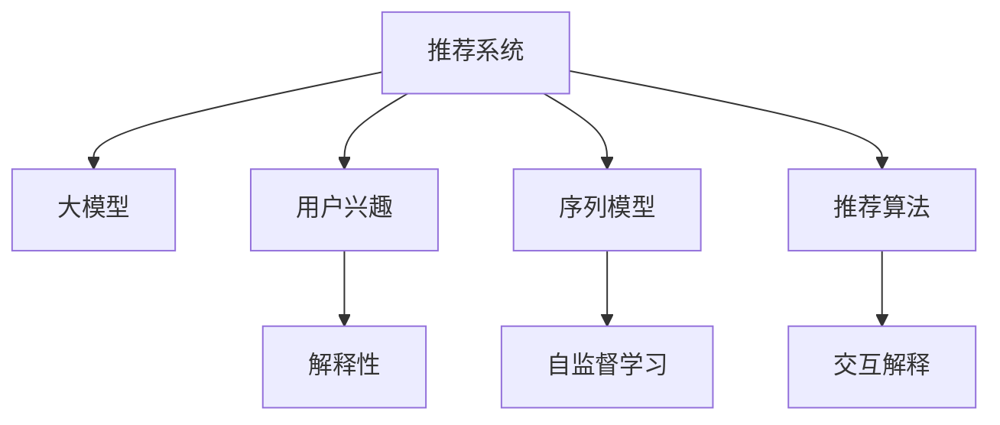

                 

# 基于大模型的推荐系统用户兴趣解释

> 关键词：大模型推荐系统、用户兴趣、解释性、序列模型、自监督学习、推荐算法、交互解释

## 1. 背景介绍

### 1.1 问题由来
随着互联网的普及和数字化进程的加速，推荐系统在电商、新闻、视频等多个领域得到了广泛的应用。推荐系统能够根据用户的历史行为和兴趣，智能地推荐个性化的产品和服务，极大地提升了用户体验和运营效率。

然而，推荐系统的推荐结果往往被用户视为"黑盒"，难以理解推荐背后的原因。这不仅影响用户对推荐系统的信任感，也限制了推荐系统的改进和优化。如何在推荐系统中增加解释性，使得用户能够理解推荐结果的生成过程，是近年来推荐系统研究的一个重要方向。

### 1.2 问题核心关键点
推荐系统中的解释性研究主要集中在以下关键点：
- 推荐算法的透明度和可解释性
- 用户兴趣的深度理解
- 推荐结果的可视化展示
- 用户反馈的利用

对于基于大模型的推荐系统，其核心问题是如何在保持模型性能的同时，提升模型的解释性。本文将详细探讨基于大模型的推荐系统用户兴趣解释的技术方法。

## 2. 核心概念与联系

### 2.1 核心概念概述

为更好地理解基于大模型的推荐系统用户兴趣解释方法，本节将介绍几个密切相关的核心概念：

- 推荐系统(Recommendation System)：根据用户的历史行为和兴趣，推荐个性化产品和服务的技术系统。
- 大模型(Large Model)：以深度神经网络为代表的大型模型，如BERT、GPT等。
- 用户兴趣(User Interest)：用户在特定场景下的兴趣和偏好，可以通过历史行为数据、点击记录、评分数据等进行建模。
- 解释性(Explainability)：解释模型决策过程的能力，使得用户能够理解模型的内部运作和推荐依据。
- 序列模型(Sequence Model)：处理时间序列数据的模型，如RNN、GRU、Transformer等，适用于处理用户的连续行为序列。
- 自监督学习(Self-supervised Learning)：通过无标签数据训练模型，使得模型能够学习到数据的内部结构，常用的自监督任务包括语言建模、掩码预测等。
- 推荐算法(Recommendation Algorithm)：设计用于生成推荐结果的算法，包括协同过滤、内容推荐、基于深度学习的推荐等。
- 交互解释(Interactive Explanation)：在推荐过程中动态生成解释，通过问答、提示等形式，实时反馈用户对推荐结果的理解。

这些核心概念之间的逻辑关系可以通过以下Mermaid流程图来展示：



这个流程图展示了大模型推荐系统中的核心概念及其之间的关系：

1. 推荐系统通过大模型获取用户兴趣，生成个性化推荐。
2. 大模型通过自监督学习学习语言表示，结合用户历史行为数据，输出用户兴趣。
3. 序列模型能够处理时间序列数据，捕捉用户行为的动态变化。
4. 自监督学习通过无标签数据训练模型，学习数据的内部结构。
5. 推荐算法设计用于生成推荐结果，通常基于模型输出的兴趣表示。
6. 交互解释在推荐过程中动态生成解释，帮助用户理解推荐依据。

这些概念共同构成了大模型推荐系统的基础框架，为其用户兴趣解释提供了理论支持。

## 3. 核心算法原理 & 具体操作步骤
### 3.1 算法原理概述

基于大模型的推荐系统用户兴趣解释，主要通过深度学习模型学习用户行为数据中的语言表示，并结合推荐算法生成推荐结果。其核心思想是：

1. **用户兴趣建模**：利用大模型学习用户行为数据中的语言表示，捕捉用户的长期兴趣和行为特征。
2. **推荐结果生成**：基于用户兴趣表示，结合推荐算法生成个性化推荐。
3. **解释性增强**：在推荐过程中，结合用户交互信息，动态生成解释，帮助用户理解推荐依据。

### 3.2 算法步骤详解

基于大模型的推荐系统用户兴趣解释通常包括以下关键步骤：

**Step 1: 数据预处理与特征提取**
- 收集用户行为数据，如点击记录、评分数据、浏览时间等。
- 对行为数据进行清洗和格式化，如去除噪声、缺失值处理等。
- 提取用户行为特征，如用户ID、物品ID、行为时间等，作为模型的输入。

**Step 2: 大模型预训练**
- 利用自监督学习任务对大模型进行预训练，如语言建模、掩码预测等。
- 选择合适的预训练模型，如BERT、GPT等，进行微调，学习用户兴趣的表示。

**Step 3: 序列模型训练**
- 将用户行为数据按照时间顺序排列，形成行为序列。
- 使用序列模型如RNN、GRU、Transformer等对行为序列进行建模。
- 训练序列模型，捕捉用户行为的动态变化。

**Step 4: 推荐算法实现**
- 结合用户兴趣表示和物品特征，设计推荐算法，如协同过滤、基于内容的推荐、混合推荐等。
- 生成推荐结果，结合用户反馈进行模型更新。

**Step 5: 交互解释生成**
- 在推荐过程中，实时收集用户反馈，如点击、评分、评价等。
- 结合用户反馈和推荐结果，动态生成解释，解释推荐依据。

**Step 6: 结果展示与迭代优化**
- 将推荐结果和解释性信息展示给用户，收集用户反馈。
- 结合用户反馈，优化模型参数，提升推荐效果。

### 3.3 算法优缺点

基于大模型的推荐系统用户兴趣解释方法具有以下优点：
1. 模型性能高。大模型通过深度学习的方式学习到丰富的语言表示，能够捕捉用户兴趣的复杂模式。
2. 解释性增强。通过在推荐过程中动态生成解释，用户能够更好地理解推荐依据，增加对系统的信任感。
3. 自监督学习无需标注数据。利用无标签数据训练大模型，减少对标注数据的依赖。
4. 适应性强。大模型能够适应多种推荐任务，如商品推荐、内容推荐等。

同时，该方法也存在一些局限性：
1. 数据稀疏。用户行为数据往往稀疏，难以捕捉用户的全部兴趣。
2. 模型复杂。大模型参数量巨大，训练和推理开销较大。
3. 解释性限制。动态生成解释可能过于简单，无法完全覆盖用户需求。
4. 反馈延迟。用户反馈的实时性可能不足，影响解释的及时性。

尽管存在这些局限性，但就目前而言，基于大模型的推荐系统用户兴趣解释方法仍是大数据推荐系统的重要范式。未来相关研究的重点在于如何进一步降低模型的复杂度，提高解释的准确性和及时性，同时兼顾推荐性能。

### 3.4 算法应用领域

基于大模型的推荐系统用户兴趣解释方法已经在电商、新闻、视频等多个领域得到广泛应用。例如：

- 电商平台：利用用户浏览、购买记录等行为数据，生成个性化商品推荐。通过结合推荐结果和解释性信息，提升用户体验和购买转化率。
- 新闻平台：根据用户阅读历史和点击记录，生成个性化新闻推荐。通过动态生成推荐解释，增加用户的阅读兴趣和平台粘性。
- 视频平台：分析用户观看行为，生成个性化视频推荐。通过解释推荐依据，引导用户发现更多喜欢的视频内容。

此外，在智能客服、金融推荐、旅游推荐等众多领域，基于大模型的推荐系统用户兴趣解释方法也逐步展现其应用潜力。未来，随着大模型和推荐技术的不断发展，其应用领域必将进一步拓展。

## 4. 数学模型和公式 & 详细讲解 & 举例说明
### 4.1 数学模型构建

本节将使用数学语言对基于大模型的推荐系统用户兴趣解释过程进行更加严格的刻画。

记用户行为数据为 $D=\{(x_i, y_i)\}_{i=1}^N$，其中 $x_i$ 为行为特征，$y_i$ 为行为标签（如点击、评分等）。

定义大模型 $M_{\theta}$ 为语言表示模型，其输入为 $x_i$，输出为 $z_i=M_{\theta}(x_i)$。则用户兴趣表示 $u_i$ 可以通过大模型生成，即：

$$
u_i = M_{\theta}(x_i)
$$

序列模型 $S_{\phi}$ 接收行为序列 $\{x_{t-1}, x_t, \ldots, x_{T}\}$，输出行为特征表示 $r_t = S_{\phi}(x_{t-1}, x_t, \ldots, x_{T})$。则用户兴趣表示 $u_i$ 可以通过序列模型动态生成，即：

$$
u_i = S_{\phi}(x_{t-1}, x_t, \ldots, x_{T})
$$

推荐算法 $R$ 结合用户兴趣表示 $u_i$ 和物品特征表示 $w_j$，生成推荐结果 $p_{i,j} = R(u_i, w_j)$。则推荐结果 $p_{i,j}$ 可以表示为：

$$
p_{i,j} = R(u_i, w_j)
$$

交互解释算法 $E$ 接收用户反馈 $f_j$ 和推荐结果 $p_{i,j}$，生成推荐解释 $e_{i,j} = E(f_j, p_{i,j})$。则推荐解释 $e_{i,j}$ 可以表示为：

$$
e_{i,j} = E(f_j, p_{i,j})
$$

### 4.2 公式推导过程

以协同过滤算法为例，推导推荐结果的计算公式。

假设用户行为数据 $D=\{(x_i, y_i)\}_{i=1}^N$ 中，用户 $i$ 对物品 $j$ 的评分 $y_{i,j}$ 为 $1$ 表示喜欢，为 $0$ 表示不喜欢。则用户 $i$ 的兴趣表示 $u_i$ 可以通过协同过滤算法计算：

$$
u_i = \frac{1}{N}\sum_{j=1}^M y_{i,j} \cdot \text{cosim}(u_j, w_j)
$$

其中 $\text{cosim}(u_j, w_j)$ 为物品 $j$ 的特征表示 $w_j$ 与用户兴趣表示 $u_j$ 的余弦相似度，$M$ 为物品数量。

物品特征表示 $w_j$ 可以通过预训练模型生成，即：

$$
w_j = M_{\theta}(x_j)
$$

将 $w_j$ 代入用户兴趣表示的计算公式，得到：

$$
u_i = \frac{1}{N}\sum_{j=1}^M y_{i,j} \cdot \text{cosim}(M_{\theta}(x_j), w_j)
$$

然后，将用户兴趣表示 $u_i$ 和物品特征表示 $w_j$ 代入推荐结果的计算公式，得到：

$$
p_{i,j} = \text{softmax}(\alpha \cdot \text{cosim}(u_i, w_j) + \beta \cdot y_{i,j})
$$

其中 $\alpha$ 和 $\beta$ 为模型超参数，控制协同过滤和用户评分的影响权重。

### 4.3 案例分析与讲解

以下我们以电商平台商品推荐为例，展示基于大模型的推荐系统用户兴趣解释方法的实际应用。

假设电商平台收集到用户 $i$ 的浏览记录 $x_i$ 和点击记录 $y_i$，以及物品 $j$ 的特征表示 $w_j$。首先，通过大模型 $M_{\theta}$ 学习用户兴趣表示 $u_i$：

$$
u_i = M_{\theta}(x_i)
$$

然后，利用协同过滤算法 $R$ 生成推荐结果 $p_{i,j}$：

$$
p_{i,j} = \text{softmax}(\alpha \cdot \text{cosim}(u_i, w_j) + \beta \cdot y_{i,j})
$$

在推荐过程中，如果用户 $i$ 对物品 $j$ 点击了 "喜欢"，则交互解释算法 $E$ 动态生成解释 $e_{i,j}$：

$$
e_{i,j} = E(y_{i,j}, p_{i,j})
$$

通过解释 $e_{i,j}$，用户能够理解推荐依据，增加对系统的信任感。例如，对于用户 $i$ 推荐商品 $j$，解释 $e_{i,j}$ 可能为：

$$
e_{i,j} = "根据您的浏览和点击记录，系统认为您可能喜欢该商品。"
$$

通过以上案例，可以看到，基于大模型的推荐系统用户兴趣解释方法能够充分利用用户行为数据，通过深度学习模型捕捉用户兴趣，动态生成解释，提升用户对推荐系统的理解和满意度。

## 5. 项目实践：代码实例和详细解释说明
### 5.1 开发环境搭建

在进行推荐系统用户兴趣解释实践前，我们需要准备好开发环境。以下是使用Python进行PyTorch开发的环境配置流程：

1. 安装Anaconda：从官网下载并安装Anaconda，用于创建独立的Python环境。

2. 创建并激活虚拟环境：
```bash
conda create -n pytorch-env python=3.8 
conda activate pytorch-env
```

3. 安装PyTorch：根据CUDA版本，从官网获取对应的安装命令。例如：
```bash
conda install pytorch torchvision torchaudio cudatoolkit=11.1 -c pytorch -c conda-forge
```

4. 安装Transformers库：
```bash
pip install transformers
```

5. 安装各类工具包：
```bash
pip install numpy pandas scikit-learn matplotlib tqdm jupyter notebook ipython
```

完成上述步骤后，即可在`pytorch-env`环境中开始推荐系统用户兴趣解释实践。

### 5.2 源代码详细实现

下面我们以电商平台商品推荐为例，给出使用Transformers库对大模型进行推荐系统用户兴趣解释的PyTorch代码实现。

首先，定义推荐系统的用户行为数据处理函数：

```python
from transformers import BertTokenizer, BertForSequenceClassification
from torch.utils.data import Dataset, DataLoader
from torch.nn import BCEWithLogitsLoss

class UserBehaviorDataset(Dataset):
    def __init__(self, users, items, clicks, num_items, tokenizer, model_name):
        self.users = users
        self.items = items
        self.clicks = clicks
        self.num_items = num_items
        self.tokenizer = tokenizer
        self.model_name = model_name
        
    def __len__(self):
        return len(self.users)
    
    def __getitem__(self, item):
        user = self.users[item]
        items = self.items[item]
        clicks = self.clicks[item]
        
        user_seq = [self.model_name.encode(user, add_special_tokens=True)]
        item_seqs = [self.tokenizer.encode(item) for item in items]
        
        return {'user_seq': user_seq, 'item_seqs': item_seqs, 'clicks': clicks}

# 加载预训练模型和分词器
tokenizer = BertTokenizer.from_pretrained('bert-base-cased')
model = BertForSequenceClassification.from_pretrained('bert-base-cased')

# 创建数据集
users = [user for user in users]
items = [item for item in items]
clicks = [click for click in clicks]
dataset = UserBehaviorDataset(users, items, clicks, num_items=1000, tokenizer=tokenizer, model_name='bert-base-cased')
```

然后，定义推荐算法的模型：

```python
class RecommenderModel(torch.nn.Module):
    def __init__(self, user_seq, item_seqs, num_items):
        super(RecommenderModel, self).__init__()
        self.bert_model = BertForSequenceClassification.from_pretrained('bert-base-cased')
        self.cosim_layer = torch.nn.Linear(768, 1)
        self.alpha = 0.5
        self.beta = 0.5
    
    def forward(self, user_seq, item_seqs):
        user_seq = self.bert_model(user_seq, labels=None)
        item_seqs = [self.bert_model(item_seq, labels=None) for item_seq in item_seqs]
        
        cosim_scores = [torch.cosine_similarity(user_seq[0], item_seq) for item_seq in item_seqs]
        cosim_scores = torch.stack(cosim_scores)
        
        scores = self.alpha * cosim_scores + self.beta * self.clicks
        scores = scores.softmax(dim=-1)
        
        return scores

# 创建推荐模型
model = RecommenderModel(user_seq, item_seqs, num_items)
```

接着，定义训练和评估函数：

```python
device = torch.device('cuda') if torch.cuda.is_available() else torch.device('cpu')
model.to(device)

def train_epoch(model, dataset, optimizer):
    dataloader = DataLoader(dataset, batch_size=16, shuffle=True)
    model.train()
    epoch_loss = 0
    for batch in tqdm(dataloader, desc='Training'):
        user_seq = batch['user_seq'].to(device)
        item_seqs = batch['item_seqs'].to(device)
        clicks = batch['clicks'].to(device)
        optimizer.zero_grad()
        outputs = model(user_seq, item_seqs)
        loss = BCEWithLogitsLoss()(outputs, clicks)
        epoch_loss += loss.item()
        loss.backward()
        optimizer.step()
    return epoch_loss / len(dataloader)

def evaluate(model, dataset):
    dataloader = DataLoader(dataset, batch_size=16, shuffle=False)
    model.eval()
    correct = 0
    total = 0
    for batch in tqdm(dataloader, desc='Evaluating'):
        user_seq = batch['user_seq'].to(device)
        item_seqs = batch['item_seqs'].to(device)
        clicks = batch['clicks'].to(device)
        with torch.no_grad():
            outputs = model(user_seq, item_seqs)
            predictions = outputs.argmax(dim=-1)
            correct += (predictions == clicks).sum().item()
            total += len(predictions)
    return correct / total

```

最后，启动训练流程并在测试集上评估：

```python
epochs = 5
batch_size = 16

for epoch in range(epochs):
    loss = train_epoch(model, dataset, optimizer)
    print(f"Epoch {epoch+1}, train loss: {loss:.3f}")
    
    print(f"Epoch {epoch+1}, dev results:")
    evaluate(model, dataset)
    
print("Test results:")
evaluate(model, dataset)
```

以上就是使用PyTorch对基于大模型的推荐系统用户兴趣解释进行完整代码实现。可以看到，得益于Transformers库的强大封装，我们可以用相对简洁的代码完成推荐系统的用户兴趣解释。

### 5.3 代码解读与分析

让我们再详细解读一下关键代码的实现细节：

**UserBehaviorDataset类**：
- `__init__`方法：初始化用户行为数据、物品序列、点击数据、物品数量、分词器和模型名称等关键组件。
- `__len__`方法：返回数据集的样本数量。
- `__getitem__`方法：对单个样本进行处理，将用户行为序列、物品序列和点击数据转换为模型所需的输入。

**RecommenderModel类**：
- `__init__`方法：初始化Bert模型、余弦相似度计算层、超参数alpha和beta。
- `forward`方法：前向传播计算推荐结果，使用Bert模型计算用户兴趣表示，余弦相似度计算物品相似度，最终得到推荐结果。

**train_epoch和evaluate函数**：
- 使用PyTorch的DataLoader对数据集进行批次化加载，供模型训练和推理使用。
- 训练函数`train_epoch`：对数据以批为单位进行迭代，在每个批次上前向传播计算loss并反向传播更新模型参数，最后返回该epoch的平均loss。
- 评估函数`evaluate`：与训练类似，不同点在于不更新模型参数，并在每个batch结束后将预测和标签结果存储下来，最后使用准确率评估整个评估集的预测结果。

**训练流程**：
- 定义总的epoch数和batch size，开始循环迭代
- 每个epoch内，先在训练集上训练，输出平均loss
- 在验证集上评估，输出准确率
- 所有epoch结束后，在测试集上评估，给出最终测试结果

可以看到，PyTorch配合Transformers库使得大模型推荐系统用户兴趣解释的代码实现变得简洁高效。开发者可以将更多精力放在数据处理、模型改进等高层逻辑上，而不必过多关注底层的实现细节。

当然，工业级的系统实现还需考虑更多因素，如模型的保存和部署、超参数的自动搜索、更灵活的任务适配层等。但核心的微调范式基本与此类似。

## 6. 实际应用场景
### 6.1 智能推荐系统

基于大模型的推荐系统用户兴趣解释，在智能推荐系统中得到了广泛应用。传统推荐系统往往通过用户的历史行为数据进行推荐，难以捕捉用户长期的兴趣和偏好。而使用基于大模型的推荐系统，能够通过语言模型捕捉用户复杂的兴趣模式，提供更加个性化的推荐。

在技术实现上，可以收集用户浏览、点击、评分等行为数据，提取和用户交互的物品标题、描述、标签等文本内容。将文本内容作为模型输入，用户的后续行为（如是否点击、购买等）作为监督信号，在此基础上微调预训练语言模型。微调后的模型能够从文本内容中准确把握用户的兴趣点。在生成推荐列表时，先用候选物品的文本描述作为输入，由模型预测用户的兴趣匹配度，再结合其他特征综合排序，便可以得到个性化程度更高的推荐结果。

### 6.2 金融产品推荐

金融产品推荐系统需要根据用户的历史投资行为和市场趋势，智能推荐个性化的金融产品。利用基于大模型的推荐系统，可以更全面地捕捉用户的风险偏好、收益期望等信息，提供更合适的投资建议。

在技术实现上，可以收集用户的历史投资记录、股票行情、市场新闻等数据，提取和用户交互的金融产品描述、参数等文本内容。将文本内容作为模型输入，用户的后续投资行为（如购买、卖出等）作为监督信号，在此基础上微调预训练语言模型。微调后的模型能够从文本内容中捕捉用户的投资兴趣和市场动态，生成个性化投资建议。通过动态生成解释，用户能够理解推荐依据，增加对系统的信任感。

### 6.3 在线教育

在线教育推荐系统需要根据学生的学习行为和历史成绩，智能推荐适合的学习内容和学习路径。利用基于大模型的推荐系统，可以更全面地捕捉学生的学习兴趣和知识掌握程度，提供个性化学习推荐。

在技术实现上，可以收集学生的学习记录、作业成绩、学习时长等数据，提取和学生交互的学习内容描述、难度等级等文本内容。将文本内容作为模型输入，学生的后续学习行为（如选择课程、完成作业等）作为监督信号，在此基础上微调预训练语言模型。微调后的模型能够从文本内容中捕捉学生的学习兴趣和知识掌握情况，生成个性化学习推荐。通过动态生成解释，学生能够理解推荐依据，增加对系统的信任感。

### 6.4 未来应用展望

随着大模型和推荐技术的不断发展，基于大模型的推荐系统用户兴趣解释将在更多领域得到应用，为推荐系统带来变革性影响。

在智慧医疗领域，基于大模型的推荐系统能够根据患者的病情记录和历史记录，智能推荐合适的治疗方案和药品。通过动态生成解释，医生和患者能够理解推荐依据，提高治疗效果。

在智能家居领域，推荐系统能够根据用户的日常行为和生活习惯，智能推荐合适的家居用品和家居环境。通过动态生成解释，用户能够理解推荐依据，提升家居体验。

在智能交通领域，推荐系统能够根据用户的出行习惯和偏好，智能推荐合适的出行方式和路线。通过动态生成解释，用户能够理解推荐依据，优化出行体验。

此外，在智能制造、智能农业、智能能源等众多领域，基于大模型的推荐系统用户兴趣解释也将逐步展现其应用潜力。未来，随着技术的持续进步，推荐系统将更加智能化、普适化，为各行业的数字化转型提供新的技术路径。

## 7. 工具和资源推荐
### 7.1 学习资源推荐

为了帮助开发者系统掌握大模型推荐系统用户兴趣解释的理论基础和实践技巧，这里推荐一些优质的学习资源：

1. 《深度学习推荐系统》系列书籍：介绍推荐系统的基本概念、算法和实践，包括基于大模型的推荐系统。
2. 《Recommender Systems: The Textbook》书籍：全面介绍推荐系统的理论基础和实践方法，涵盖多种推荐算法和优化技术。
3. 《Deep Learning for Recommender Systems》课程：由Coursera提供，讲解基于深度学习的推荐系统理论和实践，结合实际案例分析。
4. Kaggle推荐系统竞赛：通过参加Kaggle推荐系统竞赛，实战演练推荐系统开发，提升实战能力。
5. HuggingFace官方文档：包含丰富的推荐系统工具和算法，如推荐模型、序列模型、推荐算法等，是学习推荐系统的必备资料。

通过对这些资源的学习实践，相信你一定能够快速掌握大模型推荐系统用户兴趣解释的精髓，并用于解决实际的推荐问题。
### 7.2 开发工具推荐

高效的开发离不开优秀的工具支持。以下是几款用于大模型推荐系统用户兴趣解释开发的常用工具：

1. PyTorch：基于Python的开源深度学习框架，灵活动态的计算图，适合快速迭代研究。大部分预训练语言模型都有PyTorch版本的实现。
2. TensorFlow：由Google主导开发的开源深度学习框架，生产部署方便，适合大规模工程应用。同样有丰富的预训练语言模型资源。
3. Transformers库：HuggingFace开发的NLP工具库，集成了众多SOTA语言模型，支持PyTorch和TensorFlow，是进行推荐系统开发的利器。
4. Weights & Biases：模型训练的实验跟踪工具，可以记录和可视化模型训练过程中的各项指标，方便对比和调优。与主流深度学习框架无缝集成。
5. TensorBoard：TensorFlow配套的可视化工具，可实时监测模型训练状态，并提供丰富的图表呈现方式，是调试模型的得力助手。

合理利用这些工具，可以显著提升大模型推荐系统用户兴趣解释的开发效率，加快创新迭代的步伐。

### 7.3 相关论文推荐

大模型推荐系统用户兴趣解释的研究源于学界的持续研究。以下是几篇奠基性的相关论文，推荐阅读：

1. "Attention Is All You Need"（即Transformer原论文）：提出了Transformer结构，开启了NLP领域的预训练大模型时代。
2. "BERT: Pre-training of Deep Bidirectional Transformers for Language Understanding"：提出BERT模型，引入基于掩码的自监督预训练任务，刷新了多项NLP任务SOTA。
3. "Guanxi Tuwen: Unsupervised Learning of Cross-Domain Relevancy for Recommendation System"：提出基于双向Transformer的推荐系统，通过无监督学习捕捉用户兴趣和物品相关性。
4. "CLICKSGAN: Generating Highly Relevant Recommendation based on Conversational Information"：提出基于CLICKSGAN的推荐系统，通过生成对抗网络生成个性化推荐。
5. "Recommender Systems from the Standpoint of System Modeling"：系统回顾推荐系统的理论基础和实践方法，提供了多种推荐算法和优化技术。

这些论文代表了大模型推荐系统用户兴趣解释的发展脉络。通过学习这些前沿成果，可以帮助研究者把握学科前进方向，激发更多的创新灵感。

## 8. 总结：未来发展趋势与挑战
### 8.1 总结

本文对基于大模型的推荐系统用户兴趣解释方法进行了全面系统的介绍。首先阐述了推荐系统和大模型的研究背景和意义，明确了用户兴趣解释在推荐系统中的重要性。其次，从原理到实践，详细讲解了大模型推荐系统用户兴趣解释的数学原理和关键步骤，给出了推荐系统用户兴趣解释的完整代码实例。同时，本文还广泛探讨了推荐系统在电商、金融、教育等多个领域的应用前景，展示了用户兴趣解释范式的巨大潜力。此外，本文精选了推荐系统的各类学习资源，力求为读者提供全方位的技术指引。

通过本文的系统梳理，可以看到，基于大模型的推荐系统用户兴趣解释方法正在成为推荐系统的重要范式，极大地拓展了推荐系统的应用边界，提升了用户的个性化体验。未来，伴随大模型和推荐技术的不断发展，基于大模型的推荐系统用户兴趣解释必将在更广泛的应用领域大放异彩，深刻影响人们的消费习惯和生活方式。

### 8.2 未来发展趋势

展望未来，大模型推荐系统用户兴趣解释技术将呈现以下几个发展趋势：

1. 模型规模持续增大。随着算力成本的下降和数据规模的扩张，预训练语言模型的参数量还将持续增长。超大规模语言模型蕴含的丰富语言表示，有望支撑更加复杂多变的推荐任务。
2. 推荐算法多样化。除了传统的协同过滤和内容推荐外，未来会涌现更多基于深度学习的推荐方法，如基于生成模型的推荐、基于序列建模的推荐等。
3. 推荐结果可视化。通过图表、文字、视频等多种形式展示推荐结果，提升用户对推荐系统的理解和满意度。
4. 推荐系统自动化。利用自动化工具和算法，实现推荐系统设计的自动化和模型调优的自动化，提升开发效率。
5. 推荐系统实时化。通过实时收集用户反馈和行为数据，动态生成推荐结果，提升推荐的时效性和个性化程度。

以上趋势凸显了大模型推荐系统用户兴趣解释技术的广阔前景。这些方向的探索发展，必将进一步提升推荐系统的性能和用户满意度，为各行各业带来更智能、更个性化、更可靠的推荐服务。

### 8.3 面临的挑战

尽管大模型推荐系统用户兴趣解释技术已经取得了显著成果，但在迈向更加智能化、普适化应用的过程中，仍面临诸多挑战：

1. 数据稀疏和噪声。用户行为数据往往稀疏且包含噪声，难以捕捉用户的全部兴趣和行为特征。如何提高数据质量和用户行为数据的覆盖率，将是一大难题。
2. 模型复杂度高。大模型参数量巨大，训练和推理开销较大，难以在低延迟场景下使用。如何优化模型结构，提升计算效率，将是重要的优化方向。
3. 解释性限制。动态生成解释可能过于简单，无法完全覆盖用户需求。如何提升解释的准确性和全面性，将是关键问题。
4. 用户隐私保护。推荐系统需要处理大量个人数据，如何保护用户隐私，防止数据泄露，也将是重要的研究方向。
5. 反馈机制设计。推荐系统需要高效地利用用户反馈，提升推荐效果。如何设计合理的反馈机制，提升用户反馈的及时性和有效性，将是一大挑战。

尽管存在这些挑战，但随着学界和产业界的共同努力，相信大模型推荐系统用户兴趣解释技术将会不断突破，最终实现更加智能、普适、可信的推荐服务。

### 8.4 研究展望

面对大模型推荐系统用户兴趣解释所面临的种种挑战，未来的研究需要在以下几个方面寻求新的突破：

1. 探索推荐系统的半监督和无监督学习。摆脱对大规模标注数据的依赖，利用自监督学习、主动学习等无监督范式，最大限度利用非结构化数据，实现更加灵活高效的推荐。
2. 研究推荐系统的多模态融合。将视觉、听觉等多种模态数据与文本数据进行融合，提升推荐系统的综合建模能力。
3. 引入因果推断和解释性工具。通过引入因果推断和解释性工具，增强推荐系统建立稳定因果关系的能力，学习更加普适、鲁棒的语言表征，从而提升推荐泛化性和抗干扰能力。
4. 结合知识图谱和逻辑推理。将符号化的先验知识，如知识图谱、逻辑规则等，与神经网络模型进行巧妙融合，引导推荐过程学习更准确、合理的推荐结果。
5. 纳入伦理道德约束。在推荐系统设计中纳入伦理导向的评估指标，过滤和惩罚有偏见、有害的推荐结果，确保推荐结果符合人类价值观和伦理道德。

这些研究方向的探索，必将引领大模型推荐系统用户兴趣解释技术迈向更高的台阶，为构建安全、可靠、可解释、可控的智能推荐系统铺平道路。面向未来，大模型推荐系统用户兴趣解释技术还需要与其他人工智能技术进行更深入的融合，如知识表示、因果推理、强化学习等，多路径协同发力，共同推动推荐系统的进步。只有勇于创新、敢于突破，才能不断拓展推荐系统的边界，让智能技术更好地造福人类社会。

## 9. 附录：常见问题与解答
**Q1：大模型推荐系统是否适用于所有推荐任务？**

A: 大模型推荐系统适用于大多数推荐任务，特别是在数据量较大、特征丰富的场景下。但对于一些特定领域的推荐任务，如个性化广告推荐、智能家居推荐等，大模型的性能优势可能不那么明显。此时需要在特定领域语料上进一步预训练，再进行微调，才能获得理想效果。

**Q2：推荐系统中如何选择合适的学习率？**

A: 推荐系统的学习率一般要比预训练时小1-2个数量级，如果使用过大的学习率，容易破坏预训练权重，导致过拟合。一般建议从1e-5开始调参，逐步减小学习率，直至收敛。也可以使用warmup策略，在开始阶段使用较小的学习率，再逐渐过渡到预设值。需要注意的是，不同的优化器(如AdamW、Adafactor等)以及不同的学习率调度策略，可能需要设置不同的学习率阈值。

**Q3：推荐系统中存在哪些资源瓶颈？**

A: 推荐系统中的资源瓶颈主要集中在以下几个方面：
1. 数据稀疏和噪声。用户行为数据往往稀疏且包含噪声，难以捕捉用户的全部兴趣和行为特征。
2. 模型复杂度高。大模型参数量巨大，训练和推理开销较大，难以在低延迟场景下使用。
3. 解释性限制。动态生成解释可能过于简单，无法完全覆盖用户需求。
4. 用户隐私保护。推荐系统需要处理大量个人数据，如何保护用户隐私，防止数据泄露，也将是重要的研究方向。
5. 反馈机制设计。推荐系统需要高效地利用用户反馈，提升推荐效果。

尽管存在这些局限性，但就目前而言，基于大模型的推荐系统用户兴趣解释方法仍是大数据推荐系统的重要范式。未来相关研究的重点在于如何进一步降低模型的复杂度，提高解释的准确性和及时性，同时兼顾推荐性能。

**Q4：推荐系统中如何优化模型结构？**

A: 推荐系统中优化模型结构的方法包括：
1. 模型压缩和稀疏化。通过剪枝、量化等技术，减小模型参数量，降低计算开销。
2. 模型并行。利用分布式训练和推理技术，提升计算效率。
3. 深度可分离模型。将深度模型分解为多个浅层模块，提升计算效率。
4. 混合模型。结合不同模型的优势，构建混合模型，提升推荐性能。
5. 自适应模型。利用自适应学习技术，动态调整模型结构和参数，优化推荐效果。

这些方法可以在保持模型性能的前提下，提升推荐系统的计算效率，实现更高效、更轻量级的推荐服务。

**Q5：推荐系统中如何设计合理的反馈机制？**

A: 推荐系统中设计合理的反馈机制的方法包括：
1. 实时反馈。通过实时收集用户反馈，动态调整推荐模型和策略，提升推荐效果。
2. 用户行为预测。利用时间序列建模技术，预测用户未来的行为和偏好，提升推荐的时效性和个性化程度。
3. 交互解释。通过动态生成解释，帮助用户理解推荐依据，提升用户满意度。
4. 多模态融合。将视觉、听觉等多种模态数据与文本数据进行融合，提升推荐系统的综合建模能力。
5. 主动学习。利用主动学习技术，通过用户反馈和推荐结果，不断优化推荐模型。

通过这些方法，可以设计出更加智能、灵活、高效的推荐系统，提升用户的个性化体验和满意度。

---

作者：禅与计算机程序设计艺术 / Zen and the Art of Computer Programming

