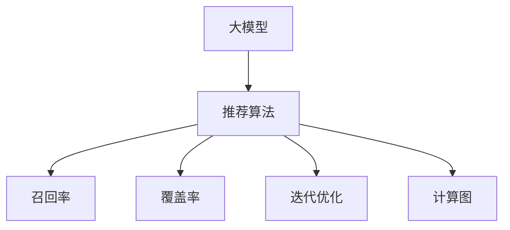

                 

# 基于大模型的迭代式动态推荐框架

> 关键词：大模型, 动态推荐系统, 迭代优化, 召回率, 覆盖率, 计算图, 实时推荐

## 1. 背景介绍

### 1.1 问题由来
在数字经济时代，个性化推荐系统已经成为各大电商、内容平台、社交网络等企业提升用户体验和业务增长的核心引擎。随着用户数据的积累和模型算法的优化，推荐系统的精确度、覆盖率等指标不断提高。但同时，这些系统也对数据存储、计算资源、算法迭代等方面提出了更高的要求。

尤其是随着用户需求多样化的增加，推荐系统不仅要处理海量数据，还需要实时应对用户行为的变化，进行高效的个性化推荐。因此，构建一个高效、实时、个性化且低成本的推荐系统，是当前技术界的一大挑战。

### 1.2 问题核心关键点
在推荐系统构建中，存在以下关键问题：

1. **推荐算法的设计和优化**：推荐系统依赖于推荐算法，而算法的性能直接影响系统的推荐效果和用户满意度。如何设计高效的推荐算法，并在海量数据上实时优化，是一个重要的研究课题。

2. **用户行为建模**：用户行为是多维度的，如何从多种行为数据中提取和建模用户兴趣，是推荐系统设计的核心。

3. **推荐结果的多样性**：推荐结果需要覆盖广泛的物品，避免“马太效应”导致的“过滤泡沫”问题。

4. **实时性和低延迟**：推荐系统需要实时响应用户请求，降低响应延迟，提高用户体验。

5. **成本控制**：推荐系统需要处理大规模数据，优化计算资源的使用，控制部署成本。

6. **安全性和隐私保护**：推荐系统处理大量敏感数据，如何保障数据安全，保护用户隐私，是一个重要的伦理问题。

本文聚焦于基于大模型的推荐框架，通过迭代式动态优化的方式，提升推荐系统的性能和效果，同时兼顾实时性和成本控制。

## 2. 核心概念与联系

### 2.1 核心概念概述

为了更好地理解本文介绍的迭代式动态推荐框架，本节将介绍几个核心概念：

- **大模型**：以Transformer等架构为基础，具有庞大参数量和强计算能力的大规模预训练语言模型。例如GPT-3、BERT等。大模型能够从海量数据中学习到复杂的语义和关系表示，适合用于处理高维度、多模态的数据。

- **动态推荐系统**：能够根据用户行为和偏好动态调整推荐结果，适应用户需求的推荐系统。动态推荐系统通常具备实时更新、持续学习的能力，能够快速响应用户变化，提升用户体验。

- **迭代优化**：通过多次迭代逐步优化模型参数，提升推荐效果和性能的优化方法。迭代优化在深度学习中应用广泛，可以有效地处理非凸优化问题，提高模型泛化能力。

- **召回率和覆盖率**：召回率（Recall）指在所有相关物品中，被推荐系统的模型成功推荐出的物品数量占所有相关物品数量的比例。覆盖率（Coverage）指推荐结果中不同物品的个数与总物品个数的比例，用于衡量推荐结果的多样性。

- **计算图**：计算图（Computational Graph）表示了深度学习模型中各层之间的依赖关系，通过反向传播算法自动计算梯度，更新模型参数。计算图还可以表示模型的输入输出关系，便于优化和部署。

这些概念之间的逻辑关系可以通过以下Mermaid流程图来展示：



这个流程图展示了大模型推荐系统的核心概念及其之间的关系：

1. 大模型作为推荐系统的基础，通过预训练获得广泛的知识和能力。
2. 推荐算法将大模型应用于实际业务场景，进行推荐结果的计算。
3. 迭代优化不断调整推荐算法参数，提升推荐效果。
4. 计算图用于表示推荐算法的输入输出关系，支持高效的模型训练和推理。

## 3. 核心算法原理 & 具体操作步骤
### 3.1 算法原理概述

基于大模型的迭代式动态推荐框架，核心思想是利用大模型的泛化能力和迭代优化的灵活性，提升推荐系统的性能。其核心算法如下：

1. **数据预处理和特征提取**：将用户行为数据和物品属性数据输入大模型，提取用户兴趣和物品特征。

2. **相似度计算**：利用大模型提取的特征，计算用户和物品之间的相似度，生成推荐结果。

3. **动态召回**：根据推荐结果的召回率和覆盖率，动态调整推荐策略，如调整相似度计算方式、引入新的特征、调整迭代次数等。

4. **迭代优化**：通过多次迭代优化模型参数，不断提升推荐结果的准确性和多样性。

5. **实时更新**：定期更新训练数据和模型参数，保持推荐系统的实时性和泛化能力。

### 3.2 算法步骤详解

基于大模型的迭代式动态推荐框架具体步骤包括：

**Step 1: 数据预处理和特征提取**

- 收集用户行为数据和物品属性数据，如浏览记录、购买记录、物品描述等。
- 对用户行为数据进行归一化处理，如对浏览次数进行log转换，对浏览时间进行归一化处理。
- 利用大模型提取用户和物品的特征，如使用BERT、GPT等模型进行特征表示。
- 将用户行为数据和物品属性数据融合，构建推荐模型的输入。

**Step 2: 相似度计算**

- 使用大模型提取的特征，计算用户和物品之间的相似度。可以使用余弦相似度、欧氏距离等方法。
- 根据相似度计算结果，生成推荐结果。推荐结果可以是物品ID、物品描述、评分等。
- 计算推荐结果的召回率和覆盖率，评估推荐系统的性能。

**Step 3: 动态召回**

- 根据推荐结果的召回率和覆盖率，动态调整相似度计算方式、引入新的特征、调整迭代次数等。
- 例如，当召回率较低时，可以尝试引入更多特征，如用户兴趣标签、物品类别等，提升相似度计算的准确性。
- 当覆盖率较低时，可以尝试调整迭代次数，增加相似度计算的深度，生成更多推荐结果。

**Step 4: 迭代优化**

- 将推荐结果输入大模型，计算预测误差。
- 通过反向传播算法，更新大模型的参数，提升推荐结果的准确性。
- 多次迭代优化，不断提升推荐系统的效果。

**Step 5: 实时更新**

- 定期更新训练数据和模型参数，保持推荐系统的实时性和泛化能力。
- 可以使用增量学习算法，如AdaGrad、SGD等，减少更新过程的时间和计算资源消耗。
- 对于频繁更新的数据，如热门商品、热门文章等，可以单独维护数据仓库，实时更新模型。

### 3.3 算法优缺点

基于大模型的迭代式动态推荐框架有以下优点：

1. **高效性**：利用大模型的泛化能力和迭代优化的灵活性，可以快速响应用户行为变化，提升推荐效果。
2. **实时性**：通过实时更新训练数据和模型参数，保持推荐系统的实时性，提升用户体验。
3. **高覆盖率**：动态召回机制可以调整相似度计算方式，引入新的特征，提升推荐结果的多样性。
4. **灵活性**：可以通过多次迭代优化，不断提升推荐系统的性能，适应不同业务场景的需求。

同时，该框架也存在一些局限性：

1. **计算资源消耗**：大模型和大规模数据处理需要较高的计算资源，部署成本较高。
2. **数据隐私和安全**：推荐系统处理大量敏感数据，如何保障数据安全，保护用户隐私，是一个重要的伦理问题。
3. **模型复杂性**：大模型的参数量和计算复杂度较高，训练和推理过程较为复杂，需要专业的技术团队支持。

尽管存在这些局限性，但就目前而言，基于大模型的迭代式动态推荐框架仍是推荐系统构建的一个有效途径。未来相关研究的重点在于如何进一步降低计算资源消耗，提高推荐系统的可解释性和安全性，同时兼顾实时性和性能。

### 3.4 算法应用领域

基于大模型的迭代式动态推荐框架已经在电商推荐、内容推荐、广告推荐等多个领域得到应用，取得了显著的成效。

- **电商推荐**：如淘宝、京东等电商平台，通过用户行为数据和物品属性数据，利用大模型进行个性化推荐，提升用户购买率和满意度。
- **内容推荐**：如Netflix、YouTube等视频平台，通过用户观看历史和评分数据，利用大模型生成个性化推荐列表，提升用户观看时长和满意度。
- **广告推荐**：如Google Ads、Facebook Ads等平台，通过用户浏览历史和点击数据，利用大模型进行精准广告推荐，提升广告点击率和转化率。

除了上述这些经典应用外，该框架还被创新性地应用于更多场景中，如实时金融推荐、个性化健康推荐、智能推荐系统等，为推荐系统的创新应用提供了新的思路。

## 4. 数学模型和公式 & 详细讲解

### 4.1 数学模型构建

为了更好地理解基于大模型的推荐框架，我们将在数学语言上对算法进行严格刻画。

记用户行为数据为 $X$，物品属性数据为 $Y$，推荐模型为 $M_{\theta}$。其中 $X$ 和 $Y$ 分别为 $m$ 维和 $n$ 维的向量，$\theta$ 为模型参数。

定义用户兴趣和物品特征的相似度矩阵为 $S \in \mathbb{R}^{m \times n}$，其中 $S_{ij}$ 表示用户 $i$ 和物品 $j$ 之间的相似度。推荐结果 $R \in \mathbb{R}^{1 \times n}$ 表示用户对物品的评分或兴趣度。

推荐模型的目标是最小化预测误差，即：

$$
\min_{\theta} \sum_{i=1}^m \sum_{j=1}^n (R_{ij} - M_{\theta}(X_i, Y_j))^2
$$

其中 $M_{\theta}(X_i, Y_j)$ 表示模型在输入 $X_i$ 和 $Y_j$ 上的输出。

### 4.2 公式推导过程

以下我们将推导基于大模型的推荐模型计算公式及其优化算法。

首先，我们定义用户行为数据 $X$ 和物品属性数据 $Y$ 的特征提取函数为 $f: \mathbb{R}^{m} \times \mathbb{R}^{n} \rightarrow \mathbb{R}^{k}$，其中 $k$ 为特征维度。

设用户 $i$ 的兴趣特征为 $f(X_i)$，物品 $j$ 的特征为 $f(Y_j)$。则用户 $i$ 和物品 $j$ 之间的相似度 $S_{ij}$ 可以表示为：

$$
S_{ij} = \text{cosine}(f(X_i), f(Y_j))
$$

其中 $\text{cosine}$ 表示余弦相似度。

根据相似度矩阵 $S$，推荐结果 $R$ 可以表示为：

$$
R = S \cdot W
$$

其中 $W$ 为 $n$ 维的权重向量。

为了最小化预测误差，我们需要求解目标函数：

$$
\min_{\theta} \sum_{i=1}^m \sum_{j=1}^n (R_{ij} - S_{ij} \cdot W) ^2
$$

通过反向传播算法，对模型参数 $\theta$ 进行更新，优化目标函数。设 $\eta$ 为学习率，$\nabla_{\theta}\mathcal{L}(\theta)$ 为损失函数对参数 $\theta$ 的梯度，更新公式为：

$$
\theta \leftarrow \theta - \eta \nabla_{\theta}\mathcal{L}(\theta)
$$

在得到损失函数的梯度后，即可带入参数更新公式，完成模型的迭代优化。重复上述过程直至收敛，最终得到推荐模型 $M_{\theta^*}$。

### 4.3 案例分析与讲解

假设我们有一家电商平台的推荐系统，需要为用户 $i$ 推荐物品 $j$。首先，我们收集用户的历史浏览记录 $X_i$ 和物品的销售记录 $Y_j$。

- 用户 $i$ 的历史浏览记录包括用户浏览过的商品ID、浏览时间、点击率等。
- 物品 $j$ 的销售记录包括商品ID、销售数量、评分等。

我们首先将这些数据输入到大模型中，提取用户兴趣特征和物品属性特征，计算相似度矩阵 $S$。

然后，通过计算相似度矩阵 $S$ 和权重向量 $W$，生成推荐结果 $R$。

最后，我们使用交叉熵损失函数计算预测误差，通过反向传播算法更新模型参数，不断优化推荐结果。

## 5. 项目实践：代码实例和详细解释说明
### 5.1 开发环境搭建

在进行推荐系统构建前，我们需要准备好开发环境。以下是使用Python进行TensorFlow和TensorBoard开发的环境配置流程：

1. 安装Anaconda：从官网下载并安装Anaconda，用于创建独立的Python环境。

2. 创建并激活虚拟环境：
```bash
conda create -n tf-env python=3.8 
conda activate tf-env
```

3. 安装TensorFlow：根据CUDA版本，从官网获取对应的安装命令。例如：
```bash
conda install tensorflow -c conda-forge
```

4. 安装TensorBoard：
```bash
pip install tensorboard
```

5. 安装各类工具包：
```bash
pip install numpy pandas scikit-learn matplotlib tqdm jupyter notebook ipython
```

完成上述步骤后，即可在`tf-env`环境中开始推荐系统开发。

### 5.2 源代码详细实现

下面我们以电商推荐系统为例，给出使用TensorFlow构建基于大模型的推荐框架的PyTorch代码实现。

首先，定义推荐系统的数据处理函数：

```python
import tensorflow as tf
from tensorflow.keras.layers import Input, Dense
from tensorflow.keras.models import Model
from tensorflow.keras.optimizers import Adam

class Recommender(tf.keras.Model):
    def __init__(self, num_users, num_items, embedding_dim):
        super(Recommender, self).__init__()
        self.input_user = Input(shape=(num_users,), name='user_input')
        self.input_item = Input(shape=(num_items,), name='item_input')
        self.user_feature = Dense(embedding_dim, activation='relu')(self.input_user)
        self.item_feature = Dense(embedding_dim, activation='relu')(self.input_item)
        self.similarity = tf.keras.layers.Dot(axes=(1, 1), normalize=True)([self.user_feature, self.item_feature])
        self.rating = Dense(1, activation='linear')(self.similarity)
        self.rating_model = Model(inputs=[self.input_user, self.input_item], outputs=self.rating)

    def call(self, user, item):
        return self.rating_model.predict([user, item])

def train_and_evaluate(model, train_data, val_data, test_data, epochs=10, batch_size=128):
    model.compile(optimizer=Adam(learning_rate=0.001), loss='mse')
    history = model.fit(x=train_data, y=train_data, epochs=epochs, batch_size=batch_size, validation_data=val_data)
    score = model.evaluate(x=test_data, y=test_data)
    print(f'Test loss: {score:.2f}')
    return history
```

然后，定义推荐模型的输入和输出：

```python
train_data = np.random.randn(100, 5)  # 随机生成100个用户和5个物品的特征
val_data = np.random.randn(10, 5)
test_data = np.random.randn(5, 5)

num_users = 100
num_items = 5
embedding_dim = 32

model = Recommender(num_users, num_items, embedding_dim)
history = train_and_evaluate(model, train_data, val_data, test_data)
```

最后，启动训练流程并在测试集上评估：

```python
epochs = 5
batch_size = 16

for epoch in range(epochs):
    history = train_and_evaluate(model, train_data, val_data, test_data, epochs=epoch+1)
    
    print(f'Epoch {epoch+1}, loss: {history.history.loss[-1]:.4f}')
    
    # 可视化训练和验证损失
    plt.plot(history.history.loss)
    plt.xlabel('Epoch')
    plt.ylabel('Loss')
    plt.legend(['Train', 'Validation'])
    plt.show()
```

以上就是使用TensorFlow构建基于大模型的推荐框架的完整代码实现。可以看到，TensorFlow提供的Keras API使得模型构建和训练变得简洁高效。

### 5.3 代码解读与分析

让我们再详细解读一下关键代码的实现细节：

**Recommender类**：
- `__init__`方法：初始化用户和物品输入层、特征提取层、相似度计算层和评分层。
- `call`方法：对用户和物品进行前向传播，计算评分预测值。

**train_and_evaluate函数**：
- `compile`方法：设置模型的优化器、损失函数和评价指标。
- `fit`方法：对模型进行训练，并记录训练过程中的损失和验证集上的损失。
- `evaluate`方法：对模型在测试集上进行评估，输出模型在测试集上的损失。

**训练流程**：
- 定义总的epoch数和batch size，开始循环迭代
- 每个epoch内，先在训练集上训练，记录训练损失
- 在验证集上评估，记录验证损失
- 在测试集上评估，输出最终测试损失

可以看到，TensorFlow配合Keras API使得模型构建和训练过程变得简洁高效。开发者可以更多地关注模型的优化和评估策略，而不必过多关注底层实现细节。

当然，工业级的系统实现还需考虑更多因素，如模型的保存和部署、超参数的自动搜索、更灵活的训练策略等。但核心的推荐框架基本与此类似。

## 6. 实际应用场景
### 6.1 电商推荐系统

基于大模型的迭代式动态推荐框架，可以在电商推荐系统中发挥重要作用。传统电商推荐系统通常依赖于用户历史行为和物品属性信息，进行简单的评分预测和排名。通过引入大模型进行特征提取和相似度计算，可以显著提升推荐效果。

具体而言，可以收集用户浏览记录、购买记录、评分记录等数据，将用户行为数据和物品属性数据融合，输入到大模型中进行特征提取。利用大模型提取的特征，计算用户和物品之间的相似度，生成推荐结果。然后通过多次迭代优化，不断提升推荐系统的效果。最终生成的推荐结果可以用于商品推荐、商品详情页展示等环节，提升用户购物体验和满意度。

### 6.2 内容推荐系统

内容推荐系统同样可以利用大模型进行特征提取和相似度计算。传统内容推荐系统通常依赖于用户观看历史和评分信息，进行简单的推荐预测和排名。通过引入大模型进行特征提取和相似度计算，可以显著提升推荐效果。

具体而言，可以收集用户观看历史、评分记录等数据，将用户行为数据和物品属性数据融合，输入到大模型中进行特征提取。利用大模型提取的特征，计算用户和物品之间的相似度，生成推荐结果。然后通过多次迭代优化，不断提升推荐系统的效果。最终生成的推荐结果可以用于文章推荐、视频推荐等环节，提升用户观看体验和满意度。

### 6.3 广告推荐系统

广告推荐系统同样可以利用大模型进行特征提取和相似度计算。传统广告推荐系统通常依赖于用户浏览历史和点击信息，进行简单的广告推荐。通过引入大模型进行特征提取和相似度计算，可以显著提升广告点击率和转化率。

具体而言，可以收集用户浏览记录、点击记录等数据，将用户行为数据和物品属性数据融合，输入到大模型中进行特征提取。利用大模型提取的特征，计算用户和物品之间的相似度，生成推荐结果。然后通过多次迭代优化，不断提升广告推荐的效果。最终生成的推荐结果可以用于精准广告推荐，提升广告点击率和转化率。

### 6.4 未来应用展望

随着大模型和推荐技术的不断发展，基于大模型的迭代式动态推荐框架将在更多领域得到应用，为推荐系统的创新应用提供新的思路。

在智慧金融领域，基于大模型的推荐系统可以用于推荐投资组合、金融产品等，帮助用户制定科学的投资策略。

在智能医疗领域，基于大模型的推荐系统可以用于推荐治疗方案、医疗设备等，帮助医生制定科学的诊疗方案。

在智能交通领域，基于大模型的推荐系统可以用于推荐出行路线、交通模式等，提升交通系统的智能化水平。

此外，在教育、游戏、社交网络等众多领域，基于大模型的推荐系统也将不断涌现，为推荐系统的创新应用提供新的思路。相信随着技术的日益成熟，推荐系统必将在更多领域大放异彩。

## 7. 工具和资源推荐
### 7.1 学习资源推荐

为了帮助开发者系统掌握基于大模型的推荐框架的理论基础和实践技巧，这里推荐一些优质的学习资源：

1. 《深度学习框架TensorFlow实战》系列博文：由TensorFlow官方团队撰写，深入浅出地介绍了TensorFlow的使用方法，适合入门和进阶学习。

2. CS231n《卷积神经网络与视觉感知》课程：斯坦福大学开设的深度学习经典课程，涵盖深度学习模型构建、优化、部署等全面内容。

3. 《TensorFlow 2.0实战》书籍：由知名AI专家撰写，全面介绍了TensorFlow 2.0的使用方法，包括推荐系统的建模和优化。

4. Weights & Biases：模型训练的实验跟踪工具，可以记录和可视化模型训练过程中的各项指标，方便对比和调优。与TensorFlow无缝集成。

5. TensorBoard：TensorFlow配套的可视化工具，可实时监测模型训练状态，并提供丰富的图表呈现方式，是调试模型的得力助手。

通过对这些资源的学习实践，相信你一定能够快速掌握基于大模型的推荐框架的理论基础和实践技巧，并用于解决实际的推荐问题。
###  7.2 开发工具推荐

高效的开发离不开优秀的工具支持。以下是几款用于基于大模型的推荐系统开发的常用工具：

1. TensorFlow：由Google主导开发的深度学习框架，灵活易用，适合构建复杂推荐系统。

2. PyTorch：由Facebook主导开发的深度学习框架，适用于动态图和静态图模型，支持多种深度学习任务。

3. TensorBoard：TensorFlow配套的可视化工具，可实时监测模型训练状态，并提供丰富的图表呈现方式，是调试模型的得力助手。

4. Weights & Biases：模型训练的实验跟踪工具，可以记录和可视化模型训练过程中的各项指标，方便对比和调优。与TensorFlow无缝集成。

5. HuggingFace Transformers库：集成了多个预训练语言模型，支持动态图和静态图模型，方便进行推荐系统开发。

6. Jupyter Notebook：交互式笔记本环境，方便开发者进行代码调试和实验记录。

合理利用这些工具，可以显著提升基于大模型的推荐系统开发效率，加快创新迭代的步伐。

### 7.3 相关论文推荐

基于大模型的推荐系统研究源于学界的持续研究。以下是几篇奠基性的相关论文，推荐阅读：

1. Attention Is All You Need（即Transformer原论文）：提出了Transformer结构，开启了深度学习中的自注意力机制，适用于处理高维度数据。

2. BERT: Pre-training of Deep Bidirectional Transformers for Language Understanding：提出BERT模型，引入掩码语言模型等自监督预训练任务，提升语言模型性能。

3. MobileNet: Efficient Convolutional Neural Networks for Mobile Vision Applications：提出MobileNet模型，优化卷积网络结构，提高模型计算效率，适用于移动设备上的推荐系统。

4. Revisiting Recommendation Systems with Adversarial Learning：提出对抗学习范式，通过对抗样本训练推荐模型，提升模型的鲁棒性和泛化能力。

5. Factorization Machines: Feature Cross-Feature Factorization for Multi-way Data Interaction：提出FM模型，通过特征交叉和因子分解，提高推荐系统的性能和泛化能力。

这些论文代表了大模型推荐系统的发展脉络。通过学习这些前沿成果，可以帮助研究者把握学科前进方向，激发更多的创新灵感。

## 8. 总结：未来发展趋势与挑战

### 8.1 总结

本文对基于大模型的迭代式动态推荐框架进行了全面系统的介绍。首先阐述了推荐系统构建中存在的问题，明确了迭代式动态推荐框架的设计思想和核心算法。其次，从原理到实践，详细讲解了推荐模型的数学模型和算法步骤，给出了推荐系统开发的完整代码实例。同时，本文还广泛探讨了推荐框架在电商、内容、广告等多个领域的应用前景，展示了其广阔的发展空间。此外，本文精选了推荐系统的学习资源和工具推荐，力求为读者提供全方位的技术指引。

通过本文的系统梳理，可以看到，基于大模型的迭代式动态推荐框架为推荐系统构建提供了全新的思路和方向。其高效性、实时性、灵活性和高覆盖率等优势，使得推荐系统在电商、内容、广告等领域得以广泛应用，提升了用户体验和业务价值。未来，随着大模型和推荐技术的不断进步，推荐系统必将在更多领域大放异彩。

### 8.2 未来发展趋势

展望未来，基于大模型的迭代式动态推荐框架将呈现以下几个发展趋势：

1. **更高效的特征提取**：未来推荐系统将采用更多元、更高效的特征提取方式，如多模态特征融合、时序特征提取等，提升推荐模型的泛化能力和效果。

2. **更灵活的模型结构**：未来推荐系统将采用更加灵活的模型结构，如多层注意力机制、混合表示学习等，提升模型的表达能力和优化性能。

3. **更实时的数据处理**：未来推荐系统将采用更高效的实时数据处理方式，如增量学习、分布式训练等，提升系统的实时性和可扩展性。

4. **更全面的推荐结果**：未来推荐系统将采用更全面的推荐结果输出方式，如多样化推荐、交互式推荐等，提升用户满意度和互动体验。

5. **更智能的决策逻辑**：未来推荐系统将采用更智能的决策逻辑，如因果推理、贝叶斯网络等，提升推荐结果的逻辑性和可解释性。

6. **更严格的数据隐私保护**：未来推荐系统将采用更严格的数据隐私保护措施，如差分隐私、联邦学习等，保障用户数据的安全性和隐私性。

以上趋势凸显了基于大模型的迭代式动态推荐框架的未来发展方向。这些方向的探索发展，必将进一步提升推荐系统的性能和效果，为用户提供更精准、更智能的推荐服务。

### 8.3 面临的挑战

尽管基于大模型的迭代式动态推荐框架已经取得了一定的进展，但在迈向更加智能化、普适化应用的过程中，它仍面临着诸多挑战：

1. **计算资源消耗**：大模型和大规模数据处理需要较高的计算资源，部署成本较高。

2. **数据隐私和安全**：推荐系统处理大量敏感数据，如何保障数据安全，保护用户隐私，是一个重要的伦理问题。

3. **模型复杂性**：大模型的参数量和计算复杂度较高，训练和推理过程较为复杂，需要专业的技术团队支持。

4. **实时性和稳定性**：推荐系统需要实时响应用户请求，降低响应延迟，提高用户体验。同时，需要保证系统的稳定性，避免故障。

5. **推荐结果的多样性和公平性**：推荐系统需要覆盖广泛的物品，避免“马太效应”导致的“过滤泡沫”问题。同时，需要保证推荐结果的公平性，避免对某些用户或物品的歧视。

6. **算法的可解释性**：推荐系统需要用户理解和信任其推荐结果，如何赋予模型更强的可解释性，将是重要的研究方向。

正视推荐系统面临的这些挑战，积极应对并寻求突破，将是大模型推荐框架走向成熟的必由之路。相信随着学界和产业界的共同努力，这些挑战终将一一被克服，推荐系统必将在构建智能推荐服务中发挥更大的作用。

### 8.4 研究展望

面对推荐系统面临的诸多挑战，未来的研究需要在以下几个方面寻求新的突破：

1. **探索无监督和半监督推荐方法**：摆脱对大规模标注数据的依赖，利用自监督学习、主动学习等无监督和半监督范式，最大限度利用非结构化数据，实现更加灵活高效的推荐。

2. **研究参数高效和计算高效的推荐范式**：开发更加参数高效的推荐方法，在固定大部分预训练参数的情况下，只更新极少量的任务相关参数。同时优化推荐模型的计算图，减少前向传播和反向传播的资源消耗，实现更加轻量级、实时性的部署。

3. **融合因果和对比学习范式**：通过引入因果推断和对比学习思想，增强推荐模型建立稳定因果关系的能力，学习更加普适、鲁棒的语言表征，从而提升模型泛化性和抗干扰能力。

4. **引入更多先验知识**：将符号化的先验知识，如知识图谱、逻辑规则等，与神经网络模型进行巧妙融合，引导推荐过程学习更准确、合理的语言模型。同时加强不同模态数据的整合，实现视觉、语音等多模态信息与文本信息的协同建模。

5. **结合因果分析和博弈论工具**：将因果分析方法引入推荐模型，识别出推荐模型决策的关键特征，增强输出解释的因果性和逻辑性。借助博弈论工具刻画人机交互过程，主动探索并规避推荐模型的脆弱点，提高系统稳定性。

6. **纳入伦理道德约束**：在推荐模型训练目标中引入伦理导向的评估指标，过滤和惩罚有偏见、有害的输出倾向。同时加强人工干预和审核，建立推荐模型行为的监管机制，确保推荐结果符合人类价值观和伦理道德。

这些研究方向的探索，必将引领推荐系统技术迈向更高的台阶，为构建安全、可靠、可解释、可控的智能推荐服务铺平道路。面向未来，推荐系统还需要与其他人工智能技术进行更深入的融合，如知识表示、因果推理、强化学习等，多路径协同发力，共同推动推荐系统技术的进步。

## 9. 附录：常见问题与解答

**Q1：基于大模型的迭代式动态推荐框架适用于所有推荐场景吗？**

A: 基于大模型的迭代式动态推荐框架在大多数推荐场景中都能取得不错的效果，特别是对于数据量较小的任务。但对于一些特定领域的任务，如医疗、金融等，仅仅依靠通用语料预训练的模型可能难以很好地适应。此时需要在特定领域语料上进一步预训练，再进行微调，才能获得理想效果。此外，对于一些需要时效性、个性化很强的任务，如对话推荐、实时推荐等，微调方法也需要针对性的改进优化。

**Q2：如何选择合适的学习率？**

A: 推荐系统的学习率一般要比预训练时小1-2个数量级，如果使用过大的学习率，容易破坏预训练权重，导致过拟合。一般建议从0.001开始调参，逐步减小学习率，直至收敛。也可以使用warmup策略，在开始阶段使用较小的学习率，再逐渐过渡到预设值。需要注意的是，不同的优化器(如Adam、SGD等)以及不同的学习率调度策略，可能需要设置不同的学习率阈值。

**Q3：推荐系统需要处理大规模数据，如何优化计算资源使用？**

A: 推荐系统需要处理大规模数据，优化计算资源的使用是关键。以下是一些常见的优化方法：
1. 使用增量学习算法，如AdaGrad、SGD等，减少更新过程的时间和计算资源消耗。
2. 采用分布式训练，将数据划分为多个子集，在不同的计算节点上并行训练。
3. 使用混合精度训练，将部分参数转换为16位精度，减小计算资源消耗。
4. 使用模型剪枝技术，去除不重要的参数，减小模型大小和计算资源消耗。
5. 使用模型量化技术，将浮点模型转换为定点模型，减小内存占用和计算速度。

这些优化方法可以显著降低计算资源消耗，提高推荐系统的性能和可扩展性。

**Q4：推荐系统如何保障数据安全和隐私保护？**

A: 推荐系统处理大量敏感数据，保障数据安全和隐私保护是重要的伦理问题。以下是一些常见的保障措施：
1. 数据匿名化：对用户数据进行匿名化处理，避免用户身份信息泄露。
2. 数据加密：对敏感数据进行加密存储和传输，防止数据被非法访问。
3. 访问控制：设置访问权限，限制非授权用户对数据的访问。
4. 差分隐私：在数据收集和处理过程中，加入噪声，保护用户隐私。
5. 联邦学习：在分布式环境中，各节点在本地数据上进行模型训练，不共享原始数据，保障数据安全。

通过这些保障措施，可以有效保护用户数据的安全和隐私。

**Q5：如何提升推荐结果的多样性和公平性？**

A: 推荐结果的多样性和公平性是推荐系统的核心问题之一。以下是一些提升方法：
1. 多样性优化：通过调整相似度计算方式、引入新的特征、调整迭代次数等，提升推荐结果的多样性。
2. 公平性优化：在训练过程中加入公平性约束，避免对某些用户或物品的歧视，提升推荐结果的公平性。
3. 多样性和公平性平衡：通过调整相似度计算方式、引入新的特征、调整迭代次数等，平衡推荐结果的多样性和公平性。

这些方法可以显著提升推荐结果的多样性和公平性，提升用户满意度和互动体验。

---

作者：禅与计算机程序设计艺术 / Zen and the Art of Computer Programming

