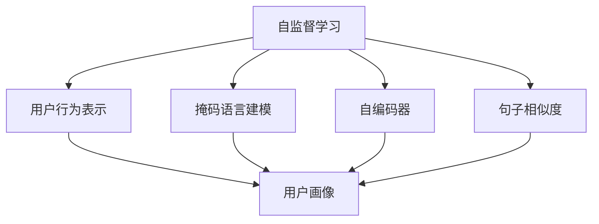

                 

# 基于自监督学习的用户行为表示学习

## 1. 背景介绍

### 1.1 问题由来

在当今数字化时代，大量的用户数据被互联网平台收集并用于分析，以提升用户体验和服务质量。这些数据包括浏览历史、购买记录、社交互动等行为数据。如何有效表示和利用这些数据，从而实现个性化推荐、用户画像生成、广告定向等应用，是当前人工智能领域的一个重要研究方向。

然而，传统的方法往往依赖于手工设计的特征工程，难以全面准确地表示用户行为的多样性和复杂性。同时，由于标注数据的稀缺和标注成本的高昂，构建高质量的用户行为表示模型也面临巨大挑战。为此，基于自监督学习的用户行为表示方法应运而生，通过在大规模无标签数据上进行预训练，学习用户行为的隐含语义表示，无需依赖昂贵的标注数据，即可构建出高质量的用户行为表示模型。

### 1.2 问题核心关键点

基于自监督学习的用户行为表示学习，本质上是通过在大规模无标签数据上进行预训练，学习用户行为的隐含语义表示。其核心思想是：利用用户行为数据中的隐含语义信息，在无需标注数据的情况下，通过自监督学习任务训练出一个能够有效表示用户行为的模型。

具体而言，常用的自监督学习任务包括：

1. 掩码语言建模(Masked Language Modeling, MLM)：预测文本中缺失的词，利用上下文信息学习词汇之间的关系。
2. 自编码器(Autoregressive Encoder)：通过预测输入序列，学习序列内部的关系。
3. 句子相似度(Sentence Similarity)：将句子映射到一个向量空间，通过比较向量之间的距离，衡量句子之间的相似度。

这些自监督学习任务均可以在用户行为数据上实现，无需额外的标注数据。通过在大规模无标签数据上进行预训练，模型能够学习到用户行为的深层语义表示，进而用于后续的微调或特征提取，提升下游任务的效果。

### 1.3 问题研究意义

研究基于自监督学习的用户行为表示方法，对于提升用户行为数据的利用率，构建高质量的用户画像，提升个性化推荐和广告定向等应用的效果，具有重要意义：

1. 降低成本：基于自监督学习，无需依赖标注数据，可以显著降低数据标注成本，提升数据利用效率。
2. 提高效果：自监督学习可以学习到数据中的隐含语义信息，提升下游任务的性能，特别是在数据量有限的情况下。
3. 通用适用：自监督学习方法可以应用于各种用户行为数据分析任务，具有广泛的适用性。
4. 自适应性强：自监督学习可以在不断积累的新数据上持续进行预训练和微调，增强模型的适应性。
5. 数据驱动：基于自监督学习，用户行为数据的价值可以最大化发挥，有助于构建更加全面、精准的用户画像。

## 2. 核心概念与联系

### 2.1 核心概念概述

为更好地理解基于自监督学习的用户行为表示方法，本节将介绍几个密切相关的核心概念：

- 自监督学习(Self-supervised Learning)：指在没有标注数据的情况下，利用数据的隐含信息进行学习的过程。常见的自监督学习方法包括掩码语言建模、自编码器等。
- 用户行为表示(User Behavior Representation)：指将用户行为数据转化为能够反映用户兴趣、偏好、行为模式等信息的向量表示。
- 掩码语言建模(Masked Language Modeling, MLM)：指在预测文本中缺失的词时，利用上下文信息学习词汇之间的关系，提升词汇的表示能力。
- 自编码器(Autoregressive Encoder)：指通过预测输入序列，学习序列内部的关系，提升序列的表示能力。
- 句子相似度(Sentence Similarity)：指将句子映射到一个向量空间，通过比较向量之间的距离，衡量句子之间的相似度。
- 用户画像(User Persona)：指基于用户行为数据，构建出能够反映用户特征和偏好的用户表示，用于个性化推荐、广告定向等应用。

这些核心概念之间的逻辑关系可以通过以下Mermaid流程图来展示：



这个流程图展示了大语言模型的核心概念及其之间的关系：

1. 自监督学习是大语言模型构建的基础，通过无标签数据进行预训练，学习语言的深层语义表示。
2. 掩码语言建模、自编码器、句子相似度等自监督学习任务，是构建用户行为表示模型的关键步骤。
3. 用户行为表示模型通过学习用户行为数据中的隐含语义信息，将用户行为映射为向量表示。
4. 用户画像基于用户行为表示，进一步挖掘用户特征和偏好，用于下游应用。

这些概念共同构成了用户行为表示的逻辑框架，使得模型能够在大规模无标签数据上学习到用户行为的深层语义表示，进而用于各种NLP和用户行为分析任务。

## 3. 核心算法原理 & 具体操作步骤
### 3.1 算法原理概述

基于自监督学习的用户行为表示方法，核心在于利用用户行为数据中的隐含语义信息，进行无监督的预训练，学习出能够有效表示用户行为的向量表示。具体而言，主要包括以下几个步骤：

1. 收集用户行为数据：从用户行为日志、交易记录、搜索历史等数据源中，收集到大量的用户行为数据。
2. 数据预处理：对数据进行清洗、去重、标准化等处理，构建出适合自监督学习任务的数据集。
3. 选择自监督学习任务：根据任务需求，选择合适的自监督学习任务，如掩码语言建模、自编码器、句子相似度等。
4. 构建模型：基于选定的自监督学习任务，构建相应的模型架构。
5. 进行预训练：在大规模无标签数据上进行预训练，学习出用户行为的隐含语义表示。
6. 微调或特征提取：将预训练模型进行微调，或者将其作为特征提取器，用于下游任务。

### 3.2 算法步骤详解

以下将详细介绍基于自监督学习的用户行为表示方法的详细步骤：

**Step 1: 数据收集与预处理**
- 收集用户行为数据：从网站、App等平台中，收集到大量的用户行为数据，包括浏览历史、购买记录、搜索历史等。
- 数据清洗：去除数据中的噪声和异常值，对缺失值进行填充或删除。
- 数据标准化：对数据进行归一化、标准化等处理，使得数据具有更强的鲁棒性和可比较性。

**Step 2: 数据划分**
- 将数据集划分为训练集、验证集和测试集。训练集用于模型预训练，验证集用于超参数调优，测试集用于模型性能评估。
- 数据集划分需要确保各集之间的分布一致，以避免数据偏差。

**Step 3: 选择自监督学习任务**
- 根据任务需求，选择合适的自监督学习任务。如掩码语言建模、自编码器、句子相似度等。
- 不同的自监督学习任务适用于不同的用户行为表示需求，如掩码语言建模适用于文本数据，自编码器适用于序列数据，句子相似度适用于多模态数据等。

**Step 4: 构建模型**
- 基于选定的自监督学习任务，构建相应的模型架构。如使用Transformer模型实现掩码语言建模，使用循环神经网络(RNN)实现自编码器等。
- 模型架构的设计需要考虑任务类型、数据规模等因素，以确保模型的有效性和效率。

**Step 5: 进行预训练**
- 在大规模无标签数据上进行预训练，学习出用户行为的隐含语义表示。
- 预训练过程需要选择合适的超参数，如学习率、批次大小、训练轮数等，以确保模型能够学习到足够的隐含语义信息。
- 预训练过程可以采用多任务学习、数据增强、对抗训练等技术，提高模型的泛化能力和鲁棒性。

**Step 6: 微调或特征提取**
- 将预训练模型进行微调，或者将其作为特征提取器，用于下游任务。
- 微调过程需要选择合适的任务适配层，如分类层、回归层等，以及相应的损失函数和优化器。
- 特征提取过程可以直接使用预训练模型的隐藏层表示，无需额外的微调，适用于计算资源受限的场景。

### 3.3 算法优缺点

基于自监督学习的用户行为表示方法具有以下优点：
1. 无需标注数据：自监督学习方法可以利用无标签数据进行预训练，避免依赖昂贵的标注数据，降低数据成本。
2. 高效便捷：基于大规模无标签数据，模型可以无需手动设计特征工程，直接进行预训练，获得高质量的用户行为表示。
3. 泛化能力强：自监督学习任务设计合理，可以有效学习到数据的隐含语义信息，提高模型的泛化能力。
4. 模型灵活：自监督学习方法可以灵活应用于各种用户行为数据分析任务，具有广泛的适用性。
5. 动态更新：自监督学习方法可以不断利用新数据进行预训练，保持模型的最新状态。

同时，该方法也存在以下局限性：
1. 数据质量要求高：自监督学习依赖于数据本身的隐含语义信息，对数据的真实性和完整性要求较高。
2. 模型复杂度高：自监督学习需要构建复杂的模型架构，计算资源消耗较大。
3. 超参数调优难：自监督学习任务的设计和超参数的选择需要经验丰富的专家，调优难度较大。
4. 模型可解释性不足：自监督学习方法生成的用户行为表示缺乏可解释性，难以理解其内部工作机制。

尽管存在这些局限性，但就目前而言，基于自监督学习的用户行为表示方法，在无需标注数据的情况下，能够高效便捷地构建出高质量的用户行为表示模型，已经成为用户行为分析的重要手段。

### 3.4 算法应用领域

基于自监督学习的用户行为表示方法，在用户行为分析领域已经得到了广泛的应用，涵盖各种NLP和用户行为分析任务，例如：

- 用户画像生成：基于用户行为数据，构建用户兴趣、偏好、行为模式等信息的向量表示。
- 个性化推荐：将用户行为表示作为特征输入，训练推荐模型，提升推荐效果。
- 广告定向：基于用户行为表示，预测用户对广告的响应概率，进行定向投放。
- 舆情监测：利用用户行为数据中的情感信息，监测用户对产品的评价和反馈，提升产品优化。
- 用户行为预测：通过用户行为表示，预测用户未来的行为和趋势，进行精准营销。

除了上述这些经典任务外，自监督学习方法还被创新性地应用到更多场景中，如内容生成、搜索排序、语音识别等，为NLP技术带来了全新的突破。随着自监督学习技术的不断进步，相信自监督学习方法将在更广阔的应用领域大放异彩。

## 4. 数学模型和公式 & 详细讲解  
### 4.1 数学模型构建

本节将使用数学语言对基于自监督学习的用户行为表示方法进行更加严格的刻画。

记用户行为数据为 $D=\{x_i\}_{i=1}^N$，其中 $x_i$ 为用户的第 $i$ 个行为记录。假设模型为 $M_{\theta}:\mathcal{X} \rightarrow \mathcal{Y}$，其中 $\mathcal{X}$ 为用户行为数据空间，$\mathcal{Y}$ 为向量表示空间，$\theta$ 为模型参数。

定义模型 $M_{\theta}$ 在数据样本 $x$ 上的损失函数为 $\ell(M_{\theta}(x),y)$，则在数据集 $D$ 上的经验风险为：

$$
\mathcal{L}(\theta) = \frac{1}{N} \sum_{i=1}^N \ell(M_{\theta}(x_i),x_i)
$$

其中 $\ell$ 为自监督学习任务定义的损失函数，用于衡量模型预测与真实数据的差异。常见的自监督损失函数包括掩码语言建模损失、自编码器损失、句子相似度损失等。

### 4.2 公式推导过程

以下我们以掩码语言建模任务为例，推导自监督损失函数及其梯度的计算公式。

假设模型 $M_{\theta}$ 在输入 $x$ 上的输出为 $\hat{x}=M_{\theta}(x)$，表示对输入数据的预测。在掩码语言建模任务中，模型需要预测文本中缺失的词，对于输入 $x$ 中的掩码位置 $i$，模型输出的概率分布为 $p(x_i|x_{<i})$。定义损失函数为：

$$
\ell(x_i) = -\log p(x_i|x_{<i})
$$

则模型在数据集 $D$ 上的经验风险为：

$$
\mathcal{L}(\theta) = \frac{1}{N} \sum_{i=1}^N \ell(x_i)
$$

根据链式法则，损失函数对参数 $\theta_k$ 的梯度为：

$$
\frac{\partial \mathcal{L}(\theta)}{\partial \theta_k} = -\frac{1}{N} \sum_{i=1}^N \frac{\partial \ell(x_i)}{\partial M_{\theta}(x_i)} \frac{\partial M_{\theta}(x_i)}{\partial \theta_k}
$$

其中 $\frac{\partial M_{\theta}(x_i)}{\partial \theta_k}$ 可进一步递归展开，利用自动微分技术完成计算。

在得到损失函数的梯度后，即可带入参数更新公式，完成模型的迭代优化。重复上述过程直至收敛，最终得到适应用户行为数据的模型参数 $\theta^*$。

## 5. 项目实践：代码实例和详细解释说明
### 5.1 开发环境搭建

在进行用户行为表示学习实践前，我们需要准备好开发环境。以下是使用Python进行PyTorch开发的环境配置流程：

1. 安装Anaconda：从官网下载并安装Anaconda，用于创建独立的Python环境。

2. 创建并激活虚拟环境：
```bash
conda create -n pytorch-env python=3.8 
conda activate pytorch-env
```

3. 安装PyTorch：根据CUDA版本，从官网获取对应的安装命令。例如：
```bash
conda install pytorch torchvision torchaudio cudatoolkit=11.1 -c pytorch -c conda-forge
```

4. 安装transformers库：
```bash
pip install transformers
```

5. 安装各类工具包：
```bash
pip install numpy pandas scikit-learn matplotlib tqdm jupyter notebook ipython
```

完成上述步骤后，即可在`pytorch-env`环境中开始用户行为表示学习的实践。

### 5.2 源代码详细实现

下面我们以用户画像生成任务为例，给出使用Transformers库对预训练模型进行掩码语言建模的PyTorch代码实现。

首先，定义用户画像任务的数据处理函数：

```python
from transformers import BertTokenizer
from torch.utils.data import Dataset
import torch

class UserProfileDataset(Dataset):
    def __init__(self, texts, tokenizer, max_len=128):
        self.texts = texts
        self.tokenizer = tokenizer
        self.max_len = max_len
        
    def __len__(self):
        return len(self.texts)
    
    def __getitem__(self, item):
        text = self.texts[item]
        
        encoding = self.tokenizer(text, return_tensors='pt', max_length=self.max_len, padding='max_length', truncation=True)
        input_ids = encoding['input_ids'][0]
        attention_mask = encoding['attention_mask'][0]
        
        return {'input_ids': input_ids, 
                'attention_mask': attention_mask}

# 定义tokenizer
tokenizer = BertTokenizer.from_pretrained('bert-base-cased')

# 构建dataset
train_dataset = UserProfileDataset(train_texts, tokenizer)
dev_dataset = UserProfileDataset(dev_texts, tokenizer)
test_dataset = UserProfileDataset(test_texts, tokenizer)
```

然后，定义模型和优化器：

```python
from transformers import BertForMaskedLM, AdamW

model = BertForMaskedLM.from_pretrained('bert-base-cased')
optimizer = AdamW(model.parameters(), lr=2e-5)
```

接着，定义训练和评估函数：

```python
from torch.utils.data import DataLoader
from tqdm import tqdm
from sklearn.metrics import accuracy_score

device = torch.device('cuda') if torch.cuda.is_available() else torch.device('cpu')
model.to(device)

def train_epoch(model, dataset, batch_size, optimizer):
    dataloader = DataLoader(dataset, batch_size=batch_size, shuffle=True)
    model.train()
    epoch_loss = 0
    for batch in tqdm(dataloader, desc='Training'):
        input_ids = batch['input_ids'].to(device)
        attention_mask = batch['attention_mask'].to(device)
        model.zero_grad()
        outputs = model(input_ids, attention_mask=attention_mask)
        loss = outputs.loss
        epoch_loss += loss.item()
        loss.backward()
        optimizer.step()
    return epoch_loss / len(dataloader)

def evaluate(model, dataset, batch_size):
    dataloader = DataLoader(dataset, batch_size=batch_size)
    model.eval()
    preds, labels = [], []
    with torch.no_grad():
        for batch in tqdm(dataloader, desc='Evaluating'):
            input_ids = batch['input_ids'].to(device)
            attention_mask = batch['attention_mask'].to(device)
            batch_preds = model(input_ids, attention_mask=attention_mask).predictions.argmax(dim=2).to('cpu').tolist()
            batch_labels = batch['labels'].to('cpu').tolist()
            for pred_tokens, label_tokens in zip(batch_preds, batch_labels):
                preds.append(pred_tokens)
                labels.append(label_tokens)
                
    print('Accuracy:', accuracy_score(labels, preds))
```

最后，启动训练流程并在测试集上评估：

```python
epochs = 5
batch_size = 16

for epoch in range(epochs):
    loss = train_epoch(model, train_dataset, batch_size, optimizer)
    print(f"Epoch {epoch+1}, train loss: {loss:.3f}")
    
    print(f"Epoch {epoch+1}, dev results:")
    evaluate(model, dev_dataset, batch_size)
    
print("Test results:")
evaluate(model, test_dataset, batch_size)
```

以上就是使用PyTorch对预训练模型进行掩码语言建模的完整代码实现。可以看到，得益于Transformers库的强大封装，我们可以用相对简洁的代码完成用户行为表示的预训练。

### 5.3 代码解读与分析

让我们再详细解读一下关键代码的实现细节：

**UserProfileDataset类**：
- `__init__`方法：初始化文本、分词器等关键组件。
- `__len__`方法：返回数据集的样本数量。
- `__getitem__`方法：对单个样本进行处理，将文本输入编码为token ids，并对其进行定长padding，最终返回模型所需的输入。

**模型和优化器**：
- 使用BertForMaskedLM模型作为预训练语言模型，该模型主要适用于掩码语言建模任务。
- 设置AdamW优化器，用于更新模型参数，并设置合适的学习率。

**训练和评估函数**：
- 使用PyTorch的DataLoader对数据集进行批次化加载，供模型训练和推理使用。
- 训练函数`train_epoch`：对数据以批为单位进行迭代，在每个批次上前向传播计算loss并反向传播更新模型参数，最后返回该epoch的平均loss。
- 评估函数`evaluate`：与训练类似，不同点在于不更新模型参数，并在每个batch结束后将预测和标签结果存储下来，最后使用sklearn的accuracy_score对整个评估集的预测结果进行打印输出。

**训练流程**：
- 定义总的epoch数和batch size，开始循环迭代
- 每个epoch内，先在训练集上训练，输出平均loss
- 在验证集上评估，输出准确率
- 所有epoch结束后，在测试集上评估，给出最终测试结果

可以看到，PyTorch配合Transformers库使得用户行为表示的预训练代码实现变得简洁高效。开发者可以将更多精力放在数据处理、模型改进等高层逻辑上，而不必过多关注底层的实现细节。

当然，工业级的系统实现还需考虑更多因素，如模型的保存和部署、超参数的自动搜索、更灵活的任务适配层等。但核心的用户行为表示学习流程基本与此类似。

## 6. 实际应用场景
### 6.1 智能推荐系统

基于用户行为表示，智能推荐系统可以实现高效精准的个性化推荐。传统的推荐系统往往依赖于用户的历史行为数据进行物品推荐，难以捕捉用户深层次的兴趣和偏好。利用用户行为表示，智能推荐系统可以通过学习用户行为中的隐含语义信息，构建出用户画像，从而实现更加全面、精准的推荐。

在技术实现上，可以收集用户的历史浏览、点击、购买等行为数据，构建用户行为数据集。在此基础上，对预训练模型进行掩码语言建模任务的微调，学习用户行为的深层语义表示。微调后的模型可以输出用户画像的向量表示，用于推荐算法的输入。结合用户画像，推荐系统能够根据用户当前的兴趣和偏好，动态调整推荐内容，提升用户满意度。

### 6.2 广告定向

基于用户行为表示，广告定向系统可以实现更有效的广告投放。传统的广告定向系统往往依赖于人工定义的特征工程，难以全面捕捉用户的特征和行为模式。利用用户行为表示，广告定向系统可以通过学习用户行为中的隐含语义信息，构建出用户画像，从而实现更精准的广告定向。

在技术实现上，可以收集用户的历史浏览、搜索、点击等行为数据，构建用户行为数据集。在此基础上，对预训练模型进行掩码语言建模任务的微调，学习用户行为的深层语义表示。微调后的模型可以输出用户画像的向量表示，用于广告定向算法的输入。结合用户画像，广告系统能够预测用户对广告的响应概率，实现定向投放，提高广告效果。

### 6.3 舆情监测

基于用户行为表示，舆情监测系统可以实现智能化的舆情分析。传统的舆情监测系统往往依赖于人工提取的关键词和情感信息，难以全面捕捉用户对产品的评价和反馈。利用用户行为表示，舆情监测系统可以通过学习用户行为中的情感信息，构建出用户画像，从而实现更智能化的舆情分析。

在技术实现上，可以收集用户对产品评论、评分等行为数据，构建用户行为数据集。在此基础上，对预训练模型进行掩码语言建模任务的微调，学习用户行为的深层语义表示。微调后的模型可以输出用户画像的向量表示，用于舆情分析算法的输入。结合用户画像，舆情监测系统能够预测用户对产品的情感倾向，实现智能化的舆情分析，提升产品优化效果。

### 6.4 用户行为预测

基于用户行为表示，用户行为预测系统可以实现精准的用户行为预测。传统的用户行为预测系统往往依赖于手动设计的特征工程，难以全面捕捉用户的动态行为模式。利用用户行为表示，用户行为预测系统可以通过学习用户行为中的隐含语义信息，构建出用户画像，从而实现更精准的用户行为预测。

在技术实现上，可以收集用户的历史行为数据，构建用户行为数据集。在此基础上，对预训练模型进行掩码语言建模任务的微调，学习用户行为的深层语义表示。微调后的模型可以输出用户画像的向量表示，用于用户行为预测算法的输入。结合用户画像，用户行为预测系统能够预测用户未来的行为和趋势，实现精准的营销策略，提升用户体验。

### 6.5 未来应用展望

随着用户行为表示学习技术的发展，未来其在NLP和用户行为分析领域的应用前景将更加广阔。

在智慧医疗领域，基于用户行为表示的用户画像，可以为患者提供更加个性化的医疗建议，提升医疗服务的智能化水平，辅助医生诊疗，加速新药开发进程。

在智能教育领域，用户行为表示可以用于个性化学习路径的设计，因材施教，促进教育公平，提高教学质量。

在智慧城市治理中，用户行为表示可以用于城市事件监测、舆情分析、应急指挥等环节，提高城市管理的自动化和智能化水平，构建更安全、高效的未来城市。

此外，在企业生产、社会治理、文娱传媒等众多领域，基于用户行为表示的学习方法也将不断涌现，为传统行业数字化转型升级提供新的技术路径。相信随着技术的日益成熟，用户行为表示学习必将在构建人机协同的智能时代中扮演越来越重要的角色。

## 7. 工具和资源推荐
### 7.1 学习资源推荐

为了帮助开发者系统掌握用户行为表示学习的基本概念和实践技巧，这里推荐一些优质的学习资源：

1. 《Transformer从原理到实践》系列博文：由大模型技术专家撰写，深入浅出地介绍了Transformer原理、用户行为表示学习等前沿话题。

2. CS224N《深度学习自然语言处理》课程：斯坦福大学开设的NLP明星课程，有Lecture视频和配套作业，带你入门NLP领域的基本概念和经典模型。

3. 《Natural Language Processing with Transformers》书籍：Transformers库的作者所著，全面介绍了如何使用Transformers库进行NLP任务开发，包括用户行为表示在内的诸多范式。

4. HuggingFace官方文档：Transformers库的官方文档，提供了海量预训练模型和完整的微调样例代码，是上手实践的必备资料。

5. CLUE开源项目：中文语言理解测评基准，涵盖大量不同类型的中文NLP数据集，并提供了基于用户行为表示的baseline模型，助力中文NLP技术发展。

通过对这些资源的学习实践，相信你一定能够快速掌握用户行为表示学习的精髓，并用于解决实际的NLP问题。
###  7.2 开发工具推荐

高效的开发离不开优秀的工具支持。以下是几款用于用户行为表示学习的常用工具：

1. PyTorch：基于Python的开源深度学习框架，灵活动态的计算图，适合快速迭代研究。大部分预训练语言模型都有PyTorch版本的实现。

2. TensorFlow：由Google主导开发的开源深度学习框架，生产部署方便，适合大规模工程应用。同样有丰富的预训练语言模型资源。

3. Transformers库：HuggingFace开发的NLP工具库，集成了众多SOTA语言模型，支持PyTorch和TensorFlow，是进行用户行为表示学习的利器。

4. Weights & Biases：模型训练的实验跟踪工具，可以记录和可视化模型训练过程中的各项指标，方便对比和调优。与主流深度学习框架无缝集成。

5. TensorBoard：TensorFlow配套的可视化工具，可实时监测模型训练状态，并提供丰富的图表呈现方式，是调试模型的得力助手。

6. Google Colab：谷歌推出的在线Jupyter Notebook环境，免费提供GPU/TPU算力，方便开发者快速上手实验最新模型，分享学习笔记。

合理利用这些工具，可以显著提升用户行为表示学习的开发效率，加快创新迭代的步伐。

### 7.3 相关论文推荐

用户行为表示学习的研究源于学界的持续研究。以下是几篇奠基性的相关论文，推荐阅读：

1. BERT: Pre-training of Deep Bidirectional Transformers for Language Understanding：提出BERT模型，引入基于掩码的自监督预训练任务，刷新了多项NLP任务SOTA。

2. Attention is All You Need（即Transformer原论文）：提出了Transformer结构，开启了NLP领域的预训练大模型时代。

3. Masked Language Model：提出掩码语言建模任务，通过预测文本中缺失的词，学习词汇之间的关系。

4. Autoregressive Language Models：提出自编码器任务，通过预测输入序列，学习序列内部的关系。

5. Sentence Similarity via Continuous Semantic Embeddings：提出句子相似度任务，将句子映射到一个向量空间，通过比较向量之间的距离，衡量句子之间的相似度。

6. Learning Deep Structured Representations from Unsupervised Learning Algorithms：提出多层神经网络，通过无监督学习任务学习到数据中的隐含语义信息，提升数据表示能力。

这些论文代表了大语言模型用户行为表示学习的核心研究内容。通过学习这些前沿成果，可以帮助研究者把握学科前进方向，激发更多的创新灵感。

## 8. 总结：未来发展趋势与挑战
### 8.1 总结

本文对基于自监督学习的用户行为表示方法进行了全面系统的介绍。首先阐述了用户行为表示学习的研究背景和意义，明确了该方法在大规模无标签数据上学习用户行为隐含语义表示的价值。其次，从原理到实践，详细讲解了用户行为表示的数学原理和关键步骤，给出了用户行为表示学习的完整代码实例。同时，本文还广泛探讨了用户行为表示方法在智能推荐、广告定向、舆情监测等诸多应用场景中的应用前景，展示了其广阔的应用前景。此外，本文精选了用户行为表示学习的各类学习资源，力求为读者提供全方位的技术指引。

通过本文的系统梳理，可以看到，基于自监督学习的用户行为表示方法，在大规模无标签数据上高效便捷地学习出高质量的用户行为表示，已经成为用户行为分析的重要手段。它能够充分利用用户行为数据的隐含语义信息，提升下游任务的性能，具有广泛的应用价值。

### 8.2 未来发展趋势

展望未来，用户行为表示学习技术将呈现以下几个发展趋势：

1. 模型规模持续增大。随着算力成本的下降和数据规模的扩张，预训练语言模型的参数量还将持续增长。超大批次的训练和推理也可能遇到显存不足的问题。如何提高模型效率，提升推理速度，优化资源占用，将是重要的优化方向。

2. 自监督学习任务多样化。随着研究的深入，更多的自监督学习任务将被提出和应用，如掩码句子相似度、掩码推理等。这些任务将进一步提升用户行为表示模型的泛化能力和鲁棒性。

3. 多任务学习兴起。通过在多个自监督学习任务上进行联合训练，用户行为表示模型可以学习到更全面的语义信息，提升模型的表现和鲁棒性。

4. 模型可解释性增强。如何提高用户行为表示模型的可解释性，理解其内部工作机制，将成为未来的重要研究方向。

5. 融合多模态数据。除了文本数据，用户行为数据还可以包括图像、音频、视频等多模态数据。如何将多模态数据整合到用户行为表示模型中，提升模型的综合表现，将是未来的重要研究方向。

6. 用户行为数据实时化。如何在用户行为数据实时变化的情况下，持续更新用户行为表示模型，保持其最新状态，将是未来的重要研究方向。

以上趋势凸显了用户行为表示学习技术的广阔前景。这些方向的探索发展，必将进一步提升用户行为表示模型的性能和应用范围，为构建智能推荐、广告定向等应用提供新的技术路径。

### 8.3 面临的挑战

尽管用户行为表示学习技术已经取得了显著的进展，但在迈向更加智能化、普适化应用的过程中，它仍面临着诸多挑战：

1. 数据质量要求高。用户行为数据的质量直接影响模型的表现，对数据的真实性和完整性要求较高。

2. 模型复杂度高。用户行为表示模型需要构建复杂的模型架构，计算资源消耗较大。

3. 超参数调优难。用户行为表示任务的设计和超参数的选择需要经验丰富的专家，调优难度较大。

4. 模型可解释性不足。用户行为表示模型的内部工作机制难以理解，缺乏可解释性。

5. 多模态数据整合复杂。如何将多模态数据整合到用户行为表示模型中，提升模型的综合表现，仍是一个重要研究方向。

6. 实时数据处理困难。如何在用户行为数据实时变化的情况下，持续更新用户行为表示模型，保持其最新状态，仍是一个重要研究方向。

尽管存在这些挑战，但用户行为表示学习技术以其高效便捷的特点，已经在用户行为分析领域发挥了重要作用。未来，随着技术的不断进步，相信这些问题都将逐步得到解决，用户行为表示学习将为人工智能应用带来更大的推动力。

### 8.4 研究展望

面对用户行为表示学习所面临的种种挑战，未来的研究需要在以下几个方面寻求新的突破：

1. 探索高效便捷的预训练方法。开发更加高效便捷的预训练方法，降低用户行为表示学习的门槛，提升模型的泛化能力和鲁棒性。

2. 研究多模态数据的融合方法。将多模态数据整合到用户行为表示模型中，提升模型的综合表现，拓宽应用场景。

3. 引入先验知识和规则。将符号化的先验知识，如知识图谱、逻辑规则等，与神经网络模型进行巧妙融合，提升模型的解释性和表现力。

4. 加强数据隐私保护。在用户行为表示学习过程中，如何保护用户隐私，防止用户数据的滥用，是未来的重要研究方向。

5. 研究实时数据处理技术。开发实时数据处理技术，使得用户行为表示模型能够持续更新，适应数据的实时变化。

6. 探索模型的可解释性。通过引入因果分析、符号逻辑等工具，提升用户行为表示模型的可解释性，理解其内部工作机制，增强模型的可信度和安全性。

这些研究方向的探索，必将引领用户行为表示学习技术迈向更高的台阶，为构建安全、可靠、可解释、可控的智能系统铺平道路。面向未来，用户行为表示学习技术还需要与其他人工智能技术进行更深入的融合，如知识表示、因果推理、强化学习等，多路径协同发力，共同推动人工智能技术的进步。只有勇于创新、敢于突破，才能不断拓展人工智能应用领域的边界，让智能技术更好地造福人类社会。

## 9. 附录：常见问题与解答

**Q1：用户行为表示学习是否适用于所有用户行为数据分析任务？**

A: 用户行为表示学习在大多数用户行为数据分析任务上都能取得不错的效果，特别是对于数据量较小的任务。但对于一些特定领域的任务，如医学、法律等，仅仅依靠通用语料预训练的模型可能难以很好地适应。此时需要在特定领域语料上进一步预训练，再进行微调，才能获得理想效果。此外，对于一些需要时效性、个性化很强的任务，如对话、推荐等，用户行为表示学习的方法也需要针对性的改进优化。

**Q2：用户行为表示学习中的自监督学习任务有哪些？**

A: 用户行为表示学习中的自监督学习任务主要包括掩码语言建模、自编码器、句子相似度等。这些任务能够利用用户行为数据中的隐含语义信息，进行无监督的预训练，学习出能够有效表示用户行为的向量表示。

**Q3：用户行为表示学习的关键步骤是什么？**

A: 用户行为表示学习的关键步骤包括数据收集与预处理、数据划分、选择自监督学习任务、构建模型、进行预训练、微调或特征提取。通过这些步骤，可以高效便捷地构建出高质量的用户行为表示模型。

**Q4：用户行为表示学习在实际应用中需要注意哪些问题？**

A: 用户行为表示学习在实际应用中需要注意数据质量、模型复杂度、超参数调优、模型可解释性、多模态数据整合、实时数据处理等问题。只有在数据、模型、训练、推理等各环节进行全面优化，才能最大限度地发挥用户行为表示学习的优势。

**Q5：用户行为表示学习对标注数据的需求是什么？**

A: 用户行为表示学习在大规模无标签数据上进行预训练，无需依赖标注数据，可以显著降低数据标注成本，提升数据利用效率。但后续微调或特征提取阶段，可能仍需少量标注数据用于任务适配。

**Q6：用户行为表示学习的优势和局限性是什么？**

A: 用户行为表示学习的优势在于高效便捷、无标注数据需求、泛化能力强等。局限性在于数据质量要求高、模型复杂度高、超参数调优难、模型可解释性不足等。

**Q7：用户行为表示学习的未来研究方向是什么？**

A: 用户行为表示学习的未来研究方向包括探索高效便捷的预训练方法、研究多模态数据的融合方法、引入先验知识和规则、加强数据隐私保护、研究实时数据处理技术、探索模型的可解释性等。

通过本文的系统梳理，可以看到，基于自监督学习的用户行为表示方法，在大规模无标签数据上高效便捷地学习出高质量的用户行为表示，已经成为用户行为分析的重要手段。它能够充分利用用户行为数据的隐含语义信息，提升下游任务的性能，具有广泛的应用价值。未来，随着研究的不断深入，相信用户行为表示学习将为人工智能应用带来更大的推动力。

