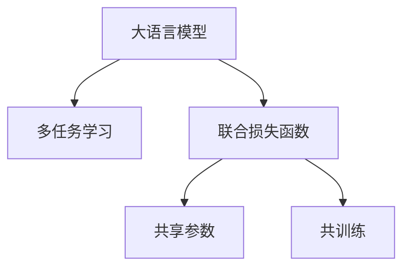

                 

# 多任务AI：LLM的线程管理

在人工智能领域，尤其是自然语言处理(NLP)领域，多任务学习(Multi-Task Learning, MTL)正逐渐成为新的研究热点。多任务学习通过同时学习多个相关任务的联合目标，显著提高了模型的泛化能力，减少了数据需求，进而提升了模型在不同任务上的性能表现。本文将重点探讨大语言模型(Large Language Models, LLMs)中的多任务学习，即如何在大语言模型中实现高效、灵活的线程管理，以提升模型的多任务处理能力。

## 1. 背景介绍

### 1.1 问题由来

随着深度学习技术的快速发展，特别是Transformer模型的提出，大语言模型在处理自然语言任务方面取得了显著进步。这些模型通常采用自回归或自编码的方式，通过在海量无标签文本语料上进行预训练，学习到通用的语言知识，从而具备了强大的语言理解和生成能力。

然而，在实际应用中，单一任务的模型往往难以满足用户的多种需求。例如，对于智能客服系统，一个用户可能在咨询的同时进行多项查询；对于金融分析，研究人员需要同时处理市场数据、企业财务报表等多种信息源。因此，单一任务的模型难以处理复杂多变的现实需求，多任务学习应运而生。

### 1.2 问题核心关键点

多任务学习旨在通过同时训练多个相关任务，共享模型的底层特征提取器，以提升模型在不同任务上的泛化能力和性能。在多任务学习中，多个任务通常通过共享模型参数或者共训练的方式实现联合学习，从而减少数据的消耗，提升模型的泛化能力和鲁棒性。

在大语言模型中，多任务学习具有以下核心要点：
- **任务相关性**：多任务学习中的各个任务必须具有一定的相关性，以便共享特征提取器。
- **共享参数**：多任务模型通常需要共享底层参数，以便于提升模型在多个任务上的性能。
- **损失函数设计**：多任务学习需要设计联合损失函数，以平衡不同任务之间的目标。
- **模型优化策略**：需要考虑如何在多任务学习中优化模型的学习过程。

## 2. 核心概念与联系

### 2.1 核心概念概述

为更好地理解大语言模型中的多任务学习，本节将介绍几个密切相关的核心概念：

- **大语言模型**：以自回归或自编码方式预训练的语言模型，通过在海量无标签文本语料上进行预训练，学习到通用的语言表示，具备强大的语言理解和生成能力。
- **多任务学习**：通过同时训练多个相关任务，共享模型的底层特征提取器，以提升模型在不同任务上的泛化能力和性能。
- **联合损失函数**：多任务学习中设计的联合损失函数，用于衡量模型在不同任务上的性能。
- **参数共享**：多任务模型中需要共享的底层参数，以促进不同任务之间的知识迁移。
- **共训练**：多任务模型中，不同任务共训练的过程。

这些核心概念之间的逻辑关系可以通过以下Mermaid流程图来展示：



这个流程图展示了多任务学习在大语言模型中的核心概念及其之间的关系：

1. 大语言模型通过预训练获得基础能力。
2. 多任务学习使得模型能够同时处理多个相关任务，提升模型在不同任务上的泛化能力。
3. 联合损失函数和多任务学习共同设计，确保模型在不同任务上的表现均衡。
4. 参数共享和共训练是实现多任务学习的关键手段。

## 3. 核心算法原理 & 具体操作步骤

### 3.1 算法原理概述

在大语言模型中进行多任务学习，通常可以采用以下两种方式：

1. **多任务联合训练**：多个任务共享同一套模型参数，通过共训练的方式同时优化。
2. **多任务特征共享**：多个任务共享底层特征提取器，通过特征复用的方式提升模型性能。

对于多任务联合训练，模型在优化过程中需要同时考虑多个任务的目标，通常采用联合损失函数和共训练策略。联合损失函数的设计，需要在不同任务之间进行权衡，确保模型在不同任务上的表现均衡。共训练策略则通过优化多个任务的联合目标，提升模型在各个任务上的泛化能力。

### 3.2 算法步骤详解

#### 3.2.1 多任务联合训练

多任务联合训练的步骤如下：

1. **任务定义**：确定多个任务的目标函数。例如，对于金融分析任务，可能包括股票价格预测、市场情绪分析等多个任务。

2. **联合损失函数设计**：设计联合损失函数，例如可以采用加权平均损失函数，对不同任务的损失进行加权。

3. **模型定义**：定义多任务模型，例如使用Transformer模型作为基础模型，共享编码器和解码器。

4. **联合优化**：定义联合优化目标，例如使用AdamW优化器，最小化联合损失函数。

5. **共训练策略**：设计共训练策略，例如通过在模型中添加多个任务层，分别优化不同任务的目标。

6. **模型评估**：在测试集上评估模型在不同任务上的性能，进行对比分析。

#### 3.2.2 多任务特征共享

多任务特征共享的步骤如下：

1. **特征提取器共享**：共享底层的特征提取器，例如使用同一套Transformer层的编码器。

2. **任务层定义**：定义多个任务层，每个任务层使用共享的特征提取器，输出该任务的相关特征。

3. **任务层优化**：分别优化不同任务层的损失函数。

4. **特征融合**：将不同任务层的特征进行融合，输出多任务模型的最终结果。

5. **模型评估**：在测试集上评估模型在不同任务上的性能，进行对比分析。

### 3.3 算法优缺点

多任务学习在大语言模型中的应用具有以下优点：

1. **提升泛化能力**：多任务学习能够提升模型在不同任务上的泛化能力，减少对标注数据的需求。
2. **降低成本**：通过共享模型参数，多任务学习能够降低标注数据的成本，提升模型训练效率。
3. **提升性能**：多任务学习能够提升模型在不同任务上的性能，尤其是在数据量较少的情况下。

同时，多任务学习也存在以下缺点：

1. **模型复杂度高**：多任务模型通常具有较高的复杂度，需要更多的计算资源。
2. **参数共享难度大**：不同任务之间的知识迁移和共享存在一定的难度，需要精心设计模型架构。
3. **模型过拟合风险高**：多任务学习中，模型可能对某个任务进行过拟合，影响其他任务的表现。

### 3.4 算法应用领域

多任务学习在大语言模型中的应用广泛，以下是几个典型的应用领域：

- **智能客服系统**：智能客服系统需要同时处理用户的多项查询，多任务学习能够提升系统处理多任务的能力。
- **金融分析**：金融分析需要处理市场数据、企业财务报表等多个信息源，多任务学习能够提升模型在不同信息源上的泛化能力。
- **自然语言生成**：自然语言生成任务包括文本摘要、翻译等，多任务学习能够提升模型在不同生成任务上的性能。
- **智能推荐系统**：智能推荐系统需要处理用户的多种需求，多任务学习能够提升推荐系统在不同需求上的表现。
- **多模态学习**：多模态学习中，需要处理视觉、文本等多种信息源，多任务学习能够提升模型在多模态数据上的泛化能力。

## 4. 数学模型和公式 & 详细讲解 & 举例说明

### 4.1 数学模型构建

假设我们有一个多任务学习的大语言模型，包含 $K$ 个任务，每个任务的输入为 $x_i$，输出为 $y_i$。多任务模型的输入为 $(x_1, x_2, ..., x_K)$，输出为 $(y_1, y_2, ..., y_K)$。多任务学习中，通常采用联合损失函数 $L$ 来衡量模型在所有任务上的性能，例如：

$$
L(\theta) = \frac{1}{N} \sum_{i=1}^N \left( \sum_{k=1}^K \ell_k(M_{\theta}(x_i), y_i) \right)
$$

其中 $\ell_k$ 为任务 $k$ 的损失函数，$M_{\theta}$ 为多任务模型的参数。多任务学习的目标是最小化联合损失函数 $L$。

### 4.2 公式推导过程

以二分类任务为例，假设多任务学习包含两个任务 $A$ 和 $B$，分别采用二分类任务。任务的损失函数为：

$$
\ell_A(y_A, \hat{y}_A) = -(y_A\log \hat{y}_A + (1-y_A)\log(1-\hat{y}_A))
$$

$$
\ell_B(y_B, \hat{y}_B) = -(y_B\log \hat{y}_B + (1-y_B)\log(1-\hat{y}_B))
$$

联合损失函数为：

$$
L = \frac{1}{N} \sum_{i=1}^N \left( \ell_A(M_{\theta}(x_i), y_{A,i}) + \ell_B(M_{\theta}(x_i), y_{B,i}) \right)
$$

多任务学习的优化目标是最小化联合损失函数 $L$，例如使用AdamW优化器，最小化联合损失函数：

$$
\theta \leftarrow \theta - \eta \nabla_{\theta}L(\theta)
$$

其中 $\eta$ 为学习率，$\nabla_{\theta}L(\theta)$ 为联合损失函数对参数 $\theta$ 的梯度。

### 4.3 案例分析与讲解

以智能客服系统为例，假设有两个任务：对话理解和问题回答。对话理解任务的目标是理解用户的问题，输出相应的上下文；问题回答任务的目标是根据上下文回答问题，输出相应的答案。

对话理解任务：

$$
\ell_{A}(y_A, \hat{y}_A) = -\frac{1}{N}\sum_{i=1}^N \frac{y_{A,i}}{\hat{y}_{A,i}} + \log(1-\hat{y}_{A,i})
$$

问题回答任务：

$$
\ell_{B}(y_B, \hat{y}_B) = -\frac{1}{N}\sum_{i=1}^N \frac{y_{B,i}}{\hat{y}_{B,i}} + \log(1-\hat{y}_{B,i})
$$

联合损失函数：

$$
L = \frac{1}{N} \sum_{i=1}^N \left( \ell_A(M_{\theta}(x_i), y_{A,i}) + \ell_B(M_{\theta}(x_i), y_{B,i}) \right)
$$

在模型优化时，可以使用AdamW优化器，最小化联合损失函数 $L$。通过多任务学习，模型能够同时学习对话理解和问题回答的特征，提升模型在不同任务上的泛化能力。

## 5. 项目实践：代码实例和详细解释说明

### 5.1 开发环境搭建

在进行多任务学习实践前，我们需要准备好开发环境。以下是使用Python进行PyTorch开发的环境配置流程：

1. 安装Anaconda：从官网下载并安装Anaconda，用于创建独立的Python环境。

2. 创建并激活虚拟环境：
```bash
conda create -n mtl-env python=3.8 
conda activate mtl-env
```

3. 安装PyTorch：根据CUDA版本，从官网获取对应的安装命令。例如：
```bash
conda install pytorch torchvision torchaudio cudatoolkit=11.1 -c pytorch -c conda-forge
```

4. 安装TensorFlow：
```bash
pip install tensorflow
```

5. 安装Transformers库：
```bash
pip install transformers
```

6. 安装各类工具包：
```bash
pip install numpy pandas scikit-learn matplotlib tqdm jupyter notebook ipython
```

完成上述步骤后，即可在`mtl-env`环境中开始多任务学习实践。

### 5.2 源代码详细实现

下面我们以智能客服系统为例，给出使用Transformers库进行多任务学习的大语言模型代码实现。

首先，定义多任务数据集：

```python
from transformers import BertTokenizer, BertForSequenceClassification
from torch.utils.data import Dataset, DataLoader
import torch

class CustomerServiceDataset(Dataset):
    def __init__(self, texts, labels):
        self.texts = texts
        self.labels = labels
        self.tokenizer = BertTokenizer.from_pretrained('bert-base-cased')
        self.max_len = 128
        
    def __len__(self):
        return len(self.texts)
    
    def __getitem__(self, item):
        text = self.texts[item]
        label = self.labels[item]
        
        encoding = self.tokenizer(text, return_tensors='pt', max_length=self.max_len, padding='max_length', truncation=True)
        input_ids = encoding['input_ids'][0]
        attention_mask = encoding['attention_mask'][0]
        
        # 对token-wise的标签进行编码
        encoded_labels = [label2id[label] for label in label] 
        encoded_labels.extend([label2id['O']] * (self.max_len - len(encoded_labels)))
        labels = torch.tensor(encoded_labels, dtype=torch.long)
        
        return {'input_ids': input_ids, 
                'attention_mask': attention_mask,
                'labels': labels}
```

然后，定义模型和优化器：

```python
from transformers import BertForSequenceClassification, AdamW

model = BertForSequenceClassification.from_pretrained('bert-base-cased', num_labels=len(label2id))

optimizer = AdamW(model.parameters(), lr=2e-5)
```

接着，定义训练和评估函数：

```python
from tqdm import tqdm
from sklearn.metrics import classification_report

device = torch.device('cuda') if torch.cuda.is_available() else torch.device('cpu')
model.to(device)

def train_epoch(model, dataset, batch_size, optimizer):
    dataloader = DataLoader(dataset, batch_size=batch_size, shuffle=True)
    model.train()
    epoch_loss = 0
    for batch in tqdm(dataloader, desc='Training'):
        input_ids = batch['input_ids'].to(device)
        attention_mask = batch['attention_mask'].to(device)
        labels = batch['labels'].to(device)
        model.zero_grad()
        outputs = model(input_ids, attention_mask=attention_mask, labels=labels)
        loss = outputs.loss
        epoch_loss += loss.item()
        loss.backward()
        optimizer.step()
    return epoch_loss / len(dataloader)

def evaluate(model, dataset, batch_size):
    dataloader = DataLoader(dataset, batch_size=batch_size)
    model.eval()
    preds, labels = [], []
    with torch.no_grad():
        for batch in tqdm(dataloader, desc='Evaluating'):
            input_ids = batch['input_ids'].to(device)
            attention_mask = batch['attention_mask'].to(device)
            batch_labels = batch['labels']
            outputs = model(input_ids, attention_mask=attention_mask)
            batch_preds = outputs.logits.argmax(dim=2).to('cpu').tolist()
            batch_labels = batch_labels.to('cpu').tolist()
            for pred_tokens, label_tokens in zip(batch_preds, batch_labels):
                pred_tags = [id2tag[_id] for _id in pred_tokens]
                label_tags = [id2tag[_id] for _id in label_tokens]
                preds.append(pred_tags[:len(label_tokens)])
                labels.append(label_tags)
                
    print(classification_report(labels, preds))
```

最后，启动训练流程并在测试集上评估：

```python
epochs = 5
batch_size = 16

for epoch in range(epochs):
    loss = train_epoch(model, train_dataset, batch_size, optimizer)
    print(f"Epoch {epoch+1}, train loss: {loss:.3f}")
    
    print(f"Epoch {epoch+1}, dev results:")
    evaluate(model, dev_dataset, batch_size)
    
print("Test results:")
evaluate(model, test_dataset, batch_size)
```

以上就是使用PyTorch对BERT进行多任务学习的智能客服系统代码实现。可以看到，得益于Transformers库的强大封装，我们能够快速构建多任务学习的大语言模型。

### 5.3 代码解读与分析

让我们再详细解读一下关键代码的实现细节：

**CustomerServiceDataset类**：
- `__init__`方法：初始化文本、标签、分词器等关键组件。
- `__len__`方法：返回数据集的样本数量。
- `__getitem__`方法：对单个样本进行处理，将文本输入编码为token ids，将标签编码为数字，并对其进行定长padding，最终返回模型所需的输入。

**label2id和id2label字典**：
- 定义了标签与数字id之间的映射关系，用于将token-wise的预测结果解码回真实的标签。

**训练和评估函数**：
- 使用PyTorch的DataLoader对数据集进行批次化加载，供模型训练和推理使用。
- 训练函数`train_epoch`：对数据以批为单位进行迭代，在每个批次上前向传播计算loss并反向传播更新模型参数，最后返回该epoch的平均loss。
- 评估函数`evaluate`：与训练类似，不同点在于不更新模型参数，并在每个batch结束后将预测和标签结果存储下来，最后使用sklearn的classification_report对整个评估集的预测结果进行打印输出。

**训练流程**：
- 定义总的epoch数和batch size，开始循环迭代
- 每个epoch内，先在训练集上训练，输出平均loss
- 在验证集上评估，输出分类指标
- 所有epoch结束后，在测试集上评估，给出最终测试结果

可以看到，PyTorch配合Transformers库使得多任务学习模型的代码实现变得简洁高效。开发者可以将更多精力放在数据处理、模型改进等高层逻辑上，而不必过多关注底层的实现细节。

当然，工业级的系统实现还需考虑更多因素，如模型的保存和部署、超参数的自动搜索、更灵活的任务适配层等。但核心的多任务学习范式基本与此类似。

## 6. 实际应用场景

### 6.1 智能客服系统

基于多任务学习的多任务语言模型，可以广泛应用于智能客服系统的构建。传统客服往往需要配备大量人力，高峰期响应缓慢，且一致性和专业性难以保证。而使用多任务学习的多任务模型，可以7x24小时不间断服务，快速响应客户咨询，用自然流畅的语言解答各类常见问题。

在技术实现上，可以收集企业内部的历史客服对话记录，将问题和最佳答复构建成监督数据，在此基础上对预训练模型进行多任务学习。多任务模型能够自动理解用户意图，匹配最合适的答案模板进行回复。对于客户提出的新问题，还可以接入检索系统实时搜索相关内容，动态组织生成回答。如此构建的智能客服系统，能大幅提升客户咨询体验和问题解决效率。

### 6.2 金融舆情监测

金融机构需要实时监测市场舆论动向，以便及时应对负面信息传播，规避金融风险。传统的人工监测方式成本高、效率低，难以应对网络时代海量信息爆发的挑战。基于多任务学习的多任务模型，为金融舆情监测提供了新的解决方案。

具体而言，可以收集金融领域相关的新闻、报道、评论等文本数据，并对其进行主题标注和情感标注。在此基础上对预训练语言模型进行多任务学习，使其能够自动判断文本属于何种主题，情感倾向是正面、中性还是负面。将多任务模型应用到实时抓取的网络文本数据，就能够自动监测不同主题下的情感变化趋势，一旦发现负面信息激增等异常情况，系统便会自动预警，帮助金融机构快速应对潜在风险。

### 6.3 个性化推荐系统

当前的推荐系统往往只依赖用户的历史行为数据进行物品推荐，无法深入理解用户的真实兴趣偏好。基于多任务学习的多任务模型，能够更好地挖掘用户行为背后的语义信息，从而提供更精准、多样的推荐内容。

在实践中，可以收集用户浏览、点击、评论、分享等行为数据，提取和用户交互的物品标题、描述、标签等文本内容。将文本内容作为模型输入，用户的后续行为（如是否点击、购买等）作为监督信号，在此基础上对预训练语言模型进行多任务学习。多任务模型能够从文本内容中准确把握用户的兴趣点。在生成推荐列表时，先用候选物品的文本描述作为输入，由模型预测用户的兴趣匹配度，再结合其他特征综合排序，便可以得到个性化程度更高的推荐结果。

### 6.4 未来应用展望

随着多任务学习技术的不断发展，其在多任务学习中的应用前景广阔。未来，多任务学习将进一步拓展到更多领域，为传统行业带来变革性影响。

在智慧医疗领域，基于多任务学习的多任务模型，可以在医疗问答、病历分析、药物研发等任务上取得优异的性能。

在智能教育领域，多任务学习可应用于作业批改、学情分析、知识推荐等方面，因材施教，促进教育公平，提高教学质量。

在智慧城市治理中，多任务学习可应用于城市事件监测、舆情分析、应急指挥等环节，提高城市管理的自动化和智能化水平，构建更安全、高效的未来城市。

此外，在企业生产、社会治理、文娱传媒等众多领域，基于多任务学习的多任务模型也将不断涌现，为NLP技术带来全新的突破。相信随着技术的日益成熟，多任务学习技术将成为NLP技术的重要范式，推动人工智能技术在各行各业的应用进程。

## 7. 工具和资源推荐
### 7.1 学习资源推荐

为了帮助开发者系统掌握多任务学习的理论基础和实践技巧，这里推荐一些优质的学习资源：

1. 《深度学习框架TensorFlow》系列博文：由TensorFlow官方团队撰写，全面介绍了TensorFlow的使用方法和最佳实践。

2. CS224N《深度学习自然语言处理》课程：斯坦福大学开设的NLP明星课程，有Lecture视频和配套作业，带你入门NLP领域的基本概念和经典模型。

3. 《Natural Language Processing with Transformers》书籍：Transformers库的作者所著，全面介绍了如何使用Transformers库进行NLP任务开发，包括多任务学习的范式。

4. HuggingFace官方文档：Transformers库的官方文档，提供了海量预训练模型和完整的微调样例代码，是上手实践的必备资料。

5. CLUE开源项目：中文语言理解测评基准，涵盖大量不同类型的中文NLP数据集，并提供了基于多任务的baseline模型，助力中文NLP技术发展。

通过对这些资源的学习实践，相信你一定能够快速掌握多任务学习的精髓，并用于解决实际的NLP问题。
###  7.2 开发工具推荐

高效的开发离不开优秀的工具支持。以下是几款用于多任务学习开发的常用工具：

1. PyTorch：基于Python的开源深度学习框架，灵活动态的计算图，适合快速迭代研究。大部分预训练语言模型都有PyTorch版本的实现。

2. TensorFlow：由Google主导开发的开源深度学习框架，生产部署方便，适合大规模工程应用。同样有丰富的预训练语言模型资源。

3. Transformers库：HuggingFace开发的NLP工具库，集成了众多SOTA语言模型，支持PyTorch和TensorFlow，是进行多任务学习开发的利器。

4. Weights & Biases：模型训练的实验跟踪工具，可以记录和可视化模型训练过程中的各项指标，方便对比和调优。与主流深度学习框架无缝集成。

5. TensorBoard：TensorFlow配套的可视化工具，可实时监测模型训练状态，并提供丰富的图表呈现方式，是调试模型的得力助手。

6. Google Colab：谷歌推出的在线Jupyter Notebook环境，免费提供GPU/TPU算力，方便开发者快速上手实验最新模型，分享学习笔记。

合理利用这些工具，可以显著提升多任务学习任务的开发效率，加快创新迭代的步伐。

### 7.3 相关论文推荐

多任务学习在大语言模型中的应用源于学界的持续研究。以下是几篇奠基性的相关论文，推荐阅读：

1. Multiple Instance Learning: A Review：概述了多重实例学习的基本概念和应用，为多任务学习提供了理论基础。

2. Cascading Multitask Learning for Sentiment Analysis：提出级联多任务学习框架，用于情感分析任务。

3. Multitask Learning of Language Representations for Zero-Shot Question Answering：提出多任务学习框架，用于零样本问答任务。

4. Multitask Language Model Pretraining：提出多任务语言模型预训练方法，用于文本生成、摘要生成等任务。

5. Multitask Sequence-to-Sequence Learning：提出多任务序列到序列学习框架，用于机器翻译、对话生成等任务。

这些论文代表了大语言模型多任务学习的发展脉络。通过学习这些前沿成果，可以帮助研究者把握学科前进方向，激发更多的创新灵感。

## 8. 总结：未来发展趋势与挑战

### 8.1 总结

本文对基于多任务学习的大语言模型进行了全面系统的介绍。首先阐述了大语言模型和多任务学习的相关背景和意义，明确了多任务学习在提升模型泛化能力和性能方面的独特价值。其次，从原理到实践，详细讲解了多任务学习的数学模型和算法流程，给出了多任务学习的代码实现。同时，本文还广泛探讨了多任务学习在智能客服、金融舆情、个性化推荐等多个行业领域的应用前景，展示了多任务学习方法的巨大潜力。最后，本文精选了多任务学习的各类学习资源，力求为读者提供全方位的技术指引。

通过本文的系统梳理，可以看到，基于多任务学习的大语言模型能够同时处理多个相关任务，提升模型在不同任务上的泛化能力，减少对标注数据的需求，具有显著的性能提升。未来，多任务学习将进一步拓展到更多领域，为传统行业带来变革性影响。

### 8.2 未来发展趋势

展望未来，多任务学习在大语言模型中的应用将呈现以下几个发展趋势：

1. **模型规模持续增大**：随着算力成本的下降和数据规模的扩张，多任务模型的参数量还将持续增长。超大批次的训练和推理也将成为可能。

2. **多任务联合训练成为主流**：多任务联合训练将逐步取代多任务特征共享，成为实现多任务学习的主要手段。

3. **跨领域迁移能力增强**：多任务学习将进一步拓展到跨领域迁移任务，提升模型在不同领域的泛化能力。

4. **多模态学习融合**：多任务学习将与多模态学习技术进一步融合，提升模型在多模态数据上的表现。

5. **多任务模型的部署优化**：如何优化多任务模型的计算图，提升模型推理速度和资源利用率，将成为未来的研究热点。

6. **可解释性增强**：多任务学习模型的决策过程将更加可解释，帮助用户理解模型的输出逻辑。

7. **跨任务协同优化**：如何设计跨任务的协同优化算法，提升多任务学习模型的整体表现，将是未来的研究方向。

以上趋势凸显了多任务学习在大语言模型中的广阔前景。这些方向的探索发展，必将进一步提升多任务学习模型的性能和应用范围，为人工智能技术的发展带来新的突破。

### 8.3 面临的挑战

尽管多任务学习在大语言模型中的应用已经取得了显著成果，但在迈向更加智能化、普适化应用的过程中，它仍面临诸多挑战：

1. **模型复杂度高**：多任务模型通常具有较高的复杂度，需要更多的计算资源。如何在资源有限的情况下进行高效的模型训练，是一个重要的挑战。

2. **数据需求大**：多任务学习需要收集和标注大量的训练数据，对标注成本和时间都有较高要求。如何降低数据需求，是未来的一个重要研究方向。

3. **知识迁移难度大**：不同任务之间的知识迁移和共享存在一定的难度，需要精心设计模型架构。如何有效地实现知识迁移，是未来的研究方向。

4. **模型过拟合风险高**：多任务学习中，模型可能对某个任务进行过拟合，影响其他任务的表现。如何避免过拟合，提高模型泛化能力，是未来的研究方向。

5. **模型鲁棒性不足**：多任务学习模型在不同领域和数据上的鲁棒性可能不足，容易出现泛化能力下降的情况。如何提升模型的鲁棒性，是未来的研究方向。

6. **可解释性不足**：多任务学习模型的决策过程可能缺乏可解释性，难以对其推理逻辑进行分析和调试。如何赋予模型更强的可解释性，是未来的研究方向。

7. **安全性风险**：多任务学习模型可能存在安全漏洞，如数据泄露、模型滥用等风险。如何保障模型安全性，是未来的研究方向。

这些挑战凸显了多任务学习在大语言模型中的复杂性和难度。只有不断探索和突破，才能真正实现多任务学习模型在各种实际场景中的高效应用。

### 8.4 研究展望

面对多任务学习在大语言模型中面临的挑战，未来的研究需要在以下几个方面寻求新的突破：

1. **高效多任务联合训练**：设计更高效的多任务联合训练方法，提升模型训练速度和资源利用率。

2. **参数共享与跨任务协同优化**：设计更有效的参数共享与跨任务协同优化算法，提升模型在不同任务上的表现。

3. **多任务模型的可解释性增强**：设计更强的可解释性框架，帮助用户理解模型的决策过程和推理逻辑。

4. **多模态学习与跨领域迁移**：设计更高效的多模态学习框架，提升模型在多模态数据上的表现，并实现跨领域迁移。

5. **知识迁移与共享**：设计更有效的知识迁移与共享算法，实现不同任务之间的知识迁移和共享。

6. **模型鲁棒性与安全性**：设计更鲁棒和安全的模型架构，提升模型在不同领域和数据上的表现，并保障模型安全性。

这些研究方向将推动多任务学习技术在大语言模型中的应用，提升模型的泛化能力和实用性，为人工智能技术的发展注入新的活力。总之，多任务学习技术将在NLP领域发挥越来越重要的作用，推动NLP技术在垂直行业的规模化落地。

