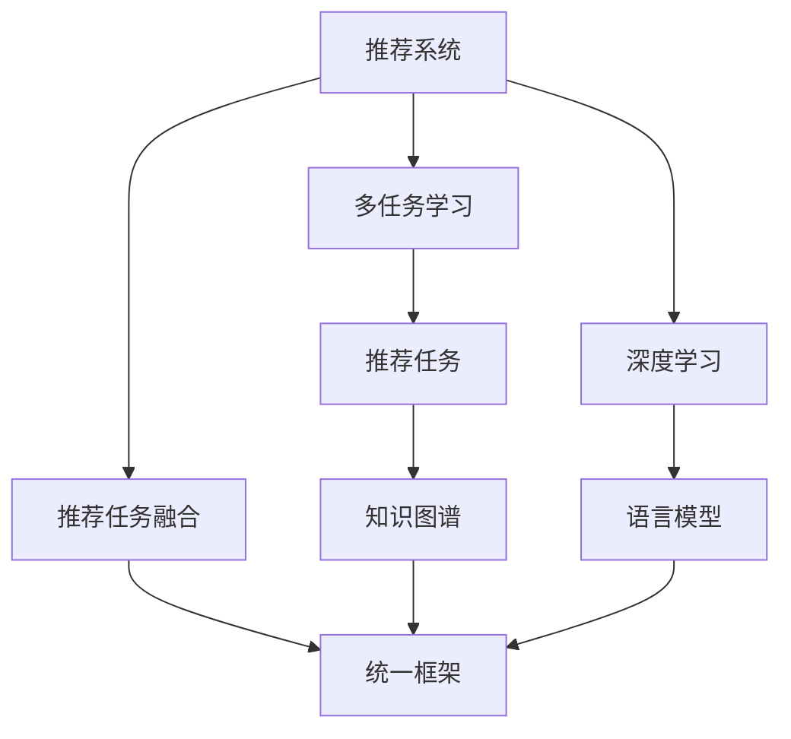

                 

# 多任务推荐系统的优势：LLM的统一框架

## 1. 背景介绍

推荐系统在现代社会中扮演着至关重要的角色。无论是电商平台的商品推荐，视频网站的影片推荐，音乐平台的乐曲推荐，亦或是新闻网站的资讯推荐，都能显著提升用户体验，促进业务增长。传统的推荐系统，往往聚焦于单一任务，通过分析用户行为数据，预测用户对候选物品的评分，从而推荐最相关的物品。

然而，随着互联网应用场景的不断扩展，单一任务推荐系统的局限性逐渐凸显：

- **场景单一**：难以适配复杂的用户场景，如既买书又听歌，既看剧又玩游戏的综合性用户。
- **效果不稳定**：单一任务的模型往往缺乏对多个领域知识点的融合，导致不同领域推荐效果波动较大。
- **难以共享知识**：不同领域的数据和特征缺乏融合，难以通过知识迁移提升推荐效果。

多任务推荐系统旨在解决这些挑战，通过统一的框架，对不同领域的推荐任务进行融合和优化，充分发挥知识迁移的优势，构建更加全面、稳定的推荐体系。

## 2. 核心概念与联系

### 2.1 核心概念概述

为了更好地理解多任务推荐系统的构建原理，我们先介绍一些关键概念：

- **推荐系统**：通过分析用户历史行为数据，预测用户对候选物品的评分，推荐最相关的物品的系统。
- **多任务学习**：同时训练多个相关任务的目标函数，共享某些参数或知识，提升模型泛化能力。
- **深度学习**：以神经网络为基础的机器学习技术，通过多层网络结构，自动提取特征并进行预测。
- **语言模型**：通过学习大量文本语料，捕捉语言规律，预测文本序列的概率分布，如BERT、GPT等。
- **推荐任务**：如商品推荐、电影推荐、音乐推荐等，每个任务的目标函数和数据集均不相同。
- **知识图谱**：通过构建实体-关系的三元组，将领域知识结构化，便于推荐系统参考。

这些核心概念之间通过多任务推荐系统这一统一框架紧密联系，共同构建了推荐系统的新范式。

### 2.2 核心概念原理和架构的 Mermaid 流程图



在这个框架图中，从推荐系统出发，通过多任务学习和深度学习，进一步引入语言模型和知识图谱，最终在统一的框架中实现多个推荐任务的融合，并产生更优质的推荐结果。

## 3. 核心算法原理 & 具体操作步骤

### 3.1 算法原理概述

多任务推荐系统的核心思想是：在统一的框架下，对多个推荐任务进行联合优化。其基本原理包括：

- **共享特征**：通过共享底层特征提取器，不同任务之间的参数进行部分共享，提升特征表示的通用性。
- **联合优化**：在训练过程中，多个推荐任务的目标函数同时进行优化，通过联合损失函数进行约束，提升整体性能。
- **知识迁移**：在多任务之间进行知识共享，如通过知识图谱和语言模型，增强模型对领域知识的理解，提升推荐效果。

形式化地，假设推荐系统有 $M$ 个任务，对应的任务目标函数为 $\mathcal{L}_m(\theta_m)$，联合优化过程为：

$$
\mathop{\arg\min}_{\theta} \sum_{m=1}^M \lambda_m \mathcal{L}_m(\theta_m)
$$

其中 $\lambda_m$ 为任务 $m$ 的权重，用于平衡不同任务之间的优化权重。

### 3.2 算法步骤详解

多任务推荐系统的训练和推理过程分为以下几个关键步骤：

**Step 1: 准备数据集**

- 收集不同领域的推荐数据集，如商品、电影、书籍等，确保数据质量和标注规范。
- 对数据集进行预处理，包括特征工程、数据清洗、数据划分等，确保数据的一致性和可用性。

**Step 2: 设计任务适配层**

- 根据不同推荐任务的特征和目标，设计合适的网络结构，如全连接层、卷积层、循环层等。
- 定义每个任务的目标函数，如均方误差、交叉熵等，确保模型能够学习任务特定的评分函数。
- 在顶层设计融合层，对不同任务的输出进行整合，实现任务之间的知识共享。

**Step 3: 构建统一框架**

- 在模型中加入共享参数层，如自注意力机制、残差连接等，确保不同任务在特征提取过程中共享底层知识。
- 通过多层堆叠，构建复杂的网络结构，提升模型对高层次语义的理解能力。
- 在训练过程中，加入任务融合机制，如 weighted sum、concatenation 等，实现不同任务之间的知识迁移。

**Step 4: 联合优化训练**

- 使用深度学习框架（如TensorFlow、PyTorch等）构建模型，设置合适的优化器（如AdamW、SGD等）和超参数。
- 在联合损失函数上优化模型，确保不同任务之间的性能平衡。
- 采用数据增强技术，如随机采样、回译等，丰富训练集，提高模型泛化能力。

**Step 5: 推理和评估**

- 在测试集上评估模型性能，对比单一任务推荐和融合推荐的效果。
- 对推荐结果进行分析和调整，确保推荐的准确性和多样性。

### 3.3 算法优缺点

**优点：**

1. **泛化能力强**：多任务学习能够充分利用不同领域的数据，提升模型泛化能力，适用于复杂的用户场景。
2. **推荐效果稳定**：通过知识迁移和融合，模型能够更好地捕捉领域知识，提升推荐效果稳定性。
3. **资源利用率高**：共享底层特征提取器，能够大幅减少模型参数量，提高计算效率和资源利用率。

**缺点：**

1. **训练复杂度高**：多任务优化需要在多个任务之间平衡，训练复杂度高，需要更多的计算资源和时间。
2. **参数共享困难**：不同任务之间的特征差异大，难以直接共享参数，需要设计合适的参数共享策略。
3. **任务融合困难**：不同任务的目标函数不同，难以通过简单的方式进行融合，需要复杂的融合机制。

尽管存在这些局限性，但多任务推荐系统通过知识迁移和融合，能够显著提升推荐效果，适用于多个领域和场景，具有广阔的应用前景。

### 3.4 算法应用领域

多任务推荐系统已经在多个领域得到了广泛应用，如电商推荐、音乐推荐、视频推荐、新闻推荐等。具体应用如下：

- **电商推荐**：结合商品属性、用户行为、评价信息等，对用户进行商品推荐，提升用户购买转化率。
- **音乐推荐**：分析用户听歌历史、情感状态、社交网络等，为用户推荐个性化的音乐，提升音乐平台的用户粘性。
- **视频推荐**：结合视频属性、用户偏好、社交关系等，推荐高质量视频内容，提升视频平台的用户留存率。
- **新闻推荐**：分析用户阅读历史、兴趣标签、社交网络等，推荐个性化新闻资讯，提升新闻平台的阅读量。

除此之外，多任务推荐系统在广告推荐、游戏推荐、旅游推荐等领域也具有广泛的应用前景，为各类平台提供精准有效的推荐服务。

## 4. 数学模型和公式 & 详细讲解 & 举例说明

### 4.1 数学模型构建

假设推荐系统包含两个推荐任务：商品推荐和电影推荐。假设每个用户有 $n$ 个商品 $x_i$ 和 $m$ 部电影的 $y_j$。商品推荐的目标函数为 $\mathcal{L}_{item}(\theta_{item},\theta_{item_{enc},\theta_{item_{dec})$，电影推荐的目标函数为 $\mathcal{L}_{movie}(\theta_{movie},\theta_{movie_{enc},\theta_{movie_{dec})$。

联合优化模型可表示为：

$$
\mathcal{L} = \lambda_{item} \mathcal{L}_{item} + \lambda_{movie} \mathcal{L}_{movie}
$$

其中 $\lambda_{item},\lambda_{movie}$ 为两个任务的权重。

### 4.2 公式推导过程

以商品推荐为例，目标函数 $\mathcal{L}_{item}$ 可以表示为：

$$
\mathcal{L}_{item}(\theta_{item},\theta_{item_{enc},\theta_{item_{dec}) = \frac{1}{N}\sum_{i=1}^N \frac{1}{K}\sum_{k=1}^K \frac{1}{n_k} \sum_{n=1}^{n_k} (z_{item_{dec}}^k(n) - y_i(n))^2
$$

其中 $z_{item_{dec}}^k(n)$ 为预测的商品评分，$y_i(n)$ 为真实的商品评分，$n_k$ 为商品 $i$ 在不同类别 $k$ 下的评分数量。

使用均方误差作为损失函数，目标函数可进一步表示为：

$$
\mathcal{L}_{item}(\theta_{item},\theta_{item_{enc},\theta_{item_{dec}) = \frac{1}{N}\sum_{i=1}^N \frac{1}{K}\sum_{k=1}^K \frac{1}{n_k} \sum_{n=1}^{n_k} (z_{item_{dec}}^k(n) - y_i(n))^2
$$

通过反向传播算法计算模型参数的梯度，结合优化器（如AdamW）进行联合优化，即可最小化上述联合损失函数。

### 4.3 案例分析与讲解

以YouTube推荐系统为例，展示多任务推荐系统的应用。YouTube推荐系统是一个多任务系统，需要同时推荐视频、频道、广告等。该系统通过多任务学习，共享底层特征提取器，实现不同任务之间的知识迁移，提升了推荐效果和用户体验。

在构建模型时，YouTube使用共享的多头注意力机制，将用户历史行为、上下文信息等输入到共享的编码器中，生成不同任务的隐表示。在解码器中，分别对视频、频道、广告等任务进行预测，并输出推荐结果。在联合损失函数上，分别定义不同任务的目标函数，如均方误差、交叉熵等，通过AdamW优化器进行联合训练。

最终，系统能够根据用户的历史观看记录、兴趣爱好等，推荐用户可能感兴趣的视频、频道和广告，显著提升了用户的观看体验和平台的用户留存率。

## 5. 项目实践：代码实例和详细解释说明

### 5.1 开发环境搭建

在进行多任务推荐系统的开发前，我们需要准备好开发环境。以下是使用Python进行PyTorch开发的环境配置流程：

1. 安装Anaconda：从官网下载并安装Anaconda，用于创建独立的Python环境。

2. 创建并激活虚拟环境：
```bash
conda create -n pytorch-env python=3.8 
conda activate pytorch-env
```

3. 安装PyTorch：根据CUDA版本，从官网获取对应的安装命令。例如：
```bash
conda install pytorch torchvision torchaudio cudatoolkit=11.1 -c pytorch -c conda-forge
```

4. 安装PyTorch Lightning：用于快速构建和训练模型，减少开发时间。
```bash
pip install pytorch-lightning
```

5. 安装各类工具包：
```bash
pip install numpy pandas scikit-learn matplotlib tqdm jupyter notebook ipython
```

完成上述步骤后，即可在`pytorch-env`环境中开始多任务推荐系统的开发。

### 5.2 源代码详细实现

下面以YouTube推荐系统为例，展示多任务推荐系统的代码实现。

首先，定义任务适配层：

```python
from torch import nn

class TaskAdapter(nn.Module):
    def __init__(self, input_dim, output_dim, task_type):
        super(TaskAdapter, self).__init__()
        self.task_type = task_type
        
        if task_type == 'item':
            self.fc1 = nn.Linear(input_dim, 128)
            self.fc2 = nn.Linear(128, output_dim)
        elif task_type == 'movie':
            self.fc1 = nn.Linear(input_dim, 256)
            self.fc2 = nn.Linear(256, output_dim)
        else:
            raise ValueError('Invalid task type')
        
    def forward(self, x):
        x = self.fc1(x)
        x = nn.ReLU()(x)
        x = self.fc2(x)
        return x
```

然后，定义联合优化模型：

```python
from torch import nn
from torch.nn import TransformerEncoder, TransformerEncoderLayer
from pytorch_lightning import LightningModule

class MultitaskRecommender(LightningModule):
    def __init__(self, input_dim, hidden_dim, num_heads, num_layers, task_learning_rates):
        super(MultitaskRecommender, self).__init__()
        
        self.item_encoder = nn.Sequential(
            nn.Linear(input_dim, hidden_dim),
            nn.ReLU(),
            nn.Linear(hidden_dim, hidden_dim),
            nn.ReLU()
        )
        
        self.movie_encoder = nn.Sequential(
            nn.Linear(input_dim, hidden_dim),
            nn.ReLU(),
            nn.Linear(hidden_dim, hidden_dim),
            nn.ReLU()
        )
        
        self.item_decoder = TaskAdapter(hidden_dim, output_dim, 'item')
        self.movie_decoder = TaskAdapter(hidden_dim, output_dim, 'movie')
        
        self.learning_rates = task_learning_rates
        
    def forward(self, x):
        item_encoded = self.item_encoder(x)
        movie_encoded = self.movie_encoder(x)
        
        item_score = self.item_decoder(item_encoded)
        movie_score = self.movie_decoder(movie_encoded)
        
        return item_score, movie_score
        
    def configure_optimizers(self):
        optimizers = []
        for i in range(2):
            optimizers.append(
                torch.optim.Adam(
                    self.parameters(),
                    lr=self.learning_rates[i]
                )
            )
        return optimizers
```

接着，定义训练和评估函数：

```python
from torch.utils.data import DataLoader
from tqdm import tqdm

class MultitaskRecommenderDataset(Dataset):
    def __init__(self, X, y):
        self.X = X
        self.y = y
        
    def __len__(self):
        return len(self.y)
    
    def __getitem__(self, item):
        return self.X[item], self.y[item]

def train_epoch(model, train_loader, optimizer):
    model.train()
    epoch_loss = 0
    for batch in tqdm(train_loader, desc='Training'):
        input, target = batch
        model.zero_grad()
        output = model(input)
        loss = nn.MSELoss()(output[0], target[0]) + nn.MSELoss()(output[1], target[1])
        loss.backward()
        optimizer.step()
        epoch_loss += loss.item()
    return epoch_loss / len(train_loader)

def evaluate(model, val_loader, loss_func):
    model.eval()
    val_loss = 0
    with torch.no_grad():
        for batch in tqdm(val_loader, desc='Evaluating'):
            input, target = batch
            output = model(input)
            val_loss += loss_func(output[0], target[0]) + loss_func(output[1], target[1])
    return val_loss / len(val_loader)

def run_train(model, train_loader, val_loader, epochs, optimizer, loss_func):
    model.train()
    for epoch in range(epochs):
        loss = train_epoch(model, train_loader, optimizer)
        print(f'Epoch {epoch+1}, train loss: {loss:.3f}')
        
        val_loss = evaluate(model, val_loader, loss_func)
        print(f'Epoch {epoch+1}, val loss: {val_loss:.3f}')
```

最后，启动训练流程并在测试集上评估：

```python
input_dim = 64
hidden_dim = 128
num_heads = 8
num_layers = 2
task_learning_rates = [2e-4, 2e-3]

model = MultitaskRecommender(input_dim, hidden_dim, num_heads, num_layers, task_learning_rates)

# 准备数据集
train_dataset = MultitaskRecommenderDataset(train_X, train_y)
val_dataset = MultitaskRecommenderDataset(val_X, val_y)
test_dataset = MultitaskRecommenderDataset(test_X, test_y)

# 准备模型和优化器
optimizer = torch.optim.Adam(model.parameters(), lr=2e-3)

# 训练模型
run_train(model, train_loader, val_loader, epochs=10, optimizer=optimizer, loss_func=nn.MSELoss())

# 评估模型
val_loss = evaluate(model, val_loader, loss_func=nn.MSELoss())
print(f'Val loss: {val_loss:.3f}')
```

以上就是使用PyTorch对YouTube推荐系统进行多任务推荐开发的完整代码实现。可以看到，借助PyTorch Lightning的封装，代码实现简洁高效，易于扩展和优化。

### 5.3 代码解读与分析

让我们再详细解读一下关键代码的实现细节：

**TaskAdapter类**：
- `__init__`方法：根据任务类型，设计合适的全连接层结构，进行特征映射。
- `forward`方法：将输入数据通过全连接层进行特征映射，生成任务特定的预测输出。

**MultitaskRecommender类**：
- `__init__`方法：定义多任务推荐系统的基本结构，包括输入编码器、任务适配层等。
- `forward`方法：将输入数据通过编码器生成隐表示，通过任务适配层生成预测输出。
- `configure_optimizers`方法：根据不同任务设置不同的学习率，构建多任务的联合优化器。

**训练和评估函数**：
- 使用PyTorch Lightning进行模型训练和评估，通过DataLoader对数据进行批次化加载，方便模型训练和推理。
- 在训练函数中，通过前向传播计算损失，反向传播更新模型参数，并记录每个epoch的平均损失。
- 在评估函数中，计算模型在验证集上的损失，评估模型性能。
- 在运行函数中，在多个epoch内循环训练，输出每个epoch的训练和验证损失。

可以看到，PyTorch Lightning提供了许多便捷的API，极大简化了多任务推荐系统的开发过程。利用其自动化的学习率调整、混合精度训练等功能，可以更高效地进行模型训练和优化。

当然，工业级的系统实现还需考虑更多因素，如模型的保存和部署、超参数的自动搜索、更灵活的任务适配层等。但核心的多任务推荐范式基本与此类似。

## 6. 实际应用场景

### 6.1 智能客服系统

多任务推荐系统在智能客服系统中也具有广泛的应用前景。传统的客服系统需要配置大量客服人员，无法处理大规模用户的实时需求。多任务推荐系统能够自动理解用户咨询的意图，快速匹配知识库中的信息，生成最佳的响应，提升用户体验。

在技术实现上，可以收集客服系统的历史对话记录，将问题和最佳答复构建成监督数据，在此基础上对多任务推荐系统进行微调。微调后的系统能够自动理解用户意图，匹配最合适的知识库回答，生成自动回复，显著提升客服系统的效率和效果。

### 6.2 金融推荐系统

金融领域推荐系统需要同时处理用户的资产配置、理财规划、投资建议等多个任务。多任务推荐系统能够从用户的历史交易记录、资产组合、风险偏好等多个维度进行综合分析，生成个性化的推荐方案，帮助用户实现最优的资产配置和投资策略。

在实现上，可以通过多任务学习，共享底层特征提取器，对用户的交易行为、资产组合、风险偏好等数据进行联合分析，生成全面的推荐方案。多任务推荐系统能够更好地捕捉用户需求，提升推荐效果，满足用户的多元化需求。

### 6.3 个性化推荐系统

个性化推荐系统是推荐系统的重要应用方向，通过分析用户的历史行为和兴趣，为用户推荐最相关的物品。多任务推荐系统能够从多个维度进行知识整合，提升推荐效果。

在实现上，可以通过多任务学习，共享底层特征提取器，对用户的浏览记录、评分数据、互动行为等进行联合分析，生成个性化的推荐方案。多任务推荐系统能够更好地捕捉用户的兴趣点，提升推荐效果，满足用户的个性化需求。

### 6.4 未来应用展望

随着多任务推荐系统的发展，其在更多领域的应用前景也将逐渐显现。

在智慧医疗领域，通过多任务学习，能够综合分析患者的历史诊疗记录、病历数据、基因信息等，生成个性化的治疗方案和健康建议，提升医疗服务的智能化水平。

在智能教育领域，通过多任务学习，能够综合分析学生的学习行为、评估数据、社交关系等，生成个性化的学习计划和资源推荐，提升教育服务的智能化水平。

在智慧城市治理中，通过多任务学习，能够综合分析市民的出行数据、社交网络、舆情信息等，生成个性化的城市管理方案和公共服务建议，提升城市管理的智能化水平。

总之，多任务推荐系统通过知识迁移和融合，能够更好地捕捉用户需求，提升推荐效果，满足用户的多元化需求，具有广阔的应用前景。

## 7. 工具和资源推荐

### 7.1 学习资源推荐

为了帮助开发者系统掌握多任务推荐系统的理论基础和实践技巧，这里推荐一些优质的学习资源：

1. 《Deep Learning for Recommendation Systems》书籍：详细介绍了深度学习在推荐系统中的应用，包括多任务学习、深度学习、推荐模型等。

2. 《Multitask Learning in Deep Neural Networks》论文：提供了多任务学习的经典算法和实践方法，包括MLP、CRF、Attention等。

3. 《Deep Learning with PyTorch Lightning》博文：介绍了PyTorch Lightning的基本使用方法和最佳实践，适合快速上手多任务推荐系统的开发。

4. HuggingFace官方文档：提供了丰富的多任务推荐系统样例代码，包括Bert、GPT等模型的多任务学习应用。

5. Arxiv.org：收录了大量多任务推荐系统的相关论文，涵盖多任务学习、推荐系统、深度学习等多个领域。

通过对这些资源的学习实践，相信你一定能够快速掌握多任务推荐系统的精髓，并用于解决实际的推荐问题。

### 7.2 开发工具推荐

高效的开发离不开优秀的工具支持。以下是几款用于多任务推荐系统开发的常用工具：

1. PyTorch：基于Python的开源深度学习框架，灵活动态的计算图，适合快速迭代研究。大部分预训练语言模型都有PyTorch版本的实现。

2. TensorFlow：由Google主导开发的开源深度学习框架，生产部署方便，适合大规模工程应用。同样有丰富的预训练语言模型资源。

3. PyTorch Lightning：用于快速构建和训练模型的开源框架，支持多GPU训练、自动混合精度等，极大提升模型训练效率。

4. Weights & Biases：模型训练的实验跟踪工具，可以记录和可视化模型训练过程中的各项指标，方便对比和调优。与主流深度学习框架无缝集成。

5. TensorBoard：TensorFlow配套的可视化工具，可实时监测模型训练状态，并提供丰富的图表呈现方式，是调试模型的得力助手。

6. Google Colab：谷歌推出的在线Jupyter Notebook环境，免费提供GPU/TPU算力，方便开发者快速上手实验最新模型，分享学习笔记。

合理利用这些工具，可以显著提升多任务推荐系统的开发效率，加快创新迭代的步伐。

### 7.3 相关论文推荐

多任务推荐系统的发展依赖于学界的持续研究。以下是几篇奠基性的相关论文，推荐阅读：

1. SVD：奇异值分解算法，基于矩阵分解的推荐模型，具有高效性和可解释性。

2. Matrix Factorization for Large-Scale Recommendations：基于矩阵分解的推荐模型，能够处理大规模稀疏矩阵，适用于推荐系统的多任务学习。

3. Collaborative Filtering for Implicit Feedback Datasets：提出基于协同过滤的推荐模型，能够充分利用用户行为数据，提升推荐效果。

4. Learning Deep Structured Models for Recommendation using Matrix Factorization：结合矩阵分解和深度学习，提出混合推荐模型，能够提升推荐效果和可解释性。

5. Deep Multi-Task Recommendation with Knowledge Graphs：结合知识图谱和深度学习，提出多任务推荐模型，能够更好地捕捉用户需求，提升推荐效果。

这些论文代表了大规模推荐系统的发展脉络。通过学习这些前沿成果，可以帮助研究者把握学科前进方向，激发更多的创新灵感。

## 8. 总结：未来发展趋势与挑战

### 8.1 总结

本文对多任务推荐系统的构建原理进行了详细讲解。首先介绍了推荐系统、多任务学习、深度学习、语言模型、推荐任务等核心概念，以及它们之间的联系。其次，从算法原理和具体操作步骤两个方面，详细讲解了多任务推荐系统的训练和推理过程。最后，通过分析YouTube推荐系统的案例，展示了多任务推荐系统在实际应用中的效果。

通过本文的系统梳理，可以看到，多任务推荐系统通过知识迁移和融合，能够更好地捕捉用户需求，提升推荐效果，适用于多个领域和场景，具有广阔的应用前景。

### 8.2 未来发展趋势

展望未来，多任务推荐系统将呈现以下几个发展趋势：

1. **知识图谱的引入**：知识图谱能够提供结构化的领域知识，提升推荐系统对特定领域的理解，增强推荐效果。
2. **深度学习的进一步融合**：深度学习在推荐系统中将发挥越来越重要的作用，通过多任务学习，能够更好地捕捉用户的多元化需求。
3. **跨领域推荐**：多任务推荐系统能够更好地实现跨领域推荐，如电商-音乐、电商-视频等，提升推荐效果。
4. **实时推荐**：通过知识图谱和实时数据融合，多任务推荐系统能够实现实时推荐，提升用户体验。
5. **混合推荐**：结合协同过滤和深度学习，多任务推荐系统能够更好地实现混合推荐，提升推荐效果。
6. **个性化推荐**：通过多任务学习，能够更好地捕捉用户的个性化需求，提升推荐效果。

这些趋势凸显了多任务推荐系统的强大应用潜力，能够更好地满足用户的多元化需求，提升推荐效果和用户体验。

### 8.3 面临的挑战

尽管多任务推荐系统在推荐领域取得了显著进展，但在实现过程中仍面临诸多挑战：

1. **数据质量问题**：推荐系统依赖高质量的数据，不同领域的数据质量和标注规范不一，数据整合难度大。
2. **模型复杂度高**：多任务推荐系统的模型结构复杂，训练和推理耗时较长，需要更多的计算资源和时间。
3. **知识图谱的构建**：知识图谱的构建和维护成本高，对特定领域的数据需求大，且知识图谱的更新和扩展困难。
4. **多任务融合困难**：不同任务的目标函数和特征差异大，难以通过简单的融合机制实现知识迁移。
5. **资源利用率低**：多任务推荐系统需要更多的计算资源和时间，资源利用率较低。
6. **效果评估困难**：多任务推荐系统的评估方法复杂，需要综合考虑多个任务的效果，评估难度较大。

尽管存在这些挑战，但多任务推荐系统通过知识迁移和融合，能够更好地捕捉用户需求，提升推荐效果，具有广阔的应用前景。

### 8.4 研究展望

面对多任务推荐系统所面临的挑战，未来的研究需要在以下几个方面寻求新的突破：

1. **数据质量的提升**：通过数据清洗、特征工程等技术，提升不同领域数据的整合质量，减少数据整合难度。
2. **模型结构优化**：通过网络结构优化、知识蒸馏等技术，提升模型的训练效率和推理速度，降低资源消耗。
3. **知识图谱的构建**：利用自然语言处理技术，自动构建知识图谱，降低知识图谱的构建和维护成本，提高知识图谱的更新和扩展效率。
4. **多任务融合机制**：通过多任务学习的算法创新，设计更加高效的多任务融合机制，实现更好的知识迁移效果。
5. **资源优化**：通过分布式训练、模型压缩等技术，提升多任务推荐系统的资源利用率，降低资源消耗。
6. **效果评估方法**：通过多任务评估指标的设计，提升多任务推荐系统的评估效果，更好地评估推荐效果。

这些研究方向的探索，必将引领多任务推荐系统向更高的台阶迈进，为推荐系统带来新的突破和创新。

## 9. 附录：常见问题与解答

**Q1：多任务推荐系统与传统推荐系统有何不同？**

A: 多任务推荐系统通过联合优化多个任务的目标函数，实现知识迁移和融合，提升了推荐效果和模型的泛化能力。而传统推荐系统通常聚焦于单一任务，缺乏对多个任务之间的知识整合，导致不同领域推荐效果波动较大。

**Q2：多任务推荐系统在训练过程中，如何平衡不同任务之间的优化权重？**

A: 在联合损失函数中，通过设置不同任务的权重系数，可以实现不同任务之间的优化平衡。一般建议通过交叉验证等方法，自动调整不同任务的权重系数，确保模型在多个任务上表现均衡。

**Q3：多任务推荐系统在实际应用中，如何处理用户的多样化需求？**

A: 多任务推荐系统能够综合考虑用户的多元化需求，如商品、电影、音乐等，通过多任务学习，提升推荐效果和用户体验。在实现上，可以引入知识图谱和领域知识，更好地捕捉用户需求，提升推荐效果。

**Q4：多任务推荐系统在实际应用中，如何处理推荐数据的稀疏性问题？**

A: 多任务推荐系统可以通过联合优化多个任务的目标函数，充分利用不同领域的数据，提升模型的泛化能力，缓解推荐数据的稀疏性问题。同时，可以通过知识图谱和实时数据融合，提升推荐效果和用户体验。

**Q5：多任务推荐系统在实际应用中，如何实现跨领域推荐？**

A: 多任务推荐系统可以通过引入知识图谱和领域知识，实现跨领域推荐。例如，在电商推荐中，可以结合商品、电影、音乐等领域的知识，提升跨领域的推荐效果。在实现上，可以通过多任务学习，实现不同领域之间的知识迁移和融合。

总之，多任务推荐系统通过知识迁移和融合，能够更好地捕捉用户需求，提升推荐效果，具有广阔的应用前景。在实际应用中，需要根据具体场景，选择合适的算法和模型，进行优化和调整，以实现更好的推荐效果和用户体验。

---

作者：禅与计算机程序设计艺术 / Zen and the Art of Computer Programming

