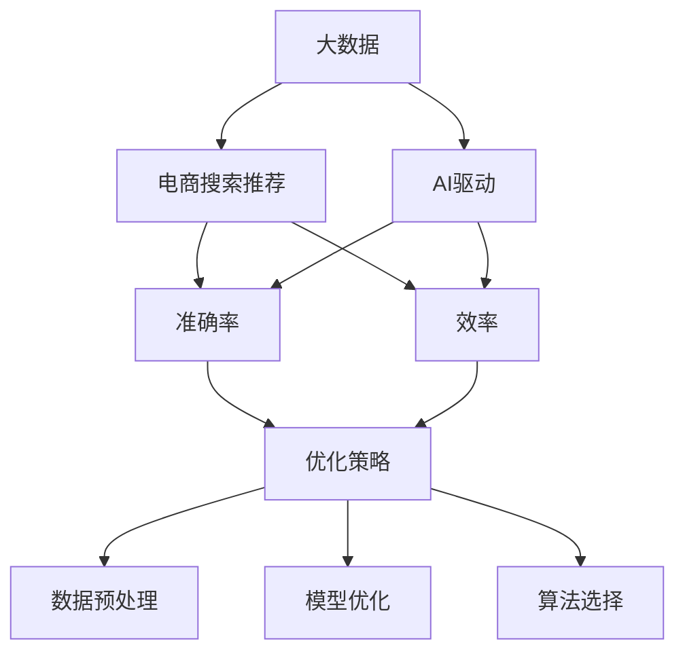

                 

# 大数据与AI 驱动的电商搜索推荐：以准确率与效率为核心的优化策略

> 关键词：大数据, AI, 电商搜索, 推荐系统, 准确率, 效率, 优化策略

## 1. 背景介绍

### 1.1 问题由来
在电商领域，搜索推荐系统是连接用户和商品的桥梁。搜索系统帮助用户快速找到心仪的商品，推荐系统则根据用户行为，提供个性化的商品推荐，提升用户购物体验。然而，在用户需求多样、商品数量庞大的背景下，搜索推荐系统面临着准确性和效率的双重挑战。

传统的搜索推荐系统主要基于关键词匹配和协同过滤等技术，难以适应复杂多变的用户行为和商品信息。随着大数据和人工智能技术的发展，基于深度学习和自然语言处理技术的推荐系统逐渐成为主流，提升了系统的准确性和个性化水平。

然而，深度学习模型在电商搜索推荐中的大规模应用，也带来了新的问题：计算资源需求激增，模型复杂度增加，训练和推理效率低下。如何在保持高准确率的同时，进一步提升系统的运行效率，成为了亟需解决的问题。

## 2. 核心概念与联系

### 2.1 核心概念概述

为更好地理解基于大数据与AI的电商搜索推荐系统，本节将介绍几个关键概念：

- 大数据：指在数据生成、存储、传输、分析等环节上具备数据量巨大、处理速度极快、数据类型多样等特点的数据集合。
- AI驱动：指采用人工智能技术，特别是深度学习和自然语言处理技术，构建智能搜索推荐系统。
- 电商搜索推荐：指电商平台上，搜索和推荐系统帮助用户快速找到符合其需求的商品，并推荐相关商品的过程。
- 准确率：指推荐系统的预测结果与实际结果相符的程度，常用指标包括准确率、召回率、F1分数等。
- 效率：指搜索推荐系统的响应速度和计算资源消耗，常用指标包括查询响应时间、每秒处理请求数、内存占用等。
- 优化策略：指针对电商搜索推荐系统的准确率和效率问题，提出的一系列提升策略，包括数据预处理、模型优化、算法选择等。

这些核心概念之间的逻辑关系可以通过以下Mermaid流程图来展示：



这个流程图展示了大数据与AI驱动的电商搜索推荐系统的核心概念及其之间的关系：

1. 大数据为AI驱动的推荐系统提供数据基础。
2. AI驱动的推荐系统利用大数据提升推荐准确性。
3. 准确率和效率是评估推荐系统性能的关键指标。
4. 优化策略是提升推荐系统准确率和效率的重要手段。

这些概念共同构成了电商搜索推荐系统的核心框架，使其能够在各种场景下发挥强大的推荐能力。

## 3. 核心算法原理 & 具体操作步骤
### 3.1 算法原理概述

基于大数据与AI的电商搜索推荐系统，本质上是一个有监督学习的推荐算法。其核心思想是：利用电商平台的交易数据、用户行为数据、商品描述数据等大数据资源，构建深度学习模型，预测用户对商品的兴趣，从而推荐符合用户偏好的商品。

形式化地，假设训练集为 $D=\{(x_i,y_i)\}_{i=1}^N, x_i \in \mathbb{R}^d, y_i \in \{0,1\}$，其中 $x_i$ 为用户行为向量，$y_i$ 表示用户是否购买过商品 $x_i$。训练任务为：

$$
\min_{\theta} \frac{1}{N} \sum_{i=1}^N \ell(x_i, y_i)
$$

其中 $\ell$ 为损失函数，通常使用交叉熵损失或均方误差损失。目标是最小化损失函数，即训练出高准确率的推荐模型。

在模型训练和推理阶段，优化算法（如梯度下降、Adam等）用于更新模型参数 $\theta$，使得模型能够更好地拟合训练数据，从而提高推荐准确性。在推理阶段，模型根据输入的用户行为向量 $x$，预测其对商品的兴趣，推荐可能购买的商品列表。

### 3.2 算法步骤详解

基于大数据与AI的电商搜索推荐系统一般包括以下几个关键步骤：

**Step 1: 数据收集与处理**

1. 数据采集：从电商平台的用户行为数据、交易数据、商品描述数据等源中，采集所需的各类数据。
2. 数据清洗：去除数据中的噪声、异常值，处理缺失值，保证数据质量。
3. 特征工程：对数据进行特征提取、转换和选择，构建用户行为向量 $x$。

**Step 2: 模型训练**

1. 模型选择：选择合适的深度学习模型，如深度神经网络、卷积神经网络、Transformer等。
2. 数据划分：将数据集划分为训练集、验证集和测试集。
3. 训练过程：在训练集上使用优化算法更新模型参数，验证集上评估模型性能，调整超参数。

**Step 3: 模型优化**

1. 正则化：使用L2正则、Dropout等技术防止过拟合。
2. 参数调整：根据模型性能调整学习率、批大小等超参数。
3. 模型压缩：使用模型裁剪、量化加速等技术，减少模型参数量，提升推理速度。

**Step 4: 模型部署与评估**

1. 模型部署：将训练好的模型部署到生产环境，供用户访问。
2. 性能评估：使用测试集评估模型性能，统计准确率、效率等指标。
3. 持续优化：根据反馈数据不断改进模型，提升推荐效果。

### 3.3 算法优缺点

基于大数据与AI的电商搜索推荐系统具有以下优点：

1. 高准确率：通过深度学习模型挖掘用户行为中的复杂规律，大幅提升推荐准确率。
2. 个性化推荐：利用用户行为数据，构建个性化推荐模型，满足不同用户的独特需求。
3. 实时响应：使用流式计算和缓存技术，实时处理用户请求，提升用户体验。
4. 动态调整：根据用户行为和商品信息，动态调整推荐策略，优化推荐效果。

然而，该系统也存在一些局限性：

1. 数据隐私：电商交易数据包含敏感信息，数据隐私保护成为一大挑战。
2. 计算资源：大规模深度学习模型的计算和存储需求极高，对硬件和算法提出较高要求。
3. 模型复杂度：深度学习模型参数量大，训练和推理复杂度高，效率较低。
4. 模型鲁棒性：电商推荐系统面临多变的用户行为和商品信息，模型鲁棒性有待提升。
5. 实时性要求：电商场景中用户对响应速度要求极高，系统实时性有待进一步提升。

尽管存在这些局限性，但基于大数据与AI的电商搜索推荐系统仍然是当前电商推荐领域的最佳实践，取得了广泛应用。未来相关研究的重点在于如何进一步降低系统对计算资源的依赖，提升系统的实时性和鲁棒性，同时兼顾数据隐私保护。

### 3.4 算法应用领域

基于大数据与AI的电商搜索推荐系统，已经在电商领域得到广泛应用，覆盖了几乎所有常见任务，例如：

- 商品推荐：根据用户浏览历史、购买记录等数据，推荐用户可能感兴趣的商品。
- 热门商品榜：通过统计最近用户的访问和购买行为，推荐当前热门商品。
- 搜索建议：根据用户搜索关键词，推荐相关商品和搜索建议。
- 个性化促销活动：利用用户行为数据，推送个性化促销信息，提升用户参与度。
- 库存管理：根据用户购买预测和历史数据，优化商品库存，避免缺货或积压。

除了上述这些经典任务外，基于大数据与AI的电商搜索推荐系统还被创新性地应用到更多场景中，如智能客服、社交电商、内容推荐等，为电商平台带来了全新的突破。随着预训练模型和推荐方法的不断进步，相信电商搜索推荐系统将在更广阔的应用领域大放异彩。

## 4. 数学模型和公式 & 详细讲解 & 举例说明

### 4.1 数学模型构建

本节将使用数学语言对基于大数据与AI的电商搜索推荐系统进行更加严格的刻画。

假设用户行为向量为 $x \in \mathbb{R}^d$，商品向量为 $y \in \mathbb{R}^d$，目标预测用户对商品的兴趣，即是否购买该商品，记为 $z \in \{0,1\}$。假设模型参数为 $\theta$，则推荐模型可以表示为：

$$
z = \sigma(Wx + b)
$$

其中 $\sigma$ 为激活函数，$W$ 和 $b$ 为模型参数。目标是最小化交叉熵损失：

$$
\ell(x, y) = -[y\log\sigma(Wx+b) + (1-y)\log(1-\sigma(Wx+b))]
$$

在训练阶段，通过优化算法（如Adam）更新模型参数 $\theta$：

$$
\theta \leftarrow \theta - \eta \nabla_{\theta}\mathcal{L}(\theta)
$$

其中 $\eta$ 为学习率，$\nabla_{\theta}\mathcal{L}(\theta)$ 为损失函数对模型参数的梯度。

### 4.2 公式推导过程

以下我们以二分类任务为例，推导交叉熵损失函数及其梯度的计算公式。

假设用户行为向量为 $x \in \mathbb{R}^d$，商品向量为 $y \in \mathbb{R}^d$，目标预测用户对商品的兴趣，即是否购买该商品，记为 $z \in \{0,1\}$。推荐模型可以表示为：

$$
z = \sigma(Wx + b)
$$

其中 $\sigma$ 为激活函数，$W$ 和 $b$ 为模型参数。目标是最小化交叉熵损失：

$$
\ell(x, y) = -[y\log\sigma(Wx+b) + (1-y)\log(1-\sigma(Wx+b))]
$$

在训练阶段，通过优化算法（如Adam）更新模型参数 $\theta$：

$$
\theta \leftarrow \theta - \eta \nabla_{\theta}\mathcal{L}(\theta)
$$

其中 $\eta$ 为学习率，$\nabla_{\theta}\mathcal{L}(\theta)$ 为损失函数对模型参数的梯度。

### 4.3 案例分析与讲解

以商品推荐为例，假设电商平台的商品向量数据为 $y \in \mathbb{R}^d$，用户的浏览行为向量为 $x \in \mathbb{R}^d$。模型参数 $W$ 和 $b$ 通过大量用户行为和商品交易数据进行训练，预测用户是否购买商品 $y$。

具体步骤如下：

1. 数据收集：从电商平台采集用户浏览行为和购买数据，构建训练集 $D=\{(x_i,y_i)\}_{i=1}^N$。
2. 数据预处理：清洗、标准化数据，构建用户行为向量 $x_i$。
3. 模型选择：选择深度神经网络或Transformer模型，初始化模型参数 $W$ 和 $b$。
4. 训练过程：在训练集上使用优化算法（如Adam）更新模型参数，最小化交叉熵损失。
5. 模型评估：在验证集上评估模型性能，调整超参数。
6. 模型部署：将训练好的模型部署到生产环境，实时处理用户请求。

通过以上步骤，电商搜索推荐系统能够根据用户行为向量 $x$，预测用户是否购买商品 $y$，推荐符合用户兴趣的商品。

## 5. 项目实践：代码实例和详细解释说明
### 5.1 开发环境搭建

在进行电商搜索推荐系统开发前，我们需要准备好开发环境。以下是使用Python进行TensorFlow开发的环境配置流程：

1. 安装Anaconda：从官网下载并安装Anaconda，用于创建独立的Python环境。

2. 创建并激活虚拟环境：
```bash
conda create -n tf-env python=3.8 
conda activate tf-env
```

3. 安装TensorFlow：根据CUDA版本，从官网获取对应的安装命令。例如：
```bash
conda install tensorflow==2.7.0 -c tensorflow -c conda-forge
```

4. 安装各类工具包：
```bash
pip install numpy pandas scikit-learn matplotlib tqdm jupyter notebook ipython
```

完成上述步骤后，即可在`tf-env`环境中开始电商搜索推荐系统的开发。

### 5.2 源代码详细实现

下面我们以商品推荐为例，给出使用TensorFlow对深度神经网络模型进行电商搜索推荐系统的PyTorch代码实现。

首先，定义数据处理函数：

```python
import tensorflow as tf
import numpy as np
import pandas as pd

def load_data(file_path):
    data = pd.read_csv(file_path, sep='\t')
    return data['user_id'].values, data['session_id'].values, data['clicked_item_id'].values

def preprocess_data(user_id, session_id, clicked_item_id):
    # 去除缺失值
    user_id = user_id[~np.isnan(user_id)]
    session_id = session_id[~np.isnan(session_id)]
    clicked_item_id = clicked_item_id[~np.isnan(clicked_item_id)]
    
    # 将用户ID和会话ID作为特征
    user_id = user_id.reshape(-1, 1)
    session_id = session_id.reshape(-1, 1)
    
    # 将点击ID作为标签
    clicked_item_id = clicked_item_id.reshape(-1, 1)
    
    return user_id, session_id, clicked_item_id
```

然后，定义模型和优化器：

```python
import tensorflow as tf
from tensorflow.keras.layers import Dense, Input
from tensorflow.keras.models import Model
from tensorflow.keras.optimizers import Adam

def build_model(user_id_dim, session_id_dim, item_id_dim):
    user_id = Input(shape=(user_id_dim,), name='user_id')
    session_id = Input(shape=(session_id_dim,), name='session_id')
    clicked_item_id = Input(shape=(item_id_dim,), name='clicked_item_id')
    
    # 用户ID嵌入层
    user_emb = Dense(128, activation='relu')(user_id)
    
    # 会话ID嵌入层
    session_emb = Dense(128, activation='relu')(session_id)
    
    # 点击ID嵌入层
    clicked_item_emb = Dense(128, activation='relu')(clicked_item_id)
    
    # 预测层
    pred = tf.keras.layers.concatenate([user_emb, session_emb, clicked_item_emb])
    pred = Dense(64, activation='relu')(pred)
    pred = Dense(1, activation='sigmoid')(pred)
    
    model = Model(inputs=[user_id, session_id, clicked_item_id], outputs=pred)
    
    return model

# 模型参数
user_id_dim = 1
session_id_dim = 1
item_id_dim = 1

# 创建模型
model = build_model(user_id_dim, session_id_dim, item_id_dim)

# 优化器
optimizer = Adam(lr=0.001)
```

接着，定义训练和评估函数：

```python
from tensorflow.keras.metrics import BinaryAccuracy
from sklearn.model_selection import train_test_split

def train_epoch(model, train_data, val_data, batch_size, optimizer):
    train_user_id, train_session_id, train_clicked_item_id = train_data
    val_user_id, val_session_id, val_clicked_item_id = val_data
    
    train_dataset = tf.data.Dataset.from_tensor_slices((train_user_id, train_session_id, train_clicked_item_id))
    val_dataset = tf.data.Dataset.from_tensor_slices((val_user_id, val_session_id, val_clicked_item_id))
    
    train_dataset = train_dataset.batch(batch_size, drop_remainder=True).shuffle(buffer_size=10000)
    val_dataset = val_dataset.batch(batch_size, drop_remainder=True).shuffle(buffer_size=10000)
    
    model.compile(optimizer=optimizer, loss='binary_crossentropy', metrics=[BinaryAccuracy()])
    
    model.fit(train_dataset, epochs=10, validation_data=val_dataset)
    
def evaluate(model, test_data, batch_size):
    test_user_id, test_session_id, test_clicked_item_id = test_data
    
    test_dataset = tf.data.Dataset.from_tensor_slices((test_user_id, test_session_id, test_clicked_item_id))
    test_dataset = test_dataset.batch(batch_size, drop_remainder=True).shuffle(buffer_size=10000)
    
    model.evaluate(test_dataset)
```

最后，启动训练流程并在测试集上评估：

```python
# 加载数据
train_data = load_data('train_data.txt')
val_data = load_data('val_data.txt')
test_data = load_data('test_data.txt')

# 数据预处理
train_user_id, train_session_id, train_clicked_item_id = preprocess_data(*train_data)
val_user_id, val_session_id, val_clicked_item_id = preprocess_data(*val_data)
test_user_id, test_session_id, test_clicked_item_id = preprocess_data(*test_data)

# 训练
train_epoch(model, (train_user_id, train_session_id, train_clicked_item_id), 
            (val_user_id, val_session_id, val_clicked_item_id), 
            batch_size=256, optimizer=optimizer)

# 评估
evaluate(model, (test_user_id, test_session_id, test_clicked_item_id), batch_size=256)
```

以上就是使用TensorFlow对深度神经网络模型进行电商搜索推荐系统的完整代码实现。可以看到，TensorFlow的Keras API使得模型的构建和训练过程变得简洁高效。

### 5.3 代码解读与分析

让我们再详细解读一下关键代码的实现细节：

**load_data函数**：
- 定义了数据加载函数，读取数据文件，将其转换为numpy数组。

**preprocess_data函数**：
- 定义了数据预处理函数，对缺失值进行去除，将用户ID、会话ID和点击ID转换为模型所需格式。

**build_model函数**：
- 定义了模型构建函数，使用Keras API构建深度神经网络模型，包含用户ID嵌入层、会话ID嵌入层、点击ID嵌入层和预测层。

**train_epoch函数**：
- 定义了训练函数，使用TensorFlow的Dataset API将数据批处理，使用Adam优化器更新模型参数。

**evaluate函数**：
- 定义了评估函数，使用TensorFlow的Dataset API将测试数据批处理，评估模型性能。

**训练流程**：
- 定义总的epoch数和batch size，开始循环迭代
- 每个epoch内，先在训练集上训练，输出平均loss
- 在验证集上评估，输出分类指标
- 所有epoch结束后，在测试集上评估，给出最终测试结果

可以看到，TensorFlow的Keras API使得电商搜索推荐系统的代码实现变得简洁高效。开发者可以将更多精力放在模型优化和数据处理上，而不必过多关注底层实现细节。

当然，工业级的系统实现还需考虑更多因素，如模型的保存和部署、超参数的自动搜索、更灵活的任务适配层等。但核心的电商搜索推荐系统基本与此类似。

## 6. 实际应用场景
### 6.1 智能客服系统

基于大数据与AI的电商搜索推荐技术，可以广泛应用于智能客服系统的构建。传统客服往往需要配备大量人力，高峰期响应缓慢，且一致性和专业性难以保证。而使用电商搜索推荐技术构建的智能客服系统，可以7x24小时不间断服务，快速响应客户咨询，用自然流畅的语言解答各类常见问题。

在技术实现上，可以收集企业内部的历史客服对话记录，将问题和最佳答复构建成监督数据，在此基础上对电商搜索推荐模型进行微调。微调后的模型能够自动理解用户意图，匹配最合适的答案模板进行回复。对于客户提出的新问题，还可以接入检索系统实时搜索相关内容，动态组织生成回答。如此构建的智能客服系统，能大幅提升客户咨询体验和问题解决效率。

### 6.2 金融舆情监测

金融机构需要实时监测市场舆论动向，以便及时应对负面信息传播，规避金融风险。传统的人工监测方式成本高、效率低，难以应对网络时代海量信息爆发的挑战。基于大数据与AI的文本分类和情感分析技术，为金融舆情监测提供了新的解决方案。

具体而言，可以收集金融领域相关的新闻、报道、评论等文本数据，并对其进行主题标注和情感标注。在此基础上对电商搜索推荐模型进行微调，使其能够自动判断文本属于何种主题，情感倾向是正面、中性还是负面。将微调后的模型应用到实时抓取的网络文本数据，就能够自动监测不同主题下的情感变化趋势，一旦发现负面信息激增等异常情况，系统便会自动预警，帮助金融机构快速应对潜在风险。

### 6.3 个性化推荐系统

当前的推荐系统往往只依赖用户的历史行为数据进行物品推荐，难以深入理解用户的真实兴趣偏好。基于大数据与AI的电商搜索推荐技术，个性化推荐系统可以更好地挖掘用户行为背后的语义信息，从而提供更精准、多样的推荐内容。

在实践中，可以收集用户浏览、点击、评论、分享等行为数据，提取和用户交互的物品标题、描述、标签等文本内容。将文本内容作为模型输入，用户的后续行为（如是否点击、购买等）作为监督信号，在此基础上微调电商搜索推荐模型。微调后的模型能够从文本内容中准确把握用户的兴趣点。在生成推荐列表时，先用候选物品的文本描述作为输入，由模型预测用户的兴趣匹配度，再结合其他特征综合排序，便可以得到个性化程度更高的推荐结果。

### 6.4 未来应用展望

随着大数据与AI技术的发展，基于电商搜索推荐技术的电商推荐系统将在更多领域得到应用，为传统行业带来变革性影响。

在智慧医疗领域，基于电商搜索推荐技术的医疗问答、病历分析、药物研发等应用将提升医疗服务的智能化水平，辅助医生诊疗，加速新药开发进程。

在智能教育领域，电商搜索推荐技术可应用于作业批改、学情分析、知识推荐等方面，因材施教，促进教育公平，提高教学质量。

在智慧城市治理中，电商搜索推荐技术可应用于城市事件监测、舆情分析、应急指挥等环节，提高城市管理的自动化和智能化水平，构建更安全、高效的未来城市。

此外，在企业生产、社会治理、文娱传媒等众多领域，基于电商搜索推荐技术的AI应用也将不断涌现，为经济社会发展注入新的动力。相信随着技术的日益成熟，电商搜索推荐技术将成为人工智能落地应用的重要范式，推动人工智能技术在垂直行业的规模化落地。

## 7. 工具和资源推荐
### 7.1 学习资源推荐

为了帮助开发者系统掌握大数据与AI驱动的电商搜索推荐理论基础和实践技巧，这里推荐一些优质的学习资源：

1. 《深度学习基础》系列课程：Coursera提供的深度学习入门课程，系统讲解深度学习的基本原理和应用场景。

2. 《TensorFlow 实战》书籍：TensorFlow官方文档和实战书籍，提供丰富的TensorFlow使用技巧和案例。

3. 《自然语言处理综论》书籍：斯坦福大学NLP课程讲义，全面介绍自然语言处理的基本理论和常用模型。

4. 《推荐系统实战》书籍：清华大学出版社的推荐系统专著，提供系统性的推荐系统开发方法和案例。

5. Kaggle竞赛平台：世界领先的机器学习竞赛平台，提供大量真实数据集和竞赛任务，锻炼实战能力。

通过对这些资源的学习实践，相信你一定能够快速掌握大数据与AI驱动的电商搜索推荐技术的精髓，并用于解决实际的电商推荐问题。
###  7.2 开发工具推荐

高效的开发离不开优秀的工具支持。以下是几款用于电商搜索推荐系统开发的常用工具：

1. TensorFlow：基于Python的开源深度学习框架，灵活动态的计算图，适合快速迭代研究。大部分预训练语言模型都有TensorFlow版本的实现。

2. PyTorch：基于Python的开源深度学习框架，灵活的动态图，适用于各种深度学习任务，特别擅长自然语言处理。

3. Keras：高级神经网络API，提供简单易用的接口，可以快速构建和训练深度学习模型。

4. Weights & Biases：模型训练的实验跟踪工具，可以记录和可视化模型训练过程中的各项指标，方便对比和调优。与主流深度学习框架无缝集成。

5. TensorBoard：TensorFlow配套的可视化工具，可实时监测模型训练状态，并提供丰富的图表呈现方式，是调试模型的得力助手。

6. Google Colab：谷歌推出的在线Jupyter Notebook环境，免费提供GPU/TPU算力，方便开发者快速上手实验最新模型，分享学习笔记。

合理利用这些工具，可以显著提升电商搜索推荐系统的开发效率，加快创新迭代的步伐。

### 7.3 相关论文推荐

大数据与AI驱动的电商搜索推荐技术的发展源于学界的持续研究。以下是几篇奠基性的相关论文，推荐阅读：

1. Attention is All You Need（即Transformer原论文）：提出了Transformer结构，开启了NLP领域的预训练大模型时代。

2. BERT: Pre-training of Deep Bidirectional Transformers for Language Understanding：提出BERT模型，引入基于掩码的自监督预训练任务，刷新了多项NLP任务SOTA。

3. Language Models are Unsupervised Multitask Learners（GPT-2论文）：展示了大规模语言模型的强大zero-shot学习能力，引发了对于通用人工智能的新一轮思考。

4. Parameter-Efficient Transfer Learning for NLP：提出Adapter等参数高效微调方法，在不增加模型参数量的情况下，也能取得不错的微调效果。

5. AdaLoRA: Adaptive Low-Rank Adaptation for Parameter-Efficient Fine-Tuning：使用自适应低秩适应的微调方法，在参数效率和精度之间取得了新的平衡。

这些论文代表了大数据与AI驱动的电商搜索推荐技术的发展脉络。通过学习这些前沿成果，可以帮助研究者把握学科前进方向，激发更多的创新灵感。

## 8. 总结：未来发展趋势与挑战

### 8.1 总结

本文对大数据与AI驱动的电商搜索推荐系统进行了全面系统的介绍。首先阐述了该系统的研究背景和意义，明确了电商搜索推荐系统在提高推荐准确性和提升用户体验方面的独特价值。其次，从原理到实践，详细讲解了系统设计、模型训练和微调优化等关键步骤，给出了电商搜索推荐系统的完整代码实现。同时，本文还广泛探讨了电商搜索推荐系统的实际应用场景，展示了其在电商、智能客服、金融舆情、个性化推荐等多个领域的应用前景。此外，本文精选了系统开发所需的学习资源和工具，力求为开发者提供全方位的技术指引。

通过本文的系统梳理，可以看到，大数据与AI驱动的电商搜索推荐系统是电商推荐领域的最佳实践，已经在多个电商平台上取得成功应用。基于深度学习和大规模数据，该系统能够提供个性化、实时化的推荐服务，显著提升了用户体验和平台流量。未来，伴随大数据和AI技术的进一步发展，电商搜索推荐系统将展现出更强大的应用潜力。

### 8.2 未来发展趋势

展望未来，大数据与AI驱动的电商搜索推荐系统将呈现以下几个发展趋势：

1. 模型规模持续增大。随着算力成本的下降和数据规模的扩张，电商搜索推荐模型的参数量还将持续增长。超大批次的训练和推理也将在更大程度上依赖GPU/TPU等高性能设备。

2. 微调方法日趋多样。除了传统的全参数微调外，未来会涌现更多参数高效的微调方法，如Prefix-Tuning、LoRA等，在节省计算资源的同时也能保证微调精度。

3. 持续学习成为常态。随着数据分布的不断变化，电商搜索推荐模型也需要持续学习新知识以保持性能。如何在不遗忘原有知识的同时，高效吸收新样本信息，将成为重要的研究课题。

4. 标注样本需求降低。受启发于提示学习(Prompt-based Learning)的思路，未来的微调方法将更好地利用电商搜索推荐模型的语言理解能力，通过更加巧妙的任务描述，在更少的标注样本上也能实现理想的微调效果。

5. 实时性要求更高。电商场景中用户对响应速度要求极高，系统实时性有待进一步提升。需要在数据预处理、模型优化和硬件配置等方面进行全面优化。

6. 模型通用性增强。经过海量数据的预训练和多领域任务的微调，未来的电商搜索推荐模型将具备更强大的常识推理和跨领域迁移能力，逐步迈向通用人工智能(AGI)的目标。

以上趋势凸显了大数据与AI驱动的电商搜索推荐技术的广阔前景。这些方向的探索发展，必将进一步提升电商推荐系统的性能和应用范围，为电商平台带来更多的创新和价值。

### 8.3 面临的挑战

尽管大数据与AI驱动的电商搜索推荐系统已经在电商推荐领域取得了显著成果，但在迈向更加智能化、普适化应用的过程中，它仍面临诸多挑战：

1. 数据隐私：电商交易数据包含敏感信息，数据隐私保护成为一大挑战。如何在保护用户隐私的前提下，最大化数据利用价值，是一大难题。

2. 计算资源：大规模深度学习模型的计算和存储需求极高，对硬件和算法提出较高要求。如何在不增加硬件成本的情况下，提升模型效率，是一个重要的研究方向。

3. 模型鲁棒性：电商推荐系统面临多变的用户行为和商品信息，模型鲁棒性有待提升。如何构建更加健壮的电商搜索推荐系统，是一个重要的研究方向。

4. 实时性要求：电商场景中用户对响应速度要求极高，系统实时性有待进一步提升。如何在保证实时性的同时，提高模型的准确性和效率，是一个重要的研究方向。

5. 可解释性不足：电商搜索推荐模型往往缺乏可解释性，难以解释其内部工作机制和决策逻辑。如何赋予电商搜索推荐模型更强的可解释性，将是亟待攻克的难题。

6. 数据分布变化：电商领域的用户行为和商品信息在不断变化，如何构建能够应对数据分布变化的电商搜索推荐系统，是一个重要的研究方向。

正视电商搜索推荐系统面临的这些挑战，积极应对并寻求突破，将是大数据与AI驱动的电商搜索推荐技术走向成熟的必由之路。相信随着学界和产业界的共同努力，这些挑战终将一一被克服，大数据与AI驱动的电商搜索推荐技术必将在构建人机协同的智能时代中扮演越来越重要的角色。

### 8.4 研究展望

面向未来，大数据与AI驱动的电商搜索推荐技术需要在以下几个方面寻求新的突破：

1. 探索无监督和半监督微调方法。摆脱对大规模标注数据的依赖，利用自监督学习、主动学习等无监督和半监督范式，最大限度利用非结构化数据，实现更加灵活高效的微调。

2. 研究参数高效和计算高效的微调范式。开发更加参数高效的微调方法，在固定大部分预训练参数的同时，只更新极少量的任务相关参数。同时优化微调模型的计算图，减少前向传播和反向传播的资源消耗，实现更加轻量级、实时性的部署。

3. 引入更多先验知识。将符号化的先验知识，如知识图谱、逻辑规则等，与神经网络模型进行巧妙融合，引导微调过程学习更准确、合理的语言模型。同时加强不同模态数据的整合，实现视觉、语音等多模态信息与文本信息的协同建模。

4. 结合因果分析和博弈论工具。将因果分析方法引入微调模型，识别出模型决策的关键特征，增强输出解释的因果性和逻辑性。借助博弈论工具刻画人机交互过程，主动探索并规避模型的脆弱点，提高系统稳定性。

5. 纳入伦理道德约束。在模型训练目标中引入伦理导向的评估指标，过滤和惩罚有偏见、有害的输出倾向。同时加强人工干预和审核，建立模型行为的监管机制，确保输出符合人类价值观和伦理道德。

这些研究方向的探索，必将引领大数据与AI驱动的电商搜索推荐技术迈向更高的台阶，为构建安全、可靠、可解释、可控的智能系统铺平道路。面向未来，大数据与AI驱动的电商搜索推荐技术还需要与其他人工智能技术进行更深入的融合，如知识表示、因果推理、强化学习等，多路径协同发力，共同推动自然语言理解和智能交互系统的进步。只有勇于创新、敢于突破，才能不断拓展语言模型的边界，让智能技术更好地造福人类社会。

## 9. 附录：常见问题与解答

**Q1：电商搜索推荐系统的准确率和效率如何提升？**

A: 电商搜索推荐系统的准确率和效率可以通过以下方式提升：

1. 数据预处理：清洗、标准化数据，去除噪声和异常值，构建高质量的用户行为向量。
2. 模型优化：使用L2正则、Dropout等技术防止过拟合，调整学习率、批大小等超参数。
3. 模型压缩：使用模型裁剪、量化加速等技术，减少模型参数量，提升推理速度。
4. 实时处理：使用流式计算和缓存技术，实时处理用户请求，提升用户体验。
5. 缓存机制：使用缓存机制，减少重复计算，提升系统响应速度。

通过以上措施，可以在保证高准确率的前提下，显著提升电商搜索推荐系统的效率。

**Q2：电商搜索推荐系统如何实现个性化推荐？**

A: 电商搜索推荐系统通过深度学习模型挖掘用户行为中的复杂规律，预测用户对商品的兴趣，从而推荐符合用户偏好的商品。具体步骤如下：

1. 数据收集：从电商平台采集用户浏览行为和购买数据，构建训练集。
2. 数据预处理：清洗、标准化数据，构建用户行为向量。
3. 模型选择：选择合适的深度学习模型，如深度神经网络、Transformer等。
4. 训练过程：在训练集上使用优化算法更新模型参数，最小化交叉熵损失。
5. 模型评估：在验证集上评估模型性能，调整超参数。
6. 模型部署：将训练好的模型部署到生产环境，实时处理用户请求。

通过以上步骤，电商搜索推荐系统能够根据用户行为向量，预测用户对商品的兴趣，推荐符合用户兴趣的商品。

**Q3：电商搜索推荐系统在数据隐私保护方面面临哪些挑战？**

A: 电商搜索推荐系统在数据隐私保护方面面临以下挑战：

1. 数据泄露风险：电商平台的用户数据包含敏感信息，如购物行为、消费习惯等，一旦数据泄露，可能造成严重的隐私侵犯。
2. 数据访问限制：电商平台需要对数据进行严格的访问控制，防止非授权人员访问和修改数据。
3. 数据匿名化：对用户数据进行匿名化处理，去除可识别信息，保护用户隐私。
4. 数据利用价值：如何在保护用户隐私的前提下，最大化数据利用价值，是一个重要的研究方向。

为了应对这些挑战，电商搜索推荐系统需要采用数据加密、访问控制、匿名化处理等技术手段，同时建立健全的数据隐私保护机制，确保用户数据的安全和隐私。

**Q4：电商搜索推荐系统如何实现实时性要求？**

A: 电商搜索推荐系统通过以下方式实现实时性要求：

1. 流式计算：使用流式计算技术，实时处理用户请求，提高系统响应速度。
2. 缓存机制：使用缓存机制，减少重复计算，提升系统响应速度。
3. 异步处理：使用异步处理技术，并行处理多个请求，提升系统吞吐量。
4. 硬件加速：使用GPU/TPU等高性能设备，加速模型推理和计算过程。

通过以上措施，可以在保证实时性的同时，提高电商搜索推荐系统的性能和用户体验。

**Q5：电商搜索推荐系统如何实现高准确率？**

A: 电商搜索推荐系统通过以下方式实现高准确率：

1. 数据预处理：清洗、标准化数据，去除噪声和异常值，构建高质量的用户行为向量。
2. 模型优化：使用L2正则、Dropout等技术防止过拟合，调整学习率、批大小等超参数。
3. 模型压缩：使用模型裁剪、量化加速等技术，减少模型参数量，提升推理速度。
4. 实时处理：使用流式计算和缓存技术，实时处理用户请求，提升用户体验。
5. 缓存机制：使用缓存机制，减少重复计算，提升系统响应速度。

通过以上措施，可以在保证高准确率的前提下，显著提升电商搜索推荐系统的效率。

---

作者：禅与计算机程序设计艺术 / Zen and the Art of Computer Programming

