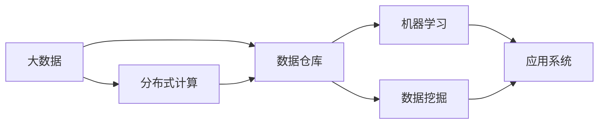

                 

# 大数据时代：人类计算如何应对海量数据

> 关键词：大数据、分布式计算、数据仓库、机器学习、数据挖掘、云计算

## 1. 背景介绍

随着互联网的飞速发展，全球产生了海量的数据。从社交媒体、金融交易、科学研究到政府监管，几乎每个领域都离不开数据的驱动。数据的力量正逐渐渗透到社会的方方面面，带来了前所未有的机遇和挑战。面对大规模数据的洪流，人类计算正面临前所未有的考验。本文将深入探讨大数据时代下人类计算的应对策略，通过系统性地分析核心概念和关键技术，为数据时代提供实用的解决方案。

## 2. 核心概念与联系

### 2.1 核心概念概述

在探讨如何应对海量数据前，我们先来了解一下几个核心概念：

- **大数据(Big Data)**：指的是体量大、速度快、类型多且价值高的数据。通常具有四个基本特征：Volume（容量）、Velocity（速度）、Variety（多样性）和Veracity（真实性）。
- **分布式计算**：将数据和计算任务分布到多台计算机上进行处理，以提高计算效率。主要依赖于MapReduce、Spark等技术。
- **数据仓库(Data Warehouse)**：是企业存储和管理大量数据的一个数据集合，通过ETL（Extract, Transform, Load）过程提取、转换、加载数据，供数据分析和决策使用。
- **机器学习(Machine Learning)**：是让机器通过数据学习，自主提升预测和决策能力的技术。常见的算法包括回归、分类、聚类等。
- **数据挖掘(Data Mining)**：通过算法发现数据中的规律和模式，常用的算法包括关联规则、分类、聚类等。
- **云计算(Cloud Computing)**：是一种按需提供资源的服务模式，通过互联网提供计算资源和存储服务。

这些概念之间存在紧密的联系，共同构成了大数据时代的技术基础。下面通过一个简单的Mermaid流程图，展示它们之间的关系：



## 3. 核心算法原理 & 具体操作步骤

### 3.1 算法原理概述

在大数据时代，人类计算面临的主要挑战是如何在有限的时间内，高效地处理和分析海量数据。算法原理主要包括分布式计算、机器学习和数据挖掘三个方面：

1. **分布式计算**：将数据和计算任务分布到多台计算机上进行并行处理，可以显著提高计算效率。
2. **机器学习**：利用机器学习算法对数据进行建模和预测，帮助决策者理解和利用数据。
3. **数据挖掘**：通过算法挖掘数据中的模式和规律，为数据驱动的决策提供依据。

### 3.2 算法步骤详解

下面以一个简单的分布式计算为例，详细介绍算法步骤：

**Step 1: 数据预处理**

数据预处理是分布式计算的基础，包括数据清洗、归一化和分块等步骤。具体步骤如下：

1. 数据清洗：去除数据中的噪声和异常值，确保数据质量。
2. 数据归一化：将数据按比例缩小到一定范围内，方便计算。
3. 数据分块：将数据分成若干块，每个块分配到不同的计算节点处理。

**Step 2: 分布式计算**

分布式计算分为两个主要步骤：

1. 数据并行处理：使用MapReduce等框架将数据分成多个部分，在多个计算节点上并行处理。
2. 结果合并：将所有节点的计算结果合并，得到最终结果。

**Step 3: 结果分析**

1. 统计分析：通过统计方法分析数据特征。
2. 模式挖掘：使用关联规则、分类算法等挖掘数据模式。
3. 模型训练：利用机器学习算法建立模型，进行预测和决策。

### 3.3 算法优缺点

**优点**：

1. 分布式计算能够显著提高计算效率，适用于大规模数据处理。
2. 机器学习算法能够利用数据中的规律进行预测，帮助决策者理解和利用数据。
3. 数据挖掘算法能够发现数据中的模式和规律，为数据驱动的决策提供依据。

**缺点**：

1. 分布式计算需要配置和管理大量的计算资源，成本较高。
2. 机器学习算法需要大量的标注数据，数据获取和标注成本高。
3. 数据挖掘算法需要复杂的算法和大量计算资源，适用于大规模数据集。

### 3.4 算法应用领域

分布式计算、机器学习和数据挖掘技术在各个领域都有广泛应用：

1. **商业智能(BI)**：通过数据仓库和数据挖掘技术，分析历史数据，指导商业决策。
2. **金融分析**：利用机器学习算法，预测股票市场走势，进行风险控制。
3. **医疗健康**：通过数据挖掘技术，发现疾病模式，制定治疗方案。
4. **社交媒体分析**：通过分布式计算和机器学习技术，分析用户行为，提升用户体验。
5. **公共安全**：利用数据挖掘技术，发现犯罪模式，提高防范能力。

## 4. 数学模型和公式 & 详细讲解

### 4.1 数学模型构建

在大数据时代，数据模型构建是数据分析和决策的重要步骤。常见的数学模型包括回归模型、分类模型、聚类模型等。

**线性回归模型**：
\[ y = \beta_0 + \beta_1 x_1 + \ldots + \beta_p x_p + \epsilon \]

其中，\(\beta_0, \beta_1, \ldots, \beta_p\)是模型参数，\(x_1, \ldots, x_p\)是输入变量，\(y\)是输出变量，\(\epsilon\)是误差项。

**逻辑回归模型**：
\[ P(y=1|x) = \frac{1}{1 + e^{-\beta_0 - \beta_1 x_1 - \ldots - \beta_p x_p}} \]

其中，\(\beta_0, \beta_1, \ldots, \beta_p\)是模型参数，\(x_1, \ldots, x_p\)是输入变量，\(y\)是输出变量。

**K-means聚类算法**：
\[ C_k = \arg\min_{C_k} \sum_{i=1}^n \sum_{j=1}^k (x_i - \mu_j)^2 \]

其中，\(C_k\)是聚类结果，\(x_i\)是样本点，\(\mu_j\)是聚类中心。

### 4.2 公式推导过程

**线性回归模型推导**：
1. 假设数据集为\((x_1, y_1), (x_2, y_2), \ldots, (x_n, y_n)\)。
2. 根据最小二乘法，得到模型参数估计值：
\[ \hat{\beta} = (X^T X)^{-1} X^T y \]
其中，\(X\)是特征矩阵，\(y\)是目标变量向量。

**逻辑回归模型推导**：
1. 假设数据集为\((x_1, y_1), (x_2, y_2), \ldots, (x_n, y_n)\)。
2. 利用最大似然估计，得到模型参数估计值：
\[ \hat{\beta} = \arg\max_{\beta} \prod_{i=1}^n P(y_i|x_i)^{y_i}(1-P(y_i|x_i))^{1-y_i} \]

**K-means聚类算法推导**：
1. 假设数据集为\((x_1, y_1), (x_2, y_2), \ldots, (x_n, y_n)\)。
2. 通过迭代计算，得到聚类结果：
\[ \mu_j = \frac{1}{n_j} \sum_{i=1}^{n_j} x_i \]
其中，\(n_j\)是第\(j\)个聚类的样本数。

### 4.3 案例分析与讲解

**案例1：电商客户流失预测**

电商企业希望通过客户行为数据预测流失客户，以进行挽回。步骤如下：

1. 数据预处理：清洗数据，去除异常值和噪声。
2. 特征工程：提取用户行为特征，如购买次数、交易金额等。
3. 模型训练：利用逻辑回归模型训练模型，得到预测结果。
4. 结果分析：统计分析模型预测结果，制定流失客户挽回策略。

**案例2：社交媒体情感分析**

社交媒体公司希望分析用户情感，以便调整内容策略。步骤如下：

1. 数据预处理：清洗数据，去除噪声和异常值。
2. 特征工程：提取文本特征，如词频、情感极性等。
3. 模型训练：利用情感分类模型训练模型，得到情感分类结果。
4. 结果分析：统计分析情感分类结果，调整内容策略。

## 5. 项目实践：代码实例和详细解释说明

### 5.1 开发环境搭建

在大数据项目中，通常需要使用分布式计算框架和机器学习框架。常用的框架包括Hadoop、Spark、TensorFlow等。

以下是一个简单的Hadoop MapReduce项目实践：

1. 安装Hadoop：从官网下载并安装Hadoop。
2. 编写MapReduce程序：编写Mapper和Reducer程序，对数据进行处理。
3. 提交任务：使用Hadoop提交任务，进行分布式计算。

### 5.2 源代码详细实现

以下是Hadoop MapReduce代码实现：

```java
import org.apache.hadoop.conf.Configuration;
import org.apache.hadoop.fs.Path;
import org.apache.hadoop.io.IntWritable;
import org.apache.hadoop.io.Text;
import org.apache.hadoop.mapreduce.Job;
import org.apache.hadoop.mapreduce.Mapper;
import org.apache.hadoop.mapreduce.Reducer;
import org.apache.hadoop.mapreduce.lib.input.FileInputFormat;
import org.apache.hadoop.mapreduce.lib.output.FileOutputFormat;

public class WordCount {
    public static class TokenizerMapper extends Mapper<Object, Text, Text, IntWritable> {
        private final static IntWritable one = new IntWritable(1);
        private Text word = new Text();

        public void map(Object key, Text value, Context context) throws IOException, InterruptedException {
            StringTokenizer itr = new StringTokenizer(value.toString());
            while (itr.hasMoreTokens()) {
                word.set(itr.nextToken());
                context.write(word, one);
            }
        }
    }

    public static class IntSumReducer extends Reducer<Text, IntWritable, Text, IntWritable> {
        private IntWritable result = new IntWritable();

        public void reduce(Text key, Iterable<IntWritable> values, Context context) throws IOException, InterruptedException {
            int sum = 0;
            for (IntWritable val : values) {
                sum += val.get();
            }
            result.set(sum);
            context.write(key, result);
        }
    }

    public static void main(String[] args) throws Exception {
        Configuration conf = new Configuration();
        Job job = Job.getInstance(conf, "word count");
        job.setJarByClass(WordCount.class);
        job.setMapperClass(TokenizerMapper.class);
        job.setCombinerClass(IntSumReducer.class);
        job.setReducerClass(IntSumReducer.class);
        job.setOutputKeyClass(Text.class);
        job.setOutputValueClass(IntWritable.class);
        FileInputFormat.addInputPath(job, new Path(args[0]));
        FileOutputFormat.setOutputPath(job, new Path(args[1]));
        System.exit(job.waitForCompletion(true) ? 0 : 1);
    }
}
```

### 5.3 代码解读与分析

**代码解读**：

1. Mapper程序：输入数据为文本，输出为单词和1的组合。
2. Reducer程序：将相同的单词计数，输出单词和计数的结果。
3. main函数：配置Job，指定输入输出路径，提交任务。

**分析**：

1. Mapper和Reducer程序是Hadoop MapReduce的核心组件，用于分布式处理。
2. Mapper程序将输入数据切分为多个小块，并进行并行处理。
3. Reducer程序将Mapper输出的结果进行合并，得到最终结果。

### 5.4 运行结果展示

运行上述代码，Hadoop集群会输出每个单词的计数结果。例如，对于以下数据：

```
hello world
hello python
python is awesome
```

输出结果为：

```
hello 2
world 1
python 2
is 1
awesome 1
```

## 6. 实际应用场景

### 6.1 商业智能(BI)

商业智能是大数据时代的重要应用领域。通过数据仓库和数据挖掘技术，企业可以分析历史数据，指导商业决策。常见的应用场景包括：

1. 销售数据分析：通过数据仓库和数据挖掘技术，分析销售数据，指导营销策略。
2. 客户行为分析：通过数据挖掘技术，分析客户行为，制定客户维系策略。
3. 财务报表分析：通过数据挖掘技术，分析财务报表，发现风险点。

### 6.2 金融分析

金融行业需要实时处理和分析海量数据，以进行风险控制和投资决策。常见的应用场景包括：

1. 股票市场分析：通过数据挖掘技术，分析股票市场数据，预测股票走势。
2. 信贷风险评估：通过数据挖掘技术，评估信贷风险，制定信贷策略。
3. 交易系统优化：通过数据挖掘技术，优化交易系统，提高交易效率。

### 6.3 医疗健康

医疗行业需要处理和分析大量的患者数据，以进行疾病预测和治疗方案制定。常见的应用场景包括：

1. 疾病预测：通过数据挖掘技术，分析患者数据，预测疾病风险。
2. 治疗方案优化：通过数据挖掘技术，分析治疗方案，制定个性化治疗方案。
3. 医疗资源调配：通过数据挖掘技术，优化医疗资源配置，提高医疗服务效率。

### 6.4 社交媒体分析

社交媒体平台需要处理和分析大量的用户数据，以进行内容推荐和用户体验优化。常见的应用场景包括：

1. 用户情感分析：通过机器学习技术，分析用户情感，调整内容策略。
2. 热点话题挖掘：通过数据挖掘技术，挖掘热点话题，优化内容推荐。
3. 用户行为预测：通过机器学习技术，预测用户行为，提升用户体验。

### 6.5 公共安全

公共安全需要处理和分析大量的社会数据，以进行风险预警和应急响应。常见的应用场景包括：

1. 犯罪模式分析：通过数据挖掘技术，分析犯罪数据，预测犯罪趋势。
2. 社会事件预警：通过数据挖掘技术，预警社会事件，提高应急响应能力。
3. 交通流量分析：通过数据挖掘技术，分析交通数据，优化交通管理。

## 7. 工具和资源推荐

### 7.1 学习资源推荐

为了帮助开发者系统掌握大数据技术，这里推荐一些优质的学习资源：

1. 《大数据时代：算法与工程》系列博文：由大数据专家撰写，深入浅出地介绍了大数据算法和工程。
2. 《机器学习》（周志华）：全面介绍了机器学习的基本概念和算法，是学习机器学习的重要参考书。
3. 《Python数据科学手册》（Jake VanderPlas）：全面介绍了Python在大数据和机器学习中的应用。
4. Coursera《大数据与人工智能》课程：斯坦福大学开设的大数据课程，涵盖大数据技术和机器学习的基本概念和算法。
5. Kaggle数据科学竞赛：通过参与Kaggle竞赛，实践大数据和机器学习技术，提升实战能力。

### 7.2 开发工具推荐

为了提高大数据项目的开发效率，这里推荐一些常用的开发工具：

1. Hadoop：开源分布式计算框架，支持大规模数据处理。
2. Spark：开源分布式计算框架，支持大规模数据处理和机器学习。
3. TensorFlow：开源机器学习框架，支持深度学习和分布式计算。
4. Apache Flink：开源流处理框架，支持实时数据处理。
5. Jupyter Notebook：开源交互式编程环境，支持数据处理和机器学习。

### 7.3 相关论文推荐

为了了解大数据技术的最新研究进展，这里推荐几篇重要论文：

1. "MapReduce: Simplified Data Processing on Large Clusters"（Jeff Dean, Sanjay Ghemawat）：介绍了MapReduce的基本概念和算法。
2. "The Google File System"（Jeff Dean, Srinivas Devadas, Greg Corrado, Michael Burtschneider, Andrew Dilts, Greg Fikes, Urs Hölzle, Paul Gray）：介绍了Google文件系统的设计思路。
3. "Deep Learning"（Ian Goodfellow, Yoshua Bengio, Aaron Courville）：全面介绍了深度学习的基本概念和算法。
4. "Data Mining: Concepts and Techniques"（Jianmo Li, Daniel T. Kifer）：全面介绍了数据挖掘的基本概念和算法。

## 8. 总结：未来发展趋势与挑战

### 8.1 研究成果总结

大数据技术已经在各行各业得到了广泛应用，取得了显著的成果。然而，大数据时代也面临着诸多挑战，如数据隐私、数据安全、数据质量等。

### 8.2 未来发展趋势

大数据技术将继续发展，未来可能呈现以下几个趋势：

1. 数据融合与协同：不同数据源的数据进行融合，形成协同效应，提升数据价值。
2. 智能数据治理：通过机器学习技术，实现数据的智能治理，提高数据质量和利用效率。
3. 自动化数据处理：利用自动化技术，简化数据处理流程，提高数据处理效率。
4. 边缘计算与雾计算：将数据处理下沉到边缘设备，提升数据处理效率和隐私保护。

### 8.3 面临的挑战

尽管大数据技术取得了显著进展，但仍面临诸多挑战：

1. 数据隐私与安全：如何保护数据隐私，防止数据泄露和滥用。
2. 数据质量控制：如何保证数据的准确性、完整性和一致性。
3. 数据计算资源：如何高效利用计算资源，提高数据处理效率。
4. 数据存储与传输：如何高效存储和传输大数据，提升数据处理效率。

### 8.4 研究展望

未来，大数据技术需要进一步发展，重点在于以下几个方面：

1. 自动化数据处理：利用自动化技术，简化数据处理流程，提高数据处理效率。
2. 数据融合与协同：不同数据源的数据进行融合，形成协同效应，提升数据价值。
3. 智能数据治理：通过机器学习技术，实现数据的智能治理，提高数据质量和利用效率。
4. 数据隐私与安全：通过技术手段，保护数据隐私，防止数据泄露和滥用。

总之，大数据时代为人类计算带来了前所未有的机遇和挑战。只有在技术创新和实践应用中不断探索和突破，才能最大化发挥大数据的价值，推动社会的进步和发展。

## 9. 附录：常见问题与解答

**Q1: 什么是大数据？**

A: 大数据指的是体量大、速度快、类型多且价值高的数据，具有容量、速度、多样性和真实性四个基本特征。

**Q2: 如何处理大规模数据？**

A: 处理大规模数据通常采用分布式计算技术，如MapReduce、Spark等。

**Q3: 什么是机器学习和数据挖掘？**

A: 机器学习是通过数据学习，提升预测和决策能力的技术，包括回归、分类、聚类等算法。数据挖掘是通过算法挖掘数据中的模式和规律，为数据驱动的决策提供依据。

**Q4: 大数据技术面临哪些挑战？**

A: 大数据技术面临的主要挑战包括数据隐私与安全、数据质量控制、数据计算资源和存储与传输。

**Q5: 未来大数据技术的发展趋势是什么？**

A: 未来大数据技术的发展趋势包括数据融合与协同、智能数据治理、自动化数据处理和数据隐私与安全。

---

作者：禅与计算机程序设计艺术 / Zen and the Art of Computer Programming

