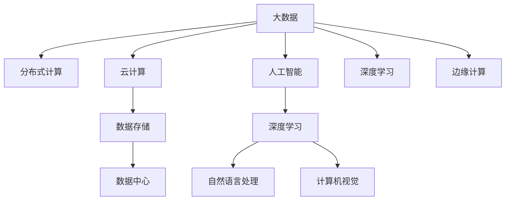

                 

# 大数据时代：人类计算的机遇与挑战

## 1. 背景介绍

### 1.1 问题由来
随着互联网和物联网的飞速发展，全球数据的生成速度和规模呈现爆炸式增长。据国际数据公司（IDC）统计，2021年全球数据总量达到了60ZB，预计到2025年将增长至175ZB。这些海量数据中蕴含着人类活动的方方面面，从基因组学到社交媒体，从气候变化到金融市场，每一类数据都在深刻影响着社会的每一个角落。

在这样的背景下，如何有效管理和利用这些大数据，成为了现代社会的一项重要任务。大数据不仅为科学研究提供了前所未有的数据支持，也为各行各业带来了效率提升和转型升级的机遇。然而，随着数据量的急剧增长，数据处理和存储的复杂度也大幅提升，人类计算系统面临前所未有的挑战。

### 1.2 问题核心关键点
大数据时代的核心关键点在于数据的规模、速度、多样性以及计算能力的提升。

1. **规模**：当前的数据规模已经远超传统计算机的处理能力，需要分布式计算、云计算等技术手段来支撑。

2. **速度**：实时数据流的处理需求使得数据处理速度必须跟上数据生成速度，需要高效的数据处理框架和算法。

3. **多样性**：数据类型多样，包括结构化数据、半结构化数据和非结构化数据，需要灵活的数据处理和存储方式。

4. **计算能力**：硬件和算法双管齐下，需要不断提升计算能力以应对更复杂的计算任务。

### 1.3 问题研究意义
研究大数据时代的人类计算技术，对于促进科学研究、推动经济社会发展、改善人类生活质量，具有重要意义：

1. **科学发现**：大数据为各类科学研究提供了前所未有的数据支持，加速了科学发现的过程。

2. **经济效率**：通过数据驱动的决策，企业可以优化生产流程，提高资源利用率，增强竞争力。

3. **社会治理**：大数据有助于提升公共服务的效率和质量，为城市管理、公共健康等领域带来新的治理模式。

4. **个人隐私**：大数据的应用同时也带来了隐私和安全的挑战，需要平衡数据利用和隐私保护。

## 2. 核心概念与联系

### 2.1 核心概念概述

为了更好地理解大数据时代的计算技术，本节将介绍几个密切相关的核心概念：

- **大数据（Big Data）**：指规模大、速度快、多样性高的数据集合，包括结构化数据、半结构化数据和非结构化数据。大数据为各种类型的科学研究、商业决策和社会治理提供了重要支持。

- **分布式计算（Distributed Computing）**：指将大规模计算任务分布在多个计算节点上进行并行处理的技术。分布式计算是大数据处理的核心技术之一，通过集群和云计算等手段，可以有效提升数据处理效率。

- **云计算（Cloud Computing）**：指通过互联网提供按需计算资源和服务的模式。云计算为大规模数据存储和处理提供了基础设施支持，是现代数据中心的核心。

- **人工智能（Artificial Intelligence）**：指通过算法和模型赋予计算机类似人类的智能行为，包括学习、推理、感知等能力。人工智能与大数据紧密结合，能够从海量数据中提取有价值的信息和知识。

- **深度学习（Deep Learning）**：指使用多层神经网络进行模型训练和预测的机器学习方法。深度学习在大数据背景下取得了显著的突破，广泛应用于图像识别、自然语言处理等领域。

- **边缘计算（Edge Computing）**：指在数据产生地进行初步处理和分析，减少数据传输和存储成本的技术。边缘计算在大数据时代尤为重要，特别是在实时性要求高的场景中。

这些核心概念之间的逻辑关系可以通过以下Mermaid流程图来展示：



这个流程图展示了大数据、分布式计算、云计算、人工智能、深度学习、边缘计算等概念之间的联系和相互依赖关系。

## 3. 核心算法原理 & 具体操作步骤
### 3.1 算法原理概述

在大数据时代，数据处理的算法和技术手段不断演进。核心的算法原理包括：

1. **MapReduce**：一种用于大规模数据集上的并行处理算法，将数据集分成多个子集，在不同的节点上并行处理，最后合并结果。

2. **Spark**：一种快速、通用、可扩展的分布式计算系统，支持多种编程语言和数据处理模式。Spark提供了一系列的API和工具，使得数据处理变得更加高效和便捷。

3. **Hadoop**：一种用于分布式存储和处理的开源框架，通过HDFS和MapReduce等技术，提供大规模数据处理的能力。

4. **机器学习和深度学习**：通过数据驱动的模型训练，自动发现数据中的模式和规律，用于预测、分类、聚类等任务。

5. **NoSQL数据库**：一种非关系型数据库，支持大规模数据存储和快速读写操作，用于处理海量非结构化数据。

6. **数据挖掘和知识发现**：从海量数据中提取有用信息和知识，用于决策支持和业务优化。

### 3.2 算法步骤详解

基于上述算法原理，大数据时代的计算技术一般包括以下几个关键步骤：

**Step 1: 数据收集和预处理**
- 从各种数据源（如传感器、社交媒体、交易记录等）收集数据。
- 对数据进行清洗、去重、标准化等预处理操作，确保数据的质量和一致性。

**Step 2: 数据存储与管理**
- 使用NoSQL数据库或传统的关系型数据库存储和管理数据。
- 使用分布式文件系统（如HDFS）进行数据存储，支持大规模数据的分布式存储和访问。

**Step 3: 数据处理与分析**
- 使用MapReduce、Spark等分布式计算框架进行数据处理。
- 使用机器学习、深度学习等算法对数据进行分析和建模。

**Step 4: 结果呈现与可视化**
- 使用可视化工具（如Tableau、Power BI等）将分析结果呈现为图表、报表等直观形式。
- 使用自然语言处理技术（如GPT等）生成报告和摘要，便于理解和应用。

### 3.3 算法优缺点

大数据时代的人类计算技术具有以下优点：
1. 高效处理大规模数据。通过分布式计算和云计算等技术手段，能够高效处理海量数据，提高数据处理速度和效率。
2. 丰富的数据处理工具。众多开源工具和框架提供了丰富的功能和接口，便于开发者进行数据处理和分析。
3. 促进跨领域融合。大数据技术为不同领域之间的数据融合提供了可能，推动了跨学科的合作与发展。
4. 提高决策质量。通过数据驱动的决策支持系统，能够更准确地理解和预测事物发展趋势，提升决策质量。

同时，这些技术也存在一些局限性：
1. 数据隐私和安全问题。大数据处理中涉及大量敏感信息，如何保护数据隐私和安全是一个重大挑战。
2. 数据质量控制。数据质量问题（如数据缺失、噪音等）直接影响数据分析结果，需要投入大量精力进行数据清洗和预处理。
3. 计算资源消耗。大规模数据处理和存储需要大量的计算资源，对硬件和网络环境要求较高。
4. 技术门槛高。大数据处理涉及众多复杂技术，需要专业的技能和经验才能有效应用。
5. 数据孤岛现象。由于不同数据源的数据格式和结构不同，数据孤岛现象普遍存在，影响数据的融合和共享。

### 3.4 算法应用领域

大数据时代的人类计算技术，在众多领域得到了广泛应用，包括：

- **科学研究**：基因组学、天文学、气候研究等领域通过大数据技术进行科学发现和数据分析，推动了科学研究的进步。

- **金融服务**：金融行业利用大数据进行风险评估、客户行为分析、欺诈检测等，提升了金融服务的安全性和效率。

- **医疗健康**：通过医疗大数据进行疾病预测、基因分析、药物研发等，推动了医疗健康领域的技术进步。

- **电子商务**：电商平台利用大数据进行个性化推荐、用户行为分析、库存管理等，提升了用户体验和运营效率。

- **城市治理**：智慧城市建设利用大数据进行交通管理、环境监测、公共安全等，提升了城市治理的智能化水平。

- **环境保护**：通过大数据分析气候变化、污染监测等环境数据，推动了环境保护和可持续发展。

## 4. 数学模型和公式 & 详细讲解 & 举例说明

### 4.1 数学模型构建

大数据时代的计算技术涉及多个数学模型，以下以数据挖掘中的聚类算法为例，介绍数学模型的构建过程。

假设有一组数据集 $D=\{x_1, x_2, \dots, x_n\}$，每个数据点 $x_i$ 表示一个 $d$ 维向量，目标是将其分为 $K$ 个不同的簇。常用的聚类算法包括K-means、DBSCAN等，这里以K-means为例。

数学模型构建如下：
- 定义聚类中心 $C=\{\mu_1, \mu_2, \dots, \mu_K\}$，初始化为随机选择的 $K$ 个数据点。
- 定义每个数据点到其最近的聚类中心的距离函数 $d_i$。
- 定义目标函数 $J=\sum_{i=1}^n d_i^2$，即所有数据点到其最近的聚类中心的平方和。

### 4.2 公式推导过程

K-means算法的目标是最小化目标函数 $J$，通过迭代更新聚类中心 $C$ 和数据点的分配来实现。

设当前聚类中心为 $C$，数据点 $x_i$ 当前属于第 $k$ 个簇，则：

$$
J = \sum_{i=1}^n \sum_{k=1}^K d_i^2
$$

目标函数的梯度下降过程如下：

1. 计算每个数据点到当前聚类中心的距离，更新数据点 $x_i$ 的分配：

$$
z_i = \arg\min_k d_i(\mu_k)
$$

2. 计算每个聚类中心的移动方向：

$$
\mu_k = \frac{1}{n_k} \sum_{i=z_i=k} x_i
$$

其中 $n_k$ 为第 $k$ 个簇的数据点数。

3. 重复上述步骤，直到收敛或达到预设迭代次数。

通过推导和计算，K-means算法能够从大规模数据中发现数据的内在结构和模式，广泛应用于商业智能、生物信息学等领域。

### 4.3 案例分析与讲解

以社交媒体情感分析为例，介绍如何使用大数据技术进行情感分类。

假设有一组社交媒体评论数据 $D=\{x_1, x_2, \dots, x_n\}$，每个评论 $x_i$ 表示一个文本串，目标是将其分类为正面、负面或中性。

**Step 1: 数据收集**
- 收集社交媒体平台上的评论数据，并进行数据清洗和预处理，去除噪音和无关信息。

**Step 2: 特征提取**
- 使用NLP技术进行文本向量化，将每个评论转换为向量表示，用于后续的模型训练。

**Step 3: 模型训练**
- 使用机器学习算法（如朴素贝叶斯、支持向量机等）进行模型训练，生成情感分类器。

**Step 4: 结果评估**
- 使用准确率、召回率、F1值等指标评估模型的性能。
- 使用混淆矩阵等可视化工具呈现分类结果，便于理解和分析。

## 5. 项目实践：代码实例和详细解释说明

### 5.1 开发环境搭建

在进行大数据计算技术开发前，我们需要准备好开发环境。以下是使用Python进行PySpark开发的环境配置流程：

1. 安装Anaconda：从官网下载并安装Anaconda，用于创建独立的Python环境。

2. 创建并激活虚拟环境：
```bash
conda create -n bigdata-env python=3.8 
conda activate bigdata-env
```

3. 安装PySpark：根据Hadoop版本，从官网获取对应的安装命令。例如：
```bash
pip install pyspark
```

4. 安装各类工具包：
```bash
pip install numpy pandas scikit-learn matplotlib tqdm jupyter notebook ipython
```

完成上述步骤后，即可在`bigdata-env`环境中开始开发实践。

### 5.2 源代码详细实现

下面我们以社交媒体情感分析为例，给出使用PySpark对数据进行情感分类的PySpark代码实现。

首先，定义数据处理函数：

```python
from pyspark.sql import SparkSession
from pyspark.sql.functions import col, split, regexpr_replace, concat_ws, lower
from pyspark.ml.feature import HashingTF, IDF, StopWordsRemover
from pyspark.ml import Pipeline
from pyspark.ml.classification import LogisticRegressionModel

def preprocess_data(spark, data):
    # 去除停用词
    stop_words = StopWordsRemover(inputCol="text", outputCol="cleaned_text", stopWords=["the", "and", "a", "an", "in", "of", "to"])
    # 分词
    hashing_tf = HashingTF(inputCol="cleaned_text", outputCol="features", numFeatures=100000)
    # 特征转换
    idf = IDF(inputCol="features", outputCol="tfidf", minDocFreq=2)
    # 拼接特征向量
    text_proc = Pipeline(stages=[stop_words, hashing_tf, idf])
    return text_proc.fit(data)

def train_model(spark, data, labels):
    # 模型训练
    lr = LogisticRegression(maxIter=10, elasticNetParam=0.0)
    trainer = LogisticRegression.train(trainingData, numClasses=3, labels=labels)
    return trainer
```

然后，定义训练和评估函数：

```python
from pyspark.sql import functions as F
from pyspark.ml.evaluation import MulticlassClassificationEvaluator

def train_epoch(model, data, labels):
    train_data = data.select("features")
    train_model = model.train(train_data)
    return train_model

def evaluate(model, data, labels):
    evaluator = MulticlassClassificationEvaluator(rawPredictionCol="prediction", labelCol="label", metricName="accuracy")
    evaluator_model = evaluator.evaluate(trainingData)
    return evaluator_model
```

最后，启动训练流程并在测试集上评估：

```python
spark = SparkSession.builder.getOrCreate()
data = spark.read.text("data.csv")
labels = spark.read.text("labels.csv")

preproc = preprocess_data(spark, data)
train_data = preproc.transform(data)
train_labels = spark.read.text("train_labels.csv")

trainer = train_model(spark, train_data, train_labels)
evaluator = evaluate(trainer, data, labels)
print("Accuracy: ", evaluator)
```

以上就是使用PySpark对社交媒体情感数据进行分类的完整代码实现。可以看到，PySpark提供了丰富的API和工具，使得大数据处理和机器学习模型训练变得更加高效和便捷。

### 5.3 代码解读与分析

让我们再详细解读一下关键代码的实现细节：

**preprocess_data函数**：
- 使用StopWordsRemover去除文本中的停用词，如"the"、"and"等。
- 使用HashingTF将文本转换为特征向量，并使用IDF进行特征降维，减少计算量。

**train_model函数**：
- 定义逻辑回归模型，使用Spark MLlib库的LogisticRegressionModel进行训练。

**train_epoch和evaluate函数**：
- 使用Spark MLlib库的Pipeline进行模型训练和评估，输出准确率等性能指标。

**代码整体结构**：
- 数据预处理：去除停用词、文本分词、特征转换等。
- 模型训练：使用LogisticRegression进行情感分类。
- 模型评估：使用MulticlassClassificationEvaluator评估模型性能。

## 6. 实际应用场景

### 6.1 智能交通系统

大数据技术在智能交通系统中得到了广泛应用，通过实时监控和分析交通数据，能够实现交通流优化、交通事故预测、道路施工管理等。例如，通过分析历史交通数据和实时交通数据，可以预测交通拥堵情况，并提前采取措施缓解拥堵，提高道路通行效率。

### 6.2 精准医疗

在精准医疗领域，大数据技术可以用于基因组分析、药物研发、病历记录等。通过对海量医疗数据的分析，可以发现疾病发展规律、优化治疗方案，提高医疗服务的精准度和效率。例如，通过分析患者的基因组数据和病历记录，可以预测疾病风险，并提出个性化的治疗方案。

### 6.3 金融风险管理

金融行业利用大数据进行风险评估、欺诈检测、市场预测等，能够显著提升金融服务的安全性和效率。例如，通过分析交易记录和客户行为数据，可以发现异常交易和潜在风险，并及时采取措施防范金融风险。

### 6.4 未来应用展望

未来，大数据技术将进一步拓展其应用领域，为更多行业带来变革性影响：

1. **工业制造**：通过大数据分析生产数据，实现智能制造和设备维护，提高生产效率和设备利用率。

2. **农业**：利用大数据分析气候数据和农作物种类，优化种植方案，提高农作物产量和质量。

3. **教育**：通过大数据分析学生行为和学习数据，提供个性化的学习方案和教育资源，提升教育效果。

4. **公共安全**：利用大数据分析社会事件和犯罪数据，预测和防范社会风险，提升公共安全水平。

5. **环境监测**：通过大数据分析环境数据，监测和预测环境变化趋势，推动环境保护和可持续发展。

## 7. 工具和资源推荐

### 7.1 学习资源推荐

为了帮助开发者系统掌握大数据技术的理论基础和实践技巧，这里推荐一些优质的学习资源：

1. **《大数据时代：从数据到智慧》（Wang Qiang）**：全面介绍大数据技术的原理、工具和应用，适合初学者和从业者。

2. **《机器学习实战》（Peter Harrington）**：经典机器学习实践指南，介绍了多种机器学习算法和实现方式，包括大数据技术的应用。

3. **《Spark编程指南》（Edward W. Rendelman）**：详细讲解Spark框架的使用和API，适合Spark开发者和数据工程师。

4. **Kaggle大数据竞赛**：Kaggle平台提供了丰富的数据集和竞赛，是学习和实践大数据技术的绝佳平台。

5. **《深度学习》（Ian Goodfellow）**：深入介绍深度学习的原理和应用，包括在大数据背景下的深度学习算法和模型。

通过这些资源的学习实践，相信你一定能够快速掌握大数据技术的精髓，并用于解决实际的商业问题。

### 7.2 开发工具推荐

高效的大数据计算离不开优秀的工具支持。以下是几款常用的大数据开发工具：

1. **PySpark**：Spark的Python API，提供丰富的数据处理和机器学习功能，支持分布式计算。

2. **Apache Flink**：开源流处理框架，支持高吞吐量的实时数据处理，适用于大数据实时分析。

3. **Apache Hive**：基于Hadoop的分布式数据仓库，支持SQL查询和数据存储，适合大规模数据处理。

4. **Apache Kafka**：开源流处理平台，支持高吞吐量的数据流处理，适用于实时数据采集和传输。

5. **Apache HBase**：分布式列式数据库，支持海量数据的存储和访问，适合大数据存储需求。

6. **Apache Hadoop**：开源分布式计算框架，提供数据存储和计算支持，适合大规模数据处理。

7. **Apache Cassandra**：分布式数据库，支持高可用性和高扩展性，适合大规模数据存储和访问。

这些工具为大数据计算提供了强大的支持和丰富的功能，使得大数据处理变得更加高效和便捷。

### 7.3 相关论文推荐

大数据技术的不断演进依赖于学界的持续研究。以下是几篇奠基性的相关论文，推荐阅读：

1. **"Big Data: A Revolution That Will Transform How We Live, Work, and Think"（Viktor Mayer-Schönberger）**：从理论和技术两个层面全面介绍大数据时代的特点和挑战。

2. **"MapReduce: Simplified Data Processing on Large Clusters"（Dean & Ghemawat）**：提出MapReduce算法，为大规模数据处理提供新的思路。

3. **"Deep Learning"（Goodfellow et al.）**：全面介绍深度学习的原理和应用，包括在大数据背景下的深度学习算法和模型。

4. **"Big Data Mining: A Survey"（Zhou et al.）**：综述大数据挖掘技术的研究进展，介绍了各种大数据挖掘算法和工具。

5. **"Learning from Data"（Wang et al.）**：综述机器学习在大数据中的应用，介绍了多种机器学习算法和实现方式。

这些论文代表了大数据技术的最新进展，能够帮助你更好地理解大数据计算的核心思想和技术手段。

## 8. 总结：未来发展趋势与挑战

### 8.1 总结

本文对大数据时代的计算技术进行了全面系统的介绍。首先阐述了大数据时代的背景和意义，明确了大数据处理的核心技术和关键应用场景。其次，从算法原理到实际应用，详细讲解了大数据技术的实现过程，给出了实际应用场景的代码实现。

通过本文的系统梳理，可以看到，大数据技术正在成为各行各业的重要支撑，为科学研究和商业决策提供了强大的数据支持。未来，伴随技术不断进步和应用场景的不断拓展，大数据技术必将在更多领域发挥关键作用，推动社会经济的发展。

### 8.2 未来发展趋势

展望未来，大数据技术的发展趋势如下：

1. **技术创新**：大数据处理和存储技术将不断创新，分布式计算、云存储等技术手段将进一步提升数据处理的效率和可靠性。

2. **跨领域融合**：大数据技术将与人工智能、物联网、区块链等新兴技术深度融合，形成更加全面的技术体系，推动各行各业的发展。

3. **实时处理**：实时数据流处理将成为大数据技术的重要方向，能够满足更多实时性要求高的应用场景。

4. **隐私保护**：大数据技术在应用过程中需要高度关注数据隐私和安全，发展隐私保护技术，保护用户数据隐私。

5. **自动化和智能化**：大数据处理过程将更加自动化和智能化，减少人工干预，提高处理效率和准确性。

### 8.3 面临的挑战

尽管大数据技术在诸多领域中取得了显著成就，但在迈向更加智能化、普适化应用的过程中，仍面临诸多挑战：

1. **数据孤岛**：不同数据源的数据格式和结构不同，数据孤岛现象普遍存在，影响数据的融合和共享。

2. **数据隐私**：大数据处理中涉及大量敏感信息，如何保护数据隐私和安全是一个重大挑战。

3. **计算资源**：大规模数据处理和存储需要大量的计算资源，对硬件和网络环境要求较高。

4. **数据质量**：数据质量问题（如数据缺失、噪音等）直接影响数据分析结果，需要投入大量精力进行数据清洗和预处理。

5. **技术复杂度**：大数据技术涉及众多复杂技术，需要专业的技能和经验才能有效应用。

### 8.4 研究展望

面对大数据技术面临的挑战，未来的研究需要在以下几个方面寻求新的突破：

1. **数据融合与共享**：发展数据标准化技术，解决不同数据源之间的数据格式和结构问题，促进数据的融合与共享。

2. **隐私保护**：发展隐私保护技术，保护用户数据隐私，如差分隐私、联邦学习等技术。

3. **分布式计算**：发展更加高效、可靠的分布式计算技术，如Flink、Spark等，提升数据处理效率。

4. **自动化与智能化**：发展自动化的数据处理和分析工具，减少人工干预，提高处理效率和准确性。

5. **跨领域融合**：发展跨领域的数据融合技术，促进大数据技术与人工智能、物联网、区块链等新兴技术的深度融合，形成更加全面的技术体系。

通过这些研究方向的研究和突破，大数据技术必将在未来发挥更大的作用，为各行各业带来更大的机遇和挑战。

## 9. 附录：常见问题与解答

**Q1：大数据时代对传统计算系统有哪些影响？**

A: 大数据时代对传统计算系统带来了多方面的影响：

1. **计算模式**：大数据需要分布式计算、云计算等新计算模式，传统单节点计算模式已难以适应。

2. **存储需求**：大数据需要海量存储能力，传统存储系统需要升级，如Hadoop、Spark等技术提供了分布式存储解决方案。

3. **网络带宽**：大数据处理需要大规模数据传输，网络带宽需求大幅增加，需要高带宽的网络基础设施。

4. **数据处理**：传统的数据处理算法和技术难以应对大数据，需要发展新的数据处理技术和算法。

5. **系统架构**：大数据系统需要高性能、高可扩展性的架构，传统系统架构需要调整和升级。

**Q2：如何在大数据环境下优化数据处理速度？**

A: 在大数据环境下，优化数据处理速度需要从多个方面入手：

1. **优化算法**：使用高效的算法和数据结构，如MapReduce、Spark等分布式计算框架，提升数据处理速度。

2. **数据压缩**：使用数据压缩技术，减少数据传输和存储的资源消耗，提高数据处理效率。

3. **数据分区**：对数据进行分区和分片，减少单节点数据处理压力，提高并行处理能力。

4. **内存优化**：使用内存计算和缓存技术，减少磁盘I/O操作，提升数据处理速度。

5. **硬件升级**：使用高性能硬件设备，如GPU、TPU等，提升数据处理能力。

**Q3：大数据处理中如何保证数据隐私和安全？**

A: 在大数据处理中，保证数据隐私和安全是重要任务，主要措施包括：

1. **数据脱敏**：使用数据脱敏技术，对敏感数据进行处理，保护用户隐私。

2. **访问控制**：使用访问控制技术，限制数据访问权限，保护数据安全。

3. **数据加密**：使用数据加密技术，保护数据在传输和存储过程中的安全性。

4. **隐私保护技术**：使用差分隐私、联邦学习等隐私保护技术，保护用户数据隐私。

5. **安全审计**：建立数据处理过程的安全审计机制，监控和记录数据处理行为，及时发现和处理异常情况。

**Q4：大数据技术对个人隐私有哪些潜在影响？**

A: 大数据技术在提升数据处理效率和决策支持的同时，也带来了对个人隐私的潜在影响：

1. **数据泄露**：大数据处理中涉及大量个人数据，存在数据泄露的风险。

2. **隐私侵犯**：大数据技术可能用于隐私侵犯，如数据挖掘、精准广告等，侵犯用户隐私权。

3. **监控和跟踪**：大数据技术可能用于监控和跟踪个人行为，侵犯个人隐私。

4. **数据滥用**：大数据数据可能被滥用，用于恶意目的，如欺诈、诈骗等，造成社会不良影响。

**Q5：大数据时代如何应对数据孤岛现象？**

A: 数据孤岛现象是大数据处理中的常见问题，解决措施包括：

1. **数据标准化**：推动数据标准化，制定统一的数据格式和规范，促进数据的融合和共享。

2. **数据联邦**：使用联邦学习等技术，在不共享数据的前提下，通过模型训练和推理实现数据融合。

3. **数据交换平台**：建立数据交换平台，促进不同数据源之间的数据交换和共享。

4. **数据治理**：建立数据治理体系，明确数据管理流程和责任，确保数据质量和安全。

**Q6：大数据技术在科学研究中有哪些应用？**

A: 大数据技术在科学研究中具有广泛应用，主要体现在以下几个方面：

1. **基因组学**：通过大数据技术分析基因组数据，发现基因突变和疾病相关性，推动基因研究和疾病治疗。

2. **天文学**：通过大数据技术分析天文观测数据，发现天体运动规律，推动天体物理研究。

3. **气候变化**：通过大数据技术分析气候数据，预测气候变化趋势，推动环境保护和可持续发展。

4. **生物医学**：通过大数据技术分析医疗数据，发现疾病发展规律，优化治疗方案，提升医疗服务水平。

**Q7：如何应对大数据时代的技术复杂性？**

A: 大数据技术涉及众多复杂技术，应对技术复杂性的主要措施包括：

1. **专业培训**：开展大数据技术的培训和教育，提升从业人员的技术水平和经验。

2. **开源社区**：利用开源社区的资源和支持，快速掌握大数据技术。

3. **技术创新**：持续推动大数据技术的创新和发展，提升技术的可用性和可靠性。

4. **协作和分享**：加强跨领域、跨行业的技术协作和经验分享，推动大数据技术的应用和推广。

5. **标准化和规范**：制定大数据技术标准和规范，提高技术的可操作性和可维护性。

---

作者：禅与计算机程序设计艺术 / Zen and the Art of Computer Programming

