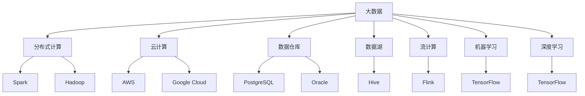

                 

# 大数据时代：人类计算的机遇与挑战并存

## 1. 背景介绍

### 1.1 问题由来

在信息爆炸的21世纪，数据量以指数级速度增长。大数据时代的到来，为各行各业带来了前所未有的机遇，也带来了新的挑战。如何在海量数据中挖掘出有价值的知识和模式，如何将这些知识转化为实际生产力，成为了当下科技企业亟需解决的课题。

大数据技术的崛起，离不开计算资源的支撑。随着计算架构的演变，从个人计算机、服务器集群、云计算平台，到最新的量子计算机，计算能力得到了前所未有的提升。这使得各行各业能够利用大数据技术，进行数据挖掘、模式识别、预测分析等高级计算任务，极大地提升了业务效率和决策质量。

然而，大数据同时也带来了新的挑战。数据多样性、实时性、安全性等问题，以及计算资源成本高昂、算法复杂度高等问题，都需要我们采取新的计算范式和工具。本文旨在探讨大数据时代，人类计算所面临的机遇与挑战，并提出解决思路。

### 1.2 问题核心关键点

大数据时代，计算的核心任务已经从传统的数值计算、科学计算，拓展到了数据计算。数据计算的目标是从数据中提取知识、洞察和价值，以驱动业务决策和创新。数据计算的复杂性和多样性，对计算资源和算法提出了更高的要求，使得传统的计算范式已经难以应对。

数据计算面临的核心挑战包括：

1. **数据规模**：数据量庞大且增长速度快，传统的计算架构难以高效处理。
2. **数据类型**：数据类型多样，包括结构化数据、非结构化数据、半结构化数据等，处理方式不同。
3. **实时性**：数据处理需要实时响应，传统批处理方式难以满足。
4. **数据安全性**：数据隐私和安全问题，需要在计算过程中得到充分考虑。
5. **算法复杂度**：数据计算涉及复杂的算法和模型，计算过程复杂且易出错。

针对这些问题，本文将从数据计算的基本原理、关键技术和实际应用场景进行全面探讨。

## 2. 核心概念与联系

### 2.1 核心概念概述

为更好地理解大数据时代的计算范式，本节将介绍几个密切相关的核心概念：

- **大数据(Big Data)**：指规模巨大、类型繁多、速度极快的数据集合。其特征包括数据量大、种类多样、处理速度快、价值密度低。
- **分布式计算**：通过将大规模数据和计算任务分解成多个子任务，并行地在多个计算节点上执行，以提高计算效率。
- **云计算**：通过互联网提供可扩展的计算资源，用户按需使用，按量计费。云计算是实现分布式计算的重要手段。
- **数据仓库**：用于存储和管理企业历史数据的系统，支持数据的快速查询和分析。
- **数据湖**：与数据仓库不同，数据湖支持所有类型的数据，存储海量的非结构化数据。数据湖提供更高的灵活性和可扩展性。
- **流计算**：实时处理数据流，支持低延迟、高吞吐量的数据计算。
- **机器学习**：利用算法和大数据进行自动分析和决策，广泛应用于预测、分类、聚类等任务。
- **深度学习**：机器学习的一种高级形式，通过多层神经网络对数据进行特征学习和模式识别。

这些核心概念之间的逻辑关系可以通过以下Mermaid流程图来展示：



这个流程图展示了大数据时代的核心概念及其之间的关系：

1. 大数据作为数据计算的基础，需要通过分布式计算、云计算等手段进行存储和处理。
2. 数据仓库和数据湖提供数据的存储和管理，支持数据的快速查询和分析。
3. 流计算实现数据的实时处理，机器学习和深度学习从数据中挖掘知识，驱动业务决策和创新。

这些概念共同构成了大数据时代数据计算的基础框架，帮助我们更好地理解数据计算的工作原理和优化方向。

## 3. 核心算法原理 & 具体操作步骤

### 3.1 算法原理概述

大数据时代的计算任务，本质上是从海量数据中提取有用知识和模式的过程。这一过程涉及数据采集、存储、处理和分析等多个环节。本文将从这些关键环节入手，探讨核心算法原理和具体操作步骤。

### 3.2 算法步骤详解

#### 3.2.1 数据采集

数据采集是大数据计算的第一步，涉及从不同来源收集原始数据。数据采集的方式包括：

- **在线采集**：通过API、爬虫等手段，从网站、社交媒体等平台获取实时数据。
- **离线采集**：通过文件、数据库等形式，将历史数据收集到本地或云存储系统。

#### 3.2.2 数据存储

数据存储需要考虑数据的容量、速度和安全性。常见的数据存储方式包括：

- **关系型数据库**：如MySQL、Oracle等，适用于结构化数据的存储和管理。
- **非关系型数据库**：如MongoDB、HBase等，适用于半结构化和非结构化数据的存储。
- **数据湖**：如Hadoop Distributed File System (HDFS)、Amazon S3等，适用于海量的非结构化数据存储。

#### 3.2.3 数据处理

数据处理是将原始数据转化为可分析的格式的过程，涉及数据清洗、转换和聚合等任务。常见的数据处理框架包括：

- **Hadoop**：分布式计算框架，支持大规模数据的并行处理。
- **Spark**：快速、可扩展的分布式计算框架，支持内存计算和大数据流处理。
- **Apache Flink**：流处理框架，支持低延迟、高吞吐量的数据计算。
- **Kafka**：流数据处理框架，支持数据流的实时处理和存储。

#### 3.2.4 数据分析

数据分析是从数据中提取知识和模式的过程，涉及数据挖掘、机器学习和深度学习等技术。数据分析的目标包括：

- **描述性分析**：对历史数据进行统计描述，发现数据的基本特征。
- **预测性分析**：利用历史数据进行预测建模，预测未来趋势。
- **规范性分析**：通过数据分析提出决策建议，指导业务决策。

#### 3.2.5 数据可视化

数据可视化是将分析结果以图形化的方式呈现，支持业务理解和决策支持。常见的数据可视化工具包括：

- **Tableau**：流行的数据可视化工具，支持交互式的数据分析。
- **Power BI**：微软推出的商业智能工具，支持数据可视化和报表生成。
- **D3.js**：JavaScript库，支持灵活的数据可视化。

### 3.3 算法优缺点

大数据时代的计算范式，具有以下优点：

1. **计算能力强大**：分布式计算和云计算提供了强大的计算资源，可以处理大规模数据。
2. **处理速度快**：流计算支持实时数据处理，可以满足低延迟要求。
3. **灵活性高**：数据仓库和数据湖支持多样化数据的存储，机器学习和深度学习提供了多样化的分析工具。
4. **可扩展性强**：分布式计算框架可以水平扩展，支持数据的无限增长。

但同时，大数据计算也存在一些缺点：

1. **成本高昂**：分布式计算和云计算需要大量的基础设施投入，成本较高。
2. **复杂度高**：数据计算涉及复杂的算法和模型，调试和优化难度较大。
3. **数据安全风险**：海量数据存储和处理增加了数据泄露和篡改的风险。
4. **数据质量问题**：数据采集、清洗和转换过程中容易出错，影响数据分析结果。

### 3.4 算法应用领域

大数据计算技术在多个领域得到了广泛应用，包括但不限于：

- **金融领域**：用于风险管理、信用评分、欺诈检测等任务。
- **电商领域**：用于用户行为分析、推荐系统、广告投放等任务。
- **医疗领域**：用于疾病预测、基因分析、药物研发等任务。
- **物联网领域**：用于设备数据采集、实时监控、异常检测等任务。
- **智能制造领域**：用于生产设备监控、质量控制、预测维护等任务。
- **智慧城市领域**：用于交通管理、公共安全、能源优化等任务。

## 4. 数学模型和公式 & 详细讲解 & 举例说明

### 4.1 数学模型构建

在大数据计算中，数学模型的构建是核心。本文将使用数学语言对大数据计算的基本框架进行更加严格的刻画。

记大数据计算任务为 $P$，输入数据为 $X$，输出为 $Y$。数学模型 $f$ 的目标是从输入数据 $X$ 中提取有用信息，映射到输出 $Y$。数学模型的构建过程包括数据采集、存储、处理和分析等步骤，可以用以下数学公式表示：

$$
f: X \rightarrow Y
$$

其中，$X$ 包括数据采集、存储、处理等步骤，$Y$ 包括数据分析、可视化等步骤。

### 4.2 公式推导过程

以一个简单的金融风险评估模型为例，展示数学模型的推导过程。

假设有一组历史金融交易数据 $X=\{x_1, x_2, ..., x_n\}$，其中 $x_i$ 包括交易金额、时间、地点等特征。我们的目标是构建一个数学模型 $f$，将新交易数据 $x_{new}$ 映射到风险评分 $Y$。

首先，我们需要从历史数据中提取有用的特征 $x_i^* = (x_{i1}, x_{i2}, ..., x_{in})$，其中 $x_{ij}$ 表示第 $i$ 个样本的第 $j$ 个特征。

然后，我们将特征向量 $x_i^*$ 输入到机器学习模型 $f$ 中进行训练，得到模型参数 $\theta$。训练过程可以用以下公式表示：

$$
\theta = \arg\min_\theta \sum_{i=1}^n L(f(x_i^*, \theta), y_i)
$$

其中，$L$ 表示损失函数，$y_i$ 表示第 $i$ 个样本的真实风险评分。

最后，将新交易数据 $x_{new}$ 输入到训练好的模型 $f$ 中，得到风险评分 $Y=f(x_{new}, \theta)$。

### 4.3 案例分析与讲解

假设我们有一组历史电商交易数据，包含用户的购买历史、浏览历史、评分等特征，目标是为新用户推荐商品。

首先，我们需要从历史数据中提取有用的特征，如用户ID、购买历史、浏览历史等。然后，我们将这些特征输入到机器学习模型中，构建一个协同过滤模型或深度学习模型，进行训练。训练过程可以使用矩阵分解、神经网络等算法。

在训练完成后，我们将新用户的特征输入到训练好的模型中，得到推荐商品的列表。同时，可以将推荐结果可视化，展示给用户。

## 5. 项目实践：代码实例和详细解释说明

### 5.1 开发环境搭建

在进行大数据计算项目开发前，我们需要准备好开发环境。以下是使用Python进行Apache Spark开发的开发环境配置流程：

1. 安装Apache Spark：从官网下载并安装Spark，配置环境变量，并启动Spark Shell或Spark Streaming。

2. 安装PySpark：从官网下载并安装PySpark，确保PySpark与Spark版本兼容。

3. 安装各类库：安装Pandas、Numpy、Scikit-learn等数据处理和分析库，以及PyTorch、TensorFlow等机器学习库。

4. 安装数据源驱动：安装Hadoop、Hive等数据源驱动，用于连接大数据集群。

完成上述步骤后，即可在Spark环境中开始大数据计算项目开发。

### 5.2 源代码详细实现

下面以一个简单的电商推荐系统为例，展示使用Apache Spark进行大数据计算的PySpark代码实现。

首先，定义数据处理函数：

```python
from pyspark.sql import SparkSession

spark = SparkSession.builder.appName('RecommendationSystem').getOrCreate()

def preprocess_data(df):
    df = df.dropna() # 去除缺失值
    df = df.select('user_id', 'item_id', 'rating') # 选择有用特征
    return df
```

然后，加载和预处理数据：

```python
df = spark.read.csv('path/to/data.csv', header=True, inferSchema=True)
df = preprocess_data(df)
```

接着，构建协同过滤模型：

```python
from pyspark.ml.recommendation import ALS

model = ALS(items=10, factors=10, iter=10, regParam=0.01)
model.fit(df)
```

最后，生成推荐结果：

```python
recommendations = model.transform(df)
recommendations.show()
```

### 5.3 代码解读与分析

让我们再详细解读一下关键代码的实现细节：

**SparkSession创建**：
- 使用 `SparkSession.builder.appName` 创建Spark Session，用于与Spark集群进行交互。

**数据预处理**：
- `preprocess_data` 函数用于去除缺失值，选择有用的特征。
- 使用 `df.dropna()` 去除缺失值，保留有效的数据行。
- 使用 `df.select('user_id', 'item_id', 'rating')` 选择有用的特征。

**协同过滤模型构建**：
- `ALS` 类用于构建协同过滤模型，其中 `items` 表示用户数量，`factors` 表示嵌入维度，`iter` 表示迭代次数，`regParam` 表示正则化参数。
- `model.fit(df)` 用于训练模型，其中 `df` 表示数据集。

**推荐结果生成**：
- `recommendations = model.transform(df)` 使用训练好的模型对数据集进行预测，生成推荐结果。
- `recommendations.show()` 展示推荐结果。

可以看到，Apache Spark通过Spark SQL和MLlib等组件，提供了强大的数据处理和机器学习功能，使得大数据计算项目开发变得高效便捷。开发者可以通过简单的API，快速构建复杂的计算任务，实现高效的数据处理和分析。

## 6. 实际应用场景

### 6.1 智能客服系统

大数据技术在智能客服系统中的应用，可以显著提升客户服务质量。传统客服系统需要配备大量人力，高峰期响应缓慢，且难以保证服务质量。使用大数据计算技术，可以实时监控和分析客户咨询数据，自动回答常见问题，并自动分配客服人员，提高客户满意度。

在技术实现上，可以收集客户的历史咨询记录，构建客户画像，预测客户需求，自动生成回答。同时，使用流计算技术，实时监控客户的咨询状态，动态调整客服人员分配，实现高效、准确的客服服务。

### 6.2 智慧城市

智慧城市是大数据计算的重要应用场景之一，通过大数据计算技术可以实现城市的智能化管理。智慧城市涉及交通、能源、公共安全等多个方面，需要通过大数据计算技术进行实时监控和分析。

例如，智慧交通系统可以实时监控交通流量、车辆行驶状态，预测交通拥堵，智能调控交通信号灯。智慧能源系统可以实时监控电力负荷、能源使用情况，优化能源分配。智慧公共安全系统可以实时监控犯罪数据，预测犯罪行为，提高公共安全。

### 6.3 个性化推荐系统

个性化推荐系统是大数据计算的重要应用场景之一，通过大数据计算技术可以实现个性化推荐。个性化推荐系统可以分析用户的浏览、购买历史，推荐用户感兴趣的商品，提高用户转化率和满意度。

在技术实现上，可以收集用户的浏览、购买历史数据，构建用户画像，分析用户的兴趣偏好。然后，使用协同过滤、深度学习等算法，生成个性化的推荐结果。使用流计算技术，实时更新用户画像，动态生成推荐结果，实现高效、精准的个性化推荐。

### 6.4 未来应用展望

未来，大数据计算技术将在更多领域得到应用，为各行各业带来变革性影响。以下是几个未来可能的应用场景：

1. **医疗领域**：通过分析医疗数据，预测疾病风险，提供个性化医疗方案，优化医疗资源配置。
2. **金融领域**：通过分析金融数据，预测市场趋势，提供金融产品推荐，防范金融风险。
3. **制造领域**：通过分析生产设备数据，预测设备故障，优化生产流程，提高生产效率。
4. **教育领域**：通过分析学生学习数据，提供个性化学习方案，提高学习效果，优化教育资源配置。
5. **交通领域**：通过分析交通数据，预测交通流量，优化交通管理，减少交通拥堵。

## 7. 工具和资源推荐

### 7.1 学习资源推荐

为了帮助开发者系统掌握大数据计算的理论基础和实践技巧，这里推荐一些优质的学习资源：

1. 《大数据之路：阿里巴巴技术分享》系列博文：由阿里巴巴技术团队撰写，详细介绍了大数据计算的架构和技术。
2. Coursera《大数据技术与应用》课程：由大数据领域的专家授课，涵盖大数据计算的原理和实践。
3. O'Reilly《大数据分析实战》书籍：系统介绍了大数据计算的技术和应用，涵盖Hadoop、Spark等主流框架。
4. Kaggle：全球最大的数据科学竞赛平台，提供丰富的数据集和算法竞赛，帮助开发者实践大数据计算技能。
5. Hadoop官方文档：Hadoop的官方文档，提供了详细的架构和开发指南，是入门大数据计算的必备资料。

通过对这些资源的学习实践，相信你一定能够快速掌握大数据计算的精髓，并用于解决实际的计算问题。

### 7.2 开发工具推荐

高效的大数据计算离不开优秀的工具支持。以下是几款用于大数据计算开发的常用工具：

1. Apache Spark：分布式计算框架，支持大规模数据的处理和分析。
2. Apache Hadoop：分布式存储和计算平台，支持海量数据的存储和处理。
3. Apache Flink：流处理框架，支持低延迟、高吞吐量的数据处理。
4. Apache Kafka：流数据处理框架，支持数据的实时处理和存储。
5. Apache Hive：数据仓库工具，支持数据的分布式存储和分析。
6. PySpark：Python接口，方便进行大数据计算和数据分析。

合理利用这些工具，可以显著提升大数据计算项目的开发效率，加快创新迭代的步伐。

### 7.3 相关论文推荐

大数据计算技术的发展离不开学界的持续研究。以下是几篇奠基性的相关论文，推荐阅读：

1. MapReduce：简化大规模数据集并行计算的编程模型。
2. Hadoop：分布式文件系统，支持大规模数据的存储和处理。
3. Spark：快速、可扩展的分布式计算框架，支持内存计算和大数据流处理。
4. Storm：分布式流处理系统，支持低延迟、高吞吐量的数据处理。
5. TensorFlow：分布式机器学习框架，支持大规模数据集的处理和分析。

这些论文代表了大数据计算技术的发展脉络。通过学习这些前沿成果，可以帮助研究者把握学科前进方向，激发更多的创新灵感。

## 8. 总结：未来发展趋势与挑战

### 8.1 总结

本文对大数据时代的人类计算进行了全面系统的介绍。首先阐述了大数据计算的背景和意义，明确了大数据计算在数据存储、处理、分析等方面的重要价值。其次，从原理到实践，详细讲解了大数据计算的基本框架和核心算法，给出了大数据计算项目开发的完整代码实例。同时，本文还广泛探讨了大数据计算在多个行业领域的应用前景，展示了大数据计算技术的巨大潜力。此外，本文精选了大数据计算技术的各类学习资源，力求为读者提供全方位的技术指引。

通过本文的系统梳理，可以看到，大数据计算技术正在成为各行各业的重要工具，极大地提升了数据处理和分析的效率和准确性。未来，伴随计算能力的提升和数据量的增长，大数据计算技术将进一步拓展其应用边界，带来更多的机遇和挑战。

### 8.2 未来发展趋势

展望未来，大数据计算技术将呈现以下几个发展趋势：

1. **计算能力持续增强**：随着量子计算和超级计算机的发展，计算能力将进一步提升，支持更大规模、更复杂的数据计算任务。
2. **数据类型多样化**：除了传统的数据类型，更多新型数据类型（如时序数据、图像数据等）将被纳入计算范畴，拓展数据处理的维度。
3. **边缘计算兴起**：随着物联网设备的普及，边缘计算成为数据处理的重要方向，通过本地计算和分析，降低数据传输成本。
4. **自动化和智能化**：大数据计算将与人工智能技术深度融合，实现数据的自动化处理和智能化分析，提升数据计算的效率和效果。
5. **数据隐私和安全**：数据隐私和安全问题将引起更多关注，计算技术将更加注重数据保护和隐私保护。
6. **跨领域应用普及**：大数据计算技术将在更多领域得到应用，推动各行业的数字化转型和智能化升级。

以上趋势凸显了大数据计算技术的广阔前景。这些方向的探索发展，必将进一步提升数据计算的性能和应用范围，为各行各业带来更多的机遇和挑战。

### 8.3 面临的挑战

尽管大数据计算技术已经取得了瞩目成就，但在迈向更加智能化、普适化应用的过程中，它仍面临诸多挑战：

1. **计算资源瓶颈**：海量数据的存储和处理需要巨大的计算资源，资源成本高昂，且容易受限于硬件设备的性能。
2. **算法复杂度**：大数据计算涉及复杂的算法和模型，算法调试和优化难度较大。
3. **数据质量问题**：数据采集、清洗和转换过程中容易出错，影响数据分析结果。
4. **数据隐私和安全**：海量数据的存储和处理增加了数据泄露和篡改的风险，数据隐私和安全问题需要充分考虑。
5. **数据实时性要求**：实时数据处理要求高，需要高效的数据流处理技术支持。
6. **计算系统复杂性**：大数据计算涉及多个组件和系统，系统复杂度高，需要高效的管理和调度。

这些挑战需要在未来的研究和实践中不断攻克，才能更好地推动大数据计算技术的发展。

### 8.4 研究展望

面对大数据计算所面临的挑战，未来的研究需要在以下几个方面寻求新的突破：

1. **分布式计算优化**：开发更高效的分布式计算框架，支持更大规模、更复杂的数据计算任务。
2. **自动化和智能化**：开发智能化的数据处理工具，自动化处理数据采集、清洗、转换等任务，提高数据处理效率。
3. **边缘计算**：开发高效的边缘计算技术，支持本地数据处理和分析，降低数据传输成本。
4. **数据隐私和安全**：开发数据隐私保护和数据安全技术，确保数据处理过程中的隐私和安全。
5. **跨领域应用**：开发跨领域的大数据计算框架，支持更多领域的数据处理和分析。

这些研究方向的探索，必将推动大数据计算技术迈向更高的台阶，为各行各业带来更多的机遇和挑战。未来，大数据计算技术将继续深化与人工智能技术的融合，推动数据驱动的智能创新，为人类社会的发展带来深远影响。

## 9. 附录：常见问题与解答

**Q1：大数据计算是否适用于所有应用场景？**

A: 大数据计算适用于处理大规模、复杂的数据集，但在某些场景下，传统的集中式计算方式可能更高效。例如，对于实时数据处理，流计算和分布式计算更加适合，而对于历史数据的批处理，传统的批处理方式可能更加高效。

**Q2：大数据计算的存储和处理是否需要高度集中的资源？**

A: 大数据计算可以采用分布式存储和计算方式，通过多个节点协同工作，实现高效的存储和处理。例如，Hadoop、Spark等框架支持分布式计算，可以处理大规模的数据集。

**Q3：大数据计算如何处理非结构化数据？**

A: 非结构化数据（如文本、图像等）可以采用分布式存储和处理方式，使用相应的工具进行数据清洗、转换和分析。例如，Hadoop HDFS可以存储非结构化数据，Spark可以处理非结构化数据。

**Q4：大数据计算是否需要专业的技术团队？**

A: 大数据计算技术复杂，需要专业的技术团队进行开发和维护。但是，随着技术的成熟和工具的普及，越来越多的企业已经具备了自主开发大数据计算项目的能力。

**Q5：大数据计算的实际应用效果如何？**

A: 大数据计算在多个领域已经得到了广泛应用，如电商、金融、医疗、交通等。通过大数据计算技术，企业能够从海量数据中提取有用信息，优化业务决策，提升竞争力。

---

作者：禅与计算机程序设计艺术 / Zen and the Art of Computer Programming

