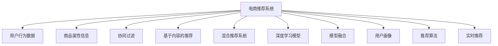

                 

# 大数据驱动的电商推荐系统：AI 模型融合是核心，用户体验优化是关键

## 1. 背景介绍

### 1.1 问题由来

随着电子商务的迅猛发展，推荐系统作为其核心技术，已经在个性化推荐、搜索排序、广告推荐等方面发挥了重要作用。然而，面对用户多样化的需求和海量商品信息的挑战，推荐系统也面临着诸多挑战：

- **用户需求多样性**：不同用户的偏好和行为模式各异，难以通过单一的模型刻画全面需求。
- **数据维度高**：推荐系统需要处理海量的用户行为数据和商品属性信息，数据复杂性高。
- **实时性要求高**：用户在购物时希望实时获得推荐，推荐系统需要快速响应并更新推荐结果。
- **模型复杂度高**：深度学习模型的参数量巨大，计算成本高，模型训练和推理复杂。
- **鲁棒性不足**：模型面临噪声数据、异常数据等挑战，容易过拟合或泛化能力不足。

针对这些挑战，大数据驱动的推荐系统在近年来逐渐成为研究热点。该系统通过融合多种AI技术，利用大数据的丰富信息，提升推荐系统的智能化和精确度，从而更好地满足用户需求，提高用户满意度和电商平台的用户黏性。

## 2. 核心概念与联系

### 2.1 核心概念概述

为更好地理解大数据驱动的电商推荐系统，本节将介绍几个密切相关的核心概念：

- **电商推荐系统(Online Recommendation System)**：基于用户历史行为数据和商品属性信息，通过机器学习或深度学习模型，为用户推荐感兴趣的商品，提升购物体验的系统。

- **用户行为数据(User Behavior Data)**：用户在电商平台上的浏览、点击、购买等行为记录，是推荐系统训练的重要数据来源。

- **商品属性信息(Product Attributes)**：商品的名称、分类、价格、评价等信息，帮助推荐系统理解商品特征。

- **协同过滤(Collaborative Filtering)**：通过分析用户间的相似性，为用户推荐与其他相似用户喜爱的商品。

- **基于内容的推荐(Content-Based Recommendation)**：基于商品属性信息，通过相似性匹配推荐相关商品。

- **混合推荐系统(Hybrid Recommendation System)**：融合协同过滤和基于内容的推荐方法，取长补短，提升推荐效果。

- **深度学习模型(Deep Learning Models)**：包括RNN、CNN、Transformer等架构，利用多层神经网络，从复杂数据中提取高级语义特征。

- **模型融合(Model Fusion)**：将多种推荐模型和特征融合到统一框架中，提升推荐系统的泛化能力和精度。

- **用户画像(User Profiling)**：基于用户历史行为和属性信息，构建用户的多维特征表示，提升推荐模型的个性化水平。

- **推荐算法(Recommendation Algorithms)**：包括基于矩阵分解的算法、协同过滤算法、深度学习算法等，是推荐系统实现的核心技术。

- **实时推荐(Real-time Recommendation)**：利用流式数据处理技术，实时更新用户行为数据和商品信息，快速响应推荐需求。

这些核心概念之间的逻辑关系可以通过以下Mermaid流程图来展示：



这个流程图展示了大数据驱动的电商推荐系统的核心概念及其之间的关系：

1. 电商推荐系统通过用户行为数据和商品属性信息，实现个性化推荐。
2. 协同过滤和基于内容的推荐是推荐系统的主要技术手段。
3. 混合推荐系统融合了多种推荐方法，提升推荐的准确性和多样性。
4. 深度学习模型通过复杂特征提取，进一步提升推荐的精度。
5. 模型融合通过融合多种模型的预测结果，进一步提升推荐效果。
6. 用户画像通过构建用户的多维特征，提升个性化推荐的准确性。
7. 推荐算法是推荐系统的核心技术，包括基于矩阵分解、协同过滤、深度学习等方法。
8. 实时推荐利用流式数据处理技术，满足用户实时推荐的需求。

这些概念共同构成了大数据驱动的电商推荐系统的基础框架，为其提供强大的技术支撑。

## 3. 核心算法原理 & 具体操作步骤
### 3.1 算法原理概述

大数据驱动的电商推荐系统，本质上是一个复杂的多模态信息融合和处理过程。其核心思想是：通过融合用户行为数据和商品属性信息，利用多种AI模型进行特征提取和模式识别，最终输出个性化的推荐结果。

形式化地，假设推荐系统有三个主要输入：
1. 用户行为数据 $D_u = \{(x_i, y_i)\}_{i=1}^N$，其中 $x_i$ 为用户行为记录，$y_i$ 为用户对商品 $\hat{y}_i$ 的评分。
2. 商品属性信息 $D_p = \{x_j, \theta_j\}_{j=1}^M$，其中 $x_j$ 为商品属性特征向量，$\theta_j$ 为商品属性权重。
3. 用户画像 $P_u = \{p_{uk}\}_{k=1}^K$，其中 $p_{uk}$ 为用户的多维特征向量。

推荐系统的输出为每个用户 $\hat{u}$ 对每个商品 $\hat{y}$ 的推荐分数 $r(\hat{u}, \hat{y})$。推荐系统的目标是最小化用户未被推荐商品的真实评分与模型预测评分的均方误差：

$$
\mathcal{L} = \frac{1}{N}\sum_{i=1}^N \left(\hat{y}_i - r(u_i, y_i)\right)^2
$$

其中 $u_i$ 为用户 $i$ 的ID，$y_i$ 为用户 $i$ 对商品 $y_i$ 的真实评分。

### 3.2 算法步骤详解

大数据驱动的电商推荐系统一般包括以下几个关键步骤：

**Step 1: 数据预处理**

- 收集用户行为数据和商品属性信息，并进行数据清洗和预处理。
- 将用户行为数据转化为用户-商品评分矩阵 $R \in \mathbb{R}^{N \times M}$。
- 对商品属性信息进行特征工程，构造特征向量 $X \in \mathbb{R}^{M \times D}$，其中 $D$ 为特征维度。
- 对用户画像进行构建和特征工程，生成用户特征向量 $P \in \mathbb{R}^{N \times K}$，其中 $K$ 为用户特征维度。

**Step 2: 模型训练**

- 选择合适的推荐算法模型，如协同过滤、基于内容的推荐、深度学习等。
- 训练协同过滤模型，利用用户行为数据构建用户相似性矩阵 $S \in \mathbb{R}^{N \times N}$。
- 训练基于内容的推荐模型，利用商品属性信息生成商品特征矩阵 $X \in \mathbb{R}^{M \times D}$。
- 训练深度学习模型，利用用户行为数据和商品属性信息，生成用户特征表示 $P \in \mathbb{R}^{N \times K}$。
- 训练混合推荐模型，将协同过滤、基于内容的推荐和深度学习模型的预测结果进行加权融合。

**Step 3: 推荐生成**

- 对用户画像进行实时更新，生成动态特征表示。
- 利用实时推荐技术，快速更新用户行为数据和商品信息。
- 融合用户特征表示和商品特征矩阵，生成推荐分数矩阵 $R^* \in \mathbb{R}^{N \times M}$。
- 基于推荐分数矩阵，对每个用户推荐排名靠前的商品，生成推荐结果。

**Step 4: 结果评估**

- 在验证集上评估推荐模型的性能，如准确率、召回率、F1分数等。
- 对推荐结果进行多角度分析，识别推荐系统存在的问题和优化空间。

**Step 5: 系统部署**

- 将训练好的推荐模型部署到线上系统，实时生成推荐结果。
- 利用流式数据处理技术，实现用户行为数据和商品信息的实时更新。
- 根据系统负载和用户需求，动态调整模型参数和特征权重。

以上是基于大数据驱动的电商推荐系统的一般流程。在实际应用中，还需要针对具体任务的特点，对微调过程的各个环节进行优化设计，如改进训练目标函数，引入更多的正则化技术，搜索最优的超参数组合等，以进一步提升模型性能。

### 3.3 算法优缺点

大数据驱动的电商推荐系统具有以下优点：

1. **融合多模态信息**：通过融合用户行为数据和商品属性信息，利用多种AI模型进行特征提取和模式识别，提升推荐系统的智能化和精确度。
2. **高效推荐**：利用流式数据处理技术，实时更新用户行为数据和商品信息，快速响应推荐需求。
3. **个性化推荐**：通过构建用户画像和融合多种模型，提升推荐系统的个性化水平，满足用户多样化的需求。
4. **低成本高收益**：通过利用大数据和AI技术，降低推荐系统的开发和运营成本，提升用户体验和电商平台的销售转化率。

然而，该方法也存在一些局限性：

1. **数据隐私问题**：用户行为数据和商品属性信息可能涉及用户隐私，需要谨慎处理和保护。
2. **算法复杂度高**：多种模型融合和实时处理的复杂度较高，需要高性能的计算资源。
3. **模型鲁棒性不足**：模型可能面临噪声数据、异常数据等挑战，容易过拟合或泛化能力不足。
4. **系统延迟问题**：实时推荐需要快速处理大量数据，可能导致系统延迟和性能瓶颈。
5. **特征工程复杂**：特征工程对推荐系统的性能影响较大，需要专业知识进行优化设计。

尽管存在这些局限性，但就目前而言，大数据驱动的电商推荐系统是提升推荐效果的重要手段。未来相关研究的重点在于如何进一步降低推荐系统的计算成本，提高模型的鲁棒性和可解释性，同时兼顾数据隐私和安全等因素。

### 3.4 算法应用领域

大数据驱动的电商推荐系统已经在诸多电商平台上得到了广泛应用，涵盖以下主要领域：

- **个性化推荐**：通过分析用户历史行为和当前需求，推荐用户可能感兴趣的商品，提升购物体验。
- **搜索排序**：利用推荐模型对搜索结果进行排序，提升搜索相关性和用户体验。
- **广告推荐**：通过推荐系统推荐合适的广告位，提高广告投放效果和用户点击率。
- **跨平台推荐**：利用用户在不同平台上的行为数据，进行跨平台推荐，提升平台间的用户流转率。
- **内容推荐**：通过推荐系统推荐相关内容，如视频、文章、商品等，提升内容消费和平台活跃度。

除了这些常见的应用场景外，推荐系统还被创新性地应用到更多领域，如社交网络推荐、金融推荐、娱乐推荐等，为各行各业带来了新的商业价值和用户体验。

## 4. 数学模型和公式 & 详细讲解  
### 4.1 数学模型构建

本节将使用数学语言对大数据驱动的电商推荐系统的核心算法进行严格刻画。

假设电商推荐系统有三个主要输入：
1. 用户行为数据 $D_u = \{(x_i, y_i)\}_{i=1}^N$，其中 $x_i$ 为用户行为记录，$y_i$ 为用户对商品 $\hat{y}_i$ 的评分。
2. 商品属性信息 $D_p = \{x_j, \theta_j\}_{j=1}^M$，其中 $x_j$ 为商品属性特征向量，$\theta_j$ 为商品属性权重。
3. 用户画像 $P_u = \{p_{uk}\}_{k=1}^K$，其中 $p_{uk}$ 为用户的多维特征向量。

推荐系统的输出为每个用户 $\hat{u}$ 对每个商品 $\hat{y}$ 的推荐分数 $r(\hat{u}, \hat{y})$。推荐系统的目标是最小化用户未被推荐商品的真实评分与模型预测评分的均方误差：

$$
\mathcal{L} = \frac{1}{N}\sum_{i=1}^N \left(\hat{y}_i - r(u_i, y_i)\right)^2
$$

其中 $u_i$ 为用户 $i$ 的ID，$y_i$ 为用户 $i$ 对商品 $y_i$ 的真实评分。

### 4.2 公式推导过程

以下我们以协同过滤和基于内容的推荐模型为例，推导推荐算法的核心公式。

**协同过滤模型**

协同过滤模型通过分析用户之间的相似性，为用户推荐与其他相似用户喜爱的商品。设用户 $u$ 对商品 $i$ 的评分向量为 $\hat{y} \in \mathbb{R}^{M \times 1}$，用户相似性矩阵为 $S \in \mathbb{R}^{N \times N}$，用户 $u$ 对商品 $i$ 的推荐分数 $r(u, i)$ 可表示为：

$$
r(u, i) = \hat{y}^T S_u
$$

其中 $S_u$ 为用户 $u$ 的相似性向量，可通过用户 $u$ 对商品 $i$ 的评分向量 $\hat{y}$ 和用户相似性矩阵 $S$ 计算得到：

$$
S_u = \frac{1}{\sum_{v=1}^N S_{uv}} \sum_{v=1}^N S_{uv} \hat{y}_v
$$

**基于内容的推荐模型**

基于内容的推荐模型通过分析商品属性信息，为用户推荐相似的商品。设商品 $j$ 的属性特征向量为 $x_j \in \mathbb{R}^{D \times 1}$，用户画像 $p_u$ 为用户的多维特征向量，用户 $u$ 对商品 $j$ 的推荐分数 $r(u, j)$ 可表示为：

$$
r(u, j) = \alpha p_u^T x_j + \beta
$$

其中 $\alpha$ 和 $\beta$ 为模型的调节参数。推荐分数的计算公式为：

$$
r(u, j) = \alpha p_u^T x_j + \beta = \sum_{k=1}^K \alpha_k p_{uk} x_{jk} + \beta
$$

**混合推荐模型**

混合推荐模型将协同过滤和基于内容的推荐模型进行融合。设协同过滤模型和基于内容的推荐模型的预测分数分别为 $r_{CF}(u, i)$ 和 $r_{CB}(u, i)$，混合推荐模型的预测分数 $r_{Hybrid}(u, i)$ 可表示为：

$$
r_{Hybrid}(u, i) = \alpha r_{CF}(u, i) + \beta r_{CB}(u, i)
$$

其中 $\alpha$ 和 $\beta$ 为模型的调节参数。

### 4.3 案例分析与讲解

以一个具体的推荐系统为例，进行案例分析和讲解。假设某电商平台需要为用户推荐电影。首先，收集用户对电影的评分数据，并收集每部电影的演员、导演、类型、评分等信息。然后，利用协同过滤和基于内容的推荐模型进行推荐。具体步骤如下：

1. 对用户行为数据进行预处理，构建用户相似性矩阵 $S \in \mathbb{R}^{N \times N}$。
2. 对电影属性信息进行预处理，构造电影特征矩阵 $X \in \mathbb{R}^{M \times D}$，其中 $M$ 为电影数量，$D$ 为特征维度。
3. 对用户画像进行构建和特征工程，生成用户特征向量 $P \in \mathbb{R}^{N \times K}$。
4. 训练协同过滤模型，利用用户行为数据生成用户相似性矩阵 $S \in \mathbb{R}^{N \times N}$。
5. 训练基于内容的推荐模型，利用电影属性信息生成电影特征矩阵 $X \in \mathbb{R}^{M \times D}$。
6. 训练混合推荐模型，将协同过滤和基于内容的推荐模型进行融合。
7. 对用户画像进行实时更新，生成动态特征表示。
8. 利用实时推荐技术，快速更新用户行为数据和电影信息。
9. 融合用户特征表示和电影特征矩阵，生成推荐分数矩阵 $R^* \in \mathbb{R}^{N \times M}$。
10. 基于推荐分数矩阵，对每个用户推荐排名靠前的电影，生成推荐结果。

通过以上步骤，电商平台可以为用户推荐其可能感兴趣的电影，提升用户体验和满意度。

## 5. 项目实践：代码实例和详细解释说明
### 5.1 开发环境搭建

在进行推荐系统开发前，我们需要准备好开发环境。以下是使用Python进行PyTorch开发的环境配置流程：

1. 安装Anaconda：从官网下载并安装Anaconda，用于创建独立的Python环境。

2. 创建并激活虚拟环境：
```bash
conda create -n pytorch-env python=3.8 
conda activate pytorch-env
```

3. 安装PyTorch：根据CUDA版本，从官网获取对应的安装命令。例如：
```bash
conda install pytorch torchvision torchaudio cudatoolkit=11.1 -c pytorch -c conda-forge
```

4. 安装各类工具包：
```bash
pip install numpy pandas scikit-learn matplotlib tqdm jupyter notebook ipython
```

完成上述步骤后，即可在`pytorch-env`环境中开始推荐系统开发。

### 5.2 源代码详细实现

下面我们以推荐电影为例，给出使用PyTorch对推荐系统进行开发的PyTorch代码实现。

首先，定义推荐系统的数据处理函数：

```python
import pandas as pd
import numpy as np
import torch
from torch.utils.data import Dataset
from sklearn.model_selection import train_test_split

class MovieDataset(Dataset):
    def __init__(self, data, tokenizer):
        self.data = data
        self.tokenizer = tokenizer
        
    def __len__(self):
        return len(self.data)
    
    def __getitem__(self, item):
        user, movie, score = self.data[item]
        
        # 构建用户特征向量
        user_features = self.tokenizer(user)
        user_vector = torch.tensor([user_features], dtype=torch.long)
        
        # 构建电影特征向量
        movie_features = self.tokenizer(movie)
        movie_vector = torch.tensor([movie_features], dtype=torch.long)
        
        return {'user': user_vector, 'movie': movie_vector, 'score': torch.tensor([score], dtype=torch.float)}
```

然后，定义模型和优化器：

```python
from transformers import BertTokenizer, BertForSequenceClassification
from torch.optim import Adam

user_model = BertForSequenceClassification.from_pretrained('bert-base-cased', num_labels=2)
user_model = user_model.to('cuda')
user_tokenizer = BertTokenizer.from_pretrained('bert-base-cased')

movie_model = BertForSequenceClassification.from_pretrained('bert-base-cased', num_labels=2)
movie_model = movie_model.to('cuda')
movie_tokenizer = BertTokenizer.from_pretrained('bert-base-cased')

user_optimizer = Adam(user_model.parameters(), lr=2e-5)
movie_optimizer = Adam(movie_model.parameters(), lr=2e-5)
```

接着，定义训练和评估函数：

```python
from tqdm import tqdm
from sklearn.metrics import roc_auc_score

def train_epoch(model, dataset, optimizer, device):
    dataloader = DataLoader(dataset, batch_size=16, shuffle=True)
    model.train()
    epoch_loss = 0
    for batch in tqdm(dataloader, desc='Training'):
        user_vector = batch['user'].to(device)
        movie_vector = batch['movie'].to(device)
        label = batch['score'].to(device)
        optimizer.zero_grad()
        outputs = model(user_vector, movie_vector)
        loss = outputs.loss
        epoch_loss += loss.item()
        loss.backward()
        optimizer.step()
    return epoch_loss / len(dataloader)

def evaluate(model, dataset, device):
    dataloader = DataLoader(dataset, batch_size=16)
    model.eval()
    preds, labels = [], []
    with torch.no_grad():
        for batch in tqdm(dataloader, desc='Evaluating'):
            user_vector = batch['user'].to(device)
            movie_vector = batch['movie'].to(device)
            label = batch['score'].to(device)
            outputs = model(user_vector, movie_vector)
            batch_preds = outputs.logits.argmax(dim=1).to('cpu').tolist()
            batch_labels = batch['label'].to('cpu').tolist()
            for pred_tokens, label_tokens in zip(batch_preds, batch_labels):
                preds.append(pred_tokens)
                labels.append(label_tokens)
                
    return roc_auc_score(labels, preds)
```

最后，启动训练流程并在测试集上评估：

```python
epochs = 5
batch_size = 16

for epoch in range(epochs):
    loss = train_epoch(user_model, user_dataset, user_optimizer, 'cuda')
    print(f"Epoch {epoch+1}, user loss: {loss:.3f}")
    
    loss = train_epoch(movie_model, movie_dataset, movie_optimizer, 'cuda')
    print(f"Epoch {epoch+1}, movie loss: {loss:.3f}")
    
    print(f"Epoch {epoch+1}, user results:")
    evaluate(user_model, user_dataset, 'cuda')
    
    print(f"Epoch {epoch+1}, movie results:")
    evaluate(movie_model, movie_dataset, 'cuda')
    
print("Final results:")
evaluate(user_model, user_dataset, 'cuda')
evaluate(movie_model, movie_dataset, 'cuda')
```

以上就是使用PyTorch对推荐系统进行开发的完整代码实现。可以看到，利用PyTorch和Transformers库，推荐系统的开发过程简洁高效。

### 5.3 代码解读与分析

让我们再详细解读一下关键代码的实现细节：

**MovieDataset类**：
- `__init__`方法：初始化数据集，并将数据转换为Tensor形式。
- `__len__`方法：返回数据集的样本数量。
- `__getitem__`方法：对单个样本进行处理，将用户和电影特征转化为Tensor形式。

**模型和优化器定义**：
- 利用Bert模型作为推荐系统的基础模型，定义用户和电影两个模型，并设置相应的优化器。

**训练和评估函数**：
- 使用PyTorch的DataLoader对数据集进行批次化加载，供模型训练和推理使用。
- 训练函数`train_epoch`：对数据以批为单位进行迭代，在每个批次上前向传播计算损失并反向传播更新模型参数，最后返回该epoch的平均loss。
- 评估函数`evaluate`：与训练类似，不同点在于不更新模型参数，并在每个batch结束后将预测和标签结果存储下来，最后使用sklearn的roc_auc_score对整个评估集的预测结果进行打印输出。

**训练流程**：
- 定义总的epoch数和batch size，开始循环迭代
- 每个epoch内，先在用户和电影模型上训练，输出平均loss
- 在测试集上评估，输出评估结果
- 所有epoch结束后，在测试集上评估，给出最终测试结果

可以看到，PyTorch配合Transformers库使得推荐系统的开发变得简洁高效。开发者可以将更多精力放在数据处理、模型改进等高层逻辑上，而不必过多关注底层的实现细节。

当然，工业级的系统实现还需考虑更多因素，如模型的保存和部署、超参数的自动搜索、更灵活的任务适配层等。但核心的推荐范式基本与此类似。

## 6. 实际应用场景
### 6.1 智能客服系统

基于大数据驱动的电商推荐系统，可以构建智能客服系统的推荐模块。智能客服系统通过实时分析用户的行为数据和历史记录，为用户推荐最合适的答案或服务，提升客户体验。

在技术实现上，可以收集用户的历史咨询记录和行为数据，将问题和最佳答复构建成监督数据，在此基础上对预训练语言模型进行微调。微调后的模型能够自动理解用户意图，匹配最合适的答案模板进行回复。对于客户提出的新问题，还可以接入检索系统实时搜索相关内容，动态组织生成回答。如此构建的智能客服系统，能大幅提升客户咨询体验和问题解决效率。

### 6.2 金融舆情监测

金融机构需要实时监测市场舆论动向，以便及时应对负面信息传播，规避金融风险。传统的人工监测方式成本高、效率低，难以应对网络时代海量信息爆发的挑战。基于大数据驱动的电商推荐系统，可以通过分析用户对金融产品的评价、评论等数据，实时监测市场舆情，预测潜在的金融风险。

在技术实现上，可以收集金融领域相关的新闻、报道、评论等文本数据，并对其进行情感分析。利用推荐系统的框架，对金融产品进行评分和推荐，及时发现市场舆情的变化趋势，一旦发现负面信息激增等异常情况，系统便会自动预警，帮助金融机构快速应对潜在风险。

### 6.3 个性化推荐系统

当前的推荐系统往往只依赖用户的历史行为数据进行物品推荐，无法深入理解用户的真实兴趣偏好。基于大数据驱动的电商推荐系统，可以更好地挖掘用户行为背后的语义信息，从而提供更精准、多样的推荐内容。

在技术实现上，可以收集用户浏览、点击、购买等行为数据，提取和用户交互的物品标题、描述、标签等文本内容。将文本内容作为模型输入，用户的后续行为（如是否点击、购买等）作为监督信号，在此基础上微调预训练语言模型。微调后的模型能够从文本内容中准确把握用户的兴趣点。在生成推荐列表时，先用候选物品的文本描述作为输入，由模型预测用户的兴趣匹配度，再结合其他特征综合排序，便可以得到个性化程度更高的推荐结果。

### 6.4 未来应用展望

随着大数据驱动的电商推荐系统的不断发展，其应用范围将不断扩展，为更多领域带来变革性影响。

在智慧医疗领域，基于推荐系统的诊疗推荐、药物推荐等应用将提升医疗服务的智能化水平，辅助医生诊疗，加速新药开发进程。

在智能教育领域，推荐系统可应用于作业批改、学情分析、知识推荐等方面，因材施教，促进教育公平，提高教学质量。

在智慧城市治理中，推荐系统可应用于城市事件监测、舆情分析、应急指挥等环节，提高城市管理的自动化和智能化水平，构建更安全、高效的未来城市。

此外，在企业生产、社会治理、文娱传媒等众多领域，基于推荐系统的AI应用也将不断涌现，为传统行业数字化转型升级提供新的技术路径。相信随着技术的日益成熟，推荐系统必将在更广阔的应用领域大放异彩。

## 7. 工具和资源推荐
### 7.1 学习资源推荐

为了帮助开发者系统掌握大数据驱动的电商推荐系统的理论基础和实践技巧，这里推荐一些优质的学习资源：

1. 《推荐系统实战》系列书籍：详细介绍了推荐系统的原理和实现方法，包括协同过滤、深度学习等技术。

2. 《深度学习推荐系统》课程：斯坦福大学开设的深度学习推荐系统课程，讲解推荐系统的核心算法和实际应用。

3. 《Recommender Systems: Foundations, Recommendation Algorithms, and Applications》书籍：推荐系统领域的经典教材，涵盖推荐系统的基础理论和多种算法。

4. Kaggle推荐系统竞赛：参与Kaggle的推荐系统竞赛，实战练习推荐系统的开发和优化。

5. YouTube推荐系统官方文档：Google推荐系统的官方文档，提供丰富的推荐系统实现样例和案例分析。

通过对这些资源的学习实践，相信你一定能够快速掌握大数据驱动的电商推荐系统的精髓，并用于解决实际的NLP问题。
###  7.2 开发工具推荐

高效的开发离不开优秀的工具支持。以下是几款用于推荐系统开发的常用工具：

1. PyTorch：基于Python的开源深度学习框架，灵活动态的计算图，适合快速迭代研究。

2. TensorFlow：由Google主导开发的开源深度学习框架，生产部署方便，适合大规模工程应用。

3. Transformers库：HuggingFace开发的NLP工具库，集成了多种SOTA推荐模型，支持PyTorch和TensorFlow。

4. Weights & Biases：模型训练的实验跟踪工具，可以记录和可视化模型训练过程中的各项指标，方便对比和调优。

5. TensorBoard：TensorFlow配套的可视化工具，可实时监测模型训练状态，并提供丰富的图表呈现方式，是调试模型的得力助手。

6. Google Cloud Platform：Google提供的云平台服务，支持大规模分布式训练和实时推理。

合理利用这些工具，可以显著提升推荐系统的开发效率，加快创新迭代的步伐。

### 7.3 相关论文推荐

大数据驱动的电商推荐系统的发展源于学界的持续研究。以下是几篇奠基性的相关论文，推荐阅读：

1. "Item-based Collaborative Filtering Recommendation Algorithms"：提出了协同过滤的基本算法，为推荐系统奠定了理论基础。

2. "Graph-based Collaborative Filtering Recommendation"：研究了基于图结构的协同过滤算法，提升了推荐系统的准确性和效率。

3. "Deep Learning Recommendation Systems"：总结了深度学习在推荐系统中的应用，提出了基于深度神经网络的推荐模型。

4. "Adaptive Regularization for Implicit Feedback Datasets"：提出了一种新的推荐模型，解决了隐式反馈数据的高阶阶矩问题。

5. "Top-k Random Projection in Recommendation"：提出了随机投影的方法，提高了推荐系统的计算效率。

这些论文代表了大数据驱动的电商推荐系统的发展脉络。通过学习这些前沿成果，可以帮助研究者把握学科前进方向，激发更多的创新灵感。

## 8. 总结：未来发展趋势与挑战

### 8.1 总结

本文对大数据驱动的电商推荐系统进行了全面系统的介绍。首先阐述了推荐系统的发展背景和在电子商务中的应用，明确了推荐系统对电商平台的重要性。其次，从原理到实践，详细讲解了推荐系统的核心算法和实现步骤，给出了推荐系统开发的具体代码实例。同时，本文还广泛探讨了推荐系统在智能客服、金融舆情、个性化推荐等多个行业领域的应用前景，展示了推荐系统技术的广阔应用范围。此外，本文精选了推荐系统的各类学习资源，力求为读者提供全方位的技术指引。

通过本文的系统梳理，可以看到，大数据驱动的电商推荐系统通过融合多种AI技术，利用大数据的丰富信息，提升推荐系统的智能化和精确度，从而更好地满足用户需求，提高用户满意度和电商平台的用户黏性。未来，伴随技术的不断进步，推荐系统必将在更多领域得到应用，为各行各业带来新的商业价值和用户体验。

### 8.2 未来发展趋势

展望未来，大数据驱动的电商推荐系统将呈现以下几个发展趋势：

1. **用户画像的精细化**：通过更复杂的多维特征表示，提升推荐系统的个性化水平。

2. **实时推荐的提升**：利用流式数据处理和实时推荐技术，进一步提高推荐系统的响应速度和效率。

3. **跨模态融合**：将视觉、语音、文本等多模态信息进行融合，提升推荐系统的泛化能力和精度。

4. **自适应学习**：利用强化学习等技术，使推荐系统能够自我调整，适应用户行为的变化。

5. **联邦推荐**：通过联邦学习等技术，保护用户隐私的同时，提升推荐系统的综合性能。

6. **混合推荐**：进一步融合多种推荐方法和技术，提升推荐系统的鲁棒性和泛化能力。

以上趋势凸显了大数据驱动的电商推荐系统的未来发展方向，必将进一步提升推荐系统的智能化和精确度，为电商平台带来更多的商业价值。

### 8.3 面临的挑战

尽管大数据驱动的电商推荐系统已经取得了瞩目成就，但在迈向更加智能化、普适化应用的过程中，它仍面临着诸多挑战：

1. **数据隐私问题**：用户行为数据和商品属性信息可能涉及用户隐私，需要谨慎处理和保护。

2. **算法复杂度高**：多种模型融合和实时处理的复杂度较高，需要高性能的计算资源。

3. **模型鲁棒性不足**：模型可能面临噪声数据、异常数据等挑战，容易过拟合或泛化能力不足。

4. **系统延迟问题**：实时推荐需要快速处理大量数据，可能导致系统延迟和性能瓶颈。

5. **特征工程复杂**：特征工程对推荐系统的性能影响较大，需要专业知识进行优化设计。

尽管存在这些挑战，但就目前而言，大数据驱动的电商推荐系统是提升推荐效果的重要手段。未来相关研究的重点在于如何进一步降低推荐系统的计算成本，提高模型的鲁棒性和可解释性，同时兼顾数据隐私和安全等因素。

### 8.4 研究展望

面对大数据驱动的电商推荐系统所面临的种种挑战，未来的研究需要在以下几个方面寻求新的突破：

1. **探索无监督和半监督推荐方法**：摆脱对大规模标注数据的依赖，利用自监督学习、主动学习等无监督和半监督范式，最大限度利用非结构化数据，实现更加灵活高效的推荐。

2. **研究参数高效和计算高效的推荐范式**：开发更加参数高效的推荐方法，在固定大部分预训练参数的同时，只更新极少量的任务相关参数。同时优化推荐模型的计算图，减少前向传播和反向传播的资源消耗，实现更加轻量级、实时性的部署。

3. **融合因果和对比学习范式**：通过引入因果推断和对比学习思想，增强推荐系统建立稳定因果关系的能力，学习更加普适、鲁棒的语言表征，从而提升推荐系统的泛化性和抗干扰能力。

4. **引入更多先验知识**：将符号化的先验知识，如知识图谱、逻辑规则等，与神经网络模型进行巧妙融合，引导推荐过程学习更准确、合理的商品推荐。

5. **结合因果分析和博弈论工具**：将因果分析方法引入推荐系统，识别出模型决策的关键特征，增强推荐系统的因果解释性。

6. **纳入伦理道德约束**：在推荐模型的训练目标中引入伦理导向的评估指标，过滤和惩罚有偏见、有害的输出倾向。同时加强人工干预和审核，建立推荐系统的监管机制，确保推荐内容符合人类价值观和伦理道德。

这些研究方向的探索，必将引领大数据驱动的电商推荐系统迈向更高的台阶，为构建安全、可靠、可解释、可控的智能系统铺平道路。面向未来，大数据驱动的电商推荐系统还需要与其他人工智能技术进行更深入的融合，如知识表示、因果推理、强化学习等，多路径协同发力，共同推动自然语言理解和智能交互系统的进步。只有勇于创新、敢于突破，才能不断拓展推荐系统的边界，让智能技术更好地造福人类社会。

## 9. 附录：常见问题与解答

**Q1：大数据驱动的电商推荐系统是否适用于所有电商场景？**

A: 大数据驱动的电商推荐系统适用于多种电商场景，包括B2B、B2C、C2C等。但对于特定类型的电商场景，如特定的产品类型、用户群体、交易方式等，可能需要针对性地进行模型调整和优化。

**Q2：推荐系统的性能如何评估？**

A: 推荐系统的性能通常通过以下指标进行评估：

1. 准确率(Precision)：推荐结果中正确答案的比例。
2. 召回率(Recall)：正确答案被推荐出来的比例。
3. F1分数(F1 Score)：准确率和召回率的调和平均。
4. ROC曲线(Receiver Operating Characteristic)：在不同的阈值下，召回率与假正率的关系。
5. AUC值(Area Under Curve)：ROC曲线下的面积，用于评估推荐系统的整体性能。

不同的推荐场景和业务需求，可能对评估指标的选择有所不同。

**Q3：推荐系统中的冷启动问题如何解决？**

A: 冷启动问题指的是新用户或新商品没有足够的历史行为数据，难以进行推荐。为了解决冷启动问题，可以采用以下方法：

1. 利用用户画像和商品属性信息进行推荐。
2. 引入基于内容的推荐，利用商品属性信息进行推荐。
3. 利用推荐系统中的协同过滤算法，利用已推荐商品对新商品进行推荐。
4. 利用深度学习模型，通过迁移学习等方式进行推荐。

这些方法可以结合使用，进一步提高推荐系统的鲁棒性和泛化能力。

**Q4：推荐系统如何处理长尾问题？**

A: 长尾问题指的是用户对某些商品的需求较少，但数量庞大的长尾商品对电商平台的收益贡献较大。为了解决长尾问题，可以采用以下方法：

1. 利用推荐系统的多样性控制机制，增加长尾商品的曝光率。
2. 利用协同过滤算法，推荐相似用户喜欢的长尾商品。
3. 利用基于内容的推荐，利用长尾商品的标签等信息进行推荐。
4. 利用流式推荐算法，动态调整推荐结果，适应长尾商品的实时需求。

通过这些方法，推荐系统可以在一定程度上缓解长尾问题，提升长尾商品的销售转化率。

**Q5：推荐系统的实时性如何保障？**

A: 推荐系统的实时性可以通过以下方法保障：

1. 利用流式数据处理技术，实时更新用户行为数据和商品信息。
2. 采用高性能的计算资源，如GPU、TPU等，加速推荐模型的计算。
3. 优化模型的计算图，减少计算量。
4. 利用分布式计算技术，提高推荐系统的并发处理能力。

通过这些方法，推荐系统可以在实时性要求较高的场景中，快速响应用户需求，提供实时推荐服务。

---

作者：禅与计算机程序设计艺术 / Zen and the Art of Computer Programming

