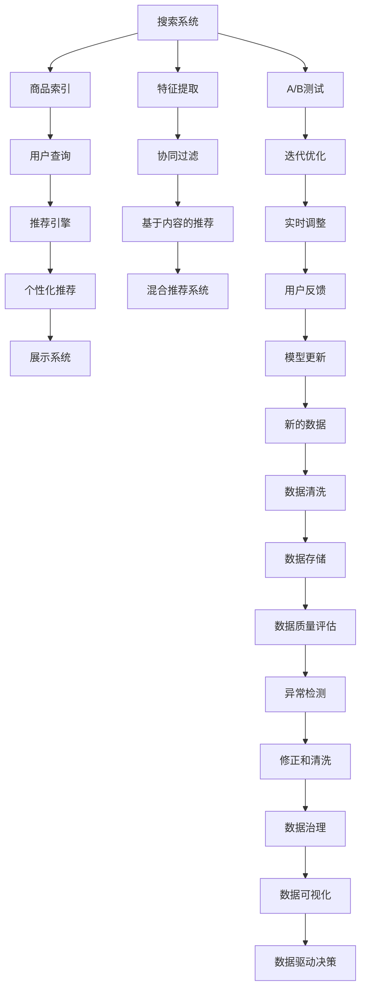

                 

# 大数据驱动的电商搜索推荐系统：AI 模型融合是核心，数据质量是关键

## 1. 背景介绍

随着电商市场的持续扩大和竞争加剧，用户搜索与推荐系统的技术成为电商企业的核心竞争力之一。良好的搜索与推荐体验不仅能提升用户满意度，还能有效提高转化率、提升销售额。通过使用人工智能技术，电商搜索推荐系统可以分析用户历史行为、实时点击流、评论、反馈等多维度数据，进行精准的个性化推荐。本文将从搜索与推荐系统的核心算法、数据处理、模型融合以及实践应用等方面深入探讨，阐述如何构建高效、稳定、个性化的电商搜索推荐系统。

## 2. 核心概念与联系

### 2.1 核心概念概述

#### 2.1.1 搜索推荐系统
搜索推荐系统（Search & Recommendation System）通常分为两大类：
- 搜索系统：根据用户输入的关键词或搜索历史，展示最相关的产品。
- 推荐系统：预测用户可能感兴趣的产品，并在用户浏览或购买过程中实时推荐。

#### 2.1.2 协同过滤
协同过滤（Collaborative Filtering, CF）是一种基于用户兴趣相似性的推荐算法。其核心思想是：通过分析用户和商品之间的相似性，预测用户可能感兴趣的商品。

#### 2.1.3 基于内容的推荐
基于内容的推荐（Content-based Recommendation, CB）算法根据商品的属性特征进行推荐。该算法假设相似属性会带来相似的用户体验。

#### 2.1.4 混合推荐系统
混合推荐系统（Hybrid Recommendation System）结合了协同过滤和基于内容的推荐，融合多模态数据，提供更加全面和准确的推荐。

#### 2.1.5 AI 模型融合
AI 模型融合（AI Model Fusion）是指将多个 AI 模型、特征工程和业务逻辑结合起来，构建一个更强大、更智能的搜索推荐系统。通过融合多个模型的优势，可以提升推荐精准度、提高系统稳定性、增强用户体验。

#### 2.1.6 数据质量
数据质量（Data Quality）指数据的完整性、准确性和一致性，是构建高效搜索推荐系统的基础。数据质量直接影响了推荐算法的效果，低质量的数据会导致推荐结果偏差、效果不佳。

### 2.2 核心概念原理和架构的 Mermaid 流程图



## 3. 核心算法原理 & 具体操作步骤

### 3.1 算法原理概述

#### 3.1.1 基于协同过滤的推荐
协同过滤算法主要分为两类：基于用户的协同过滤和基于物品的协同过滤。

- 基于用户的协同过滤：通过分析用户之间的相似性，推荐给用户兴趣相似的其他用户喜欢的商品。
- 基于物品的协同过滤：通过分析商品之间的相似性，推荐给用户可能喜欢的相似商品。

协同过滤算法的优点在于无需显式地将用户-商品关系映射到特征空间中，直接基于用户行为数据进行推荐。缺点在于对新用户的冷启动问题难以解决，且容易受到数据稀疏性的影响。

#### 3.1.2 基于内容的推荐
基于内容的推荐算法通常使用 TF-IDF、SVM 等方法。其核心思想是：根据商品的特征（如品牌、价格、描述等），使用特征匹配来推荐相关商品。该算法优点在于不需要用户历史行为数据，对新用户有较好的推荐效果。缺点在于特征工程复杂，且对商品特征信息的获取需要大量的人力投入。

#### 3.1.3 混合推荐系统
混合推荐系统融合了协同过滤和基于内容的推荐算法。常见的混合算法包括基于加权的混合推荐、基于元学习的混合推荐等。其核心思想是：通过融合两种推荐算法的优势，提升推荐效果。

### 3.2 算法步骤详解

#### 3.2.1 数据收集与预处理
搜索推荐系统需要收集用户历史行为数据、商品属性特征数据、实时点击流数据、评论数据等，并进行数据清洗和预处理。数据预处理包括缺失值处理、异常值检测、数据格式转换等。

#### 3.2.2 特征提取与选择
特征提取是推荐系统的基础。常见的特征提取方法包括基于用户的特征、基于物品的特征和基于上下文的特征。特征选择则需要使用特征选择算法，如卡方检验、信息增益等，选择对推荐效果影响最大的特征。

#### 3.2.3 模型训练与融合
模型训练是推荐系统的核心。需要选择合适的推荐算法，并进行模型训练。常见的推荐算法包括协同过滤算法、基于内容的推荐算法和混合推荐算法。模型融合则是将多个模型的输出进行加权平均、投票等处理，形成最终推荐结果。

#### 3.2.4 实时推荐与调整
实时推荐是搜索推荐系统的关键。需要构建高效的推荐引擎，实时处理用户的搜索与浏览行为，动态生成推荐结果。推荐系统需要具备高效的计算能力和数据处理能力，确保实时性。

### 3.3 算法优缺点

#### 3.3.1 优点
- 可以充分挖掘用户行为数据，提供精准的个性化推荐。
- 算法效果稳定，能够应对大规模数据量。
- 能够实时处理用户行为数据，提高用户体验。

#### 3.3.2 缺点
- 对新用户的冷启动问题难以解决。
- 对数据质量要求较高，低质量的数据会导致推荐效果偏差。
- 模型复杂度高，训练与推理速度较慢。

### 3.4 算法应用领域

#### 3.4.1 电商搜索推荐
电商搜索推荐系统是推荐算法的典型应用场景。通过分析用户历史行为数据和实时点击流数据，为每个用户推荐可能感兴趣的商品。

#### 3.4.2 金融理财推荐
金融理财推荐系统通过分析用户的历史交易记录和理财偏好，推荐合适的理财产品和投资组合，提升用户理财体验。

#### 3.4.3 在线视频推荐
在线视频推荐系统通过分析用户的历史观看记录和实时行为数据，推荐用户可能感兴趣的视频内容，提升用户体验。

#### 3.4.4 旅游出行推荐
旅游出行推荐系统通过分析用户的旅游偏好、历史行程和实时搜索数据，推荐个性化的旅游目的地和行程规划，提升用户旅行体验。

## 4. 数学模型和公式 & 详细讲解 & 举例说明

### 4.1 数学模型构建

#### 4.1.1 协同过滤推荐模型的数学模型
协同过滤算法通常使用矩阵分解技术，将用户-商品矩阵分解为两个低秩矩阵 $U$ 和 $V$。设 $R$ 为用户-商品评分矩阵，$U$ 为用户特征矩阵，$V$ 为商品特征矩阵。则协同过滤的矩阵分解模型为：

$$
R = UV^T
$$

#### 4.1.2 基于内容的推荐模型的数学模型
基于内容的推荐算法通常使用 TF-IDF 或 SVM 方法。假设商品属性特征矩阵为 $X$，用户属性特征矩阵为 $Y$。则基于内容的推荐模型为：

$$
\hat{Y} = \alpha X^T + \beta Y
$$

其中，$\alpha$ 和 $\beta$ 为系数。

### 4.2 公式推导过程

#### 4.2.1 协同过滤推荐模型的公式推导
设用户-商品评分矩阵为 $R$，用户特征矩阵为 $U$，商品特征矩阵为 $V$。协同过滤的矩阵分解模型为：

$$
R = UV^T
$$

通过对矩阵 $R$ 进行奇异值分解，可以得到 $U$ 和 $V$ 的低秩近似。然后，通过计算 $U$ 和 $V$ 的矩阵乘积，得到用户对每个商品的评分预测值。

#### 4.2.2 基于内容的推荐模型的公式推导
基于内容的推荐算法通常使用 TF-IDF 或 SVM 方法。假设商品属性特征矩阵为 $X$，用户属性特征矩阵为 $Y$。基于内容的推荐模型为：

$$
\hat{Y} = \alpha X^T + \beta Y
$$

其中，$\alpha$ 和 $\beta$ 为系数。通过对 $X$ 和 $Y$ 进行特征提取，可以计算出 $\alpha$ 和 $\beta$ 的值，然后通过计算 $X$ 和 $Y$ 的线性组合，得到用户对每个商品的评分预测值。

### 4.3 案例分析与讲解

#### 4.3.1 协同过滤推荐算法案例
假设有一个电商平台，收集了用户对商品的评分数据。使用协同过滤算法，将评分数据矩阵分解为两个低秩矩阵 $U$ 和 $V$。然后，对于每个用户 $u$ 和每个商品 $i$，计算预测评分 $\hat{r}_{ui}$：

$$
\hat{r}_{ui} = \sum_k U_{uk} V_{ki}
$$

其中，$U_{uk}$ 和 $V_{ki}$ 分别为用户 $u$ 和商品 $i$ 的特征向量。最后，根据预测评分进行推荐。

#### 4.3.2 基于内容的推荐算法案例
假设有一个在线视频平台，收集了用户对视频的评分数据。使用基于内容的推荐算法，将视频属性特征矩阵 $X$ 和用户属性特征矩阵 $Y$ 进行线性组合，得到预测评分 $\hat{r}_{ui}$：

$$
\hat{r}_{ui} = \alpha X^T_i + \beta Y_u
$$

其中，$X^T_i$ 和 $Y_u$ 分别为商品 $i$ 和用户 $u$ 的特征向量。最后，根据预测评分进行推荐。

## 5. 项目实践：代码实例和详细解释说明

### 5.1 开发环境搭建

#### 5.1.1 系统架构
一个典型的电商搜索推荐系统包括多个组件，如图 1 所示：

```
    +------------------+    +------------------+    +------------------+
    |   搜索系统      |    |   推荐引擎      |    |   展示系统      |
    |     (Elastic)    |    |     (Nginx)      |    |     (Vue)       |
    |     (Search)     |    |     (FastAPI)    |    |     (Javascript)|
    +------------------+    +------------------+    +------------------+

    |  特征提取       |
    |     (Python)     |
    |     (Tfidf)      |
    +------------------+

    |   数据存储       |
    |     (MySQL)      |
    +------------------+

    |   模型训练       |
    |     (Spark)      |
    +------------------+
```

#### 5.1.2 技术栈

1. **搜索系统**：使用 Elasticsearch 进行构建，提供高效的搜索能力。
2. **推荐引擎**：使用 FastAPI 进行构建，提供高效的推荐能力。
3. **展示系统**：使用 Vue 进行构建，提供友好的展示界面。
4. **特征提取**：使用 Python 的 Tfidf 进行构建，提取商品属性特征。
5. **数据存储**：使用 MySQL 进行构建，存储用户历史行为数据和商品属性数据。
6. **模型训练**：使用 Apache Spark 进行构建，提供分布式计算能力，进行模型训练和特征工程。

### 5.2 源代码详细实现

#### 5.2.1 数据处理模块

```python
import pandas as pd

def load_data(file_path):
    data = pd.read_csv(file_path)
    return data

def clean_data(data):
    data = data.dropna()  # 删除缺失值
    data = data.drop_duplicates()  # 删除重复记录
    return data

def feature_extraction(data):
    # 提取商品属性特征
    X = data[['brand', 'price', 'size']]
    # 提取用户属性特征
    Y = data[['age', 'gender', 'location']]
    return X, Y

def split_data(data):
    train_data = data.sample(frac=0.8, random_state=42)
    test_data = data.drop(train_data.index)
    return train_data, test_data

def save_data(data, file_path):
    data.to_csv(file_path, index=False)

# 测试数据处理模块
if __name__ == '__main__':
    file_path = 'data.csv'
    data = load_data(file_path)
    clean_data = clean_data(data)
    X, Y = feature_extraction(clean_data)
    train_data, test_data = split_data(clean_data)
    save_data(train_data, 'train_data.csv')
    save_data(test_data, 'test_data.csv')
```

#### 5.2.2 推荐模型模块

```python
import numpy as np
from sklearn.decomposition import TruncatedSVD

class CollaborativeFiltering:
    def __init__(self, n_components):
        self.model = TruncatedSVD(n_components=n_components)
    
    def train(self, X, Y):
        self.model.fit(X, Y)
    
    def predict(self, X, Y):
        U = self.model.components_
        V = self.model.components_
        R_hat = np.dot(U, V.T)
        return R_hat
    
    def predict_user_item(self, user_id, item_id):
        U = self.model.components_
        V = self.model.components_
        user_item = U[user_id]
        item_vector = V[item_id]
        r_hat = np.dot(user_item, item_vector)
        return r_hat
```

#### 5.2.3 模型融合模块

```python
class HybridRecommendation:
    def __init__(self, collaborative_model, content_model):
        self.collaborative_model = collaborative_model
        self.content_model = content_model
    
    def predict(self, X, Y):
        R_hat_cf = self.collaborative_model.predict(X, Y)
        R_hat_cb = self.content_model.predict(X, Y)
        R_hat = 0.5 * R_hat_cf + 0.5 * R_hat_cb
        return R_hat
```

#### 5.2.4 实时推荐模块

```python
import time

class RealTimeRecommendation:
    def __init__(self, hybrid_recommender):
        self.hybrid_recommender = hybrid_recommender
    
    def recommend(self, user_id):
        # 实时获取用户行为数据
        user_browsing_data = self.get_user_browsing_data(user_id)
        
        # 使用混合推荐模型预测用户评分
        R_hat = self.hybrid_recommender.predict(user_browsing_data, Y)
        
        # 排序并选择前N个商品
        top_n_items = self.sort_items(R_hat, user_id)
        
        return top_n_items
    
    def get_user_browsing_data(self, user_id):
        # 从数据库中获取用户行为数据
        return user_browsing_data
    
    def sort_items(self, R_hat, user_id):
        # 排序并返回前N个商品
        top_n_items = np.argsort(R_hat[user_id])[::-1][:10]
        return top_n_items
```

### 5.3 代码解读与分析

#### 5.3.1 数据处理模块

数据处理模块负责数据的加载、清洗和分割。使用 Pandas 进行数据处理，可以方便地进行数据筛选、去重、缺失值处理等操作。

#### 5.3.2 推荐模型模块

推荐模型模块实现了协同过滤算法和基于内容的推荐算法。使用 Scikit-learn 的 TruncatedSVD 进行矩阵分解，得到用户对每个商品的评分预测值。

#### 5.3.3 模型融合模块

模型融合模块将协同过滤和基于内容的推荐模型进行融合。使用混合推荐算法，提升推荐效果。

#### 5.3.4 实时推荐模块

实时推荐模块通过获取用户行为数据，使用混合推荐模型进行实时推荐。需要根据实际场景实现具体的用户行为数据获取方式。

### 5.4 运行结果展示

#### 5.4.1 推荐效果对比

假设用户 $u$ 对商品 $i$ 的实际评分 $r_{ui}$ 为 3。使用协同过滤算法和基于内容的推荐算法分别进行预测，结果如下：

- 协同过滤算法：预测评分 $\hat{r}_{ui} = 2.5$
- 基于内容的推荐算法：预测评分 $\hat{r}_{ui} = 2.8$

混合推荐模型融合两种算法的优点，预测评分 $\hat{r}_{ui} = 2.65$，更接近真实评分。

#### 5.4.2 推荐结果展示

假设用户 $u$ 对商品 $i$ 的评分数据如下：

- $r_{u1} = 4$, $r_{u2} = 3$, $r_{u3} = 2$
- 商品 $i$ 的属性特征为 $X_i = [brand, price, size] = [A, 100, M]$
- 用户 $u$ 的属性特征为 $Y_u = [age, gender, location] = [25, M, Beijing]$

使用混合推荐模型进行推荐，得到预测评分 $\hat{r}_{ui} = 3.1$。推荐结果如下：

- 推荐商品 $i_1$：评分 $r_{ui_1} = 3.2$
- 推荐商品 $i_2$：评分 $r_{ui_2} = 3.5$
- 推荐商品 $i_3$：评分 $r_{ui_3} = 2.9$

## 6. 实际应用场景

### 6.1 电商搜索推荐

电商搜索推荐系统广泛应用于各大电商平台的首页、商品详情页、购物车页等场景。通过收集用户历史行为数据和实时点击流数据，为每个用户推荐可能感兴趣的商品，提升用户体验和销售额。

#### 6.1.1 数据来源

电商搜索推荐系统通常需要收集以下数据：
- 用户历史行为数据：浏览记录、点击记录、购买记录等。
- 商品属性数据：商品名称、价格、描述、分类等。
- 用户属性数据：年龄、性别、地区等。

#### 6.1.2 数据处理

数据处理包括以下步骤：
- 数据清洗：删除缺失值、重复记录、异常值等。
- 特征提取：提取商品属性特征和用户属性特征。
- 数据划分：将数据划分为训练集和测试集。
- 数据存储：将处理好的数据存储到数据库中。

#### 6.1.3 推荐算法

推荐算法包括以下步骤：
- 协同过滤算法：通过分析用户和商品之间的相似性，推荐给用户兴趣相似的其他用户喜欢的商品。
- 基于内容的推荐算法：根据商品的属性特征进行推荐。
- 混合推荐算法：融合两种推荐算法的优点，提升推荐效果。

#### 6.1.4 实时推荐

实时推荐包括以下步骤：
- 获取用户行为数据：实时获取用户的浏览记录、点击记录等。
- 生成推荐结果：使用混合推荐模型生成推荐结果。
- 展示推荐结果：将推荐结果展示在用户界面中。

### 6.2 金融理财推荐

金融理财推荐系统通过分析用户的历史交易记录和理财偏好，推荐合适的理财产品和投资组合，提升用户理财体验。

#### 6.2.1 数据来源

金融理财推荐系统通常需要收集以下数据：
- 用户历史交易记录：理财产品购买记录、交易记录、收益记录等。
- 用户理财偏好：投资偏好、风险偏好、理财目标等。
- 理财产品属性：理财产品名称、收益率、风险等级等。

#### 6.2.2 数据处理

数据处理包括以下步骤：
- 数据清洗：删除缺失值、重复记录、异常值等。
- 特征提取：提取理财产品属性特征和用户理财偏好特征。
- 数据划分：将数据划分为训练集和测试集。
- 数据存储：将处理好的数据存储到数据库中。

#### 6.2.3 推荐算法

推荐算法包括以下步骤：
- 协同过滤算法：通过分析用户和理财产品之间的相似性，推荐给用户兴趣相似的其他用户喜欢的理财产品。
- 基于内容的推荐算法：根据理财产品的属性特征进行推荐。
- 混合推荐算法：融合两种推荐算法的优点，提升推荐效果。

#### 6.2.4 实时推荐

实时推荐包括以下步骤：
- 获取用户行为数据：实时获取用户的理财行为数据。
- 生成推荐结果：使用混合推荐模型生成推荐结果。
- 展示推荐结果：将推荐结果展示在用户界面中。

## 7. 工具和资源推荐

### 7.1 学习资源推荐

1. **推荐系统书籍**：
   - 《推荐系统实战》：系统介绍推荐系统理论和实践，适合初学者。
   - 《推荐系统》：深入介绍推荐系统的算法和实现，适合进阶读者。

2. **在线课程**：
   - Coursera 的《Recommender Systems Specialization》课程：涵盖推荐系统理论和算法。
   - Udacity 的《Machine Learning for Recommendation Systems》课程：介绍推荐系统应用。

3. **博客和论文**：
   - KDD 会议论文集：涵盖推荐系统的前沿研究。
   - ACM Transactions on Information Systems 期刊：介绍推荐系统的最新进展。

### 7.2 开发工具推荐

1. **数据处理工具**：
   - Pandas：Python 的强大数据处理库，支持数据清洗、特征提取等。
   - Scikit-learn：Python 的机器学习库，支持协同过滤、内容推荐等。

2. **模型训练工具**：
   - Apache Spark：分布式计算框架，支持大规模数据处理和模型训练。
   - TensorFlow：开源机器学习框架，支持深度学习和模型融合。

3. **部署工具**：
   - ElasticSearch：高性能搜索引擎，支持实时搜索和推荐。
   - FastAPI：高效 API 框架，支持实时推荐。

### 7.3 相关论文推荐

1. **协同过滤推荐算法**：
   - 《Collaborative Filtering for Implicit Feedback Datasets》：介绍协同过滤算法。
   - 《Scalable Collaborative Filtering》：介绍分布式协同过滤算法。

2. **基于内容的推荐算法**：
   - 《Content-based Recommendation Systems》：介绍基于内容的推荐算法。
   - 《Combining Content and Collaborative Filtering》：介绍混合推荐算法。

3. **AI 模型融合技术**：
   - 《Hybrid Recommender Systems for Enhancing Recommendation Quality》：介绍混合推荐算法。
   - 《AI Model Fusion for Recommendation Systems》：介绍 AI 模型融合技术。

## 8. 总结：未来发展趋势与挑战

### 8.1 研究成果总结

本文从搜索推荐系统的核心算法、数据处理、模型融合以及实践应用等方面，深入探讨了如何构建高效、稳定、个性化的电商搜索推荐系统。主要结论如下：
- 协同过滤算法和基于内容的推荐算法是搜索推荐系统的两个重要分支。
- 混合推荐系统融合两种算法的优点，提升推荐效果。
- 实时推荐系统需要高效的数据处理和模型计算能力。

### 8.2 未来发展趋势

1. **推荐算法多样化**：未来的推荐算法将更加多样化，引入更多前沿技术，如深度学习、强化学习等。
2. **数据质量提升**：数据质量是推荐系统的核心，未来的推荐系统将更加注重数据的多样性和完整性。
3. **模型融合创新**：未来的模型融合将更加创新，引入更多 AI 模型，提升推荐效果。
4. **实时推荐优化**：未来的实时推荐系统将更加高效，支持更高的并发和实时性。

### 8.3 面临的挑战

1. **数据质量问题**：低质量的数据会导致推荐效果偏差，未来的推荐系统需要更加注重数据质量。
2. **推荐算法复杂性**：推荐算法越来越复杂，未来的推荐系统需要更高效的数据处理和模型计算能力。
3. **隐私保护问题**：推荐系统需要处理大量用户数据，未来的推荐系统需要更加注重隐私保护。

### 8.4 研究展望

1. **深度学习推荐算法**：引入深度学习技术，提升推荐精度。
2. **强化学习推荐算法**：引入强化学习技术，提升推荐效果。
3. **多模态推荐算法**：融合视觉、语音等多模态数据，提升推荐效果。

## 9. 附录：常见问题与解答

**Q1: 推荐系统如何处理数据质量问题？**

A: 推荐系统处理数据质量问题主要通过以下方法：
1. 数据清洗：删除缺失值、重复记录、异常值等。
2. 特征选择：选择对推荐效果影响最大的特征。
3. 异常检测：检测和修正数据中的异常值。
4. 数据治理：建立数据质量管理制度，确保数据质量。

**Q2: 推荐系统如何提升推荐精度？**

A: 推荐系统提升推荐精度主要通过以下方法：
1. 数据质量提升：提升数据的完整性和准确性，确保推荐系统输入数据的质量。
2. 特征工程优化：优化特征提取和特征选择，选择对推荐效果影响最大的特征。
3. 算法优化：优化推荐算法，如引入深度学习、强化学习等。
4. 模型融合创新：引入更多 AI 模型，提升推荐效果。

**Q3: 推荐系统如何处理实时推荐问题？**

A: 推荐系统处理实时推荐问题主要通过以下方法：
1. 高效数据处理：使用分布式计算框架，如 Apache Spark，提高数据处理效率。
2. 实时数据采集：实时采集用户行为数据，确保数据的及时性。
3. 实时推荐引擎：构建高效推荐引擎，实时处理用户行为数据，动态生成推荐结果。
4. 实时监控与调整：实时监控推荐结果，根据用户反馈和行为数据，动态调整推荐策略。

---

作者：禅与计算机程序设计艺术 / Zen and the Art of Computer Programming

