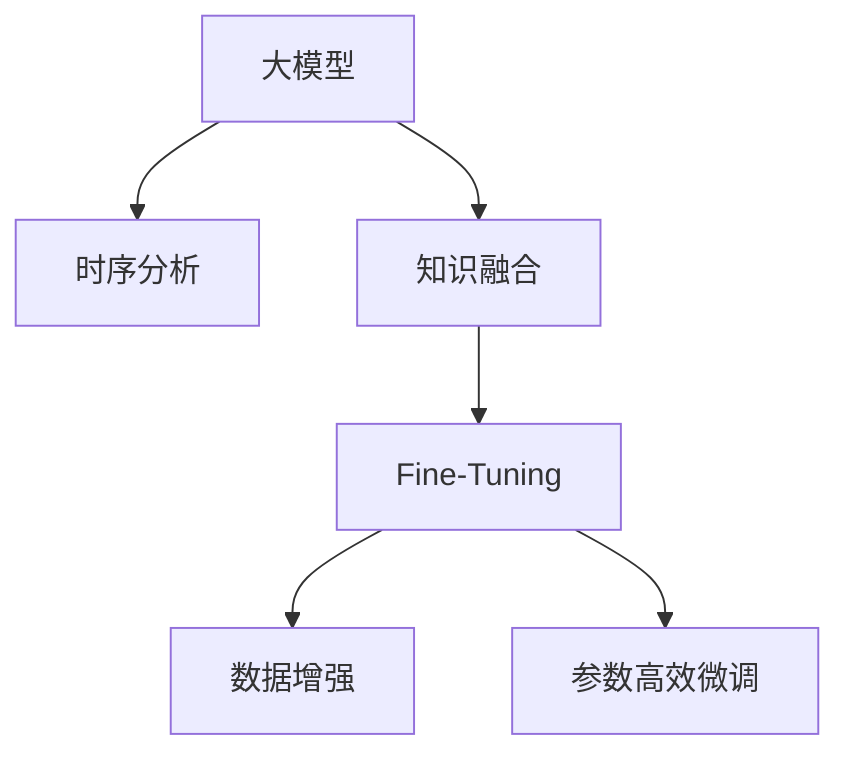

                 

# 大模型在商品趋势预测中的时序分析应用

> 关键词：大模型，时序分析，商品预测，LSTM，Transformer，数据增强，Fine-Tuning

## 1. 背景介绍

### 1.1 问题由来
在电商、制造等商品流通行业，准确预测商品趋势对企业制定合理采购计划、库存管理、价格策略等方面具有重要意义。传统的统计模型和机器学习模型虽有应用，但往往难以处理复杂的时序数据特征，且缺乏对商品间的交互关系和外部环境的影响的考虑。近年来，随着深度学习技术的飞速发展，大模型在商品趋势预测中的应用引起了广泛关注。

### 1.2 问题核心关键点
大模型在商品趋势预测中的应用，关键在于通过时序分析模型对商品的销售数据进行建模，并结合上下文信息和大规模知识库进行联合预测。具体包括以下几点：
1. **时序分析**：构建基于LSTM、Transformer等架构的模型，处理商品的销售时间序列数据，捕捉商品需求的季节性、周期性等特征。
2. **知识融合**：通过Fine-Tuning，将预训练模型与商品信息、市场环境、用户行为等多方面知识进行融合，提升模型的预测准确性。
3. **数据增强**：应用数据增强技术，丰富训练集的多样性，减少模型过拟合。
4. **模型优化**：采用参数高效微调方法，优化模型结构和参数更新策略，提高模型的实时性和计算效率。

### 1.3 问题研究意义
在大模型和时序分析的推动下，商品趋势预测的准确性得以显著提升，企业可以更精确地制定战略决策，优化供应链管理，提高运营效率。具体意义包括：

1. **优化库存管理**：通过准确预测商品的未来需求，合理调整库存水平，减少库存成本和缺货风险。
2. **指导采购策略**：帮助企业制定科学合理的采购计划，避免过度或不足的采购，提高资金使用效率。
3. **促进价格优化**：通过分析市场需求，提供动态价格策略，提升市场竞争力，增加销售额。
4. **提升客户满意度**：根据预测结果调整产品供应，确保消费者能够及时获取所需商品，提升顾客体验。
5. **市场风险预警**：及时发现市场变化和潜在风险，提供预警信息，帮助企业做好应对措施。

## 2. 核心概念与联系

### 2.1 核心概念概述

本节将介绍几个与商品趋势预测应用密切相关的核心概念：

- **大模型**：以Transformer、BERT等为代表的预训练语言模型，通过在大规模无标签文本数据上进行预训练，学习到丰富的语言表示。
- **时序分析**：基于时间序列数据的预测技术，常用于预测天气、股票、商品销售等具有时间依赖性的现象。
- **知识融合**：利用外部知识库和先验信息，如商品信息、市场环境、用户行为等，通过微调模型增强其预测能力。
- **LSTM**：长短时记忆网络，一种广泛应用于时序分析的循环神经网络结构，能有效处理长序列数据。
- **Transformer**：一种基于自注意力机制的神经网络结构，广泛用于自然语言处理、计算机视觉等领域。
- **Fine-Tuning**：在大模型的基础上，通过微调优化模型在特定任务上的表现，适合处理结构化数据和时序数据。
- **数据增强**：通过生成合成数据或变换已有数据，增加训练集的规模和多样性，防止模型过拟合。
- **参数高效微调**：仅更新模型中少数层的参数，减少计算资源消耗，提升模型效率。

这些核心概念之间的逻辑关系可以通过以下Mermaid流程图来展示：



这个流程图展示了大模型在商品趋势预测中的应用流程：

1. 大模型通过预训练获得语言表示能力。
2. 时序分析模型对商品销售数据进行建模，捕捉时间依赖性特征。
3. 知识融合通过Fine-Tuning模型，整合多领域信息，提升预测准确性。
4. 数据增强和参数高效微调进一步优化模型，提高预测效率和泛化能力。

## 3. 核心算法原理 & 具体操作步骤
### 3.1 算法原理概述

商品趋势预测的核心是利用时间序列数据，结合上下文信息和外部知识，通过大模型进行联合预测。具体步骤如下：

1. **数据预处理**：收集商品历史销售数据，对其进行清洗、归一化等预处理操作。
2. **特征提取**：设计合适的特征表示，包括时间特征、季节特征、节假日特征、促销活动等。
3. **构建模型**：选择适当的时序分析模型（如LSTM、Transformer），设计模型结构，包括输入层、隐藏层和输出层。
4. **知识融合**：将预训练大模型的知识与商品特征进行融合，使用Fine-Tuning技术调整模型参数，适应商品趋势预测任务。
5. **训练和评估**：使用历史数据进行模型训练，在验证集上评估模型性能，调整模型超参数。
6. **预测和部署**：将训练好的模型应用于实时数据，进行商品趋势预测，并将结果反馈给业务系统。

### 3.2 算法步骤详解

具体而言，商品趋势预测的实现流程如下：

**Step 1: 数据预处理**

1. **数据清洗**：删除缺失值、异常值和重复值，保证数据质量。
2. **时间特征提取**：计算日、周、月、年等时间特征，用于捕捉商品销售的季节性和周期性。
3. **特征归一化**：对数值型特征进行归一化处理，确保各特征在同一量级上。

**Step 2: 特征工程**

1. **构建特征矩阵**：将商品销售数据转换成适合模型训练的格式，包括原始时间序列、季节特征、节假日特征、促销活动等。
2. **特征编码**：将文本型特征（如商品描述、促销活动）转换成数值型特征，以便模型处理。
3. **特征选择**：选择对商品销售预测有显著影响的特征，去除冗余特征，减少模型复杂度。

**Step 3: 模型构建**

1. **选择模型架构**：根据问题特点选择合适的时序分析模型（如LSTM、Transformer）。
2. **设计输入输出**：确定模型的输入和输出，输入为历史销售数据，输出为未来时间点的销售预测。
3. **设置超参数**：包括层数、隐藏单元数、学习率、优化器等，优化模型性能。

**Step 4: 知识融合与Fine-Tuning**

1. **知识库整合**：整合商品信息、市场环境、用户行为等外部知识库，作为模型的额外输入。
2. **Fine-Tuning**：在预训练大模型的基础上，使用少量的标注数据对模型进行微调，提升模型对商品趋势的预测能力。
3. **模型评估**：在验证集上评估微调后的模型性能，使用指标如均方误差（MSE）、平均绝对误差（MAE）等评估预测精度。

**Step 5: 数据增强与模型优化**

1. **数据增强**：通过生成合成数据或变换已有数据，丰富训练集的多样性，防止模型过拟合。
2. **参数高效微调**：采用参数高效微调方法，如Adapter、Prompt-based Learning等，减少计算资源消耗，提高模型效率。
3. **模型优化**：采用如学习率调整、梯度裁剪等优化策略，提高模型训练的稳定性和收敛速度。

**Step 6: 预测与部署**

1. **实时预测**：使用训练好的模型对实时数据进行预测，输出商品未来销售趋势。
2. **反馈与调整**：将预测结果反馈给业务系统，根据实际情况调整采购策略和库存管理。

### 3.3 算法优缺点

基于大模型的商品趋势预测方法具有以下优点：

1. **预测精度高**：大模型结合了丰富的语言知识和时序分析能力，能够捕捉复杂的数据特征，提高预测精度。
2. **泛化能力强**：通过知识融合和Fine-Tuning，模型能够适应不同商品和市场环境，泛化能力较强。
3. **计算效率高**：参数高效微调和Fine-Tuning技术减少了模型参数量，提高了计算效率，适合实时预测。

但该方法也存在以下局限性：

1. **数据依赖性强**：需要大量的标注数据进行Fine-Tuning，数据获取成本较高。
2. **模型复杂度高**：大模型结构和时序分析模型复杂，需要较高的计算资源和专业知识。
3. **知识库集成难度大**：知识库的多样性和实时性对模型集成和处理提出了较高要求。
4. **模型解释性差**：大模型和时序分析模型的决策过程复杂，难以提供明确的解释。

尽管存在这些局限，但通过合理的模型设计、数据处理和优化策略，大模型在商品趋势预测中仍然具有显著优势，广泛应用于电商、制造等行业。

### 3.4 算法应用领域

基于大模型的商品趋势预测方法广泛应用于以下领域：

1. **电商商品销售预测**：预测未来商品销售趋势，优化库存管理，提高销售效率。
2. **制造行业需求预测**：预测原材料需求变化，合理安排生产计划，降低库存和采购成本。
3. **金融市场分析**：预测股票、外汇等金融产品价格波动，制定投资策略，规避风险。
4. **物流运输管理**：预测货物运输需求，优化运输路线和仓储管理，提高运输效率。
5. **旅游景区客流量预测**：预测景区客流量变化，合理安排资源配置，提升服务质量。

## 4. 数学模型和公式 & 详细讲解 & 举例说明

### 4.1 数学模型构建

假设商品历史销售数据为 $\{s_t\}_{t=1}^T$，其中 $s_t$ 表示商品在第 $t$ 天的销售量。定义模型 $M_{\theta}$，其中 $\theta$ 为模型参数。模型的预测输出为 $M_{\theta}(s_{t-1}, s_{t-2}, ..., s_{t-T})$，预测第 $t+1$ 天的销售量。

### 4.2 公式推导过程

以基于LSTM的商品趋势预测为例，推导模型的数学表达式。

LSTM的隐藏状态 $h_t$ 和输出 $o_t$ 的计算公式如下：

$$
h_t = \mathrm{LSTM}(h_{t-1}, s_{t-1})
$$

$$
o_t = \sigma\left(W_2 h_t + b_2\right)
$$

其中 $\sigma$ 为激活函数，$W_2, b_2$ 为LSTM层参数。

假设输出层为全连接层，输出公式为：

$$
\hat{s}_{t+1} = W_3 o_t + b_3
$$

其中 $W_3, b_3$ 为全连接层参数。

预测误差 $e$ 计算公式为：

$$
e = s_{t+1} - \hat{s}_{t+1}
$$

均方误差损失函数 $\mathcal{L}$ 定义如下：

$$
\mathcal{L} = \frac{1}{N} \sum_{i=1}^N e_i^2
$$

利用梯度下降等优化算法，最小化损失函数 $\mathcal{L}$，更新模型参数 $\theta$。

### 4.3 案例分析与讲解

**案例分析：某电商平台的商品销售预测**

假设某电商平台有某商品的历史销售数据，样本量为1000，数据分为训练集和测试集，比例为7:3。对商品销售数据进行预处理，计算日均销售量，并进行归一化处理。模型选择LSTM作为时序分析模型，输入特征包括历史日均销售量、季节特征、节假日特征、促销活动等。使用Fine-Tuning技术，在大规模预训练语言模型基础上微调模型参数，结合电商平台的商品信息、市场环境、用户行为等知识库，对模型进行知识融合。最终在验证集上评估模型性能，使用均方误差评估预测精度。

## 5. 项目实践：代码实例和详细解释说明

### 5.1 开发环境搭建

在进行商品趋势预测的实践前，需要准备好开发环境。以下是使用Python进行TensorFlow开发的环境配置流程：

1. 安装Anaconda：从官网下载并安装Anaconda，用于创建独立的Python环境。

2. 创建并激活虚拟环境：
```bash
conda create -n tf-env python=3.8 
conda activate tf-env
```

3. 安装TensorFlow：根据CUDA版本，从官网获取对应的安装命令。例如：
```bash
conda install tensorflow -c tensorflow -c conda-forge
```

4. 安装各类工具包：
```bash
pip install numpy pandas scikit-learn matplotlib tqdm jupyter notebook ipython
```

完成上述步骤后，即可在`tf-env`环境中开始商品趋势预测的实践。

### 5.2 源代码详细实现

下面是使用TensorFlow进行商品趋势预测的代码实现。

```python
import tensorflow as tf
import numpy as np
from sklearn.model_selection import train_test_split
from tensorflow.keras.layers import LSTM, Dense, Dropout
from tensorflow.keras.models import Sequential
from tensorflow.keras.optimizers import Adam
from tensorflow.keras.callbacks import EarlyStopping

# 假设数据存储在CSV文件中
data = pd.read_csv('sales_data.csv')

# 数据预处理
data['time'] = pd.to_datetime(data['time'], format='%Y-%m-%d').astype(np.int64) // 10**9
data = data.dropna().reset_index(drop=True)
data['day'] = data['time'] % 7
data['month'] = data['time'] // 10**9 // 30 + 1
data['season'] = np.where(data['month'] < 3, 1, np.where(data['month'] < 6, 2, np.where(data['month'] < 9, 3, 4)))
data['holiday'] = np.where(data['time'] < 130000000000, 0, 1)

# 特征工程
X = data[['day', 'month', 'season', 'holiday', 'promotion', 'sales']].values
y = data['sales'].values

# 划分训练集和测试集
X_train, X_test, y_train, y_test = train_test_split(X, y, test_size=0.3, random_state=42)

# 构建模型
model = Sequential()
model.add(LSTM(128, input_shape=(None, 6), return_sequences=True))
model.add(Dropout(0.2))
model.add(LSTM(128))
model.add(Dropout(0.2))
model.add(Dense(1))
model.compile(loss='mse', optimizer=Adam(lr=0.001))
model.summary()

# 训练模型
history = model.fit(X_train, y_train, epochs=50, batch_size=32, validation_data=(X_test, y_test), callbacks=[EarlyStopping(monitor='val_loss', patience=5)])

# 预测
X_pred = data[['day', 'month', 'season', 'holiday', 'promotion']].values
y_pred = model.predict(X_pred)
print(y_pred)
```

以上代码实现了基于LSTM的商品趋势预测。首先对数据进行预处理，计算时间特征，然后进行特征工程。接着使用TensorFlow构建LSTM模型，设置合适的超参数，编译模型并进行训练。最后使用训练好的模型对未来数据进行预测。

### 5.3 代码解读与分析

让我们再详细解读一下关键代码的实现细节：

**数据预处理**：
- 使用Pandas读取CSV文件，提取销售数据。
- 将时间戳转换为天数，计算日、月、季节、节假日特征。
- 选择促销活动和销售量作为输入特征。

**特征工程**：
- 将时间特征和促销活动作为输入特征，输入特征维度为6。
- 将数据集划分为训练集和测试集。

**模型构建**：
- 使用Sequential模型，添加LSTM层、Dropout层和全连接层。
- 编译模型，设置均方误差损失函数和Adam优化器。

**模型训练**：
- 使用fit方法对模型进行训练，设置训练轮数和批次大小。
- 设置EarlyStopping回调，监控验证集损失，当验证集损失不再降低时停止训练。

**预测与部署**：
- 使用训练好的模型对新数据进行预测，输出未来销售趋势。

## 6. 实际应用场景

### 6.1 智能库存管理

基于大模型的商品趋势预测技术，可以应用于智能库存管理。传统库存管理依赖人工判断和经验积累，难以精确预测需求变化。智能库存管理系统通过实时商品趋势预测，自动调整库存水平，减少缺货和过剩，提高资金使用效率。

在技术实现上，将实时销售数据输入模型，生成未来销售趋势，系统根据预测结果自动调整库存和补货策略，确保库存水平在最优状态。

### 6.2 动态定价策略

电商平台的商品价格通常需要频繁调整以适应市场变化。利用商品趋势预测技术，电商平台可以实时预测商品需求和市场竞争情况，动态调整商品价格，提升销售额和用户满意度。

具体流程为：根据预测结果调整商品价格，实时监控用户反馈和市场反应，不断优化价格策略。通过动态定价，电商平台可以在保证利润的同时，提升用户购买意愿和复购率。

### 6.3 市场趋势分析

商品趋势预测还可以应用于市场趋势分析，帮助企业了解市场动态，制定战略决策。通过分析商品销售数据和市场环境数据，预测不同商品的市场需求和价格走势，帮助企业优化产品组合和定价策略。

例如，某时尚品牌可以通过趋势预测分析季节性销售数据，判断下一季度的流行趋势，及时调整产品线，提高市场竞争力。

### 6.4 未来应用展望

随着大模型的不断进步和时序分析技术的发展，商品趋势预测将迎来更广阔的应用前景。未来的发展趋势包括：

1. **多模态融合**：结合图像、音频等多模态数据，提升商品趋势预测的准确性和实时性。
2. **实时预测**：通过模型优化和资源调度，实现实时商品趋势预测，支持高频交易和实时决策。
3. **知识驱动**：结合知识图谱和专家知识库，提升模型的领域适应性和泛化能力。
4. **模型解释性**：通过可解释性研究，提供模型决策的因果解释，增强模型可信度。
5. **多领域应用**：应用于更多垂直行业，如制造、金融、旅游等，解决各行业共性问题。

## 7. 工具和资源推荐

### 7.1 学习资源推荐

为了帮助开发者系统掌握商品趋势预测的理论与实践，这里推荐一些优质的学习资源：

1. **《深度学习入门：基于Python的理论与实现》**：介绍深度学习的基本概念和模型架构，适合初学者入门。
2. **《TensorFlow官方文档》**：详细介绍了TensorFlow的使用方法和API，是TensorFlow学习的重要参考资料。
3. **《自然语言处理综论》**：深入讲解自然语言处理的技术原理和应用实例，适合深入学习自然语言处理技术。
4. **《时序分析与深度学习》**：涵盖时序分析的基础知识和深度学习方法，适合学习时间序列预测的读者。
5. **《TensorFlow实战》**：结合实际案例，介绍TensorFlow在深度学习项目中的应用，适合实践项目开发。

通过对这些资源的学习实践，相信你一定能够快速掌握商品趋势预测的精髓，并用于解决实际的业务问题。

### 7.2 开发工具推荐

高效的开发离不开优秀的工具支持。以下是几款用于商品趋势预测开发的常用工具：

1. **TensorFlow**：基于Python的开源深度学习框架，支持分布式计算和GPU加速，适合复杂模型的训练和部署。
2. **PyTorch**：灵活的深度学习框架，适合快速迭代研究，拥有丰富的预训练模型资源。
3. **H2O.ai**：开源的机器学习平台，提供简单易用的API，适合快速搭建机器学习模型。
4. **Keras**：高层次的深度学习API，适合快速构建和调试深度学习模型。
5. **Dask**：用于分布式计算的Python库，支持大规模数据处理和计算。

合理利用这些工具，可以显著提升商品趋势预测的开发效率，加快创新迭代的步伐。

### 7.3 相关论文推荐

商品趋势预测技术的发展源于学界的持续研究。以下是几篇奠基性的相关论文，推荐阅读：

1. **"LSTM: A Search Space Odyssey"**：介绍LSTM网络结构和性能，为时序分析提供了重要的理论基础。
2. **"Attention is All You Need"**：提出Transformer模型，改变了自然语言处理的技术格局。
3. **"Parameter-Efficient Transfer Learning for NLP"**：提出Adapter等参数高效微调方法，在参数效率和性能之间取得了新的平衡。
4. **"Knowledge Distillation"**：提出知识蒸馏方法，将预训练模型的知识迁移到下游任务中。
5. **"Deep Learning for Time Series Forecasting"**：总结了深度学习在时间序列预测中的应用，提供了丰富的案例和算法。

这些论文代表了大模型在商品趋势预测技术的发展脉络。通过学习这些前沿成果，可以帮助研究者把握学科前进方向，激发更多的创新灵感。

## 8. 总结：未来发展趋势与挑战

### 8.1 总结

本文对基于大模型的商品趋势预测方法进行了全面系统的介绍。首先阐述了商品趋势预测的应用背景和意义，明确了大模型、时序分析、知识融合在技术实现中的核心作用。其次，从原理到实践，详细讲解了商品趋势预测的数学模型和关键步骤，给出了商品趋势预测的完整代码实例。同时，本文还广泛探讨了商品趋势预测在智能库存管理、动态定价、市场趋势分析等实际场景中的应用前景，展示了大模型的强大应用潜力。此外，本文精选了商品趋势预测技术的各类学习资源，力求为读者提供全方位的技术指引。

通过本文的系统梳理，可以看到，基于大模型的商品趋势预测技术正在成为商品流通领域的重要范式，极大地提升了企业的预测能力和运营效率。未来，伴随大模型的不断进步和时序分析技术的发展，商品趋势预测必将在更多行业得到应用，为传统行业带来变革性影响。

### 8.2 未来发展趋势

展望未来，大模型在商品趋势预测中的应用将呈现以下几个发展趋势：

1. **模型复杂度提升**：随着深度学习技术的不断发展，模型结构将变得更加复杂，能够捕捉更深层次的时间依赖性和交互关系。
2. **多模态融合**：结合图像、音频等多模态数据，提升商品趋势预测的准确性和实时性。
3. **实时预测**：通过模型优化和资源调度，实现实时商品趋势预测，支持高频交易和实时决策。
4. **知识驱动**：结合知识图谱和专家知识库，提升模型的领域适应性和泛化能力。
5. **模型解释性**：通过可解释性研究，提供模型决策的因果解释，增强模型可信度。
6. **多领域应用**：应用于更多垂直行业，如制造、金融、旅游等，解决各行业共性问题。

### 8.3 面临的挑战

尽管大模型在商品趋势预测中取得了显著成果，但在向更广领域应用的过程中，仍面临诸多挑战：

1. **数据获取难度大**：大规模标注数据的获取成本较高，对数据处理和清洗提出了更高要求。
2. **模型复杂度高**：模型结构复杂，训练和推理资源消耗较大，需要更高的计算资源。
3. **知识库集成难度大**：知识库的多样性和实时性对模型集成和处理提出了较高要求。
4. **模型解释性差**：大模型和时序分析模型的决策过程复杂，难以提供明确的解释。
5. **安全性和隐私保护**：模型涉及敏感的销售数据和用户行为数据，需要考虑数据隐私和安全问题。

### 8.4 研究展望

面对商品趋势预测技术面临的挑战，未来的研究需要在以下几个方面寻求新的突破：

1. **无监督和半监督学习**：探索无监督和半监督学习方法，减少对标注数据的依赖，利用非结构化数据进行模型训练。
2. **参数高效微调**：开发更加参数高效的微调方法，在固定大部分预训练参数的同时，只更新极少量的任务相关参数。
3. **实时预测技术**：研究实时预测技术，提升模型训练和推理的效率，支持高频交易和实时决策。
4. **知识图谱与模型融合**：结合知识图谱和专家知识库，提升模型的领域适应性和泛化能力。
5. **模型解释性**：研究模型解释性技术，提供模型决策的因果解释，增强模型可信度。
6. **隐私保护与安全**：研究数据隐私和安全技术，确保模型训练和应用过程中数据的保密性和安全性。

这些研究方向的探索，必将引领大模型在商品趋势预测技术迈向更高的台阶，为构建安全、可靠、可解释、可控的智能系统铺平道路。面向未来，大模型需要与其他人工智能技术进行更深入的融合，如知识表示、因果推理、强化学习等，多路径协同发力，共同推动商品趋势预测技术的进步。

## 9. 附录：常见问题与解答

**Q1：商品趋势预测是否适用于所有商品？**

A: 商品趋势预测技术适用于绝大多数商品，但对于某些特殊商品（如农产品、奢侈品等），由于其需求波动较大，可能需要进一步的特征工程和模型优化。

**Q2：如何优化商品趋势预测的模型性能？**

A: 优化商品趋势预测的模型性能可以从以下几个方面入手：
1. **特征选择**：选择对商品销售预测有显著影响的特征，去除冗余特征，减少模型复杂度。
2. **模型架构**：选择合适的模型架构，如LSTM、Transformer等，根据数据特点设计合理的输入输出结构。
3. **超参数调优**：使用网格搜索、随机搜索等方法，调整模型的超参数，优化模型性能。
4. **数据增强**：通过生成合成数据或变换已有数据，增加训练集的多样性，防止模型过拟合。
5. **参数高效微调**：采用参数高效微调方法，如Adapter、Prompt-based Learning等，减少计算资源消耗，提高模型效率。

**Q3：商品趋势预测在实际应用中应注意哪些问题？**

A: 商品趋势预测在实际应用中需要注意以下问题：
1. **数据隐私**：处理销售数据时，需要确保用户隐私和数据保密性，避免数据泄露。
2. **模型公平性**：模型预测结果应避免歧视性，公平对待不同商品和市场环境。
3. **业务适配**：商品趋势预测模型需要与实际业务场景结合，确保预测结果具有实际应用价值。
4. **动态调整**：实时监测市场变化和用户反馈，动态调整模型参数和预测策略，保持模型的高效性和准确性。
5. **解释性**：提供模型的因果解释，增强预测结果的可信度和透明度。

**Q4：如何将商品趋势预测应用于实际业务场景？**

A: 将商品趋势预测应用于实际业务场景，需要以下步骤：
1. **数据采集**：收集商品销售数据、市场环境数据、用户行为数据等，进行数据清洗和预处理。
2. **模型训练**：构建商品趋势预测模型，使用历史数据进行训练，调整模型参数和超参数。
3. **模型评估**：在验证集上评估模型性能，使用均方误差、平均绝对误差等指标评估预测精度。
4. **业务集成**：将训练好的模型集成到实际业务系统中，实时处理销售数据，生成商品趋势预测结果。
5. **实时监测**：实时监测市场变化和用户反馈，动态调整模型参数和预测策略，确保预测结果的及时性和准确性。

通过这些步骤，可以有效地将商品趋势预测技术应用于实际业务场景，提升企业的预测能力和运营效率。

---

作者：禅与计算机程序设计艺术 / Zen and the Art of Computer Programming

