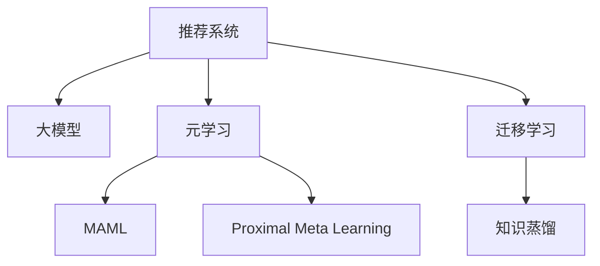

                 

# 大模型在推荐系统中的元学习应用

## 1. 背景介绍

### 1.1 问题由来

随着互联网的快速发展，推荐系统已逐渐成为电商、社交、视频、新闻等多个领域中不可或缺的一部分。传统的基于协同过滤、统计特征的推荐算法，存在数据稀疏、冷启动问题。相比之下，基于深度学习的推荐模型，能够直接从用户行为数据中学习用户偏好，取得了不错的效果。但这些模型通常需要大规模标注数据和复杂结构设计，对计算资源和时间成本提出了较高要求。

近年来，大模型在自然语言处理(NLP)领域取得了巨大突破，如BERT、GPT-3等模型。这些大模型具备强大的语义理解能力，能够从海量文本数据中学习到丰富的知识表示。如果将大模型的知识表示应用于推荐系统，利用其强大的学习能力和泛化能力，将有望大幅提升推荐系统的性能。

### 1.2 问题核心关键点

元学习是一种通用的学习方法，旨在通过少量样本，快速学习到新任务的学习策略，避免从头训练复杂模型。元学习的核心思想是：在少量标注数据上训练模型，学习新任务的最优模型参数。

大模型在推荐系统中的应用，可以从元学习的视角进行思考。即，利用大模型预训练学到的知识表示，对特定推荐任务进行微调，通过少量的交互数据，快速学习到该任务的最优参数。这种方法被称为元学习的推荐系统。

元学习推荐系统具有以下优点：
1. 数据需求小：利用大模型的知识表示，可以在很少的交互数据上实现推荐。
2. 泛化能力强：大模型的预训练知识可以泛化到多种推荐任务中。
3. 模型结构简单：只需在特定任务上进行微调，不需要复杂的模型结构和超参数调优。
4. 训练速度快：大模型的计算能力强大，可以快速完成微调过程。

## 2. 核心概念与联系

### 2.1 核心概念概述

为更好地理解元学习在推荐系统中的应用，本节将介绍几个密切相关的核心概念：

- 推荐系统：通过分析用户的历史行为和兴趣，为用户推荐合适的物品的个性化推荐系统。推荐系统是电商、社交、新闻、视频等多个领域中的重要技术手段。

- 大模型：以自回归模型(如GPT)或自编码模型(如BERT)为代表的超大规模预训练语言模型。通过在大规模无标签文本数据上进行预训练，学习到丰富的语言知识和常识，具备强大的语言理解和生成能力。

- 元学习(Meta Learning)：一种通用的学习方法，旨在通过少量样本，快速学习到新任务的学习策略。典型的元学习算法包括MAML(Meta-Learning via Multi-task Learning)、Proximal Meta Learning等。

- 迁移学习(Transfer Learning)：将一个领域学习到的知识，迁移应用到另一个不同但相关的领域的学习范式。元学习可以视为迁移学习的一种特殊形式，在迁移学习的基础上，通过少量样本学习新任务的参数。

- 知识蒸馏(Knowledge Distillation)：利用大模型的丰富知识，通过蒸馏的方式，转移给小型模型，以提升小型模型的性能。元学习也可以看作是一种知识蒸馏的应用。

这些核心概念之间的逻辑关系可以通过以下Mermaid流程图来展示：



这个流程图展示了大模型在推荐系统中的元学习应用的各个核心概念及其之间的关系：

1. 推荐系统通过分析用户历史行为和兴趣，推荐合适的物品。
2. 大模型通过在大规模无标签文本数据上进行预训练，学习到丰富的语言知识和常识。
3. 元学习通过少量样本学习新任务的最优参数，提升推荐效果。
4. 迁移学习将大模型的预训练知识，迁移到推荐任务中。
5. 知识蒸馏利用大模型的丰富知识，提升小型模型的性能。

## 3. 核心算法原理 & 具体操作步骤

### 3.1 算法原理概述

元学习在推荐系统中的应用，本质上是一种在特定任务上进行微调的过程。其核心思想是：利用大模型预训练学到的知识表示，对特定推荐任务进行微调，通过少量的交互数据，快速学习到该任务的最优参数。

形式化地，假设大模型为 $M_{\theta}$，其中 $\theta$ 为预训练得到的模型参数。给定推荐任务 $T$ 的训练集 $D=\{(x_i, y_i)\}_{i=1}^N, x_i \in \mathcal{X}, y_i \in \mathcal{Y}$，元学习的目标是通过微调模型参数 $\theta$，使得模型在特定任务 $T$ 上具备优化能力。

元学习推荐系统一般包括以下几个关键步骤：

**Step 1: 准备元学习任务和数据集**
- 选择推荐任务的训练集和验证集，并进行样本分割。一般要求训练集和验证集的分布不要差异过大。
- 定义推荐任务的输出空间 $\mathcal{Y}$，如物品ID、评分等。

**Step 2: 添加任务适配层**
- 根据任务类型，在预训练模型顶层设计合适的输出层和损失函数。
- 对于点击率预测任务，通常在顶层添加线性分类器和交叉熵损失函数。
- 对于物品推荐任务，通常使用列表排序任务，使用排序损失函数。

**Step 3: 设置元学习超参数**
- 选择合适的元学习算法及其参数，如MAML、Proximal Meta Learning等。
- 设置学习率、批大小、迭代轮数等。
- 设置冻结预训练参数的策略，如仅微调顶层，或全部参数都参与微调。

**Step 4: 执行元学习训练**
- 将训练集数据分批次输入模型，前向传播计算损失函数。
- 反向传播计算参数梯度，根据设定的元学习算法更新模型参数。
- 周期性在验证集上评估模型性能，根据性能指标决定是否触发 Early Stopping。
- 重复上述步骤直到满足预设的迭代轮数或 Early Stopping 条件。

**Step 5: 测试和部署**
- 在测试集上评估元学习后模型 $M_{\theta}$ 的性能，对比元学习前后的精度提升。
- 使用元学习后的模型对新用户进行推荐，集成到实际的应用系统中。
- 持续收集新的用户行为数据，定期重新元学习模型，以适应数据分布的变化。

以上是元学习在推荐系统中的应用的一般流程。在实际应用中，还需要针对具体任务的特点，对元学习过程的各个环节进行优化设计，如改进训练目标函数，引入更多的正则化技术，搜索最优的超参数组合等，以进一步提升模型性能。

### 3.2 算法步骤详解

以点击率预测任务为例，展示元学习推荐系统的具体实现步骤：

**Step 1: 数据预处理**
- 将用户点击历史数据 $D=\{(x_i, y_i)\}_{i=1}^N, x_i \in \mathcal{X}, y_i \in \{0,1\}$ 作为训练数据，其中 $x_i$ 表示用户点击的上下文特征，$y_i$ 表示用户是否点击。
- 将上下文特征 $x_i$ 转换为模型可接受的格式，如将文本转换为数字形式的ID。

**Step 2: 模型初始化**
- 选择大模型 $M_{\theta}$，其中 $\theta$ 为预训练得到的模型参数。
- 在模型的顶层添加线性分类器和交叉熵损失函数，用于预测用户是否点击。
- 定义元学习算法（如MAML）和超参数，如学习率、批大小等。

**Step 3: 元学习训练**
- 将训练数据分批次输入模型，前向传播计算损失函数。
- 使用元学习算法（如MAML）更新模型参数 $\theta$。
- 周期性在验证集上评估模型性能，根据性能指标决定是否触发 Early Stopping。
- 重复上述步骤直到满足预设的迭代轮数或 Early Stopping 条件。

**Step 4: 测试和部署**
- 在测试集上评估元学习后模型 $M_{\theta}$ 的性能，对比元学习前后的精度提升。
- 使用元学习后的模型对新用户进行点击率预测，集成到实际的应用系统中。
- 持续收集新的用户行为数据，定期重新元学习模型，以适应数据分布的变化。

### 3.3 算法优缺点

元学习在推荐系统中的应用具有以下优点：
1. 数据需求小：利用大模型的知识表示，可以在很少的交互数据上实现推荐。
2. 泛化能力强：大模型的预训练知识可以泛化到多种推荐任务中。
3. 模型结构简单：只需在特定任务上进行微调，不需要复杂的模型结构和超参数调优。
4. 训练速度快：大模型的计算能力强大，可以快速完成微调过程。

同时，该方法也存在一定的局限性：
1. 标签噪声：推荐任务中的标签数据通常存在噪声，如用户点击行为不规律，影响模型的泛化能力。
2. 数据稀疏：推荐任务通常需要分析大量用户行为数据，但在数据稀疏场景下，模型难以学习到有效的用户偏好。
3. 性能不稳定：元学习模型在样本量较小的情况下，容易过拟合训练数据，导致模型性能不稳定。
4. 计算资源消耗大：尽管元学习算法可以在较少数据上学习到新任务，但计算资源消耗仍然较大，尤其是在大规模推荐系统中部署时。

尽管存在这些局限性，但就目前而言，元学习推荐系统仍然是大规模推荐系统中的重要范式，具有广阔的应用前景。

### 3.4 算法应用领域

元学习推荐系统已经在多个领域得到了应用，例如：

- 电商推荐：通过对用户历史点击、浏览、购买行为进行分析，推荐用户可能感兴趣的商品。
- 新闻推荐：根据用户阅读历史和点击行为，推荐用户可能感兴趣的新闻。
- 视频推荐：分析用户观看历史和评分数据，推荐用户可能感兴趣的视频。
- 社交推荐：根据用户的社交网络信息和行为数据，推荐可能感兴趣的用户或内容。
- 游戏推荐：分析用户的游戏行为和偏好，推荐用户可能感兴趣的游戏或道具。

除了这些经典任务外，元学习推荐系统还被创新性地应用到更多场景中，如个性化广告、商品搜索、用户画像分析等，为推荐系统带来了新的突破。

## 4. 数学模型和公式 & 详细讲解  
### 4.1 数学模型构建

本节将使用数学语言对元学习在推荐系统中的应用进行更加严格的刻画。

记大模型为 $M_{\theta}$，其中 $\theta$ 为预训练得到的模型参数。假设推荐任务的训练集为 $D=\{(x_i, y_i)\}_{i=1}^N, x_i \in \mathcal{X}, y_i \in \{0,1\}$。

定义模型 $M_{\theta}$ 在输入 $x_i$ 上的预测结果为 $\hat{y}=M_{\theta}(x_i) \in [0,1]$，表示用户是否点击的概率。在元学习框架中，我们希望找到最优的模型参数 $\theta^*$，使得在特定推荐任务上，模型的预测准确率最大化。即：

$$
\theta^* = \mathop{\arg\min}_{\theta} \mathcal{L}(\theta)
$$

其中 $\mathcal{L}$ 为针对特定推荐任务设计的损失函数，用于衡量模型预测输出与真实标签之间的差异。常见的损失函数包括交叉熵损失、排序损失等。

### 4.2 公式推导过程

以点击率预测任务为例，推导交叉熵损失函数及其梯度的计算公式。

假设模型 $M_{\theta}$ 在输入 $x_i$ 上的输出为 $\hat{y}=M_{\theta}(x_i) \in [0,1]$，表示用户是否点击的概率。真实标签 $y_i \in \{0,1\}$。则二分类交叉熵损失函数定义为：

$$
\ell(M_{\theta}(x_i),y_i) = -[y_i\log \hat{y} + (1-y_i)\log (1-\hat{y})]
$$

将其代入经验风险公式，得：

$$
\mathcal{L}(\theta) = -\frac{1}{N}\sum_{i=1}^N [y_i\log M_{\theta}(x_i)+(1-y_i)\log(1-M_{\theta}(x_i))]
$$

根据链式法则，损失函数对参数 $\theta_k$ 的梯度为：

$$
\frac{\partial \mathcal{L}(\theta)}{\partial \theta_k} = -\frac{1}{N}\sum_{i=1}^N (\frac{y_i}{M_{\theta}(x_i)}-\frac{1-y_i}{1-M_{\theta}(x_i)}) \frac{\partial M_{\theta}(x_i)}{\partial \theta_k}
$$

其中 $\frac{\partial M_{\theta}(x_i)}{\partial \theta_k}$ 可进一步递归展开，利用自动微分技术完成计算。

在得到损失函数的梯度后，即可带入模型更新公式，完成模型的迭代优化。重复上述过程直至收敛，最终得到适应推荐任务的最优模型参数 $\theta^*$。

## 5. 项目实践：代码实例和详细解释说明
### 5.1 开发环境搭建

在进行元学习实践前，我们需要准备好开发环境。以下是使用Python进行PyTorch开发的环境配置流程：

1. 安装Anaconda：从官网下载并安装Anaconda，用于创建独立的Python环境。

2. 创建并激活虚拟环境：
```bash
conda create -n pytorch-env python=3.8 
conda activate pytorch-env
```

3. 安装PyTorch：根据CUDA版本，从官网获取对应的安装命令。例如：
```bash
conda install pytorch torchvision torchaudio cudatoolkit=11.1 -c pytorch -c conda-forge
```

4. 安装Transformers库：
```bash
pip install transformers
```

5. 安装各类工具包：
```bash
pip install numpy pandas scikit-learn matplotlib tqdm jupyter notebook ipython
```

完成上述步骤后，即可在`pytorch-env`环境中开始元学习实践。

### 5.2 源代码详细实现

下面我们以点击率预测任务为例，给出使用Transformers库对BERT模型进行元学习的PyTorch代码实现。

首先，定义点击率预测任务的训练数据：

```python
from transformers import BertTokenizer
from torch.utils.data import Dataset
import torch

class ClickDataset(Dataset):
    def __init__(self, texts, clicks, tokenizer, max_len=128):
        self.texts = texts
        self.clicks = clicks
        self.tokenizer = tokenizer
        self.max_len = max_len
        
    def __len__(self):
        return len(self.texts)
    
    def __getitem__(self, item):
        text = self.texts[item]
        click = self.clicks[item]
        
        encoding = self.tokenizer(text, return_tensors='pt', max_length=self.max_len, padding='max_length', truncation=True)
        input_ids = encoding['input_ids'][0]
        attention_mask = encoding['attention_mask'][0]
        
        # 对click标签进行编码
        encoded_click = [int(click)] 
        encoded_click.extend([0] * (self.max_len - len(encoded_click)))
        labels = torch.tensor(encoded_click, dtype=torch.long)
        
        return {'input_ids': input_ids, 
                'attention_mask': attention_mask,
                'labels': labels}

# 训练数据
train_dataset = ClickDataset(train_texts, train_clicks, tokenizer)
dev_dataset = ClickDataset(dev_texts, dev_clicks, tokenizer)
test_dataset = ClickDataset(test_texts, test_clicks, tokenizer)
```

然后，定义模型和优化器：

```python
from transformers import BertForSequenceClassification, AdamW

model = BertForSequenceClassification.from_pretrained('bert-base-cased', num_labels=2)

optimizer = AdamW(model.parameters(), lr=2e-5)
```

接着，定义训练和评估函数：

```python
from torch.utils.data import DataLoader
from tqdm import tqdm
from sklearn.metrics import accuracy_score

device = torch.device('cuda') if torch.cuda.is_available() else torch.device('cpu')
model.to(device)

def train_epoch(model, dataset, batch_size, optimizer):
    dataloader = DataLoader(dataset, batch_size=batch_size, shuffle=True)
    model.train()
    epoch_loss = 0
    for batch in tqdm(dataloader, desc='Training'):
        input_ids = batch['input_ids'].to(device)
        attention_mask = batch['attention_mask'].to(device)
        labels = batch['labels'].to(device)
        model.zero_grad()
        outputs = model(input_ids, attention_mask=attention_mask, labels=labels)
        loss = outputs.loss
        epoch_loss += loss.item()
        loss.backward()
        optimizer.step()
    return epoch_loss / len(dataloader)

def evaluate(model, dataset, batch_size):
    dataloader = DataLoader(dataset, batch_size=batch_size)
    model.eval()
    preds, labels = [], []
    with torch.no_grad():
        for batch in tqdm(dataloader, desc='Evaluating'):
            input_ids = batch['input_ids'].to(device)
            attention_mask = batch['attention_mask'].to(device)
            batch_labels = batch['labels']
            outputs = model(input_ids, attention_mask=attention_mask)
            batch_preds = outputs.logits.argmax(dim=2).to('cpu').tolist()
            batch_labels = batch_labels.to('cpu').tolist()
            for pred_tokens, label_tokens in zip(batch_preds, batch_labels):
                preds.append(pred_tokens[:len(label_tokens)])
                labels.append(label_tokens)
                
    print('Accuracy:', accuracy_score(labels, preds))
```

最后，启动训练流程并在测试集上评估：

```python
epochs = 5
batch_size = 16

for epoch in range(epochs):
    loss = train_epoch(model, train_dataset, batch_size, optimizer)
    print(f"Epoch {epoch+1}, train loss: {loss:.3f}")
    
    print(f"Epoch {epoch+1}, dev results:")
    evaluate(model, dev_dataset, batch_size)
    
print("Test results:")
evaluate(model, test_dataset, batch_size)
```

以上就是使用PyTorch对BERT进行点击率预测任务元学习的完整代码实现。可以看到，得益于Transformers库的强大封装，我们可以用相对简洁的代码完成BERT模型的加载和元学习。

### 5.3 代码解读与分析

让我们再详细解读一下关键代码的实现细节：

**ClickDataset类**：
- `__init__`方法：初始化文本、点击记录、分词器等关键组件。
- `__len__`方法：返回数据集的样本数量。
- `__getitem__`方法：对单个样本进行处理，将文本输入编码为token ids，将点击标签编码为数字，并对其进行定长padding，最终返回模型所需的输入。

**模型和优化器定义**：
- 使用BertForSequenceClassification类定义模型，其中num_labels为2，表示点击与否的分类任务。
- 选择AdamW优化器，学习率为2e-5。

**训练和评估函数**：
- 使用PyTorch的DataLoader对数据集进行批次化加载，供模型训练和推理使用。
- 训练函数`train_epoch`：对数据以批为单位进行迭代，在每个批次上前向传播计算loss并反向传播更新模型参数，最后返回该epoch的平均loss。
- 评估函数`evaluate`：与训练类似，不同点在于不更新模型参数，并在每个batch结束后将预测和标签结果存储下来，最后使用sklearn的accuracy_score函数计算准确率。

**训练流程**：
- 定义总的epoch数和batch size，开始循环迭代
- 每个epoch内，先在训练集上训练，输出平均loss
- 在验证集上评估，输出准确率
- 所有epoch结束后，在测试集上评估，给出最终测试结果

可以看到，PyTorch配合Transformers库使得BERT元学习的代码实现变得简洁高效。开发者可以将更多精力放在数据处理、模型改进等高层逻辑上，而不必过多关注底层的实现细节。

当然，工业级的系统实现还需考虑更多因素，如模型的保存和部署、超参数的自动搜索、更灵活的任务适配层等。但核心的元学习范式基本与此类似。

## 6. 实际应用场景
### 6.1 电商推荐

电商推荐是元学习推荐系统的重要应用场景之一。电商平台每天产生大量的用户行为数据，利用这些数据进行推荐，能够显著提升用户体验和平台销售额。

在技术实现上，可以收集用户浏览、点击、购买等行为数据，将行为数据转换为模型可接受的格式，然后利用大模型进行元学习微调。元学习后的模型能够学习到用户点击行为背后的特征表示，并在新用户或新物品上，快速学习到推荐策略。通过持续收集新的用户行为数据，元学习模型能够动态适应用户偏好，提升推荐效果。

### 6.2 新闻推荐

新闻推荐系统可以根据用户的阅读历史和点击行为，推荐可能感兴趣的新闻。与电商推荐类似，新闻推荐也具有大量用户行为数据，利用这些数据进行元学习微调，能够显著提升推荐效果。

在实际应用中，新闻推荐系统可以通过爬虫抓取新闻标题和摘要，转换为文本数据，与用户行为数据一起输入模型进行元学习微调。元学习后的模型能够学习到用户的新闻偏好，并在新用户上，快速学习到推荐策略，提升推荐效果。

### 6.3 视频推荐

视频推荐系统可以根据用户观看历史和评分数据，推荐可能感兴趣的视频。由于视频数据的结构化程度较低，需要对视频内容进行结构化处理，如提取关键词、摘要等，然后与用户行为数据一起输入模型进行元学习微调。

在实际应用中，视频推荐系统可以通过爬虫抓取视频标题、描述、评论等，转换为文本数据，与用户行为数据一起输入模型进行元学习微调。元学习后的模型能够学习到用户的视频偏好，并在新用户上，快速学习到推荐策略，提升推荐效果。

### 6.4 未来应用展望

随着元学习推荐系统的不断发展，其在推荐系统中的应用前景将更加广阔。未来，元学习推荐系统有望在以下领域得到更广泛的应用：

- 个性化广告：利用用户的行为数据进行元学习微调，生成广告推荐策略，提升广告投放效果。
- 商品搜索：通过用户的搜索历史和点击行为，利用元学习生成商品推荐策略，提升搜索体验。
- 用户画像分析：通过用户的多种行为数据，利用元学习生成用户画像，帮助企业更精准地进行市场分析和用户运营。
- 内容生成：利用元学习生成文本、图像、视频等多种类型的内容推荐，提升用户体验。

总之，元学习推荐系统将在推荐系统的各个应用场景中发挥重要作用，为人类带来更智能、更个性化的推荐体验。

## 7. 工具和资源推荐
### 7.1 学习资源推荐

为了帮助开发者系统掌握元学习在推荐系统中的应用，这里推荐一些优质的学习资源：

1. 《深度学习入门》系列博文：由大模型技术专家撰写，深入浅出地介绍了深度学习的基本概念和推荐系统原理。

2. 《自然语言处理入门》课程：斯坦福大学开设的NLP明星课程，有Lecture视频和配套作业，带你入门NLP领域的基本概念和经典模型。

3. 《推荐系统实战》书籍：深入讲解了推荐系统的基本原理、设计方法和实践技巧，是推荐系统开发的必备参考书。

4. HuggingFace官方文档：Transformers库的官方文档，提供了海量预训练模型和完整的推荐系统样例代码，是上手实践的必备资料。

5. Kaggle平台：收集了大量的推荐系统数据集和竞赛任务，帮助开发者在实际场景中进行元学习实践。

通过对这些资源的学习实践，相信你一定能够快速掌握元学习在推荐系统中的应用，并用于解决实际的推荐问题。

### 7.2 开发工具推荐

高效的开发离不开优秀的工具支持。以下是几款用于元学习推荐系统开发的常用工具：

1. PyTorch：基于Python的开源深度学习框架，灵活动态的计算图，适合快速迭代研究。大部分预训练语言模型都有PyTorch版本的实现。

2. TensorFlow：由Google主导开发的开源深度学习框架，生产部署方便，适合大规模工程应用。同样有丰富的预训练语言模型资源。

3. Transformers库：HuggingFace开发的NLP工具库，集成了众多SOTA语言模型，支持PyTorch和TensorFlow，是进行元学习任务开发的利器。

4. Weights & Biases：模型训练的实验跟踪工具，可以记录和可视化模型训练过程中的各项指标，方便对比和调优。与主流深度学习框架无缝集成。

5. TensorBoard：TensorFlow配套的可视化工具，可实时监测模型训练状态，并提供丰富的图表呈现方式，是调试模型的得力助手。

6. Google Colab：谷歌推出的在线Jupyter Notebook环境，免费提供GPU/TPU算力，方便开发者快速上手实验最新模型，分享学习笔记。

合理利用这些工具，可以显著提升元学习推荐系统的开发效率，加快创新迭代的步伐。

### 7.3 相关论文推荐

元学习在推荐系统的发展源于学界的持续研究。以下是几篇奠基性的相关论文，推荐阅读：

1. Meta Learning via Multi-task Learning：提出了MAML算法，利用元学习框架，通过少量样本学习新任务的最优参数。

2. Proximal Meta Learning：提出了Proximal Meta Learning算法，进一步提高了元学习的收敛速度和泛化能力。

3. Knowledge Distillation：提出了知识蒸馏方法，利用大模型的丰富知识，通过蒸馏的方式，转移给小型模型，以提升小型模型的性能。

4. Deep Matrix Factorization：提出了深度矩阵分解方法，用于推荐系统的协同过滤建模。

5. Siamese Neural Networks for Adaptive Multitask Learning：提出了Siamese网络，用于多任务元学习，提升了模型在不同任务上的泛化能力。

这些论文代表了大模型元学习推荐系统的研究进展。通过学习这些前沿成果，可以帮助研究者把握学科前进方向，激发更多的创新灵感。

## 8. 总结：未来发展趋势与挑战

### 8.1 总结

本文对大模型在推荐系统中的应用进行了全面系统的介绍。首先阐述了大模型和元学习的背景和意义，明确了元学习在推荐系统中的重要地位。其次，从原理到实践，详细讲解了元学习的数学原理和关键步骤，给出了元学习任务开发的完整代码实例。同时，本文还广泛探讨了元学习推荐系统在电商、新闻、视频等多个领域的应用前景，展示了元学习范式的巨大潜力。此外，本文精选了元学习推荐系统的各类学习资源，力求为读者提供全方位的技术指引。

通过本文的系统梳理，可以看到，大模型在推荐系统中的应用，使得推荐系统在多模态数据处理、跨领域迁移学习等方面，取得了新的突破。大模型具备强大的语言理解和生成能力，能够学习到丰富的语义信息，这些信息对推荐系统的优化具有重要意义。

### 8.2 未来发展趋势

展望未来，元学习推荐系统将呈现以下几个发展趋势：

1. 模型规模持续增大。随着算力成本的下降和数据规模的扩张，预训练语言模型的参数量还将持续增长。超大规模语言模型蕴含的丰富语言知识，有望支撑更加复杂多变的推荐任务。

2. 元学习算法不断优化。未来的元学习算法将更加高效、稳定、鲁棒，能够在更少的样本上学习到新任务的参数。

3. 跨模态元学习崛起。未来的元学习推荐系统将不仅仅局限于文本数据，将更多地融合视觉、语音、图像等多种模态数据，提升推荐效果。

4. 持续学习成为常态。推荐系统面临的推荐内容不断变化，元学习推荐系统需要持续学习新知识以保持性能。如何在不遗忘原有知识的同时，高效吸收新样本信息，将成为重要的研究课题。

5. 数据隐私保护。随着数据隐私保护法规的完善，元学习推荐系统需要更加注重数据隐私保护，如差分隐私、联邦学习等。

以上趋势凸显了大模型元学习推荐系统的广阔前景。这些方向的探索发展，必将进一步提升推荐系统的性能和应用范围，为推荐系统带来新的突破。

### 8.3 面临的挑战

尽管元学习推荐系统已经取得了瞩目成就，但在迈向更加智能化、普适化应用的过程中，它仍面临着诸多挑战：

1. 标签噪声：推荐任务中的标签数据通常存在噪声，如用户点击行为不规律，影响模型的泛化能力。

2. 数据稀疏：推荐任务通常需要分析大量用户行为数据，但在数据稀疏场景下，模型难以学习到有效的用户偏好。

3. 性能不稳定：元学习模型在样本量较小的情况下，容易过拟合训练数据，导致模型性能不稳定。

4. 计算资源消耗大：尽管元学习算法可以在较少数据上学习到新任务，但计算资源消耗仍然较大，尤其是在大规模推荐系统中部署时。

尽管存在这些局限性，但就目前而言，元学习推荐系统仍然是大规模推荐系统中的重要范式，具有广阔的应用前景。

### 8.4 研究展望

面对元学习推荐系统所面临的种种挑战，未来的研究需要在以下几个方面寻求新的突破：

1. 探索无监督和半监督元学习方法。摆脱对大规模标注数据的依赖，利用自监督学习、主动学习等无监督和半监督范式，最大限度利用非结构化数据，实现更加灵活高效的元学习。

2. 研究参数高效和计算高效的元学习算法。开发更加参数高效的元学习算法，在固定大部分预训练参数的同时，只更新极少量的任务相关参数。同时优化元学习模型的计算图，减少前向传播和反向传播的资源消耗，实现更加轻量级、实时性的部署。

3. 引入更多先验知识。将符号化的先验知识，如知识图谱、逻辑规则等，与神经网络模型进行巧妙融合，引导元学习过程学习更准确、合理的语言模型。

4. 结合因果分析和博弈论工具。将因果分析方法引入元学习模型，识别出模型决策的关键特征，增强输出解释的因果性和逻辑性。借助博弈论工具刻画人机交互过程，主动探索并规避模型的脆弱点，提高系统稳定性。

5. 纳入伦理道德约束。在模型训练目标中引入伦理导向的评估指标，过滤和惩罚有偏见、有害的输出倾向。同时加强人工干预和审核，建立模型行为的监管机制，确保输出符合人类价值观和伦理道德。

这些研究方向的探索，必将引领元学习推荐系统技术迈向更高的台阶，为构建安全、可靠、可解释、可控的智能推荐系统铺平道路。面向未来，元学习推荐系统还需要与其他人工智能技术进行更深入的融合，如知识表示、因果推理、强化学习等，多路径协同发力，共同推动推荐系统的进步。只有勇于创新、敢于突破，才能不断拓展元学习推荐系统的边界，让智能技术更好地服务于人类。

## 9. 附录：常见问题与解答

**Q1：什么是元学习？**

A: 元学习是一种通用的学习方法，旨在通过少量样本，快速学习到新任务的学习策略。典型的元学习算法包括MAML(Meta-Learning via Multi-task Learning)、Proximal Meta Learning等。

**Q2：为什么元学习推荐系统需要大模型？**

A: 大模型在推荐系统中的应用，可以利用其强大的语义理解能力，学习到丰富的语义信息，这些信息对推荐系统的优化具有重要意义。通过在大模型上进行微调，能够学习到更准确、全面的用户偏好表示，提升推荐效果。

**Q3：元学习推荐系统在实际应用中需要注意哪些问题？**

A: 元学习推荐系统在实际应用中需要注意以下几个问题：
1. 标签噪声：推荐任务中的标签数据通常存在噪声，如用户点击行为不规律，影响模型的泛化能力。
2. 数据稀疏：推荐任务通常需要分析大量用户行为数据，但在数据稀疏场景下，模型难以学习到有效的用户偏好。
3. 性能不稳定：元学习模型在样本量较小的情况下，容易过拟合训练数据，导致模型性能不稳定。
4. 计算资源消耗大：尽管元学习算法可以在较少数据上学习到新任务，但计算资源消耗仍然较大，尤其是在大规模推荐系统中部署时。

尽管存在这些局限性，但就目前而言，元学习推荐系统仍然是大规模推荐系统中的重要范式，具有广阔的应用前景。

**Q4：未来元学习推荐系统的研究方向有哪些？**

A: 未来的元学习推荐系统可以从以下几个方向进行研究：
1. 探索无监督和半监督元学习方法。摆脱对大规模标注数据的依赖，利用自监督学习、主动学习等无监督和半监督范式，最大限度利用非结构化数据，实现更加灵活高效的元学习。
2. 研究参数高效和计算高效的元学习算法。开发更加参数高效的元学习算法，在固定大部分预训练参数的同时，只更新极少量的任务相关参数。同时优化元学习模型的计算图，减少前向传播和反向传播的资源消耗，实现更加轻量级、实时性的部署。
3. 引入更多先验知识。将符号化的先验知识，如知识图谱、逻辑规则等，与神经网络模型进行巧妙融合，引导元学习过程学习更准确、合理的语言模型。
4. 结合因果分析和博弈论工具。将因果分析方法引入元学习模型，识别出模型决策的关键特征，增强输出解释的因果性和逻辑性。借助博弈论工具刻画人机交互过程，主动探索并规避模型的脆弱点，提高系统稳定性。
5. 纳入伦理道德约束。在模型训练目标中引入伦理导向的评估指标，过滤和惩罚有偏见、有害的输出倾向。同时加强人工干预和审核，建立模型行为的监管机制，确保输出符合人类价值观和伦理道德。

这些研究方向的探索，必将引领元学习推荐系统技术迈向更高的台阶，为构建安全、可靠、可解释、可控的智能推荐系统铺平道路。面向未来，元学习推荐系统还需要与其他人工智能技术进行更深入的融合，如知识表示、因果推理、强化学习等，多路径协同发力，共同推动推荐系统的进步。只有勇于创新、敢于突破，才能不断拓展元学习推荐系统的边界，让智能技术更好地服务于人类。

---

作者：禅与计算机程序设计艺术 / Zen and the Art of Computer Programming

