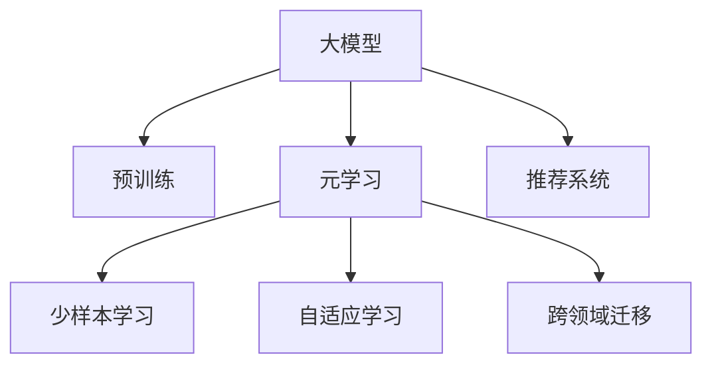

                 

## 1. 背景介绍

### 1.1 问题由来
推荐系统在电商、社交网络、视频流媒体等众多领域中扮演着重要角色。传统推荐系统往往依赖于用户历史行为数据进行协同过滤，难以拓展到冷启动用户或物品。基于深度学习的方法，特别是神经网络模型，为推荐系统带来了新的思路。通过大规模预训练模型，可以捕捉到用户和物品间的复杂语义关联，实现更精准的推荐。

### 1.2 问题核心关键点
大模型的应用提升了推荐系统的精度和覆盖率，但也带来了一系列的挑战，如高计算成本、难以扩展、过拟合等问题。针对这些问题，研究人员提出了元学习(或称Meta Learning)方法，通过学习模型如何适应新的推荐任务，减少过拟合和计算成本，提升模型泛化能力。

元学习是一种多任务学习(multi-task learning)的变体，旨在提升模型在新任务上的表现，通过从大量任务中学习到共有规律。推荐系统中的元学习指的是，通过预训练模型对多个推荐任务进行学习，进而适应新的推荐任务，提高推荐效率和效果。

### 1.3 问题研究意义
研究大模型在推荐系统中的元学习应用，对于拓展推荐系统应用的边界，提升推荐精度和覆盖率，加速推荐系统技术的产业化进程，具有重要意义：

1. 降低推荐系统开发成本。利用大模型预训练特征提取能力，可以显著减少从头开发所需的数据、计算和人力等成本投入。
2. 提升推荐系统效果。元学习方法可以提高模型泛化能力，对新任务也有较好的适应能力，在推荐场景中取得更优表现。
3. 加速推荐系统开发进度。通过元学习范式，可以更快地实现任务适配，缩短开发周期。
4. 带来技术创新。元学习引发了对预训练-微调的深入研究，催生了少样本学习、自适应学习等新的研究方向。
5. 赋能推荐系统升级。元学习使得推荐系统技术更容易被各行各业所采用，为传统行业数字化转型升级提供新的技术路径。

## 2. 核心概念与联系

### 2.1 核心概念概述

为更好地理解大模型在推荐系统中的元学习应用，本节将介绍几个密切相关的核心概念：

- 大模型(Large Model)：以自回归(如GPT)或自编码(如BERT)模型为代表的大规模预训练模型。通过在大规模无标签文本语料上进行预训练，学习到丰富的语言和语义知识。

- 预训练(Pre-training)：指在大规模无标签文本语料上，通过自监督学习任务训练通用模型参数的过程。常见的预训练任务包括言语建模、遮挡语言模型等。

- 元学习(Meta Learning)：指学习模型如何适应新的任务，利用少量标注数据加速新任务学习的方法。通过从多任务中学习到共有规律，提升新任务的泛化能力。

- 推荐系统(Recommendation System)：基于用户行为数据和物品特征数据，为用户推荐可能感兴趣的物品的系统。

- 少样本学习(Few-shot Learning)：指在只有少量标注样本的情况下，模型能够快速适应新任务的学习方法。在推荐系统领域，意味着可以在有限的用户行为数据上训练推荐模型。

- 自适应学习(Adaptive Learning)：指模型能够自动调整学习策略，适应当前任务和学习环境的变化。

- 跨领域迁移(Cross-Domain Transfer)：指模型能够在不同领域之间迁移学习，提升跨领域的推荐能力。

这些核心概念之间的逻辑关系可以通过以下Mermaid流程图来展示：



这个流程图展示了大模型在推荐系统中的元学习关键概念及其之间的关系：

1. 大模型通过预训练获得基础能力。
2. 元学习在预训练的基础上，学习模型如何适应推荐任务，减少过拟合。
3. 少样本学习通过有限标注数据快速训练模型，适应新任务。
4. 自适应学习让模型能动态调整学习策略，提升对新场景的适应性。
5. 跨领域迁移让模型在不同推荐场景间灵活迁移，提高泛化能力。

这些概念共同构成了大模型在推荐系统中的元学习框架，使其能够在推荐任务中充分发挥其强大的知识获取能力。通过理解这些核心概念，我们可以更好地把握大模型在推荐系统中的应用原理和优化方向。

## 3. 核心算法原理 & 具体操作步骤
### 3.1 算法原理概述

基于大模型在推荐系统中的元学习应用，本质上是将大模型作为元学习器的过程。其核心思想是：通过在多个推荐任务上预训练大模型，学习到模型如何适应新的推荐场景，然后在新任务上进行少样本微调，提升推荐效果。

形式化地，假设存在$K$个推荐任务，记预训练模型为 $M_{\theta}$，其中 $\theta$ 为预训练得到的模型参数。给定推荐任务 $T_k$ 的标注数据集 $D_k=\{(x_i, y_i)\}_{i=1}^{N_k}$，元学习器的目标是最小化所有任务上的损失函数，即：

$$
\mathop{\min}_{\theta} \sum_{k=1}^K \mathcal{L}_k(M_{\theta},D_k)
$$

其中 $\mathcal{L}_k$ 为针对任务 $T_k$ 设计的损失函数，用于衡量模型预测输出与真实标签之间的差异。常见的损失函数包括交叉熵损失、均方误差损失等。

通过梯度下降等优化算法，元学习过程不断更新模型参数 $\theta$，最小化损失函数 $\mathcal{L}$，使得模型输出逼近真实标签。由于 $\theta$ 已经通过预训练获得了较好的初始化，因此即便在新任务上，模型也能较快收敛到理想的元参数 $\hat{\theta}$。

### 3.2 算法步骤详解

基于大模型在推荐系统中的元学习应用一般包括以下几个关键步骤：

**Step 1: 准备预训练模型和数据集**
- 选择合适的预训练语言模型 $M_{\theta}$ 作为初始化参数，如 BERT、GPT 等。
- 准备推荐任务 $T_k$ 的标注数据集 $D_k$，划分为训练集、验证集和测试集。一般要求标注数据与预训练数据的分布不要差异过大。

**Step 2: 设计元学习目标函数**
- 根据推荐任务特点，设计元学习目标函数，如MAML(Meta-Learning by Model-Agnostic Meta-Learning)等。目标函数用于衡量模型在新任务上的泛化能力。

**Step 3: 设置元学习超参数**
- 选择合适的元学习算法及其参数，如 MAML 的模型初始化、迭代次数、批量大小等。
- 设置模型正则化技术及强度，包括权重衰减、Dropout、Early Stopping 等。

**Step 4: 执行元学习训练**
- 将训练集数据分批次输入模型，前向传播计算损失函数。
- 反向传播计算参数梯度，根据设定的元学习算法更新模型参数。
- 周期性在验证集上评估模型性能，根据性能指标决定是否触发 Early Stopping。
- 重复上述步骤直到满足预设的迭代轮数或 Early Stopping 条件。

**Step 5: 任务适配与微调**
- 选择待适配的任务 $T_m$，利用微调模型 $M_{\hat{\theta}}$ 在 $T_m$ 上快速完成训练。
- 应用适当的微调策略，如全参数微调、参数高效微调等。
- 使用少量标注数据快速适应新任务，提升推荐效果。

**Step 6: 测试和部署**
- 在测试集上评估元学习后模型 $M_{\hat{\theta}}$ 的性能，对比元学习前后的精度提升。
- 使用元学习后的模型对新用户和新物品进行推荐，集成到实际的应用系统中。
- 持续收集新的用户行为数据，定期重新进行元学习和微调，以适应数据分布的变化。

以上是基于大模型在推荐系统中的元学习应用的一般流程。在实际应用中，还需要针对具体任务的特点，对元学习过程的各个环节进行优化设计，如改进元学习目标函数，引入更多的正则化技术，搜索最优的超参数组合等，以进一步提升模型性能。

### 3.3 算法优缺点

基于大模型在推荐系统中的元学习应用具有以下优点：
1. 泛化能力强。通过在多个任务上学习，模型能够更好地适应新任务，减少过拟合。
2. 适应性好。对不同推荐场景的微调适应能力强，能够快速学习新场景特征。
3. 训练效率高。少样本学习使得模型在有限标注数据下也能快速训练，缩短了微调时间。
4. 效果显著。元学习使得模型在推荐系统中的效果显著提升，尤其是在推荐多样性和覆盖率上。

同时，该方法也存在一定的局限性：
1. 数据依赖性强。模型依赖于足够的标注数据，数据不足时表现可能不佳。
2. 领域相关性。模型需要在新任务的数据分布与预训练任务相似时，才能有效迁移学习。
3. 高维模型复杂度。大模型的复杂度较高，训练和推理资源消耗大。
4. 计算成本高。元学习需要大量的计算资源，不适合对实时性要求高的场景。
5. 稳定性问题。模型在不同场景下的适应性需要进一步研究，避免过拟合或欠拟合。

尽管存在这些局限性，但就目前而言，基于大模型的元学习应用是推荐系统领域的一个重要趋势，并在多个应用场景中取得了显著的成效。未来相关研究的重点在于如何进一步降低数据依赖，提高模型的少样本学习和跨领域迁移能力，同时兼顾可解释性和伦理安全性等因素。

### 3.4 算法应用领域

基于大模型在推荐系统中的元学习应用，已经在多个推荐领域得到广泛应用，涵盖了大部分常见的推荐任务，例如：

- 基于内容的推荐：如电商网站推荐、新闻内容推荐等。通过分析用户历史行为数据，预测用户可能感兴趣的内容。
- 协同过滤推荐：如社交网络推荐、电影推荐等。通过分析用户行为和物品间的协同关系，预测用户未交互物品的评分。
- 混合推荐系统：结合基于内容的推荐和协同过滤推荐，提升推荐效果。
- 个性化推荐：针对不同用户的独特需求，提供个性化的推荐内容。
- 实时推荐系统：实现基于用户实时行为的动态推荐，提升推荐时效性。

除了上述这些经典任务外，大模型在元学习框架下，还可以应用于新的推荐场景中，如推荐解释系统、推荐多样性优化、推荐知识图谱等，为推荐系统带来更多的创新可能。

## 4. 数学模型和公式 & 详细讲解 & 举例说明
### 4.1 数学模型构建

本节将使用数学语言对基于大模型在推荐系统中的元学习应用过程进行更加严格的刻画。

记推荐任务 $T_k$ 的标注数据集为 $D_k=\{(x_i,y_i)\}_{i=1}^{N_k}$，其中 $x_i$ 为用户历史行为数据， $y_i$ 为物品评分。假设元学习模型为 $M_{\theta}$，其中 $\theta$ 为元学习得到的模型参数。

定义元学习目标函数为：

$$
\mathcal{L}_{meta}(\theta) = \mathbb{E}_{(x,y) \sim D_k} [\mathcal{L}_k(M_{\theta}(x),y)]
$$

其中，$\mathbb{E}_{(x,y) \sim D_k}$ 表示在数据集 $D_k$ 上进行期望计算。

元学习器的目标是最小化目标函数 $\mathcal{L}_{meta}$，即：

$$
\theta^* = \mathop{\arg\min}_{\theta} \mathcal{L}_{meta}(\theta)
$$

在实践中，我们通常使用基于梯度的优化算法（如SGD、Adam等）来近似求解上述最优化问题。设 $\eta$ 为学习率，$\lambda$ 为正则化系数，则参数的更新公式为：

$$
\theta \leftarrow \theta - \eta \nabla_{\theta}\mathcal{L}_{meta}(\theta) - \eta\lambda\theta
$$

其中 $\nabla_{\theta}\mathcal{L}_{meta}(\theta)$ 为元学习目标函数对参数 $\theta$ 的梯度，可通过反向传播算法高效计算。

### 4.2 公式推导过程

以下我们以基于内容的推荐任务为例，推导元学习目标函数及其梯度的计算公式。

假设推荐模型 $M_{\theta}$ 对用户行为数据 $x$ 的预测输出为 $\hat{y}=M_{\theta}(x) \in [0,1]$，表示物品评分。真实评分 $y \in [0,1]$。则推荐模型的损失函数定义为：

$$
\ell_k(M_{\theta}(x),y) = -[y\log \hat{y} + (1-y)\log (1-\hat{y})]
$$

将其代入元学习目标函数，得：

$$
\mathcal{L}_{meta}(\theta) = -\mathbb{E}_{(x,y) \sim D_k} [y\log \hat{y} + (1-y)\log (1-\hat{y})]
$$

根据链式法则，元学习目标函数对参数 $\theta_k$ 的梯度为：

$$
\frac{\partial \mathcal{L}_{meta}(\theta)}{\partial \theta_k} = -\frac{1}{N_k}\sum_{i=1}^{N_k} (\frac{y_i}{M_{\theta}(x_i)}-\frac{1-y_i}{1-M_{\theta}(x_i)}) \frac{\partial M_{\theta}(x_i)}{\partial \theta_k}
$$

其中 $\frac{\partial M_{\theta}(x_i)}{\partial \theta_k}$ 可进一步递归展开，利用自动微分技术完成计算。

在得到元学习目标函数的梯度后，即可带入参数更新公式，完成模型的迭代优化。重复上述过程直至收敛，最终得到适应推荐任务的最优元参数 $\theta^*$。

## 5. 项目实践：代码实例和详细解释说明
### 5.1 开发环境搭建

在进行元学习实践前，我们需要准备好开发环境。以下是使用Python进行PyTorch开发的环境配置流程：

1. 安装Anaconda：从官网下载并安装Anaconda，用于创建独立的Python环境。

2. 创建并激活虚拟环境：
```bash
conda create -n pytorch-env python=3.8 
conda activate pytorch-env
```

3. 安装PyTorch：根据CUDA版本，从官网获取对应的安装命令。例如：
```bash
conda install pytorch torchvision torchaudio cudatoolkit=11.1 -c pytorch -c conda-forge
```

4. 安装Transformers库：
```bash
pip install transformers
```

5. 安装各类工具包：
```bash
pip install numpy pandas scikit-learn matplotlib tqdm jupyter notebook ipython
```

完成上述步骤后，即可在`pytorch-env`环境中开始元学习实践。

### 5.2 源代码详细实现

这里我们以基于内容的推荐系统为例，给出使用Transformers库对BERT模型进行元学习的PyTorch代码实现。

首先，定义推荐任务的数据处理函数：

```python
from transformers import BertTokenizer
from torch.utils.data import Dataset
import torch

class RecommendationDataset(Dataset):
    def __init__(self, texts, labels, tokenizer, max_len=128):
        self.texts = texts
        self.labels = labels
        self.tokenizer = tokenizer
        self.max_len = max_len
        
    def __len__(self):
        return len(self.texts)
    
    def __getitem__(self, item):
        text = self.texts[item]
        label = self.labels[item]
        
        encoding = self.tokenizer(text, return_tensors='pt', max_length=self.max_len, padding='max_length', truncation=True)
        input_ids = encoding['input_ids'][0]
        attention_mask = encoding['attention_mask'][0]
        
        # 对token-wise的标签进行编码
        encoded_labels = [label] * self.max_len
        labels = torch.tensor(encoded_labels, dtype=torch.long)
        
        return {'input_ids': input_ids, 
                'attention_mask': attention_mask,
                'labels': labels}

# 标签与id的映射
label2id = {'bad': 0, 'good': 1}
id2label = {v: k for k, v in label2id.items()}

# 创建dataset
tokenizer = BertTokenizer.from_pretrained('bert-base-cased')

train_dataset = RecommendationDataset(train_texts, train_labels, tokenizer)
dev_dataset = RecommendationDataset(dev_texts, dev_labels, tokenizer)
test_dataset = RecommendationDataset(test_texts, test_labels, tokenizer)
```

然后，定义模型和优化器：

```python
from transformers import BertForRegression, AdamW

model = BertForRegression.from_pretrained('bert-base-cased')

optimizer = AdamW(model.parameters(), lr=2e-5)
```

接着，定义元学习训练函数：

```python
from torch.utils.data import DataLoader
from tqdm import tqdm
from sklearn.metrics import mean_squared_error

device = torch.device('cuda') if torch.cuda.is_available() else torch.device('cpu')
model.to(device)

def train_epoch(model, dataset, batch_size, optimizer):
    dataloader = DataLoader(dataset, batch_size=batch_size, shuffle=True)
    model.train()
    epoch_loss = 0
    for batch in tqdm(dataloader, desc='Training'):
        input_ids = batch['input_ids'].to(device)
        attention_mask = batch['attention_mask'].to(device)
        labels = batch['labels'].to(device)
        model.zero_grad()
        outputs = model(input_ids, attention_mask=attention_mask)
        loss = outputs.loss
        epoch_loss += loss.item()
        loss.backward()
        optimizer.step()
    return epoch_loss / len(dataloader)

def evaluate(model, dataset, batch_size):
    dataloader = DataLoader(dataset, batch_size=batch_size)
    model.eval()
    preds, labels = [], []
    with torch.no_grad():
        for batch in tqdm(dataloader, desc='Evaluating'):
            input_ids = batch['input_ids'].to(device)
            attention_mask = batch['attention_mask'].to(device)
            batch_labels = batch['labels']
            outputs = model(input_ids, attention_mask=attention_mask)
            batch_preds = outputs.logits.mean(dim=1).to('cpu').tolist()
            batch_labels = batch_labels.to('cpu').tolist()
            for pred, label in zip(batch_preds, batch_labels):
                preds.append(pred)
                labels.append(label)
                
    print(mean_squared_error(labels, preds))
```

最后，启动元学习流程并在测试集上评估：

```python
epochs = 5
batch_size = 16

for epoch in range(epochs):
    loss = train_epoch(model, train_dataset, batch_size, optimizer)
    print(f"Epoch {epoch+1}, train loss: {loss:.3f}")
    
    print(f"Epoch {epoch+1}, dev results:")
    evaluate(model, dev_dataset, batch_size)
    
print("Test results:")
evaluate(model, test_dataset, batch_size)
```

以上就是使用PyTorch对BERT进行基于内容的推荐系统元学习的完整代码实现。可以看到，得益于Transformers库的强大封装，我们可以用相对简洁的代码完成BERT模型的元学习。

### 5.3 代码解读与分析

让我们再详细解读一下关键代码的实现细节：

**RecommendationDataset类**：
- `__init__`方法：初始化用户行为数据、评分标签、分词器等关键组件。
- `__len__`方法：返回数据集的样本数量。
- `__getitem__`方法：对单个样本进行处理，将用户行为数据输入编码为token ids，将评分标签编码为数字，并对其进行定长padding，最终返回模型所需的输入。

**label2id和id2label字典**：
- 定义了评分标签与数字id之间的映射关系，用于将token-wise的预测结果解码回真实的评分。

**元学习训练函数**：
- 使用PyTorch的DataLoader对数据集进行批次化加载，供模型训练和推理使用。
- 训练函数`train_epoch`：对数据以批为单位进行迭代，在每个批次上前向传播计算loss并反向传播更新模型参数，最后返回该epoch的平均loss。
- 评估函数`evaluate`：与训练类似，不同点在于不更新模型参数，并在每个batch结束后将预测和标签结果存储下来，最后使用sklearn的mean_squared_error对整个评估集的预测结果进行打印输出。

**元学习流程**：
- 定义总的epoch数和batch size，开始循环迭代
- 每个epoch内，先在训练集上训练，输出平均loss
- 在验证集上评估，输出评分均方误差
- 所有epoch结束后，在测试集上评估，给出最终测试结果

可以看到，PyTorch配合Transformers库使得BERT元学习的代码实现变得简洁高效。开发者可以将更多精力放在数据处理、模型改进等高层逻辑上，而不必过多关注底层的实现细节。

当然，工业级的系统实现还需考虑更多因素，如模型的保存和部署、超参数的自动搜索、更灵活的任务适配层等。但核心的元学习范式基本与此类似。

## 6. 实际应用场景
### 6.1 智能客服系统

基于大模型在推荐系统中的元学习应用，智能客服系统可以更好地适应用户需求变化，提升客户服务体验。传统的客服系统往往需要配备大量人力，高峰期响应缓慢，且服务质量难以保证。通过元学习，系统可以根据用户历史交互数据进行个性化推荐，及时引导用户解决问题，提高客服效率。

在技术实现上，可以收集用户对话记录，将常见问题和最佳回答构建成监督数据，在此基础上对预训练对话模型进行元学习。元学习后的模型能够自动理解用户意图，匹配最合适的回答模板，提升服务质量。对于客户提出的新问题，还可以接入检索系统实时搜索相关内容，动态组织生成回答。如此构建的智能客服系统，能大幅提升客户咨询体验和问题解决效率。

### 6.2 个性化推荐系统

基于大模型在推荐系统中的元学习应用，个性化推荐系统可以更好地挖掘用户兴趣，提高推荐效果。传统的推荐系统往往只依赖用户历史行为数据进行协同过滤，难以拓展到冷启动用户或物品。通过元学习，模型可以从多个推荐任务中学习到共有规律，对新任务也有较好的适应能力，在推荐系统中的应用场景中取得更优表现。

在实践中，可以收集用户浏览、点击、评论、分享等行为数据，提取和用户交互的物品标题、描述、标签等文本内容。将文本内容作为模型输入，用户的后续行为（如是否点击、购买等）作为监督信号，在此基础上元学习预训练语言模型。元学习后的模型能够从文本内容中准确把握用户的兴趣点。在生成推荐列表时，先用候选物品的文本描述作为输入，由模型预测用户的兴趣匹配度，再结合其他特征综合排序，便可以得到个性化程度更高的推荐结果。

### 6.3 广告推荐系统

基于大模型在推荐系统中的元学习应用，广告推荐系统可以实现更精准的广告投放。传统的广告推荐系统往往依赖用户历史行为数据进行精准投放，难以适应新用户和新场景。通过元学习，系统可以从多个广告投放任务中学习到推荐策略，对新任务也有较好的适应能力。

在实践中，可以收集用户浏览行为数据，提取用户对广告的点击、浏览、停留时长等特征。将用户特征作为模型输入，广告的点击率作为监督信号，在此基础上元学习预训练模型。元学习后的模型能够从用户行为数据中挖掘出广告推荐策略，对新用户和新场景也有较好的适应能力，提升广告点击率和转化率。

### 6.4 未来应用展望

随着大模型在推荐系统中的应用不断深入，未来在多个领域中都将出现基于元学习的推荐系统应用，为传统行业带来变革性影响。

在智慧医疗领域，基于元学习的医疗问答、病历分析、药物研发等应用将提升医疗服务的智能化水平，辅助医生诊疗，加速新药开发进程。

在智能教育领域，元学习可应用于作业批改、学情分析、知识推荐等方面，因材施教，促进教育公平，提高教学质量。

在智慧城市治理中，元学习可以实现城市事件监测、舆情分析、应急指挥等环节，提高城市管理的自动化和智能化水平，构建更安全、高效的未来城市。

此外，在企业生产、社会治理、文娱传媒等众多领域，基于大模型元学习的人工智能应用也将不断涌现，为经济社会发展注入新的动力。相信随着技术的日益成熟，元学习方法将成为推荐系统落地的重要范式，推动人工智能技术在垂直行业的规模化落地。

## 7. 工具和资源推荐
### 7.1 学习资源推荐

为了帮助开发者系统掌握大模型在推荐系统中的元学习理论基础和实践技巧，这里推荐一些优质的学习资源：

1. 《深度学习在推荐系统中的应用》系列博文：由深度学习领域专家撰写，深入浅出地介绍了深度学习在推荐系统中的多种应用方式，包括元学习。

2. CS231n《深度学习在视觉识别与推理中的应用》课程：斯坦福大学开设的视觉领域明星课程，涵盖视觉领域的深度学习基础和应用，如视觉推荐系统。

3. 《Reinforcement Learning: An Introduction》书籍：强化学习领域奠基性书籍，介绍了强化学习在推荐系统中的应用，如基于奖励学习的推荐算法。

4. Coursera《机器学习》课程：由斯坦福大学教授Andrew Ng主讲的机器学习课程，系统介绍了机器学习的基础理论和经典算法，适合初学者入门。

5. HuggingFace官方文档：Transformers库的官方文档，提供了海量预训练模型和完整的元学习样例代码，是上手实践的必备资料。

通过对这些资源的学习实践，相信你一定能够快速掌握大模型在推荐系统中的元学习精髓，并用于解决实际的推荐问题。
###  7.2 开发工具推荐

高效的开发离不开优秀的工具支持。以下是几款用于大模型在推荐系统中的元学习开发的常用工具：

1. PyTorch：基于Python的开源深度学习框架，灵活动态的计算图，适合快速迭代研究。大部分预训练语言模型都有PyTorch版本的实现。

2. TensorFlow：由Google主导开发的开源深度学习框架，生产部署方便，适合大规模工程应用。同样有丰富的预训练语言模型资源。

3. Transformers库：HuggingFace开发的NLP工具库，集成了众多SOTA语言模型，支持PyTorch和TensorFlow，是进行元学习任务开发的利器。

4. Weights & Biases：模型训练的实验跟踪工具，可以记录和可视化模型训练过程中的各项指标，方便对比和调优。与主流深度学习框架无缝集成。

5. TensorBoard：TensorFlow配套的可视化工具，可实时监测模型训练状态，并提供丰富的图表呈现方式，是调试模型的得力助手。

6. Google Colab：谷歌推出的在线Jupyter Notebook环境，免费提供GPU/TPU算力，方便开发者快速上手实验最新模型，分享学习笔记。

合理利用这些工具，可以显著提升大模型在推荐系统中的元学习任务的开发效率，加快创新迭代的步伐。

### 7.3 相关论文推荐

大模型在推荐系统中的元学习应用源于学界的持续研究。以下是几篇奠基性的相关论文，推荐阅读：

1. Meta-Learning with Low-Power Neural Networks: A Unified Approach (MAML)：提出了基于模型无关的元学习算法，具有较强的泛化能力和模型适配性。

2. Feature Boosting for Learning with Feature Hypotheses: A Meta-Learning Approach (FBL)：引入特征增强策略，通过元学习模型在多任务上学习特征权重，提升新任务的性能。

3. Human-in-the-loop Reinforcement Learning for Recommendation Systems (HRL)：引入人类参与的强化学习，通过人类反馈优化推荐模型，提升用户体验。

4. Domain-Adaptive Meta-Learning for Personalized Recommendation (DAM)：提出领域自适应元学习算法，提升跨领域推荐效果。

5. Meta-Learning by Learning from Diverse Tasks (MLDA)：通过多任务数据集训练元学习模型，提升新任务的泛化能力。

这些论文代表了大模型在推荐系统中的元学习发展脉络。通过学习这些前沿成果，可以帮助研究者把握学科前进方向，激发更多的创新灵感。

## 8. 总结：未来发展趋势与挑战
### 8.1 总结

本文对大模型在推荐系统中的元学习应用进行了全面系统的介绍。首先阐述了大模型和元学习的相关概念，明确了元学习在推荐系统中的应用价值和效果。其次，从原理到实践，详细讲解了元学习的数学原理和关键步骤，给出了元学习任务开发的完整代码实例。同时，本文还广泛探讨了元学习方法在智能客服、个性化推荐、广告推荐等多个推荐领域的应用前景，展示了元学习范式的广泛应用。

通过本文的系统梳理，可以看到，基于大模型的元学习应用已经逐步成为推荐系统的重要范式，极大地拓展了推荐系统应用的边界，催生了更多的落地场景。受益于大模型的强大特征提取能力，元学习推荐系统在推荐精度和覆盖率上取得了显著的效果，提升了推荐系统技术在产业界的落地能力。未来，伴随元学习方法的持续演进，推荐系统技术必将在更多领域中发挥更大的作用，推动人工智能技术在各个行业的普及应用。

### 8.2 未来发展趋势

展望未来，大模型在推荐系统中的元学习应用将呈现以下几个发展趋势：

1. 模型规模持续增大。随着算力成本的下降和数据规模的扩张，预训练语言模型的参数量还将持续增长。超大规模语言模型蕴含的丰富语言知识，有望支撑更加复杂多变的推荐任务。

2. 元学习算法多样性。除了传统的MAML外，未来会涌现更多元学习算法，如FBL、DAM等，根据任务特点选择最优算法，进一步提升模型性能。

3. 元学习框架可扩展性。元学习框架应能够支持更多推荐任务和更多用户行为数据类型，提高模型泛化能力。

4. 自适应元学习。模型能够根据任务和学习环境变化动态调整学习策略，提升新任务的表现。

5. 跨领域元学习。模型能够在不同推荐场景间灵活迁移学习，提高泛化能力。

6. 自监督元学习。模型可以利用少量标注数据进行训练，降低推荐系统的开发成本。

以上趋势凸显了大模型在推荐系统中的元学习应用的广阔前景。这些方向的探索发展，必将进一步提升推荐系统的效果和应用范围，为人工智能技术在垂直行业的规模化落地提供新的动力。

### 8.3 面临的挑战

尽管大模型在推荐系统中的应用取得了初步成功，但在迈向更加智能化、普适化应用的过程中，它仍面临着诸多挑战：

1. 数据依赖性强。模型依赖于足够的标注数据，数据不足时表现可能不佳。

2. 领域相关性。模型需要在新任务的数据分布与预训练任务相似时，才能有效迁移学习。

3. 高维模型复杂度。大模型的复杂度较高，训练和推理资源消耗大。

4. 计算成本高。元学习需要大量的计算资源，不适合对实时性要求高的场景。

5. 稳定性问题。模型在不同场景下的适应性需要进一步研究，避免过拟合或欠拟合。

6. 知识整合能力不足。现有的元学习模型往往局限于任务内数据，难以灵活吸收和运用更广泛的先验知识。

尽管存在这些挑战，但随着研究者的不懈努力，大模型在推荐系统中的元学习应用必将在不断改进和完善中取得更大的突破，进一步推动推荐系统技术的成熟和应用落地。

### 8.4 研究展望

面向未来，大模型在推荐系统中的元学习应用需要从以下几个方面进行深入研究：

1. 探索无监督和半监督元学习方法。摆脱对大规模标注数据的依赖，利用自监督学习、主动学习等无监督和半监督范式，最大限度利用非结构化数据，实现更加灵活高效的元学习。

2. 研究参数高效和计算高效的元学习范式。开发更加参数高效的元学习算法，在固定大部分预训练参数的同时，只更新极少量的任务相关参数。同时优化元学习模型的计算图，减少前向传播和反向传播的资源消耗，实现更加轻量级、实时性的部署。

3. 融合因果和对比学习范式。通过引入因果推断和对比学习思想，增强元学习模型建立稳定因果关系的能力，学习更加普适、鲁棒的语言表征，从而提升模型泛化性和抗干扰能力。

4. 引入更多先验知识。将符号化的先验知识，如知识图谱、逻辑规则等，与神经网络模型进行巧妙融合，引导元学习过程学习更准确、合理的语言模型。同时加强不同模态数据的整合，实现视觉、语音等多模态信息与文本信息的协同建模。

5. 结合因果分析和博弈论工具。将因果分析方法引入元学习模型，识别出模型决策的关键特征，增强输出解释的因果性和逻辑性。借助博弈论工具刻画人机交互过程，主动探索并规避模型的脆弱点，提高系统稳定性。

6. 纳入伦理道德约束。在元学习目标函数中引入伦理导向的评估指标，过滤和惩罚有偏见、有害的输出倾向。同时加强人工干预和审核，建立元学习模型的监管机制，确保输出符合人类价值观和伦理道德。

这些研究方向的探索，必将引领元学习在推荐系统中的新一轮发展，为构建安全、可靠、可解释、可控的智能系统铺平道路。面向未来，大模型在推荐系统中的元学习应用需要与其他人工智能技术进行更深入的融合，如知识表示、因果推理、强化学习等，多路径协同发力，共同推动推荐系统技术的进步。只有勇于创新、敢于突破，才能不断拓展语言模型的边界，让智能技术更好地造福人类社会。

## 9. 附录：常见问题与解答

**Q1：什么是元学习？元学习在推荐系统中的应用有什么优势？**

A: 元学习是指让模型能够通过学习如何适应新的任务，从而提升模型在新任务上的性能。在推荐系统中的应用主要体现在以下几个方面：
1. 泛化能力强。元学习模型能够从多个推荐任务中学习到共有规律，对新任务也有较好的适应能力。
2. 适应性好。元学习模型能够根据任务和学习环境变化动态调整学习策略，提升新任务的泛化能力。
3. 训练效率高。元学习模型可以利用少量标注数据进行训练，降低推荐系统的开发成本。

**Q2：元学习在推荐系统中的应用流程是什么？**

A: 元学习在推荐系统中的应用流程主要包括以下几个步骤：
1. 准备预训练模型和数据集：选择合适的预训练语言模型作为初始化参数，准备推荐任务的数据集。
2. 设计元学习目标函数：根据推荐任务特点，设计元学习目标函数，如MAML等。
3. 设置元学习超参数：选择合适的元学习算法及其参数，如MAML的模型初始化、迭代次数、批量大小等。
4. 执行元学习训练：对数据以批为单位进行迭代，在每个批次上前向传播计算loss并反向传播更新模型参数，最后返回该epoch的平均loss。
5. 任务适配与微调：选择待适配的任务，利用元学习后的模型在新的推荐任务上进行微调，提升推荐效果。
6. 测试和部署：在测试集上评估元学习后模型性能，对比元学习前后的精度提升。

**Q3：元学习在推荐系统中的应用是否需要大量的标注数据？**

A: 元学习在推荐系统中的应用通常依赖于足够的标注数据，特别是在初始的元学习阶段。但在微调阶段，元学习模型可以利用少量标注数据进行快速适应，提升推荐效果。因此，元学习在推荐系统中的应用需要权衡标注数据和模型泛化能力。

**Q4：元学习在推荐系统中的计算成本是否过高？**

A: 元学习在推荐系统中的应用需要大量的计算资源，特别是在元学习阶段。但元学习模型在微调阶段可以利用少样本学习，快速适应新任务，降低计算成本。因此，元学习在推荐系统中的应用需要综合考虑计算成本和推荐效果。

**Q5：元学习在推荐系统中的推荐效果如何？**

A: 元学习在推荐系统中的应用能够提升推荐精度和覆盖率，尤其是在推荐多样性和交叉领域推荐等方面表现优异。但元学习的效果也受限于数据质量和模型设计，需要在实践中不断优化。

---

作者：禅与计算机程序设计艺术 / Zen and the Art of Computer Programming

