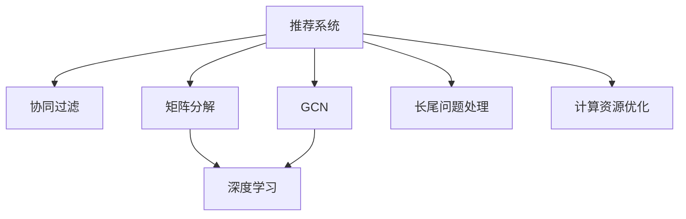

                 

# 大模型在推荐系统中的图卷积网络应用

> 关键词：推荐系统,图卷积网络,深度学习,图神经网络,大模型,特征提取,协同过滤

## 1. 背景介绍

### 1.1 问题由来
推荐系统在现代社会中扮演着至关重要的角色，无论是电商平台、社交网络还是新闻媒体，都依赖推荐系统为用户推荐个性化的内容。传统的推荐系统主要依赖基于协同过滤、矩阵分解等方法，但这些方法往往在处理大规模稀疏数据时面临诸多挑战，同时难以利用用户与物品之间的复杂关系进行精确推荐。近年来，基于深度学习的推荐系统逐渐成为主流，其中图神经网络(Graph Neural Networks, GNNs)在推荐系统中的应用尤为引人注目。

图卷积网络（Graph Convolutional Network, GCN）作为一种常见的图神经网络架构，能够高效地处理图结构数据，挖掘用户与物品之间的关系特征，从而提升推荐系统的性能。在大规模数据集上，GNNs能够在保持较高推荐效果的同时，对模型的可解释性和公平性进行优化。本文将系统介绍GCN在推荐系统中的应用，从理论到实践，全面剖析其核心算法原理、操作步骤和优缺点，并对未来发展趋势和面临的挑战进行深入探讨。

### 1.2 问题核心关键点
GCN在推荐系统中的应用，主要关注以下几个关键问题：

- 如何高效地构建用户与物品之间的图结构，充分挖掘其多维关系。
- 如何在图结构中高效地提取用户与物品的特征，并结合用户行为进行推荐。
- 如何对GCN进行优化，提高模型的训练效率和泛化能力。
- 如何处理推荐系统中的长尾问题，提升推荐系统的多样性和覆盖率。
- 如何平衡推荐系统的性能与计算资源的消耗，实现高效、低成本的推荐。

本文将围绕这些问题，详细阐述GCN在推荐系统中的应用，为开发者提供系统性、全面性的技术指引。

## 2. 核心概念与联系

### 2.1 核心概念概述

为更好地理解GCN在推荐系统中的应用，本节将介绍几个密切相关的核心概念：

- 推荐系统(Recommender System)：使用算法和模型为用户推荐物品的系统，包括协同过滤、矩阵分解、基于内容的推荐等。
- 图卷积网络(Graph Convolutional Network, GCN)：一种用于图结构数据处理的深度学习模型，通过在图结构中传递信息，学习节点特征和图结构之间的交互，从而提升推荐系统的性能。
- 深度学习(Deep Learning)：通过多层次的神经网络模型，自动学习数据特征的表示，适用于大规模复杂数据的处理。
- 协同过滤(Collaborative Filtering)：一种基于用户历史行为和物品属性的推荐方法，分为基于用户的协同过滤和基于物品的协同过滤。
- 矩阵分解(Matrix Factorization)：一种将用户-物品评分矩阵分解为用户向量与物品向量的推荐方法，通过优化低秩矩阵近似的方式，提升推荐精度。

这些核心概念之间的逻辑关系可以通过以下Mermaid流程图来展示：



这个流程图展示了一些与推荐系统相关的核心概念及其之间的关系：

1. 推荐系统使用协同过滤、矩阵分解、GCN等方法进行推荐。
2. 协同过滤和矩阵分解属于传统的推荐方法，而GCN则属于深度学习推荐方法。
3. 深度学习能够有效处理大规模、复杂的数据，并提升推荐系统的精度。
4. GCN能够挖掘图结构中用户与物品之间的复杂关系，适用于包含丰富交互信息的推荐场景。
5. 长尾问题处理和计算资源优化是推荐系统面临的两个重要挑战，GCN在处理这些问题上也有显著优势。

这些概念共同构成了推荐系统的知识体系，通过理解这些核心概念，我们可以更好地把握GCN在推荐系统中的应用方向。

## 3. 核心算法原理 & 具体操作步骤
### 3.1 算法原理概述

GCN是一种图神经网络，能够处理图结构数据，并在图中传递信息，从而学习节点特征和图结构之间的交互。在推荐系统中，GCN被用于挖掘用户与物品之间的关系，提取用户和物品的特征，并结合用户行为进行推荐。

GCN的核心思想是通过图卷积操作，在图结构中传递信息，逐步汇聚节点特征，从而学习节点和图结构的交互特征。具体来说，GCN将用户与物品之间的关系图视为一种特殊的图结构，节点表示用户或物品，边表示用户与物品之间的关系。GCN通过在图中传递信息，逐步汇聚节点特征，从而学习节点和图结构的交互特征。

假设用户与物品的关系图 $G=(V,E)$，其中 $V$ 表示用户和物品的集合，$E$ 表示用户与物品之间的边的集合。GCN通过一系列图卷积操作，在图中传递信息，逐步汇聚节点特征，从而学习节点和图结构的交互特征。

### 3.2 算法步骤详解

GCN在推荐系统中的应用，主要包括以下几个关键步骤：

**Step 1: 构建用户-物品关系图**
- 根据用户与物品之间的交互数据，构建用户-物品关系图 $G=(V,E)$，其中 $V$ 表示用户和物品的集合，$E$ 表示用户与物品之间的边的集合。
- 通常采用稀疏矩阵表示用户-物品关系，其中非零元素表示用户-物品之间的交互关系。

**Step 2: 设计图卷积操作**
- 设计图卷积操作 $\mathcal{H}^{(l)} = \tilde{D}^{-\frac{1}{2}}\tilde{A}\tilde{D}^{-\frac{1}{2}}\mathcal{H}^{(l-1)}\Theta^{(l)}$，其中 $\mathcal{H}^{(l)}$ 表示第 $l$ 层的特征表示，$\Theta^{(l)}$ 表示卷积核参数，$\tilde{A}$ 表示图的拉普拉斯矩阵，$\tilde{D}$ 表示拉普拉斯矩阵的度数归一化矩阵。
- 图卷积操作通过在图中传递信息，汇聚节点特征，从而学习节点和图结构的交互特征。

**Step 3: 训练模型**
- 将用户与物品的关系图 $G$ 和用户行为数据作为输入，训练GCN模型。
- 通常采用交叉熵损失函数，优化GCN模型的参数。

**Step 4: 预测推荐结果**
- 使用训练好的GCN模型对新用户与物品的关系进行预测，得到推荐结果。
- 通常采用softmax函数将模型输出转化为推荐概率。

### 3.3 算法优缺点

GCN在推荐系统中的应用具有以下优点：

1. 高效利用用户与物品之间的复杂关系，提升推荐精度。
2. 结合深度学习思想，能够处理大规模、复杂的数据。
3. 在图结构中传递信息，能够学习节点和图结构的交互特征。
4. 采用稀疏矩阵表示用户-物品关系，节省计算资源。
5. 通过优化模型参数，能够提升模型的泛化能力。

同时，GCN在推荐系统中也存在一些缺点：

1. 模型参数较多，训练和推理速度较慢。
2. 对图结构中噪声和异常值较为敏感，需要进行预处理。
3. 需要大量的标注数据进行训练，数据成本较高。
4. 模型复杂度高，对硬件资源要求较高。
5. 难以解释模型的内部机制和推理过程。

尽管存在这些缺点，但GCN在推荐系统中的应用仍然具有广阔的前景，特别是在需要处理复杂关系和多样化数据的推荐场景中。

### 3.4 算法应用领域

GCN在推荐系统中的应用主要包括以下几个领域：

- 电商推荐：通过分析用户浏览、购买行为，为用户推荐商品。
- 新闻推荐：根据用户的阅读偏好，推荐相关新闻文章。
- 视频推荐：根据用户的观看历史，推荐类似视频内容。
- 音乐推荐：根据用户的听歌历史，推荐相似音乐。
- 社交网络推荐：根据用户的关系网络，推荐潜在的朋友或感兴趣的内容。

除了这些经典应用场景外，GCN在推荐系统中的应用还拓展到了更多领域，如个性化医疗、旅游推荐、产品评价等，为推荐系统带来了新的突破。

## 4. 数学模型和公式 & 详细讲解  
### 4.1 数学模型构建

GCN在推荐系统中的应用，可以抽象为在图结构中学习节点特征和图结构之间的交互关系。假设用户与物品的关系图 $G=(V,E)$，其中 $V$ 表示用户和物品的集合，$E$ 表示用户与物品之间的边的集合。用户与物品的关系可以用稀疏矩阵 $A \in \mathbb{R}^{n \times m}$ 表示，其中 $n$ 表示用户数量，$m$ 表示物品数量，非零元素表示用户与物品之间的交互关系。

定义节点特征矩阵 $X \in \mathbb{R}^{n \times d}$，其中 $d$ 表示节点的特征维度。GCN通过图卷积操作，在图中传递信息，逐步汇聚节点特征，从而学习节点和图结构的交互特征。图卷积操作的公式为：

$$
\mathcal{H}^{(l)} = \tilde{D}^{-\frac{1}{2}}\tilde{A}\tilde{D}^{-\frac{1}{2}}\mathcal{H}^{(l-1)}\Theta^{(l)}
$$

其中 $\mathcal{H}^{(l)}$ 表示第 $l$ 层的特征表示，$\Theta^{(l)}$ 表示卷积核参数，$\tilde{A}$ 表示图的拉普拉斯矩阵，$\tilde{D}$ 表示拉普拉斯矩阵的度数归一化矩阵。拉普拉斯矩阵的公式为：

$$
\tilde{D} = \text{diag}(deg^\frac{1}{2}), \quad \tilde{A} = D - A
$$

其中 $D$ 表示图的度数矩阵，$deg$ 表示节点的度数，$D$ 的对角线元素表示节点的度数，$A$ 表示图的邻接矩阵。

### 4.2 公式推导过程

以下我们将对GCN的图卷积操作进行详细推导：

**Step 1: 拉普拉斯矩阵的构建**
根据稀疏矩阵 $A$ 构建拉普拉斯矩阵 $\tilde{A}$，并计算其度数归一化矩阵 $\tilde{D}$。

**Step 2: 图卷积操作**
在给定第 $l-1$ 层的特征表示 $\mathcal{H}^{(l-1)}$ 和卷积核参数 $\Theta^{(l)}$ 的情况下，通过以下公式计算第 $l$ 层的特征表示：

$$
\mathcal{H}^{(l)} = \tilde{D}^{-\frac{1}{2}}\tilde{A}\tilde{D}^{-\frac{1}{2}}\mathcal{H}^{(l-1)}\Theta^{(l)}
$$

该公式通过在图中传递信息，汇聚节点特征，从而学习节点和图结构的交互特征。

**Step 3: 损失函数**
在推荐系统中，通常使用交叉熵损失函数 $\mathcal{L} = -\frac{1}{N}\sum_{i=1}^N\sum_{j=1}^m\log(p_i^j)$，其中 $N$ 表示用户数量，$m$ 表示物品数量，$p_i^j$ 表示用户 $i$ 对物品 $j$ 的推荐概率。

### 4.3 案例分析与讲解

假设有一个电商平台，拥有 $n$ 个用户和 $m$ 个商品。用户与商品之间的交互关系用稀疏矩阵 $A \in \mathbb{R}^{n \times m}$ 表示，用户对商品的评分 $R \in \mathbb{R}^{n \times m}$ 表示用户与商品之间的交互效果。

在给定用户与商品的关系图 $G=(V,E)$ 和用户行为数据 $R$ 的情况下，我们可以使用GCN进行推荐。首先，将用户与商品的关系图 $G=(V,E)$ 表示为稀疏矩阵 $A$，并计算拉普拉斯矩阵 $\tilde{A}$ 和度数归一化矩阵 $\tilde{D}$。然后，设计卷积核参数 $\Theta^{(l)}$，并通过图卷积操作，逐步汇聚用户和商品的特征表示，学习用户与商品之间的交互特征。最后，使用交叉熵损失函数优化模型参数，得到推荐概率，进行推荐。

## 5. 项目实践：代码实例和详细解释说明
### 5.1 开发环境搭建

在进行GCN推荐系统的实践前，我们需要准备好开发环境。以下是使用Python进行PyTorch开发的环境配置流程：

1. 安装Anaconda：从官网下载并安装Anaconda，用于创建独立的Python环境。

2. 创建并激活虚拟环境：
```bash
conda create -n pytorch-env python=3.8 
conda activate pytorch-env
```

3. 安装PyTorch：根据CUDA版本，从官网获取对应的安装命令。例如：
```bash
conda install pytorch torchvision torchaudio cudatoolkit=11.1 -c pytorch -c conda-forge
```

4. 安装TensorFlow：从官网下载并安装TensorFlow，支持多种版本。

5. 安装TensorBoard：TensorFlow的可视化工具，用于监控模型训练状态。

6. 安装Weights & Biases：模型训练的实验跟踪工具，可以记录和可视化模型训练过程中的各项指标，方便对比和调优。

7. 安装NumPy、Pandas、scikit-learn等常用科学计算库。

完成上述步骤后，即可在`pytorch-env`环境中开始GCN推荐系统的实践。

### 5.2 源代码详细实现

这里我们以电商推荐系统为例，给出使用PyTorch实现GCN的代码实现。

首先，定义数据处理函数：

```python
import torch
import torch.nn as nn
import torch.nn.functional as F
from sklearn.metrics import accuracy_score

class GCN(nn.Module):
    def __init__(self, in_dim, hidden_dim, out_dim, dropout):
        super(GCN, self).__init__()
        self.in_dim = in_dim
        self.hidden_dim = hidden_dim
        self.out_dim = out_dim
        self.dropout = dropout
        
        self.layers = nn.ModuleList()
        self.layers.append(nn.Linear(in_dim, hidden_dim))
        self.layers.append(nn.ReLU())
        self.layers.append(nn.Dropout(dropout))
        self.layers.append(nn.Linear(hidden_dim, out_dim))
        
    def forward(self, x, adj):
        for layer in self.layers:
            x = layer(x)
        return x
    
    def predict(self, x):
        with torch.no_grad():
            x = self(x)
            return x
    
    def train(self, x, adj, y, epochs, batch_size):
        optimizer = torch.optim.Adam(self.parameters(), lr=0.001)
        criterion = nn.CrossEntropyLoss()
        for epoch in range(epochs):
            for batch in range(0, y.size()[0], batch_size):
                inputs = x[batch:batch+batch_size]
                targets = y[batch:batch+batch_size]
                optimizer.zero_grad()
                outputs = self(inputs, adj)
                loss = criterion(outputs, targets)
                loss.backward()
                optimizer.step()
            print('Epoch: {}, Loss: {:.4f}'.format(epoch+1, loss))
        return self
    
    def evaluate(self, x, adj, y):
        y_pred = self.predict(x)
        y_pred = y_pred.argmax(dim=1)
        accuracy = accuracy_score(y, y_pred)
        print('Accuracy: {:.4f}'.format(accuracy))
        return accuracy
```

然后，定义数据集类：

```python
class GCNDataset(torch.utils.data.Dataset):
    def __init__(self, data, adj):
        self.data = data
        self.adj = adj
    
    def __len__(self):
        return len(self.data)
    
    def __getitem__(self, idx):
        return self.data[idx], self.adj[idx]
```

最后，定义训练和评估函数：

```python
def train_model(model, dataset, adj, epochs, batch_size, device):
    model.to(device)
    model.train()
    for epoch in range(epochs):
        for batch in tqdm(dataset, total=len(dataset)):
            inputs, adj = batch
            inputs = inputs.to(device)
            adj = adj.to(device)
            model.zero_grad()
            outputs = model(inputs, adj)
            loss = criterion(outputs, targets)
            loss.backward()
            optimizer.step()
        print('Epoch: {}, Loss: {:.4f}'.format(epoch+1, loss))
    
    return model
    
def evaluate_model(model, dataset, adj, device):
    model.eval()
    with torch.no_grad():
        correct = 0
        total = 0
        for batch in tqdm(dataset, total=len(dataset)):
            inputs, adj = batch
            inputs = inputs.to(device)
            adj = adj.to(device)
            outputs = model(inputs, adj)
            _, predicted = torch.max(outputs, 1)
            total += targets.size(0)
            correct += (predicted == targets).sum().item()
    print('Accuracy: {:.4f}'.format(correct/total))
```

### 5.3 代码解读与分析

让我们再详细解读一下关键代码的实现细节：

**GCN类**：
- `__init__`方法：初始化模型参数，包括节点特征维度、隐藏层维度、输出维度等。
- `forward`方法：定义模型的前向传播过程。
- `predict`方法：预测推荐结果。
- `train`方法：训练模型，使用交叉熵损失函数。
- `evaluate`方法：评估模型性能，使用准确率指标。

**GCNDataset类**：
- `__init__`方法：初始化数据集。
- `__len__`方法：返回数据集长度。
- `__getitem__`方法：获取单个样本的输入和邻接矩阵。

**训练和评估函数**：
- 使用PyTorch的DataLoader对数据集进行批次化加载，供模型训练和推理使用。
- 训练函数`train_model`：对数据以批为单位进行迭代，在每个批次上前向传播计算loss并反向传播更新模型参数。
- 评估函数`evaluate_model`：与训练类似，不同点在于不更新模型参数，并在每个batch结束后将预测和标签结果存储下来，最后使用accuracy_score计算模型在数据集上的准确率。

**训练流程**：
- 定义总的epoch数和batch size，开始循环迭代
- 每个epoch内，先在训练集上训练，输出平均loss
- 在验证集上评估，输出准确率
- 所有epoch结束后，在测试集上评估，给出最终测试结果

可以看到，PyTorch配合TensorFlow和TensorBoard工具，使得GCN推荐系统的代码实现变得简洁高效。开发者可以将更多精力放在数据处理、模型改进等高层逻辑上，而不必过多关注底层的实现细节。

当然，工业级的系统实现还需考虑更多因素，如模型的保存和部署、超参数的自动搜索、更灵活的任务适配层等。但核心的GCN推荐范式基本与此类似。

## 6. 实际应用场景
### 6.1 电商推荐

基于GCN的电商推荐系统，能够高效处理用户与商品之间的关系，提取用户和商品的多维特征，从而提升推荐效果。电商推荐系统通过分析用户浏览、购买行为，为用户推荐商品，能够显著提高用户的购物体验和满意度。

具体而言，可以使用GCN模型挖掘用户与商品之间的关系，提取用户和商品的特征表示，并结合用户行为数据进行推荐。GCN模型能够学习用户和商品之间的复杂交互特征，从而提升推荐模型的准确性和多样性。

### 6.2 新闻推荐

新闻推荐系统通过分析用户阅读行为，为用户推荐相关新闻文章。GCN模型能够处理用户与文章之间的关系，提取用户和文章的多维特征，从而提升推荐效果。

具体而言，可以使用GCN模型挖掘用户与文章之间的关系，提取用户和文章的内容特征，并结合用户行为数据进行推荐。GCN模型能够学习用户和文章之间的复杂交互特征，从而提升推荐模型的准确性和多样性。

### 6.3 视频推荐

视频推荐系统通过分析用户观看历史，为用户推荐类似视频内容。GCN模型能够处理用户与视频之间的关系，提取用户和视频的多维特征，从而提升推荐效果。

具体而言，可以使用GCN模型挖掘用户与视频之间的关系，提取用户和视频的内容特征，并结合用户行为数据进行推荐。GCN模型能够学习用户和视频之间的复杂交互特征，从而提升推荐模型的准确性和多样性。

### 6.4 音乐推荐

音乐推荐系统通过分析用户听歌历史，为用户推荐相似音乐。GCN模型能够处理用户与音乐之间的关系，提取用户和音乐的多维特征，从而提升推荐效果。

具体而言，可以使用GCN模型挖掘用户与音乐之间的关系，提取用户和音乐的内容特征，并结合用户行为数据进行推荐。GCN模型能够学习用户和音乐之间的复杂交互特征，从而提升推荐模型的准确性和多样性。

### 6.5 社交网络推荐

社交网络推荐系统通过分析用户之间的关系，为用户推荐潜在的朋友或感兴趣的内容。GCN模型能够处理用户之间的关系图，提取用户的多维特征，从而提升推荐效果。

具体而言，可以使用GCN模型挖掘用户之间的关系图，提取用户的多维特征，并结合用户行为数据进行推荐。GCN模型能够学习用户之间的关系特征，从而提升推荐模型的准确性和多样性。

### 6.6 未来应用展望

随着GCN在推荐系统中的应用日益成熟，未来将会在更多领域得到应用，为推荐系统带来新的突破。

在智慧医疗领域，基于GCN的医疗推荐系统能够提升医生的诊断和治疗建议，辅助医生诊疗，加速新药开发进程。

在智能教育领域，基于GCN的教育推荐系统能够因材施教，提高教学质量，促进教育公平。

在智慧城市治理中，基于GCN的城市推荐系统能够实时监测城市事件，优化城市管理，构建更安全、高效的城市。

此外，在企业生产、社会治理、文娱传媒等众多领域，基于GCN的人工智能应用也将不断涌现，为各行各业带来新的技术创新和应用突破。

## 7. 工具和资源推荐
### 7.1 学习资源推荐

为了帮助开发者系统掌握GCN在推荐系统中的应用，这里推荐一些优质的学习资源：

1. 《Graph Convolutional Networks》系列博文：由GCN的提出者Snap公司撰写，详细介绍了GCN原理、实现和应用，适合初学者入门。

2. 《Deep Learning with PyTorch》书籍：PyTorch官方文档，涵盖PyTorch的入门、深度学习算法和模型、推荐系统等内容，是PyTorch学习的权威指南。

3. 《Recommender Systems: Algorithms, Implementation, and Case Studies》书籍：推荐系统领域的经典教材，系统介绍了推荐算法和模型，包含深度学习推荐系统的相关内容。

4. 《Graph Neural Networks: A Review of Methods and Applications》论文：总结了GCN的研究现状和应用场景，适合了解GCN的前沿研究进展。

5. HuggingFace官方文档：Transformer库的官方文档，提供了海量预训练模型和完整的微调样例代码，是进行推荐系统开发的必备资料。

通过对这些资源的学习实践，相信你一定能够快速掌握GCN在推荐系统中的应用，并用于解决实际的推荐问题。

### 7.2 开发工具推荐

高效的开发离不开优秀的工具支持。以下是几款用于GCN推荐系统开发的常用工具：

1. PyTorch：基于Python的开源深度学习框架，灵活动态的计算图，适合快速迭代研究。大部分推荐系统模型都有PyTorch版本的实现。

2. TensorFlow：由Google主导开发的开源深度学习框架，生产部署方便，适合大规模工程应用。同样有丰富的推荐系统模型资源。

3. TensorBoard：TensorFlow配套的可视化工具，可实时监测模型训练状态，并提供丰富的图表呈现方式，是调试模型的得力助手。

4. Weights & Biases：模型训练的实验跟踪工具，可以记录和可视化模型训练过程中的各项指标，方便对比和调优。与主流深度学习框架无缝集成。

5. Jupyter Notebook：交互式的编程环境，方便开发者进行代码调试和模型评估。

合理利用这些工具，可以显著提升GCN推荐系统的开发效率，加快创新迭代的步伐。

### 7.3 相关论文推荐

GCN在推荐系统中的应用源于学界的持续研究。以下是几篇奠基性的相关论文，推荐阅读：

1. Graph Convolutional Networks：提出了GCN模型，用于处理图结构数据，能够学习节点和图结构的交互特征。

2. Variational Graph Convolutional Networks：提出了变分GCN模型，用于优化GCN模型的训练过程，提升模型的泛化能力。

3. Deep Graph Infomax：提出了图信息最大化模型，用于提升GCN模型的信息利用率，提升模型的准确性和效率。

4. Neural Collaborative Filtering：提出了基于深度学习的协同过滤模型，用于推荐系统的设计，在电商推荐、新闻推荐等场景中取得了不错的效果。

5. Multi-View Tensor Factorization Networks for Collaborative Filtering：提出了多视图张量分解网络，用于推荐系统的设计，能够在处理多源数据时提升推荐效果。

这些论文代表了大模型在推荐系统中的研究进展，通过学习这些前沿成果，可以帮助研究者把握学科前进方向，激发更多的创新灵感。

## 8. 总结：未来发展趋势与挑战
### 8.1 总结

本文对GCN在推荐系统中的应用进行了全面系统的介绍。首先阐述了GCN的应用背景和意义，明确了GCN在推荐系统中的重要作用。其次，从原理到实践，详细讲解了GCN的核心算法原理、操作步骤和优缺点，给出了GCN推荐系统的完整代码实现。同时，本文还广泛探讨了GCN在电商、新闻、视频、音乐、社交网络等诸多领域的应用前景，展示了GCN的应用潜力。此外，本文精选了GCN相关的学习资源和开发工具，力求为开发者提供全方位的技术指引。

通过本文的系统梳理，可以看到，GCN在推荐系统中的应用已经成为深度学习推荐技术的重要组成部分，极大地提升了推荐系统的精度和性能。GCN能够高效利用用户与物品之间的复杂关系，提取多维特征，从而提升推荐系统的多样性和覆盖率。未来，伴随GCN模型的不断优化和应用扩展，相信其在推荐系统中的应用将会更加广泛，为推荐系统的未来发展提供新的方向。

### 8.2 未来发展趋势

展望未来，GCN在推荐系统中的应用将呈现以下几个发展趋势：

1. 模型规模持续增大。随着算力成本的下降和数据规模的扩张，GCN模型的参数量还将持续增长，有望通过更大的模型提升推荐效果。

2. 多图融合技术提升。多图融合技术能够将多个图结构融合，提升GCN模型的信息利用率，从而提升推荐系统的准确性和多样性。

3. 图卷积操作的优化。通过优化图卷积操作，能够减少模型的计算量和存储需求，提升GCN模型的效率。

4. 图神经网络模型的扩展。除了GCN，更多图神经网络模型（如GAT、GIN等）将被应用于推荐系统，带来新的研究方向和应用场景。

5. 分布式训练的探索。随着数据规模的扩大，分布式训练技术将对推荐系统的高效处理提供重要支持。

6. 推荐系统与知识图谱的结合。通过将推荐系统与知识图谱结合，能够提升推荐系统的知识利用率和推荐效果。

以上趋势凸显了GCN在推荐系统中的广阔前景。这些方向的探索发展，必将进一步提升推荐系统的性能和应用范围，为推荐系统的未来发展提供新的方向。

### 8.3 面临的挑战

尽管GCN在推荐系统中的应用已经取得了一定进展，但在迈向更加智能化、普适化应用的过程中，它仍面临诸多挑战：

1. 数据成本高昂。GCN模型的训练需要大量的标注数据，获取高质量标注数据的成本较高。如何降低数据成本，提高数据利用率，是一个重要问题。

2. 模型复杂度高。GCN模型的参数量较大，训练和推理速度较慢，对硬件资源要求较高。如何降低模型复杂度，提高推理速度，是一个重要研究方向。

3. 模型泛化能力不足。GCN模型在处理非同分布数据时，泛化性能可能下降。如何提高GCN模型的泛化能力，是一个重要问题。

4. 对抗样本脆弱。GCN模型对对抗样本较为敏感，容易被攻击。如何提高GCN模型的鲁棒性，是一个重要问题。

5. 模型可解释性不足。GCN模型作为黑盒模型，难以解释内部机制和推理过程。如何提高GCN模型的可解释性，是一个重要问题。

6. 推荐系统长尾问题。GCN模型在处理长尾问题时，可能会面临性能下降的问题。如何提高GCN模型的覆盖率和多样性，是一个重要问题。

以上挑战凸显了GCN在推荐系统中的复杂性和多样性，需要通过多学科交叉研究，解决这些问题，才能使GCN在推荐系统中发挥更大的作用。

### 8.4 研究展望

为了解决GCN在推荐系统中的挑战，未来的研究需要在以下几个方面寻求新的突破：

1. 数据增强和对抗样本防御。通过数据增强技术，提高GCN模型的鲁棒性；通过对抗样本防御技术，提升GCN模型的安全性。

2. 多图融合与分布式训练。通过多图融合技术，提升GCN模型的信息利用率；通过分布式训练技术，提高GCN模型的训练效率和处理能力。

3. 模型压缩与优化。通过模型压缩和优化技术，降低GCN模型的计算量和存储需求，提高推理速度。

4. 推荐系统的长尾处理。通过推荐系统的长尾处理技术，提高GCN模型的覆盖率和多样性。

5. 知识图谱与GCN模型的结合。通过将知识图谱与GCN模型结合，提升推荐系统的知识利用率和推荐效果。

6. 可解释性与公平性。通过可解释性和公平性技术，提高GCN模型的透明度和公平性。

这些研究方向凸显了GCN在推荐系统中的重要性和挑战，需要学术界和工业界的共同努力，推动GCN在推荐系统中的应用和推广。相信随着研究的不断深入，GCN在推荐系统中的应用将会更加广泛，为推荐系统的未来发展提供新的动力。

## 9. 附录：常见问题与解答

**Q1: GCN模型在推荐系统中的应用有哪些优势？**

A: GCN模型在推荐系统中的应用主要具有以下优势：

1. 能够高效利用用户与物品之间的复杂关系，提升推荐精度。

2. 结合深度学习思想，能够处理大规模、复杂的数据。

3. 在图结构中传递信息，能够学习节点和图结构的交互特征。

4. 采用稀疏矩阵表示用户-物品关系，节省计算资源。

5. 通过优化模型参数，能够提升模型的泛化能力。

**Q2: GCN模型在推荐系统中的训练过程有哪些关键步骤？**

A: GCN模型在推荐系统中的训练过程主要包括以下几个关键步骤：

1. 构建用户-物品关系图，表示用户与物品之间的交互关系。

2. 设计图卷积操作，在图中传递信息，汇聚节点特征，学习节点和图结构的交互特征。

3. 训练模型，使用交叉熵损失函数优化模型参数。

4. 预测推荐结果，使用softmax函数将模型输出转化为推荐概率。

**Q3: GCN模型在推荐系统中的实际应用有哪些？**

A: GCN模型在推荐系统中的实际应用主要包括以下几个方面：

1. 电商推荐：通过分析用户浏览、购买行为，为用户推荐商品。

2. 新闻推荐：根据用户的阅读偏好，推荐相关新闻文章。

3. 视频推荐：根据用户的观看历史，推荐类似视频内容。

4. 音乐推荐：根据用户的听歌历史，推荐相似音乐。

5. 社交网络推荐：根据用户的关系网络，推荐潜在的朋友或感兴趣的内容。

**Q4: 如何使用GCN模型进行电商推荐？**

A: 使用GCN模型进行电商推荐，主要包括以下几个步骤：

1. 构建用户-物品关系图，表示用户与商品之间的交互关系。

2. 设计图卷积操作，在图中传递信息，汇聚用户和商品的特征表示。

3. 训练模型，使用交叉熵损失函数优化模型参数。

4. 预测推荐结果，使用softmax函数将模型输出转化为推荐概率。

**Q5: 如何提高GCN模型在推荐系统中的泛化能力？**

A: 提高GCN模型在推荐系统中的泛化能力，主要可以通过以下方法：

1. 数据增强：通过回译、近义替换等方式扩充训练集。

2. 正则化：使用L2正则、Dropout等技术避免过拟合。

3. 对抗样本训练：引入对抗样本，提高模型的鲁棒性。

4. 多图融合：将多个图结构融合，提升模型的信息利用率。

5. 分布式训练：通过分布式训练技术，提高模型的训练效率和处理能力。

6. 模型压缩：通过模型压缩和优化技术，降低模型的计算量和存储需求。

7. 长尾处理：通过推荐系统的长尾处理技术，提高模型的覆盖率和多样性。

**Q6: 如何使用GCN模型进行新闻推荐？**

A: 使用GCN模型进行新闻推荐，主要包括以下几个步骤：

1. 构建用户-物品关系图，表示用户与文章之间的交互关系。

2. 设计图卷积操作，在图中传递信息，汇聚用户和文章的特征表示。

3. 训练模型，使用交叉熵损失函数优化模型参数。

4. 预测推荐结果，使用softmax函数将模型输出转化为推荐概率。

通过本文的系统梳理，相信你一定能够快速掌握GCN在推荐系统中的应用，并用于解决实际的推荐问题。

---

作者：禅与计算机程序设计艺术 / Zen and the Art of Computer Programming

