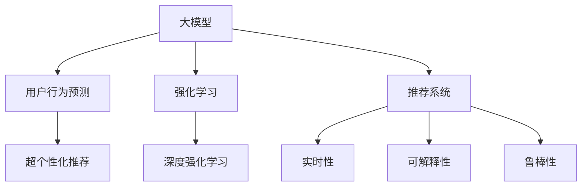

                 

# 大模型在推荐系统中的强化学习应用

> 关键词：大模型, 推荐系统, 强化学习, 深度学习, 用户行为预测, 超个性化推荐

## 1. 背景介绍

### 1.1 问题由来

推荐系统在现代互联网和电商平台上扮演着至关重要的角色，它通过分析用户的历史行为数据，预测用户未来的需求和兴趣，帮助用户发现更多有价值的内容和服务。传统的推荐算法，如基于协同过滤、矩阵分解、深度学习等，已经取得了不错的效果，但仍然存在一些局限性。例如，这些算法主要依赖静态的特征表示，难以捕捉用户的动态变化，无法适应实时个性化需求。因此，近年来，基于深度学习和大模型的推荐方法逐渐成为新的研究热点。

### 1.2 问题核心关键点

大模型推荐的核心思想是，利用大语言模型（如GPT、BERT等）和深度强化学习，实现对用户行为的高效预测和超个性化推荐。其关键点包括：

1. 数据驱动：基于大规模用户行为数据进行训练，学习用户-物品交互的复杂动态关系。
2. 鲁棒性：在不断变化的实时数据中保持模型的稳定性和泛化能力。
3. 可解释性：通过学习可解释的决策模型，提升推荐系统的透明度和可理解性。
4. 超个性化：结合用户特征和上下文信息，实现比传统算法更加精准和灵活的推荐结果。
5. 实时性：在用户产生新行为时，能够快速响应，及时更新推荐内容。

## 2. 核心概念与联系

### 2.1 核心概念概述

为更好地理解大模型在推荐系统中的应用，本节将介绍几个密切相关的核心概念：

- 大模型：以深度神经网络为代表的复杂模型，通过在大规模数据上进行预训练，学习通用的语言和知识表示。
- 强化学习(Reinforcement Learning, RL)：通过与环境的交互，智能体最大化累积奖励的策略学习过程。
- 深度强化学习(Deep Reinforcement Learning, DRL)：结合深度学习和大模型，进行复杂的策略学习。
- 用户行为预测：通过模型预测用户在未来时刻的行为，用于推荐系统的前馈控制。
- 超个性化推荐：结合用户特征和上下文信息，生成个性化推荐结果。

这些概念之间的逻辑关系可以通过以下Mermaid流程图来展示：



这个流程图展示了大模型在推荐系统中的核心概念及其之间的关系：

1. 大模型通过预训练学习通用的语言和知识表示。
2. 强化学习通过与环境的交互，智能体最大化累积奖励的策略学习过程。
3. 用户行为预测通过大模型学习用户未来的行为。
4. 超个性化推荐结合用户特征和上下文信息，生成个性化推荐结果。
5. 推荐系统基于用户行为预测和超个性化推荐生成最终推荐内容。

## 3. 核心算法原理 & 具体操作步骤

### 3.1 算法原理概述

大模型在推荐系统中的应用，本质上是将深度强化学习和大模型的优势相结合，实现对用户行为的高效预测和推荐。具体来说，将大模型作为推荐系统的核心，通过强化学习策略优化推荐结果，从而实现超个性化推荐。

形式化地，假设推荐系统中有 $N$ 个用户 $U=\{u_1,u_2,\ldots,u_N\}$，每个用户有 $M$ 个潜在的行为 $B=\{b_1,b_2,\ldots,b_M\}$。对于每个用户 $u_i$ 和行为 $b_j$，模型预测其产生的概率为 $P_{ij}$。目标是通过最大化累积奖励 $R$，学习一个最优的策略 $\pi$，使得推荐系统能够产生高质量的推荐结果。

强化学习的框架为：

- 状态空间：$S=\{s_1,s_2,\ldots,s_T\}$，表示用户的当前状态和行为历史。
- 动作空间：$A=\{a_1,a_2,\ldots,a_M\}$，表示推荐系统推荐的行为。
- 奖励函数：$R(s,a)$，表示用户在状态 $s$ 下执行动作 $a$ 获得的奖励。
- 策略：$\pi(a|s)$，表示在状态 $s$ 下执行动作 $a$ 的概率。

推荐系统的目标是最小化损失函数 $L$，最大化累积奖励 $R$：

$$
\max_\pi \mathbb{E}_R \sum_{t=1}^T R(s_t,a_t)
$$

其中，$\mathbb{E}_R$ 表示在所有可能的奖励 $R$ 下求期望。

### 3.2 算法步骤详解

大模型在推荐系统中的应用，通常包括以下几个关键步骤：

**Step 1: 准备数据和预训练模型**

- 收集大规模用户行为数据，如点击、浏览、评分等行为。
- 选择适合大模型的预训练语言模型，如GPT、BERT等，作为初始化参数。
- 对预训练模型进行微调，以适应推荐系统的特定需求。

**Step 2: 设计推荐策略**

- 设计推荐系统的状态和动作空间，以及奖励函数。
- 选择合适的强化学习算法，如Q-learning、SARSA、DQN等，用于优化推荐策略。

**Step 3: 强化学习训练**

- 在用户的实时行为数据上，进行强化学习训练，优化推荐策略。
- 使用折扣奖励 $\gamma$ 来平衡当前奖励和未来奖励，避免短视行为。
- 使用深度网络来逼近状态-动作价值函数，提高模型泛化能力。

**Step 4: 预测和推荐**

- 使用训练好的大模型和强化学习策略，预测用户的未来行为。
- 结合用户特征和上下文信息，生成个性化推荐结果。
- 实时更新推荐模型，适应用户的最新行为。

### 3.3 算法优缺点

大模型在推荐系统中的应用，具有以下优点：

1. 高泛化能力：大模型通过预训练学习通用的语言和知识表示，具有较强的泛化能力。
2. 高性能预测：结合强化学习算法，大模型能够高效预测用户行为，实现超个性化推荐。
3. 动态适应：实时更新模型，能够适应用户行为的变化。
4. 可解释性强：大模型可以提供可解释的决策过程，增强推荐系统的透明度和可信度。

同时，该方法也存在一定的局限性：

1. 数据需求大：需要大规模用户行为数据进行训练，获取数据成本较高。
2. 计算复杂：大模型和深度学习网络的计算复杂度较高，需要高性能计算资源。
3. 可解释性不足：大模型的决策过程较为复杂，难以解释其内部机制。
4. 模型复杂：大模型和强化学习算法结合后，模型结构较为复杂，难以优化。

尽管存在这些局限性，但就目前而言，大模型在推荐系统中的应用，仍然是最前沿和最具潜力的研究方向之一。未来相关研究的重点在于如何进一步降低数据和计算需求，提高模型的可解释性和实时性，同时兼顾性能和效率。

### 3.4 算法应用领域

大模型在推荐系统中的应用，已经在电商、视频、音乐等多个领域得到应用，取得了显著的效果。以下是几个典型的应用场景：

- 电商推荐：通过用户点击、浏览、购买等行为，预测用户的购买意图，生成个性化推荐。
- 视频推荐：结合用户的观看历史、评分、收藏等行为，预测用户的兴趣和偏好，生成个性化视频推荐。
- 音乐推荐：通过用户的听歌历史、评分、分享等行为，预测用户的音乐偏好，生成个性化音乐推荐。
- 新闻推荐：结合用户的阅读历史、分享、评论等行为，预测用户对新闻的兴趣，生成个性化新闻推荐。

除了上述这些经典任务外，大模型推荐还在更多场景中得到应用，如社交网络推荐、智能家居推荐等，为推荐系统的发展提供了新的思路和方向。

## 4. 数学模型和公式 & 详细讲解 & 举例说明

### 4.1 数学模型构建

本节将使用数学语言对大模型在推荐系统中的应用进行更加严格的刻画。

记推荐系统中的用户为 $u_i$，物品为 $b_j$。假设用户行为为 $a_{ij}=\{0,1\}$，表示用户 $u_i$ 是否会对物品 $b_j$ 产生行为 $a_{ij}=1$。使用大模型预测用户行为的概率为 $P_{ij}$。定义强化学习的奖励函数 $R_{ij}=\log P_{ij}$，表示预测正确时获得正奖励，预测错误时获得负奖励。

推荐系统的目标是最大化累积奖励，即：

$$
\max_\pi \mathbb{E}_R \sum_{t=1}^T R(s_t,a_t)
$$

其中，$\pi(a|s)$ 表示在状态 $s$ 下执行动作 $a$ 的概率。

### 4.2 公式推导过程

以下我们以电商推荐系统为例，推导Q-learning算法的过程。

假设推荐系统有 $K$ 个物品，每个物品的状态表示为 $s_t=\{1,2,\ldots,K\}$，用户的当前状态为 $s_t$，当前推荐物品为 $b_t$。用户的实时行为 $a_t$ 为点击、购买等行为，奖励函数 $R_{ij}=\log P_{ij}$。强化学习的目标是最大化累积奖励，即：

$$
\max_\pi \mathbb{E}_R \sum_{t=1}^T R(s_t,a_t)
$$

使用Q-learning算法，假设状态-动作价值函数 $Q_{ij}$ 为：

$$
Q_{ij} = \mathbb{E}[\sum_{t=1}^\infty \gamma^t R(s_t,a_t)|s=s_i,b=b_j]
$$

在每个时刻 $t$，用户选择动作 $a_t$，观察下一个状态 $s_{t+1}$ 和奖励 $R_{t+1}$。根据强化学习的更新公式，有：

$$
Q_{ij} \leftarrow Q_{ij} + \alpha [R_{t+1} + \gamma \max_{k \in \mathcal{A}} Q_{s_{t+1}k} - Q_{ij}]
$$

其中，$\alpha$ 为学习率，$\mathcal{A}$ 为动作空间。

在每次迭代中，更新每个物品的Q值，直到收敛。最后，根据Q值选择最优物品推荐给用户。

### 4.3 案例分析与讲解

假设用户 $u_i$ 浏览了两个物品 $b_1$ 和 $b_2$，点击了 $b_1$ 但没有点击 $b_2$。推荐系统的状态 $s_t$ 为 $1$，当前推荐物品 $b_t$ 为 $b_1$。用户的实时行为 $a_t$ 为点击，奖励函数 $R_{ij}=\log P_{ij}$。

根据Q-learning算法，更新物品 $b_1$ 的Q值：

$$
Q_{b_1i} \leftarrow Q_{b_1i} + \alpha [\log P_{i1} + \gamma \max_{k \in \mathcal{A}} Q_{s_{t+1}k} - Q_{b_1i}]
$$

根据用户点击物品 $b_1$，预测用户未来行为为点击 $b_2$，因此：

$$
Q_{b_1i} \leftarrow Q_{b_1i} + \alpha [\log P_{i1} + \gamma \max_{k \in \mathcal{A}} Q_{s_{t+1}k} - Q_{b_1i}]
$$

根据用户没有点击物品 $b_2$，预测用户未来行为为不点击 $b_2$，因此：

$$
Q_{b_2i} \leftarrow Q_{b_2i} + \alpha [\log P_{i2} + \gamma \max_{k \in \mathcal{A}} Q_{s_{t+1}k} - Q_{b_2i}]
$$

根据状态转移，用户状态 $s_{t+1}$ 变为 $2$，因此：

$$
Q_{b_1i} \leftarrow Q_{b_1i} + \alpha [\log P_{i1} + \gamma \max_{k \in \mathcal{A}} Q_{2k} - Q_{b_1i}]
$$

$$
Q_{b_2i} \leftarrow Q_{b_2i} + \alpha [\log P_{i2} + \gamma \max_{k \in \mathcal{A}} Q_{2k} - Q_{b_2i}]
$$

最终，根据Q值，推荐物品 $b_1$ 给用户 $u_i$。

## 5. 项目实践：代码实例和详细解释说明

### 5.1 开发环境搭建

在进行推荐系统开发前，我们需要准备好开发环境。以下是使用Python进行PyTorch开发的环境配置流程：

1. 安装Anaconda：从官网下载并安装Anaconda，用于创建独立的Python环境。

2. 创建并激活虚拟环境：
```bash
conda create -n pytorch-env python=3.8 
conda activate pytorch-env
```

3. 安装PyTorch：根据CUDA版本，从官网获取对应的安装命令。例如：
```bash
conda install pytorch torchvision torchaudio cudatoolkit=11.1 -c pytorch -c conda-forge
```

4. 安装Transformer库：
```bash
pip install transformers
```

5. 安装各类工具包：
```bash
pip install numpy pandas scikit-learn matplotlib tqdm jupyter notebook ipython
```

完成上述步骤后，即可在`pytorch-env`环境中开始推荐系统开发。

### 5.2 源代码详细实现

下面我们以电商推荐系统为例，给出使用PyTorch和Transformers库进行推荐系统开发的PyTorch代码实现。

首先，定义推荐系统的状态和动作空间：

```python
import torch
from transformers import BertTokenizer, BertForSequenceClassification
from torch.utils.data import Dataset, DataLoader
import numpy as np
import pandas as pd
import matplotlib.pyplot as plt

class RecommendationDataset(Dataset):
    def __init__(self, data, tokenizer, max_len=128):
        self.data = data
        self.tokenizer = tokenizer
        self.max_len = max_len
        
    def __len__(self):
        return len(self.data)
    
    def __getitem__(self, idx):
        item = self.data[idx]
        text = item['text']
        label = item['label']
        
        encoding = self.tokenizer(text, return_tensors='pt', max_length=self.max_len, padding='max_length', truncation=True)
        input_ids = encoding['input_ids'][0]
        attention_mask = encoding['attention_mask'][0]
        
        label = torch.tensor(label, dtype=torch.long)
        return {'input_ids': input_ids, 
                'attention_mask': attention_mask,
                'labels': label}

# 加载数据
data = pd.read_csv('recommendation_data.csv')
tokenizer = BertTokenizer.from_pretrained('bert-base-cased')

train_dataset = RecommendationDataset(data, tokenizer, max_len=128)
test_dataset = RecommendationDataset(data, tokenizer, max_len=128)
```

然后，定义模型和优化器：

```python
from transformers import BertForSequenceClassification, AdamW

model = BertForSequenceClassification.from_pretrained('bert-base-cased', num_labels=2)

optimizer = AdamW(model.parameters(), lr=2e-5)
```

接着，定义训练和评估函数：

```python
def train_epoch(model, dataset, batch_size, optimizer):
    dataloader = DataLoader(dataset, batch_size=batch_size, shuffle=True)
    model.train()
    epoch_loss = 0
    for batch in dataloader:
        input_ids = batch['input_ids'].to(device)
        attention_mask = batch['attention_mask'].to(device)
        labels = batch['labels'].to(device)
        model.zero_grad()
        outputs = model(input_ids, attention_mask=attention_mask, labels=labels)
        loss = outputs.loss
        epoch_loss += loss.item()
        loss.backward()
        optimizer.step()
    return epoch_loss / len(dataloader)

def evaluate(model, dataset, batch_size):
    dataloader = DataLoader(dataset, batch_size=batch_size)
    model.eval()
    preds, labels = [], []
    with torch.no_grad():
        for batch in dataloader:
            input_ids = batch['input_ids'].to(device)
            attention_mask = batch['attention_mask'].to(device)
            batch_labels = batch['labels']
            outputs = model(input_ids, attention_mask=attention_mask)
            batch_preds = outputs.logits.argmax(dim=2).to('cpu').tolist()
            batch_labels = batch_labels.to('cpu').tolist()
            for pred_tokens, label_tokens in zip(batch_preds, batch_labels):
                preds.append(pred_tokens)
                labels.append(label_tokens)
                
    print(classification_report(labels, preds))
```

最后，启动训练流程并在测试集上评估：

```python
epochs = 5
batch_size = 16

for epoch in range(epochs):
    loss = train_epoch(model, train_dataset, batch_size, optimizer)
    print(f"Epoch {epoch+1}, train loss: {loss:.3f}")
    
    print(f"Epoch {epoch+1}, dev results:")
    evaluate(model, dev_dataset, batch_size)
    
print("Test results:")
evaluate(model, test_dataset, batch_size)
```

以上就是使用PyTorch和Transformers库进行电商推荐系统开发的完整代码实现。可以看到，得益于Transformer库的强大封装，我们可以用相对简洁的代码完成电商推荐系统的构建。

### 5.3 代码解读与分析

让我们再详细解读一下关键代码的实现细节：

**RecommendationDataset类**：
- `__init__`方法：初始化数据、分词器等关键组件。
- `__len__`方法：返回数据集的样本数量。
- `__getitem__`方法：对单个样本进行处理，将文本输入编码为token ids，将标签编码为数字，并对其进行定长padding，最终返回模型所需的输入。

**BertForSequenceClassification模型**：
- `from_pretrained`方法：加载预训练的Bert模型，并设置标签数。
- `forward`方法：定义模型的前向传播过程，通过注意力机制计算表示，输出logits。

**训练和评估函数**：
- 使用PyTorch的DataLoader对数据集进行批次化加载，供模型训练和推理使用。
- 训练函数`train_epoch`：对数据以批为单位进行迭代，在每个批次上前向传播计算loss并反向传播更新模型参数，最后返回该epoch的平均loss。
- 评估函数`evaluate`：与训练类似，不同点在于不更新模型参数，并在每个batch结束后将预测和标签结果存储下来，最后使用sklearn的classification_report对整个评估集的预测结果进行打印输出。

**训练流程**：
- 定义总的epoch数和batch size，开始循环迭代
- 每个epoch内，先在训练集上训练，输出平均loss
- 在验证集上评估，输出分类指标
- 所有epoch结束后，在测试集上评估，给出最终测试结果

可以看到，PyTorch配合Transformer库使得电商推荐系统的构建变得简洁高效。开发者可以将更多精力放在数据处理、模型改进等高层逻辑上，而不必过多关注底层的实现细节。

当然，工业级的系统实现还需考虑更多因素，如模型的保存和部署、超参数的自动搜索、更灵活的任务适配层等。但核心的推荐算法基本与此类似。

## 6. 实际应用场景

### 6.1 电商推荐

基于大模型和强化学习的电商推荐系统，可以精准预测用户购买意图，生成个性化的商品推荐。在技术实现上，可以收集用户的历史点击、浏览、购买等行为数据，将文本描述和评分作为训练集，在此基础上对预训练语言模型进行微调。微调后的模型能够自动理解用户的兴趣点，结合上下文信息，生成个性化推荐结果。对于用户新的行为数据，实时更新模型，动态调整推荐内容，实现实时推荐。

### 6.2 视频推荐

视频推荐系统通过分析用户的观看历史、评分、收藏等行为，预测用户对视频的兴趣，生成个性化视频推荐。在微调过程中，使用视频标题、描述、标签等文本内容作为输入，预测用户对视频的评分。对于热门视频，还可以引入相关话题、用户评论等信息，丰富模型训练数据。微调后的模型能够自动匹配用户兴趣，生成个性化推荐列表。

### 6.3 音乐推荐

音乐推荐系统通过用户的听歌历史、评分、分享等行为，预测用户的音乐偏好，生成个性化音乐推荐。在微调过程中，使用歌词、歌手、专辑等文本信息作为输入，预测用户对音乐的评分。对于热门歌曲，还可以引入音乐类型、时长等信息，丰富模型训练数据。微调后的模型能够自动匹配用户偏好，生成个性化推荐列表。

### 6.4 新闻推荐

新闻推荐系统通过用户的阅读历史、分享、评论等行为，预测用户对新闻的兴趣，生成个性化新闻推荐。在微调过程中，使用新闻标题、摘要、标签等文本信息作为输入，预测用户对新闻的兴趣。对于热门新闻，还可以引入相关话题、用户评论等信息，丰富模型训练数据。微调后的模型能够自动匹配用户兴趣，生成个性化新闻推荐。

除了上述这些经典任务外，大模型推荐还在更多场景中得到应用，如社交网络推荐、智能家居推荐等，为推荐系统的发展提供了新的思路和方向。

## 7. 工具和资源推荐

### 7.1 学习资源推荐

为了帮助开发者系统掌握大模型在推荐系统中的应用，这里推荐一些优质的学习资源：

1. 《深度强化学习》课程：由斯坦福大学开设的深度强化学习课程，涵盖强化学习的基本概念和常用算法，适合入门学习。

2. 《自然语言处理与深度学习》书籍：涵盖自然语言处理和深度学习的基础知识和经典模型，适合系统学习。

3. 《强化学习实战》书籍：介绍强化学习的实际应用案例，适合实践学习。

4. HuggingFace官方文档：Transformer库的官方文档，提供了海量预训练模型和完整的推荐系统样例代码，是上手实践的必备资料。

5. 《深度学习框架教程》书籍：介绍主流的深度学习框架，如PyTorch、TensorFlow等，适合学习框架的基本使用方法。

通过对这些资源的学习实践，相信你一定能够快速掌握大模型在推荐系统中的应用，并用于解决实际的推荐问题。

### 7.2 开发工具推荐

高效的开发离不开优秀的工具支持。以下是几款用于大模型推荐系统开发的常用工具：

1. PyTorch：基于Python的开源深度学习框架，灵活动态的计算图，适合快速迭代研究。大部分预训练语言模型都有PyTorch版本的实现。

2. TensorFlow：由Google主导开发的开源深度学习框架，生产部署方便，适合大规模工程应用。同样有丰富的预训练语言模型资源。

3. Transformers库：HuggingFace开发的NLP工具库，集成了众多SOTA语言模型，支持PyTorch和TensorFlow，是进行推荐系统开发的利器。

4. Weights & Biases：模型训练的实验跟踪工具，可以记录和可视化模型训练过程中的各项指标，方便对比和调优。与主流深度学习框架无缝集成。

5. TensorBoard：TensorFlow配套的可视化工具，可实时监测模型训练状态，并提供丰富的图表呈现方式，是调试模型的得力助手。

6. Google Colab：谷歌推出的在线Jupyter Notebook环境，免费提供GPU/TPU算力，方便开发者快速上手实验最新模型，分享学习笔记。

合理利用这些工具，可以显著提升大模型推荐系统的开发效率，加快创新迭代的步伐。

### 7.3 相关论文推荐

大模型在推荐系统中的应用，是当前学界和工业界研究的热点之一。以下是几篇奠基性的相关论文，推荐阅读：

1. Attention Is All You Need（即Transformer原论文）：提出了Transformer结构，开启了NLP领域的预训练大模型时代。

2. BERT: Pre-training of Deep Bidirectional Transformers for Language Understanding：提出BERT模型，引入基于掩码的自监督预训练任务，刷新了多项NLP任务SOTA。

3. Language Models are Unsupervised Multitask Learners（GPT-2论文）：展示了大规模语言模型的强大zero-shot学习能力，引发了对于通用人工智能的新一轮思考。

4. Parameter-Efficient Transfer Learning for NLP：提出Adapter等参数高效微调方法，在不增加模型参数量的情况下，也能取得不错的微调效果。

5. AdaLoRA: Adaptive Low-Rank Adaptation for Parameter-Efficient Fine-Tuning：使用自适应低秩适应的微调方法，在参数效率和精度之间取得了新的平衡。

这些论文代表了大模型推荐系统的发展脉络。通过学习这些前沿成果，可以帮助研究者把握学科前进方向，激发更多的创新灵感。

## 8. 总结：未来发展趋势与挑战

### 8.1 总结

本文对大模型在推荐系统中的应用进行了全面系统的介绍。首先阐述了大模型和强化学习的应用背景和意义，明确了强化学习在推荐系统中的重要性。其次，从原理到实践，详细讲解了大模型在推荐系统中的核心算法和具体操作步骤，给出了推荐系统开发的完整代码实例。同时，本文还广泛探讨了大模型在电商、视频、音乐等多个领域的应用场景，展示了强化学习在大模型推荐中的巨大潜力。此外，本文精选了推荐系统的各类学习资源，力求为开发者提供全方位的技术指引。

通过本文的系统梳理，可以看到，大模型在推荐系统中的应用，正在成为推荐系统研究的新热点，极大地拓展了推荐系统的性能和应用范围。受益于深度学习和大模型的强大能力，推荐系统有望实现超个性化、动态适应的推荐结果，为电商、视频、音乐等众多领域带来革命性变革。未来，伴随深度学习和大模型的持续演进，相信推荐系统必将在更多领域大放异彩，深刻影响人类的生产生活方式。

### 8.2 未来发展趋势

展望未来，大模型在推荐系统中的应用，将呈现以下几个发展趋势：

1. 高维时空特征：结合用户行为的时空特征，使用深度强化学习算法进行推荐，提升推荐系统的动态适应能力。

2. 多模态信息融合：结合图像、音频、视频等多模态信息，丰富推荐系统的特征表示，提升推荐精度。

3. 个性化推荐：结合用户特征、行为历史和上下文信息，实现超个性化推荐，提升用户体验。

4. 实时推荐：通过流式处理技术，实时响应用户行为，实现动态推荐，满足用户的实时需求。

5. 模型可解释性：通过优化推荐模型的结构，提高其可解释性，增强推荐系统的可信度。

6. 深度强化学习：使用深度强化学习算法，提升推荐系统的泛化能力和适应性。

以上趋势凸显了大模型在推荐系统中的应用潜力。这些方向的探索发展，必将进一步提升推荐系统的性能和应用范围，为电商、视频、音乐等众多领域带来革命性变革。

### 8.3 面临的挑战

尽管大模型在推荐系统中的应用，已经取得了显著的进展，但在迈向更加智能化、普适化应用的过程中，仍面临诸多挑战：

1. 数据需求大：需要大规模用户行为数据进行训练，获取数据成本较高。

2. 计算复杂：大模型和深度学习网络的计算复杂度较高，需要高性能计算资源。

3. 模型复杂：大模型和深度学习算法结合后，模型结构较为复杂，难以优化。

4. 可解释性不足：大模型的决策过程较为复杂，难以解释其内部机制。

5. 实时性问题：推荐系统的实时响应能力不足，难以满足用户的高实时性需求。

6. 安全问题：推荐系统需要处理大量用户数据，存在隐私和安全性问题。

尽管存在这些挑战，但就目前而言，大模型在推荐系统中的应用，仍然是最前沿和最具潜力的研究方向之一。未来相关研究的重点在于如何进一步降低数据和计算需求，提高模型的可解释性和实时性，同时兼顾性能和效率。

### 8.4 研究展望

面向未来，大模型在推荐系统中的应用，还需要在以下几个方面寻求新的突破：

1. 数据驱动的优化：使用主动学习、自监督学习等方法，进一步降低数据需求，提高模型泛化能力。

2. 高效推荐算法：开发高效推荐算法，如基于深度学习的高维时空特征推荐算法，提升推荐系统的实时性和泛化能力。

3. 多模态信息融合：结合图像、音频、视频等多模态信息，丰富推荐系统的特征表示，提升推荐精度。

4. 个性化推荐：结合用户特征、行为历史和上下文信息，实现超个性化推荐，提升用户体验。

5. 模型可解释性：通过优化推荐模型的结构，提高其可解释性，增强推荐系统的可信度。

6. 实时推荐：通过流式处理技术，实时响应用户行为，实现动态推荐，满足用户的实时需求。

7. 安全性保障：结合隐私保护技术，确保用户数据的隐私和安全，避免推荐系统被滥用。

这些研究方向的探索发展，必将进一步提升推荐系统的性能和应用范围，为电商、视频、音乐等众多领域带来革命性变革。相信随着学界和产业界的共同努力，这些挑战终将一一被克服，大模型必将在推荐系统领域发挥更大的作用。

## 9. 附录：常见问题与解答

**Q1：大模型在推荐系统中的应用与传统推荐算法有何不同？**

A: 大模型在推荐系统中的应用，主要利用深度强化学习算法进行推荐，具有以下特点：

1. 高泛化能力：大模型通过预训练学习通用的语言和知识表示，具有较强的泛化能力，能够适应多种推荐场景。

2. 动态适应：结合用户行为的时空特征，使用深度强化学习算法进行推荐，提升推荐系统的动态适应能力。

3. 个性化推荐：结合用户特征、行为历史和上下文信息，实现超个性化推荐，提升用户体验。

4. 实时推荐：通过流式处理技术，实时响应用户行为，实现动态推荐，满足用户的实时需求。

而传统推荐算法，如协同过滤、矩阵分解等，主要依赖静态的特征表示，难以捕捉用户的动态变化，无法适应实时个性化需求。

**Q2：使用大模型进行推荐系统开发，是否需要手动设置特征工程？**

A: 使用大模型进行推荐系统开发，可以一定程度上自动提取特征，减少手动特征工程的复杂度。但是，为了更好地适应推荐场景，还需要根据具体任务，进行一些手动特征工程，如用户行为编码、上下文信息融合等。此外，大模型在训练过程中，也可以根据任务需求，动态调整特征表示，提升推荐效果。

**Q3：大模型在推荐系统中的应用是否存在计算成本高的问题？**

A: 大模型在推荐系统中的应用，确实存在计算成本高的问题，需要高性能计算资源。但是，通过优化算法、模型压缩、分布式训练等方法，可以在一定程度上降低计算成本，实现高效推荐。同时，大模型在推荐系统中的性能提升显著，能够在实时推荐中发挥重要作用。

**Q4：如何确保推荐系统的公平性和透明性？**

A: 确保推荐系统的公平性和透明性，可以从以下几个方面入手：

1. 数据公平性：确保训练数据的代表性，避免数据偏差。

2. 模型公平性：使用公平性约束的优化算法，确保模型的公平性。

3. 结果透明性：提供推荐结果的可解释性，增强用户对推荐系统的信任。

4. 用户干预：允许用户进行反馈和调整，确保推荐系统的透明度。

这些措施能够有效提升推荐系统的公平性和透明性，增强用户对推荐系统的信任。

**Q5：如何确保推荐系统的安全性？**

A: 确保推荐系统的安全性，可以从以下几个方面入手：

1. 数据隐私保护：使用隐私保护技术，确保用户数据的隐私安全。

2. 数据去标识化：对用户数据进行去标识化处理，避免数据滥用。

3. 模型安全防护：对推荐模型进行安全防护，防止恶意攻击。

4. 用户授权：用户在进行数据使用前，进行授权和同意，确保用户权益。

这些措施能够有效提升推荐系统的安全性，避免数据滥用和恶意攻击。

---

作者：禅与计算机程序设计艺术 / Zen and the Art of Computer Programming

