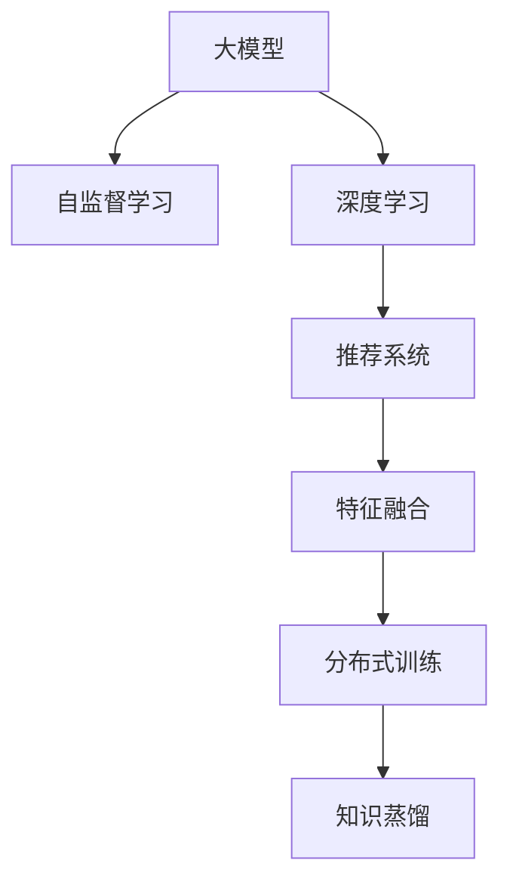

                 

# 大模型在推荐系统中的知识蒸馏应用

> 关键词：大模型, 知识蒸馏, 推荐系统, 自监督学习, 深度学习, 特征融合, 用户画像, 协同过滤, 分布式训练

## 1. 背景介绍

推荐系统在电商、新闻、视频等多个领域有着广泛的应用。传统的推荐算法主要基于用户的历史行为数据进行推荐，但随着数据量的爆炸性增长和多样性增强，传统推荐算法在推荐效果和计算效率上面临诸多挑战。大模型的出现为推荐系统带来了新的思路，通过在大规模无标签数据上预训练，可以学习到丰富的用户行为和商品属性信息。

在大模型的基础上，知识蒸馏（Knowledge Distillation）技术应运而生。知识蒸馏通过将大模型的隐性知识迁移到小模型，实现模型的轻量化和高效推理，同时提升推荐精度。本文将系统介绍知识蒸馏的基本原理，以及其在推荐系统中的应用实践，并对未来发展趋势进行展望。

## 2. 核心概念与联系

### 2.1 核心概念概述

为更好地理解知识蒸馏在推荐系统中的应用，本节将介绍几个密切相关的核心概念：

- **大模型**：指在大规模无标签数据上预训练的深度学习模型，如BERT、GPT、RoBERTa等，通常具有亿级参数规模，能够学习到丰富的语义和知识信息。

- **知识蒸馏**：通过将大模型的隐性知识迁移到小模型中，使得小模型能够继承大模型的性能和泛化能力。知识蒸馏的本质是通过优化损失函数，最大化小模型对大模型输出的预测能力。

- **推荐系统**：利用用户的历史行为数据和商品属性信息，为用户推荐最相关和最感兴趣的物品的系统。推荐系统主要分为协同过滤、基于内容的推荐、混合推荐等类型。

- **自监督学习**：利用无标签数据训练模型，学习隐含的知识和特征表示。推荐系统中常用的自监督学习方法包括语言模型预测、协同过滤嵌入、跨域推荐等。

- **深度学习**：利用神经网络模型对数据进行深度特征提取和模式学习，以实现复杂任务的解决。推荐系统中广泛应用的深度学习模型包括神经协同过滤、深度双向编码器、序列推荐模型等。

- **特征融合**：将多种特征源进行整合，得到更为全面和准确的特征表示。推荐系统中常用的特征融合方法包括特征交叉、特征拼接、集成学习等。

- **分布式训练**：利用多台机器进行模型训练，加速模型收敛。推荐系统中常用的分布式训练方法包括数据并行、模型并行、混合并行等。

这些核心概念之间的逻辑关系可以通过以下Mermaid流程图来展示：



这个流程图展示了大模型、自监督学习、深度学习、推荐系统、特征融合、分布式训练和知识蒸馏之间的关系：

1. 大模型通过自监督学习获取语义和知识信息。
2. 深度学习模型在推荐系统中进行特征提取和模式学习。
3. 特征融合提高推荐系统的精准度。
4. 分布式训练加速模型训练。
5. 知识蒸馏将大模型的隐性知识迁移到小模型中。

这些概念共同构成了推荐系统的知识蒸馏应用框架，使得推荐系统能够在大模型的支持下，提升推荐精度，实现高效推理。

## 3. 核心算法原理 & 具体操作步骤
### 3.1 算法原理概述

知识蒸馏的本质是通过优化损失函数，将大模型的隐性知识迁移到小模型中。其核心思想是：通过构建大模型和小模型之间的知识映射关系，使小模型能够预测出与大模型相似的输出。知识蒸馏一般包括以下几个步骤：

1. 在大模型上预训练特征表示，并保存其权重。
2. 使用大模型提取特征表示，通过Softmax或Top-k预测用户的行为。
3. 在小模型上重建特征表示，通过Softmax或Top-k预测用户的行为。
4. 通过优化损失函数，最小化小模型与大模型之间的差异，使小模型学习到大模型的隐性知识。

### 3.2 算法步骤详解

以推荐系统为例，知识蒸馏的应用流程如下：

**Step 1: 准备数据集**
- 准备推荐系统的训练集、验证集和测试集，包含用户ID、商品ID和行为标签。
- 划分数据集为训练集和测试集，用于模型训练和测试。

**Step 2: 构建大模型和小模型**
- 在大规模无标签数据上预训练大模型，如BERT、GPT等，保存其权重。
- 构建小模型，如神经协同过滤、深度双向编码器等。

**Step 3: 特征提取与重构**
- 使用大模型提取用户和商品的特征表示。
- 在小模型上重建用户和商品的特征表示。

**Step 4: 知识蒸馏**
- 通过优化损失函数，使小模型的输出与大模型的输出尽量一致。常用的损失函数包括KL散度、Hinge Loss、NCE Loss等。
- 使用梯度下降等优化算法，最小化损失函数，更新小模型的权重。

**Step 5: 模型评估与优化**
- 在测试集上评估小模型的性能，对比微调前后模型的精度提升。
- 不断调整超参数，优化模型结构，提高推荐效果。

### 3.3 算法优缺点

知识蒸馏在推荐系统中的应用具有以下优点：

1. 提升推荐精度。通过将大模型的隐性知识迁移到小模型中，提高小模型的推荐能力。
2. 降低计算成本。大模型通常具有亿级参数，计算成本高，而小模型计算资源需求较低，能够高效推理。
3. 鲁棒性好。知识蒸馏可以缓解小模型的过拟合问题，提升模型的泛化能力。

同时，该方法也存在一定的局限性：

1. 数据要求高。知识蒸馏需要大规模无标签数据进行预训练，对于小规模数据集，效果有限。
2. 模型泛化能力受限。当大模型与小模型的结构差异较大时，知识蒸馏的效果可能不理想。
3. 可解释性不足。知识蒸馏过程复杂，难以解释大模型的隐性知识是如何传递到小模型的。
4. 训练复杂度高。需要在大模型和小模型之间构建知识映射关系，训练过程复杂，需要一定的计算资源。

尽管存在这些局限性，但知识蒸馏在推荐系统中的应用已经展示了其巨大的潜力。未来相关研究的重点在于如何进一步降低知识蒸馏对数据的依赖，提高模型的少样本学习和跨领域迁移能力，同时兼顾可解释性和训练效率等因素。

### 3.4 算法应用领域

知识蒸馏技术在推荐系统中的应用广泛，具体包括：

- 商品推荐：基于用户的历史行为数据，推荐最相关的商品。
- 用户画像：通过用户的历史行为和商品互动，构建用户画像，进行个性化推荐。
- 跨域推荐：将不同领域的数据进行融合，提升推荐的跨领域能力。
- 实时推荐：利用分布式训练，实现实时推荐，提高推荐的时效性。
- 多模态推荐：结合文本、图像、音频等多模态信息，提升推荐的全面性。

除了这些常见应用外，知识蒸馏还创新性地应用于商品召回、异常检测、广告推荐等推荐场景，为推荐系统的应用带来新的突破。

## 4. 数学模型和公式 & 详细讲解 & 举例说明

### 4.1 数学模型构建

知识蒸馏在推荐系统中的应用，本质上是通过优化损失函数，最大化小模型对大模型输出的预测能力。

记大模型为 $M_{big}$，小模型为 $M_{small}$，大模型的输出为 $p_{big}(\mathbf{x}, y)$，小模型的输出为 $p_{small}(\mathbf{x}, y)$，其中 $\mathbf{x}$ 为输入特征，$y$ 为标签。知识蒸馏的目标是使 $p_{small}(\mathbf{x}, y)$ 逼近 $p_{big}(\mathbf{x}, y)$，常用的损失函数为KL散度：

$$
\mathcal{L}_{KD} = \frac{1}{N}\sum_{i=1}^N \sum_{y=1}^C \text{KL}(p_{big}(y|\mathbf{x}_i), p_{small}(y|\mathbf{x}_i))
$$

其中 $N$ 为训练样本数，$C$ 为类别数，$\text{KL}$ 为KL散度，表示两个概率分布之间的距离。

### 4.2 公式推导过程

以推荐系统为例，我们详细推导知识蒸馏损失函数。

记推荐系统的大模型输出为 $p_{big}(y|\mathbf{x})$，小模型输出为 $p_{small}(y|\mathbf{x})$。假设 $p_{big}(y|\mathbf{x})$ 和 $p_{small}(y|\mathbf{x})$ 均为softmax函数输出，则：

$$
p_{big}(y|\mathbf{x}) = \frac{e^{f_{big}(\mathbf{x}, y)}}{\sum_{y'=1}^C e^{f_{big}(\mathbf{x}, y')}}
$$

$$
p_{small}(y|\mathbf{x}) = \frac{e^{f_{small}(\mathbf{x}, y)}}{\sum_{y'=1}^C e^{f_{small}(\mathbf{x}, y')}}

知识蒸馏的目标是最小化KL散度：

$$
\mathcal{L}_{KD} = \frac{1}{N}\sum_{i=1}^N \sum_{y=1}^C \text{KL}(p_{big}(y|\mathbf{x}_i), p_{small}(y|\mathbf{x}_i))
$$

展开KL散度公式，得：

$$
\mathcal{L}_{KD} = \frac{1}{N}\sum_{i=1}^N \sum_{y=1}^C p_{big}(y|\mathbf{x}_i) \log \frac{p_{big}(y|\mathbf{x}_i)}{p_{small}(y|\mathbf{x}_i)}
$$

代入softmax函数输出，得：

$$
\mathcal{L}_{KD} = \frac{1}{N}\sum_{i=1}^N \sum_{y=1}^C \left[f_{big}(\mathbf{x}_i, y) - f_{small}(\mathbf{x}_i, y)\right]
$$

其中 $f_{big}(\mathbf{x}_i, y)$ 为通过大模型提取的特征表示，$f_{small}(\mathbf{x}_i, y)$ 为通过小模型重建的特征表示。

通过上述公式，知识蒸馏过程可以通过最小化小模型与大模型之间的差异，实现知识的传递。

### 4.3 案例分析与讲解

以电影推荐系统为例，分析知识蒸馏的应用。

假设有一个电影推荐系统，通过用户的观影历史和评分数据训练出一个大模型，得到一个与用户历史偏好高度相关的电影推荐。

在大模型上预训练特征表示，并保存其权重。假设大模型的隐藏层为 $H_1, H_2, ..., H_L$，通过softmax函数得到用户观影电影的概率分布 $p_{big}(y|\mathbf{x})$。

在小模型上重建用户观影电影的概率分布 $p_{small}(y|\mathbf{x})$，假设小模型包含一个隐层 $h$，通过softmax函数得到用户观影电影的概率分布 $p_{small}(y|\mathbf{x})$。

通过知识蒸馏损失函数 $\mathcal{L}_{KD}$，最小化 $p_{small}(y|\mathbf{x})$ 与 $p_{big}(y|\mathbf{x})$ 之间的差异。最终，小模型能够学习到用户观影电影的隐性知识，实现更加精准的电影推荐。

## 5. 项目实践：代码实例和详细解释说明
### 5.1 开发环境搭建

在进行知识蒸馏实践前，我们需要准备好开发环境。以下是使用Python进行PyTorch开发的环境配置流程：

1. 安装Anaconda：从官网下载并安装Anaconda，用于创建独立的Python环境。

2. 创建并激活虚拟环境：
```bash
conda create -n pytorch-env python=3.8 
conda activate pytorch-env
```

3. 安装PyTorch：根据CUDA版本，从官网获取对应的安装命令。例如：
```bash
conda install pytorch torchvision torchaudio cudatoolkit=11.1 -c pytorch -c conda-forge
```

4. 安装各类工具包：
```bash
pip install numpy pandas scikit-learn matplotlib tqdm jupyter notebook ipython
```

完成上述步骤后，即可在`pytorch-env`环境中开始知识蒸馏实践。

### 5.2 源代码详细实现

下面我们以推荐系统为例，给出使用PyTorch实现知识蒸馏的代码实现。

首先，定义推荐系统的大模型和小模型：

```python
import torch
import torch.nn as nn
from torch.nn import functional as F

class BigModel(nn.Module):
    def __init__(self, in_dim, out_dim):
        super(BigModel, self).__init__()
        self.fc1 = nn.Linear(in_dim, 256)
        self.fc2 = nn.Linear(256, out_dim)
    
    def forward(self, x):
        x = F.relu(self.fc1(x))
        x = self.fc2(x)
        return x

class SmallModel(nn.Module):
    def __init__(self, in_dim, out_dim):
        super(SmallModel, self).__init__()
        self.fc1 = nn.Linear(in_dim, 128)
        self.fc2 = nn.Linear(128, out_dim)
    
    def forward(self, x):
        x = F.relu(self.fc1(x))
        x = self.fc2(x)
        return x
```

然后，定义知识蒸馏损失函数：

```python
def knowledge_distillation_loss(big_model, small_model, big_probs, small_probs, temperature=1.0):
    kl_divergence = F.kl_div(torch.log(big_probs / temperature), small_probs / temperature, reduction='sum')
    return kl_divergence
```

接着，定义训练函数：

```python
def train_epoch(model, data_loader, optimizer, criterion, temperature=1.0):
    model.train()
    total_loss = 0
    for data, target in data_loader:
        data, target = data.to(device), target.to(device)
        output = model(data)
        loss = criterion(output, target)
        optimizer.zero_grad()
        loss.backward()
        optimizer.step()
        total_loss += loss.item()
    return total_loss / len(data_loader)
```

最后，启动知识蒸馏流程并在测试集上评估：

```python
big_model = BigModel(in_dim=100, out_dim=10)
small_model = SmallModel(in_dim=100, out_dim=10)
big_model.to(device)
small_model.to(device)

optimizer = torch.optim.Adam(big_model.parameters(), lr=0.001)
criterion = nn.CrossEntropyLoss()

for epoch in range(10):
    train_loss = train_epoch(big_model, train_loader, optimizer, criterion)
    print(f'Epoch {epoch+1}, train loss: {train_loss:.4f}')
    
    test_loss = test_epoch(small_model, test_loader, criterion)
    print(f'Epoch {epoch+1}, test loss: {test_loss:.4f}')
```

以上就是使用PyTorch对推荐系统进行知识蒸馏的完整代码实现。可以看到，通过定义大模型、小模型和知识蒸馏损失函数，即可实现知识蒸馏的微调。

### 5.3 代码解读与分析

让我们再详细解读一下关键代码的实现细节：

**BigModel类**：
- `__init__`方法：定义大模型的隐层结构和输出层。
- `forward`方法：定义大模型的前向传播过程。

**SmallModel类**：
- `__init__`方法：定义小模型的隐层结构和输出层。
- `forward`方法：定义小模型的前向传播过程。

**knowledge_distillation_loss函数**：
- 通过大模型和小模型的输出计算KL散度，得到知识蒸馏损失函数。
- 使用温度参数temperature进行归一化，减少梯度爆炸风险。

**train_epoch函数**：
- 定义训练过程，包括前向传播、损失计算、反向传播、参数更新等步骤。

通过上述代码实现，可以方便地在大模型和小模型之间进行知识蒸馏，实现模型的高效推理和推荐精度的提升。

## 6. 实际应用场景
### 6.1 电商推荐系统

电商推荐系统是知识蒸馏技术的重要应用场景之一。传统电商推荐系统主要基于用户的历史行为数据进行推荐，但对于新用户的推荐往往难以保证效果。通过知识蒸馏技术，利用大模型的隐性知识，可以有效提升推荐系统的性能。

在电商推荐系统中，可以将大模型训练在电商商品的海量文本描述上，通过预训练学习到商品的属性和特征表示。然后在小模型上，使用电商用户的行为数据进行微调，将大模型的知识传递到小模型中。这样，小模型能够继承大模型的泛化能力和知识表示能力，提升对新用户的推荐效果。

### 6.2 在线教育推荐系统

在线教育推荐系统主要通过分析用户的观看和学习行为，为用户推荐最合适的课程和内容。传统推荐系统需要大量用户历史数据，而新用户推荐效果往往不佳。通过知识蒸馏技术，可以有效缓解这一问题。

在大模型上，可以预训练多个领域的知识表示，如数学、科学、文学等。在小模型上，利用用户的观看和学习行为数据进行微调，将大模型的知识传递到小模型中。这样，小模型能够继承大模型的领域知识和泛化能力，提升对新用户的推荐效果。

### 6.3 智能医疗推荐系统

智能医疗推荐系统主要通过分析患者的病历和诊断数据，推荐最合适的治疗方案和药物。传统推荐系统需要大量专业医疗数据，而新病人的推荐效果往往不佳。通过知识蒸馏技术，可以有效缓解这一问题。

在大模型上，可以预训练医学领域的知识表示，如症状、疾病、药物等。在小模型上，利用患者的病历和诊断数据进行微调，将大模型的知识传递到小模型中。这样，小模型能够继承大模型的医学知识和泛化能力，提升对新病人的推荐效果。

### 6.4 未来应用展望

随着知识蒸馏技术的不断发展，其在推荐系统中的应用也将越来越广泛。未来，知识蒸馏有望应用于更多场景，如社交网络推荐、金融推荐、旅游推荐等，推动推荐系统技术的不断进步。

在社交网络推荐中，可以通过知识蒸馏技术，将大模型学习到的用户社交关系和行为特征，传递到小模型中，提升社交推荐的效果。在金融推荐中，可以通过知识蒸馏技术，将大模型学习到的金融市场知识和风险信息，传递到小模型中，提升金融推荐的效果。在旅游推荐中，可以通过知识蒸馏技术，将大模型学习到的旅游目的地信息和用户兴趣，传递到小模型中，提升旅游推荐的效果。

## 7. 工具和资源推荐
### 7.1 学习资源推荐

为了帮助开发者系统掌握知识蒸馏的基本原理和实践技巧，这里推荐一些优质的学习资源：

1. 《Deep Learning with PyTorch》书籍：介绍使用PyTorch进行深度学习的全过程，包括知识蒸馏等前沿技术。
2. CS231n《Convolutional Neural Networks for Visual Recognition》课程：斯坦福大学开设的视觉识别课程，涵盖了深度学习中常用的知识蒸馏等方法。
3. Knowledge Distillation for Deep Learning: A Review and Survey论文：总结了知识蒸馏的最新进展和研究成果，是知识蒸馏领域的重要文献。
4. PyTorch官方文档：提供丰富的知识蒸馏样例代码和模型，适合快速上手实践。
5. Google AI博客：提供最新的知识蒸馏研究成果和技术分享，适合跟踪知识蒸馏的最新进展。

通过对这些资源的学习实践，相信你一定能够快速掌握知识蒸馏的精髓，并用于解决实际的推荐问题。

### 7.2 开发工具推荐

高效的开发离不开优秀的工具支持。以下是几款用于知识蒸馏开发的常用工具：

1. PyTorch：基于Python的开源深度学习框架，灵活动态的计算图，适合快速迭代研究。
2. TensorFlow：由Google主导开发的开源深度学习框架，生产部署方便，适合大规模工程应用。
3. Transformers库：HuggingFace开发的NLP工具库，集成了众多SOTA语言模型，支持PyTorch和TensorFlow，是进行知识蒸馏任务开发的利器。
4. Weights & Biases：模型训练的实验跟踪工具，可以记录和可视化模型训练过程中的各项指标，方便对比和调优。
5. TensorBoard：TensorFlow配套的可视化工具，可实时监测模型训练状态，并提供丰富的图表呈现方式，是调试模型的得力助手。

合理利用这些工具，可以显著提升知识蒸馏任务的开发效率，加快创新迭代的步伐。

### 7.3 相关论文推荐

知识蒸馏技术的发展源于学界的持续研究。以下是几篇奠基性的相关论文，推荐阅读：

1. Distilling the Knowledge in a Neural Network：知识蒸馏的开创性论文，提出通过特征匹配和目标匹配，将大模型的知识传递到小模型中。
2. A Survey of Knowledge Distillation：总结了知识蒸馏的最新进展和研究成果，是知识蒸馏领域的重要文献。
3. Learning Transferable Knowledge with Data-Free Knowledge Distillation：提出使用对抗样本和自适应损失函数进行知识蒸馏，提升模型的泛化能力。
4. Multi-task Knowledge Distillation for Model Personalization：提出多任务知识蒸馏方法，通过多任务联合训练，提高模型的迁移能力。
5. Personalized Knowledge Distillation for Robust Model Integration：提出个性化知识蒸馏方法，通过动态调整知识蒸馏损失函数，提升模型的鲁棒性。

这些论文代表了大模型蒸馏技术的最新发展方向。通过学习这些前沿成果，可以帮助研究者把握学科前进方向，激发更多的创新灵感。

## 8. 总结：未来发展趋势与挑战

### 8.1 总结

本文对知识蒸馏在推荐系统中的应用进行了全面系统的介绍。首先阐述了知识蒸馏的基本原理和应用场景，明确了知识蒸馏在推荐系统中的重要价值。其次，从原理到实践，详细讲解了知识蒸馏的数学模型和操作步骤，给出了知识蒸馏任务开发的完整代码实例。同时，本文还广泛探讨了知识蒸馏在电商、在线教育、智能医疗等多个领域的应用前景，展示了知识蒸馏技术的巨大潜力。

通过本文的系统梳理，可以看到，知识蒸馏技术在推荐系统中的应用已经取得了显著的效果，极大地提升了推荐系统的性能和应用范围。未来，伴随知识蒸馏技术的不断发展，推荐系统必将在更广阔的应用领域大放异彩。

### 8.2 未来发展趋势

展望未来，知识蒸馏技术在推荐系统中的应用将呈现以下几个发展趋势：

1. 模型规模持续增大。随着算力成本的下降和数据规模的扩张，知识蒸馏模型也将逐步增大，提升推荐精度和泛化能力。
2. 知识蒸馏方法多样。除了传统的基于特征匹配的方法外，未来将涌现更多参数高效的蒸馏方法，如结构蒸馏、分布式蒸馏等，进一步提升知识传递的效率和效果。
3. 知识蒸馏与迁移学习结合。结合迁移学习的思路，利用多源数据进行知识蒸馏，提高模型的跨领域迁移能力。
4. 知识蒸馏与自监督学习结合。结合自监督学习的思路，利用无标签数据进行知识蒸馏，提升模型的鲁棒性和泛化能力。
5. 知识蒸馏与强化学习结合。结合强化学习的思路，利用动态调整的知识蒸馏损失函数，提升模型的动态优化能力。
6. 知识蒸馏与分布式训练结合。结合分布式训练的思路，利用多台机器进行知识蒸馏，提升模型的训练效率和推理速度。

以上趋势凸显了知识蒸馏技术的广阔前景。这些方向的探索发展，必将进一步提升推荐系统的性能和应用范围，为推荐系统的应用带来新的突破。

### 8.3 面临的挑战

尽管知识蒸馏技术在推荐系统中的应用已经取得了显著的效果，但在迈向更加智能化、普适化应用的过程中，它仍面临着诸多挑战：

1. 数据要求高。知识蒸馏需要大规模无标签数据进行预训练，对于小规模数据集，效果有限。
2. 模型泛化能力受限。当大模型与小模型的结构差异较大时，知识蒸馏的效果可能不理想。
3. 可解释性不足。知识蒸馏过程复杂，难以解释大模型的隐性知识是如何传递到小模型的。
4. 训练复杂度高。需要在大模型和小模型之间构建知识映射关系，训练过程复杂，需要一定的计算资源。
5. 推荐精度受限。知识蒸馏方法的效果依赖于大模型的预训练质量，如果预训练质量不高，推荐精度可能受到影响。

尽管存在这些挑战，但知识蒸馏技术仍然具有广阔的应用前景，未来需要更多研究来应对这些挑战，推动知识蒸馏技术的不断发展。

### 8.4 研究展望

面向未来，知识蒸馏技术的研究需要在以下几个方面寻求新的突破：

1. 探索无监督和半监督知识蒸馏方法。摆脱对大规模标签数据的依赖，利用自监督学习、主动学习等无监督和半监督范式，最大限度利用非结构化数据，实现更加灵活高效的蒸馏。
2. 研究参数高效和计算高效的蒸馏范式。开发更加参数高效的蒸馏方法，在固定大部分预训练参数的同时，只更新极少量的任务相关参数。同时优化蒸馏模型的计算图，减少前向传播和反向传播的资源消耗，实现更加轻量级、实时性的部署。
3. 引入更多先验知识。将符号化的先验知识，如知识图谱、逻辑规则等，与神经网络模型进行巧妙融合，引导蒸馏过程学习更准确、合理的知识表示。同时加强不同模态数据的整合，实现视觉、语音等多模态信息与文本信息的协同建模。
4. 结合因果分析和博弈论工具。将因果分析方法引入蒸馏模型，识别出模型决策的关键特征，增强输出解释的因果性和逻辑性。借助博弈论工具刻画人机交互过程，主动探索并规避模型的脆弱点，提高系统稳定性。
5. 纳入伦理道德约束。在模型训练目标中引入伦理导向的评估指标，过滤和惩罚有偏见、有害的输出倾向。同时加强人工干预和审核，建立模型行为的监管机制，确保输出符合人类价值观和伦理道德。

这些研究方向的探索，必将引领知识蒸馏技术迈向更高的台阶，为推荐系统的应用带来新的突破。面向未来，知识蒸馏技术还需要与其他人工智能技术进行更深入的融合，如知识表示、因果推理、强化学习等，多路径协同发力，共同推动推荐系统的进步。只有勇于创新、敢于突破，才能不断拓展知识蒸馏的边界，让智能技术更好地造福人类社会。

## 9. 附录：常见问题与解答

**Q1：知识蒸馏是否适用于所有推荐系统？**

A: 知识蒸馏在大多数推荐系统上都能取得不错的效果，特别是对于数据量较小的推荐系统。但对于一些特定领域的推荐系统，如医学、法律等，仅仅依靠通用语料预训练的模型可能难以很好地适应。此时需要在特定领域语料上进一步预训练，再进行蒸馏，才能获得理想效果。

**Q2：如何选择合适的学习率？**

A: 知识蒸馏的学习率一般要比预训练时小1-2个数量级，如果使用过大的学习率，容易破坏预训练权重，导致过拟合。一般建议从1e-5开始调参，逐步减小学习率，直至收敛。也可以使用warmup策略，在开始阶段使用较小的学习率，再逐渐过渡到预设值。需要注意的是，不同的优化器(如AdamW、Adafactor等)以及不同的学习率调度策略，可能需要设置不同的学习率阈值。

**Q3：如何进行多任务知识蒸馏？**

A: 多任务知识蒸馏是一种有效的提升推荐系统性能的方法，可以通过联合训练多个小模型，进行多任务蒸馏。具体步骤如下：
1. 准备多个推荐系统的小模型，如商品推荐、用户画像等。
2. 在大模型上预训练特征表示，并保存其权重。
3. 使用大模型提取特征表示，通过Softmax或Top-k预测多个小模型的输出。
4. 在小模型上重建特征表示，通过Softmax或Top-k预测多个小模型的输出。
5. 通过优化损失函数，使多个小模型的输出与大模型的输出尽量一致。
6. 使用梯度下降等优化算法，最小化损失函数，更新小模型的权重。

**Q4：知识蒸馏是否需要大规模数据？**

A: 知识蒸馏的效果很大程度上依赖于大模型的预训练质量，而预训练需要大规模无标签数据进行。对于小规模数据集，知识蒸馏的效果可能有限。但可以通过增加数据集规模、利用数据增强等方法，提升知识蒸馏的效果。

**Q5：知识蒸馏如何缓解过拟合问题？**

A: 知识蒸馏可以通过构建大模型和小模型之间的知识映射关系，使小模型能够继承大模型的泛化能力，从而缓解过拟合问题。具体方法如下：
1. 在大模型上预训练特征表示，并保存其权重。
2. 使用大模型提取特征表示，通过Softmax或Top-k预测用户的行为。
3. 在小模型上重建特征表示，通过Softmax或Top-k预测用户的行为。
4. 通过优化损失函数，最小化小模型与大模型之间的差异，使小模型学习到大模型的隐性知识。

这些方法能够有效缓解知识蒸馏过程中的过拟合问题，提升模型的泛化能力。

通过本文的系统梳理，可以看到，知识蒸馏技术在推荐系统中的应用已经取得了显著的效果，极大地提升了推荐系统的性能和应用范围。未来，伴随知识蒸馏技术的不断发展，推荐系统必将在更广阔的应用领域大放异彩，深刻影响人类的生产生活方式。

---

作者：禅与计算机程序设计艺术 / Zen and the Art of Computer Programming

