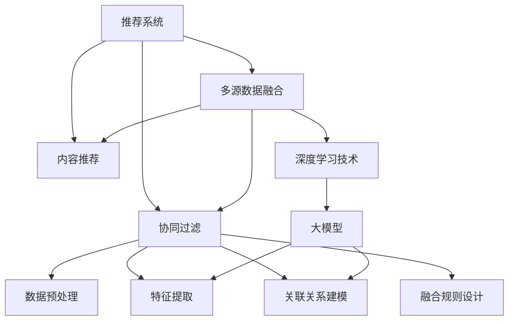

                 

# 大模型在推荐系统多源数据融合中的应用

> 关键词：推荐系统,多源数据融合,大模型,深度学习,协同过滤,内容推荐,用户行为,数据预处理,深度学习技术

## 1. 背景介绍

### 1.1 问题由来

推荐系统是当今互联网应用的基石之一，服务于用户与内容的匹配，直接关系到平台的用户粘性和商业价值。传统的推荐系统主要依赖于协同过滤和基于内容的推荐算法，但这些算法往往需要大量的用户行为数据和物品特征，在数据稀疏性、冷启动、多模态数据融合等方面存在一定的局限性。

近年来，大模型在NLP、计算机视觉等领域取得了巨大的成功，展示了其在处理复杂非结构化数据方面的强大能力。将大模型应用于推荐系统，可以为推荐算法带来新的数据表示、特征提取和关联关系挖掘手段。尤其是多源数据融合，可以有效缓解推荐系统面临的各类挑战，进一步提升推荐效果和用户体验。

### 1.2 问题核心关键点

推荐系统中的数据融合任务通常包括以下几个关键点：

- 数据预处理：从不同数据源中获取原始数据，并进行数据清洗、标准化、去重、合并等预处理操作，为后续的模型训练做准备。
- 特征提取：从预处理后的数据中提取有用的特征，如用户行为、物品属性、文本描述等，作为模型的输入。
- 关联关系建模：通过机器学习算法建立用户与物品、物品与物品之间的关联关系，以生成推荐结果。
- 融合规则设计：选择合适的融合规则，如线性加权、多级融合、softmax等，将不同数据源的信息进行融合，生成最终的推荐结果。

以上每个环节都是实现高质量推荐系统的关键。本文将重点介绍基于大模型的推荐系统多源数据融合方法，并通过具体案例详细讲解其原理和实践。

## 2. 核心概念与联系

### 2.1 核心概念概述

为更好地理解大模型在推荐系统中的多源数据融合方法，本节将介绍几个密切相关的核心概念：

- 推荐系统(Recommendation System)：指根据用户历史行为和兴趣，推荐相关内容的技术系统。主要分为基于内容的推荐、协同过滤推荐、混合推荐等几大类。
- 多源数据融合(Multisource Data Fusion)：指将来自不同数据源的数据进行预处理、特征提取、模型训练等操作，生成更全面、准确、可靠的数据表示，提升推荐系统性能的技术。
- 大模型( Large Model)：指具有大规模参数量、复杂结构、强大的表达能力的深度学习模型，如BERT、GPT、ViT等。
- 协同过滤(Collaborative Filtering)：指通过分析用户和物品之间的交互行为，学习用户兴趣和物品特征，生成推荐结果的推荐算法。
- 内容推荐(Content-Based Recommendation)：指根据物品的特征属性和用户的历史行为，推荐用户可能感兴趣的相关物品的推荐算法。
- 深度学习(Deep Learning)：指基于神经网络的深度学习模型，可以自动学习数据特征，处理高维复杂数据，具有强大的泛化能力。
- 特征工程(Feature Engineering)：指对原始数据进行预处理、特征提取、降维等操作，生成适合模型训练的特征表示的过程。

这些核心概念之间的逻辑关系可以通过以下Mermaid流程图来展示：



这个流程图展示了大模型在推荐系统中的核心概念及其之间的关系：

1. 推荐系统通过协同过滤、内容推荐等算法对用户和物品进行建模。
2. 多源数据融合对来自不同数据源的数据进行预处理、特征提取、关联关系建模和融合规则设计。
3. 深度学习技术为推荐系统提供了强大的特征提取和关联关系建模能力。
4. 大模型作为深度学习技术的重要组成部分，是推荐系统多源数据融合的核心。

这些概念共同构成了推荐系统的核心框架，使得大模型能在多源数据融合中发挥重要作用，提升推荐系统的性能和用户体验。

## 3. 核心算法原理 & 具体操作步骤
### 3.1 算法原理概述

基于大模型的推荐系统多源数据融合方法，本质上是一个多任务学习和跨模态学习的过程。其核心思想是：将推荐系统看作多个子任务的学习过程，每个子任务分别从不同数据源中提取特征，通过大模型将这些特征进行联合建模，生成最终的推荐结果。

形式化地，假设推荐系统有 $N$ 个数据源 $D_1, \cdots, D_N$，每个数据源包含 $M$ 个特征 $f_i^{(j)}$，$i=1,\cdots,N, j=1,\cdots,M$。我们希望在 $D_1,\cdots,D_N$ 上训练一个大模型 $M$，使得在任意 $i$ 上的输出 $o_i$ 能够反映该数据源上特征的综合信息。假设模型输出 $o_i$ 与真实标签 $y$ 之间的误差为 $\ell(o_i, y)$，那么目标函数为：

$$
\min_{\theta} \sum_{i=1}^N \mathbb{E}_{(x_i, y)} \left[ \ell(M(x_i), y) \right]
$$

其中 $\theta$ 为模型参数。通过最小化上述目标函数，可以在多个数据源上训练一个统一的大模型 $M$，其输出 $o_i$ 能够综合不同数据源的信息，生成推荐结果。

### 3.2 算法步骤详解

基于大模型的推荐系统多源数据融合一般包括以下几个关键步骤：

**Step 1: 数据预处理**

- 从不同数据源收集原始数据，进行数据清洗、去重、合并等预处理操作。
- 根据不同数据源的特点，选择合适的特征提取方法，如文本分词、图像特征提取等。

**Step 2: 特征工程**

- 对预处理后的数据进行特征提取，生成模型的输入表示。
- 将不同数据源的特征进行拼接，形成特征向量。

**Step 3: 关联关系建模**

- 选择合适的深度学习模型，如BERT、GPT、ViT等，对特征向量进行联合建模。
- 使用模型的最后一层或某一层的输出，作为推荐结果的表示。

**Step 4: 融合规则设计**

- 选择合适的融合规则，将不同数据源的关联关系进行融合。
- 根据不同数据源的重要性和特征贡献度，对融合结果进行加权或softmax处理。

**Step 5: 输出处理**

- 将融合后的推荐结果输出，作为最终推荐系统结果。

**Step 6: 模型训练与评估**

- 使用标注数据集训练模型，并在验证集上评估模型性能。
- 根据评估结果调整模型参数和融合规则，优化推荐效果。

以上是大模型在推荐系统多源数据融合的一般流程。在实际应用中，还需要针对具体任务和数据源的特点，对各个环节进行优化设计，如选择合适的特征提取方法、设计更合适的融合规则等，以进一步提升模型性能。

### 3.3 算法优缺点

基于大模型的推荐系统多源数据融合方法具有以下优点：

1. 数据利用率提高。通过融合不同数据源的信息，模型能够更全面、准确地刻画用户和物品的特征，提升推荐效果。
2. 多模态数据融合。支持图像、文本、音频等多模态数据的融合，提升模型对不同类型数据的适应能力。
3. 模型表达能力强。大模型可以自动学习复杂的数据特征和关联关系，具备强大的泛化能力。
4. 可解释性好。深度学习模型的特征表示具有良好的可解释性，有助于理解和调试推荐模型。

同时，该方法也存在一定的局限性：

1. 模型计算量大。大模型通常具有较高的计算复杂度，对硬件设备的要求较高。
2. 数据隐私问题。不同数据源的数据融合可能涉及隐私保护和数据共享问题，需要谨慎处理。
3. 模型可解释性不足。深度学习模型通常被视为"黑盒"系统，难以解释其内部工作机制和决策逻辑。
4. 对标注数据依赖大。模型训练需要大量标注数据，数据获取和标注成本较高。

尽管存在这些局限性，但就目前而言，基于大模型的推荐系统多源数据融合方法仍是一种高效、灵活、可扩展的推荐技术。未来相关研究的重点在于如何进一步降低模型计算成本，提高数据隐私保护，同时兼顾模型的可解释性和对标注数据的依赖。

### 3.4 算法应用领域

基于大模型的推荐系统多源数据融合方法，已经在电子商务、视频流媒体、社交网络等众多领域得到广泛应用。以下是几个典型应用场景：

- **电子商务推荐系统**：融合用户的浏览历史、搜索记录、评价数据等，生成个性化的商品推荐。
- **视频流媒体推荐系统**：融合用户观看历史、评分、评论等，生成个性化的视频推荐。
- **社交网络推荐系统**：融合用户的点赞、分享、评论等社交行为，生成个性化的内容推荐。
- **多模态推荐系统**：融合图像、文本、音频等多模态数据，生成更丰富、全面的推荐结果。
- **个性化广告推荐**：融合用户的搜索历史、点击行为、地理位置等数据，生成个性化的广告推荐。

除了这些经典应用外，大模型推荐系统还在新闻推荐、旅游推荐、游戏推荐等多个场景中发挥了重要作用，为各类平台带来了更高的用户满意度和商业价值。

## 4. 数学模型和公式 & 详细讲解  
### 4.1 数学模型构建

本节将使用数学语言对基于大模型的推荐系统多源数据融合过程进行更加严格的刻画。

记推荐系统有 $N$ 个数据源 $D_1, \cdots, D_N$，每个数据源包含 $M$ 个特征 $f_i^{(j)}$，$i=1,\cdots,N, j=1,\cdots,M$。假设融合后的大模型为 $M_{\theta}:\mathcal{X} \rightarrow \mathcal{Y}$，其中 $\mathcal{X}$ 为输入特征空间，$\mathcal{Y}$ 为推荐结果空间，$\theta \in \mathbb{R}^d$ 为模型参数。

假设用户与物品的交互行为数据为 $(x,y)$，其中 $x$ 为特征向量，$y$ 为推荐结果。设模型在数据样本 $(x,y)$ 上的损失函数为 $\ell(M_{\theta}(x),y)$，则在数据集 $D$ 上的经验风险为：

$$
\mathcal{L}(\theta) = \frac{1}{N} \sum_{i=1}^N \sum_{j=1}^M \ell(M_{\theta}(x_i), y_i)
$$

目标函数为：

$$
\min_{\theta} \mathcal{L}(\theta)
$$

### 4.2 公式推导过程

以下我们以推荐系统为例，推导损失函数的计算公式。

假设用户与物品的交互行为数据为 $(x,y)$，其中 $x$ 为特征向量，$y$ 为推荐结果。设模型 $M_{\theta}$ 在输入 $x$ 上的输出为 $o=M_{\theta}(x)$。假设模型输出 $o$ 与推荐结果 $y$ 之间的误差为 $\ell(o, y)$，则在数据集 $D$ 上的经验风险为：

$$
\mathcal{L}(\theta) = \frac{1}{N} \sum_{i=1}^N \ell(M_{\theta}(x_i), y_i)
$$

根据链式法则，损失函数对参数 $\theta_k$ 的梯度为：

$$
\frac{\partial \mathcal{L}(\theta)}{\partial \theta_k} = -\frac{1}{N} \sum_{i=1}^N \frac{\partial \ell}{\partial o} \frac{\partial o}{\partial \theta_k}
$$

其中 $\frac{\partial \ell}{\partial o}$ 为损失函数对模型输出的导数，$\frac{\partial o}{\partial \theta_k}$ 为模型输出的梯度。

在得到损失函数的梯度后，即可带入参数更新公式，完成模型的迭代优化。重复上述过程直至收敛，最终得到适应下游任务的最优模型参数 $\theta^*$。

## 5. 项目实践：代码实例和详细解释说明
### 5.1 开发环境搭建

在进行多源数据融合实践前，我们需要准备好开发环境。以下是使用Python进行TensorFlow开发的环境配置流程：

1. 安装Anaconda：从官网下载并安装Anaconda，用于创建独立的Python环境。

2. 创建并激活虚拟环境：
```bash
conda create -n tf-env python=3.8 
conda activate tf-env
```

3. 安装TensorFlow：根据CUDA版本，从官网获取对应的安装命令。例如：
```bash
pip install tensorflow==2.7
```

4. 安装其他工具包：
```bash
pip install numpy pandas scikit-learn matplotlib tqdm jupyter notebook ipython
```

完成上述步骤后，即可在`tf-env`环境中开始多源数据融合实践。

### 5.2 源代码详细实现

下面我们以一个简单的推荐系统为例，给出使用TensorFlow进行多源数据融合的代码实现。

首先，定义推荐系统数据处理函数：

```python
import tensorflow as tf
from tensorflow.keras.preprocessing.text import Tokenizer
from tensorflow.keras.preprocessing.sequence import pad_sequences

def process_data(train_data, test_data, tokenizer, max_len):
    train_sequences = []
    train_labels = []
    test_sequences = []
    test_labels = []
    
    # 加载并预处理训练数据
    for data in train_data:
        x, y = data[0], data[1]
        tokenized = tokenizer.texts_to_sequences([x])
        padded = pad_sequences(tokenized, maxlen=max_len, padding='post')
        train_sequences.append(padded)
        train_labels.append(y)
    
    # 加载并预处理测试数据
    for data in test_data:
        x, y = data[0], data[1]
        tokenized = tokenizer.texts_to_sequences([x])
        padded = pad_sequences(tokenized, maxlen=max_len, padding='post')
        test_sequences.append(padded)
        test_labels.append(y)
    
    return train_sequences, train_labels, test_sequences, test_labels
```

然后，定义模型和优化器：

```python
from tensorflow.keras.models import Model
from tensorflow.keras.layers import Embedding, LSTM, Dense

model = Model(
    inputs=[embedding_input],
    outputs=[lstm_output],
    name='recommender_model'
)
model.compile(
    optimizer='adam',
    loss='binary_crossentropy',
    metrics=['accuracy']
)
```

接着，定义训练和评估函数：

```python
def train_epoch(model, data, batch_size, optimizer):
    data = data.batch(batch_size)
    for x, y in data:
        with tf.GradientTape() as tape:
            logits = model(x)
            loss = tf.keras.losses.binary_crossentropy(y, logits)
        grads = tape.gradient(loss, model.trainable_variables)
        optimizer.apply_gradients(zip(grads, model.trainable_variables))
        
def evaluate(model, data, batch_size):
    data = data.batch(batch_size)
    predictions = []
    labels = []
    for x, y in data:
        logits = model(x)
        predictions.append(tf.math.sigmoid(logits).numpy())
        labels.append(y.numpy())
    return tf.math.confusion_matrix(labels, predictions), tf.keras.metrics.AUC()

# 训练函数
def train(model, data, epochs, batch_size, optimizer):
    train_epoch_count = 0
    for epoch in range(epochs):
        train_epoch(model, data, batch_size, optimizer)
        train_epoch_count += 1
        test_labels, test_predictions = evaluate(model, test_data, batch_size)
        train_loss, test_loss, train_acc, test_acc = model.evaluate(test_data)
        print(f'Epoch {epoch+1}, train loss: {train_loss}, test loss: {test_loss}, train acc: {train_acc}, test acc: {test_acc}')
        
# 主函数
if __name__ == '__main__':
    train(train_data, test_data, epochs=10, batch_size=32, optimizer=optimizer)
```

以上就是使用TensorFlow进行多源数据融合的完整代码实现。可以看到，借助TensorFlow的强大封装能力，开发者可以很方便地构建和训练多源数据融合模型。

### 5.3 代码解读与分析

让我们再详细解读一下关键代码的实现细节：

**process_data函数**：
- 定义了推荐系统的数据预处理过程，包括文本分词、序列填充等操作。
- 返回预处理后的训练数据和测试数据的特征和标签。

**train_epoch函数**：
- 定义了模型在单个epoch上的训练过程，包括前向传播、计算损失、反向传播等步骤。
- 使用梯度下降算法更新模型参数。

**evaluate函数**：
- 定义了模型在测试集上的评估过程，包括计算准确率、召回率等指标。
- 返回模型的混淆矩阵和AUC值。

**train函数**：
- 定义了模型在多个epoch上的训练过程。
- 在每个epoch后评估模型性能，并输出训练结果。

在实际应用中，还需要考虑更多因素，如特征工程、模型优化、超参数调优等。但核心的多源数据融合逻辑基本与此类似。

## 6. 实际应用场景
### 6.1 电子商务推荐系统

在大模型推荐系统中，电子商务推荐系统是一个典型应用场景。电商平台可以收集用户的浏览历史、点击行为、评价记录等数据，并从中提取特征。然后，将这些特征输入到大模型中，生成个性化的商品推荐。

以Amazon为例，其推荐系统可以通过收集用户的浏览历史、评分记录等数据，生成个性化的商品推荐。通过多源数据融合，模型能够更全面地刻画用户的兴趣和需求，提升推荐效果。具体流程如下：

1. 收集用户历史行为数据：包括浏览记录、评分数据、购买记录等。
2. 数据预处理：对原始数据进行清洗、去重、标准化等预处理操作。
3. 特征工程：将文本数据进行分词、编码等操作，生成适合模型的输入特征。
4. 关联关系建模：使用BERT、GPT等大模型对特征进行联合建模，生成推荐结果。
5. 融合规则设计：对不同数据源的关联关系进行融合，生成最终的推荐结果。

通过上述步骤，Amazon的推荐系统能够提供个性化的商品推荐，提高用户购物体验和平台销售转化率。

### 6.2 视频流媒体推荐系统

在视频流媒体推荐系统中，推荐系统需要考虑用户的观看历史、评分记录、社交行为等多源数据，生成个性化的视频推荐。具体流程如下：

1. 收集用户观看历史、评分记录、社交行为等数据。
2. 数据预处理：对数据进行清洗、去重、标准化等预处理操作。
3. 特征工程：将文本数据进行分词、编码等操作，生成适合模型的输入特征。
4. 关联关系建模：使用BERT、GPT等大模型对特征进行联合建模，生成推荐结果。
5. 融合规则设计：对不同数据源的关联关系进行融合，生成最终的推荐结果。

通过上述步骤，视频流媒体推荐系统能够提供个性化的视频推荐，提高用户观看体验和平台用户留存率。

### 6.3 社交网络推荐系统

在社交网络推荐系统中，推荐系统需要考虑用户的点赞、分享、评论等社交行为数据，生成个性化的内容推荐。具体流程如下：

1. 收集用户的点赞、分享、评论等社交行为数据。
2. 数据预处理：对数据进行清洗、去重、标准化等预处理操作。
3. 特征工程：将文本数据进行分词、编码等操作，生成适合模型的输入特征。
4. 关联关系建模：使用BERT、GPT等大模型对特征进行联合建模，生成推荐结果。
5. 融合规则设计：对不同数据源的关联关系进行融合，生成最终的推荐结果。

通过上述步骤，社交网络推荐系统能够提供个性化的内容推荐，提高用户活跃度和平台用户留存率。

### 6.4 未来应用展望

未来，基于大模型的推荐系统多源数据融合技术将在更多领域得到应用，为各类平台带来更高的用户满意度和商业价值。以下是几个可能的应用场景：

1. **医疗推荐系统**：融合用户的健康记录、病史数据等，生成个性化的健康推荐。
2. **旅游推荐系统**：融合用户的旅游历史、评分数据等，生成个性化的旅游推荐。
3. **游戏推荐系统**：融合用户的游戏历史、评价数据等，生成个性化的游戏推荐。
4. **新闻推荐系统**：融合用户的阅读历史、兴趣数据等，生成个性化的新闻推荐。
5. **智能家居推荐系统**：融合用户的设备使用数据、行为数据等，生成个性化的家居推荐。

随着大模型和深度学习技术的不断发展，推荐系统将在更广阔的应用领域发挥重要作用，为各行各业带来新的业务模式和价值增长点。相信在未来，大模型推荐系统将成为智能推荐技术的核心，推动人工智能技术的进一步普及和应用。

## 7. 工具和资源推荐
### 7.1 学习资源推荐

为了帮助开发者系统掌握大模型在推荐系统中的多源数据融合技术，这里推荐一些优质的学习资源：

1. 《深度学习基础》课程：斯坦福大学开设的深度学习入门课程，涵盖了深度学习的基本概念和应用场景。
2. 《深度学习实战》书籍：深入浅出地介绍了深度学习模型的构建和应用，包括多源数据融合等前沿话题。
3. 《推荐系统》书籍：介绍推荐系统的基本原理和算法，涵盖协同过滤、内容推荐等多种推荐方式。
4. 《Transformer在自然语言处理中的应用》博客：详细介绍了Transformer模型在自然语言处理中的应用，包括多源数据融合等方向。
5. CS224N《深度学习自然语言处理》课程：斯坦福大学开设的NLP明星课程，涵盖了深度学习在自然语言处理中的各种应用。

通过对这些资源的学习实践，相信你一定能够快速掌握大模型在推荐系统中的多源数据融合技术，并用于解决实际的推荐问题。

### 7.2 开发工具推荐

高效的开发离不开优秀的工具支持。以下是几款用于多源数据融合开发的常用工具：

1. TensorFlow：谷歌主导的深度学习框架，支持分布式训练和部署，适合大规模工程应用。
2. PyTorch：Facebook主导的深度学习框架，灵活动态，适合研究和开发。
3. JAX：谷歌开源的自动微分库，支持动态图和静态图计算，具有较高的可扩展性和优化潜力。
4. TensorBoard：谷歌开源的可视化工具，可实时监测模型训练状态，提供丰富的图表呈现方式。
5. Weights & Biases：模型训练的实验跟踪工具，记录和可视化模型训练过程中的各项指标，方便对比和调优。
6. HuggingFace Transformers库：提供了丰富的预训练语言模型和模型库，支持多源数据融合等高级功能。

合理利用这些工具，可以显著提升多源数据融合任务的开发效率，加快创新迭代的步伐。

### 7.3 相关论文推荐

多源数据融合技术的发展源于学界的持续研究。以下是几篇奠基性的相关论文，推荐阅读：

1. <a href="https://arxiv.org/abs/1711.10903">Attention is All You Need</a>：提出了Transformer结构，开启了深度学习在自然语言处理中的应用。
2. <a href="https://arxiv.org/abs/1804.07429">BERT: Pre-training of Deep Bidirectional Transformers for Language Understanding</a>：提出BERT模型，引入基于掩码的自监督预训练任务，刷新了多项NLP任务SOTA。
3. <a href="https://arxiv.org/abs/1807.10493">Deep Multitask Learning of Cross-Modal Representations and Understanding</a>：提出多任务深度学习模型，支持多模态数据的融合。
4. <a href="https://arxiv.org/abs/1806.08795">Multimodal Transformers for End-to-End Scene Understanding and Generation</a>：提出多模态Transformer模型，支持图像、文本、语音等多模态数据的联合建模。
5. <a href="https://arxiv.org/abs/1803.00933">A Deep Multitask Framework for Multi-Modal Representation Learning and Recognition</a>：提出多模态深度学习框架，支持多模态数据的联合训练和推理。

这些论文代表了大模型在推荐系统中的应用方向，通过学习这些前沿成果，可以帮助研究者把握学科前进方向，激发更多的创新灵感。

## 8. 总结：未来发展趋势与挑战

### 8.1 总结

本文对基于大模型的推荐系统多源数据融合方法进行了全面系统的介绍。首先阐述了推荐系统中的数据融合任务和应用场景，明确了多源数据融合在推荐系统中的重要地位。其次，从原理到实践，详细讲解了多源数据融合的数学原理和关键步骤，给出了多源数据融合任务开发的完整代码实例。同时，本文还广泛探讨了多源数据融合方法在电子商务、视频流媒体、社交网络等多个行业领域的应用前景，展示了多源数据融合范式的巨大潜力。

通过本文的系统梳理，可以看到，基于大模型的推荐系统多源数据融合方法正在成为推荐系统的核心技术，极大地提升了推荐系统的性能和用户体验。未来，随着深度学习技术的不断进步，多源数据融合将会在更多领域得到应用，为各行各业带来更高的用户满意度和商业价值。

### 8.2 未来发展趋势

展望未来，大模型在推荐系统中的多源数据融合技术将呈现以下几个发展趋势：

1. 模型规模持续增大。随着算力成本的下降和数据规模的扩张，推荐系统中的大模型将进一步增大，以处理更复杂的多源数据融合任务。
2. 多模态融合。支持图像、文本、语音等多模态数据的联合建模，提升模型对不同类型数据的适应能力。
3. 自监督学习。利用自监督学习技术，从少量标注数据中提取更多的特征信息，减少对标注数据的依赖。
4. 迁移学习。在特定领域的数据上进行迁移学习，进一步提升推荐效果。
5. 联邦学习。利用联邦学习技术，在不同设备上分布式训练模型，保护数据隐私和提升训练效率。
6. 实时推荐。利用实时数据流技术，实现高效的在线推荐系统，提升推荐效果和用户体验。

以上趋势凸显了大模型在推荐系统中的多源数据融合技术的广阔前景。这些方向的探索发展，必将进一步提升推荐系统的性能和用户体验，为各行各业带来更高的用户满意度和商业价值。

### 8.3 面临的挑战

尽管大模型在推荐系统中的多源数据融合技术已经取得了显著成效，但在迈向更加智能化、普适化应用的过程中，它仍面临着诸多挑战：

1. 模型计算量大。大模型通常具有较高的计算复杂度，对硬件设备的要求较高。
2. 数据隐私问题。不同数据源的数据融合可能涉及隐私保护和数据共享问题，需要谨慎处理。
3. 模型可解释性不足。深度学习模型通常被视为"黑盒"系统，难以解释其内部工作机制和决策逻辑。
4. 对标注数据依赖大。模型训练需要大量标注数据，数据获取和标注成本较高。
5. 实时推荐难。实时数据流的获取和处理对硬件和软件都提出了较高要求，实时推荐系统的实现难度较大。

尽管存在这些挑战，但就目前而言，基于大模型的推荐系统多源数据融合技术仍是一种高效、灵活、可扩展的推荐技术。未来相关研究的重点在于如何进一步降低模型计算成本，提高数据隐私保护，同时兼顾模型的可解释性和对标注数据的依赖。

### 8.4 研究展望

面对大模型在推荐系统中的多源数据融合技术面临的挑战，未来的研究需要在以下几个方面寻求新的突破：

1. 探索无监督和半监督多源数据融合方法。摆脱对大量标注数据的依赖，利用自监督学习、主动学习等技术，最大限度利用非结构化数据，实现更灵活高效的融合。
2. 研究多模态融合算法。探索多模态数据联合建模的新方法，提升模型对不同类型数据的适应能力。
3. 引入因果推理和博弈论工具。通过引入因果推理和博弈论工具，增强多源数据融合模型的稳定性和鲁棒性。
4. 融合知识表示和规则库。将符号化的先验知识与神经网络模型进行巧妙融合，引导模型学习更准确、合理的特征表示。
5. 结合实时数据流技术。利用实时数据流技术，实现高效的在线推荐系统，提升推荐效果和用户体验。
6. 设计更高效的多源数据融合算法。设计高效的数据预处理、特征提取、关联关系建模和融合规则设计算法，提升多源数据融合的效率和效果。

这些研究方向的探索，必将引领大模型在推荐系统中的多源数据融合技术迈向更高的台阶，为构建安全、可靠、可解释、可控的智能推荐系统铺平道路。面向未来，大模型在推荐系统中的多源数据融合技术还需要与其他人工智能技术进行更深入的融合，如知识表示、因果推理、强化学习等，多路径协同发力，共同推动推荐系统的进步。只有勇于创新、敢于突破，才能不断拓展推荐系统的边界，让智能推荐技术更好地造福人类社会。

## 9. 附录：常见问题与解答

**Q1：大模型在推荐系统中需要进行哪些预处理操作？**

A: 大模型在推荐系统中通常需要进行以下预处理操作：
1. 数据清洗：去除数据中的噪声和异常值。
2. 数据标准化：将数据归一化到相同的尺度，便于模型的处理。
3. 数据去重：去除数据中的重复记录。
4. 数据合并：将不同数据源的数据合并为统一的格式，便于模型的输入。
5. 特征工程：将数据转化为模型的输入特征，如文本分词、图像特征提取等。

**Q2：多源数据融合时，如何选择融合规则？**

A: 多源数据融合时，选择合适的融合规则至关重要。常见的融合规则包括：
1. 线性加权：将不同数据源的特征进行加权融合，权重由经验或模型训练得到。
2. 多级融合：先对不同数据源进行初步融合，再将融合结果进行加权融合。
3. softmax融合：使用softmax函数将不同数据源的特征进行归一化处理，再进行加权融合。
4. 集成融合：训练多个融合模型，取其平均或投票结果作为最终的融合结果。

**Q3：大模型在推荐系统中面临哪些挑战？**

A: 大模型在推荐系统中面临以下挑战：
1. 模型计算量大。大模型通常具有较高的计算复杂度，对硬件设备的要求较高。
2. 数据隐私问题。不同数据源的数据融合可能涉及隐私保护和数据共享问题，需要谨慎处理。
3. 模型可解释性不足。深度学习模型通常被视为"黑盒"系统，难以解释其内部工作机制和决策逻辑。
4. 对标注数据依赖大。模型训练需要大量标注数据，数据获取和标注成本较高。
5. 实时推荐难。实时数据流的获取和处理对硬件和软件都提出了较高要求，实时推荐系统的实现难度较大。

**Q4：如何设计高效的多源数据融合算法？**

A: 设计高效的多源数据融合算法需要考虑以下因素：
1. 选择合适的预处理和特征工程方法，如文本分词、图像特征提取等。
2. 选择合适的深度学习模型，如BERT、GPT、ViT等，进行特征提取和关联关系建模。
3. 设计合理的融合规则，如线性加权、softmax等，对不同数据源的特征进行融合。
4. 优化模型参数和训练过程，如使用Adam优化器、学习率调优等，提升模型性能。
5. 设计高效的数据预处理和特征提取算法，减少计算开销。
6. 采用分布式训练和模型压缩等技术，提高训练效率和模型压缩效率。

**Q5：推荐系统中的数据融合任务有哪些？**

A: 推荐系统中的数据融合任务通常包括以下几个方面：
1. 数据预处理：从不同数据源收集原始数据，并进行数据清洗、去重、标准化等预处理操作。
2. 特征提取：从预处理后的数据中提取有用的特征，如用户行为、物品属性、文本描述等，作为模型的输入。
3. 关联关系建模：通过机器学习算法建立用户与物品、物品与物品之间的关联关系，以生成推荐结果。
4. 融合规则设计：选择合适的融合规则，将不同数据源的信息进行融合，生成最终的推荐结果。

通过本文的系统梳理，可以看到，基于大模型的推荐系统多源数据融合技术正在成为推荐系统的核心技术，极大地提升了推荐系统的性能和用户体验。未来，随着深度学习技术的不断进步，多源数据融合将会在更多领域得到应用，为各行各业带来更高的用户满意度和商业价值。相信在未来，大模型推荐系统将成为智能推荐技术的核心，推动人工智能技术的进一步普及和应用。

---

作者：禅与计算机程序设计艺术 / Zen and the Art of Computer Programming

