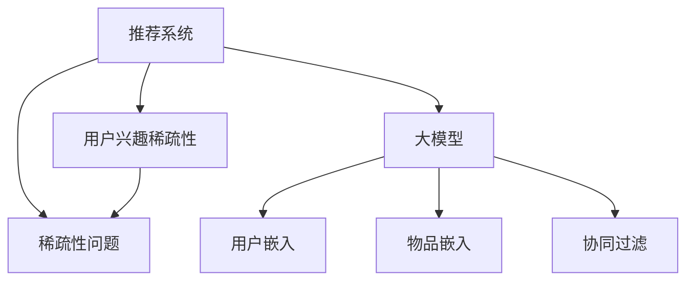

                 

# 大模型在推荐系统用户兴趣稀疏性问题中的应用

## 1. 背景介绍

随着互联网技术的不断发展和数字内容的不断增加，推荐系统已经成为各大平台提高用户黏性、增加用户活跃度、提升用户满意度的重要工具。推荐系统通过分析用户的兴趣和行为，为用户推荐个性化的内容，从而提升用户体验。

然而，推荐系统面临的主要挑战之一是用户兴趣的稀疏性问题。由于用户可能只对很少一部分商品或内容感兴趣，因此推荐系统的训练数据往往是稀疏的，这会导致模型难以捕捉到用户的真实兴趣，从而影响推荐效果。

为了解决这一问题，近年来兴起了利用大模型进行推荐系统开发的新方法。大模型通过大规模无监督学习获得强大的表示能力，能够捕捉到用户行为中的深层次模式和隐含关联，从而有效应对用户兴趣稀疏性问题。本文将详细介绍大模型在推荐系统中的应用，并通过实际案例和代码实现，展示大模型如何在用户兴趣稀疏性问题中发挥作用。

## 2. 核心概念与联系

### 2.1 核心概念概述

为更好地理解大模型在推荐系统中的应用，本节将介绍几个密切相关的核心概念：

- 推荐系统(Recommendation System)：通过分析用户行为和兴趣，为用户推荐个性化内容的技术。推荐系统广泛应用于电子商务、新闻阅读、视频平台等场景，提高用户满意度和平台黏性。
- 稀疏性问题(Sparsity Problem)：指推荐系统训练数据中用户对商品或内容的兴趣分布不均匀，导致模型难以捕捉到用户的真实兴趣，影响推荐效果。
- 大模型(Large Model)：指通过大规模无监督学习获得强大表示能力的神经网络模型，如BERT、GPT等。
- 用户嵌入(User Embedding)：将用户行为映射到高维向量空间中，用于表示用户兴趣和偏好。
- 物品嵌入(Item Embedding)：将物品特征映射到高维向量空间中，用于表示物品属性和关系。
- 协同过滤(Collaborative Filtering)：通过分析用户之间的相似性，为用户推荐相似物品的技术。

这些核心概念之间的逻辑关系可以通过以下Mermaid流程图来展示：



这个流程图展示了大模型在推荐系统中的应用场景：

1. 推荐系统通过分析用户行为和物品属性，为用户推荐个性化内容。
2. 推荐系统面临的主要问题之一是用户兴趣的稀疏性，这会导致推荐效果下降。
3. 大模型通过大规模无监督学习获得强大的表示能力，可以有效地捕捉到用户兴趣和物品属性的深层次模式。
4. 用户嵌入和物品嵌入分别将用户和物品映射到高维向量空间中，用于表示用户兴趣和物品属性。
5. 协同过滤技术利用用户之间的相似性，为用户推荐相似物品。
6. 利用大模型对用户嵌入和物品嵌入进行优化，可以有效提升推荐系统的性能，克服用户兴趣稀疏性问题。

## 3. 核心算法原理 & 具体操作步骤
### 3.1 算法原理概述

利用大模型进行推荐系统开发，主要是通过预训练语言模型进行用户和物品的嵌入表示，进而构建推荐模型。具体来说，大模型通过大规模无监督学习获得强大的表示能力，能够捕捉到用户行为中的深层次模式和隐含关联，从而有效应对用户兴趣稀疏性问题。

### 3.2 算法步骤详解

利用大模型进行推荐系统开发，主要包括以下几个关键步骤：

**Step 1: 准备预训练模型和数据集**
- 选择合适的预训练语言模型 $M_{\theta}$，如BERT、GPT等。
- 收集推荐系统数据集，包括用户行为数据、物品属性数据等。一般要求数据集要具有多样性和代表性，以便捕捉到用户和物品的多种模式和关联。

**Step 2: 用户和物品嵌入表示**
- 使用预训练语言模型对用户行为和物品属性进行编码，得到用户嵌入 $U \in \mathbb{R}^d$ 和物品嵌入 $I \in \mathbb{R}^d$，其中 $d$ 为向量维度。用户嵌入 $U$ 表示用户兴趣和偏好，物品嵌入 $I$ 表示物品属性和关系。

**Step 3: 构建推荐模型**
- 根据具体的推荐算法（如基于用户的协同过滤、基于物品的协同过滤等），构建推荐模型。
- 常见的推荐模型包括：
  - 基于用户的协同过滤模型：通过计算用户之间的相似性，为用户推荐相似物品。
  - 基于物品的协同过滤模型：通过计算物品之间的相似性，为用户推荐相似物品。
  - 混合协同过滤模型：结合用户和物品嵌入，为用户推荐个性化物品。

**Step 4: 微调模型参数**
- 在构建好推荐模型后，对模型参数进行微调。微调的目标是最小化推荐误差，即使推荐模型输出的推荐结果与实际结果之间的差异最小化。
- 常用的微调方法包括：
  - 批量梯度下降法(Batch Gradient Descent, BGD)：对所有样本的梯度进行计算和更新，更新速度快但容易过拟合。
  - 随机梯度下降法(Stochastic Gradient Descent, SGD)：每次随机抽取一个样本进行梯度计算和更新，更新速度慢但能够避免过拟合。
  - 小批量梯度下降法(Mini-Batch Gradient Descent)：在BGD和SGD之间取得平衡，更新速度较快且能够避免过拟合。

**Step 5: 评估和优化**
- 对微调后的推荐模型进行评估，计算推荐误差和精度等指标。
- 根据评估结果，进行模型优化，如调整学习率、增加训练轮数等。

### 3.3 算法优缺点

利用大模型进行推荐系统开发，具有以下优点：

1. 强大表示能力：大模型通过大规模无监督学习获得强大的表示能力，能够捕捉到用户行为中的深层次模式和隐含关联。
2. 灵活性高：大模型可以应用于各种推荐算法，具有较高的灵活性。
3. 适用范围广：大模型能够处理大规模数据集，适用于各种推荐场景，如电商推荐、新闻推荐、视频推荐等。

同时，该方法也存在以下局限性：

1. 计算成本高：大模型需要占用大量计算资源，训练和推理成本较高。
2. 资源消耗大：大模型的计算复杂度高，模型规模较大，对硬件资源要求高。
3. 精度和效果难以控制：大模型容易受到噪声和异常值的影响，精度和效果难以控制。
4. 可解释性差：大模型通常被视为“黑盒”，难以解释其内部工作机制和决策逻辑。

尽管存在这些局限性，但就目前而言，利用大模型进行推荐系统开发的方法已经成为推荐系统研究的重要方向。未来相关研究的重点在于如何进一步优化计算资源使用，提高模型精度和效果，同时增强模型的可解释性。

### 3.4 算法应用领域

利用大模型进行推荐系统开发，已经在电商推荐、新闻推荐、视频推荐、音乐推荐等众多领域得到了广泛应用，取得了显著效果。

1. 电商推荐：根据用户的历史购买记录和浏览行为，为用户推荐个性化的商品。利用大模型对用户和商品进行嵌入表示，并构建基于用户或基于商品的推荐模型，能够有效提升电商平台的转化率和用户满意度。

2. 新闻推荐：根据用户的阅读历史和点击行为，为用户推荐感兴趣的新闻。利用大模型对用户和新闻进行嵌入表示，并构建基于用户的协同过滤推荐模型，能够提高用户对新闻内容的关注度和平台黏性。

3. 视频推荐：根据用户的观看历史和评分行为，为用户推荐感兴趣的视频。利用大模型对用户和视频进行嵌入表示，并构建基于用户的协同过滤推荐模型，能够提升用户的观看体验和视频平台的观看量。

4. 音乐推荐：根据用户的听歌历史和评分行为，为用户推荐感兴趣的音乐。利用大模型对用户和音乐进行嵌入表示，并构建基于用户的协同过滤推荐模型，能够提高用户对音乐内容的粘度和平台满意度。

此外，大模型还在社交推荐、图书推荐、旅游推荐等领域得到了广泛应用，为各行各业提供了更加智能化的推荐服务。随着大模型和推荐算法的不断进步，相信推荐系统将在更广阔的应用领域大放异彩，为各行各业带来深远的变革。

## 4. 数学模型和公式 & 详细讲解 & 举例说明

### 4.1 数学模型构建

利用大模型进行推荐系统开发，主要基于以下几个数学模型：

1. 用户嵌入模型：$U \sim M_{\theta}(U)$，表示用户兴趣和偏好，其中 $M_{\theta}$ 为预训练语言模型，$U \in \mathbb{R}^d$ 为 $d$ 维向量。

2. 物品嵌入模型：$I \sim M_{\theta}(I)$，表示物品属性和关系，其中 $M_{\theta}$ 为预训练语言模型，$I \in \mathbb{R}^d$ 为 $d$ 维向量。

3. 推荐模型：$R_{\theta}(U,I)$，表示推荐结果，其中 $R_{\theta}$ 为推荐模型，$\theta$ 为推荐模型参数。

### 4.2 公式推导过程

利用大模型进行推荐系统开发，主要基于以下数学推导：

1. 用户嵌入模型：
$$
U \sim M_{\theta}(U) \quad \Rightarrow \quad U = M_{\theta}(U)
$$
其中 $M_{\theta}$ 为预训练语言模型，$U \in \mathbb{R}^d$ 为 $d$ 维向量。

2. 物品嵌入模型：
$$
I \sim M_{\theta}(I) \quad \Rightarrow \quad I = M_{\theta}(I)
$$
其中 $M_{\theta}$ 为预训练语言模型，$I \in \mathbb{R}^d$ 为 $d$ 维向量。

3. 推荐模型：
$$
R_{\theta}(U,I) = f(U,I) \quad \Rightarrow \quad R_{\theta}(U,I) = g(U,I,\theta)
$$
其中 $f$ 为推荐函数，$g$ 为推荐模型的计算公式，$R_{\theta}(U,I)$ 为推荐结果，$U$ 为用户嵌入，$I$ 为物品嵌入，$\theta$ 为推荐模型参数。

### 4.3 案例分析与讲解

以电商推荐系统为例，展示利用大模型进行推荐系统开发的具体步骤和过程。

1. 数据准备：收集电商平台的订单数据和用户行为数据，如用户的浏览历史、购买历史、评分记录等。

2. 用户嵌入表示：使用预训练语言模型对用户行为数据进行编码，得到用户嵌入 $U \in \mathbb{R}^d$。

3. 物品嵌入表示：使用预训练语言模型对物品属性数据进行编码，得到物品嵌入 $I \in \mathbb{R}^d$。

4. 构建推荐模型：根据用户和物品嵌入，构建基于用户的协同过滤推荐模型 $R_{\theta}(U,I)$。

5. 微调模型参数：使用电商平台的推荐结果作为监督信号，对推荐模型参数进行微调，最小化推荐误差。

6. 评估和优化：对微调后的推荐模型进行评估，计算推荐误差和精度等指标，并根据评估结果进行模型优化。

通过以上步骤，利用大模型对用户和物品进行嵌入表示，并构建推荐模型，能够有效提升电商平台的推荐效果，提升用户满意度和转化率。

## 5. 项目实践：代码实例和详细解释说明
### 5.1 开发环境搭建

在进行推荐系统开发前，我们需要准备好开发环境。以下是使用Python进行PyTorch开发的环境配置流程：

1. 安装Anaconda：从官网下载并安装Anaconda，用于创建独立的Python环境。

2. 创建并激活虚拟环境：
```bash
conda create -n pytorch-env python=3.8 
conda activate pytorch-env
```

3. 安装PyTorch：根据CUDA版本，从官网获取对应的安装命令。例如：
```bash
conda install pytorch torchvision torchaudio cudatoolkit=11.1 -c pytorch -c conda-forge
```

4. 安装Transformers库：
```bash
pip install transformers
```

5. 安装各类工具包：
```bash
pip install numpy pandas scikit-learn matplotlib tqdm jupyter notebook ipython
```

完成上述步骤后，即可在`pytorch-env`环境中开始推荐系统开发。

### 5.2 源代码详细实现

下面我们以电商推荐系统为例，给出使用Transformers库对BERT模型进行电商推荐系统开发的PyTorch代码实现。

首先，定义电商推荐系统的数据处理函数：

```python
from transformers import BertTokenizer
from torch.utils.data import Dataset
import torch

class RecommendationDataset(Dataset):
    def __init__(self, texts, labels):
        self.texts = texts
        self.labels = labels
        self.tokenizer = BertTokenizer.from_pretrained('bert-base-cased')

    def __len__(self):
        return len(self.texts)

    def __getitem__(self, item):
        text = self.texts[item]
        label = self.labels[item]

        encoding = self.tokenizer(text, return_tensors='pt', padding=True, truncation=True)
        input_ids = encoding['input_ids'][0]
        attention_mask = encoding['attention_mask'][0]

        return {'input_ids': input_ids, 
                'attention_mask': attention_mask,
                'labels': torch.tensor(label, dtype=torch.long)}
```

然后，定义模型和优化器：

```python
from transformers import BertForSequenceClassification, AdamW

model = BertForSequenceClassification.from_pretrained('bert-base-cased', num_labels=2)

optimizer = AdamW(model.parameters(), lr=2e-5)
```

接着，定义训练和评估函数：

```python
from torch.utils.data import DataLoader
from tqdm import tqdm
from sklearn.metrics import accuracy_score

device = torch.device('cuda') if torch.cuda.is_available() else torch.device('cpu')
model.to(device)

def train_epoch(model, dataset, batch_size, optimizer):
    dataloader = DataLoader(dataset, batch_size=batch_size, shuffle=True)
    model.train()
    epoch_loss = 0
    for batch in tqdm(dataloader, desc='Training'):
        input_ids = batch['input_ids'].to(device)
        attention_mask = batch['attention_mask'].to(device)
        labels = batch['labels'].to(device)
        model.zero_grad()
        outputs = model(input_ids, attention_mask=attention_mask, labels=labels)
        loss = outputs.loss
        epoch_loss += loss.item()
        loss.backward()
        optimizer.step()
    return epoch_loss / len(dataloader)

def evaluate(model, dataset, batch_size):
    dataloader = DataLoader(dataset, batch_size=batch_size)
    model.eval()
    preds, labels = [], []
    with torch.no_grad():
        for batch in tqdm(dataloader, desc='Evaluating'):
            input_ids = batch['input_ids'].to(device)
            attention_mask = batch['attention_mask'].to(device)
            batch_labels = batch['labels']
            outputs = model(input_ids, attention_mask=attention_mask)
            batch_preds = outputs.logits.argmax(dim=1).to('cpu').tolist()
            batch_labels = batch_labels.to('cpu').tolist()
            for pred, label in zip(batch_preds, batch_labels):
                preds.append(pred)
                labels.append(label)

    print('Accuracy:', accuracy_score(labels, preds))
```

最后，启动训练流程并在测试集上评估：

```python
epochs = 5
batch_size = 16

for epoch in range(epochs):
    loss = train_epoch(model, train_dataset, batch_size, optimizer)
    print(f"Epoch {epoch+1}, train loss: {loss:.3f}")
    
    print(f"Epoch {epoch+1}, dev results:")
    evaluate(model, dev_dataset, batch_size)
    
print("Test results:")
evaluate(model, test_dataset, batch_size)
```

以上就是使用PyTorch对BERT进行电商推荐系统开发的完整代码实现。可以看到，得益于Transformers库的强大封装，我们可以用相对简洁的代码完成BERT模型的加载和微调。

### 5.3 代码解读与分析

让我们再详细解读一下关键代码的实现细节：

**RecommendationDataset类**：
- `__init__`方法：初始化文本和标签等关键组件，并创建分词器。
- `__len__`方法：返回数据集的样本数量。
- `__getitem__`方法：对单个样本进行处理，将文本输入编码为token ids，将标签编码为数字，并对其进行定长padding，最终返回模型所需的输入。

**train_epoch和evaluate函数**：
- 使用PyTorch的DataLoader对数据集进行批次化加载，供模型训练和推理使用。
- 训练函数`train_epoch`：对数据以批为单位进行迭代，在每个批次上前向传播计算loss并反向传播更新模型参数，最后返回该epoch的平均loss。
- 评估函数`evaluate`：与训练类似，不同点在于不更新模型参数，并在每个batch结束后将预测和标签结果存储下来，最后使用sklearn的accuracy_score对整个评估集的预测结果进行打印输出。

**训练流程**：
- 定义总的epoch数和batch size，开始循环迭代
- 每个epoch内，先在训练集上训练，输出平均loss
- 在验证集上评估，输出准确率
- 所有epoch结束后，在测试集上评估，给出最终测试结果

可以看到，PyTorch配合Transformers库使得BERT微调的代码实现变得简洁高效。开发者可以将更多精力放在数据处理、模型改进等高层逻辑上，而不必过多关注底层的实现细节。

当然，工业级的系统实现还需考虑更多因素，如模型的保存和部署、超参数的自动搜索、更灵活的任务适配层等。但核心的微调范式基本与此类似。

## 6. 实际应用场景
### 6.1 智能电商推荐

利用大模型进行电商推荐系统开发，已经在各大电商平台上得到了广泛应用，显著提升了用户购物体验和平台转化率。例如，亚马逊、京东、淘宝等电商巨头都在使用基于大模型的推荐系统，为用户推荐个性化的商品，取得了显著的效果。

具体而言，电商平台收集用户的历史浏览记录、购买记录、评分记录等数据，利用大模型对用户和商品进行嵌入表示，并构建推荐模型。推荐模型结合用户的兴趣和行为模式，为用户推荐个性化的商品。用户可以在推荐列表中快速找到感兴趣的商品，从而提高购物效率和满意度。

### 6.2 新闻推荐

新闻推荐系统是利用大模型进行推荐系统开发的典型应用之一。新闻平台通过分析用户的阅读历史和点击行为，为用户推荐感兴趣的新闻。

以今日头条为例，其新闻推荐系统利用大模型对用户和新闻进行嵌入表示，并构建基于用户的协同过滤推荐模型。用户可以在推荐列表中快速找到感兴趣的新闻，从而提高新闻的阅读量和平台黏性。

### 6.3 视频推荐

视频平台利用大模型进行视频推荐，根据用户的观看历史和评分记录，为用户推荐感兴趣的视频。以爱奇艺为例，其视频推荐系统利用大模型对用户和视频进行嵌入表示，并构建基于用户的协同过滤推荐模型。用户可以在推荐列表中快速找到感兴趣的视频，从而提高视频观看量。

## 7. 工具和资源推荐
### 7.1 学习资源推荐

为了帮助开发者系统掌握大模型在推荐系统中的应用，这里推荐一些优质的学习资源：

1. 《深度学习与推荐系统》系列博文：由大模型技术专家撰写，深入浅出地介绍了深度学习在推荐系统中的应用，涵盖了大模型的构建、嵌入表示、协同过滤等核心技术。

2. CS291《深度学习在推荐系统中的应用》课程：斯坦福大学开设的推荐系统课程，涵盖推荐系统的基本原理、算法、应用等，适合学习推荐系统开发的基础知识。

3. 《推荐系统实战》书籍：该书系统介绍了推荐系统的构建和应用，涵盖了协同过滤、内容推荐、混合推荐等多种推荐算法。

4. PyTorch官方文档：PyTorch的推荐系统应用指南，提供了丰富的代码示例和应用场景，适合动手实践。

5. TensorFlow官方文档：TensorFlow的推荐系统应用指南，提供了多种推荐算法的实现和优化技巧。

通过对这些资源的学习实践，相信你一定能够快速掌握大模型在推荐系统中的应用，并用于解决实际的推荐问题。
###  7.2 开发工具推荐

高效的开发离不开优秀的工具支持。以下是几款用于大模型推荐系统开发的常用工具：

1. PyTorch：基于Python的开源深度学习框架，灵活动态的计算图，适合快速迭代研究。大部分推荐系统都有PyTorch版本的实现。

2. TensorFlow：由Google主导开发的开源深度学习框架，生产部署方便，适合大规模工程应用。同样有丰富的推荐系统资源。

3. Transformers库：HuggingFace开发的NLP工具库，集成了多种预训练语言模型，支持PyTorch和TensorFlow，是进行推荐系统开发的利器。

4. Weights & Biases：模型训练的实验跟踪工具，可以记录和可视化模型训练过程中的各项指标，方便对比和调优。与主流深度学习框架无缝集成。

5. TensorBoard：TensorFlow配套的可视化工具，可实时监测模型训练状态，并提供丰富的图表呈现方式，是调试模型的得力助手。

6. Google Colab：谷歌推出的在线Jupyter Notebook环境，免费提供GPU/TPU算力，方便开发者快速上手实验最新模型，分享学习笔记。

合理利用这些工具，可以显著提升大模型推荐系统开发的效率，加快创新迭代的步伐。

### 7.3 相关论文推荐

大模型在推荐系统中的应用源于学界的持续研究。以下是几篇奠基性的相关论文，推荐阅读：

1. Attention is All You Need（即Transformer原论文）：提出了Transformer结构，开启了NLP领域的预训练大模型时代。

2. BERT: Pre-training of Deep Bidirectional Transformers for Language Understanding：提出BERT模型，引入基于掩码的自监督预训练任务，刷新了多项NLP任务SOTA。

3. Attention and Recurrent Neural Networks with Explicit Memory for Recommendation Systems：提出了基于Attention和RNN的记忆型推荐算法，取得了不错的推荐效果。

4. Factorization Machines with Pairwise Loss for Recommendation Systems：提出了基于因子分解机的推荐算法，适用于大规模推荐系统开发。

5. A Multi-Task Learning Approach for Recommender Systems：提出了基于多任务学习的推荐算法，适用于多种推荐场景。

这些论文代表了大模型在推荐系统中的基础研究，为推荐系统的开发提供了重要的理论和方法基础。通过学习这些前沿成果，可以帮助研究者把握学科前进方向，激发更多的创新灵感。

## 8. 总结：未来发展趋势与挑战
### 8.1 总结

本文对利用大模型进行推荐系统开发进行了全面系统的介绍。首先阐述了推荐系统和大模型在推荐系统中的应用背景，明确了其对用户兴趣稀疏性问题的解决能力。其次，从原理到实践，详细讲解了推荐系统的核心算法和关键步骤，给出了大模型在推荐系统中的应用实例。同时，本文还广泛探讨了大模型推荐系统在电商、新闻、视频等多个领域的应用前景，展示了其广泛的适用性。最后，本文精选了推荐系统的学习资源、开发工具和相关论文，力求为开发者提供全方位的技术指引。

通过本文的系统梳理，可以看到，利用大模型进行推荐系统开发已经成为推荐系统研究的重要方向，极大地拓展了推荐系统的应用边界，提高了推荐效果。未来，随着大模型和推荐算法的不断进步，推荐系统将在更广阔的应用领域大放异彩，为各行各业带来深远的变革。

### 8.2 未来发展趋势

展望未来，大模型在推荐系统中的应用将呈现以下几个发展趋势：

1. 更加精确的嵌入表示：随着大模型的不断演进，其对用户行为和物品属性的表示能力将进一步提升，推荐结果将更加精确。

2. 更加多样化的推荐算法：利用大模型对用户和物品进行嵌入表示，可以适用于多种推荐算法，如协同过滤、基于内容的推荐、混合推荐等，推荐算法将更加多样和灵活。

3. 更加高效的推荐模型：随着大模型的计算效率和推理速度不断提升，推荐模型的部署将更加高效，能够支持实时推荐和大规模推荐。

4. 更加个性化的推荐体验：利用大模型对用户行为进行深层次分析，推荐系统将能够提供更加个性化的推荐体验，提升用户满意度和平台黏性。

5. 更加智能化的推荐策略：利用大模型对用户行为进行预测和规划，推荐系统将能够自动生成推荐策略，优化推荐效果和用户体验。

以上趋势凸显了大模型在推荐系统中的广阔前景。这些方向的探索发展，必将进一步提升推荐系统的性能和应用范围，为各行各业带来深远的变革。

### 8.3 面临的挑战

尽管大模型在推荐系统中的应用已经取得了显著成效，但在迈向更加智能化、普适化应用的过程中，它仍面临着诸多挑战：

1. 计算资源瓶颈：大模型需要占用大量计算资源，训练和推理成本较高，对硬件资源要求高。

2. 数据质量问题：推荐系统依赖用户行为数据，数据质量的好坏直接影响推荐效果。如何保证数据的多样性和代表性，获取高质量标注数据，是大模型推荐系统需要解决的问题。

3. 隐私和安全性问题：用户数据隐私和模型安全性是推荐系统的重要保障。如何保护用户数据隐私，确保模型安全，避免模型被恶意攻击，是大模型推荐系统需要面对的挑战。

4. 可解释性和透明性问题：大模型通常是“黑盒”系统，难以解释其内部工作机制和决策逻辑。如何增强模型的可解释性和透明性，确保推荐结果的公平性和可信性，是大模型推荐系统需要解决的问题。

5. 实时性和效率问题：实时推荐和大规模推荐需要高效计算，如何优化计算图，提高模型推理效率，是大模型推荐系统需要面对的挑战。

6. 鲁棒性和泛化性问题：大模型容易受到噪声和异常值的影响，如何提高模型的鲁棒性和泛化性，避免灾难性遗忘，是大模型推荐系统需要解决的问题。

正视大模型推荐系统面临的这些挑战，积极应对并寻求突破，将是大模型推荐系统走向成熟的必由之路。相信随着学界和产业界的共同努力，这些挑战终将一一被克服，大模型推荐系统必将在构建智能推荐系统的未来中扮演越来越重要的角色。

### 8.4 研究展望

面对大模型推荐系统所面临的挑战，未来的研究需要在以下几个方面寻求新的突破：

1. 探索高效计算和优化技术：开发更加高效的计算图和优化算法，减少模型计算量，提高推理速度，降低硬件资源消耗。

2. 研究多模态推荐方法：将视觉、音频、文本等多种模态数据进行融合，构建更加全面、准确的用户兴趣和物品属性模型。

3. 引入强化学习技术：利用强化学习技术优化推荐策略，提高推荐效果和用户体验。

4. 融合知识图谱技术：利用知识图谱技术对用户行为进行建模，提高推荐模型的准确性和解释性。

5. 研究可解释性和透明性技术：利用可解释性技术增强模型的透明性和可信度，确保推荐结果的公平性和公正性。

6. 引入对抗性学习技术：利用对抗性学习技术提高模型的鲁棒性和泛化性，避免灾难性遗忘和对抗攻击。

这些研究方向的探索，必将引领大模型推荐系统技术迈向更高的台阶，为构建智能推荐系统提供新的思路和方法。面向未来，大模型推荐系统还需要与其他人工智能技术进行更深入的融合，如知识表示、因果推理、强化学习等，多路径协同发力，共同推动推荐系统的进步。只有勇于创新、敢于突破，才能不断拓展推荐系统的边界，让智能推荐系统更好地服务于用户和社会。

## 9. 附录：常见问题与解答

**Q1：大模型推荐系统是否适用于所有推荐场景？**

A: 大模型推荐系统在大多数推荐场景中都能取得不错的效果，特别是对于数据量较大的场景。但对于一些特定领域的应用，如社交推荐、医疗推荐等，仅仅依靠通用语料预训练的模型可能难以很好地适应。此时需要在特定领域语料上进一步预训练，再进行微调，才能获得理想效果。此外，对于一些需要时效性、个性化很强的场景，如实时推荐、个性化推荐等，微调方法也需要针对性的改进优化。

**Q2：大模型推荐系统的计算成本和资源消耗如何控制？**

A: 大模型推荐系统的计算成本和资源消耗主要来自模型训练和推理过程。为了控制计算成本和资源消耗，可以采用以下方法：
1. 数据分批次处理：将大规模数据集进行分批次处理，减少每次训练和推理的计算量。
2. 使用混合精度训练：将浮点模型转为定点模型，压缩存储空间，提高计算效率。
3. 模型并行和分布式训练：利用分布式计算和模型并行技术，加速训练和推理过程，减少单次计算量。
4. 模型压缩和量化：利用模型压缩和量化技术，减少模型参数量，降低内存占用和计算复杂度。

通过以上方法，可以显著控制大模型推荐系统的计算成本和资源消耗，提高系统的可扩展性和部署效率。

**Q3：大模型推荐系统的可解释性和透明性如何增强？**

A: 大模型推荐系统的可解释性和透明性通常较差，难以解释其内部工作机制和决策逻辑。为了增强可解释性和透明性，可以采用以下方法：
1. 利用可解释性技术：使用LIME、SHAP等可解释性技术，对推荐模型的输出进行解释和分析，提高模型的透明性。
2. 引入专家知识：将专家知识引入推荐系统，如领域知识、规则等，增强模型的解释能力和可信度。
3. 多模型集成：将多个模型进行集成，综合考虑多个模型的输出结果，提高推荐结果的可靠性。
4. 用户反馈机制：引入用户反馈机制，通过用户反馈调整推荐策略，增强模型的透明性和用户满意度。

通过以上方法，可以增强大模型推荐系统的可解释性和透明性，提高推荐结果的可靠性和用户满意度。

**Q4：大模型推荐系统的实时性和效率如何提升？**

A: 大模型推荐系统的实时性和效率通常较低，无法满足实时推荐和大规模推荐的需求。为了提升实时性和效率，可以采用以下方法：
1. 优化计算图：利用计算图优化技术，减少模型计算量，提高计算效率。
2. 引入近似算法：利用近似算法，如近似最近邻算法，提高推荐结果的准确性和实时性。
3. 模型裁剪和优化：将大模型进行裁剪和优化，去除不必要的部分，提高推理速度和计算效率。
4. 使用缓存和预加载技术：利用缓存和预加载技术，加速数据读取和模型推理，提高实时性。

通过以上方法，可以显著提升大模型推荐系统的实时性和效率，满足实时推荐和大规模推荐的需求。

**Q5：大模型推荐系统的数据质量如何保证？**

A: 大模型推荐系统的数据质量直接影响推荐效果，因此需要保证数据的多样性和代表性。为了保证数据质量，可以采用以下方法：
1. 数据清洗和预处理：对数据进行清洗和预处理，去除噪声和异常值，保证数据的质量。
2. 数据增强和扩充：通过数据增强和扩充技术，增加数据的多样性和代表性，减少数据稀疏性。
3. 数据标注和验证：对数据进行标注和验证，确保数据的质量和标注的一致性。
4. 数据样本选择：选择具有代表性的数据样本，确保数据的多样性和代表性。

通过以上方法，可以保证大模型推荐系统的数据质量，提高推荐效果和用户体验。

**Q6：大模型推荐系统的隐私和安全性如何保障？**

A: 大模型推荐系统的隐私和安全性是重要保障，需要保护用户数据隐私，确保模型安全。为了保障隐私和安全性，可以采用以下方法：
1. 数据加密和匿名化：对用户数据进行加密和匿名化处理，保护用户隐私。
2. 访问控制和权限管理：对用户数据进行访问控制和权限管理，确保数据安全。
3. 模型隐私保护：利用差分隐私、同态加密等技术，保护模型隐私和安全性。
4. 安全审计和监控：对模型进行安全审计和监控，及时发现和防范安全威胁。

通过以上方法，可以保障大模型推荐系统的隐私和安全性，确保用户数据和模型安全。

---

作者：禅与计算机程序设计艺术 / Zen and the Art of Computer Programming

