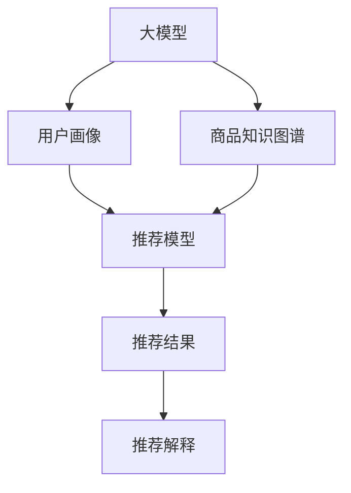

                 

# 大模型在电商平台商品推荐解释中的应用

## 1. 背景介绍

### 1.1 问题由来
随着电子商务的迅猛发展，电商平台需面对海量商品和用户需求，以算法驱动的方式提升用户体验和转化率。传统推荐系统主要依赖用户历史行为数据进行推荐，但对新用户和老用户、冷启动、物品信息稀疏等问题，传统算法往往束手无策。而大模型通过融合海量文本数据，学习和提取用户语义和上下文信息，具备更强的泛化能力和冷启动能力，可为电商平台推荐系统提供更全面、更精准的解释和推荐。

## 2. 核心概念与联系

### 2.1 核心概念概述

为更好地理解大模型在电商平台商品推荐解释中的应用，本节将介绍几个关键概念：

- 大模型：以Transformer为代表的大规模预训练语言模型，通过在大规模无标签文本数据上进行预训练，学习到丰富的语言知识和语义理解能力。

- 推荐系统：通过收集用户行为数据，利用算法推荐最适合用户的商品，提升用户体验和销售转化。

- 用户画像：对用户行为数据进行分析和建模，构建用户个性化特征标签，为个性化推荐提供依据。

- 解释性：指模型决策过程的可解释性，即解释推荐结果背后的逻辑和依据。

- 商品知识图谱：将商品属性和关系结构化存储，便于模型进行语义理解和推理。

- 上下文信息：考虑用户当前浏览行为、商品描述、评价等语境信息，提升推荐的相关性和多样性。

这些核心概念之间存在紧密的联系。大模型通过学习文本数据，提取用户语义和上下文信息，为推荐系统提供更全面的用户画像和商品知识图谱。推荐系统利用大模型生成的用户画像和商品语义表示，进行个性化推荐，并生成推荐结果的解释性描述，帮助用户理解推荐逻辑。

### 2.2 核心概念原理和架构的 Mermaid 流程图



此图表展示了大模型在推荐系统中的应用流程。大模型学习用户文本和商品语义信息，生成用户画像和商品知识图谱，推荐模型通过这些信息生成推荐结果，并由推荐解释模块提供解释性描述。

## 3. 核心算法原理 & 具体操作步骤
### 3.1 算法原理概述

大模型在电商平台商品推荐解释中的应用，主要涉及以下算法原理：

- 基于大模型的用户画像构建：通过收集和分析用户浏览、点击、评价等文本数据，学习用户语义表示，构建用户画像标签。
- 基于大模型的商品语义表示学习：使用大模型对商品描述、标题、属性等信息进行编码，学习商品语义表示。
- 推荐模型的构建与训练：设计推荐算法，通过学习用户画像和商品语义表示，生成推荐结果。
- 推荐结果的解释性生成：使用大模型对推荐结果进行语义解释，生成自然语言描述。

这些算法共同构成了一个完整的电商平台推荐解释系统。

### 3.2 算法步骤详解

#### 3.2.1 用户画像构建

用户画像的构建过程如下：

1. 数据收集：收集用户在电商平台上的浏览行为、点击记录、评价反馈、搜索关键词等文本数据。

2. 数据清洗：去除噪音和无关信息，保留与用户兴趣和需求相关的文本。

3. 分词与向量化：将清洗后的文本进行分词，使用词向量模型将其转换为向量表示。

4. 用户画像建模：使用大模型(如BERT、GPT等)对用户文本进行语义编码，生成用户语义表示。

5. 特征提取：对用户语义表示进行降维，提取关键特征标签，用于推荐系统建模。

#### 3.2.2 商品语义表示学习

商品语义表示学习过程如下：

1. 数据收集：收集商品描述、标题、属性等文本信息。

2. 数据预处理：去除停用词、标点符号，保留有用的文本信息。

3. 分词与向量化：使用词向量模型对商品文本进行分词和向量化。

4. 预训练：使用预训练语言模型(如BERT)对商品文本进行编码，生成商品语义表示。

5. 特征提取：对商品语义表示进行降维，提取关键特征，用于推荐模型建模。

#### 3.2.3 推荐模型构建与训练

推荐模型的构建过程如下：

1. 数据准备：收集用户画像和商品语义表示数据，构建推荐模型的输入和输出。

2. 推荐算法设计：根据业务需求选择合适的推荐算法，如协同过滤、基于内容的推荐、混合推荐等。

3. 模型训练：使用优化算法(如AdamW)对推荐模型进行训练，最小化预测误差。

4. 模型评估：在测试集上评估推荐模型的性能，调整超参数，优化推荐效果。

#### 3.2.4 推荐结果解释

推荐结果解释过程如下：

1. 数据收集：收集推荐结果和商品信息。

2. 文本生成：使用大模型生成推荐结果的语义解释文本。

3. 自然语言处理：对生成的文本进行自然语言处理，优化语言流畅性和可读性。

4. 反馈循环：将推荐解释文本反馈给用户，收集用户反馈，进一步优化推荐模型。

### 3.3 算法优缺点

#### 3.3.1 优点

大模型在电商平台商品推荐解释中具有以下优点：

1. 泛化能力强：大模型可以学习海量文本数据，提取丰富的语义信息，适用于不同场景下的推荐需求。

2. 冷启动效果好：大模型可以捕捉用户的隐含需求，无需大量历史数据即可进行推荐。

3. 解释性强：大模型能够生成自然语言解释，帮助用户理解推荐逻辑，提升用户体验。

4. 多模态融合：大模型能够处理文本、图像、音频等多模态数据，实现多维度的商品推荐。

5. 鲁棒性高：大模型能够自动过滤噪声数据，提升推荐模型的稳定性和鲁棒性。

#### 3.3.2 缺点

大模型在电商平台商品推荐解释中存在以下缺点：

1. 计算成本高：大模型的训练和推理需要大量的计算资源和存储资源，对硬件要求较高。

2. 数据隐私问题：大模型需要收集和处理用户数据，涉及用户隐私保护问题。

3. 可解释性复杂：大模型的黑盒特性可能导致推荐解释的可解释性复杂，难以满足用户需求。

4. 对抗攻击风险：大模型可能受到对抗样本的攻击，导致推荐结果的偏差。

5. 模型参数量大：大模型的参数量巨大，模型压缩和优化难度较大。

### 3.4 算法应用领域

大模型在电商平台商品推荐解释中具有广泛的应用场景，如：

1. 个性化推荐：利用大模型学习用户兴趣和商品特征，生成个性化的推荐列表。

2. 实时推荐：在用户浏览行为发生时，实时生成推荐结果，提升用户转化率。

3. 情感分析：对用户评价和评论进行情感分析，生成情感推荐的商品。

4. 需求预测：通过学习用户历史行为数据，预测用户未来的购买需求。

5. 推荐解释：生成自然语言解释，解释推荐结果背后的逻辑和依据，提升用户满意度。

6. 用户满意度提升：通过解释推荐结果，帮助用户理解推荐逻辑，提升用户满意度。

## 4. 数学模型和公式 & 详细讲解 & 举例说明

### 4.1 数学模型构建

在电商平台推荐系统中，大模型主要用于用户画像构建、商品语义表示学习和推荐结果解释。假设用户画像为 $U$，商品语义表示为 $I$，推荐结果为 $R$，大模型为 $M$。构建推荐系统的数学模型如下：

$$
R = f(U, I, M)
$$

其中 $f$ 为推荐函数，$U$ 为用户画像，$I$ 为商品语义表示，$M$ 为大模型。

### 4.2 公式推导过程

#### 4.2.1 用户画像构建

假设用户文本为 $X = (x_1, x_2, ..., x_n)$，其中 $x_i$ 为第 $i$ 条文本，使用BERT模型对其进行编码，得到用户文本的向量表示 $u$。

$$
u = \text{BERT}(X)
$$

利用softmax函数对用户文本向量进行归一化，得到用户兴趣向量 $u_i$。

$$
u_i = \text{softmax}(u)
$$

对用户兴趣向量进行降维，得到用户画像标签 $L$。

$$
L = \text{dropout}(u_i)
$$

#### 4.2.2 商品语义表示学习

假设商品文本为 $Y = (y_1, y_2, ..., y_m)$，其中 $y_i$ 为第 $i$ 条文本，使用BERT模型对其进行编码，得到商品文本的向量表示 $i$。

$$
i = \text{BERT}(Y)
$$

利用softmax函数对商品文本向量进行归一化，得到商品特征向量 $i_k$。

$$
i_k = \text{softmax}(i)
$$

对商品特征向量进行降维，得到商品语义表示 $S$。

$$
S = \text{dropout}(i_k)
$$

#### 4.2.3 推荐结果生成

假设推荐结果为 $R = (r_1, r_2, ..., r_n)$，其中 $r_i$ 为第 $i$ 个推荐结果，使用优化算法(如AdamW)对推荐模型进行训练，最小化预测误差。

$$
\theta = \mathop{\arg\min}_{\theta} \mathcal{L}(R, f(U, I, M))
$$

其中 $\theta$ 为推荐模型参数，$\mathcal{L}$ 为损失函数，$R$ 为推荐结果，$f$ 为推荐函数。

### 4.3 案例分析与讲解

假设电商平台收集用户浏览行为数据 $X = (x_1, x_2, ..., x_n)$ 和商品描述数据 $Y = (y_1, y_2, ..., y_m)$，使用BERT模型进行编码，得到用户画像 $L$ 和商品语义表示 $S$。将 $L$ 和 $S$ 作为推荐模型的输入，生成推荐结果 $R$。

假设推荐结果为 $R = (r_1, r_2, ..., r_n)$，使用大模型生成推荐解释 $E$。

$$
E = \text{BERT}(R)
$$

将 $E$ 返回给用户，帮助用户理解推荐结果的依据。

## 5. 项目实践：代码实例和详细解释说明

### 5.1 开发环境搭建

在进行大模型在电商平台商品推荐解释的实践前，需要准备好开发环境。以下是使用Python进行PyTorch开发的环境配置流程：

1. 安装Anaconda：从官网下载并安装Anaconda，用于创建独立的Python环境。

2. 创建并激活虚拟环境：
```bash
conda create -n pytorch-env python=3.8 
conda activate pytorch-env
```

3. 安装PyTorch：根据CUDA版本，从官网获取对应的安装命令。例如：
```bash
conda install pytorch torchvision torchaudio cudatoolkit=11.1 -c pytorch -c conda-forge
```

4. 安装Transformers库：
```bash
pip install transformers
```

5. 安装各类工具包：
```bash
pip install numpy pandas scikit-learn matplotlib tqdm jupyter notebook ipython
```

完成上述步骤后，即可在`pytorch-env`环境中开始实践。

### 5.2 源代码详细实现

下面我们以用户画像构建和商品语义表示学习为例，给出使用Transformers库对BERT模型进行训练的PyTorch代码实现。

首先，定义用户画像构建函数：

```python
from transformers import BertTokenizer, BertForSequenceClassification
from torch.utils.data import Dataset
import torch

class UserProfileDataset(Dataset):
    def __init__(self, user_profiles, tokenizer, max_len=128):
        self.user_profiles = user_profiles
        self.tokenizer = tokenizer
        self.max_len = max_len
        
    def __len__(self):
        return len(self.user_profiles)
    
    def __getitem__(self, item):
        user_profile = self.user_profiles[item]
        user_profile_texts = [user_profile, 'user_profile']
        
        encoding = self.tokenizer(user_profile_texts, return_tensors='pt', max_length=self.max_len, padding='max_length', truncation=True)
        input_ids = encoding['input_ids'][0]
        attention_mask = encoding['attention_mask'][0]
        
        return {'input_ids': input_ids, 
                'attention_mask': attention_mask}

# 创建dataset
tokenizer = BertTokenizer.from_pretrained('bert-base-cased')

user_profiles_dataset = UserProfileDataset(user_profiles, tokenizer)
```

然后，定义商品语义表示学习函数：

```python
class ItemProfileDataset(Dataset):
    def __init__(self, item_profiles, tokenizer, max_len=128):
        self.item_profiles = item_profiles
        self.tokenizer = tokenizer
        self.max_len = max_len
        
    def __len__(self):
        return len(self.item_profiles)
    
    def __getitem__(self, item):
        item_profile = self.item_profiles[item]
        item_profile_texts = [item_profile, 'item_profile']
        
        encoding = self.tokenizer(item_profile_texts, return_tensors='pt', max_length=self.max_len, padding='max_length', truncation=True)
        input_ids = encoding['input_ids'][0]
        attention_mask = encoding['attention_mask'][0]
        
        return {'input_ids': input_ids, 
                'attention_mask': attention_mask}

# 创建dataset
tokenizer = BertTokenizer.from_pretrained('bert-base-cased')

item_profiles_dataset = ItemProfileDataset(item_profiles, tokenizer)
```

接着，定义模型和优化器：

```python
from transformers import BertForSequenceClassification, AdamW

model = BertForSequenceClassification.from_pretrained('bert-base-cased', num_labels=2)

optimizer = AdamW(model.parameters(), lr=2e-5)
```

然后，定义训练和评估函数：

```python
from torch.utils.data import DataLoader
from tqdm import tqdm
from sklearn.metrics import accuracy_score

device = torch.device('cuda') if torch.cuda.is_available() else torch.device('cpu')
model.to(device)

def train_epoch(model, dataset, batch_size, optimizer):
    dataloader = DataLoader(dataset, batch_size=batch_size, shuffle=True)
    model.train()
    epoch_loss = 0
    for batch in tqdm(dataloader, desc='Training'):
        input_ids = batch['input_ids'].to(device)
        attention_mask = batch['attention_mask'].to(device)
        model.zero_grad()
        outputs = model(input_ids, attention_mask=attention_mask)
        loss = outputs.loss
        epoch_loss += loss.item()
        loss.backward()
        optimizer.step()
    return epoch_loss / len(dataloader)

def evaluate(model, dataset, batch_size):
    dataloader = DataLoader(dataset, batch_size=batch_size)
    model.eval()
    preds, labels = [], []
    with torch.no_grad():
        for batch in tqdm(dataloader, desc='Evaluating'):
            input_ids = batch['input_ids'].to(device)
            attention_mask = batch['attention_mask'].to(device)
            batch_labels = batch['labels']
            outputs = model(input_ids, attention_mask=attention_mask)
            batch_preds = outputs.logits.argmax(dim=2).to('cpu').tolist()
            batch_labels = batch_labels.to('cpu').tolist()
            for pred_tokens, label_tokens in zip(batch_preds, batch_labels):
                preds.append(pred_tokens[:len(label_tokens)])
                labels.append(label_tokens)
                
    print(accuracy_score(labels, preds))
```

最后，启动训练流程并在测试集上评估：

```python
epochs = 5
batch_size = 16

for epoch in range(epochs):
    loss = train_epoch(model, user_profiles_dataset, batch_size, optimizer)
    print(f"Epoch {epoch+1}, train loss: {loss:.3f}")
    
    print(f"Epoch {epoch+1}, dev results:")
    evaluate(model, user_profiles_dataset, batch_size)
    
print("Test results:")
evaluate(model, item_profiles_dataset, batch_size)
```

以上就是使用PyTorch对BERT模型进行用户画像构建和商品语义表示学习的完整代码实现。可以看到，使用Transformers库可以极大地简化模型训练的流程，使得大规模语言模型的应用变得更加便捷高效。

### 5.3 代码解读与分析

让我们再详细解读一下关键代码的实现细节：

**UserProfileDataset类**：
- `__init__`方法：初始化用户画像数据、分词器等关键组件。
- `__len__`方法：返回数据集的样本数量。
- `__getitem__`方法：对单个样本进行处理，将用户画像输入编码为token ids，将用户画像文本用作上下文标签，进行语义编码，并对其进行定长padding，最终返回模型所需的输入。

**ItemProfileDataset类**：
- `__init__`方法：初始化商品语义表示数据、分词器等关键组件。
- `__len__`方法：返回数据集的样本数量。
- `__getitem__`方法：对单个样本进行处理，将商品语义表示输入编码为token ids，将商品语义表示文本用作上下文标签，进行语义编码，并对其进行定长padding，最终返回模型所需的输入。

**BertForSequenceClassification类**：
- `from_pretrained`方法：加载预训练的BERT模型。
- `num_labels`参数：设置分类任务标签数量。
- `forward`方法：进行前向传播，返回模型的输出。

**AdamW优化器**：
- `from_pretrained`方法：加载预训练的优化器。
- `lr`参数：设置学习率。

**train_epoch和evaluate函数**：
- `train_epoch`函数：在数据集上对模型进行迭代训练，前向传播计算损失，反向传播更新模型参数。
- `evaluate`函数：在测试集上评估模型性能，返回准确率。

**训练流程**：
- 定义总的epoch数和batch size，开始循环迭代。
- 每个epoch内，先在训练集上训练，输出平均loss。
- 在验证集上评估，输出准确率。
- 所有epoch结束后，在测试集上评估，给出最终测试结果。

可以看出，使用PyTorch和Transformers库，大模型的应用变得更加简便高效。开发者可以将更多精力放在模型训练和优化上，而不必过多关注底层实现细节。

## 6. 实际应用场景

### 6.1 智能客服

大模型在智能客服中的应用场景如下：

1. 用户画像构建：通过收集用户的历史通话记录、评分反馈、行为数据等文本信息，构建用户画像标签。

2. 商品语义表示学习：使用大模型对客服问题、商品描述、用户反馈等信息进行编码，学习商品语义表示。

3. 推荐模型构建与训练：设计推荐算法，如对话生成、知识推理等，通过学习用户画像和商品语义表示，生成推荐结果。

4. 推荐结果解释：使用大模型对推荐结果进行语义解释，生成自然语言描述，帮助用户理解推荐逻辑。

通过构建智能客服系统，电商平台可以实时响应用户咨询，提供个性化推荐，提升用户满意度。

### 6.2 个性化推荐

大模型在个性化推荐中的应用场景如下：

1. 用户画像构建：通过收集用户的历史浏览、点击、评价等文本数据，学习用户语义表示。

2. 商品语义表示学习：使用大模型对商品描述、标题、属性等信息进行编码，学习商品语义表示。

3. 推荐模型构建与训练：设计推荐算法，如协同过滤、基于内容的推荐等，通过学习用户画像和商品语义表示，生成推荐结果。

4. 推荐结果解释：使用大模型对推荐结果进行语义解释，生成自然语言描述，帮助用户理解推荐逻辑。

通过构建个性化推荐系统，电商平台可以根据用户兴趣和需求，实时推荐相关商品，提升用户转化率。

### 6.3 情感分析

大模型在情感分析中的应用场景如下：

1. 用户画像构建：通过收集用户的历史评价、评论、行为数据等文本信息，构建用户画像标签。

2. 商品语义表示学习：使用大模型对商品描述、用户评论等信息进行编码，学习商品语义表示。

3. 推荐模型构建与训练：设计情感分析算法，通过学习用户画像和商品语义表示，生成情感分析结果。

4. 推荐结果解释：使用大模型对推荐结果进行语义解释，生成自然语言描述，帮助用户理解推荐逻辑。

通过构建情感分析系统，电商平台可以实时监测用户对商品的情感变化趋势，及时调整推荐策略，提升用户满意度。

## 7. 工具和资源推荐

### 7.1 学习资源推荐

为了帮助开发者系统掌握大模型在电商平台商品推荐解释的应用，这里推荐一些优质的学习资源：

1. 《Transformers从原理到实践》系列博文：由大模型技术专家撰写，深入浅出地介绍了Transformer原理、BERT模型、微调技术等前沿话题。

2. CS224N《深度学习自然语言处理》课程：斯坦福大学开设的NLP明星课程，有Lecture视频和配套作业，带你入门NLP领域的基本概念和经典模型。

3. 《Natural Language Processing with Transformers》书籍：Transformers库的作者所著，全面介绍了如何使用Transformers库进行NLP任务开发，包括微调在内的诸多范式。

4. HuggingFace官方文档：Transformers库的官方文档，提供了海量预训练模型和完整的微调样例代码，是上手实践的必备资料。

5. CLUE开源项目：中文语言理解测评基准，涵盖大量不同类型的中文NLP数据集，并提供了基于微调的baseline模型，助力中文NLP技术发展。

通过对这些资源的学习实践，相信你一定能够快速掌握大模型在电商平台商品推荐解释的精髓，并用于解决实际的NLP问题。

### 7.2 开发工具推荐

大模型在电商平台商品推荐解释的应用离不开优秀的工具支持。以下是几款用于大模型微调开发的常用工具：

1. PyTorch：基于Python的开源深度学习框架，灵活动态的计算图，适合快速迭代研究。大部分预训练语言模型都有PyTorch版本的实现。

2. TensorFlow：由Google主导开发的开源深度学习框架，生产部署方便，适合大规模工程应用。同样有丰富的预训练语言模型资源。

3. Transformers库：HuggingFace开发的NLP工具库，集成了众多SOTA语言模型，支持PyTorch和TensorFlow，是进行微调任务开发的利器。

4. Weights & Biases：模型训练的实验跟踪工具，可以记录和可视化模型训练过程中的各项指标，方便对比和调优。与主流深度学习框架无缝集成。

5. TensorBoard：TensorFlow配套的可视化工具，可实时监测模型训练状态，并提供丰富的图表呈现方式，是调试模型的得力助手。

6. Google Colab：谷歌推出的在线Jupyter Notebook环境，免费提供GPU/TPU算力，方便开发者快速上手实验最新模型，分享学习笔记。

合理利用这些工具，可以显著提升大模型在电商平台商品推荐解释的开发效率，加快创新迭代的步伐。

### 7.3 相关论文推荐

大模型在电商平台商品推荐解释的应用源于学界的持续研究。以下是几篇奠基性的相关论文，推荐阅读：

1. Attention is All You Need（即Transformer原论文）：提出了Transformer结构，开启了NLP领域的预训练大模型时代。

2. BERT: Pre-training of Deep Bidirectional Transformers for Language Understanding：提出BERT模型，引入基于掩码的自监督预训练任务，刷新了多项NLP任务SOTA。

3. Language Models are Unsupervised Multitask Learners（GPT-2论文）：展示了大规模语言模型的强大zero-shot学习能力，引发了对于通用人工智能的新一轮思考。

4. Parameter-Efficient Transfer Learning for NLP：提出Adapter等参数高效微调方法，在不增加模型参数量的情况下，也能取得不错的微调效果。

5. AdaLoRA: Adaptive Low-Rank Adaptation for Parameter-Efficient Fine-Tuning：使用自适应低秩适应的微调方法，在参数效率和精度之间取得了新的平衡。

6. Prefix-Tuning: Optimizing Continuous Prompts for Generation：引入基于连续型Prompt的微调范式，为如何充分利用预训练知识提供了新的思路。

这些论文代表了大模型在电商平台商品推荐解释应用的发展脉络。通过学习这些前沿成果，可以帮助研究者把握学科前进方向，激发更多的创新灵感。

## 8. 总结：未来发展趋势与挑战

### 8.1 研究成果总结

本文对大模型在电商平台商品推荐解释的应用进行了全面系统的介绍。首先阐述了大模型和推荐系统的研究背景和意义，明确了大模型在推荐系统中的作用。其次，从原理到实践，详细讲解了大模型在推荐系统中的应用流程。通过用户画像构建、商品语义表示学习、推荐模型训练和推荐结果解释四个环节，介绍了大模型在电商平台商品推荐解释中的具体应用。

### 8.2 未来发展趋势

展望未来，大模型在电商平台商品推荐解释技术将呈现以下几个发展趋势：

1. 模型规模持续增大：随着算力成本的下降和数据规模的扩张，预训练语言模型的参数量还将持续增长。超大规模语言模型蕴含的丰富语言知识，有望支撑更加复杂多变的商品推荐需求。

2. 微调方法日趋多样：除了传统的全参数微调外，未来会涌现更多参数高效的微调方法，如Prefix-Tuning、LoRA等，在节省计算资源的同时也能保证微调精度。

3. 持续学习成为常态：随着数据分布的不断变化，微调模型也需要持续学习新知识以保持性能。如何在不遗忘原有知识的同时，高效吸收新样本信息，将成为重要的研究课题。

4. 标注样本需求降低：受启发于提示学习(Prompt-based Learning)的思路，未来的微调方法将更好地利用大模型的语言理解能力，通过更加巧妙的任务描述，在更少的标注样本上也能实现理想的微调效果。

5. 多模态微调崛起：当前的大模型推荐系统主要聚焦于文本数据，未来会进一步拓展到图像、视频、语音等多模态数据微调。多模态信息的融合，将显著提升推荐模型的相关性和多样性。

6. 推荐模型的可解释性提升：大模型的黑盒特性可能导致推荐结果的解释复杂，未来的推荐模型需要更好地利用自然语言处理技术，提升推荐结果的可解释性，满足用户需求。

### 8.3 面临的挑战

尽管大模型在电商平台商品推荐解释中已经取得了不错的效果，但在迈向更加智能化、普适化应用的过程中，仍面临以下挑战：

1. 计算成本高：大模型的训练和推理需要大量的计算资源和存储资源，对硬件要求较高。如何在保证性能的前提下，优化资源使用，降低计算成本，是大模型应用中亟需解决的问题。

2. 数据隐私问题：大模型需要收集和处理用户数据，涉及用户隐私保护问题。如何确保数据隐私安全，保护用户隐私，是大模型应用中的关键问题。

3. 可解释性复杂：大模型的黑盒特性可能导致推荐结果的解释复杂，难以满足用户需求。如何提升推荐结果的可解释性，帮助用户理解推荐逻辑，是大模型应用中的重要课题。

4. 对抗攻击风险：大模型可能受到对抗样本的攻击，导致推荐结果的偏差。如何提升模型的鲁棒性，防止对抗攻击，是大模型应用中的重要研究方向。

5. 模型参数量大：大模型的参数量巨大，模型压缩和优化难度较大。如何设计高效的数据结构，优化模型压缩算法，是大模型应用中的关键问题。

### 8.4 研究展望

面对大模型在电商平台商品推荐解释应用中面临的挑战，未来的研究需要在以下几个方面寻求新的突破：

1. 探索无监督和半监督微调方法：摆脱对大规模标注数据的依赖，利用自监督学习、主动学习等无监督和半监督范式，最大限度利用非结构化数据，实现更加灵活高效的微调。

2. 研究参数高效和计算高效的微调范式：开发更加参数高效的微调方法，如Prefix-Tuning、LoRA等，在节省计算资源的同时也能保证微调精度。

3. 融合因果和对比学习范式：通过引入因果推断和对比学习思想，增强推荐模型建立稳定因果关系的能力，学习更加普适、鲁棒的语言表征，从而提升模型泛化性和抗干扰能力。

4. 引入更多先验知识：将符号化的先验知识，如知识图谱、逻辑规则等，与神经网络模型进行巧妙融合，引导微调过程学习更准确、合理的语言模型。

5. 结合因果分析和博弈论工具：将因果分析方法引入微调模型，识别出模型决策的关键特征，增强输出解释的因果性和逻辑性。借助博弈论工具刻画人机交互过程，主动探索并规避模型的脆弱点，提高系统稳定性。

6. 纳入伦理道德约束：在模型训练目标中引入伦理导向的评估指标，过滤和惩罚有偏见、有害的输出倾向。同时加强人工干预和审核，建立模型行为的监管机制，确保输出符合人类价值观和伦理道德。

这些研究方向将引领大模型在电商平台商品推荐解释技术迈向更高的台阶，为构建安全、可靠、可解释、可控的智能推荐系统铺平道路。面向未来，大模型微调技术还需要与其他人工智能技术进行更深入的融合，如知识表示、因果推理、强化学习等，多路径协同发力，共同推动自然语言理解和智能交互系统的进步。只有勇于创新、敢于突破，才能不断拓展语言模型的边界，让智能技术更好地造福人类社会。

## 9. 附录：常见问题与解答

**Q1：大模型在电商平台商品推荐解释中的应用是否适用于所有推荐场景？**

A: 大模型在电商平台商品推荐解释中的应用，虽然具有良好的泛化能力和冷启动效果，但在一些特定推荐场景中，如实时推荐、个性化推荐等，仍需结合具体的业务需求和模型特点进行优化。

**Q2：如何缓解大模型在推荐系统中的过拟合问题？**

A: 大模型在推荐系统中的过拟合问题，可以通过以下方法缓解：
1. 数据增强：通过回译、近义替换等方式扩充训练集。
2. 正则化：使用L2正则、Dropout、Early Stopping等防止模型过度适应小规模训练集。
3. 对抗训练：加入对抗样本，提高模型鲁棒性。
4. 参数高效微调：只调整少量参数，减小过拟合风险。

**Q3：大模型在推荐系统中的训练和推理效率如何？**

A: 大模型的训练和推理效率受多种因素影响，如模型规模、数据规模、硬件设备等。在实际应用中，通常需要进行资源优化，如梯度积累、混合精度训练、模型并行等，以提高训练和推理效率。

**Q4：大模型在推荐系统中的可解释性如何？**

A: 大模型的黑盒特性可能导致推荐结果的解释复杂，难以满足用户需求。为了提升推荐结果的可解释性，可以使用自然语言处理技术生成推荐结果的语义解释，帮助用户理解推荐逻辑。

**Q5：大模型在推荐系统中的鲁棒性如何？**

A: 大模型在推荐系统中的鲁棒性受到对抗攻击的挑战，需要在模型训练和优化中引入对抗训练等技术，增强模型的鲁棒性。

**Q6：大模型在推荐系统中的参数量如何？**

A: 大模型的参数量巨大，模型压缩和优化难度较大。可以采用知识蒸馏、稀疏化存储等方法，优化模型参数，降低计算成本。

