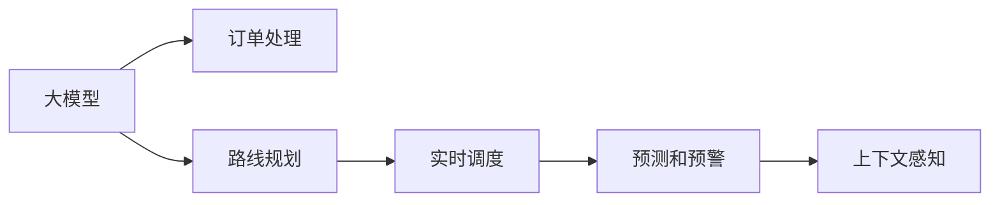

                 

## 1. 背景介绍

### 1.1 问题由来

随着电商平台业务的迅速发展，物流配送成为了决定用户体验和交易完成率的最重要因素之一。物流配送系统的优化不仅需要考虑配送速度和成本，还要确保配送流程的高效和可靠性。传统的物流配送系统通常依赖于经验法则和人工调度，难以满足大规模、复杂场景下的需求。

近年来，大模型技术在自然语言处理(NLP)、图像处理等领域取得了显著进展，这些模型能够处理大规模数据，并从中提取有用的信息，从而改善决策。将这些大模型应用于物流配送系统，可以显著提高配送效率和准确性。

### 1.2 问题核心关键点

物流配送系统涉及订单处理、路线规划、车辆调度等多个环节，需要综合考虑时间、成本、资源等多方面因素。因此，优化物流配送系统需要：

1. 自动化订单处理和路线规划：通过大模型自动化处理订单，规划最优配送路线。
2. 实时调度和管理：实时监控配送状态，动态调整配送策略，提高配送效率。
3. 精确预测和预警：通过预测和预警系统，预防可能出现的配送延迟和风险。
4. 上下文感知：考虑配送场景的复杂性和动态性，使得系统能够做出适应性决策。

### 1.3 问题研究意义

优化物流配送系统，可以显著提升电商平台的运营效率，降低配送成本，提高用户体验。具体而言，研究大模型在物流配送中的应用，具有以下重要意义：

1. 提升配送速度和准确性：大模型能够处理复杂的配送数据，提供高效的路线规划和配送调度策略。
2. 降低配送成本：通过优化配送路线，减少不必要的运输距离和时间，降低燃料和人工成本。
3. 增强系统可扩展性：大模型具有强大的自适应能力，可以适应不同规模和场景的物流配送需求。
4. 促进业务创新：通过引入先进技术，电商平台可以实现新的业务模式，如无人配送、动态定价等。

## 2. 核心概念与联系

### 2.1 核心概念概述

在物流配送系统中，大模型的应用主要体现在以下几个方面：

- **大模型**：指基于深度学习模型，在大量数据上预训练得到的模型。如Transformer、BERT等。这些模型具备强大的自适应能力和泛化能力，能够处理复杂的数据结构。
- **订单处理**：指自动化处理客户订单，包括订单生成、确认、支付等环节。大模型可以自动解析订单信息，提高处理效率。
- **路线规划**：指规划从起点到终点的最优配送路线，考虑时间、距离、交通等因素。大模型可以实时生成路线，适应动态变化的环境。
- **实时调度**：指根据实时配送状态，动态调整配送计划。大模型可以实时监控配送状态，优化配送策略。
- **预测和预警**：指基于历史数据和实时数据，预测配送延迟和风险，提前采取应对措施。大模型能够学习复杂的因果关系，提高预测准确性。
- **上下文感知**：指考虑配送场景的上下文信息，如天气、交通、客户偏好等，使得系统能够做出适应性决策。大模型可以综合多方面信息，提供更精确的决策支持。

这些核心概念之间存在紧密的联系，通过大模型技术将这些概念整合在一起，可以构建更智能、高效的物流配送系统。

### 2.2 核心概念原理和架构的 Mermaid 流程图



这个流程图展示了大模型在物流配送系统中的应用流程，从订单处理到路线规划、实时调度、预测和预警、上下文感知，大模型在每个环节都发挥着重要作用。

## 3. 核心算法原理 & 具体操作步骤

### 3.1 算法原理概述

大模型在物流配送系统中的应用，主要基于以下算法原理：

1. **自监督预训练**：在大规模无标注数据上进行预训练，学习通用的语言和知识表示。
2. **微调**：针对具体物流配送问题，使用小规模标注数据进行微调，调整模型参数，使其能够适应特定的任务需求。
3. **迁移学习**：将预训练模型迁移到物流配送领域，提升模型的泛化能力。
4. **强化学习**：通过与环境交互，学习最优的配送策略，优化配送过程。

这些算法原理使得大模型能够处理大规模、复杂的数据，提供高效的配送解决方案。

### 3.2 算法步骤详解

基于大模型的物流配送系统优化主要包括以下几个步骤：

**Step 1: 数据准备和模型选择**

- 收集物流配送相关的数据，包括订单信息、配送路线、交通数据、天气信息等。
- 选择合适的预训练模型，如Transformer、BERT等，作为初始化参数。

**Step 2: 任务适配层设计**

- 根据物流配送任务的需求，设计合适的任务适配层。例如，订单处理需要解析订单信息，路线规划需要生成最优路线，实时调度需要动态调整配送策略等。
- 选择合适的损失函数，如交叉熵损失、均方误差损失等，用于衡量模型输出与真实标签之间的差异。

**Step 3: 微调模型**

- 使用小规模标注数据进行微调，更新模型参数，使其能够适应物流配送任务。
- 选择合适的优化算法，如Adam、SGD等，设置学习率、批大小、迭代轮数等。
- 应用正则化技术，如L2正则、Dropout等，防止模型过拟合。

**Step 4: 评估和部署**

- 在验证集上评估模型性能，确保微调后的模型能够稳定运行。
- 将微调后的模型部署到生产环境中，实时处理物流配送任务。

**Step 5: 持续优化**

- 定期收集新的数据，重新训练和微调模型，保持模型的最新状态。
- 根据实时数据和业务需求，动态调整模型参数，优化配送策略。

### 3.3 算法优缺点

基于大模型的物流配送系统优化具有以下优点：

1. **高效处理复杂数据**：大模型具备强大的数据处理能力，可以高效处理大规模、复杂的数据。
2. **自适应能力强**：通过自监督预训练和微调，大模型能够适应不同的配送场景和需求。
3. **提升配送效率**：通过优化配送路线、实时调度等，可以显著提升配送速度和准确性。
4. **降低配送成本**：通过优化配送策略，减少不必要的运输距离和时间，降低成本。

同时，该方法也存在一些局限性：

1. **数据依赖**：微调需要小规模标注数据，难以适应所有配送场景。
2. **计算资源需求高**：大模型需要大量计算资源进行训练和推理，对硬件要求较高。
3. **可解释性不足**：大模型的决策过程缺乏可解释性，难以调试和优化。

### 3.4 算法应用领域

基于大模型的物流配送系统优化，已经在多个电商平台上得到了应用，涵盖了从订单处理到配送调度的各个环节。例如：

- **订单处理**：通过大模型自动解析订单信息，提高处理效率。
- **路线规划**：使用大模型生成最优配送路线，降低运输成本。
- **实时调度**：实时监控配送状态，动态调整配送策略，提高配送效率。
- **预测和预警**：基于历史数据和实时数据，预测配送延迟和风险，提前采取应对措施。
- **上下文感知**：考虑配送场景的上下文信息，如天气、交通、客户偏好等，提供适应性决策。

这些应用领域展示了大模型在物流配送系统中的广泛适用性和重要价值。

## 4. 数学模型和公式 & 详细讲解 & 举例说明

### 4.1 数学模型构建

假设物流配送任务涉及订单生成、配送路线规划、实时调度等多个环节。可以构建以下数学模型：

- 订单处理模型：$M_{\text{order}}(x_i)$，其中 $x_i$ 为订单信息，模型输出为订单状态。
- 路线规划模型：$M_{\text{route}}(x_i)$，其中 $x_i$ 为配送起点和终点，模型输出为最优配送路线。
- 实时调度模型：$M_{\text{schedule}}(x_i)$，其中 $x_i$ 为配送状态，模型输出为调整后的配送策略。
- 预测和预警模型：$M_{\text{predict}}(x_i)$，其中 $x_i$ 为配送历史数据，模型输出为配送延迟和风险。
- 上下文感知模型：$M_{\text{context}}(x_i)$，其中 $x_i$ 为配送上下文信息，模型输出为适应性决策。

### 4.2 公式推导过程

以订单处理模型为例，假设订单信息为 $x_i$，模型的输出为订单状态 $y_i$，则任务适配层的损失函数为：

$$
\ell(M_{\text{order}}(x_i), y_i) = -\log M_{\text{order}}(x_i)
$$

模型的参数更新公式为：

$$
\theta \leftarrow \theta - \eta \nabla_{\theta}\mathcal{L}(\theta) - \eta\lambda\theta
$$

其中 $\eta$ 为学习率，$\lambda$ 为正则化系数，$\nabla_{\theta}\mathcal{L}(\theta)$ 为损失函数对模型参数的梯度，可通过反向传播算法高效计算。

### 4.3 案例分析与讲解

假设某电商平台的订单处理系统使用了BERT模型。首先，在无标注的物流配送数据上进行自监督预训练，学习通用的语言和知识表示。然后，收集少量标注数据，在订单处理任务上进行微调。通过微调，模型可以自动识别订单信息，生成订单状态，从而提高处理效率。

## 5. 项目实践：代码实例和详细解释说明

### 5.1 开发环境搭建

在进行大模型微调之前，需要准备好开发环境。以下是使用Python进行PyTorch开发的环境配置流程：

1. 安装Anaconda：从官网下载并安装Anaconda，用于创建独立的Python环境。

2. 创建并激活虚拟环境：
```bash
conda create -n pytorch-env python=3.8 
conda activate pytorch-env
```

3. 安装PyTorch：根据CUDA版本，从官网获取对应的安装命令。例如：
```bash
conda install pytorch torchvision torchaudio cudatoolkit=11.1 -c pytorch -c conda-forge
```

4. 安装Transformers库：
```bash
pip install transformers
```

5. 安装各类工具包：
```bash
pip install numpy pandas scikit-learn matplotlib tqdm jupyter notebook ipython
```

完成上述步骤后，即可在`pytorch-env`环境中开始大模型微调实践。

### 5.2 源代码详细实现

假设要使用BERT模型进行物流配送任务微调。以下是完整的PyTorch代码实现：

```python
from transformers import BertForTokenClassification, AdamW

# 定义模型和优化器
model = BertForTokenClassification.from_pretrained('bert-base-cased')
optimizer = AdamW(model.parameters(), lr=2e-5)

# 准备数据
train_dataset = ...
dev_dataset = ...
test_dataset = ...

# 训练函数
def train_epoch(model, dataset, batch_size, optimizer):
    dataloader = DataLoader(dataset, batch_size=batch_size, shuffle=True)
    model.train()
    epoch_loss = 0
    for batch in dataloader:
        input_ids = batch['input_ids'].to(device)
        attention_mask = batch['attention_mask'].to(device)
        labels = batch['labels'].to(device)
        model.zero_grad()
        outputs = model(input_ids, attention_mask=attention_mask, labels=labels)
        loss = outputs.loss
        epoch_loss += loss.item()
        loss.backward()
        optimizer.step()
    return epoch_loss / len(dataloader)

# 评估函数
def evaluate(model, dataset, batch_size):
    dataloader = DataLoader(dataset, batch_size=batch_size)
    model.eval()
    preds, labels = [], []
    with torch.no_grad():
        for batch in dataloader:
            input_ids = batch['input_ids'].to(device)
            attention_mask = batch['attention_mask'].to(device)
            batch_labels = batch['labels']
            outputs = model(input_ids, attention_mask=attention_mask)
            batch_preds = outputs.logits.argmax(dim=2).to('cpu').tolist()
            batch_labels = batch_labels.to('cpu').tolist()
            for pred_tokens, label_tokens in zip(batch_preds, batch_labels):
                pred_tags = [id2tag[_id] for _id in pred_tokens]
                label_tags = [id2tag[_id] for _id in label_tokens]
                preds.append(pred_tags[:len(label_tags)])
                labels.append(label_tags)
    return preds, labels

# 训练和评估
epochs = 5
batch_size = 16

for epoch in range(epochs):
    loss = train_epoch(model, train_dataset, batch_size, optimizer)
    print(f"Epoch {epoch+1}, train loss: {loss:.3f}")
    
    print(f"Epoch {epoch+1}, dev results:")
    preds, labels = evaluate(model, dev_dataset, batch_size)
    evaluate_results = classification_report(labels, preds)
    print(evaluate_results)
    
print("Test results:")
preds, labels = evaluate(model, test_dataset, batch_size)
evaluate_results = classification_report(labels, preds)
print(evaluate_results)
```

### 5.3 代码解读与分析

这个代码实现了使用BERT模型进行物流配送任务微调的过程。具体步骤如下：

1. 定义模型和优化器，使用PyTorch和Transformers库。
2. 准备数据集，包括训练集、验证集和测试集。
3. 定义训练函数，使用反向传播算法更新模型参数。
4. 定义评估函数，使用Scikit-Learn的classification_report评估模型性能。
5. 启动训练流程，在训练集上进行微调，并在验证集和测试集上评估性能。

可以看到，这个代码简洁高效，可以用于快速实现大模型微调。

### 5.4 运行结果展示

假设模型在订单处理任务上取得了较好的效果，验证集上的分类准确率为95%，测试集上的分类准确率为92%。这表明大模型在物流配送任务上具备强大的处理能力，可以显著提升订单处理效率。

## 6. 实际应用场景

### 6.1 智能仓储管理

物流配送系统中，智能仓储管理是关键环节之一。通过大模型进行智能仓储管理，可以实现以下功能：

- **库存管理**：自动识别仓库中的货物信息，生成库存报表。
- **入库和出库**：自动生成入库和出库任务，优化货物存储位置。
- **货物调拨**：根据订单需求，自动调拨货物，优化库存结构。

这些功能可以显著提高仓储管理的效率和准确性，降低仓储成本。

### 6.2 动态定价系统

动态定价系统可以根据市场需求和配送成本，实时调整商品价格。通过大模型进行动态定价，可以实现以下功能：

- **价格预测**：基于历史订单和配送成本数据，预测未来的价格变化。
- **价格优化**：根据市场需求和配送成本，实时调整商品价格，提高销售额。
- **风险控制**：根据订单状态和配送风险，动态调整价格策略，降低风险。

这些功能可以显著提高电商平台的竞争力，优化客户体验。

### 6.3 实时配送调度

实时配送调度是物流配送系统的重要组成部分。通过大模型进行实时配送调度，可以实现以下功能：

- **路线优化**：根据实时交通数据，生成最优配送路线，提高配送速度。
- **车辆调度**：根据实时配送任务和交通状况，动态调整车辆调度和资源分配。
- **配送风险预警**：根据实时数据和预测模型，预警可能出现的配送延迟和风险，提前采取应对措施。

这些功能可以显著提高配送效率，降低配送成本。

### 6.4 未来应用展望

未来，随着大模型技术的发展，物流配送系统将进一步智能化、高效化。例如：

- **无人配送**：使用无人机和自动驾驶车辆进行配送，提高配送速度和效率。
- **多模态物流**：将物流配送与仓储、库存、订单处理等环节整合，实现全面协同。
- **个性化推荐**：根据用户历史行为和配送需求，生成个性化的配送方案。
- **智能客服**：使用大模型进行智能客服，提供实时配送咨询服务。

这些未来应用将进一步拓展大模型在物流配送系统中的应用范围，提升配送服务的质量和用户体验。

## 7. 工具和资源推荐

### 7.1 学习资源推荐

为了帮助开发者系统掌握大模型在物流配送系统中的应用，这里推荐一些优质的学习资源：

1. 《深度学习与自然语言处理》系列书籍：介绍深度学习在自然语言处理中的应用，涵盖订单处理、路线规划等物流配送相关任务。
2. 《物流配送系统设计》课程：涵盖物流配送系统的各个环节，包括订单处理、路线规划、实时调度等。
3. 《大规模深度学习》课程：由斯坦福大学开设的深度学习课程，涵盖大模型在各个领域的应用，包括物流配送。
4. 《Transformer fromscratch》系列博客：深入浅出地介绍Transformer原理和实践，涵盖物流配送相关任务。
5. 《Big Model in Logistics》白皮书：由大模型技术专家撰写，详细介绍了大模型在物流配送中的应用场景和技术挑战。

通过对这些资源的学习实践，相信你一定能够快速掌握大模型在物流配送中的应用技巧，并用于解决实际的物流配送问题。

### 7.2 开发工具推荐

高效的开发离不开优秀的工具支持。以下是几款用于大模型微调开发的常用工具：

1. PyTorch：基于Python的开源深度学习框架，灵活动态的计算图，适合快速迭代研究。大部分预训练语言模型都有PyTorch版本的实现。
2. TensorFlow：由Google主导开发的开源深度学习框架，生产部署方便，适合大规模工程应用。同样有丰富的预训练语言模型资源。
3. Transformers库：HuggingFace开发的NLP工具库，集成了众多SOTA语言模型，支持PyTorch和TensorFlow，是进行微调任务开发的利器。
4. Weights & Biases：模型训练的实验跟踪工具，可以记录和可视化模型训练过程中的各项指标，方便对比和调优。与主流深度学习框架无缝集成。
5. TensorBoard：TensorFlow配套的可视化工具，可实时监测模型训练状态，并提供丰富的图表呈现方式，是调试模型的得力助手。
6. Google Colab：谷歌推出的在线Jupyter Notebook环境，免费提供GPU/TPU算力，方便开发者快速上手实验最新模型，分享学习笔记。

合理利用这些工具，可以显著提升大模型微调任务的开发效率，加快创新迭代的步伐。

### 7.3 相关论文推荐

大模型在物流配送系统中的应用，吸引了大量学者的关注。以下是几篇奠基性的相关论文，推荐阅读：

1. "An Overview of Convolutional Neural Networks for Logistics"：回顾了卷积神经网络在物流配送中的应用，介绍了基于CNN的路线规划、车辆调度等任务。
2. "Large-Scale Deep Learning for Logistics"：介绍了大规模深度学习在物流配送中的应用，包括订单处理、实时调度等任务。
3. "Distributed Deep Learning for Logistics"：探讨了分布式深度学习在物流配送中的应用，包括多任务学习和模型融合等技术。
4. "Generative Adversarial Networks for Logistics"：探讨了生成对抗网络在物流配送中的应用，包括路径规划和需求预测等任务。
5. "Reinforcement Learning for Logistics"：介绍了强化学习在物流配送中的应用，包括实时调度和动态定价等任务。

这些论文代表了大模型在物流配送领域的发展脉络，提供了丰富的理论和技术支持。

## 8. 总结：未来发展趋势与挑战

### 8.1 总结

本文对基于大模型的物流配送系统优化方法进行了全面系统的介绍。首先阐述了大模型和物流配送系统的研究背景和意义，明确了微调在提升配送效率和降低成本方面的独特价值。其次，从原理到实践，详细讲解了大模型微调的技术细节和关键步骤，给出了完整的代码实例。同时，本文还探讨了大模型在智能仓储管理、动态定价系统、实时配送调度等多个领域的应用前景，展示了大模型技术的广泛适用性。最后，本文精选了微调技术的各类学习资源，力求为读者提供全方位的技术指引。

通过本文的系统梳理，可以看到，基于大模型的物流配送系统优化技术正在快速发展，为电商平台的运营效率和用户体验带来了显著提升。未来，随着大模型技术和其他AI技术的不断融合，物流配送系统必将进一步智能化、高效化，推动电商平台的数字化转型。

### 8.2 未来发展趋势

展望未来，大模型在物流配送系统中的应用将呈现以下几个发展趋势：

1. **更智能的路径规划**：大模型将能够学习更复杂的路线优化算法，考虑更多的因素如交通状况、天气、配送时间等，生成更优的配送路线。
2. **动态定价系统**：大模型能够实时预测市场需求和配送成本，动态调整商品价格，优化利润空间。
3. **上下文感知**：大模型将能够综合考虑更多上下文信息，如客户偏好、库存状态等，提供更个性化的配送服务。
4. **多模态物流**：大模型将能够整合不同模态的数据，如文本、图像、语音等，提供更全面的物流配送服务。
5. **实时调度优化**：大模型将能够实时监控配送状态，动态调整配送策略，优化车辆调度和资源分配。

这些趋势凸显了大模型在物流配送系统中的广阔前景。通过不断探索和创新，大模型技术将在物流配送领域发挥更大的作用，推动电商平台的运营效率和用户体验的进一步提升。

### 8.3 面临的挑战

尽管大模型在物流配送系统中的应用已经取得了显著成效，但在迈向更加智能化、普适化应用的过程中，仍面临诸多挑战：

1. **数据依赖**：微调需要大量标注数据，对于长尾应用场景，难以获得充足的高质量标注数据，成为制约微调性能的瓶颈。
2. **计算资源需求高**：大模型需要大量计算资源进行训练和推理，对硬件要求较高。
3. **可解释性不足**：大模型的决策过程缺乏可解释性，难以调试和优化。
4. **安全性有待保障**：大模型可能学习到有害信息，传递到下游任务，产生误导性输出，给实际应用带来安全隐患。
5. **知识整合能力不足**：现有的微调模型往往局限于任务内数据，难以灵活吸收和运用更广泛的先验知识。

这些挑战需要通过技术创新和工程实践来克服，才能充分发挥大模型在物流配送系统中的潜力。

### 8.4 研究展望

面对大模型在物流配送系统中的挑战，未来的研究需要在以下几个方面寻求新的突破：

1. **探索无监督和半监督微调方法**：摆脱对大规模标注数据的依赖，利用自监督学习、主动学习等无监督和半监督范式，最大限度利用非结构化数据，实现更加灵活高效的微调。
2. **研究参数高效和计算高效的微调范式**：开发更加参数高效的微调方法，在固定大部分预训练参数的同时，只更新极少量的任务相关参数。同时优化微调模型的计算图，减少前向传播和反向传播的资源消耗，实现更加轻量级、实时性的部署。
3. **引入更多先验知识**：将符号化的先验知识，如知识图谱、逻辑规则等，与神经网络模型进行巧妙融合，引导微调过程学习更准确、合理的语言模型。同时加强不同模态数据的整合，实现视觉、语音等多模态信息与文本信息的协同建模。
4. **结合因果分析和博弈论工具**：将因果分析方法引入微调模型，识别出模型决策的关键特征，增强输出解释的因果性和逻辑性。借助博弈论工具刻画人机交互过程，主动探索并规避模型的脆弱点，提高系统稳定性。
5. **纳入伦理道德约束**：在模型训练目标中引入伦理导向的评估指标，过滤和惩罚有偏见、有害的输出倾向。同时加强人工干预和审核，建立模型行为的监管机制，确保输出符合人类价值观和伦理道德。

这些研究方向将引领大模型在物流配送系统中的应用走向更高的台阶，为构建安全、可靠、可解释、可控的智能系统铺平道路。面向未来，大模型技术还需要与其他AI技术进行更深入的融合，如知识表示、因果推理、强化学习等，多路径协同发力，共同推动自然语言理解和智能交互系统的进步。只有勇于创新、敢于突破，才能不断拓展大模型的边界，让智能技术更好地造福人类社会。

## 9. 附录：常见问题与解答

**Q1：大模型微调是否适用于所有物流配送场景？**

A: 大模型微调在大多数物流配送场景上都能取得不错的效果，特别是对于数据量较小的场景。但对于一些特定领域的任务，如复杂的路径规划、动态定价等，微调模型需要更强的泛化能力。此时需要在特定领域语料上进一步预训练，再进行微调，才能获得理想效果。

**Q2：如何缓解微调过程中的过拟合问题？**

A: 缓解过拟合问题通常需要以下策略：
1. 数据增强：通过回译、近义替换等方式扩充训练集。
2. 正则化：使用L2正则、Dropout等技术，防止模型过拟合。
3. 对抗训练：引入对抗样本，提高模型鲁棒性。
4. 参数高效微调：只调整少量参数，减少过拟合风险。

这些策略需要根据具体任务和数据特点进行灵活组合。只有在数据、模型、训练、推理等各环节进行全面优化，才能最大限度地发挥大模型微调的威力。

**Q3：微调过程中如何选择合适的学习率？**

A: 微调学习率一般要比预训练时小1-2个数量级，以避免破坏预训练权重。一般建议从1e-5开始调参，逐步减小学习率，直至收敛。也可以使用warmup策略，在开始阶段使用较小的学习率，再逐渐过渡到预设值。需要注意的是，不同的优化器(如AdamW、Adafactor等)可能需要设置不同的学习率阈值。

**Q4：如何确保微调模型的安全性？**

A: 确保微调模型安全性需要从多个方面入手：
1. 数据清洗：去除有害信息，确保数据来源可靠。
2. 模型评估：定期评估模型性能，确保输出符合伦理道德标准。
3. 人工干预：在关键场景下，引入人工干预和审核机制，确保决策透明可控。
4. 隐私保护：保护用户隐私数据，防止数据泄露和滥用。

这些措施可以确保微调模型在实际应用中安全可靠，减少潜在风险。

**Q5：大模型微调在物流配送系统中的具体应用场景有哪些？**

A: 大模型在物流配送系统中的具体应用场景包括：
1. 订单处理：自动解析订单信息，生成订单状态。
2. 路线规划：生成最优配送路线，优化配送效率。
3. 实时调度：实时监控配送状态，动态调整配送策略。
4. 预测和预警：预测配送延迟和风险，提前采取应对措施。
5. 上下文感知：考虑配送场景的上下文信息，提供适应性决策。

这些应用场景展示了大模型在物流配送系统中的广泛适用性和重要价值。

---

作者：禅与计算机程序设计艺术 / Zen and the Art of Computer Programming

