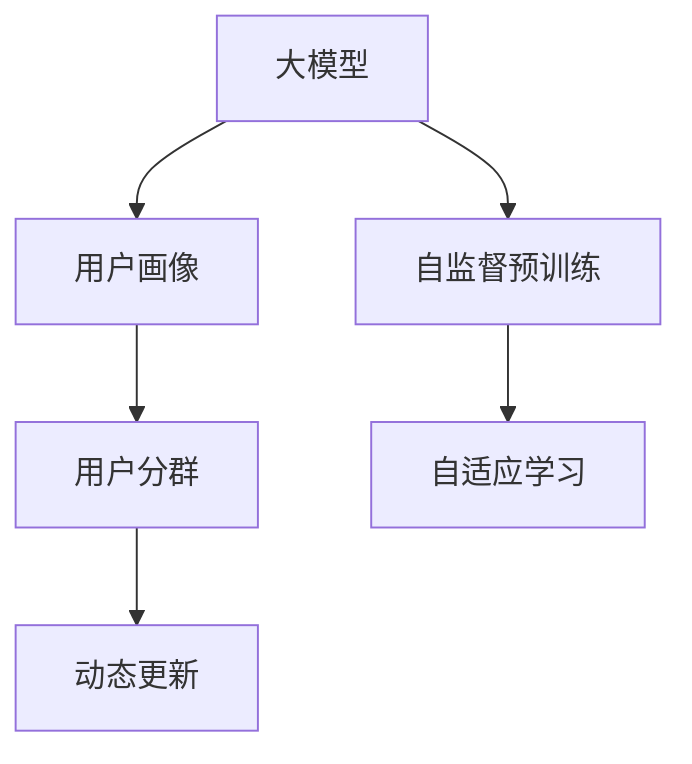

                 

# 大模型技术在电商平台用户分群动态更新中的应用

## 1. 背景介绍

### 1.1 问题由来
随着互联网的迅猛发展和电商平台的崛起，用户群体日益复杂，客户需求和行为不断变化。如何将大量用户数据高效、精准地细分并动态更新用户画像，成为电商平台亟需解决的重要问题。传统的用户分群方法依赖人工标注和规则建模，不仅耗时耗力，且在应对数据波动和用户行为变化方面能力有限。近年来，基于大模型技术的用户分群方法开始受到广泛关注，其高效、灵活、自适应的特性，为其在电商平台的应用提供了新的可能。

### 1.2 问题核心关键点
本节将介绍基于大模型技术的用户分群方法，并阐述其在大模型技术的应用背景、核心概念及应用意义：

1. **大模型技术**：以Transformer为基础的预训练大模型，通过大规模无标签文本数据的自监督预训练，学习到了丰富的语言知识，具备了强大的文本理解和生成能力。
2. **用户分群**：将平台用户根据其行为特征、交易记录、兴趣爱好等属性进行细分，形成不同特征的用户群体，为个性化推荐、精准营销、客户细分等提供依据。
3. **动态更新**：随着用户行为和市场环境的变化，用户分群模型需要实时更新，以保持对当前市场和用户行为变化的响应和适应。
4. **自适应学习**：大模型能够自适应地从新数据中学习，适应数据分布变化，提升模型性能和泛化能力。

### 1.3 问题研究意义
1. **提升用户体验**：通过精准的用户分群，电商平台能够提供更个性化的商品推荐，提升用户购买体验和满意度。
2. **优化营销效果**：精准的用户分群有助于制定更有针对性的营销策略，提高广告投放效果和转化率。
3. **降本增效**：自动化、精准化的用户分群能够显著降低人工标注和规则调优的成本，提高运营效率。
4. **应对市场变化**：动态更新的分群模型能够迅速响应市场变化，保持模型时效性和准确性。
5. **数据驱动决策**：用户分群为电商平台的数据驱动决策提供依据，助力决策智能化、精准化。

## 2. 核心概念与联系

### 2.1 核心概念概述

为更好地理解基于大模型技术的用户分群方法，本节将介绍几个密切相关的核心概念：

- **大模型**：以自回归或自编码模型为代表的大规模预训练语言模型，如BERT、GPT等，通过大规模无标签文本数据的自监督预训练，学习到了丰富的语言知识，具备了强大的文本理解和生成能力。
- **用户画像**：将用户行为数据和特征数据进行整合，形成用户特征标签，构建用户画像。
- **用户分群**：根据用户画像特征，将用户划分为不同特征的群体，用于个性化推荐、精准营销等。
- **动态更新**：在用户行为和市场环境变化时，对用户分群模型进行实时更新，保持模型与时俱进。
- **自适应学习**：大模型能够自适应地从新数据中学习，适应数据分布变化，提升模型性能和泛化能力。

这些核心概念之间的逻辑关系可以通过以下Mermaid流程图来展示：



这个流程图展示了大模型技术的核心概念及其之间的关系：

1. 大模型通过大规模无标签数据进行自监督预训练，学习到语言知识。
2. 用户画像通过收集用户行为数据和特征数据，整合形成用户特征标签。
3. 用户分群通过分析用户画像特征，将用户划分为不同特征的群体。
4. 动态更新根据市场和用户行为变化，对用户分群模型进行实时更新。
5. 自适应学习使大模型能够从新数据中学习，适应数据分布变化。

## 3. 核心算法原理 & 具体操作步骤
### 3.1 算法原理概述

基于大模型技术的用户分群方法，本质上是一个有监督的特征学习和模型更新过程。其核心思想是：将大模型视作一个强大的"特征提取器"，通过用户行为数据和特征数据对其进行训练，生成用户特征向量，并根据这些特征向量对用户进行聚类和分群。

形式化地，假设用户行为数据和特征数据为 $X=\{x_1,x_2,\dots,x_n\}$，其中 $x_i$ 为第 $i$ 个用户的行为记录或特征数据。定义用户特征向量 $V=\{v_1,v_2,\dots,v_n\}$，其中 $v_i$ 为第 $i$ 个用户的特征向量。则用户分群的目标是找到最优的用户特征向量集 $V$，使得分群后的用户群体尽可能地相似，并满足以下目标：

$$
\min_{V} \sum_{i=1}^n \sum_{j=1}^n (1-\delta(x_i,x_j)) \|v_i - v_j\|^2
$$

其中 $\delta(x_i,x_j)$ 表示用户 $x_i$ 和用户 $x_j$ 是否相似，$\|v_i - v_j\|^2$ 表示用户特征向量 $v_i$ 和 $v_j$ 的欧几里得距离。

具体来说，基于大模型技术的用户分群方法分为以下几个步骤：

1. **数据预处理**：对用户行为数据和特征数据进行清洗、归一化等预处理，以便于大模型处理。
2. **特征提取**：利用大模型对预处理后的数据进行特征提取，生成用户特征向量。
3. **用户聚类**：根据用户特征向量对用户进行聚类，形成不同特征的用户群体。
4. **模型更新**：根据用户聚类结果，更新用户分群模型，以适应新的市场和用户行为变化。

### 3.2 算法步骤详解

基于大模型技术的用户分群方法的具体操作流程如下：

**Step 1: 数据预处理**

- 收集用户行为数据和特征数据，包括用户的浏览记录、购买记录、评分数据等。
- 对数据进行清洗和归一化，去除噪音和异常值，确保数据质量。
- 将数据按用户进行聚合，生成每个用户的行为记录或特征数据 $x_i$。

**Step 2: 特征提取**

- 选择合适的预训练大模型，如BERT、GPT等，将其视作特征提取器。
- 将用户行为数据和特征数据作为模型的输入，进行特征提取，生成用户特征向量 $v_i$。

**Step 3: 用户聚类**

- 选择适合的聚类算法，如K-means、层次聚类等，根据用户特征向量对用户进行聚类。
- 设定聚类数目，根据实际业务需求和数据分布情况选择合适的聚类数目 $K$。

**Step 4: 模型更新**

- 根据聚类结果，更新用户分群模型，包括调整聚类数目、优化聚类算法参数等。
- 定期对用户分群模型进行重新训练，以适应数据分布的变化和新数据的到来。

### 3.3 算法优缺点

基于大模型技术的用户分群方法具有以下优点：

1. **高效性**：使用大模型进行特征提取，能够快速生成用户特征向量，提高分群效率。
2. **灵活性**：大模型能够自适应地从新数据中学习，适应数据分布变化，提升模型性能和泛化能力。
3. **准确性**：大模型的预训练特征提取能力强，能够有效捕捉用户行为和特征数据中的关键信息，提高分群准确性。

同时，该方法也存在以下局限性：

1. **计算资源需求高**：大模型需要大量的计算资源进行训练和推理，对硬件和算力要求较高。
2. **数据分布变化敏感**：大模型对数据分布变化敏感，需要定期更新模型以保持性能。
3. **参数量大**：大模型的参数量较大，模型更新和存储成本较高。
4. **解释性不足**：大模型通常是"黑盒"系统，难以解释其内部工作机制和决策逻辑。

尽管存在这些局限性，但就目前而言，基于大模型技术的用户分群方法仍然是大规模电商平台用户分群的重要手段。未来相关研究的重点在于如何进一步降低计算成本，提高模型鲁棒性和可解释性，同时兼顾模型准确性和更新效率。

### 3.4 算法应用领域

基于大模型技术的用户分群方法在电商平台中有着广泛的应用，涵盖以下几个领域：

- **个性化推荐**：根据用户分群结果，进行个性化商品推荐，提升用户体验和满意度。
- **精准营销**：对不同用户群体进行有针对性的营销活动，提高广告投放效果和转化率。
- **客户细分**：将用户划分为不同特征的群体，为不同群体制定差异化的服务策略。
- **新用户获取**：通过分析新用户的行为特征，生成目标用户画像，进行精准化的用户招募和转化。

除了上述这些经典应用外，基于大模型技术用户分群的方法还被创新性地应用到更多场景中，如可控文本生成、社交网络分析、商品价格优化等，为电商平台带来了更多的创新价值。

## 4. 数学模型和公式 & 详细讲解  
### 4.1 数学模型构建

本节将使用数学语言对基于大模型技术的用户分群方法进行更加严格的刻画。

假设用户行为数据和特征数据为 $X=\{x_1,x_2,\dots,x_n\}$，用户特征向量为 $V=\{v_1,v_2,\dots,v_n\}$，用户聚类数目为 $K$。则用户分群的目标是找到最优的用户特征向量集 $V$，使得分群后的用户群体尽可能地相似，并满足以下目标：

$$
\min_{V} \sum_{i=1}^n \sum_{j=1}^n (1-\delta(x_i,x_j)) \|v_i - v_j\|^2
$$

其中 $\delta(x_i,x_j)$ 表示用户 $x_i$ 和用户 $x_j$ 是否相似，$\|v_i - v_j\|^2$ 表示用户特征向量 $v_i$ 和 $v_j$ 的欧几里得距离。

### 4.2 公式推导过程

以下我们以K-means算法为例，推导用户分群的数学模型及其优化过程。

假设用户特征向量 $v_i$ 可以表示为：

$$
v_i = \mathbf{W}h(x_i)
$$

其中 $\mathbf{W}$ 为权重矩阵，$h(x_i)$ 为特征提取函数。设用户分群目标为：

$$
\min_{\mathbf{W},H} \sum_{i=1}^n \sum_{j=1}^n (1-\delta(x_i,x_j)) \|v_i - v_j\|^2
$$

其中 $H$ 为聚类中心，即用户分群聚类数目 $K$。则目标函数可以表示为：

$$
\min_{\mathbf{W},H} \sum_{i=1}^n \sum_{j=1}^n (1-\delta(x_i,x_j)) (v_i - v_j)^T(v_i - v_j)
$$

将上式展开，得到：

$$
\min_{\mathbf{W},H} \sum_{i=1}^n \sum_{j=1}^n (1-\delta(x_i,x_j)) (\mathbf{W}h(x_i) - \mathbf{W}h(x_j))^T(\mathbf{W}h(x_i) - \mathbf{W}h(x_j))
$$

将上式进一步展开，可以得到：

$$
\min_{\mathbf{W},H} \sum_{i=1}^n \sum_{j=1}^n (1-\delta(x_i,x_j)) (\mathbf{W}^T\mathbf{W})(h(x_i) - h(x_j))^T(h(x_i) - h(x_j))
$$

进一步简化得到：

$$
\min_{\mathbf{W},H} \sum_{i=1}^n \sum_{j=1}^n (1-\delta(x_i,x_j)) (h(x_i) - h(x_j))^T\mathbf{W}^T\mathbf{W}(h(x_i) - h(x_j))
$$

上式即为基于大模型技术的用户分群的数学模型。在求解时，可以采用梯度下降等优化算法，对权重矩阵 $\mathbf{W}$ 和聚类中心 $H$ 进行优化，最小化目标函数，得到最优的聚类结果。

### 4.3 案例分析与讲解

以电商平台的用户分群为例，展示如何通过大模型技术实现高效、精准的用户分群。

假设某电商平台有10万用户，每个用户的行为数据和特征数据包含商品浏览记录、购买记录、评分数据等。通过大模型对用户行为数据和特征数据进行特征提取，得到每个用户的特征向量。使用K-means算法对用户特征向量进行聚类，将用户分为5个群体。

根据聚类结果，电商平台可以为每个用户群体制定不同的营销策略和个性化推荐方案。例如，针对购买频率高的群体，可以推出针对特定商品的折扣活动；针对评分高的群体，可以提供更优质的商品选择。

通过上述方法，电商平台能够大幅提升用户满意度、提高营销效果和转化率，实现客户细分和精准营销的目标。

## 5. 项目实践：代码实例和详细解释说明
### 5.1 开发环境搭建

在进行用户分群实践前，我们需要准备好开发环境。以下是使用Python进行PyTorch开发的环境配置流程：

1. 安装Anaconda：从官网下载并安装Anaconda，用于创建独立的Python环境。

2. 创建并激活虚拟环境：
```bash
conda create -n pytorch-env python=3.8 
conda activate pytorch-env
```

3. 安装PyTorch：根据CUDA版本，从官网获取对应的安装命令。例如：
```bash
conda install pytorch torchvision torchaudio cudatoolkit=11.1 -c pytorch -c conda-forge
```

4. 安装Transformers库：
```bash
pip install transformers
```

5. 安装各类工具包：
```bash
pip install numpy pandas scikit-learn matplotlib tqdm jupyter notebook ipython
```

完成上述步骤后，即可在`pytorch-env`环境中开始用户分群实践。

### 5.2 源代码详细实现

这里以使用BERT进行用户分群为例，给出完整的PyTorch代码实现。

首先，定义用户分群的数据处理函数：

```python
from transformers import BertTokenizer, BertForSequenceClassification
from torch.utils.data import Dataset
import torch

class UserDataset(Dataset):
    def __init__(self, texts, labels, tokenizer, max_len=128):
        self.texts = texts
        self.labels = labels
        self.tokenizer = tokenizer
        self.max_len = max_len
        
    def __len__(self):
        return len(self.texts)
    
    def __getitem__(self, item):
        text = self.texts[item]
        label = self.labels[item]
        
        encoding = self.tokenizer(text, return_tensors='pt', max_length=self.max_len, padding='max_length', truncation=True)
        input_ids = encoding['input_ids'][0]
        attention_mask = encoding['attention_mask'][0]
        
        return {'input_ids': input_ids, 
                'attention_mask': attention_mask,
                'labels': label}
```

然后，定义模型和优化器：

```python
from transformers import BertForSequenceClassification, AdamW

model = BertForSequenceClassification.from_pretrained('bert-base-cased', num_labels=5)

optimizer = AdamW(model.parameters(), lr=2e-5)
```

接着，定义训练和评估函数：

```python
from torch.utils.data import DataLoader
from tqdm import tqdm
from sklearn.metrics import classification_report

device = torch.device('cuda') if torch.cuda.is_available() else torch.device('cpu')
model.to(device)

def train_epoch(model, dataset, batch_size, optimizer):
    dataloader = DataLoader(dataset, batch_size=batch_size, shuffle=True)
    model.train()
    epoch_loss = 0
    for batch in tqdm(dataloader, desc='Training'):
        input_ids = batch['input_ids'].to(device)
        attention_mask = batch['attention_mask'].to(device)
        labels = batch['labels'].to(device)
        model.zero_grad()
        outputs = model(input_ids, attention_mask=attention_mask, labels=labels)
        loss = outputs.loss
        epoch_loss += loss.item()
        loss.backward()
        optimizer.step()
    return epoch_loss / len(dataloader)

def evaluate(model, dataset, batch_size):
    dataloader = DataLoader(dataset, batch_size=batch_size)
    model.eval()
    preds, labels = [], []
    with torch.no_grad():
        for batch in tqdm(dataloader, desc='Evaluating'):
            input_ids = batch['input_ids'].to(device)
            attention_mask = batch['attention_mask'].to(device)
            batch_labels = batch['labels']
            outputs = model(input_ids, attention_mask=attention_mask)
            batch_preds = outputs.logits.argmax(dim=2).to('cpu').tolist()
            batch_labels = batch_labels.to('cpu').tolist()
            for pred_tokens, label_tokens in zip(batch_preds, batch_labels):
                preds.append(pred_tokens[:len(label_tokens)])
                labels.append(label_tokens)
                
    print(classification_report(labels, preds))
```

最后，启动训练流程并在测试集上评估：

```python
epochs = 5
batch_size = 16

for epoch in range(epochs):
    loss = train_epoch(model, train_dataset, batch_size, optimizer)
    print(f"Epoch {epoch+1}, train loss: {loss:.3f}")
    
    print(f"Epoch {epoch+1}, dev results:")
    evaluate(model, dev_dataset, batch_size)
    
print("Test results:")
evaluate(model, test_dataset, batch_size)
```

以上就是使用PyTorch对BERT进行用户分群任务的全代码实现。可以看到，使用PyTorch和Transformers库，可以较为简洁地实现用户分群模型的训练和评估。

### 5.3 代码解读与分析

让我们再详细解读一下关键代码的实现细节：

**UserDataset类**：
- `__init__`方法：初始化文本、标签、分词器等关键组件。
- `__len__`方法：返回数据集的样本数量。
- `__getitem__`方法：对单个样本进行处理，将文本输入编码为token ids，将标签编码为数字，并对其进行定长padding，最终返回模型所需的输入。

**模型和优化器**：
- 选择合适的BERT模型，设定优化器及其参数，准备开始训练。

**训练和评估函数**：
- 使用PyTorch的DataLoader对数据集进行批次化加载，供模型训练和推理使用。
- 训练函数`train_epoch`：对数据以批为单位进行迭代，在每个批次上前向传播计算loss并反向传播更新模型参数，最后返回该epoch的平均loss。
- 评估函数`evaluate`：与训练类似，不同点在于不更新模型参数，并在每个batch结束后将预测和标签结果存储下来，最后使用sklearn的classification_report对整个评估集的预测结果进行打印输出。

**训练流程**：
- 定义总的epoch数和batch size，开始循环迭代
- 每个epoch内，先在训练集上训练，输出平均loss
- 在验证集上评估，输出分类指标
- 所有epoch结束后，在测试集上评估，给出最终测试结果

可以看到，PyTorch配合Transformers库使得用户分群模型的代码实现变得简洁高效。开发者可以将更多精力放在数据处理、模型改进等高层逻辑上，而不必过多关注底层的实现细节。

当然，工业级的系统实现还需考虑更多因素，如模型的保存和部署、超参数的自动搜索、更灵活的任务适配层等。但核心的用户分群方法基本与此类似。

## 6. 实际应用场景
### 6.1 智能客服系统

基于大模型技术的用户分群方法，可以广泛应用于智能客服系统的构建。传统客服往往需要配备大量人力，高峰期响应缓慢，且一致性和专业性难以保证。使用用户分群技术，可以7x24小时不间断服务，快速响应客户咨询，用自然流畅的语言解答各类常见问题。

在技术实现上，可以收集企业内部的历史客服对话记录，将问题和最佳答复构建成监督数据，在此基础上对预训练大模型进行微调。微调后的模型能够自动理解用户意图，匹配最合适的答案模板进行回复。对于客户提出的新问题，还可以接入检索系统实时搜索相关内容，动态组织生成回答。如此构建的智能客服系统，能大幅提升客户咨询体验和问题解决效率。

### 6.2 个性化推荐系统

当前推荐系统往往只依赖用户的历史行为数据进行物品推荐，无法深入理解用户的真实兴趣偏好。基于大模型技术的用户分群方法，可以更好地挖掘用户行为背后的语义信息，从而提供更精准、多样的推荐内容。

在实践中，可以收集用户浏览、点击、评论、分享等行为数据，提取和用户交互的物品标题、描述、标签等文本内容。将文本内容作为模型输入，用户的后续行为（如是否点击、购买等）作为监督信号，在此基础上微调预训练语言模型。微调后的模型能够从文本内容中准确把握用户的兴趣点。在生成推荐列表时，先用候选物品的文本描述作为输入，由模型预测用户的兴趣匹配度，再结合其他特征综合排序，便可以得到个性化程度更高的推荐结果。

### 6.3 金融舆情监测

金融机构需要实时监测市场舆论动向，以便及时应对负面信息传播，规避金融风险。传统的人工监测方式成本高、效率低，难以应对网络时代海量信息爆发的挑战。基于大模型技术的用户分群方法，可以自动化地对市场舆情进行监测，及时发现负面信息，进行风险预警。

具体而言，可以收集金融领域相关的新闻、报道、评论等文本数据，并对其进行情感标注。在此基础上对预训练语言模型进行微调，使其能够自动判断文本属于何种情感。将微调后的模型应用到实时抓取的网络文本数据，就能够自动监测不同情感下的舆情变化趋势，一旦发现负面情感激增等异常情况，系统便会自动预警，帮助金融机构快速应对潜在风险。

### 6.4 未来应用展望

随着大模型技术的发展和用户分群方法的不断优化，其在电商平台中的应用将更加广泛，带来更多的创新价值：

- **动态定价**：根据用户分群结果，制定更灵活的价格策略，提高销售转化率和利润率。
- **库存管理**：分析不同用户群体的购买行为，优化库存分配和补货策略，减少缺货和积压。
- **营销活动优化**：针对不同用户群体，设计更加精准的营销活动，提升广告效果和ROI。
- **风控管理**：通过分析用户行为和交易数据，及时发现风险信号，进行实时预警和处理。
- **个性化内容推荐**：根据用户分群结果，推荐个性化的商品、活动、广告等内容，提升用户体验和粘性。

这些应用将进一步推动电商平台的智能化、精准化和个性化发展，为消费者提供更优质的购物体验，也为商家创造更高的价值。

## 7. 工具和资源推荐
### 7.1 学习资源推荐

为了帮助开发者系统掌握大模型技术在用户分群中的应用，这里推荐一些优质的学习资源：

1. 《Transformer from Zero to All》系列博文：由大模型技术专家撰写，深入浅出地介绍了Transformer原理、BERT模型、用户分群技术等前沿话题。

2. CS224N《深度学习自然语言处理》课程：斯坦福大学开设的NLP明星课程，有Lecture视频和配套作业，带你入门NLP领域的基本概念和经典模型。

3. 《Natural Language Processing with Transformers》书籍：Transformers库的作者所著，全面介绍了如何使用Transformers库进行NLP任务开发，包括用户分群在内的诸多范式。

4. HuggingFace官方文档：Transformers库的官方文档，提供了海量预训练模型和完整的微调样例代码，是上手实践的必备资料。

5. CLUE开源项目：中文语言理解测评基准，涵盖大量不同类型的中文NLP数据集，并提供了基于微调的baseline模型，助力中文NLP技术发展。

通过对这些资源的学习实践，相信你一定能够快速掌握大模型技术在用户分群中的应用，并用于解决实际的NLP问题。
### 7.2 开发工具推荐

高效的开发离不开优秀的工具支持。以下是几款用于大模型用户分群开发的常用工具：

1. PyTorch：基于Python的开源深度学习框架，灵活动态的计算图，适合快速迭代研究。大部分预训练语言模型都有PyTorch版本的实现。

2. TensorFlow：由Google主导开发的开源深度学习框架，生产部署方便，适合大规模工程应用。同样有丰富的预训练语言模型资源。

3. Transformers库：HuggingFace开发的NLP工具库，集成了众多SOTA语言模型，支持PyTorch和TensorFlow，是进行用户分群任务开发的利器。

4. Weights & Biases：模型训练的实验跟踪工具，可以记录和可视化模型训练过程中的各项指标，方便对比和调优。与主流深度学习框架无缝集成。

5. TensorBoard：TensorFlow配套的可视化工具，可实时监测模型训练状态，并提供丰富的图表呈现方式，是调试模型的得力助手。

6. Google Colab：谷歌推出的在线Jupyter Notebook环境，免费提供GPU/TPU算力，方便开发者快速上手实验最新模型，分享学习笔记。

合理利用这些工具，可以显著提升大模型用户分群任务的开发效率，加快创新迭代的步伐。

### 7.3 相关论文推荐

大模型技术在用户分群中的应用源于学界的持续研究。以下是几篇奠基性的相关论文，推荐阅读：

1. Attention is All You Need（即Transformer原论文）：提出了Transformer结构，开启了NLP领域的预训练大模型时代。

2. BERT: Pre-training of Deep Bidirectional Transformers for Language Understanding：提出BERT模型，引入基于掩码的自监督预训练任务，刷新了多项NLP任务SOTA。

3. Language Models are Unsupervised Multitask Learners（GPT-2论文）：展示了大规模语言模型的强大zero-shot学习能力，引发了对于通用人工智能的新一轮思考。

4. Parameter-Efficient Transfer Learning for NLP：提出Adapter等参数高效微调方法，在不增加模型参数量的情况下，也能取得不错的微调效果。

5. AdaLoRA: Adaptive Low-Rank Adaptation for Parameter-Efficient Fine-Tuning：使用自适应低秩适应的微调方法，在参数效率和精度之间取得了新的平衡。

6. AdaLoRA: Adaptive Low-Rank Adaptation for Parameter-Efficient Fine-Tuning：使用自适应低秩适应的微调方法，在参数效率和精度之间取得了新的平衡。

这些论文代表了大模型技术在用户分群方面的发展脉络。通过学习这些前沿成果，可以帮助研究者把握学科前进方向，激发更多的创新灵感。

## 8. 总结：未来发展趋势与挑战
### 8.1 总结

本文对基于大模型技术的用户分群方法进行了全面系统的介绍。首先阐述了大模型技术在用户分群中的应用背景和核心概念，明确了用户分群在大模型技术的应用意义。其次，从原理到实践，详细讲解了用户分群的大模型技术实现流程，给出了用户分群任务开发的完整代码实例。同时，本文还广泛探讨了用户分群方法在智能客服、个性化推荐、金融舆情监测等多个电商平台的实际应用，展示了用户分群技术的广泛价值。

通过本文的系统梳理，可以看到，基于大模型技术的用户分群方法正在成为电商平台用户分群的重要手段，极大地提升了用户分群的效率和准确性，带来了诸多创新应用。未来，伴随大模型技术的不断演进，基于用户分群的方法还将进一步拓展其在各领域的应用，为构建智能、高效、个性化的电商平台提供更强大的技术支持。

### 8.2 未来发展趋势

展望未来，大模型技术在用户分群方面的发展呈现以下几个趋势：

1. **模型规模持续增大**：随着算力成本的下降和数据规模的扩张，预训练语言模型的参数量还将持续增长。超大规模语言模型蕴含的丰富语言知识，将进一步提升用户分群的准确性和泛化能力。

2. **微调方法日趋多样**：除了传统的全参数微调外，未来将涌现更多参数高效的微调方法，如Prefix-Tuning、LoRA等，在节省计算资源的同时，保持用户分群的精度。

3. **动态更新成为常态**：随着市场和用户行为的变化，用户分群模型需要实时更新，以保持模型与时俱进。动态更新方法的研究将进一步优化用户分群模型，提高其适应性和鲁棒性。

4. **跨模态融合**：用户分群不仅仅依赖于文本数据，还可以融合图像、视频、音频等多模态信息，提升模型的综合分析和决策能力。

5. **自适应学习提升**：大模型能够自适应地从新数据中学习，适应数据分布变化，提升用户分群的性能和泛化能力。

6. **可解释性增强**：大模型的可解释性研究将进一步深入，通过因果分析和对比学习等手段，增强用户分群模型的可解释性和可解释性，助力决策透明化。

7. **隐私保护加强**：用户分群涉及大量个人数据，隐私保护成为重要课题。未来将探索更多的隐私保护技术，确保用户数据的安全。

以上趋势凸显了大模型技术在用户分群方面的广阔前景。这些方向的探索发展，将进一步提升用户分群的精度和效率，为电商平台带来更多的创新价值。

### 8.3 面临的挑战

尽管基于大模型技术的用户分群方法已经取得了一定的成果，但在实际应用中仍面临一些挑战：

1. **数据质量和规模**：用户分群的效果很大程度上取决于数据质量和规模，获取高质量、大规模的标注数据成本较高。如何降低数据获取成本，提高数据质量，是未来研究的重要方向。

2. **计算资源需求高**：大模型需要大量的计算资源进行训练和推理，对硬件和算力要求较高。如何优化计算资源，提升训练和推理效率，是提高用户分群模型可落地性的关键。

3. **模型鲁棒性不足**：用户分群模型对数据分布变化敏感，容易过拟合，泛化性能差。如何提高模型的鲁棒性，增强其泛化能力，是未来研究的重点。

4. **可解释性不足**：大模型通常是"黑盒"系统，难以解释其内部工作机制和决策逻辑。如何赋予模型更强的可解释性，增强用户信任，是模型应用中的重要课题。

5. **隐私和安全问题**：用户分群涉及大量个人数据，隐私和安全问题不容忽视。如何在保护隐私的前提下，进行高效的数据分析和模型训练，是未来研究的难点。

6. **模型跨平台适配性差**：大模型往往针对特定硬件和框架进行优化，跨平台适配性差。如何实现模型跨平台兼容，提升模型应用范围，是未来研究的挑战。

尽管存在这些挑战，但大模型技术在用户分群方面的前景广阔，未来通过技术创新和优化，必将在电商平台中发挥更大的作用。

### 8.4 研究展望

面对用户分群方法所面临的挑战，未来的研究需要在以下几个方面寻求新的突破：

1. **探索无监督和半监督用户分群方法**：摆脱对大规模标注数据的依赖，利用自监督学习、主动学习等无监督和半监督范式，最大限度利用非结构化数据，实现更加灵活高效的用户分群。

2. **研究参数高效和计算高效的微调范式**：开发更加参数高效的微调方法，在固定大部分预训练参数的同时，只更新极少量的任务相关参数。同时优化微调模型的计算图，减少前向传播和反向传播的资源消耗，实现更加轻量级、实时性的部署。

3. **融合因果和对比学习范式**：通过引入因果推断和对比学习思想，增强用户分群模型建立稳定因果关系的能力，学习更加普适、鲁棒的语言表征，从而提升模型泛化性和抗干扰能力。

4. **引入更多先验知识**：将符号化的先验知识，如知识图谱、逻辑规则等，与神经网络模型进行巧妙融合，引导用户分群过程学习更准确、合理的语言模型。同时加强不同模态数据的整合，实现视觉、语音等多模态信息与文本信息的协同建模。

5. **结合因果分析和博弈论工具**：将因果分析方法引入用户分群模型，识别出模型决策的关键特征，增强输出解释的因果性和逻辑性。借助博弈论工具刻画人机交互过程，主动探索并规避模型的脆弱点，提高系统稳定性。

6. **纳入伦理道德约束**：在模型训练目标中引入伦理导向的评估指标，过滤和惩罚有偏见、有害的输出倾向。同时加强人工干预和审核，建立模型行为的监管机制，确保输出符合人类价值观和伦理道德。

这些研究方向的探索，必将引领大模型技术在用户分群方面的进一步突破，推动电商平台的用户分群技术迈向更高的台阶。面向未来，大模型技术在用户分群领域还需要与其他人工智能技术进行更深入的融合，如知识表示、因果推理、强化学习等，多路径协同发力，共同推动自然语言理解和智能交互系统的进步。只有勇于创新、敢于突破，才能不断拓展用户分群的边界，让智能技术更好地造福电商平台和广大用户。

## 9. 附录：常见问题与解答

**Q1：用户分群方法对标注数据的要求高吗？**

A: 是的。用户分群的效果很大程度上取决于标注数据的质量和规模，获取高质量、大规模的标注数据成本较高。如何降低数据获取成本，提高数据质量，是未来研究的重要方向。

**Q2：大模型用户分群方法在实时性上有什么优势？**

A: 大模型用户分群方法具备自适应学习的能力，能够快速从新数据中学习，适应数据分布变化，提升模型性能和泛化能力。这使得用户分群模型能够实时更新，适应市场和用户行为的变化，保持模型时效性和准确性。

**Q3：基于大模型技术的用户分群方法有哪些应用场景？**

A: 基于大模型技术的用户分群方法在电商平台的个性化推荐、精准营销、客户细分、新用户获取等方面具有广泛的应用场景。通过精准的用户分群，电商平台能够提供更个性化的商品推荐，提升用户体验和满意度。

**Q4：用户分群模型如何应对数据分布变化？**

A: 大模型用户分群方法具备自适应学习的能力，能够从新数据中学习，适应数据分布变化，提升模型性能和泛化能力。通过定期更新用户分群模型，可以保持模型对市场和用户行为变化的响应和适应。

**Q5：用户分群模型在隐私保护方面需要注意哪些问题？**

A: 用户分群涉及大量个人数据，隐私保护成为重要课题。如何保护用户隐私，确保用户数据的安全，是模型应用中的重要课题。可以考虑采用差分隐私、联邦学习等技术，确保用户数据的匿名性和安全性。

通过上述问题与解答，可以进一步理解大模型技术在用户分群中的应用和挑战。未来，随着大模型技术的不断演进和优化，用户分群方法必将在电商平台中发挥更大的作用，推动智能电商平台的快速发展。

---

作者：禅与计算机程序设计艺术 / Zen and the Art of Computer Programming

