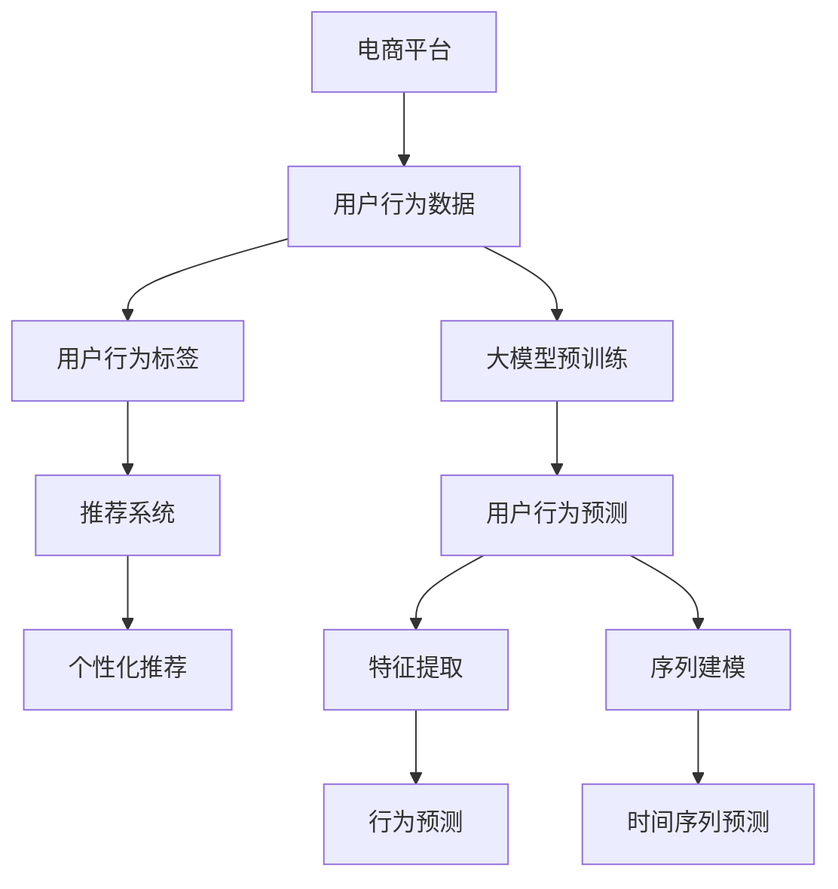

                 

# 大模型技术在电商平台用户行为预测中的应用

> 关键词：大模型,电商平台,用户行为预测,推荐系统,深度学习,自回归模型,自编码模型,特征提取,序列建模

## 1. 背景介绍

### 1.1 问题由来
电商平台是现代商业的重要组成部分，通过线上交易、用户互动、数据分析等手段，为企业创造了巨大的商业价值。用户行为预测作为电商平台的核心应用之一，通过分析和理解用户行为模式，可以帮助商家优化库存管理、精准营销、个性化推荐等，从而提升用户满意度和交易转化率。然而，传统的用户行为预测方法通常基于规则、统计学和特征工程，往往需要大量手工设计特征，难以兼顾复杂性和泛化能力。近年来，深度学习技术的崛起，特别是大模型技术的发展，为电商平台用户行为预测提供了全新的技术手段。

### 1.2 问题核心关键点
大模型在电商平台用户行为预测中的应用，主要集中在以下几个方面：

1. **数据高效表示**：通过预训练模型自动学习输入数据的特征表示，大幅减少手工设计特征的工作量。
2. **复杂模式捕获**：大模型能够自动学习并捕获复杂的行为模式，包括短期记忆和长期依赖关系。
3. **可解释性提升**：大模型提供黑盒特征提取，并通过可视化工具揭示模型内部的决策路径，提高预测过程的可解释性。
4. **泛化能力增强**：预训练模型在大规模无标注数据上训练，具备较强的泛化能力，能够适应不同的电商场景和用户行为特征。
5. **多任务学习**：通过微调，大模型可以同时学习多个用户行为预测任务，提升模型的综合性能。

这些关键点使得大模型成为电商平台用户行为预测的重要工具。

## 2. 核心概念与联系

### 2.1 核心概念概述

为更好地理解大模型在电商平台用户行为预测中的应用，本节将介绍几个密切相关的核心概念：

- **大模型**：以自回归模型（如GPT系列）或自编码模型（如BERT、XLNet）为代表的深度学习模型，通过在大规模数据集上进行预训练，学习到复杂的特征表示和模式。
- **电商行为预测**：通过分析和预测用户在电商平台上的购买行为、浏览行为、互动行为等，帮助商家进行精准营销、个性化推荐和库存管理。
- **推荐系统**：利用用户行为数据，推荐系统自动为每位用户推送可能感兴趣的商品或服务。
- **深度学习**：通过多层次的神经网络结构，深度学习能够自动学习并提取复杂数据特征，适用于电商行为预测等复杂任务。
- **自回归模型**：如GPT、LSTM等，能够利用历史数据预测未来数据，适用于时间序列行为预测。
- **自编码模型**：如BERT、XLNet等，通过重构输入数据的特征表示，自动学习数据中的潜在结构。

这些核心概念之间的逻辑关系可以通过以下Mermaid流程图来展示：



这个流程图展示了大模型在电商平台用户行为预测中的核心概念及其之间的关系：

1. 电商平台收集用户行为数据，包括购买记录、浏览历史、评论反馈等。
2. 大模型通过自回归或自编码方式对数据进行预训练，学习到通用的特征表示。
3. 预训练模型进行微调，适配用户行为预测任务，生成特征提取和序列建模结果。
4. 根据用户行为预测结果，推荐系统生成个性化推荐。

## 3. 核心算法原理 & 具体操作步骤

### 3.1 算法原理概述

基于大模型进行电商平台用户行为预测，本质上是利用深度学习模型对电商行为数据进行特征提取和模式学习，进而实现行为预测的过程。具体来说，大模型通过以下步骤：

1. **预训练**：在大规模无标签数据集上进行自回归或自编码模型的预训练，学习通用的特征表示。
2. **微调**：在特定电商行为预测数据集上进行有监督的微调，生成针对性的特征提取和序列建模结果。
3. **特征提取**：利用微调后的模型进行电商行为数据的特征提取，生成高维稀疏特征向量。
4. **序列建模**：对提取出的高维特征进行序列建模，捕捉用户行为的短期记忆和长期依赖关系。
5. **预测**：将特征表示和序列建模结果作为输入，使用回归、分类等方法进行用户行为预测。

### 3.2 算法步骤详解

#### 3.2.1 数据准备

电商行为数据通常包含用户ID、商品ID、购买时间、浏览时间、评分、评论内容等，需要进行预处理和特征工程。

1. **数据清洗**：处理缺失值、异常值和重复数据，确保数据质量。
2. **特征选择**：根据业务需求，选择有意义的特征，如购买频率、浏览时长、评分、评论情感等。
3. **数据归一化**：对数值型特征进行归一化处理，确保模型不会因为特征尺度差异而产生偏差。
4. **特征编码**：将离散型特征进行独热编码，将文本特征进行词袋模型或词嵌入编码。

#### 3.2.2 模型选择与预训练

根据电商行为预测任务的特点，选择合适的深度学习模型进行预训练。

1. **自回归模型**：如LSTM、GRU等，适用于预测用户未来行为，能够捕捉长期依赖关系。
2. **自编码模型**：如BERT、XLNet等，适用于特征提取和序列建模，能够自动学习数据的潜在结构。

预训练模型通常在大规模无标签数据集上进行训练，学习通用的特征表示。具体步骤如下：

1. **模型初始化**：选择适合的深度学习模型，初始化模型参数。
2. **预训练数据集**：准备大规模无标签数据集，如电商平台历史交易数据、用户行为记录等。
3. **预训练步骤**：使用预训练数据集对模型进行训练，通常采用掩码语言模型、上下文预测等自监督任务。
4. **评估与保存**：在验证集上评估模型性能，保存预训练模型参数。

#### 3.2.3 微调与特征提取

在电商行为预测任务上对预训练模型进行微调，生成针对性的特征提取和序列建模结果。具体步骤如下：

1. **数据划分**：将电商行为数据集划分为训练集、验证集和测试集。
2. **任务适配层**：根据任务类型，设计合适的输出层和损失函数。如分类任务，通常使用线性分类器和交叉熵损失函数；回归任务，使用线性回归或均方误差损失函数。
3. **微调步骤**：将预训练模型作为初始化参数，在训练集上使用优化算法（如Adam、SGD等）进行微调。
4. **特征提取**：利用微调后的模型进行电商行为数据的特征提取，生成高维稀疏特征向量。
5. **序列建模**：对提取出的高维特征进行序列建模，捕捉用户行为的短期记忆和长期依赖关系。

#### 3.2.4 预测与评估

利用特征提取和序列建模结果进行用户行为预测，评估模型性能。

1. **预测步骤**：将电商行为数据输入微调后的模型，生成预测结果。
2. **评估指标**：根据电商行为预测任务的特点，选择合适的评估指标，如准确率、召回率、F1-score等。
3. **调优策略**：根据评估结果，调整模型参数、优化超参数，提升模型性能。
4. **部署与监控**：将训练好的模型部署到实际应用中，进行实时预测，并监控模型性能和资源消耗。

### 3.3 算法优缺点

#### 3.3.1 优点

1. **数据高效表示**：大模型能够自动学习输入数据的特征表示，减少手工设计特征的工作量。
2. **复杂模式捕获**：大模型能够学习并捕获复杂的行为模式，包括短期记忆和长期依赖关系。
3. **泛化能力增强**：预训练模型在大规模无标注数据上训练，具备较强的泛化能力，能够适应不同的电商场景和用户行为特征。
4. **多任务学习**：通过微调，大模型可以同时学习多个用户行为预测任务，提升模型的综合性能。
5. **可解释性提升**：大模型提供黑盒特征提取，并通过可视化工具揭示模型内部的决策路径，提高预测过程的可解释性。

#### 3.3.2 缺点

1. **模型复杂度**：大模型参数量庞大，训练和推理需要较高的计算资源。
2. **训练时间长**：预训练和微调需要大量计算资源和时间，训练过程较为耗时。
3. **过拟合风险**：大模型容易过拟合，需要额外的正则化和对抗训练等技术手段进行缓解。
4. **模型解释性差**：大模型内部决策过程复杂，难以解释预测结果的来源和逻辑。
5. **数据隐私问题**：电商行为数据涉及用户隐私，需要采取有效的数据保护措施。

尽管存在这些缺点，但就目前而言，基于大模型的电商行为预测方法仍然是较为高效和准确的，具有广泛的应用前景。

### 3.4 算法应用领域

基于大模型的电商行为预测方法，已经在用户行为分析、个性化推荐、库存管理、价格优化等多个电商场景中得到了广泛应用，取得了显著的效果。具体应用领域包括：

1. **用户行为分析**：通过分析用户的浏览历史、购买记录等行为数据，帮助商家了解用户偏好和需求，制定精准营销策略。
2. **个性化推荐**：利用用户行为预测结果，推荐系统能够自动为用户推荐可能感兴趣的商品，提升用户购物体验和转化率。
3. **库存管理**：通过预测商品的销售趋势，商家可以优化库存水平，避免过度库存或缺货现象，提升供应链效率。
4. **价格优化**：利用用户行为预测结果，商家可以动态调整商品价格，优化利润空间和市场竞争力。
5. **风控管理**：通过监测用户的异常行为，电商平台可以及时发现并阻止欺诈行为，保障交易安全。

除了以上应用领域，大模型还可以应用于电商领域的各类数据挖掘和智能决策任务，为电商平台提供全方位的技术支持。

## 4. 数学模型和公式 & 详细讲解 & 举例说明

### 4.1 数学模型构建

在电商平台用户行为预测中，大模型通过自回归或自编码方式进行特征提取和序列建模。这里以自回归模型为例，介绍相关的数学模型构建。

假设电商行为数据为 $\{x_t, t=1,...,N\}$，其中 $x_t$ 表示第 $t$ 个用户行为记录。大模型通过LSTM等自回归模型，对电商行为数据进行特征提取和序列建模。设模型参数为 $\theta$，则特征提取和序列建模的数学模型为：

$$
\hat{x}_t = f_{\theta}(x_{t-1}, ..., x_{t-T})
$$

其中 $f_{\theta}$ 为模型函数，$T$ 为上下文窗口大小。

### 4.2 公式推导过程

以下我们以LSTM模型为例，推导特征提取和序列建模的公式。

假设电商行为数据为 $\{x_t, t=1,...,N\}$，其中 $x_t$ 表示第 $t$ 个用户行为记录。LSTM模型通过上下文窗口 $[x_{t-1}, ..., x_{t-T}]$ 进行特征提取和序列建模。LSTM模型的数学公式如下：

$$
h_t = \sigma(W_xx_t + U_xh_{t-1} + b_x)
$$

$$
\tilde{c}_t = \tanh(W_cc_t + U_ch_{t-1} + b_c)
$$

$$
c_t = \sigma(W_ox_t + U_oh_{t-1} + b_o) \odot c_{t-1} + \tilde{c}_t
$$

$$
\hat{x}_t = W_{x^o}c_t + U_{x^o}h_{t-1} + b_{x^o}
$$

其中 $W_x$ 为输入权重矩阵，$U_x$ 为遗忘权重矩阵，$W_c$ 为候选权重矩阵，$W_o$ 为输出权重矩阵，$h_t$ 为当前时刻的LSTM隐藏状态，$\sigma$ 为Sigmoid激活函数，$\tanh$ 为双曲正切激活函数，$\odot$ 为Hadamard乘积。

### 4.3 案例分析与讲解

假设电商平台收集了用户的历史浏览记录 $\{x_t\}$，希望预测用户未来是否会购买某商品。采用LSTM模型进行特征提取和序列建模，具体步骤如下：

1. **数据准备**：将历史浏览记录进行归一化处理，并设置上下文窗口大小为10。
2. **模型初始化**：选择LSTM模型，初始化模型参数。
3. **预训练**：在大规模无标签数据集上进行预训练，学习通用的特征表示。
4. **微调**：在电商行为预测数据集上进行有监督的微调，生成针对性的特征提取和序列建模结果。
5. **预测**：利用微调后的模型进行电商行为数据的特征提取，生成高维稀疏特征向量，并进行用户行为预测。

例如，假设某用户历史浏览记录为 $\{x_1, x_2, ..., x_{100}\}$，采用LSTM模型进行特征提取和序列建模，得到预测结果 $\hat{x}_{101}$，表示用户未来是否会购买某商品。

## 5. 项目实践：代码实例和详细解释说明

### 5.1 开发环境搭建

在进行电商行为预测项目开发前，我们需要准备好开发环境。以下是使用Python进行TensorFlow开发的环境配置流程：

1. 安装Anaconda：从官网下载并安装Anaconda，用于创建独立的Python环境。

2. 创建并激活虚拟环境：
```bash
conda create -n tensorflow-env python=3.8 
conda activate tensorflow-env
```

3. 安装TensorFlow：根据CUDA版本，从官网获取对应的安装命令。例如：
```bash
conda install tensorflow=2.7 tensorflow-gpu=2.7 -c tf-nightly -c conda-forge
```

4. 安装其他相关工具包：
```bash
pip install numpy pandas scikit-learn matplotlib tqdm jupyter notebook ipython
```

完成上述步骤后，即可在`tensorflow-env`环境中开始电商行为预测项目开发。

### 5.2 源代码详细实现

这里我们以LSTM模型为例，给出使用TensorFlow进行电商行为预测的代码实现。

首先，定义电商行为数据处理函数：

```python
import tensorflow as tf
import numpy as np
from tensorflow.keras.models import Sequential
from tensorflow.keras.layers import LSTM, Dense, Embedding, Bidirectional

def process_data(data):
    # 数据归一化
    data = (data - np.mean(data)) / np.std(data)
    # 特征选择
    data = select_features(data)
    # 独热编码
    data = one_hot_encode(data)
    # 分批次处理数据
    X_train, X_val, X_test = train_test_split(data[:, :-1], data[:, -1], test_size=0.2, random_state=42)
    y_train = X_train[:, -1]
    y_val = X_val[:, -1]
    y_test = X_test[:, -1]
    return X_train, y_train, X_val, y_val, X_test, y_test

# 特征选择函数
def select_features(data):
    # 选择特征，例如购买频率、浏览时长、评分等
    features = []
    for i in range(len(data[0])):
        features.append(data[:, i])
    return np.array(features)

# 独热编码函数
def one_hot_encode(data):
    # 将离散型特征进行独热编码
    unique_values = np.unique(data)
    encoded_data = np.zeros((len(data), len(unique_values)))
    for i, value in enumerate(unique_values):
        encoded_data[:, i] = (data == value).astype(int)
    return encoded_data
```

然后，定义模型：

```python
# 定义LSTM模型
model = Sequential()
model.add(LSTM(128, input_shape=(num_features, ), return_sequences=True))
model.add(LSTM(128, return_sequences=True))
model.add(Dense(1, activation='sigmoid'))
```

接着，定义训练和评估函数：

```python
# 定义训练函数
def train_model(model, X_train, y_train, epochs, batch_size):
    model.compile(loss='binary_crossentropy', optimizer='adam', metrics=['accuracy'])
    model.fit(X_train, y_train, epochs=epochs, batch_size=batch_size, validation_data=(X_val, y_val))

# 定义评估函数
def evaluate_model(model, X_test, y_test):
    loss, accuracy = model.evaluate(X_test, y_test)
    print(f'Test loss: {loss}, Test accuracy: {accuracy}')
```

最后，启动训练流程并在测试集上评估：

```python
# 读取电商行为数据
X_train, y_train, X_val, y_val, X_test, y_test = process_data(data)

# 定义模型超参数
epochs = 50
batch_size = 32

# 训练模型
train_model(model, X_train, y_train, epochs, batch_size)

# 评估模型
evaluate_model(model, X_test, y_test)
```

以上就是使用TensorFlow对LSTM模型进行电商行为预测的完整代码实现。可以看到，TensorFlow提供了方便的高级API，使得模型构建和训练变得简洁高效。

### 5.3 代码解读与分析

让我们再详细解读一下关键代码的实现细节：

**process_data函数**：
- 对电商行为数据进行归一化、特征选择和独热编码等预处理操作。
- 将处理后的数据分为训练集、验证集和测试集。

**LSTM模型定义**：
- 定义了LSTM模型结构，包括两层LSTM层和一层Dense层。
- 通过设置输入形状，指定特征维度。
- 使用`return_sequences=True`参数，保留上下文窗口的所有LSTM输出。

**train_model函数**：
- 定义了训练函数，使用`compile`方法指定损失函数和优化器。
- 使用`fit`方法进行模型训练，设置迭代轮数和批大小。
- 在验证集上评估模型性能，输出训练和验证指标。

**evaluate_model函数**：
- 定义了评估函数，使用`evaluate`方法在测试集上评估模型性能。
- 输出测试集的损失和准确率。

**训练流程**：
- 读取电商行为数据，进行预处理和分批次处理。
- 定义模型超参数，包括迭代轮数和批大小。
- 调用训练函数进行模型训练。
- 调用评估函数在测试集上评估模型性能。

可以看到，TensorFlow提供了丰富的API和工具，使得电商行为预测模型的开发和训练变得相对简单。开发者可以更加专注于模型架构和调参策略的设计，而不必过多关注底层的实现细节。

## 6. 实际应用场景

### 6.1 智能客服

智能客服是电商平台的重要应用之一，通过自动解答用户问题，提升用户体验和客户满意度。采用大模型进行电商行为预测，可以显著提升智能客服系统的性能。

具体而言，可以收集用户的浏览历史、购买记录、互动记录等行为数据，通过LSTM等自回归模型进行特征提取和序列建模，预测用户可能提出的问题和意图。智能客服系统可以根据预测结果，自动生成回复内容，提供个性化和智能化的客服服务。

例如，假设某用户最近浏览了多个电子产品，智能客服系统可以预测用户可能对电子产品进行咨询，并自动生成相关的回复和推荐。

### 6.2 个性化推荐

个性化推荐是电商行为预测的重要应用之一，通过分析用户行为，推荐系统能够自动为用户推荐可能感兴趣的商品，提升购物体验和转化率。采用大模型进行电商行为预测，可以显著提升推荐系统的性能。

具体而言，可以收集用户的浏览历史、购买记录、评分、评论等行为数据，通过LSTM等自回归模型进行特征提取和序列建模，预测用户可能感兴趣的商品。推荐系统可以根据预测结果，为用户推荐合适的商品，提升推荐效果和用户体验。

例如，假设某用户最近浏览了多个运动装备，大模型可以预测用户可能对运动装备感兴趣，推荐系统可以自动为用户推荐相关的运动装备。

### 6.3 库存管理

库存管理是电商平台的重要任务之一，通过预测商品的销售趋势，商家可以优化库存水平，避免过度库存或缺货现象，提升供应链效率。采用大模型进行电商行为预测，可以显著提升库存管理的效率和精度。

具体而言，可以收集商品的销售记录、用户浏览历史、促销活动等行为数据，通过LSTM等自回归模型进行特征提取和序列建模，预测商品的销售趋势。库存管理系统可以根据预测结果，动态调整库存水平，避免过度库存或缺货现象，提升供应链效率。

例如，假设某商品最近销售量逐渐上升，大模型可以预测该商品未来销售趋势，库存管理系统可以自动增加该商品库存，避免缺货现象。

### 6.4 未来应用展望

随着大模型技术的不断进步，基于大模型的电商行为预测方法将在更多场景中得到应用，为电商平台的业务运营提供新的技术手段。

在智能推荐、智能客服、智能广告、市场分析等领域，大模型将发挥越来越重要的作用，推动电商平台的数字化转型。未来的电商行为预测方法，有望实现实时预测、个性化推荐、动态定价、风险控制等多方面的优化，全面提升电商平台的运营效率和用户满意度。

## 7. 工具和资源推荐

### 7.1 学习资源推荐

为了帮助开发者系统掌握大模型在电商平台用户行为预测中的应用，这里推荐一些优质的学习资源：

1. 《深度学习》课程：斯坦福大学开设的深度学习课程，系统介绍了深度学习的基本概念和常用模型。
2. 《TensorFlow官方文档》：TensorFlow的官方文档，提供了丰富的API和样例，帮助开发者快速上手TensorFlow。
3. 《自然语言处理与深度学习》书籍：介绍了自然语言处理和深度学习的基本理论和常用模型。
4. 《Python深度学习》书籍：介绍了深度学习在NLP、计算机视觉等领域的应用，提供了丰富的代码示例。
5. 《电商数据挖掘与统计学习》书籍：介绍了电商数据的挖掘和统计学习方法，提供了实用的案例分析。

通过对这些资源的学习实践，相信你一定能够快速掌握大模型在电商平台用户行为预测中的技术应用，并用于解决实际的电商行为预测问题。

### 7.2 开发工具推荐

高效的开发离不开优秀的工具支持。以下是几款用于电商行为预测开发的常用工具：

1. Python：Python是深度学习领域的主流语言，拥有丰富的开源库和工具，适合快速迭代研究。
2. TensorFlow：由Google主导开发的开源深度学习框架，生产部署方便，适合大规模工程应用。
3. PyTorch：基于Python的深度学习框架，灵活动态的计算图，适合快速迭代研究。
4. Jupyter Notebook：交互式的开发环境，支持Python和TensorFlow等语言，方便调试和分享学习笔记。
5. TensorBoard：TensorFlow配套的可视化工具，可实时监测模型训练状态，并提供丰富的图表呈现方式。
6. Weights & Biases：模型训练的实验跟踪工具，可以记录和可视化模型训练过程中的各项指标，方便对比和调优。

合理利用这些工具，可以显著提升电商行为预测模型的开发效率，加快创新迭代的步伐。

### 7.3 相关论文推荐

电商行为预测领域的研究也得到了广泛关注。以下是几篇具有代表性的相关论文，推荐阅读：

1. Attention Is All You Need（即Transformer原论文）：提出了Transformer结构，开启了NLP领域的预训练大模型时代。
2. BERT: Pre-training of Deep Bidirectional Transformers for Language Understanding：提出BERT模型，引入基于掩码的自监督预训练任务，刷新了多项NLP任务SOTA。
3. Transformer-XL: Attentive Language Models Beyond a Fixed-Length Context（Transformer-XL论文）：提出Transformer-XL模型，支持长序列的特征提取和序列建模，适用于电商行为预测任务。
4. Large-Scale Model-Based Personalized Recommendation Systems：研究了基于大模型的推荐系统，提出了SOTA的电商推荐方法。
5. Learning to Recommend What You Have Not Bought Yet（Neu-Sum）：提出了基于神经网络的多目标优化推荐方法，适用于电商推荐任务。

这些论文代表了大模型在电商行为预测领域的发展脉络。通过学习这些前沿成果，可以帮助研究者把握学科前进方向，激发更多的创新灵感。

## 8. 总结：未来发展趋势与挑战

### 8.1 总结

本文对大模型在电商平台用户行为预测中的应用进行了全面系统的介绍。首先阐述了大模型和电商行为预测的研究背景和意义，明确了大模型在电商行为预测中的核心价值。其次，从原理到实践，详细讲解了大模型在电商行为预测中的数学模型和操作步骤，给出了电商行为预测任务的代码实现。同时，本文还广泛探讨了大模型在电商领域的应用场景，展示了其广阔的前景。

通过本文的系统梳理，可以看到，基于大模型的电商行为预测方法已经成为电商平台用户行为预测的重要技术手段，显著提升了电商平台的运营效率和用户满意度。未来，随着大模型技术的不断进步，基于大模型的电商行为预测方法还将继续拓展其在电商领域的应用范围，为电商平台的数字化转型提供新的技术支持。

### 8.2 未来发展趋势

展望未来，大模型在电商平台用户行为预测领域将呈现以下几个发展趋势：

1. **模型规模持续增大**：随着算力成本的下降和数据规模的扩张，预训练模型参数量还将持续增长。超大规模语言模型蕴含的丰富语言知识，有望支撑更加复杂多变的电商行为预测任务。
2. **特征提取能力提升**：大模型能够自动学习并提取更加丰富的电商行为特征，提高预测的精度和泛化能力。
3. **序列建模精度提升**：LSTM等自回归模型能够学习并捕捉更加复杂的用户行为序列，提升电商行为预测的精度和鲁棒性。
4. **多任务学习应用广泛**：大模型可以同时学习多个电商行为预测任务，提升模型的综合性能和灵活性。
5. **模型训练时间缩短**：通过分布式训练、混合精度训练等技术手段，可以显著缩短大模型的训练时间，加速电商行为预测模型的开发和部署。

以上趋势凸显了大模型在电商平台用户行为预测领域的广阔前景。这些方向的探索发展，必将进一步提升电商行为预测的精度和效率，为电商平台的运营优化提供新的技术手段。

### 8.3 面临的挑战

尽管大模型在电商平台用户行为预测领域已经取得了显著成果，但在迈向更加智能化、普适化应用的过程中，它仍面临着诸多挑战：

1. **数据隐私问题**：电商行为数据涉及用户隐私，需要采取有效的数据保护措施。如何在保证数据隐私的前提下，利用大数据提升电商行为预测的性能，仍然是一个重要问题。
2. **模型复杂度**：大模型参数量庞大，训练和推理需要较高的计算资源。如何降低模型复杂度，提高模型的实时性和可扩展性，是一个重要的研究方向。
3. **模型泛化能力**：大模型在特定场景下表现优异，但在新场景下可能性能下降。如何提高模型的泛化能力，适应更多样化的电商行为预测任务，仍然是一个重要的研究课题。
4. **模型解释性**：大模型内部决策过程复杂，难以解释预测结果的来源和逻辑。如何提高模型的可解释性，增强用户对电商行为预测结果的信任度，仍然是一个重要问题。
5. **计算资源限制**：电商行为预测涉及大量历史数据和实时数据，需要高并发的计算资源支持。如何在资源有限的条件下，提高电商行为预测的精度和实时性，是一个重要的研究方向。

尽管存在这些挑战，但大模型在电商平台用户行为预测领域的研究和应用仍在不断推进，相信未来通过多方协同努力，这些挑战都将逐步被克服。

### 8.4 研究展望

面向未来，大模型在电商平台用户行为预测领域的研究需要从以下几个方向进行突破：

1. **数据隐私保护**：研究高效的数据保护技术，如差分隐私、联邦学习等，确保电商行为预测中的数据隐私安全。
2. **模型压缩与优化**：研究模型压缩与优化技术，如知识蒸馏、剪枝等，降低模型复杂度，提高模型的实时性和可扩展性。
3. **多场景适应性**：研究多场景适应性技术，如迁移学习、知识图谱等，提高模型的泛化能力和适应性。
4. **模型解释性增强**：研究模型解释性增强技术，如可解释AI、模型可视化等，提高用户对电商行为预测结果的理解和信任度。
5. **计算资源优化**：研究高并发的计算资源优化技术，如分布式训练、混合精度训练等，提升电商行为预测的精度和实时性。

这些研究方向的探索，必将推动大模型在电商平台用户行为预测领域的深度应用，为电商平台的数字化转型提供新的技术动力。

## 9. 附录：常见问题与解答

**Q1：大模型在电商行为预测中存在哪些局限性？**

A: 大模型在电商行为预测中也存在一些局限性：

1. **数据隐私问题**：电商行为数据涉及用户隐私，需要采取有效的数据保护措施。如何在保证数据隐私的前提下，利用大数据提升电商行为预测的性能，仍然是一个重要问题。
2. **模型复杂度**：大模型参数量庞大，训练和推理需要较高的计算资源。如何降低模型复杂度，提高模型的实时性和可扩展性，是一个重要的研究方向。
3. **模型泛化能力**：大模型在特定场景下表现优异，但在新场景下可能性能下降。如何提高模型的泛化能力，适应更多样化的电商行为预测任务，仍然是一个重要的研究课题。
4. **模型解释性**：大模型内部决策过程复杂，难以解释预测结果的来源和逻辑。如何提高模型的可解释性，增强用户对电商行为预测结果的理解和信任度，仍然是一个重要问题。
5. **计算资源限制**：电商行为预测涉及大量历史数据和实时数据，需要高并发的计算资源支持。如何在资源有限的条件下，提高电商行为预测的精度和实时性，是一个重要的研究方向。

尽管存在这些局限性，但大模型在电商平台用户行为预测领域的研究和应用仍在不断推进，相信未来通过多方协同努力，这些局限性都将逐步被克服。

**Q2：如何在大模型中实现电商行为预测的实时性？**

A: 在大模型中实现电商行为预测的实时性，需要考虑以下几个方面：

1. **模型压缩与优化**：研究模型压缩与优化技术，如知识蒸馏、剪枝等，降低模型复杂度，提高模型的实时性和可扩展性。
2. **分布式训练**：利用分布式训练技术，将大模型分解为多个子模型，并在多个计算节点上并行训练，提高模型训练速度。
3. **混合精度训练**：使用混合精度训练技术，将浮点模型转为定点模型，压缩存储空间，提高计算效率。
4. **模型部署优化**：研究模型部署优化技术，如TensorRT等，将大模型优化为高效的推理引擎，提高模型推理速度。

这些技术手段可以显著提高大模型在电商行为预测中的实时性，使其能够适应实时预测的需求。

**Q3：如何提高大模型在电商行为预测中的泛化能力？**

A: 提高大模型在电商行为预测中的泛化能力，需要考虑以下几个方面：

1. **多场景数据收集**：收集不同场景下的电商行为数据，丰富模型的训练数据集，提高模型的泛化能力。
2. **多任务学习**：研究多任务学习技术，将电商行为预测任务分解为多个子任务，并同时进行训练，提高模型的泛化能力和鲁棒性。
3. **知识蒸馏**：研究知识蒸馏技术，将小规模高性能模型知识迁移到大型模型中，提升模型的泛化能力和可解释性。
4. **迁移学习**：研究迁移学习技术，将预训练模型在不同任务间进行迁移，提升模型的泛化能力和适应性。
5. **数据增强**：研究数据增强技术，如回译、近义替换等，丰富训练数据的多样性，提高模型的泛化能力。

这些技术手段可以显著提高大模型在电商行为预测中的泛化能力，使其能够适应更多样化的电商行为预测任务。

**Q4：如何在大模型中实现电商行为预测的可解释性？**

A: 在大模型中实现电商行为预测的可解释性，需要考虑以下几个方面：

1. **模型可视化**：使用模型可视化工具，如图灵机、Attention可视化等，揭示模型内部的决策路径，提高用户对预测结果的理解和信任度。
2. **特征解释**：研究特征解释技术，如LIME、SHAP等，解释模型对输入数据的贡献，提高用户对电商行为预测结果的理解和信任度。
3. **可解释AI**：研究可解释AI技术，将模型的决策过程转换为可解释的形式，如决策树、规则等，提高用户对电商行为预测结果的理解和信任度。
4. **透明机制**：研究透明机制，如模型注释、决策规则等，提高用户对电商行为预测结果的理解和信任度。

这些技术手段可以显著提高大模型在电商行为预测中的可解释性，使其能够更好地服务于电商平台的运营优化。

**Q5：大模型在电商平台用户行为预测中需要注意哪些问题？**

A: 在大模型中实现电商平台用户行为预测，需要注意以下几个问题：

1. **数据隐私问题**：电商行为数据涉及用户隐私，需要采取有效的数据保护措施。如何在保证数据隐私的前提下，利用大数据提升电商行为预测的性能，仍然是一个重要问题。
2. **模型复杂度**：大模型参数量庞大，训练和推理需要较高的计算资源。如何降低模型复杂度，提高模型的实时性和可扩展性，是一个重要的研究方向。
3. **模型泛化能力**：大模型在特定场景下表现优异，但在新场景下可能性能下降。如何提高模型的泛化能力，适应更多样化的电商行为预测任务，仍然是一个重要的研究课题。
4. **模型解释性**：大模型内部决策过程复杂，难以解释预测结果的来源和逻辑。如何提高模型的可解释性，增强用户对电商行为预测结果的理解和信任度，仍然是一个重要问题。
5. **计算资源限制**：电商行为预测涉及大量历史数据和实时数据，需要高并发的计算资源支持。如何在资源有限的条件下，提高电商行为预测的精度和实时性，是一个重要的研究方向。

这些问题是实现大模型在电商平台用户行为预测中的重要挑战，需要多方协同努力，逐步克服。

---

作者：禅与计算机程序设计艺术 / Zen and the Art of Computer Programming

