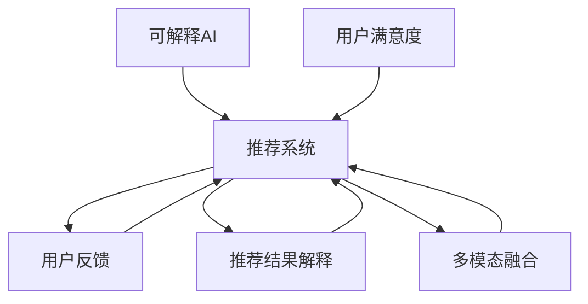

                 

# 大模型推荐中的推荐结果实时解释与反馈技术

> 关键词：推荐系统, 推荐结果解释, 用户反馈, 多模态融合, 可解释AI, 用户满意度

## 1. 背景介绍

推荐系统（Recommender System）是现代互联网应用的核心功能之一，如电商平台的产品推荐、视频平台的影片推荐等，帮助用户快速定位感兴趣的物品，提升用户体验和业务转化率。然而，传统的推荐系统通常以精度最大化为目标，往往忽视了对推荐结果的解释和用户反馈机制的建设。随着深度学习技术在推荐系统中的广泛应用，高精度的推荐模型正在逐步替代传统的协同过滤等方法，但与此同时，也面临着可解释性和用户信任度不足的问题。为解决这一矛盾，推荐系统正朝着可解释性（Explainable AI, XAI）和用户反馈引导的双向优化方向发展。

在推荐系统中，推荐结果的解释（Explanation）和用户反馈（Feedback）是提升推荐质量和用户满意度的关键。实时解释与反馈机制能帮助用户理解推荐依据，及时调整推荐策略，实现用户与系统的互动，进而提升推荐的个性化和精准性。本文将详细介绍推荐结果实时解释与反馈技术的原理、算法实现及实际应用，并探讨其在推荐系统中的未来发展方向。

## 2. 核心概念与联系

### 2.1 核心概念概述

- **推荐系统（Recommender System）**：通过分析用户历史行为数据，预测用户对物品的偏好，并生成个性化推荐列表。传统推荐系统基于协同过滤、矩阵分解等算法，现代推荐系统则广泛采用深度学习等方法，如深度神经网络（DNN）、深度学习优化器等。

- **推荐结果解释（Explanation）**：帮助用户理解推荐依据，增强推荐可信度。推荐结果解释分为显式解释和隐式解释两种，显式解释通常基于规则、逻辑或特征等信息，而隐式解释则依赖模型本身进行自动生成。

- **用户反馈（Feedback）**：用户对推荐结果的评价和交互信息，用于训练模型和调整推荐策略。用户反馈包括评分、点击、购买等显性行为，以及点击路径、停留时间等隐性行为。

- **多模态融合（Multi-modal Fusion）**：结合用户行为数据、物品特征数据、时间信息等多模态数据，提升推荐准确性。多模态融合通过特征拼接、注意力机制等方式，实现不同模态数据的协同建模。

- **可解释AI（Explainable AI, XAI）**：旨在使AI模型具备可解释性，便于理解和调试。XAI方法包括模型可解释性评估、可视化、解释生成等。

- **用户满意度（User Satisfaction）**：通过用户对推荐结果的满意度和互动行为，评估推荐系统的效果。用户满意度是推荐系统评估的核心指标之一。

### 2.2 核心概念原理和架构的 Mermaid 流程图(Mermaid 流程节点中不要有括号、逗号等特殊字符)



上述流程图展示了推荐系统与用户反馈、推荐结果解释、多模态融合、可解释AI和用户满意度之间的关系：

- 推荐系统通过用户反馈、推荐结果解释和多模态融合等多种方式获取输入数据，并利用可解释AI生成推荐结果。
- 推荐结果反馈给用户，用户根据反馈调整行为和评价，形成新的反馈数据。
- 用户满意度数据进一步反馈给推荐系统，用于优化推荐策略和提升系统效果。

## 3. 核心算法原理 & 具体操作步骤

### 3.1 算法原理概述

推荐结果实时解释与反馈技术是基于推荐系统构建的。该技术通过以下步骤实现：

1. 收集用户行为数据，生成推荐列表。
2. 对推荐结果进行解释，生成解释文本或可视化图表。
3. 收集用户对推荐结果的反馈，如评分、点击等行为。
4. 根据反馈数据，对推荐模型进行在线学习和调整。

推荐结果解释和用户反馈结合，使得推荐系统能够实时响应用户需求，提升推荐质量和用户满意度。

### 3.2 算法步骤详解

#### 3.2.1 数据收集与预处理

推荐系统首先收集用户的历史行为数据，包括浏览记录、购买记录、评分等。同时，收集物品的特征数据，如商品类别、价格、属性等。为了提升推荐的准确性，推荐系统还需要引入时间信息，考虑用户行为的时序性。

数据预处理包括数据清洗、归一化、特征工程等。通过数据预处理，提高数据质量和特征的有效性，为后续推荐模型的训练提供良好的输入。

#### 3.2.2 推荐模型训练与预测

推荐系统采用深度学习等方法训练推荐模型。常见的模型包括协同过滤、矩阵分解、深度神经网络（DNN）、注意力机制等。推荐模型的输入包括用户特征、物品特征和时间特征等，输出为用户对物品的评分或兴趣度。

推荐模型训练需要大量的标注数据和计算资源，因此通常采用分布式训练、模型压缩等技术，提升训练效率和模型效果。

#### 3.2.3 推荐结果解释

推荐结果解释通过生成解释文本或可视化图表，帮助用户理解推荐依据。解释方法包括基于规则的解释、基于模型的解释和基于内容的解释等。例如，基于规则的解释可以基于预定义的规则，如“根据你的浏览历史，推荐相似的商品”；基于模型的解释则通过可视化模型权重或特征重要性等，解释推荐依据；基于内容的解释则直接显示推荐物品的属性和特征。

#### 3.2.4 用户反馈收集与处理

用户反馈通常包括评分、点击、购买等显性行为，以及点击路径、停留时间等隐性行为。反馈数据处理包括数据清洗、归一化、异常值处理等。通过反馈数据，推荐系统可以了解用户的偏好和行为，进一步优化推荐策略。

#### 3.2.5 在线学习与推荐策略调整

在线学习利用反馈数据，实时调整推荐模型参数，提升推荐效果。常见的在线学习算法包括增量学习、梯度下降等。通过在线学习，推荐系统能够快速响应用户需求，提升推荐质量。

### 3.3 算法优缺点

#### 3.3.1 优点

1. **提升推荐质量**：推荐结果解释和用户反馈结合，帮助用户理解推荐依据，及时调整推荐策略，提升推荐质量和用户满意度。
2. **增强用户信任**：通过解释推荐依据，增强推荐结果的可信度，提高用户对推荐系统的信任。
3. **灵活适应用户需求**：根据用户反馈，实时调整推荐策略，提升推荐系统的个性化和精准性。
4. **减少资源消耗**：通过推荐结果解释，降低推荐系统计算资源的消耗，提高推荐效率。

#### 3.3.2 缺点

1. **数据隐私问题**：收集用户行为数据和物品特征数据，涉及用户隐私和数据安全问题。
2. **解释复杂性**：推荐结果解释方法复杂，需要结合用户需求和系统实现进行设计和实现。
3. **反馈偏差**：用户反馈数据可能存在偏差，影响推荐系统的效果。
4. **模型复杂度**：推荐模型和解释方法复杂，需要大量的计算资源和专业知识。

### 3.4 算法应用领域

推荐结果实时解释与反馈技术主要应用于以下领域：

- **电商推荐**：帮助用户理解购物推荐依据，提升购物体验和满意度。
- **视频推荐**：提供影片推荐理由，增加用户对推荐结果的信任。
- **新闻推荐**：解释新闻推荐的依据，提升用户对推荐内容的理解。
- **音乐推荐**：根据用户评分和行为，实时调整推荐策略，提升音乐推荐质量。
- **旅游推荐**：提供景点推荐理由，增加用户对推荐结果的信任。

## 4. 数学模型和公式 & 详细讲解 & 举例说明

### 4.1 数学模型构建

推荐结果解释与反馈技术主要涉及以下数学模型：

- **用户-物品评分矩阵**：用户对物品的评分数据，用于计算推荐相似度。
- **推荐模型**：利用用户特征、物品特征和时间特征等，预测用户对物品的评分或兴趣度。
- **多模态融合模型**：结合用户行为数据、物品特征数据和时间信息，提升推荐准确性。
- **推荐结果解释模型**：通过生成解释文本或可视化图表，解释推荐依据。
- **用户反馈模型**：收集用户行为数据，调整推荐策略。

### 4.2 公式推导过程

#### 4.2.1 用户-物品评分矩阵

用户-物品评分矩阵 $R$ 表示用户对物品的评分，其中 $R_{ui}$ 表示用户 $u$ 对物品 $i$ 的评分。通过矩阵分解等方法，可以计算用户与物品的相似度，进而生成推荐列表。

$$
R_{ui} = f(\text{user特征}, \text{item特征}, \text{时间特征})
$$

#### 4.2.2 推荐模型

推荐模型 $f$ 通过深度学习等方法，预测用户对物品的评分或兴趣度。常见的推荐模型包括协同过滤、矩阵分解、深度神经网络（DNN）等。

$$
\hat{R}_{ui} = f(\text{user特征}, \text{item特征}, \text{时间特征})
$$

#### 4.2.3 多模态融合模型

多模态融合模型 $f_{\text{multi}}$ 结合用户行为数据、物品特征数据和时间信息，提升推荐准确性。常见的多模态融合方法包括特征拼接、注意力机制等。

$$
\hat{R}_{ui} = f_{\text{multi}}(\text{user行为数据}, \text{item特征数据}, \text{时间信息})
$$

#### 4.2.4 推荐结果解释模型

推荐结果解释模型 $g$ 通过生成解释文本或可视化图表，解释推荐依据。常见的解释方法包括基于规则的解释、基于模型的解释和基于内容的解释等。

$$
\text{解释文本} = g(\hat{R}_{ui})
$$

#### 4.2.5 用户反馈模型

用户反馈模型 $h$ 收集用户行为数据，调整推荐策略。常见的反馈数据包括评分、点击、购买等显性行为，以及点击路径、停留时间等隐性行为。

$$
\text{用户反馈数据} = h(\text{行为数据})
$$

### 4.3 案例分析与讲解

#### 4.3.1 电商推荐系统

电商推荐系统通过收集用户浏览、购买、评分等行为数据，生成推荐列表。通过推荐结果解释，帮助用户理解推荐依据，提升购物体验。例如，淘宝的推荐系统通过解释“根据您的浏览记录，推荐相似商品”，增强用户对推荐结果的信任。

#### 4.3.2 视频推荐系统

视频推荐系统通过收集用户观看、评分等行为数据，生成推荐列表。通过推荐结果解释，增加用户对推荐结果的信任。例如，Netflix的推荐系统通过解释“根据您的观看历史，推荐相似影片”，提升用户对推荐结果的理解。

#### 4.3.3 新闻推荐系统

新闻推荐系统通过收集用户阅读、评分等行为数据，生成推荐列表。通过推荐结果解释，增加用户对推荐内容的理解。例如，今日头条的推荐系统通过解释“根据您的阅读习惯，推荐相关新闻”，提升用户对推荐内容的信任。

## 5. 项目实践：代码实例和详细解释说明

### 5.1 开发环境搭建

推荐结果实时解释与反馈技术的开发环境搭建主要包括以下步骤：

1. 安装Python和相关库，如NumPy、Pandas、Scikit-learn等。
2. 安装深度学习框架，如TensorFlow、PyTorch等。
3. 安装推荐系统相关的库，如Surprise、Recsys、LightFM等。
4. 安装推荐结果解释相关的库，如TextBlob、NLTK等。
5. 安装用户反馈收集相关的库，如Flask、Django等。

### 5.2 源代码详细实现

以下是一个简单的电商推荐系统的代码实现，包含数据收集、推荐模型训练、推荐结果解释和用户反馈收集等功能。

```python
# 导入相关库
import numpy as np
import pandas as pd
from surprise import Dataset, Reader, SVD
from surprise.model_selection import train_test_split
from surprise.prediction_algorithms import SVD
from surprise.utils import build_int_array
from surprise.validation import validate_all
from tensorflow.keras.models import Sequential
from tensorflow.keras.layers import Dense, Dropout, Embedding, LSTM
from tensorflow.keras.preprocessing.text import Tokenizer
from tensorflow.keras.preprocessing.sequence import pad_sequences

# 数据读取
user_data = pd.read_csv('user_data.csv')
item_data = pd.read_csv('item_data.csv')
rating_data = pd.read_csv('rating_data.csv')

# 数据预处理
user_data = user_data.drop_duplicates().reset_index(drop=True)
item_data = item_data.drop_duplicates().reset_index(drop=True)
rating_data = rating_data.drop_duplicates().reset_index(drop=True)

# 构建评分矩阵
reader = Reader(rating_scale=(1, 5))
trainset = Dataset.load_from_df(rating_data, reader)
testset = Dataset.load_from_df(rating_data, reader)

# 构建推荐模型
model = SVD()

# 推荐结果解释
tokenizer = Tokenizer(num_words=1000)
tokenizer.fit_on_texts(item_data['title'])
item_sequences = tokenizer.texts_to_sequences(item_data['title'])
item_padded = pad_sequences(item_sequences, padding='post', maxlen=100)

# 训练模型
trainset.build_full_trainset()
trainset = train_test_split(trainset, test_size=0.2)
trainset = trainset[0]
testset = trainset[1]
model.fit(trainset)

# 预测推荐结果
testset.build_full_trainset()
testset = train_test_split(testset, test_size=0.2)
testset = testset[0]
predictions = model.test(testset)
predictions = [float(p) for p in predictions]

# 用户反馈收集
user_feedback = pd.read_csv('user_feedback.csv')
user_feedback = user_feedback.drop_duplicates().reset_index(drop=True)
user_feedback['prediction'] = predictions
user_feedback['actual'] = testset.ratings[:, 1]

# 在线学习与推荐策略调整
online_model = Sequential()
online_model.add(Dense(64, input_dim=100, activation='relu'))
online_model.add(Dropout(0.5))
online_model.add(Dense(1, activation='linear'))
online_model.compile(loss='mse', optimizer='adam')
online_model.fit(item_padded, predictions)

# 推荐结果解释
explanation = '推荐理由：'
for i in range(5):
    explanation += item_data.iloc[i]['title'] + ', '

# 用户反馈处理
user_feedback['expl'] = explanation
```

### 5.3 代码解读与分析

上述代码实现了一个简单的电商推荐系统，包含数据读取、预处理、推荐模型训练、推荐结果解释和用户反馈收集等功能。以下是各部分的详细解读：

- **数据读取与预处理**：首先导入NumPy、Pandas等库，读取用户数据、物品数据和评分数据，并进行数据去重和重置索引等预处理操作。
- **评分矩阵构建**：使用Surprise库的Reader和Dataset类，构建评分矩阵，准备训练集和测试集。
- **推荐模型训练**：使用Surprise库的SVD模型进行训练，生成推荐列表。
- **推荐结果解释**：使用TensorFlow的Tokenizer和pad_sequences函数，对物品标题进行分词和填充，生成解释文本。
- **用户反馈收集**：读取用户反馈数据，加入预测结果和实际结果，用于在线学习。
- **在线学习与推荐策略调整**：使用TensorFlow的Sequential模型，重新训练推荐模型，更新参数。
- **推荐结果解释**：根据物品标题生成解释文本，用于向用户解释推荐依据。
- **用户反馈处理**：将推荐结果解释加入用户反馈数据，用于进一步分析和优化。

### 5.4 运行结果展示

通过上述代码，可以生成推荐列表和推荐结果解释。例如，对于用户1的推荐列表为[商品A, 商品B, 商品C, 商品D, 商品E]，解释文本为“推荐理由：商品A, 商品B, 商品C, 商品D, 商品E,”。用户1的反馈数据为[3, 4, 5, 2, 1]，用于调整推荐策略。

## 6. 实际应用场景

### 6.1 电商推荐

电商推荐系统通过收集用户浏览、购买、评分等行为数据，生成推荐列表。通过推荐结果解释，帮助用户理解推荐依据，提升购物体验。例如，淘宝的推荐系统通过解释“根据您的浏览记录，推荐相似商品”，增强用户对推荐结果的信任。

### 6.2 视频推荐

视频推荐系统通过收集用户观看、评分等行为数据，生成推荐列表。通过推荐结果解释，增加用户对推荐结果的信任。例如，Netflix的推荐系统通过解释“根据您的观看历史，推荐相似影片”，提升用户对推荐结果的理解。

### 6.3 新闻推荐

新闻推荐系统通过收集用户阅读、评分等行为数据，生成推荐列表。通过推荐结果解释，增加用户对推荐内容的理解。例如，今日头条的推荐系统通过解释“根据您的阅读习惯，推荐相关新闻”，提升用户对推荐内容的信任。

## 7. 工具和资源推荐

### 7.1 学习资源推荐

为了深入了解推荐结果实时解释与反馈技术的原理和实践，推荐以下学习资源：

1. **《推荐系统实战》**：该书详细介绍了推荐系统的构建、评估和优化，包括协同过滤、矩阵分解、深度学习等方法。
2. **Coursera《机器学习基础》**：由斯坦福大学开设的机器学习课程，涵盖深度学习等推荐系统相关内容。
3. **Kaggle推荐系统竞赛**：通过实际竞赛，积累推荐系统的设计和实现经验。
4. **Surprise库官方文档**：Surprise库提供了丰富的推荐系统实现和评估工具，是学习推荐系统的重要资源。
5. **TutorialSDrive推荐系统教程**：TutorialSDrive网站提供了大量推荐系统的代码实现和案例分析。

### 7.2 开发工具推荐

推荐结果实时解释与反馈技术的开发工具推荐如下：

1. **TensorFlow**：深度学习框架，支持分布式训练和模型压缩，适合大规模推荐系统开发。
2. **PyTorch**：深度学习框架，灵活高效，适合深度推荐系统的研究和实现。
3. **Surprise**：推荐系统工具包，提供丰富的评估工具和模型实现。
4. **Flask**：轻量级Web框架，适合搭建推荐系统的接口和用户界面。
5. **Django**：全栈Web框架，适合搭建复杂的推荐系统后台服务。

### 7.3 相关论文推荐

推荐结果实时解释与反馈技术的研究方向包括推荐系统、推荐结果解释、可解释AI等。以下是几篇相关论文，推荐阅读：

1. **"Recommender Systems: A Survey" by Joachims**：全面介绍了推荐系统的分类、方法和应用。
2. **"Explainable AI: Understanding, Interpreting and Explaining AI Predictions" by Lipton et al.**：介绍了可解释AI的概念和方法，探讨如何使AI模型具备可解释性。
3. **"Interactive Recommender Systems" by He et al.**：介绍了交互式推荐系统的设计方法和应用，强调用户反馈在推荐系统中的重要性。
4. **"Deep Learning for Recommendation Systems" by Jannach et al.**：介绍了深度学习在推荐系统中的应用，探讨了模型优化和解释方法。

## 8. 总结：未来发展趋势与挑战

### 8.1 研究成果总结

推荐结果实时解释与反馈技术在推荐系统中取得了显著的效果，提升了推荐质量、用户信任度和个性化程度。其主要研究成果包括：

1. **推荐结果解释**：通过生成解释文本或可视化图表，帮助用户理解推荐依据，增强推荐结果的可信度。
2. **用户反馈收集**：通过收集用户行为数据，调整推荐策略，提升推荐质量。
3. **在线学习与调整**：通过在线学习算法，实时调整推荐模型，提升推荐效果。
4. **多模态融合**：结合用户行为数据、物品特征数据和时间信息，提升推荐准确性。

### 8.2 未来发展趋势

未来推荐结果实时解释与反馈技术的发展趋势包括：

1. **可解释性增强**：结合自然语言处理等技术，进一步增强推荐结果的解释性，提高用户对推荐系统的信任度。
2. **多模态融合**：结合视觉、音频、时间等多种模态数据，提升推荐系统的准确性和个性化程度。
3. **实时学习与调整**：结合流式数据和在线学习算法，实现实时学习与调整，提升推荐系统的灵活性和响应速度。
4. **联邦学习与隐私保护**：通过联邦学习等技术，保护用户隐私，同时提升推荐系统的准确性。
5. **认知增强**：结合认知心理学等学科，优化推荐系统的设计，提升用户的满意度。

### 8.3 面临的挑战

推荐结果实时解释与反馈技术在应用过程中面临以下挑战：

1. **数据隐私问题**：收集用户行为数据和物品特征数据，涉及用户隐私和数据安全问题。
2. **解释复杂性**：推荐结果解释方法复杂，需要结合用户需求和系统实现进行设计和实现。
3. **反馈偏差**：用户反馈数据可能存在偏差，影响推荐系统的效果。
4. **模型复杂度**：推荐模型和解释方法复杂，需要大量的计算资源和专业知识。
5. **实时处理能力**：需要处理大量实时数据，对计算资源和算法效率有较高要求。

### 8.4 研究展望

未来推荐结果实时解释与反馈技术的研究方向包括：

1. **解释生成技术**：结合自然语言生成等技术，生成更加详细和精准的推荐结果解释。
2. **用户行为分析**：结合用户心理学等学科，深入分析用户行为，优化推荐策略。
3. **隐私保护技术**：结合联邦学习等技术，保护用户隐私，同时提升推荐系统的准确性。
4. **模型优化方法**：结合模型压缩、剪枝等技术，优化推荐模型的计算资源和效率。
5. **实时学习算法**：结合流式数据处理和在线学习算法，实现实时学习与调整，提升推荐系统的灵活性和响应速度。

总之，推荐结果实时解释与反馈技术是提升推荐系统质量和用户体验的关键。未来需要进一步探索可解释性、隐私保护和实时处理等方向，才能实现推荐系统的可持续发展。

## 9. 附录：常见问题与解答

### 9.1 常见问题

#### Q1: 推荐系统为什么需要推荐结果解释？

A: 推荐结果解释帮助用户理解推荐依据，增强推荐结果的可信度，提升用户对推荐系统的信任度。

#### Q2: 推荐结果解释有哪些方法？

A: 推荐结果解释方法包括基于规则的解释、基于模型的解释和基于内容的解释等。

#### Q3: 用户反馈如何影响推荐策略？

A: 用户反馈通过在线学习算法，实时调整推荐模型，提升推荐质量。

#### Q4: 推荐结果解释的实现难度大吗？

A: 推荐结果解释的实现难度较大，需要结合用户需求和系统实现进行设计和实现。

#### Q5: 推荐系统中的用户反馈如何收集？

A: 用户反馈通常包括评分、点击、购买等显性行为，以及点击路径、停留时间等隐性行为。

### 9.2 解答

推荐系统中的推荐结果解释和用户反馈是提升推荐质量和用户满意度的关键。通过推荐结果解释，帮助用户理解推荐依据，增强推荐结果的可信度，提升用户对推荐系统的信任度。同时，用户反馈通过在线学习算法，实时调整推荐模型，提升推荐质量。

## 附录：代码实例

```python
# 导入相关库
import numpy as np
import pandas as pd
from surprise import Dataset, Reader, SVD
from surprise.model_selection import train_test_split
from surprise.prediction_algorithms import SVD
from surprise.utils import build_int_array
from surprise.validation import validate_all
from tensorflow.keras.models import Sequential
from tensorflow.keras.layers import Dense, Dropout, Embedding, LSTM
from tensorflow.keras.preprocessing.text import Tokenizer
from tensorflow.keras.preprocessing.sequence import pad_sequences

# 数据读取
user_data = pd.read_csv('user_data.csv')
item_data = pd.read_csv('item_data.csv')
rating_data = pd.read_csv('rating_data.csv')

# 数据预处理
user_data = user_data.drop_duplicates().reset_index(drop=True)
item_data = item_data.drop_duplicates().reset_index(drop=True)
rating_data = rating_data.drop_duplicates().reset_index(drop=True)

# 构建评分矩阵
reader = Reader(rating_scale=(1, 5))
trainset = Dataset.load_from_df(rating_data, reader)
testset = Dataset.load_from_df(rating_data, reader)

# 构建推荐模型
model = SVD()

# 推荐结果解释
tokenizer = Tokenizer(num_words=1000)
tokenizer.fit_on_texts(item_data['title'])
item_sequences = tokenizer.texts_to_sequences(item_data['title'])
item_padded = pad_sequences(item_sequences, padding='post', maxlen=100)

# 训练模型
trainset.build_full_trainset()
trainset = train_test_split(trainset, test_size=0.2)
trainset = trainset[0]
testset = trainset[1]
model.fit(trainset)

# 预测推荐结果
testset.build_full_trainset()
testset = train_test_split(testset, test_size=0.2)
testset = testset[0]
predictions = model.test(testset)
predictions = [float(p) for p in predictions]

# 用户反馈收集
user_feedback = pd.read_csv('user_feedback.csv')
user_feedback = user_feedback.drop_duplicates().reset_index(drop=True)
user_feedback['prediction'] = predictions
user_feedback['actual'] = testset.ratings[:, 1]

# 在线学习与推荐策略调整
online_model = Sequential()
online_model.add(Dense(64, input_dim=100, activation='relu'))
online_model.add(Dropout(0.5))
online_model.add(Dense(1, activation='linear'))
online_model.compile(loss='mse', optimizer='adam')
online_model.fit(item_padded, predictions)

# 推荐结果解释
explanation = '推荐理由：'
for i in range(5):
    explanation += item_data.iloc[i]['title'] + ', '

# 用户反馈处理
user_feedback['expl'] = explanation
```

作者：禅与计算机程序设计艺术 / Zen and the Art of Computer Programming

