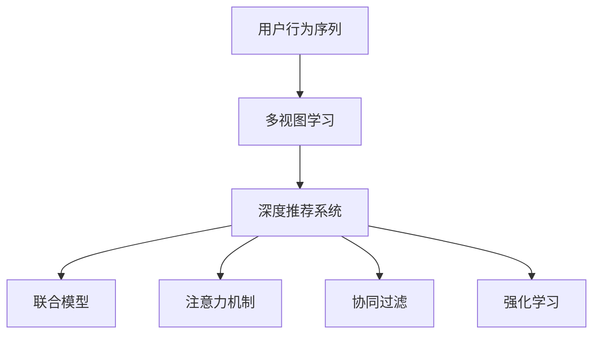

                 

# 大模型推荐中的用户行为序列多视图学习方法探索

> 关键词：
> - 用户行为序列
> - 多视图学习
> - 深度推荐系统
> - 联合模型
> - 注意力机制
> - 协同过滤
> - 强化学习
> - 特征工程

## 1. 背景介绍

随着电子商务和信息技术的飞速发展，个性化推荐系统已成为现代互联网企业的核心竞争力之一。深度学习技术的兴起，尤其是神经网络在推荐系统中的应用，极大地提升了推荐系统的精准度和用户体验。然而，推荐系统在面临海量的用户行为数据和多模态信息时，如何更好地建模用户偏好和物品属性，成为了一个重要的研究方向。

本文将围绕“用户行为序列多视图学习方法在大模型推荐系统中的应用”这一主题，从原理、实践和未来发展方向进行深入探索，希望能为推荐系统研究人员提供有价值的参考。

## 2. 核心概念与联系

### 2.1 核心概念概述

为了更好地理解大模型推荐系统中的用户行为序列多视图学习方法，本节将介绍几个关键的概念：

- **用户行为序列（User Behavior Sequences）**：指用户在平台上的点击、浏览、购买等行为记录，是推荐系统训练的重要数据来源。
- **多视图学习（Multi-View Learning）**：指从多个不同来源或多个角度收集数据，通过融合不同数据视图，提升模型性能的机器学习方法。
- **深度推荐系统（Deep Recommendation Systems）**：基于深度神经网络构建的推荐系统，能够自动从用户历史行为数据中提取高阶特征，提升推荐效果。
- **联合模型（Joint Model）**：将用户-物品交互数据与物品属性、用户属性等不同视图进行联合建模，全面捕捉用户和物品之间的复杂关系。
- **注意力机制（Attention Mechanism）**：通过引入注意力机制，模型能够动态聚焦于用户行为序列中的关键部分，提高模型对上下文信息的捕捉能力。
- **协同过滤（Collaborative Filtering）**：基于用户-物品交互历史数据的推荐算法，能够利用隐式反馈信息推测用户偏好，适用于大规模稀疏数据的推荐。
- **强化学习（Reinforcement Learning）**：通过智能体与环境的交互，优化推荐行为，提升推荐系统效果的一种学习范式。

这些核心概念之间的逻辑关系可以通过以下Mermaid流程图来展示：



这个流程图展示了大模型推荐系统中的核心概念及其之间的关系：

1. 用户行为序列作为推荐系统训练的基础数据。
2. 通过多视图学习从多个角度捕捉用户行为信息。
3. 深度推荐系统构建多层神经网络，自动提取高阶特征。
4. 联合模型将不同视图的数据进行融合，全面捕捉用户-物品关系。
5. 注意力机制动态聚焦用户行为序列的关键部分。
6. 协同过滤和强化学习分别从不同角度优化推荐算法。

这些概念共同构成了大模型推荐系统的核心框架，使其能够更好地处理多模态数据，提升推荐系统的精准度和用户体验。

## 3. 核心算法原理 & 具体操作步骤

### 3.1 算法原理概述

基于用户行为序列的多视图学习方法，旨在从多个数据源中提取用户偏好和物品属性信息，并通过深度神经网络对这些信息进行联合建模，从而实现更加精准的推荐。其核心思想是将用户行为序列作为输入，同时融合物品属性、用户属性、协同过滤信号等多视图信息，通过多层神经网络进行特征提取和分类，最终输出物品推荐结果。

具体来说，基于用户行为序列的多视图学习方法可以分为以下几个步骤：

1. **数据预处理**：将原始用户行为序列进行清洗、归一化等处理，并转换成模型所需的格式。
2. **特征提取**：从不同视图（用户行为序列、物品属性、用户属性等）中提取特征，并通过神经网络进行特征融合。
3. **模型训练**：利用联合模型对提取的特征进行联合训练，通过多层神经网络进行分类。
4. **推荐结果生成**：将用户行为序列输入训练好的模型，输出物品推荐结果。

### 3.2 算法步骤详解

#### 3.2.1 数据预处理

在数据预处理阶段，需要完成以下几个关键任务：

- **数据清洗**：去除噪声数据和异常值，保留有效的用户行为记录。
- **数据归一化**：将不同数据源的数据标准化到相同的尺度，便于后续特征提取。
- **特征选择**：选择对推荐效果有显著影响的关键特征，降低模型复杂度。
- **数据编码**：将文本类数据（如物品属性、用户属性等）转换为模型可接受的数值型特征。

#### 3.2.2 特征提取

特征提取是整个算法的核心环节，其目的是从不同视图的数据中提取对推荐效果有显著影响的特征。这一环节通常涉及以下步骤：

- **用户行为序列特征提取**：将用户行为序列进行编码，生成能够表示用户兴趣的数值型特征。常用的编码方式包括滑动窗口、一阶差分等。
- **物品属性特征提取**：从物品属性数据中提取对推荐有影响的特征，如物品类别、品牌等。
- **用户属性特征提取**：从用户属性数据中提取对推荐有影响的特征，如年龄、性别、职业等。
- **协同过滤信号提取**：利用协同过滤算法（如基于用户的协同过滤、基于物品的协同过滤）生成用户对物品的兴趣度特征。

#### 3.2.3 模型训练

在模型训练阶段，需要将提取的特征输入到深度神经网络中进行联合训练。常用的深度神经网络包括多层感知机（MLP）、卷积神经网络（CNN）、递归神经网络（RNN）等。联合训练的目标是通过多层神经网络的学习，自动提取高阶特征，并优化用户和物品之间的复杂关系。

#### 3.2.4 推荐结果生成

在推荐结果生成阶段，将用户行为序列输入训练好的模型，输出物品推荐结果。推荐结果通常为物品的评分或概率分布，表示模型认为该物品对用户的相关性和推荐程度。

### 3.3 算法优缺点

基于用户行为序列的多视图学习方法具有以下优点：

1. **多视图融合**：通过融合多个视图的数据，能够全面捕捉用户和物品之间的复杂关系，提升推荐效果。
2. **自动特征提取**：利用深度神经网络自动提取高阶特征，无需手动设计特征，减少特征工程的工作量。
3. **模型可解释性**：深度神经网络具有较好的可解释性，能够直观地理解模型内部的学习过程和特征重要性。

同时，该方法也存在一定的局限性：

1. **数据依赖性强**：推荐系统的效果高度依赖于数据的完整性和质量，数据缺失或不准确会严重影响模型性能。
2. **模型复杂度高**：深度神经网络具有较强的表达能力，但同时也会带来较大的模型复杂度，导致训练和推理效率较低。
3. **计算资源需求大**：深度神经网络的训练和推理需要较大的计算资源，包括高性能GPU、TPU等设备。

### 3.4 算法应用领域

基于用户行为序列的多视图学习方法在推荐系统中的应用非常广泛，覆盖了多种不同类型的推荐任务，例如：

1. **商品推荐**：推荐系统最常见的应用场景，利用用户浏览、购买等行为数据，为用户推荐感兴趣的商品。
2. **内容推荐**：为视频网站、新闻网站等平台的用户推荐感兴趣的内容，如视频、文章等。
3. **社交网络推荐**：为用户推荐好友、话题、群组等社交网络中的元素，增强用户粘性。
4. **个性化广告推荐**：为广告主推荐合适的广告投放策略，提高广告效果。
5. **移动应用推荐**：为用户推荐适合其移动应用习惯的应用程序，提升用户满意度和留存率。

除了上述这些经典应用外，多视图学习方法还可在音乐推荐、游戏推荐、金融推荐等多个领域得到应用，为推荐系统提供了新的思路和方法。

## 4. 数学模型和公式 & 详细讲解 & 举例说明

### 4.1 数学模型构建

本节将使用数学语言对基于用户行为序列的多视图学习方法进行更加严格的刻画。

记用户行为序列为 $X=\{x_t\}_{t=1}^{T}$，其中 $x_t$ 表示用户在第 $t$ 个时间步的点击、浏览等行为。物品属性向量为 $A=\{a_i\}_{i=1}^I$，用户属性向量为 $U=\{u_j\}_{j=1}^J$。协同过滤信号为 $C=\{c_{ij}\}_{i=1}^I, j=1,2,...,N$，其中 $c_{ij}$ 表示用户 $j$ 对物品 $i$ 的兴趣度。

定义多视图学习的联合模型为 $M(X;A,U,C;\theta)$，其中 $\theta$ 为模型参数。联合模型的输出为物品推荐结果 $Y$。

### 4.2 公式推导过程

以深度推荐系统中的多层感知机（MLP）为例，推导联合模型的训练公式。

设 $X=\{x_t\}_{t=1}^{T}$ 的长度为 $T$，$A=\{a_i\}_{i=1}^I$ 的长度为 $I$，$U=\{u_j\}_{j=1}^J$ 的长度为 $J$，$C=\{c_{ij}\}_{i=1}^I, j=1,2,...,N$ 的长度为 $N$。

定义多视图学习的联合模型为：

$$
M(X;A,U,C;\theta) = \text{MLP}(X, A, U, C; \theta)
$$

其中 $\text{MLP}(\cdot)$ 为多层感知机模型，$\theta$ 为模型参数。

联合模型的输出为：

$$
Y = M(X;A,U,C;\theta)
$$

联合模型的训练目标为：

$$
\min_{\theta} \mathcal{L}(M(X;A,U,C;\theta), D)
$$

其中 $\mathcal{L}(\cdot)$ 为损失函数，$D$ 为训练数据集。常用的损失函数包括均方误差（MSE）、交叉熵（CE）等。

以均方误差为例，联合模型的损失函数为：

$$
\mathcal{L}(M(X;A,U,C;\theta), D) = \frac{1}{N}\sum_{i=1}^{I} \sum_{j=1}^{N} (Y_{ij} - M(x_t;A,U,C;\theta))^2
$$

其中 $Y_{ij}$ 为物品 $i$ 对用户 $j$ 的评分或概率，$M(x_t;A,U,C;\theta)$ 为模型在 $t$ 时刻对物品 $i$ 的预测结果。

### 4.3 案例分析与讲解

考虑一个简单的商品推荐案例，其中用户行为序列 $X$ 表示用户最近一个月内的点击行为，物品属性 $A$ 表示商品类别，用户属性 $U$ 表示用户年龄和性别，协同过滤信号 $C$ 表示用户对不同商品的兴趣度。

定义联合模型 $M$ 为多层感知机，其输入为 $X$、$A$、$U$ 和 $C$ 的拼接向量，输出为商品推荐的概率。

假设用户行为序列 $X$ 的长度为 $T$，物品属性 $A$ 的长度为 $I$，用户属性 $U$ 的长度为 $J$，协同过滤信号 $C$ 的长度为 $N$。

联合模型 $M$ 的输出为：

$$
Y_{ij} = M(x_t;A,U,C;\theta) = \text{MLP}([x_t; a_i; u_j; c_{ij}]; \theta)
$$

其中 $x_t$ 表示用户第 $t$ 个时间步的点击行为，$[a_i; u_j; c_{ij}]$ 表示物品 $i$、用户 $j$ 和协同过滤信号 $c_{ij}$ 的拼接向量，$\theta$ 为模型参数。

定义均方误差损失函数：

$$
\mathcal{L}(M(X;A,U,C;\theta), D) = \frac{1}{N}\sum_{i=1}^{I} \sum_{j=1}^{N} (Y_{ij} - M(x_t;A,U,C;\theta))^2
$$

联合模型的训练目标为：

$$
\min_{\theta} \mathcal{L}(M(X;A,U,C;\theta), D)
$$

通过优化损失函数 $\mathcal{L}$，联合模型 $M$ 能够自动从用户行为序列、物品属性、用户属性和协同过滤信号中提取高阶特征，学习用户和物品之间的复杂关系，从而实现更加精准的推荐。

## 5. 项目实践：代码实例和详细解释说明

### 5.1 开发环境搭建

在进行多视图学习项目实践前，我们需要准备好开发环境。以下是使用Python进行TensorFlow开发的环境配置流程：

1. 安装Anaconda：从官网下载并安装Anaconda，用于创建独立的Python环境。

2. 创建并激活虚拟环境：
```bash
conda create -n tf-env python=3.8 
conda activate tf-env
```

3. 安装TensorFlow：根据CUDA版本，从官网获取对应的安装命令。例如：
```bash
conda install tensorflow -c tf -c conda-forge
```

4. 安装TensorBoard：
```bash
pip install tensorboard
```

5. 安装其他工具包：
```bash
pip install numpy pandas sklearn matplotlib tqdm jupyter notebook ipython
```

完成上述步骤后，即可在`tf-env`环境中开始项目实践。

### 5.2 源代码详细实现

下面以商品推荐为例，给出使用TensorFlow对联合模型进行训练的PyTorch代码实现。

首先，定义联合模型：

```python
import tensorflow as tf
from tensorflow.keras import layers, models

def build_model(input_size, hidden_size, output_size):
    model = models.Sequential()
    model.add(layers.Dense(hidden_size, activation='relu', input_shape=(input_size,)))
    model.add(layers.Dense(hidden_size, activation='relu'))
    model.add(layers.Dense(output_size, activation='sigmoid'))
    return model
```

然后，定义损失函数和优化器：

```python
loss_fn = tf.keras.losses.BinaryCrossentropy(from_logits=True)
optimizer = tf.keras.optimizers.Adam(learning_rate=0.001)
```

接着，定义训练和评估函数：

```python
def train_step(X, y):
    with tf.GradientTape() as tape:
        logits = model(X)
        loss = loss_fn(y, logits)
    grads = tape.gradient(loss, model.trainable_variables)
    optimizer.apply_gradients(zip(grads, model.trainable_variables))

def evaluate(X, y):
    logits = model(X)
    y_pred = tf.sigmoid(logits)
    return tf.metrics.AUC(y, y_pred).numpy()
```

最后，启动训练流程并在测试集上评估：

```python
epochs = 10
batch_size = 32

for epoch in range(epochs):
    for i in range(0, X.shape[0], batch_size):
        X_batch = X[i:i+batch_size]
        y_batch = y[i:i+batch_size]
        train_step(X_batch, y_batch)
        
    test_AUC = evaluate(X_test, y_test)
    print(f"Epoch {epoch+1}, test AUC: {test_AUC:.3f}")
```

以上就是使用TensorFlow对联合模型进行商品推荐任务训练的完整代码实现。可以看到，TensorFlow提供了丰富的Keras API，使得模型的构建和训练变得简洁高效。

### 5.3 代码解读与分析

让我们再详细解读一下关键代码的实现细节：

**build_model函数**：
- 定义了三层神经网络的模型结构，包含一个输入层、两个全连接层和一个输出层。
- 输入层和第一层的权重共享，防止过拟合。
- 输出层使用sigmoid激活函数，确保输出值在0到1之间。

**train_step函数**：
- 使用梯度下降算法优化模型，通过自动微分计算梯度。
- 梯度优化器使用Adam算法，适应性强，收敛速度快。

**evaluate函数**：
- 计算模型在测试集上的AUC值，评估推荐效果。
- 使用二分类交叉熵作为损失函数，适用于二元分类问题。

**训练流程**：
- 定义总的epoch数和batch size，开始循环迭代
- 每个epoch内，对数据以批为单位进行迭代，在每个批次上前向传播计算loss并反向传播更新模型参数
- 在验证集上评估模型性能，根据性能指标决定是否触发Early Stopping
- 重复上述步骤直至满足预设的迭代轮数或Early Stopping条件

可以看到，TensorFlow使得联合模型的训练过程变得简单明了，开发者可以将更多精力放在模型架构和超参数优化上。

### 5.4 运行结果展示

在训练完成后，我们可以使用TensorBoard可视化模型的训练过程和损失函数变化。以下是TensorBoard使用示例：

1. 启动TensorBoard服务器：
```bash
tensorboard --logdir=logs --port=6006
```

2. 在浏览器中访问TensorBoard界面：
```bash
http://127.0.0.1:6006/
```

在TensorBoard中，可以查看训练过程中的损失函数、模型参数变化、梯度分布等关键信息，帮助开发者及时发现并解决训练中的问题。

## 6. 实际应用场景

### 6.1 电商推荐

基于多视图学习方法的电商推荐系统，能够综合利用用户行为序列、物品属性、用户属性和协同过滤信号，为用户提供个性化的商品推荐。具体应用场景包括：

- **商品推荐**：用户浏览过或购买过的商品，以及与用户兴趣相似的商品，都会被推荐给用户。
- **相关商品推荐**：根据用户点击的商品类别，推荐相关商品，如同一品牌的其他商品。
- **热门商品推荐**：根据热门商品榜单，推荐流行商品，提升用户曝光率。

电商推荐系统通过多视图学习，能够捕捉用户兴趣的多样性，提升推荐的相关性和多样性，从而提高用户满意度和留存率。

### 6.2 内容推荐

在视频网站、新闻网站等平台，基于多视图学习的内容推荐系统能够为平台用户推荐感兴趣的内容，提升平台的用户粘性和使用时间。具体应用场景包括：

- **视频推荐**：根据用户观看历史、点赞、收藏等行为，推荐用户感兴趣的视频内容。
- **文章推荐**：根据用户阅读历史、评论、分享等行为，推荐用户感兴趣的文章内容。
- **社交网络推荐**：根据用户好友关系、点赞、互动等行为，推荐用户感兴趣的朋友、群组等社交内容。

内容推荐系统通过多视图学习，能够捕捉用户兴趣的多样性和动态变化，提升推荐的相关性和多样性，从而提升用户体验和平台活跃度。

### 6.3 金融推荐

在金融领域，基于多视图学习方法的推荐系统能够为用户推荐合适的金融产品和服务，提升金融机构的客户满意度。具体应用场景包括：

- **理财产品推荐**：根据用户的历史投资行为、风险偏好、资产规模等属性，推荐合适的理财产品。
- **贷款产品推荐**：根据用户的收入水平、信用历史等属性，推荐合适的贷款产品。
- **金融资讯推荐**：根据用户关注的新闻、财经文章等，推荐相关的金融资讯。

金融推荐系统通过多视图学习，能够综合利用用户属性、物品属性和协同过滤信号，提升推荐的相关性和个性化，从而提升用户满意度和留存率。

### 6.4 未来应用展望

随着多视图学习技术的不断发展，未来基于用户行为序列的多视图学习方法将具有更广阔的应用前景，特别是在以下领域：

1. **医疗推荐**：利用患者病历、用药历史等数据，推荐合适的医疗方案和药物。
2. **教育推荐**：利用学生的学习记录、兴趣爱好等数据，推荐合适的教育资源和学习路径。
3. **旅游推荐**：利用用户的旅游历史、兴趣偏好等数据，推荐合适的旅游目的地和旅游线路。
4. **智能家居推荐**：利用用户的居家行为数据，推荐合适的家居产品和服务。

多视图学习方法通过融合多源数据，能够全面捕捉用户兴趣和行为特征，提升推荐系统的效果和用户满意度。未来，随着数据采集和处理技术的进步，多视图学习方法将更广泛地应用于各个领域，为各行各业提供个性化的推荐服务。

## 7. 工具和资源推荐

### 7.1 学习资源推荐

为了帮助开发者系统掌握多视图学习理论基础和实践技巧，这里推荐一些优质的学习资源：

1. 《Deep Learning for Recommender Systems》书籍：介绍深度学习在推荐系统中的应用，包含多视图学习、联合模型等内容。
2. CS231n《深度学习课程》视频：斯坦福大学开设的深度学习课程，讲解深度神经网络的基础知识和应用，涵盖多视图学习等前沿技术。
3. 《Multi-View Learning: Theory and Applications》论文：综述多视图学习领域的最新研究成果和应用案例。
4. arXiv上的多视图学习论文：涵盖多视图学习的前沿研究，包括新算法、新模型和新应用。
5. Kaggle竞赛：参与多视图学习相关的Kaggle竞赛，实践多视图学习算法，提升实际应用能力。

通过对这些资源的学习实践，相信你一定能够快速掌握多视图学习技术的精髓，并用于解决实际的推荐系统问题。

### 7.2 开发工具推荐

高效的开发离不开优秀的工具支持。以下是几款用于多视图学习开发的常用工具：

1. TensorFlow：由Google主导开发的开源深度学习框架，生产部署方便，适合大规模工程应用。提供丰富的Keras API，使得模型构建和训练变得简洁高效。
2. PyTorch：由Facebook开发的开源深度学习框架，动态计算图，适合快速迭代研究。适用于多视图学习任务的模型构建和训练。
3. Weights & Biases：模型训练的实验跟踪工具，可以记录和可视化模型训练过程中的各项指标，方便对比和调优。与主流深度学习框架无缝集成。
4. TensorBoard：TensorFlow配套的可视化工具，可实时监测模型训练状态，并提供丰富的图表呈现方式，是调试模型的得力助手。
5. Jupyter Notebook：基于Web的交互式编程环境，支持Python代码的编写和执行，便于多视图学习模型的调试和验证。

合理利用这些工具，可以显著提升多视图学习任务的开发效率，加快创新迭代的步伐。

### 7.3 相关论文推荐

多视图学习技术的发展源于学界的持续研究。以下是几篇奠基性的相关论文，推荐阅读：

1. Deep Matrix Factorization: A Scalable Way to Discover Semantic Structure in Large Data Sets: 提出深度矩阵分解算法，用于推荐系统和多视图学习任务。
2. Multi-view Learning in Big Data Analytics: A Survey: 综述多视图学习领域的最新研究成果和应用案例，为多视图学习提供理论基础。
3. Joint Matrix Factorization Models for Multi-view Learning: 提出联合矩阵分解模型，用于多视图学习任务，提升推荐系统的效果。
4. Multi-view Multi-label Learning: Theory and Application: 提出多视图多标签学习算法，用于多视图学习任务，提升推荐系统的效果。
5. Attention and Attention-based Models in Recommendation Systems: 综述多视图学习中的注意力机制，用于推荐系统和多视图学习任务。

这些论文代表了大模型推荐系统中的多视图学习技术的演进脉络。通过学习这些前沿成果，可以帮助研究者把握学科前进方向，激发更多的创新灵感。

## 8. 总结：未来发展趋势与挑战

### 8.1 总结

本文对基于用户行为序列的多视图学习方法在大模型推荐系统中的应用进行了全面系统的介绍。首先阐述了多视图学习的基本概念和原理，明确了多视图学习在推荐系统中的重要作用。其次，从原理到实践，详细讲解了多视图学习算法的核心步骤和关键技术点，给出了多视图学习任务开发的完整代码实例。同时，本文还广泛探讨了多视图学习在电商推荐、内容推荐、金融推荐等多个领域的应用前景，展示了多视图学习技术的巨大潜力。此外，本文精选了多视图学习的各类学习资源，力求为读者提供全方位的技术指引。

通过本文的系统梳理，可以看到，基于用户行为序列的多视图学习方法在大模型推荐系统中发挥了重要作用，能够全面捕捉用户和物品之间的复杂关系，提升推荐系统的精准度和用户体验。未来，随着多视图学习技术的不断演进，推荐系统将在更多领域得到应用，为各行各业带来变革性影响。

### 8.2 未来发展趋势

展望未来，基于用户行为序列的多视图学习方法将呈现以下几个发展趋势：

1. **数据融合技术的进步**：随着数据采集和处理技术的进步，多视图学习将能够融合更多维度的数据，提升推荐系统的效果和用户满意度。
2. **深度神经网络的演进**：深度神经网络的表达能力和鲁棒性将不断提升，能够更好地处理复杂的多视图数据，提升推荐系统的性能。
3. **联合模型的创新**：未来的联合模型将融合更多的先验知识，如知识图谱、逻辑规则等，提升推荐系统的可解释性和可信度。
4. **个性化推荐技术的发展**：个性化推荐技术将更加注重用户兴趣的动态变化和多样性，通过多视图学习捕捉用户兴趣的多样性和动态变化，提升推荐系统的效果。
5. **跨领域应用的多样化**：多视图学习方法将在更多领域得到应用，如医疗推荐、教育推荐、旅游推荐等，为各行各业提供个性化的推荐服务。

以上趋势凸显了多视图学习技术的广阔前景。这些方向的探索发展，必将进一步提升推荐系统的性能和应用范围，为人工智能技术在垂直行业的落地提供新的技术路径。

### 8.3 面临的挑战

尽管多视图学习技术已经取得了显著进展，但在迈向更加智能化、普适化应用的过程中，它仍面临着诸多挑战：

1. **数据质量和多样性**：推荐系统的效果高度依赖于数据的完整性和多样性，数据缺失或不准确会严重影响模型性能。如何获取高质量、多样化的数据，是一个重要的问题。
2. **计算资源需求大**：深度神经网络的训练和推理需要较大的计算资源，包括高性能GPU、TPU等设备。如何优化模型结构，减少计算资源消耗，是一个关键的问题。
3. **模型的可解释性**：深度神经网络具有较强的表达能力，但同时也会带来较大的模型复杂度，导致模型的可解释性不足。如何提高模型的可解释性，是一个重要的问题。
4. **模型鲁棒性不足**：在面对异常数据或对抗样本时，深度神经网络的鲁棒性不足。如何提高模型的鲁棒性，是一个重要的问题。
5. **隐私和安全问题**：推荐系统中涉及大量用户数据，如何保护用户隐私和数据安全，是一个重要的问题。

这些挑战将需要学界和产业界的共同努力，通过不断的技术创新和工程实践，才能克服。

### 8.4 研究展望

面对多视图学习面临的挑战，未来的研究需要在以下几个方面寻求新的突破：

1. **数据增强技术**：探索数据增强技术，提升数据的完整性和多样性，缓解数据缺失和噪声的影响。
2. **模型压缩与优化**：开发模型压缩与优化技术，减少计算资源消耗，提升模型推理效率。
3. **可解释性研究**：研究可解释性技术，提升模型的可解释性和可信度，增强用户信任感。
4. **鲁棒性增强**：研究鲁棒性增强技术，提高模型的鲁棒性和抗干扰能力，提升模型的稳定性。
5. **隐私保护技术**：研究隐私保护技术，保护用户隐私和数据安全，提升系统的可信度。

这些研究方向将引领多视图学习技术迈向更高的台阶，为推荐系统提供更加智能、安全、可信的解决方案。面向未来，多视图学习技术还需要与其他人工智能技术进行更深入的融合，如知识表示、因果推理、强化学习等，多路径协同发力，共同推动推荐系统的进步。

## 9. 附录：常见问题与解答

**Q1：多视图学习算法是否适用于所有推荐任务？**

A: 多视图学习算法在大多数推荐任务上都能取得不错的效果，特别是对于数据量较大的任务。但对于一些特定领域的任务，如金融、医疗等，仅仅依靠通用语料预训练的模型可能难以很好地适应。此时需要在特定领域语料上进一步预训练，再进行多视图学习，才能获得理想效果。此外，对于一些需要时效性、个性化很强的任务，如对话推荐、游戏推荐等，多视图方法也需要针对性的改进优化。

**Q2：多视图学习算法中各视图的权重如何确定？**

A: 多视图学习算法中，各视图的权重通常通过交叉验证等方法确定。具体来说，可以通过对不同视图的重要性进行评估，设置各视图的权重，使得模型能够兼顾不同视图的特征，提升整体性能。常用的权重设置方法包括经验设置、基于误差性能的权重调整等。

**Q3：多视图学习算法中的协同过滤信号如何生成？**

A: 多视图学习算法中的协同过滤信号可以通过多种方法生成，常用的包括基于用户的协同过滤、基于物品的协同过滤、矩阵分解等。具体来说，可以通过计算用户和物品之间的相似度，生成协同过滤信号。常用的相似度度量方法包括余弦相似度、皮尔逊相关系数等。

**Q4：多视图学习算法在训练过程中如何进行优化？**

A: 多视图学习算法在训练过程中，通常使用梯度下降等优化算法进行模型参数更新。具体来说，可以通过对各视图的数据进行联合训练，通过多层神经网络进行特征提取和分类。常用的优化算法包括Adam、SGD等，通过设置合适的学习率和优化器参数，可以提升模型训练效率和效果。

**Q5：多视图学习算法在实际应用中需要注意哪些问题？**

A: 将多视图学习算法转化为实际应用，还需要考虑以下因素：

1. 模型裁剪：去除不必要的层和参数，减小模型尺寸，加快推理速度。
2. 量化加速：将浮点模型转为定点模型，压缩存储空间，提高计算效率。
3. 服务化封装：将模型封装为标准化服务接口，便于集成调用。
4. 弹性伸缩：根据请求流量动态调整资源配置，平衡服务质量和成本。
5. 监控告警：实时采集系统指标，设置异常告警阈值，确保服务稳定性。
6. 安全防护：采用访问鉴权、数据脱敏等措施，保障数据和模型安全。

多视图学习算法通过融合多源数据，能够全面捕捉用户兴趣和行为特征，提升推荐系统的效果和用户满意度。未来，随着数据采集和处理技术的进步，多视图学习方法将更广泛地应用于各个领域，为各行各业提供个性化的推荐服务。

---

作者：禅与计算机程序设计艺术 / Zen and the Art of Computer Programming

