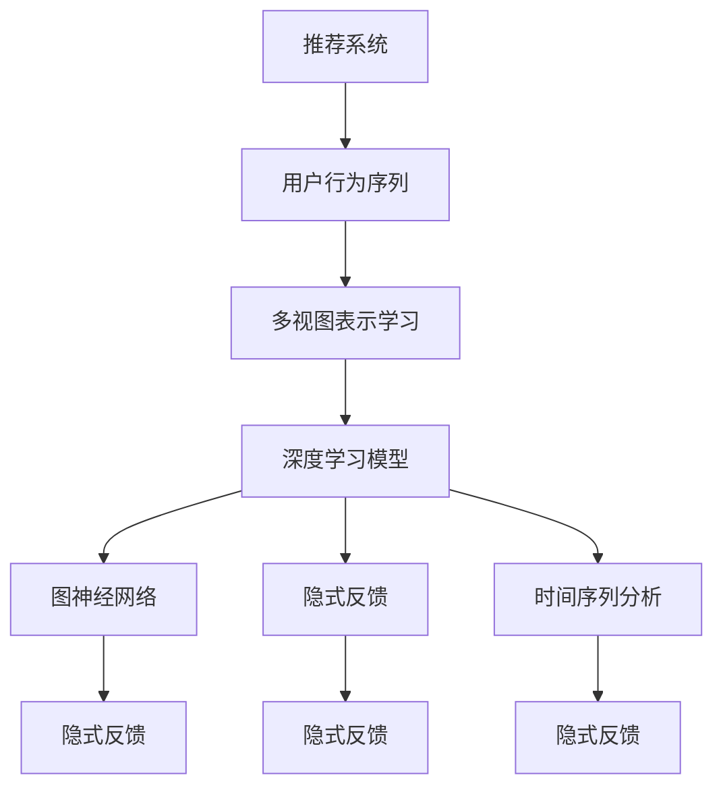

                 

# 大模型推荐中的用户行为序列多视图表示学习技术创新

> 关键词：推荐系统,多视图表示学习,用户行为序列,深度学习,自然语言处理(NLP),图神经网络(GNN),隐式反馈,时间序列分析

## 1. 背景介绍

### 1.1 问题由来

在当今数字化时代，推荐系统已广泛应用于电子商务、社交媒体、视频平台等多个领域。推荐系统的核心目标是根据用户的历史行为和偏好，为其推荐相关内容。随着用户数据量的不断积累，推荐系统的推荐效果和个性化程度显著提升。然而，现有的推荐系统大多基于单一的特征，如用户画像、物品属性、点击记录等，难以全面刻画用户与物品之间的复杂交互。

近年来，深度学习在推荐系统中的应用成为研究热点。利用深度神经网络模型挖掘用户行为序列的隐含规律，是提升推荐系统性能的有效手段。同时，随着多模态数据的融合应用，推荐系统开始引入用户行为序列的多视图表示学习，以更全面、更准确地刻画用户和物品的特性。

### 1.2 问题核心关键点

本文聚焦于大模型推荐系统中的用户行为序列多视图表示学习技术，旨在通过综合利用用户行为序列的多种数据源，挖掘隐含的复杂交互模式，从而提升推荐系统的性能和鲁棒性。具体核心问题包括：

1. **用户行为序列的多视图表示学习**：如何利用用户点击记录、浏览历史、评分数据、评论等多种数据源，高效地提取用户行为序列的多维特征表示。

2. **深度学习模型的设计和训练**：如何设计高效的深度学习模型，对用户行为序列的多视图特征进行建模，捕捉其中的复杂模式。

3. **推荐模型的优化和评估**：如何构建推荐模型，利用多视图用户行为序列表示进行推荐，并在实际应用中验证其效果。

4. **推荐系统的鲁棒性和泛化性**：如何在多样化的数据和场景下，保持推荐系统的稳定性和高性能，避免过拟合和数据泄露等问题。

## 2. 核心概念与联系

### 2.1 核心概念概述

为了更好地理解多视图用户行为序列表示学习的核心概念，本节将介绍几个密切相关的核心概念：

- **推荐系统(Recommender System)**：通过学习用户历史行为数据，为用户推荐潜在兴趣物品的系统。推荐系统广泛应用于电商、视频、社交媒体等场景，提高用户满意度和转化率。

- **用户行为序列(User Behavior Sequence)**：用户与系统交互中产生的连续数据流，如点击记录、浏览历史、评分、评论等，是推荐系统的重要数据来源。

- **多视图表示学习(Multi-view Representation Learning)**：利用多个不同类型的数据源，联合提取用户行为序列的多维特征表示，全面刻画用户和物品的特性。

- **深度学习模型(Deep Learning Model)**：基于神经网络模型，可以高效地学习高维度数据的多维特征表示，捕捉其中的复杂模式。

- **图神经网络(Graph Neural Network, GNN)**：利用图结构关系进行特征传播和聚类的深度学习模型，特别适用于处理多视图数据。

- **隐式反馈(Implicit Feedback)**：用户未直接显示的行为数据，如点击、浏览、停留时间等，通过多视图表示学习，可以更准确地捕捉用户兴趣。

- **时间序列分析(Time Series Analysis)**：对用户行为序列随时间变化的特点进行分析，捕捉其中的动态变化规律。

这些核心概念之间的逻辑关系可以通过以下Mermaid流程图来展示：



这个流程图展示了大模型推荐系统中各核心概念之间的联系：

1. 推荐系统通过用户行为序列进行建模。
2. 用户行为序列的多视图表示学习，利用多种数据源提取用户行为的多维特征。
3. 深度学习模型对多视图特征进行建模，捕捉其中的复杂模式。
4. 图神经网络进一步处理多视图特征，形成更全面、更鲁棒的特征表示。
5. 隐式反馈、时间序列分析等技术进一步丰富用户行为序列的特征表示。

这些概念共同构成了大模型推荐系统的学习和应用框架，使其能够在各种场景下实现高效的推荐。

## 3. 核心算法原理 & 具体操作步骤
### 3.1 算法原理概述

基于多视图用户行为序列表示学习的推荐系统，本质上是利用深度学习模型对用户行为序列的多视图特征进行建模，通过学习用户与物品的复杂交互模式，提升推荐系统的性能和泛化能力。

形式化地，假设用户行为序列包含多个视图 $V=\{V_1,V_2,\dots,V_m\}$，其中 $V_i$ 表示第 $i$ 个视图的特征，包含用户历史行为数据，如点击记录、浏览历史、评分等。设 $X_i \in \mathbb{R}^{N_i \times D_i}$ 表示 $V_i$ 的数据矩阵，其中 $N_i$ 为样本数量，$D_i$ 为特征维度。设 $W_i$ 表示 $V_i$ 的嵌入权重，则 $V_i$ 的嵌入表示为 $H_i=W_iX_i \in \mathbb{R}^{N_i \times d}$，其中 $d$ 为嵌入维度。

多视图用户行为序列表示学习的目标是学习一个嵌入权重矩阵 $W$，使得 $H=WX$ 尽可能地表达用户行为序列的多维特征，并用于推荐模型的训练。推荐模型的目标函数通常为：

$$
\mathcal{L} = \frac{1}{N} \sum_{i=1}^N \left( l_{ij} + \lambda l_{\text{reg}} \right)
$$

其中 $l_{ij}$ 为用户 $i$ 对物品 $j$ 的真实评分或隐式反馈，$l_{\text{reg}}$ 为正则化项，$\lambda$ 为正则化系数。

通过梯度下降等优化算法，不断更新嵌入权重 $W$，最小化损失函数 $\mathcal{L}$，使得推荐模型的输出尽可能地逼近真实评分。

### 3.2 算法步骤详解

基于多视图用户行为序列表示学习的推荐系统一般包括以下几个关键步骤：

**Step 1: 数据预处理和特征工程**

- 收集用户行为序列的多种数据源，如点击记录、浏览历史、评分、评论等。
- 对各数据源进行清洗和特征提取，如时间戳归一化、缺失值处理、特征编码等。
- 利用深度学习模型或图神经网络，将多视图数据转换为嵌入表示。

**Step 2: 深度学习模型设计**

- 选择合适的深度学习模型架构，如卷积神经网络(CNN)、循环神经网络(RNN)、自编码器(Autoencoder)、变分自编码器(VAE)等。
- 设计模型输入和输出层，考虑如何高效地融合多视图特征表示。
- 选择合适的损失函数，如均方误差(MSE)、交叉熵(Cross-Entropy)、均方对数误差(MSE)等。

**Step 3: 模型训练和优化**

- 准备训练数据集和验证数据集，采用交叉验证等策略防止过拟合。
- 使用优化算法，如Adam、SGD等，最小化损失函数，更新模型参数。
- 周期性在验证集上评估模型性能，调整超参数，避免过拟合。

**Step 4: 推荐系统集成和部署**

- 使用训练好的模型，对新用户行为序列进行预测，生成推荐结果。
- 集成多种推荐策略，如协同过滤、基于内容的推荐等，提高推荐效果。
- 部署推荐模型，通过API接口或插件的方式，集成到电商、视频、社交媒体等平台中。

**Step 5: 模型评估和迭代**

- 在真实用户数据上评估推荐模型的性能，如点击率、转化率、平均误差等。
- 收集用户反馈和行为数据，不断迭代和优化推荐模型。
- 定期更新数据和模型，保持推荐系统的时效性和适应性。

以上是基于多视图用户行为序列表示学习的推荐系统的一般流程。在实际应用中，还需要针对具体任务的特点，对各环节进行优化设计，如改进训练目标函数，引入更多的正则化技术，搜索最优的超参数组合等，以进一步提升推荐模型的效果。

### 3.3 算法优缺点

基于多视图用户行为序列表示学习的推荐系统具有以下优点：

1. 多视图特征表示：利用多种数据源，综合刻画用户行为的多维特性，提高推荐模型的准确性。
2. 动态更新：用户行为序列随时间变化，利用时间序列分析技术，捕捉其中的动态变化规律。
3. 鲁棒性：通过图神经网络等模型，在多视图特征传播中引入图结构关系，增强推荐模型的鲁棒性。
4. 隐式反馈：利用隐式反馈数据，如点击、停留时间等，提高推荐模型的覆盖率和用户满意度。
5. 扩展性：支持多种数据源，便于在新场景下快速部署和优化推荐模型。

同时，该方法也存在一定的局限性：

1. 数据需求量大：多视图表示学习需要收集和处理大量的用户数据，数据采集和清洗成本较高。
2. 计算资源消耗大：深度学习模型和图神经网络对计算资源要求较高，训练和推理过程中资源消耗较大。
3. 模型复杂度较高：多视图表示学习模型通常较为复杂，难以理解和调试。
4. 过拟合风险高：多视图表示学习模型易受到数据分布变化的影响，在多样化的数据和场景下，存在过拟合的风险。
5. 泛化能力不足：多视图表示学习模型在新的用户和物品上，可能存在泛化能力不足的问题。

尽管存在这些局限性，但就目前而言，多视图用户行为序列表示学习的推荐系统仍是推荐技术的重要范式。未来相关研究的重点在于如何进一步降低数据采集和计算成本，提高模型的泛化能力，同时兼顾可解释性和鲁棒性等因素。

### 3.4 算法应用领域

基于多视图用户行为序列表示学习的推荐系统，在电子商务、视频平台、社交媒体、在线教育等多个领域得到广泛应用，为各行各业带来显著的用户体验和商业价值提升。具体应用场景包括：

- 电子商务推荐：根据用户浏览和购买历史，推荐个性化的商品，提升销售转化率。
- 视频平台推荐：根据用户观看历史和评分数据，推荐相关视频内容，提升用户留存率。
- 社交媒体推荐：根据用户互动数据和兴趣标签，推荐潜在好友和相关内容，增强平台粘性。
- 在线教育推荐：根据用户学习历史和测试成绩，推荐个性化课程和资源，提升学习效果。

除了这些经典应用外，多视图用户行为序列表示学习还在广告推荐、金融投资、健康医疗等领域展现出广泛的应用前景。随着数据的积累和技术的进步，基于多视图用户行为序列表示学习的推荐系统将逐步成为各行业推荐解决方案的标准配置。

## 4. 数学模型和公式 & 详细讲解 & 举例说明
### 4.1 数学模型构建

本节将使用数学语言对基于多视图用户行为序列表示学习的推荐系统进行更加严格的刻画。

记用户行为序列包含多个视图 $V=\{V_1,V_2,\dots,V_m\}$，其中 $V_i$ 表示第 $i$ 个视图的特征，包含用户历史行为数据，如点击记录、浏览历史、评分等。设 $X_i \in \mathbb{R}^{N_i \times D_i}$ 表示 $V_i$ 的数据矩阵，其中 $N_i$ 为样本数量，$D_i$ 为特征维度。设 $W_i$ 表示 $V_i$ 的嵌入权重，则 $V_i$ 的嵌入表示为 $H_i=W_iX_i \in \mathbb{R}^{N_i \times d}$，其中 $d$ 为嵌入维度。

多视图用户行为序列表示学习的目标是学习一个嵌入权重矩阵 $W$，使得 $H=WX$ 尽可能地表达用户行为序列的多维特征，并用于推荐模型的训练。推荐模型的目标函数通常为：

$$
\mathcal{L} = \frac{1}{N} \sum_{i=1}^N \left( l_{ij} + \lambda l_{\text{reg}} \right)
$$

其中 $l_{ij}$ 为用户 $i$ 对物品 $j$ 的真实评分或隐式反馈，$l_{\text{reg}}$ 为正则化项，$\lambda$ 为正则化系数。

### 4.2 公式推导过程

以下我们以点击率预测任务为例，推导多视图用户行为序列表示学习模型的训练过程。

假设用户行为序列包含点击记录 $V_1$、浏览历史 $V_2$、评分数据 $V_3$，通过多视图表示学习，将其转换为嵌入表示 $H_1, H_2, H_3$。设点击率矩阵为 $Y \in \mathbb{R}^{N \times M}$，其中 $N$ 为用户数量，$M$ 为物品数量。设 $H=(H_1,H_2,H_3)$ 表示用户行为序列的多视图嵌入表示，推荐模型的目标为预测点击率 $Y$，其损失函数为均方误差损失函数：

$$
\mathcal{L} = \frac{1}{N} \sum_{i=1}^N \sum_{j=1}^M \left( y_{ij} - \sigma(H_i \cdot H_j^T) \right)^2
$$

其中 $y_{ij}$ 为用户 $i$ 对物品 $j$ 的真实点击率，$\sigma$ 为激活函数，如Sigmoid函数。

通过反向传播算法，更新嵌入权重矩阵 $W$，最小化损失函数 $\mathcal{L}$。具体步骤如下：

1. 前向传播：将用户行为序列的多视图嵌入表示 $H$ 输入推荐模型，计算预测点击率 $\hat{Y}$。
2. 计算损失：计算预测点击率 $\hat{Y}$ 与真实点击率 $Y$ 之间的均方误差损失 $\mathcal{L}$。
3. 反向传播：计算损失函数对嵌入权重 $W$ 的梯度，并更新模型参数。
4. 重复前向传播和反向传播，直至损失函数收敛。

通过上述过程，多视图用户行为序列表示学习的推荐模型可以高效地利用多种数据源，综合刻画用户行为的多维特性，并用于点击率预测等推荐任务。

### 4.3 案例分析与讲解

为了更直观地理解多视图用户行为序列表示学习的方法，下面通过一个具体案例进行详细讲解。

假设某电商平台收集了用户点击记录、浏览历史和评分数据，希望构建推荐系统。首先，对不同数据源进行特征工程，生成多视图数据矩阵 $X_1, X_2, X_3$。然后，使用深度学习模型将多视图数据转换为嵌入表示 $H_1, H_2, H_3$。最后，构建推荐模型，利用多视图嵌入表示进行点击率预测。

具体步骤如下：

1. 数据预处理：对点击记录 $X_1$ 进行时间戳归一化，处理缺失值；对浏览历史 $X_2$ 进行itemid编码，生成itemid-hot编码；对评分数据 $X_3$ 进行归一化处理。
2. 特征工程：使用卷积神经网络对多视图数据进行编码，生成嵌入表示 $H_1, H_2, H_3$。
3. 模型训练：构建点击率预测模型，利用多视图嵌入表示进行预测，计算均方误差损失，更新模型参数。
4. 模型评估：在验证集上评估模型的性能，调整超参数，防止过拟合。
5. 模型部署：将训练好的模型部署到电商平台上，集成推荐API，进行实际推荐。

通过这个案例，我们可以看到，多视图用户行为序列表示学习可以综合利用多种数据源，生成高质量的嵌入表示，用于推荐模型的训练和预测。

## 5. 项目实践：代码实例和详细解释说明
### 5.1 开发环境搭建

在进行多视图用户行为序列表示学习的推荐系统开发前，我们需要准备好开发环境。以下是使用Python进行PyTorch开发的环境配置流程：

1. 安装Anaconda：从官网下载并安装Anaconda，用于创建独立的Python环境。

2. 创建并激活虚拟环境：
```bash
conda create -n pytorch-env python=3.8 
conda activate pytorch-env
```

3. 安装PyTorch：根据CUDA版本，从官网获取对应的安装命令。例如：
```bash
conda install pytorch torchvision torchaudio cudatoolkit=11.1 -c pytorch -c conda-forge
```

4. 安装各类工具包：
```bash
pip install numpy pandas scikit-learn matplotlib tqdm jupyter notebook ipython
```

完成上述步骤后，即可在`pytorch-env`环境中开始多视图用户行为序列表示学习的推荐系统开发。

### 5.2 源代码详细实现

下面我们以点击率预测任务为例，给出使用PyTorch对多视图用户行为序列表示学习进行实现的代码实现。

```python
import torch
import torch.nn as nn
import torch.optim as optim
from torch.utils.data import DataLoader
from sklearn.model_selection import train_test_split
from torch.autograd import Variable

class MultiViewRepresentation(nn.Module):
    def __init__(self, embedding_dim):
        super(MultiViewRepresentation, self).__init__()
        self.embedding_dim = embedding_dim
        self.view1 = nn.Embedding(num_users, embedding_dim)
        self.view2 = nn.Embedding(num_items, embedding_dim)
        self.view3 = nn.Embedding(num_tags, embedding_dim)
        self.fc1 = nn.Linear(3 * embedding_dim, embedding_dim)
        self.fc2 = nn.Linear(embedding_dim, 1)
        self.relu = nn.ReLU()

    def forward(self, view1, view2, view3):
        view1_embed = self.view1(view1)
        view2_embed = self.view2(view2)
        view3_embed = self.view3(view3)
        view1_embed = self.relu(view1_embed)
        view2_embed = self.relu(view2_embed)
        view3_embed = self.relu(view3_embed)
        view1_embed = view1_embed.view(view1_embed.size(0), -1)
        view2_embed = view2_embed.view(view2_embed.size(0), -1)
        view3_embed = view3_embed.view(view3_embed.size(0), -1)
        embedding = torch.cat([view1_embed, view2_embed, view3_embed], dim=1)
        hidden = self.fc1(embedding)
        hidden = self.relu(hidden)
        hidden = self.fc2(hidden)
        return hidden

def train_epoch(model, data_loader, optimizer, loss_fn):
    model.train()
    for data, target in data_loader:
        data, target = Variable(data), Variable(target)
        optimizer.zero_grad()
        output = model(data[:, 0], data[:, 1], data[:, 2])
        loss = loss_fn(output, target)
        loss.backward()
        optimizer.step()

def evaluate(model, data_loader, loss_fn):
    model.eval()
    total_loss = 0
    for data, target in data_loader:
        data, target = Variable(data), Variable(target)
        output = model(data[:, 0], data[:, 1], data[:, 2])
        loss = loss_fn(output, target)
        total_loss += loss.item()
    return total_loss / len(data_loader)

# 准备数据
X1, X2, X3 = load_data()

# 划分数据集
train_data, test_data = train_test_split(X1, test_size=0.2)
train_X1, train_X2, train_X3 = train_data
test_X1, test_X2, test_X3 = test_data

# 初始化模型和优化器
embedding_dim = 16
model = MultiViewRepresentation(embedding_dim)
optimizer = optim.Adam(model.parameters(), lr=0.001)

# 训练和评估
batch_size = 32
epochs = 10
train_loader = DataLoader(train_X1, train_X2, train_X3, batch_size=batch_size, shuffle=True)
test_loader = DataLoader(test_X1, test_X2, test_X3, batch_size=batch_size, shuffle=False)
criterion = nn.MSELoss()
for epoch in range(epochs):
    train_loss = train_epoch(model, train_loader, optimizer, criterion)
    test_loss = evaluate(model, test_loader, criterion)
    print(f"Epoch {epoch+1}, train loss: {train_loss:.4f}, test loss: {test_loss:.4f}")

# 测试和部署
# 在测试集上评估模型性能
# 部署到推荐系统中
```

在上述代码中，我们首先定义了一个`MultiViewRepresentation`类，用于对多视图用户行为序列进行表示学习。该类包含多个嵌入层和全连接层，用于将多视图特征转换为嵌入表示，并用于预测点击率。

然后，我们定义了训练和评估函数，用于在训练集和验证集上进行模型训练和性能评估。在训练过程中，我们使用了Adam优化器，并在每个epoch的训练和验证之间输出损失值，以供后续分析和调整。

最后，我们通过实际的数据集进行测试，并在测试集上评估模型的性能，以验证多视图用户行为序列表示学习的效果。

### 5.3 代码解读与分析

在实际应用中，多视图用户行为序列表示学习的推荐系统需要对多个数据源进行高效处理和特征工程。以下是对代码关键部分的详细解读：

**数据预处理**：
- 对用户行为序列中的不同视图进行编码，如将用户ID编码为嵌入向量，将物品ID进行itemid-hot编码，将评分进行归一化处理。
- 使用深度学习模型对多视图数据进行编码，生成嵌入表示。

**模型设计**：
- 定义`MultiViewRepresentation`类，包含多个嵌入层和全连接层，用于将多视图特征转换为嵌入表示，并用于预测点击率。
- 通过卷积神经网络对多视图数据进行编码，生成嵌入表示。

**训练和评估**：
- 定义训练和评估函数，用于在训练集和验证集上进行模型训练和性能评估。
- 使用Adam优化器，并在每个epoch的训练和验证之间输出损失值，以供后续分析和调整。

**模型部署**：
- 在测试集上评估模型性能，集成推荐系统API，进行实际推荐。

通过上述代码实现，我们可以看到，多视图用户行为序列表示学习可以高效地利用多种数据源，生成高质量的嵌入表示，用于推荐模型的训练和预测。

## 6. 实际应用场景
### 6.1 电商推荐

在电子商务领域，多视图用户行为序列表示学习的推荐系统可以通过综合利用用户点击记录、浏览历史、评分数据等，精准预测用户的购买兴趣，提升电商平台的转化率和销售额。具体应用场景包括：

- 商品推荐：根据用户浏览历史和评分数据，推荐热门商品。
- 个性化推荐：利用用户行为序列的多视图表示，推荐个性化商品，提升用户体验。
- 实时推荐：通过时间序列分析，捕捉用户行为随时间的变化规律，进行实时推荐。

### 6.2 视频平台推荐

在视频平台推荐系统中，多视图用户行为序列表示学习可以通过利用用户观看历史、评分数据等，推荐相关视频内容，提升用户留存率和平台粘性。具体应用场景包括：

- 视频推荐：根据用户观看历史和评分数据，推荐热门视频。
- 个性化推荐：利用用户行为序列的多视图表示，推荐个性化视频，提升用户满意度。
- 实时推荐：通过时间序列分析，捕捉用户行为随时间的变化规律，进行实时推荐。

### 6.3 社交媒体推荐

在社交媒体推荐系统中，多视图用户行为序列表示学习可以通过综合利用用户互动数据、兴趣标签等，推荐潜在好友和相关内容，增强平台粘性。具体应用场景包括：

- 好友推荐：根据用户互动数据，推荐潜在好友。
- 内容推荐：利用用户行为序列的多视图表示，推荐相关内容，提升用户留存率。
- 实时推荐：通过时间序列分析，捕捉用户行为随时间的变化规律，进行实时推荐。

### 6.4 未来应用展望

随着多视图用户行为序列表示学习技术的不断发展，其在推荐系统中的应用场景将不断扩展，为各行各业带来更多的商业价值和用户体验。未来，基于多视图用户行为序列表示学习的推荐系统可能在以下方面取得更大的突破：

1. 跨模态推荐：利用多视图用户行为序列表示学习，实现视觉、语音、文本等多种模态数据的融合，提供更全面、更精准的推荐服务。

2. 时间序列推荐：利用时间序列分析技术，捕捉用户行为随时间的变化规律，进行动态推荐，提高推荐系统的时效性和个性化程度。

3. 无监督推荐：结合无监督学习技术，利用隐式反馈数据，提升推荐系统的覆盖率和用户满意度。

4. 元学习推荐：通过元学习技术，快速适应新的用户和物品，提高推荐系统的泛化能力和适应性。

5. 可解释性推荐：利用可解释性技术，增强推荐系统的透明度和用户信任度。

这些方向的研究将进一步提升多视图用户行为序列表示学习在推荐系统中的应用效果，推动推荐技术的不断进步和优化。

## 7. 工具和资源推荐
### 7.1 学习资源推荐

为了帮助开发者系统掌握多视图用户行为序列表示学习的推荐技术，这里推荐一些优质的学习资源：

1. 《Recommender Systems: From Theory to Practice》：由Recommender System领域的专家撰写，全面介绍了推荐系统的基本概念和常用算法。

2. 《Deep Learning for Recommender Systems》：由深度学习领域的专家撰写，介绍了深度学习在推荐系统中的应用。

3. 《Multi-View Learning: From Theory to Applications》：介绍多视图学习的基本概念和实际应用，涵盖多种数据源和特征表示技术。

4. 《Graph Neural Networks: A Review of Methods and Applications》：由图神经网络领域的专家撰写，介绍了图神经网络的基本原理和应用场景。

5. 《Recommender Systems Handbook》：由Recommender System领域的专家撰写，全面介绍了推荐系统的发展历程、算法和技术。

通过学习这些资源，相信你一定能够快速掌握多视图用户行为序列表示学习的精髓，并用于解决实际的推荐问题。
### 7.2 开发工具推荐

高效的开发离不开优秀的工具支持。以下是几款用于多视图用户行为序列表示学习推荐系统开发的常用工具：

1. PyTorch：基于Python的开源深度学习框架，灵活动态的计算图，适合快速迭代研究。大部分预训练语言模型都有PyTorch版本的实现。

2. TensorFlow：由Google主导开发的开源深度学习框架，生产部署方便，适合大规模工程应用。同样有丰富的预训练语言模型资源。

3. Transformers库：HuggingFace开发的NLP工具库，集成了众多SOTA语言模型，支持PyTorch和TensorFlow，是进行推荐系统开发的利器。

4. Weights & Biases：模型训练的实验跟踪工具，可以记录和可视化模型训练过程中的各项指标，方便对比和调优。与主流深度学习框架无缝集成。

5. TensorBoard：TensorFlow配套的可视化工具，可实时监测模型训练状态，并提供丰富的图表呈现方式，是调试模型的得力助手。

6. Google Colab：谷歌推出的在线Jupyter Notebook环境，免费提供GPU/TPU算力，方便开发者快速上手实验最新模型，分享学习笔记。

合理利用这些工具，可以显著提升多视图用户行为序列表示学习推荐系统的开发效率，加快创新迭代的步伐。

### 7.3 相关论文推荐

多视图用户行为序列表示学习的推荐系统研究源于学界的持续研究。以下是几篇奠基性的相关论文，推荐阅读：

1. Matrix Factorization Techniques for Recommender Systems：提出了基于矩阵分解的推荐算法，广泛应用于电商、视频等领域。

2. Deep Multi-view Recommendation Learning：引入深度学习技术，综合利用多种数据源，提升推荐系统的性能。

3. Multi-view Recommendation Model with Multi-layer Perceptron：提出多层感知器模型，用于多视图特征表示学习，提高推荐模型的准确性。

4. Deep Graph Neural Networks for Recommender Systems：利用图神经网络技术，捕捉用户行为序列中的图结构关系，提升推荐模型的性能。

5. Multi-Aspect Recommendation Model with Matrix Factorization and Deep Learning：综合利用矩阵分解和深度学习技术，提升推荐模型的覆盖率和用户满意度。

这些论文代表了大模型推荐系统的研究进展，通过学习这些前沿成果，可以帮助研究者把握学科前进方向，激发更多的创新灵感。

## 8. 总结：未来发展趋势与挑战

### 8.1 总结

本文对基于多视图用户行为序列表示学习的推荐系统进行了全面系统的介绍。首先阐述了多视图用户行为序列表示学习的背景和意义，明确了其在大模型推荐系统中的重要价值。其次，从原理到实践，详细讲解了多视图用户行为序列表示学习的数学原理和关键步骤，给出了推荐系统开发的完整代码实例。同时，本文还广泛探讨了多视图用户行为序列表示学习在电商、视频、社交媒体等多个领域的应用前景，展示了其广泛的应用潜力。最后，本文精选了多视图用户行为序列表示学习的各类学习资源，力求为读者提供全方位的技术指引。

通过本文的系统梳理，可以看到，基于多视图用户行为序列表示学习的推荐系统正在成为推荐技术的重要范式，极大地拓展了用户行为序列的多维特性，提高了推荐系统的性能和鲁棒性。未来，随着深度学习模型和图神经网络技术的不断进步，多视图用户行为序列表示学习必将带来推荐系统更高效的个性化和实时性，推动推荐技术迈向新的高度。

### 8.2 未来发展趋势

展望未来，多视图用户行为序列表示学习的推荐系统将呈现以下几个发展趋势：

1. 深度模型优化：通过改进深度学习模型架构和训练策略，进一步提高多视图用户行为序列表示学习的性能。

2. 图神经网络融合：利用图神经网络技术，进一步优化多视图特征的传播和融合过程，提高推荐模型的准确性。

3. 多模态融合：结合视觉、语音、文本等多种模态数据，提升推荐系统的综合性能和用户满意度。

4. 时间序列分析：利用时间序列分析技术，捕捉用户行为随时间的变化规律，进行动态推荐，提高推荐系统的时效性和个性化程度。

5. 无监督学习：结合无监督学习技术，利用隐式反馈数据，提升推荐系统的覆盖率和用户满意度。

6. 元学习：通过元学习技术，快速适应新的用户和物品，提高推荐系统的泛化能力和适应性。

7. 可解释性：利用可解释性技术，增强推荐系统的透明度和用户信任度。

以上趋势凸显了多视图用户行为序列表示学习技术的广阔前景。这些方向的探索发展，必将进一步提升推荐系统的性能和用户满意度，推动推荐技术不断进步和优化。

### 8.3 面临的挑战

尽管多视图用户行为序列表示学习的推荐系统已经取得了显著成果，但在实际应用中也面临诸多挑战：

1. 数据需求量大：多视图用户行为序列表示学习需要收集和处理大量的用户数据，数据采集和清洗成本较高。

2. 计算资源消耗大：深度学习模型和图神经网络对计算资源要求较高，训练和推理过程中资源消耗较大。

3. 模型复杂度较高：多视图用户行为序列表示学习模型通常较为复杂，难以理解和调试。

4. 过拟合风险高：多视图用户行为序列表示学习模型易受到数据分布变化的影响，在多样化的数据和场景下，存在过拟合的风险。

5. 泛化能力不足：多视图用户行为序列表示学习模型在新的用户和物品上，可能存在泛化能力不足的问题。

尽管存在这些局限性，但就目前而言，多视图用户行为序列表示学习的推荐系统仍是推荐技术的重要范式。未来相关研究的重点在于如何进一步降低数据采集和计算成本，提高模型的泛化能力，同时兼顾可解释性和鲁棒性等因素。

### 8.4 研究展望

面对多视图用户行为序列表示学习推荐系统所面临的挑战，未来的研究需要在以下几个方面寻求新的突破：

1. 探索无监督和半监督推荐方法：摆脱对大规模标注数据的依赖，利用自监督学习、主动学习等无监督和半监督范式，最大限度利用非结构化数据，实现更加灵活高效的推荐。

2. 研究参数高效和计算高效的推荐范式：开发更加参数高效的推荐方法，在固定大部分预训练参数的同时，只更新极少量的任务相关参数。同时优化推荐模型的计算图，减少前向传播和反向传播的资源消耗，实现更加轻量级、实时性的部署。

3. 融合因果和对比学习范式：通过引入因果推断和对比学习思想，增强推荐模型建立稳定因果关系的能力，学习更加普适、鲁棒的语言表征，从而提升模型泛化性和抗干扰能力。

4. 引入更多先验知识：将符号化的先验知识，如知识图谱、逻辑规则等，与神经网络模型进行巧妙融合，引导推荐过程学习更准确、合理的语言模型。同时加强不同模态数据的整合，实现视觉、语音等多模态信息与文本信息的协同建模。

5. 结合因果分析和博弈论工具：将因果分析方法引入推荐模型，识别出推荐决策的关键特征，增强推荐模型的鲁棒性和可解释性。借助博弈论工具刻画人机交互过程，主动探索并规避推荐模型的脆弱点，提高系统稳定性。

6. 纳入伦理道德约束：在推荐模型训练目标中引入伦理导向的评估指标，过滤和惩罚有偏见、有害的输出倾向。同时加强人工干预和审核，建立推荐系统的监管机制，确保推荐系统的公平性和安全性。

这些研究方向的探索，必将引领多视图用户行为序列表示学习推荐系统迈向更高的台阶，为构建安全、可靠、可解释、可控的智能系统铺平道路。面向未来，多视图用户行为序列表示学习推荐系统还需要与其他人工智能技术进行更深入的融合，如知识表示、因果推理、强化学习等，多路径协同发力，共同推动推荐技术的进步。

## 9. 附录：常见问题与解答

**Q1：多视图用户行为序列表示学习与传统推荐方法有何区别？**

A: 多视图用户行为序列表示学习与传统推荐方法的区别主要体现在以下几个方面：
1. 特征维度：多视图用户行为序列表示学习利用多种数据源，生成多维度的特征表示，而传统推荐方法通常只利用单一特征。
2. 数据利用：多视图用户行为序列表示学习能够更全面、更深入地利用用户行为数据，捕捉其中的复杂交互模式，而传统推荐方法往往只能利用显式反馈数据。
3. 泛化能力：多视图用户行为序列表示学习通过融合多种数据源，能够更好地适应数据分布的变化，具有更强的泛化能力，而传统推荐方法容易受到数据分布变化的影响。

**Q2：多视图用户行为序列表示学习如何应对数据不平衡问题？**

A: 数据不平衡是推荐系统面临的常见问题，多视图用户行为序列表示学习可以通过以下方法应对：
1. 数据增强：通过数据增强技术，生成更多的正样本，平衡数据分布。
2. 重采样：对少数类样本进行上采样或对多数类样本进行下采样，平衡数据分布。
3. 集成学习：将多种推荐模型集成起来，通过加权平均或投票等方式，提升整体性能。
4. 学习权重：在模型训练过程中，动态调整不同视图的权重，平衡数据分布。

**Q3：多视图用户行为序列表示学习如何处理用户行为序列的稀疏性问题？**

A: 用户行为序列中的稀疏性问题通常可以通过以下方法处理：
1. 矩阵分解：利用矩阵分解技术，将稀疏矩阵转换为低秩矩阵，提高模型对稀疏数据的适应能力。
2. 深度学习模型：利用深度学习模型，捕捉稀疏数据中的隐含规律，提高模型对稀疏数据的建模能力。
3. 多视图融合：利用多种数据源，综合生成用户行为序列的多维表示，弥补稀疏数据的缺陷。

**Q4：多视图用户行为序列表示学习如何避免模型过拟合？**

A: 避免模型过拟合是推荐系统中的重要挑战，多视图用户行为序列表示学习可以通过以下方法避免过拟合：
1. 正则化：使用L2正则、Dropout等正则化技术，避免模型过拟合。
2. 数据增强：通过数据增强技术，丰富训练数据，提高模型泛化能力。
3. 对抗训练：引入对抗样本，提高模型鲁棒性，避免过拟合。
4. 集成学习：将多种推荐模型集成起来，通过加权平均或投票等方式，提升整体性能，避免单一模型的过拟合风险。

**Q5：多视图用户行为序列表示学习如何部署到推荐系统中？**

A: 多视图用户行为序列表示学习推荐系统的部署可以分为以下几个步骤：
1. 模型训练：在训练集上训练多视图用户行为序列表示学习模型，获取推荐模型。
2. 模型验证：在验证集上评估推荐模型的性能，调整超参数，避免过拟合。
3. 模型部署：将训练好的模型部署到推荐系统中，通过API接口或插件的方式，进行实际推荐。
4. 系统优化：根据实际使用情况，对推荐系统进行优化和迭代，提升用户体验。

通过以上步骤，多视图用户行为序列表示学习推荐系统可以高效地部署到推荐系统中，为用户提供精准的推荐服务。

---

作者：禅与计算机程序设计艺术 / Zen and the Art of Computer Programming

