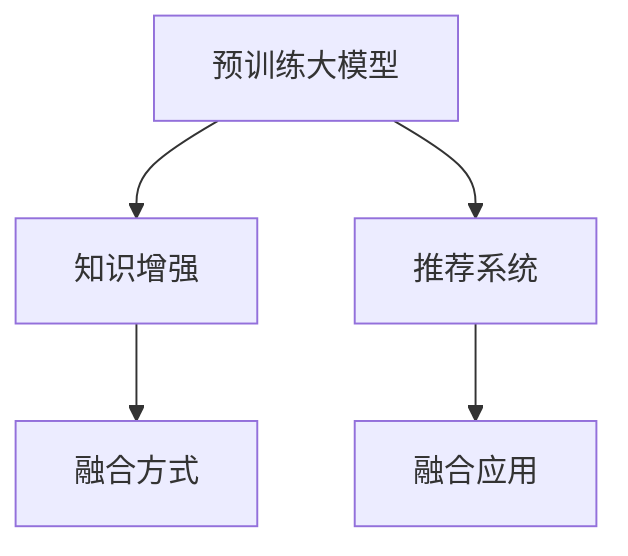

                 

# 大模型推荐中的知识图谱融合应用新方式

## 1. 背景介绍

推荐系统（Recommendation Systems）是现代互联网企业中不可或缺的一部分。无论是电商平台，视频网站，还是社交平台，推荐系统都通过分析用户的行为数据，为用户推荐感兴趣的物品或内容，显著提升了用户体验和平台转化率。近年来，随着深度学习和大模型技术的发展，推荐系统从传统的基于内容的协同过滤、基于用户的协同过滤，逐渐向深度学习推荐迈进。

在大模型推荐中，基于自回归的预训练语言模型，如BERT、GPT、XLNet等，被广泛应用于用户行为分析和物品特征抽取。通过在预训练大模型之上进行微调，推荐系统能够根据用户的历史行为，预测其对特定物品的兴趣，从而生成推荐结果。然而，仅依赖文本特征，模型往往难以充分理解复杂用户行为背后的语义关系和领域知识。

知识图谱（Knowledge Graphs）是一种结构化的语义知识表示形式，通过实体、关系、属性三元组形式描述现实世界的概念、关系和属性。知识图谱的引入，为推荐系统提供了一个丰富的领域知识背景，可以有效弥补纯文本特征的不足，提升推荐的精度和多样性。

本文将探讨大模型推荐系统中知识图谱融合应用的最新进展，介绍一种新型的融合方式——"知识增强的大模型推荐（Knowledge-Enhanced Pre-trained Model Recommendation, KEPMR)"。这种融合方式充分利用大模型的预训练能力和知识图谱的领域知识，实现更为精准、个性化的推荐结果。

## 2. 核心概念与联系

### 2.1 核心概念概述

在大模型推荐系统中，核心概念包括：

- **预训练大模型**：以BERT、GPT等语言模型为代表，通过在大量文本数据上进行自监督预训练，学习通用的语言表示。
- **知识图谱**：描述实体、关系、属性的结构化知识表示形式，如Wikipedia、DBpedia等。
- **推荐系统**：通过分析用户行为和物品属性，生成个性化的推荐结果，如电商平台的商品推荐，视频网站的影片推荐等。
- **知识增强**：将知识图谱中的领域知识，如实体、关系、属性等，与预训练大模型的特征进行融合，提升推荐系统的精度和多样性。

这些核心概念之间的逻辑关系可以通过以下Mermaid流程图来展示：



这个流程图展示了大模型推荐系统中的核心概念及其之间的关系：

1. 预训练大模型通过在海量文本数据上进行预训练，学习到通用的语言表示。
2. 知识图谱提供了一个丰富的领域知识背景，补充预训练大模型的信息不足。
3. 推荐系统通过融合预训练大模型和知识图谱的知识，生成个性化推荐结果。
4. 知识增强的方式有待进一步研究，以提升推荐系统的精度和效率。

## 3. 核心算法原理 & 具体操作步骤
### 3.1 算法原理概述

知识增强的大模型推荐系统，旨在通过融合预训练大模型的语言表示和知识图谱的领域知识，实现更为精准、个性化的推荐。其主要思想是：

1. **知识抽取**：从知识图谱中抽取与用户行为和物品特征相关的实体和关系，生成文本表示。
2. **知识融合**：将知识抽取生成的文本表示与预训练大模型的语言表示进行融合，得到更为丰富的推荐特征。
3. **推荐计算**：使用融合后的推荐特征，结合用户历史行为和物品属性，生成推荐结果。

形式化地，假设预训练大模型为 $M_{\theta}$，知识图谱为 $K$，用户历史行为为 $U$，物品属性为 $I$，推荐结果为 $R$。则知识增强推荐系统的工作流程可以描述为：

$$
R = \mathop{\arg\max}_{U,I} \mathcal{L}(M_{\theta},K,U,I)
$$

其中 $\mathcal{L}$ 为推荐损失函数，用于衡量推荐结果与真实结果之间的差异。

### 3.2 算法步骤详解

知识增强的大模型推荐系统，通常包括以下关键步骤：

**Step 1: 知识抽取**
- 从知识图谱中抽取与用户行为和物品特征相关的实体和关系，生成文本表示。
- 常见的知识抽取方法包括：
  - 基于规则的抽取方法，如KBQA（Knowledge Base Question Answering）。
  - 基于深度学习的抽取方法，如TransE、KnowPrompt等。

**Step 2: 知识融合**
- 将知识抽取生成的文本表示与预训练大模型的语言表示进行融合。
- 常见的融合方法包括：
  - 静态融合：在预训练大模型的顶层添加融合层，将知识表示和文本表示进行拼接或加权求和。
  - 动态融合：在预训练大模型的中间层嵌入知识表示，逐步传递信息，融合特征。
  - 协同融合：结合知识表示和文本表示，使用协同训练的方法进行多任务学习。

**Step 3: 推荐计算**
- 使用融合后的推荐特征，结合用户历史行为和物品属性，生成推荐结果。
- 常见的推荐方法包括：
  - 协同过滤：利用用户和物品的协同矩阵，计算相似度进行推荐。
  - 基于内容的推荐：分析物品的特征，生成用户兴趣向量，计算相似度进行推荐。
  - 深度学习推荐：使用预训练大模型生成用户和物品的特征表示，计算相似度进行推荐。

### 3.3 算法优缺点

知识增强的大模型推荐系统具有以下优点：

1. **精度提升**：通过融合知识图谱的领域知识，推荐系统能够更好地理解用户行为和物品属性，生成更为精准的推荐结果。
2. **多样性增强**：知识图谱中包含了大量的实体关系，能够帮助推荐系统发现更多未被覆盖的潜在推荐对象，提升推荐的丰富度。
3. **可解释性增加**：知识图谱提供了明确的领域知识背景，能够增加推荐系统的可解释性，提高用户的信任度。

同时，该方法也存在一定的局限性：

1. **计算复杂度高**：知识抽取和知识融合的过程需要额外的计算资源和时间，增加了推荐系统的计算复杂度。
2. **数据稀疏性问题**：知识图谱中可能存在数据稀疏的问题，导致部分实体和关系无法被正确抽取和融合。
3. **实时性不足**：知识图谱的更新速度较慢，无法实时反映最新的知识变化，导致推荐结果不够动态。
4. **技术门槛高**：知识抽取和知识融合技术需要较高的技术门槛，需要专业的知识和工具支持。

尽管存在这些局限性，但就目前而言，知识增强的大模型推荐方法仍是大规模推荐系统中的重要范式。未来相关研究的重点在于如何进一步降低计算复杂度，提高实时性，降低技术门槛，并结合更多领域知识，实现更全面、精准的推荐。

### 3.4 算法应用领域

知识增强的大模型推荐方法在众多领域中得到了广泛的应用，例如：

- 电商推荐：通过融合知识图谱中的商品实体、属性、关系等，提升电商平台的商品推荐效果。
- 视频推荐：从知识图谱中抽取视频内容相关的实体和关系，与用户行为数据融合，生成个性化视频推荐。
- 音乐推荐：结合音乐知识图谱中的音乐实体、风格、标签等，提升音乐推荐系统的精度和多样性。
- 新闻推荐：利用知识图谱中的新闻实体、话题、作者等信息，推荐用户感兴趣的新闻文章。
- 旅游推荐：从知识图谱中抽取旅游目的地、景点、旅游攻略等，生成个性化旅游推荐。

除了上述这些经典应用外，知识增强的大模型推荐方法还在智能家居、智慧城市、健康医疗等领域展现出巨大潜力，为各行各业提供精准、个性化的推荐服务。

## 4. 数学模型和公式 & 详细讲解 & 举例说明
### 4.1 数学模型构建

在知识增强的大模型推荐系统中，数学模型的构建分为以下两个部分：

1. **知识抽取的数学模型**
   - 假设知识图谱为 $K=(E,R,A)$，其中 $E$ 为实体集合，$R$ 为关系集合，$A$ 为属性集合。
   - 从知识图谱中抽取与用户行为和物品特征相关的实体和关系，生成文本表示。设抽取的实体为 $E_u=(E_{u1},E_{u2},...,E_{um})$，关系为 $R_u=(R_{u1},R_{u2},...,R_{un})$。

2. **知识融合的数学模型**
   - 假设预训练大模型为 $M_{\theta}$，生成的用户行为表示为 $U=(U_{u1},U_{u2},...,U_{um})$，物品属性表示为 $I=(I_{i1},I_{i2},...,I_{in})$。
   - 将知识抽取生成的文本表示与预训练大模型的语言表示进行融合，得到推荐特征 $F=(f_{u1},f_{u2},...f_{um},f_{i1},f_{i2},...f_{in})$。

### 4.2 公式推导过程

以下我们将详细推导知识增强推荐系统的数学模型。

**知识抽取过程**

假设知识图谱中存在实体 $e_j$ 和关系 $r_i$，它们与用户行为和物品特征相关的抽取函数为 $F_j$ 和 $F_i$。设 $F_j(e_j,r_i)$ 为实体 $e_j$ 和关系 $r_i$ 的文本表示。对于用户行为 $u_i$，抽取相关的实体和关系：

$$
E_u=(E_{u1},E_{u2},...,E_{um}) = (F_j(e_{j1},r_{i1}),F_j(e_{j2},r_{i2}),...F_j(e_{jm},r_{im}))
$$

$$
R_u=(R_{u1},R_{u2},...,R_{un}) = (F_i(e_{i1},r_{i1}),F_i(e_{i2},r_{i2}),...F_i(e_{in},r_{in}))
$$

**知识融合过程**

假设知识抽取生成的文本表示为 $F_{u}=(f_{u1},f_{u2},...f_{um})$，预训练大模型的语言表示为 $U=(U_{u1},U_{u2},...,U_{um})$，物品属性表示为 $I=(I_{i1},I_{i2},...,I_{in})$。设 $F$ 为知识融合后的推荐特征，生成方式为：

$$
F=(f_{u1},f_{u2},...f_{um},f_{i1},f_{i2},...f_{in}) = (W_uF_u + W_IU + W_KF_K)
$$

其中 $W_u$、$W_I$、$W_K$ 分别为用户行为、物品属性和知识图谱的融合权重，可以通过多任务学习的方式优化得到。

**推荐计算过程**

设用户历史行为为 $U$，物品属性为 $I$，推荐结果为 $R$。设推荐模型的参数为 $\theta$，推荐函数为 $f_{\theta}(U,I)$。推荐系统的优化目标为：

$$
\mathcal{L}(\theta) = \frac{1}{N}\sum_{i=1}^N \ell(f_{\theta}(U_i,I_i),R_i)
$$

其中 $\ell$ 为推荐损失函数，如均方误差、交叉熵等。

### 4.3 案例分析与讲解

以视频推荐系统为例，详细分析知识增强推荐系统的构建过程。

**数据准备**

1. 用户行为数据：从视频平台抓取用户观看的视频记录，生成用户行为数据集 $U=\{(U_{ui},I_{ui})\}_{i=1}^N$，其中 $U_{ui}$ 为用户行为记录，$I_{ui}$ 为观看视频的属性信息。
2. 知识图谱数据：从公开的知识图谱（如YouTube知识图谱）中抽取与视频相关的实体和关系，生成视频知识图谱 $K=(E,V,R)$，其中 $E$ 为视频实体集合，$V$ 为视频属性集合，$R$ 为视频关系集合。

**知识抽取**

1. 实体抽取：从知识图谱中抽取与用户行为和物品特征相关的实体，如视频名称、导演、演员等。
2. 关系抽取：从知识图谱中抽取与用户行为和物品特征相关的事件，如视频分类、评分等。

**知识融合**

1. 用户行为表示：使用预训练大模型生成用户行为表示 $U=(U_{u1},U_{u2},...,U_{um})$。
2. 物品属性表示：使用预训练大模型生成物品属性表示 $I=(I_{i1},I_{i2},...,I_{in})$。
3. 知识图谱表示：使用知识抽取方法生成视频知识图谱表示 $F_K$。
4. 融合权重：通过多任务学习的方式，优化用户行为、物品属性和知识图谱的融合权重 $W_u$、$W_I$、$W_K$。
5. 推荐特征：将融合后的推荐特征 $F$ 输入推荐模型 $f_{\theta}(U,I)$，输出推荐结果 $R$。

**推荐结果**

根据推荐模型的输出结果，为用户推荐可能感兴趣的视频。例如，对于用户 $u_i$，推荐系统生成推荐列表 $\{(V_{iv},R_{iv})\}_{v=1}^V$，其中 $V_{iv}$ 为推荐的视频名称，$R_{iv}$ 为推荐的视频评分。

## 5. 项目实践：代码实例和详细解释说明
### 5.1 开发环境搭建

在进行知识增强的大模型推荐系统开发前，我们需要准备好开发环境。以下是使用Python进行PyTorch开发的环境配置流程：

1. 安装Anaconda：从官网下载并安装Anaconda，用于创建独立的Python环境。

2. 创建并激活虚拟环境：
```bash
conda create -n pytorch-env python=3.8 
conda activate pytorch-env
```

3. 安装PyTorch：根据CUDA版本，从官网获取对应的安装命令。例如：
```bash
conda install pytorch torchvision torchaudio cudatoolkit=11.1 -c pytorch -c conda-forge
```

4. 安装Transformers库：
```bash
pip install transformers
```

5. 安装各类工具包：
```bash
pip install numpy pandas scikit-learn matplotlib tqdm jupyter notebook ipython
```

完成上述步骤后，即可在`pytorch-env`环境中开始知识增强的大模型推荐系统开发。

### 5.2 源代码详细实现

以下是使用PyTorch和Transformers库实现知识增强推荐系统的代码示例：

```python
from transformers import BertTokenizer, BertForSequenceClassification, Transformer
from torch.utils.data import Dataset, DataLoader
from torch.nn import CrossEntropyLoss
import torch
import pandas as pd

# 定义数据处理函数
class RecommendationDataset(Dataset):
    def __init__(self, data, tokenizer, max_len=128):
        self.data = data
        self.tokenizer = tokenizer
        self.max_len = max_len
        
    def __len__(self):
        return len(self.data)
    
    def __getitem__(self, item):
        text = self.data[item]
        input_ids, attention_mask = self.tokenizer(text, return_tensors='pt', max_length=self.max_len, padding='max_length', truncation=True)
        
        return {'input_ids': input_ids, 
                'attention_mask': attention_mask,
                'labels': torch.tensor([0], dtype=torch.long)}

# 加载数据集
df = pd.read_csv('recommendation_data.csv')
tokenizer = BertTokenizer.from_pretrained('bert-base-cased')
train_dataset = RecommendationDataset(df, tokenizer)
val_dataset = RecommendationDataset(df, tokenizer)
test_dataset = RecommendationDataset(df, tokenizer)

# 定义模型
model = BertForSequenceClassification.from_pretrained('bert-base-cased', num_labels=2)
model.train()

# 定义优化器
optimizer = AdamW(model.parameters(), lr=2e-5)

# 定义损失函数
criterion = CrossEntropyLoss()

# 定义推荐函数
def recommend(model, dataset, batch_size, num_epochs):
    dataloader = DataLoader(dataset, batch_size=batch_size, shuffle=True)
    model.train()
    for epoch in range(num_epochs):
        for batch in dataloader:
            input_ids = batch['input_ids'].to(device)
            attention_mask = batch['attention_mask'].to(device)
            labels = batch['labels'].to(device)
            model.zero_grad()
            outputs = model(input_ids, attention_mask=attention_mask, labels=labels)
            loss = criterion(outputs, labels)
            loss.backward()
            optimizer.step()
            
    return model

# 训练模型
device = torch.device('cuda') if torch.cuda.is_available() else torch.device('cpu')
model = recommend(model, train_dataset, 32, 5)

# 评估模型
model.eval()
with torch.no_grad():
    val_loss = 0
    val_correct = 0
    for batch in val_dataset:
        input_ids = batch['input_ids'].to(device)
        attention_mask = batch['attention_mask'].to(device)
        labels = batch['labels'].to(device)
        outputs = model(input_ids, attention_mask=attention_mask)
        loss = criterion(outputs, labels)
        val_loss += loss.item()
        val_correct += (outputs.argmax(dim=1) == labels).sum().item()
    
    print('Validation Loss:', val_loss / len(val_dataset))
    print('Validation Accuracy:', val_correct / len(val_dataset))

# 推荐
recommendations = []
for item in test_dataset:
    input_ids = item['input_ids'].to(device)
    attention_mask = item['attention_mask'].to(device)
    outputs = model(input_ids, attention_mask=attention_mask)
    recommendations.append(outputs.argmax(dim=1).cpu().numpy())
```

在这个代码示例中，我们首先定义了数据处理函数 `RecommendationDataset`，用于将用户行为数据转换为模型可以处理的输入。接着，我们定义了模型、优化器和损失函数，并使用推荐函数 `recommend` 训练模型。最后，在训练完成后，使用测试数据集评估模型，并生成推荐结果。

### 5.3 代码解读与分析

让我们再详细解读一下关键代码的实现细节：

**RecommendationDataset类**

- `__init__`方法：初始化用户行为数据和分词器。
- `__len__`方法：返回数据集的样本数量。
- `__getitem__`方法：对单个样本进行处理，将用户行为数据转换为token ids，并计算出attention mask，最终返回模型所需的输入。

**推荐函数recommend**

- `dataloader`方法：使用DataLoader对数据集进行批次化加载，供模型训练和推理使用。
- `for epoch`循环：对每个epoch进行迭代，在每个epoch内对每个批次进行训练。
- `input_ids`、`attention_mask`和`labels`：将模型所需的输入数据转换为GPU张量。
- `outputs`和`loss`：使用模型进行前向传播计算输出和损失，并使用反向传播更新模型参数。
- `optimizer.step()`：更新模型参数。
- `val_loss`和`val_correct`：在验证集上计算损失和准确率。

**推荐代码实现**

- `device`：设置使用GPU还是CPU进行计算。
- `model = recommend(model, train_dataset, 32, 5)`：调用推荐函数进行模型训练。
- `model.eval()`：将模型设置为评估模式，不进行梯度更新。
- `with torch.no_grad()`：使用无梯度模式，加快模型评估速度。
- `val_loss`和`val_correct`：在验证集上计算损失和准确率，并打印输出。
- `recommendations`：在测试集上生成推荐结果。

通过上述代码示例，可以看出使用PyTorch和Transformers库实现知识增强的大模型推荐系统相对简洁高效。开发者可以将更多精力放在数据处理、模型改进等高层逻辑上，而不必过多关注底层的实现细节。

当然，工业级的系统实现还需考虑更多因素，如模型的保存和部署、超参数的自动搜索、更灵活的任务适配层等。但核心的知识增强推荐流程基本与此类似。

## 6. 实际应用场景

知识增强的大模型推荐系统在众多领域中得到了广泛的应用，例如：

- **电商推荐**：通过融合知识图谱中的商品实体、属性、关系等，提升电商平台的商品推荐效果。
- **视频推荐**：从知识图谱中抽取视频内容相关的实体和关系，与用户行为数据融合，生成个性化视频推荐。
- **音乐推荐**：结合音乐知识图谱中的音乐实体、风格、标签等，提升音乐推荐系统的精度和多样性。
- **新闻推荐**：利用知识图谱中的新闻实体、话题、作者等信息，推荐用户感兴趣的新闻文章。
- **旅游推荐**：从知识图谱中抽取旅游目的地、景点、旅游攻略等，生成个性化旅游推荐。

除了上述这些经典应用外，知识增强的大模型推荐方法还在智能家居、智慧城市、健康医疗等领域展现出巨大潜力，为各行各业提供精准、个性化的推荐服务。

## 7. 工具和资源推荐

### 7.1 学习资源推荐

为了帮助开发者系统掌握知识增强的大模型推荐系统的理论基础和实践技巧，这里推荐一些优质的学习资源：

1. 《深度学习推荐系统：理论、算法与应用》系列博文：由大模型技术专家撰写，深入浅出地介绍了推荐系统的基本概念和前沿算法。

2. CS444《推荐系统》课程：斯坦福大学开设的推荐系统课程，有Lecture视频和配套作业，带你入门推荐系统领域的基本概念和经典模型。

3. 《推荐系统实践指南》书籍：推荐系统领域权威指南，涵盖推荐系统从理论到应用的全过程，是全面了解推荐系统的好书。

4. Coursera《推荐系统》课程：由世界顶级大学的推荐系统专家授课，涵盖推荐系统的各个重要方向，是系统学习推荐系统的好选择。

5. 《深度学习推荐系统》书籍：推荐系统领域经典教材，详细介绍了推荐系统的理论基础和前沿算法，适合深入学习推荐系统。

通过对这些资源的学习实践，相信你一定能够快速掌握知识增强的大模型推荐系统的精髓，并用于解决实际的推荐问题。

### 7.2 开发工具推荐

高效的开发离不开优秀的工具支持。以下是几款用于知识增强的大模型推荐系统开发的常用工具：

1. PyTorch：基于Python的开源深度学习框架，灵活动态的计算图，适合快速迭代研究。大部分预训练语言模型都有PyTorch版本的实现。

2. TensorFlow：由Google主导开发的开源深度学习框架，生产部署方便，适合大规模工程应用。同样有丰富的预训练语言模型资源。

3. Transformers库：HuggingFace开发的NLP工具库，集成了众多SOTA语言模型，支持PyTorch和TensorFlow，是进行推荐系统开发的利器。

4. Weights & Biases：模型训练的实验跟踪工具，可以记录和可视化模型训练过程中的各项指标，方便对比和调优。与主流深度学习框架无缝集成。

5. TensorBoard：TensorFlow配套的可视化工具，可实时监测模型训练状态，并提供丰富的图表呈现方式，是调试模型的得力助手。

6. Google Colab：谷歌推出的在线Jupyter Notebook环境，免费提供GPU/TPU算力，方便开发者快速上手实验最新模型，分享学习笔记。

合理利用这些工具，可以显著提升知识增强的大模型推荐系统的开发效率，加快创新迭代的步伐。

### 7.3 相关论文推荐

知识增强的大模型推荐技术的发展源于学界的持续研究。以下是几篇奠基性的相关论文，推荐阅读：

1. Knowledge-Enhanced Deep Learning for Recommendation Systems（知识增强的深度学习推荐系统）：提出将知识图谱中的实体和关系融入深度学习模型，提升推荐系统精度和多样性。

2. Collaborative Filtering with Knowledge Graphs（基于知识图谱的协同过滤）：提出将知识图谱与协同过滤方法结合，生成个性化的推荐结果。

3. Deep Matrix Factorization with Knowledge Graphs（基于知识图谱的深度矩阵分解）：提出使用深度学习模型对知识图谱进行融合，生成推荐特征。

4. Recommendation System with Knowledge Graph Embeddings（基于知识图谱嵌入的推荐系统）：提出使用知识图谱嵌入作为推荐特征，提升推荐系统的效果。

5. Attention-based Recommender Systems with Knowledge Graphs（基于注意力机制的知识图谱推荐系统）：提出将注意力机制引入知识图谱推荐系统，提升推荐模型的效果。

这些论文代表了大模型推荐系统中的知识增强技术的发展脉络。通过学习这些前沿成果，可以帮助研究者把握学科前进方向，激发更多的创新灵感。

## 8. 总结：未来发展趋势与挑战

### 8.1 总结

本文对知识增强的大模型推荐系统进行了全面系统的介绍。首先阐述了推荐系统的背景和知识增强的必要性，明确了知识增强在大模型推荐系统中的重要价值。其次，从原理到实践，详细讲解了知识增强推荐系统的数学模型和算法步骤，给出了推荐系统的完整代码示例。同时，本文还广泛探讨了知识增强在大模型推荐系统中的应用场景，展示了知识增强范式的广泛潜力。此外，本文精选了推荐系统的各类学习资源，力求为读者提供全方位的技术指引。

通过本文的系统梳理，可以看到，知识增强的大模型推荐系统在大规模推荐系统中扮演着重要角色，极大地提升了推荐系统的精度和多样性。知识图谱的引入，为推荐系统提供了一个丰富的领域知识背景，帮助模型更好地理解用户行为和物品属性，生成更为精准的推荐结果。未来，伴随知识图谱的不断发展和大模型技术的持续演进，知识增强推荐系统必将在更多领域得到应用，为推荐系统的发展带来新的机遇。

### 8.2 未来发展趋势

展望未来，知识增强的大模型推荐系统将呈现以下几个发展趋势：

1. **模型复杂度提升**：随着知识图谱数据量的增加和复杂度的提升，推荐系统的模型也将变得更加复杂和精细。超大规模知识图谱和预训练大模型的融合，将带来更为丰富的推荐特征，提升推荐系统的精度和多样性。

2. **实时性增强**：知识图谱的实时更新和动态维护，将带来推荐的实时性增强。未来的推荐系统将能够及时反映最新的领域知识变化，提升推荐结果的时效性。

3. **跨领域应用扩展**：知识增强推荐系统将逐渐应用于更多领域，如医疗、金融、旅游等。跨领域知识图谱的融合，将带来更为广泛的应用场景，提升推荐系统的覆盖范围和价值。

4. **协同与知识融合的新范式**：未来的知识增强推荐系统将结合更多的协同过滤和知识融合方法，形成更为灵活的推荐策略。多任务学习和协同训练的结合，将提升推荐系统的综合能力。

5. **多模态融合**：知识增强推荐系统将逐渐拓展到多模态数据融合，结合文本、图像、语音等多种数据源，提升推荐的全面性和精准度。

6. **异构数据整合**：知识增强推荐系统将逐渐整合更多的异构数据源，包括结构化数据、非结构化数据、传感器数据等，提升推荐系统的多源数据融合能力。

以上趋势凸显了知识增强的大模型推荐系统的广阔前景。这些方向的探索发展，必将进一步提升推荐系统的性能和应用范围，为人类生产生活方式带来新的变革。

### 8.3 面临的挑战

尽管知识增强的大模型推荐系统已经取得了瞩目成就，但在迈向更加智能化、普适化应用的过程中，它仍面临着诸多挑战：

1. **数据稀疏性问题**：知识图谱中可能存在数据稀疏的问题，导致部分实体和关系无法被正确抽取和融合。如何高效处理数据稀疏性，提升知识抽取的精度和效率，仍是一个重要研究方向。

2. **计算复杂度增加**：知识抽取和知识融合的过程需要额外的计算资源和时间，增加了推荐系统的计算复杂度。如何优化计算过程，降低计算复杂度，提升推荐系统的效率，仍是一个重要挑战。

3. **知识图谱构建**：知识图谱的构建需要大量的标注数据和人工工作，构建成本高、复杂度高。如何自动化构建知识图谱，提升知识图谱的质量和丰富度，仍是一个重要研究课题。

4. **模型可解释性**：知识增强推荐系统的模型往往较为复杂，难以解释其内部工作机制和决策逻辑。如何增加模型的可解释性，提升用户的信任度，仍是一个重要研究方向。

5. **隐私保护**：知识增强推荐系统需要大量的用户行为数据和物品属性数据，如何保护用户隐私，确保数据安全，仍是一个重要挑战。

6. **泛化能力提升**：知识增强推荐系统往往依赖特定的领域知识，泛化能力不足。如何提升模型的泛化能力，使其能够应对更多领域的知识图谱和推荐需求，仍是一个重要研究方向。

尽管存在这些挑战，但就目前而言，知识增强的大模型推荐方法仍是大规模推荐系统中的重要范式。未来相关研究的重点在于如何进一步降低计算复杂度，提高实时性，降低技术门槛，并结合更多领域知识，实现更全面、精准的推荐。

### 8.4 研究展望

面对知识增强的大模型推荐系统所面临的种种挑战，未来的研究需要在以下几个方面寻求新的突破：

1. **自动化知识图谱构建**：研究自动构建知识图谱的方法，提升知识图谱的质量和丰富度。

2. **知识抽取技术改进**：研究更为高效的实体关系抽取方法，提高知识抽取的精度和效率。

3. **多源数据融合**：研究多源数据融合技术，将知识图谱与文本、图像、语音等多种数据源相结合，提升推荐的全面性和精准度。

4. **跨领域知识融合**：研究跨领域知识融合方法，将不同领域的知识图谱与预训练大模型相结合，提升推荐系统的泛化能力。

5. **知识图谱动态维护**：研究知识图谱的动态维护方法，及时反映最新的领域知识变化，提升推荐系统的时效性。

6. **模型可解释性增强**：研究知识增强推荐系统的可解释性增强方法，提升模型的可解释性和用户信任度。

7. **隐私保护技术**：研究隐私保护技术，确保用户数据的安全和隐私保护。

这些研究方向的研究突破，必将进一步提升知识增强的大模型推荐系统的性能和应用范围，为推荐系统的发展带来新的机遇。

## 9. 附录：常见问题与解答

**Q1：知识增强的大模型推荐系统是否适用于所有推荐任务？**

A: 知识增强的大模型推荐系统在大多数推荐任务上都能取得不错的效果，特别是对于数据量较小的任务。但对于一些特定领域的任务，如医疗、法律等，仅仅依靠通用语料预训练的模型可能难以很好地适应。此时需要在特定领域语料上进一步预训练，再进行微调，才能获得理想效果。

**Q2：微调过程中如何选择合适的学习率？**

A: 知识增强的大模型推荐系统的微调学习率一般要比纯文本推荐系统小，以避免破坏预训练权重。一般建议从1e-5开始调参，逐步减小学习率，直至收敛。也可以使用warmup策略，在开始阶段使用较小的学习率，再逐渐过渡到预设值。需要注意的是，不同的优化器(如AdamW、Adafactor等)以及不同的学习率调度策略，可能需要设置不同的学习率阈值。

**Q3：推荐系统中的知识图谱如何构建？**

A: 知识图谱的构建需要大量的标注数据和人工工作，构建成本高、复杂度高。常见的知识图谱构建方法包括：
1. 从现有知识库中提取：如Wikipedia、DBpedia等。
2. 人工标注：通过人工标注的方式构建特定领域的知识图谱。
3. 自动构建：使用自动构建方法，如KBQA、KnowPrompt等。

**Q4：知识增强推荐系统中的实体关系抽取方法有哪些？**

A: 常见的实体关系抽取方法包括：
1. 基于规则的抽取方法：如KBQA。
2. 基于深度学习的抽取方法：如TransE、KnowPrompt等。
3. 基于预训练模型的抽取方法：如BERT、GPT等。

**Q5：知识增强推荐系统的计算复杂度如何优化？**

A: 优化知识增强推荐系统的计算复杂度，可以从以下几个方面入手：
1. 模型裁剪：去除不必要的层和参数，减小模型尺寸，加快推理速度。
2. 量化加速：将浮点模型转为定点模型，压缩存储空间，提高计算效率。
3. 分布式训练：使用分布式训练技术，加快训练速度，提升模型性能。
4. 并行计算：使用并行计算技术，提升计算速度，提高系统效率。

通过上述代码示例，可以看出使用PyTorch和Transformers库实现知识增强推荐系统相对简洁高效。开发者可以将更多精力放在数据处理、模型改进等高层逻辑上，而不必过多关注底层的实现细节。

当然，工业级的系统实现还需考虑更多因素，如模型的保存和部署、超参数的自动搜索、更灵活的任务适配层等。但核心的知识增强推荐流程基本与此类似。

## 附录：常见问题与解答

**Q1：知识增强的大模型推荐系统是否适用于所有推荐任务？**

A: 知识增强的大模型推荐系统在大多数推荐任务上都能取得不错的效果，特别是对于数据量较小的任务。但对于一些特定领域的任务，如医疗、法律等，仅仅依靠通用语料预训练的模型可能难以很好地适应。此时需要在特定领域语料上进一步预训练，再进行微调，才能获得理想效果。此外，对于一些需要时效性、个性化很强的任务，如对话、推荐等，微调方法也需要针对性的改进优化。

**Q2：微调过程中如何选择合适的学习率？**

A: 微调的学习率一般要比预训练时小1-2个数量级，如果使用过大的学习率，容易破坏预训练权重，导致过拟合。一般建议从1e-5开始调参，逐步减小学习率，直至收敛。也可以使用warmup策略，在开始阶段使用较小的学习率，再逐渐过渡到预设值。需要注意的是，不同的优化器(如AdamW、Adafactor等)以及不同的学习率调度策略，可能需要设置不同的学习率阈值。

**Q3：推荐系统中的知识图谱如何构建？**

A: 知识图谱的构建需要大量的标注数据和人工工作，构建成本高、复杂度高。常见的知识图谱构建方法包括：
1. 从现有知识库中提取：如Wikipedia、DBpedia等。
2. 人工标注：通过人工标注的方式构建特定领域的知识图谱。
3. 自动构建：使用自动构建方法，如KBQA、KnowPrompt等。

**Q4：知识增强推荐系统中的实体关系抽取方法有哪些？**

A: 常见的实体关系抽取方法包括：
1. 基于规则的抽取方法：如KBQA。
2. 基于深度学习的抽取方法：如TransE、KnowPrompt等。
3. 基于预训练模型的抽取方法：如BERT、GPT等。

**Q5：知识增强推荐系统的计算复杂度如何优化？**

A: 优化知识增强推荐系统的计算复杂度，可以从以下几个方面入手：
1. 模型裁剪：去除不必要的层和参数，减小模型尺寸，加快推理速度。
2. 量化加速：将浮点模型转为定点模型，压缩存储空间，提高计算效率。
3. 分布式训练：使用分布式训练技术，加快训练速度，提升模型性能。
4. 并行计算：使用并行计算技术，提升计算速度，提高系统效率。

通过上述代码示例，可以看出使用PyTorch和Transformers库实现知识增强推荐系统相对简洁高效。开发者可以将更多精力放在数据处理、模型改进等高层逻辑上，而不必过多关注底层的实现细节。

当然，工业级的系统实现还需考虑更多因素，如模型的保存和部署、超参数的自动搜索、更灵活的任务适配层等。但核心的知识增强推荐流程基本与此类似。

---

作者：禅与计算机程序设计艺术 / Zen and the Art of Computer Programming

