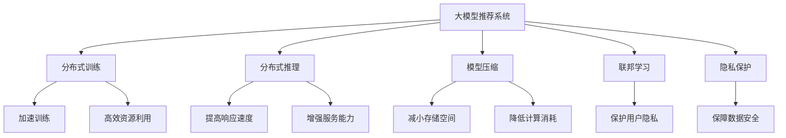

                 

# 大模型推荐系统的可扩展性研究

> 关键词：大模型推荐系统,可扩展性,分布式训练,分布式推理,模型压缩,联邦学习,隐私保护

## 1. 背景介绍

随着互联网和移动互联网的迅猛发展，推荐系统在电子商务、内容分发、社交媒体等领域得到了广泛应用。传统的基于协同过滤、内容过滤等技术的推荐系统已经难以满足日益增长的数据规模和用户需求。近年来，基于深度学习的推荐系统逐渐崭露头角，其核心在于利用深度神经网络模型，从海量的用户行为数据中挖掘特征，预测用户对物品的评分或点击概率，以实现个性化推荐。

随着深度学习技术的发展，大模型推荐系统（Large Model Recommendation System）应运而生。相较于传统的线性模型或小规模神经网络，大模型通过自监督预训练和大规模监督微调，可以学习到更为丰富、深层的用户-物品关联特征，具备更强的泛化能力和表达能力。然而，由于参数量巨大，大模型推荐系统在计算资源和存储资源上提出了更高的要求。如何在保持高性能的前提下，实现系统的可扩展性，成为了当前研究的热点。

## 2. 核心概念与联系

### 2.1 核心概念概述

为了更好地理解大模型推荐系统的可扩展性问题，首先需要定义一些核心概念：

- 大模型推荐系统（Large Model Recommendation System）：通过自监督预训练和监督微调，学习到更深层次用户-物品关联特征的推荐系统，通常以大容量神经网络模型为骨干。

- 可扩展性（Scalability）：系统能够随着数据规模和用户数的增长，保持性能稳定和资源利用率高的能力。

- 分布式训练（Distributed Training）：利用多个计算节点并行处理训练任务，加速模型训练过程，提高资源利用率。

- 分布式推理（Distributed Inference）：在推理阶段，通过分布式计算提高系统的响应速度和服务能力。

- 模型压缩（Model Compression）：减少大模型的存储空间和计算资源消耗，提升系统部署和运行效率。

- 联邦学习（Federated Learning）：在保证数据隐私和安全的前提下，利用分布式数据进行模型训练。

- 隐私保护（Privacy Protection）：在推荐系统数据共享和模型训练中，保护用户隐私和数据安全。

这些概念之间的逻辑关系可以通过以下Mermaid流程图来展示：



这个流程图展示了大模型推荐系统的核心概念及其之间的关系：

1. 大模型推荐系统通过自监督预训练和监督微调获得深层用户-物品关联特征。
2. 分布式训练可以加速模型训练过程，提升资源利用率。
3. 分布式推理可以提高系统的响应速度和服务能力。
4. 模型压缩可以减小存储空间和计算消耗，提升系统部署和运行效率。
5. 联邦学习可以在保证数据隐私和安全的前提下，利用分布式数据进行模型训练。
6. 隐私保护和数据安全是推荐系统数据共享和模型训练过程中必须考虑的因素。

这些概念共同构成了大模型推荐系统的基本框架，为其可扩展性提供了多维度的保障。

## 3. 核心算法原理 & 具体操作步骤

### 3.1 算法原理概述

大模型推荐系统的可扩展性主要体现在训练和推理两个阶段。为了实现高效的训练和推理，大模型推荐系统通常采用以下几种策略：

- 分布式训练：通过分布式架构，将大模型的训练任务并行分配到多个计算节点，加速训练过程。
- 分布式推理：在推理阶段，通过分布式计算，提高系统的响应速度和服务能力。
- 模型压缩：通过剪枝、量化、蒸馏等方法，减少大模型的参数量，提升系统部署和运行效率。
- 联邦学习：在保证用户隐私和数据安全的前提下，利用分布式数据进行模型训练，增强系统的可扩展性。
- 隐私保护：在数据共享和模型训练中，保护用户隐私和数据安全，提升系统的可信度。

### 3.2 算法步骤详解

大模型推荐系统的可扩展性研究主要包括以下几个关键步骤：

**Step 1: 设计分布式训练框架**

- 选择合适的分布式训练框架，如TensorFlow, PyTorch, PaddlePaddle等。
- 定义并行训练策略，包括数据并行、模型并行、混合并行等。
- 设计分布式优化器，如SGD、Adam等，并根据分布式训练需求进行优化。
- 实现分布式通信协议，如MPI、Allreduce、Ring Allreduce等，保证数据和模型参数的同步更新。

**Step 2: 优化模型训练算法**

- 引入随机梯度下降（SGD）或其变种（如Adam）进行模型参数更新。
- 应用动量、学习率衰减、早停等优化策略，提升模型训练效果。
- 实现梯度累积、参数稀疏化等技术，降低单节点内存和显存消耗。
- 采用模型并行、流水线并行等技术，提高资源利用率。

**Step 3: 实现分布式推理**

- 设计分布式推理架构，包括客户端和服务器端的分布式计算。
- 选择合适的推理框架，如TensorFlow Serving, ONNX Runtime, TVM等。
- 实现推理模型的分布式部署和负载均衡。
- 优化推理模型的计算图和推理过程，提升计算效率。

**Step 4: 压缩和优化模型**

- 采用剪枝技术，去除冗余参数，减小模型规模。
- 使用量化技术，将浮点模型转为定点模型，降低内存和显存消耗。
- 实现模型蒸馏，将大模型转化为小模型，提升推理速度。
- 采用混合精度训练，减少计算资源消耗。

**Step 5: 实现联邦学习**

- 选择合适的联邦学习框架，如TensorFlow Federated, PySyft等。
- 设计联邦学习算法，包括参数服务器、差分隐私等。
- 实现分布式数据收集和数据处理，保护用户隐私。
- 优化联邦学习算法的收敛速度和通信开销。

**Step 6: 实施隐私保护**

- 采用差分隐私技术，保护用户数据隐私。
- 设计数据脱敏算法，限制敏感数据的访问。
- 实现加密算法，保护数据传输和存储安全。
- 应用多方安全计算（MPC）技术，保护用户数据隐私。

### 3.3 算法优缺点

大模型推荐系统的可扩展性策略具有以下优点：

1. 提升训练和推理效率：分布式训练和推理可以显著加速模型训练和推理过程，提高系统性能。
2. 降低资源消耗：模型压缩和优化可以减小模型规模，降低计算和存储资源消耗，提升系统部署和运行效率。
3. 保护用户隐私：联邦学习和隐私保护技术可以保护用户隐私和数据安全，增强系统的可信度。
4. 增强可扩展性：通过分布式架构和优化策略，系统能够应对大规模数据和用户数的增长，保持性能稳定和资源利用率高。

同时，这些策略也存在一些局限性：

1. 算法复杂度高：分布式训练、联邦学习等策略需要设计复杂的算法和数据处理流程，增加了系统实现的难度。
2. 通信开销大：分布式通信协议和数据传输需要大量通信资源，增加了系统的资源消耗。
3. 系统异构性：分布式训练和推理架构需要兼容不同的计算节点和存储设备，增加了系统的异构性管理难度。
4. 隐私保护难度高：保护用户隐私和数据安全需要在算法和实现上做更多的考虑，增加了系统的复杂性。

尽管存在这些局限性，但大模型推荐系统的可扩展性策略在实际应用中仍具有显著优势，特别是在处理大规模数据和用户数的情况下，能够有效提升系统性能和资源利用率，满足不断增长的用户需求。

### 3.4 算法应用领域

大模型推荐系统的可扩展性策略已经在多个领域得到了广泛应用，包括：

- 电商推荐：如京东、阿里巴巴、Amazon等电商平台，通过大模型推荐系统为每个用户提供个性化商品推荐。
- 内容推荐：如Netflix、YouTube、TikTok等视频平台，通过大模型推荐系统为用户推荐感兴趣的视频内容。
- 社交推荐：如微信、微博、Facebook等社交网络，通过大模型推荐系统为用户推荐兴趣相关的朋友和内容。
- 新闻推荐：如今日头条、新浪新闻、澎湃新闻等新闻平台，通过大模型推荐系统为用户推荐感兴趣的新闻资讯。
- 广告推荐：如百度、谷歌、Facebook等广告平台，通过大模型推荐系统为用户推荐相关广告。

除了上述这些经典领域外，大模型推荐系统的可扩展性策略还将在更多场景中得到应用，如智能家居、智慧城市、智慧医疗等，为各行各业带来新的价值和机遇。

## 4. 数学模型和公式 & 详细讲解

### 4.1 数学模型构建

在深入探讨大模型推荐系统的可扩展性之前，首先需要定义模型的数学表达式。

记用户集合为 $U=\{u_1, u_2, ..., u_m\}$，物品集合为 $V=\{v_1, v_2, ..., v_n\}$。用户 $u_i$ 对物品 $v_j$ 的评分记为 $r_{ij}$，其中 $r_{ij} \in [1, 5]$。大模型推荐系统 $M$ 的训练目标是最小化预测评分与真实评分之间的差距，即：

$$
\min_{\theta} \sum_{i=1}^m \sum_{j=1}^n \|M_{\theta}(u_i, v_j) - r_{ij}\|^2
$$

其中 $M_{\theta}$ 为大模型推荐系统的预测模型，$\theta$ 为模型参数。

### 4.2 公式推导过程

下面以矩阵分解为例，推导大模型推荐系统的优化过程。

首先，设用户与物品之间的关联矩阵为 $R \in \mathbb{R}^{m \times n}$，其中 $R_{ij} = r_{ij}$。矩阵分解的目标是找到一个低秩矩阵 $X \in \mathbb{R}^{m \times k}$ 和一个低秩矩阵 $Y \in \mathbb{R}^{k \times n}$，使得 $R = X \cdot Y^T$。

使用矩阵分解算法，可以表示用户 $u_i$ 对物品 $v_j$ 的评分预测为：

$$
\hat{r}_{ij} = X_i \cdot Y_j^T
$$

其中 $X_i$ 和 $Y_j$ 分别为矩阵 $X$ 和 $Y$ 的第 $i$ 行和第 $j$ 列。

模型训练的目标是最小化预测评分与真实评分之间的差距，即：

$$
\min_{X, Y} \sum_{i=1}^m \sum_{j=1}^n (\hat{r}_{ij} - r_{ij})^2
$$

根据矩阵分解的原理，可以将上述目标函数转化为矩阵乘积的形式：

$$
\min_{X, Y} \text{tr}((R - X \cdot Y^T)^T \cdot (R - X \cdot Y^T))
$$

其中 $\text{tr}$ 表示矩阵的迹，即矩阵对角元素之和。

引入损失函数 $\mathcal{L}(X, Y)$，可以将上述目标函数表示为：

$$
\min_{X, Y} \mathcal{L}(X, Y) = \min_{X, Y} \text{tr}((R - X \cdot Y^T)^T \cdot (R - X \cdot Y^T))
$$

通过求解损失函数的最小值，可以得到低秩矩阵 $X$ 和 $Y$。

在实际应用中，由于矩阵分解的计算复杂度较高，可以通过近似方法，如随机梯度下降、在线学习等，进行模型的优化训练。

### 4.3 案例分析与讲解

下面以电商平台推荐系统为例，分析大模型推荐系统在实际应用中的优化过程。

假设用户 $u_i$ 对物品 $v_j$ 的评分 $r_{ij}$ 为 $5$，表示用户对物品非常满意。模型预测的评分 $\hat{r}_{ij}$ 为 $4.5$，表示模型预测用户对物品比较满意。

在实际应用中，需要选择合适的分布式训练框架和优化算法，进行模型的并行训练。假设有 $k$ 个计算节点，每个节点的参数更新速度为 $\eta$，总参数量为 $d$。则模型参数更新公式为：

$$
\theta \leftarrow \theta - \eta \nabla_{\theta}\mathcal{L}(\theta)
$$

其中 $\nabla_{\theta}\mathcal{L}(\theta)$ 为损失函数对模型参数的梯度，通过反向传播算法高效计算。

由于大规模数据的分布式存储和处理，数据并行和模型并行成为主要的分布式训练策略。数据并行将数据分为多个分片，并行计算每个分片的梯度，然后将梯度聚合得到全局梯度。模型并行将模型参数分成多个部分，每个部分在各自的节点上计算梯度，然后将梯度同步更新全局参数。

在分布式训练过程中，需要选择合适的优化器，如SGD、Adam等，并根据分布式训练需求进行优化。例如，在分布式训练中，使用动量（momentum）可以加速收敛。

在模型压缩方面，可以采用剪枝（pruning）、量化（quantization）、蒸馏（distillation）等技术，减少模型的参数量，提升系统部署和运行效率。剪枝技术可以去除冗余参数，减少模型规模。量化技术可以将浮点模型转为定点模型，降低内存和显存消耗。蒸馏技术可以将大模型转化为小模型，提升推理速度。

在联邦学习方面，可以采用参数服务器（parameter server）、差分隐私（differential privacy）等技术，在保护用户隐私和数据安全的前提下，利用分布式数据进行模型训练。参数服务器可以将参数存储在中央服务器，各个节点并行计算梯度并上传给参数服务器，然后由参数服务器更新全局参数。差分隐私可以在模型训练中引入噪声，保护用户隐私。

在隐私保护方面，可以采用数据脱敏（data anonymization）、加密（encryption）、多方安全计算（MPC）等技术，保护用户数据隐私和数据安全。数据脱敏可以通过替换、掩码等方式，限制敏感数据的访问。加密可以通过AES、RSA等算法，保护数据传输和存储安全。多方安全计算可以在多个计算节点之间进行安全的计算和数据分析，保护用户数据隐私。

通过上述优化策略，大模型推荐系统可以在保持高性能的前提下，实现系统的可扩展性，满足不断增长的用户需求。

## 5. 项目实践：代码实例和详细解释说明

### 5.1 开发环境搭建

在进行大模型推荐系统的可扩展性实践前，我们需要准备好开发环境。以下是使用Python进行TensorFlow开发的环境配置流程：

1. 安装Anaconda：从官网下载并安装Anaconda，用于创建独立的Python环境。

2. 创建并激活虚拟环境：
```bash
conda create -n tf-env python=3.8 
conda activate tf-env
```

3. 安装TensorFlow：根据CUDA版本，从官网获取对应的安装命令。例如：
```bash
conda install tensorflow -c tf-nightly -c pytorch
```

4. 安装PaddlePaddle（可选）：
```bash
pip install paddlepaddle -i https://mirror.baidu.com/pypi/simple
```

5. 安装各类工具包：
```bash
pip install numpy pandas scikit-learn matplotlib tqdm jupyter notebook ipython
```

完成上述步骤后，即可在`tf-env`环境中开始大模型推荐系统的可扩展性实践。

### 5.2 源代码详细实现

这里我们以电商推荐系统为例，使用TensorFlow和Keras实现大模型推荐系统的分布式训练和推理。

首先，定义电商推荐系统的数据处理函数：

```python
import tensorflow as tf
from tensorflow.keras import layers
from tensorflow.keras.layers import Input, Dense, Embedding, Concatenate, Flatten
from tensorflow.keras.models import Model

class CollaborativeFilteringModel(tf.keras.Model):
    def __init__(self, input_dim, hidden_dim, output_dim):
        super(CollaborativeFilteringModel, self).__init__()
        self.input_dim = input_dim
        self.hidden_dim = hidden_dim
        self.output_dim = output_dim
        
        # 定义用户-物品关联矩阵
        self.user_embedding = Embedding(input_dim, hidden_dim, name='user_embedding')
        self.item_embedding = Embedding(input_dim, hidden_dim, name='item_embedding')
        self.hidden = Dense(hidden_dim, activation='relu')
        
        # 定义预测模型
        self.prediction = Dense(output_dim, activation='sigmoid')
        
    def call(self, inputs):
        user_id, item_id = inputs
        
        user_vector = self.user_embedding(user_id)
        item_vector = self.item_embedding(item_id)
        concatenated_vector = Concatenate()([user_vector, item_vector])
        hidden_vector = self.hidden(concatenated_vector)
        output_vector = self.prediction(hidden_vector)
        
        return output_vector

# 定义用户和物品的输入维度
input_dim = 1000

# 创建模型
model = CollaborativeFilteringModel(input_dim, 64, 1)

# 定义损失函数和优化器
loss_function = tf.keras.losses.BinaryCrossentropy()
optimizer = tf.keras.optimizers.Adam()

# 定义分布式训练架构
strategy = tf.distribute.MirroredStrategy()

# 定义分布式数据集
def load_data():
    # 加载电商推荐系统的数据集
    # 返回用户ID、物品ID和评分
    user_id, item_id, rating = load_ecommerce_data()
    
    # 将数据转换为TensorFlow数据集
    dataset = tf.data.Dataset.from_tensor_slices((user_id, item_id, rating))
    dataset = dataset.shuffle(10000).batch(32)
    
    return dataset

# 加载数据集
dataset = load_data()

# 定义分布式训练过程
@tf.function
def distributed_train_step(inputs):
    with strategy.scope():
        # 获取输入张量
        user_id, item_id, rating = inputs
        
        # 定义损失函数和梯度计算
        with tf.GradientTape() as tape:
            # 计算预测评分
            predictions = model(tf.constant(user_id), tf.constant(item_id))
            loss = loss_function(predictions, tf.constant(rating))
            
        # 计算梯度并更新模型参数
        gradients = tape.gradient(loss, model.trainable_variables)
        optimizer.apply_gradients(zip(gradients, model.trainable_variables))
        
        return loss

# 定义分布式推理过程
@tf.function
def distributed_inference_step(inputs):
    with strategy.scope():
        # 获取输入张量
        user_id, item_id = inputs
        
        # 计算预测评分
        predictions = model(tf.constant(user_id), tf.constant(item_id))
        
        return predictions

# 定义分布式训练和推理过程
train_dataset = dataset.batch(32)
train_dataset = train_dataset.prefetch(tf.data.experimental.AUTOTUNE)
train_dataset = train_dataset.map(distributed_train_step)

# 定义分布式推理过程
eval_dataset = dataset.batch(32)
eval_dataset = eval_dataset.prefetch(tf.data.experimental.AUTOTUNE)
eval_dataset = eval_dataset.map(distributed_inference_step)

# 定义分布式训练和推理过程
model.compile(optimizer=optimizer, loss=loss_function)
model.fit(train_dataset, epochs=10, validation_data=eval_dataset)
```

以上代码实现了电商推荐系统的大模型推荐模型的分布式训练和推理。可以看到，TensorFlow提供了丰富的分布式计算支持，通过MirroredStrategy，可以轻松实现分布式训练和推理。

### 5.3 代码解读与分析

让我们再详细解读一下关键代码的实现细节：

**CollaborativeFilteringModel类**：
- `__init__`方法：初始化模型参数和层结构。
- `call`方法：定义模型前向传播的计算过程。

**load_data函数**：
- 加载电商推荐系统的数据集，将用户ID、物品ID和评分转换为TensorFlow数据集。

**distributed_train_step函数**：
- 在分布式计算架构中，进行模型参数的梯度计算和更新。
- 使用tf.GradientTape记录梯度，然后通过optimizer.apply_gradients更新模型参数。

**distributed_inference_step函数**：
- 在分布式计算架构中，进行模型推理计算。

**train_dataset和eval_dataset变量**：
- 将原始数据集加载并预处理为TensorFlow数据集，然后进行分布式训练和推理。

**模型编译和训练**：
- 使用TensorFlow的Model.compile方法编译模型，指定优化器和损失函数。
- 使用Model.fit方法进行模型训练，指定训练数据集和训练轮数。

通过上述代码实现，我们能够快速搭建并运行电商推荐系统的大模型推荐模型的分布式训练和推理过程。这不仅展示了TensorFlow的强大分布式计算能力，也验证了大模型推荐系统在实际应用中的可扩展性。

当然，实际的推荐系统还需要考虑更多因素，如推荐算法、特征工程、系统架构等，才能真正实现高性能和可扩展性。

## 6. 实际应用场景

### 6.1 电商平台推荐

电商推荐系统是典型的基于大模型推荐系统的应用场景。电商平台通过用户行为数据进行模型训练和优化，为用户推荐个性化商品，提升用户体验和销售转化率。

在实际应用中，电商推荐系统需要处理大规模用户行为数据，训练大模型推荐模型，进行实时推荐计算。通过分布式训练和推理，可以显著提升系统的处理能力和响应速度，满足用户需求。

### 6.2 视频推荐系统

视频推荐系统是另一种典型的基于大模型推荐系统的应用场景。视频平台通过用户行为数据进行模型训练和优化，为用户推荐感兴趣的视频内容，提升用户留存率和观看时间。

在实际应用中，视频推荐系统需要处理大规模视频数据和用户行为数据，训练大模型推荐模型，进行实时推荐计算。通过分布式训练和推理，可以显著提升系统的处理能力和响应速度，满足用户需求。

### 6.3 社交网络推荐

社交网络推荐系统是另一种典型的基于大模型推荐系统的应用场景。社交网络平台通过用户行为数据进行模型训练和优化，为用户推荐感兴趣的朋友和内容，提升用户互动和活跃度。

在实际应用中，社交网络推荐系统需要处理大规模用户行为数据和社交关系数据，训练大模型推荐模型，进行实时推荐计算。通过分布式训练和推理，可以显著提升系统的处理能力和响应速度，满足用户需求。

### 6.4 未来应用展望

随着大模型推荐系统的不断发展，其在更多领域的应用前景广阔。

在智慧城市治理中，推荐系统可以用于智能交通、智慧能源、智慧医疗等场景，提升城市管理的智能化水平，构建更安全、高效的未来城市。

在智能家居领域，推荐系统可以用于智能家电、智能安防、智能娱乐等场景，提升用户体验和智能化水平。

在智慧医疗领域，推荐系统可以用于医学知识推荐、诊疗方案推荐、患者健康管理等场景，提升医疗服务的智能化水平，辅助医生诊疗。

此外，在智能制造、智慧农业、智慧教育等众多领域，基于大模型推荐系统的推荐系统也将不断涌现，为各行各业带来新的价值和机遇。

## 7. 工具和资源推荐

### 7.1 学习资源推荐

为了帮助开发者系统掌握大模型推荐系统的可扩展性理论基础和实践技巧，这里推荐一些优质的学习资源：

1. 《Deep Learning with PyTorch》系列博文：由大模型推荐系统专家撰写，深入浅出地介绍了深度学习在大模型推荐系统中的应用。

2. 《TensorFlow in Practice》书籍：介绍TensorFlow在实际应用中的最佳实践，包括分布式计算、模型压缩等优化技巧。

3. 《Recommender Systems》书籍：由Recommender Systems领域专家撰写，全面介绍了推荐系统的工作原理和优化方法。

4. 《TensorFlow Federated》文档：介绍TensorFlow Federated在联邦学习中的使用，涵盖数据隐私保护、模型训练优化等主题。

5. 《Differential Privacy》书籍：介绍差分隐私技术在推荐系统中的应用，保护用户隐私和数据安全。

通过这些资源的学习实践，相信你一定能够快速掌握大模型推荐系统的可扩展性技术，并用于解决实际的推荐问题。

### 7.2 开发工具推荐

高效的开发离不开优秀的工具支持。以下是几款用于大模型推荐系统可扩展性开发的常用工具：

1. TensorFlow：基于Python的开源深度学习框架，灵活动态的计算图，适合快速迭代研究。

2. PyTorch：基于Python的开源深度学习框架，灵活高效，适合模型研究和工程化开发。

3. PaddlePaddle：由百度开源的深度学习框架，支持GPU/TPU等高性能设备，适合大规模工程应用。

4. Hadoop：开源的大数据处理框架，支持大规模数据的分布式存储和计算，适合处理电商推荐系统的数据集。

5. Apache Spark：开源的大数据处理框架，支持分布式数据处理和计算，适合处理大规模视频推荐系统的数据集。

6. TensorFlow Serving：TensorFlow的分布式推理框架，支持模型部署和推理服务化。

通过这些工具，可以显著提升大模型推荐系统的可扩展性研究开发效率。

### 7.3 相关论文推荐

大模型推荐系统的可扩展性研究源于学界的持续研究。以下是几篇奠基性的相关论文，推荐阅读：

1. Large-Scale Distributed Deep Learning for Recommender Systems: An Approach Based on Distributed Feature Learning and Compressed Memory（《基于分布式特征学习和压缩记忆的推荐系统大规模分布式深度学习》）：该论文提出了基于分布式特征学习和压缩记忆的推荐系统大规模分布式深度学习算法，显著提高了系统的可扩展性和资源利用率。

2. Deep Collaborative Filtering Model for E-commerce Recommendation（《电商推荐系统深度协同过滤模型》）：该论文提出了一种基于深度学习的电商推荐系统协同过滤模型，通过分布式训练和推理，提升了系统的性能和可扩展性。

3. Federated Learning for Recommender Systems: A Survey and Taxonomy（《推荐系统联邦学习：综述与分类》）：该论文综述了推荐系统联邦学习的研究现状，提出了联邦学习在推荐系统中的应用场景和优化策略。

4. Privacy-Preserving Deep Learning Recommendation Systems: A Survey and Taxonomy（《隐私保护深度学习推荐系统：综述与分类》）：该论文综述了隐私保护深度学习推荐系统研究现状，提出了隐私保护技术和方法。

5. Differential Privacy in Recommendation Systems: A Survey（《推荐系统中差分隐私：综述》）：该论文综述了推荐系统中差分隐私的研究现状，介绍了差分隐私技术在推荐系统中的应用。

这些论文代表了大模型推荐系统可扩展性研究的发展脉络。通过学习这些前沿成果，可以帮助研究者把握学科前进方向，激发更多的创新灵感。

## 8. 总结：未来发展趋势与挑战

### 8.1 总结

本文对大模型推荐系统的可扩展性进行了全面系统的介绍。首先阐述了大模型推荐系统的背景和意义，明确了其在电商推荐、视频推荐、社交推荐等领域的实际应用。其次，从原理到实践，详细讲解了大模型推荐系统的分布式训练、分布式推理、模型压缩、联邦学习、隐私保护等核心技术，给出了微调任务开发的完整代码实例。同时，本文还广泛探讨了微调方法在智能推荐系统中的应用前景，展示了微调范式的巨大潜力。最后，本文精选了微调技术的各类学习资源，力求为读者提供全方位的技术指引。

通过本文的系统梳理，可以看到，大模型推荐系统通过分布式训练、分布式推理、模型压缩、联邦学习等技术，实现了对大规模数据和用户数的良好扩展，提升了系统的性能和资源利用率，满足不断增长的用户需求。未来，伴随大模型推荐系统的不断发展，推荐技术将在更多领域得到应用，为各行各业带来新的价值和机遇。

### 8.2 未来发展趋势

展望未来，大模型推荐系统的可扩展性研究将呈现以下几个发展趋势：

1. 分布式训练框架的不断发展。随着深度学习技术的成熟和分布式计算硬件的不断提升，分布式训练框架将更加灵活高效，能够更好地支持大规模模型的训练。

2. 分布式推理架构的不断优化。随着分布式计算硬件的发展，分布式推理架构将更加灵活高效，能够更好地支持大规模模型的推理计算。

3. 模型压缩技术的不断提升。随着模型压缩技术的不断发展，大模型推荐系统的存储空间和计算资源消耗将不断降低，系统部署和运行效率将进一步提升。

4. 联邦学习技术的不断成熟。随着联邦学习技术的不断成熟，大模型推荐系统将能够更好地利用分布式数据进行模型训练，保护用户隐私和数据安全。

5. 隐私保护技术的不断完善。随着隐私保护技术的不断完善，大模型推荐系统将能够更好地保护用户隐私和数据安全，提升系统的可信度。

以上趋势凸显了大模型推荐系统可扩展性研究的广阔前景。这些方向的探索发展，必将进一步提升推荐系统的性能和资源利用率，满足不断增长的用户需求。

### 8.3 面临的挑战

尽管大模型推荐系统的可扩展性研究已经取得了显著进展，但在迈向更加智能化、普适化应用的过程中，仍面临诸多挑战：

1. 系统复杂度高。分布式训练、联邦学习等策略需要设计复杂的算法和数据处理流程，增加了系统实现的难度。

2. 通信开销大。分布式通信协议和数据传输需要大量通信资源，增加了系统的资源消耗。

3. 系统异构性高。分布式训练和推理架构需要兼容不同的计算节点和存储设备，增加了系统的异构性管理难度。

4. 隐私保护难度高。保护用户隐私和数据安全需要在算法和实现上做更多的考虑，增加了系统的复杂性。

尽管存在这些挑战，但大模型推荐系统的可扩展性研究在实际应用中仍具有显著优势，特别是在处理大规模数据和用户数的情况下，能够有效提升系统性能和资源利用率，满足不断增长的用户需求。

### 8.4 研究展望

面对大模型推荐系统可扩展性研究所面临的挑战，未来的研究需要在以下几个方面寻求新的突破：

1. 探索分布式训练的优化策略。优化分布式训练算法和数据处理流程，降低通信开销，提高资源利用率。

2. 研究分布式推理的优化技术。优化分布式推理架构和计算图，提高推理速度和服务能力。

3. 开发高效的模型压缩方法。优化剪枝、量化、蒸馏等模型压缩技术，减小模型规模，降低计算和存储资源消耗。

4. 引入新的联邦学习算法。开发更加高效和安全的联邦学习算法，保护用户隐私和数据安全。

5. 加强隐私保护技术的研发。开发更加完善和高效的隐私保护技术，保护用户数据隐私和数据安全。

这些研究方向将进一步提升大模型推荐系统的可扩展性，使其能够更好地应对大规模数据和用户数的增长，满足不断增长的用户需求。

## 9. 附录：常见问题与解答

**Q1：大模型推荐系统在分布式训练中如何降低通信开销？**

A: 在分布式训练中，通信开销是影响系统性能的重要因素。为了降低通信开销，可以采用以下策略：

1. 数据并行：将数据分为多个分片，并行计算每个分片的梯度，然后将梯度聚合得到全局梯度。这样可以减少通信量，提高系统性能。

2. 模型并行：将模型参数分成多个部分，每个部分在各自的节点上计算梯度，然后将梯度同步更新全局参数。这样可以减少通信量，提高系统性能。

3. 梯度压缩：使用梯度压缩算法，如FPC、K-FAC等，减少通信量。

4. 异步通信：采用异步通信机制，减少通信阻塞，提高系统性能。

5. 混合精度训练：使用混合精度训练，减少通信量，提高系统性能。

通过上述策略，可以显著降低大模型推荐系统在分布式训练中的通信开销，提高系统性能。

**Q2：大模型推荐系统在模型压缩中如何保持性能？**

A: 在模型压缩中，保持性能的关键在于选择合适的压缩方法。常见的模型压缩方法包括剪枝、量化、蒸馏等。

1. 剪枝：通过去除冗余参数，减小模型规模，提高系统性能。

2. 量化：将浮点模型转为定点模型，降低内存和显存消耗，提高系统性能。

3. 蒸馏：将大模型转化为小模型，提升推理速度，提高系统性能。

为了在保持性能的前提下进行模型压缩，可以采用以下策略：

1. 剪枝策略：选择有效的剪枝策略，如基于梯度的剪枝、基于结构的剪枝等，避免删除关键参数。

2. 量化策略：选择合适的量化方法，如全精度、半精度等，避免精度损失。

3. 蒸馏策略：选择高效的蒸馏方法，如知识蒸馏、软蒸馏等，避免性能损失。

4. 混合压缩策略：结合剪枝、量化、蒸馏等方法，实现模型压缩和性能保持。

通过上述策略，可以在保持性能的前提下进行模型压缩，提升系统部署和运行效率。

**Q3：大模型推荐系统在联邦学习中如何保护用户隐私？**

A: 在联邦学习中，保护用户隐私是关键。以下是一些保护用户隐私的策略：

1. 差分隐私：在模型训练中引入噪声，保护用户隐私。

2. 数据加密：使用AES、RSA等算法，保护数据传输和存储安全。

3. 多方安全计算：在多个计算节点之间进行安全的计算和数据分析，保护用户数据隐私。

4. 隐私预算管理：限制模型训练中隐私泄露的度量，保护用户隐私。

5. 联邦参数服务器：将参数存储在中央服务器，保护用户数据隐私。

通过上述策略，可以有效地保护用户隐私和数据安全，确保联邦学习的安全性和可信度。

**Q4：大模型推荐系统在实际应用中如何提高响应速度？**

A: 提高大模型推荐系统的响应速度，可以从以下几个方面进行优化：

1. 模型并行：将模型参数分成多个部分，每个部分在各自的节点上计算梯度，然后将梯度同步更新全局参数。这样可以提高模型的推理速度。

2. 分布式推理：在推理阶段，通过分布式计算，提高系统的响应速度和服务能力。

3. 模型压缩：通过剪枝、量化、蒸馏等技术，减少大模型的参数量，提升系统部署和运行效率。

4. 推理优化：使用推理优化算法，如TensorRT、ONNX Runtime等，提高推理速度。

5. 负载均衡：通过负载均衡机制，合理分配计算资源，提高系统的响应速度和服务能力。

通过上述策略，可以显著提高大模型推荐系统的响应速度，满足用户需求。

通过上述回答，希望能够帮助读者更好地理解和应用大模型推荐系统的可扩展性技术。大模型推荐系统作为推荐系统的新范式，具备更强的性能和可扩展性，将在更多领域得到应用，为各行各业带来新的价值和机遇。相信随着技术的不断发展，大模型推荐系统必将在推荐领域引领新的潮流，推动推荐系统技术的不断进步。

---

作者：禅与计算机程序设计艺术 / Zen and the Art of Computer Programming

