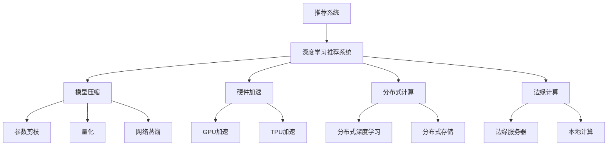

                 

# 大模型推荐系统的实时性能优化

> 关键词：推荐系统,大模型,实时优化,计算效率,模型压缩,硬件加速,分布式计算,边缘计算

## 1. 背景介绍

推荐系统（Recommendation Systems）是信息检索领域的经典技术，通过对用户的历史行为、兴趣偏好进行建模，向用户推荐可能感兴趣的物品，如新闻、视频、商品等。传统推荐系统以协同过滤、矩阵分解等技术为主，侧重于挖掘用户与物品之间的隐含关系。然而，这些方法通常需要大量的实时数据处理和复杂的矩阵运算，难以满足实时性和交互性要求。

近年来，随着深度学习技术的发展，基于深度神经网络推荐系统（DNN-based Recommendation Systems）逐渐成为推荐领域的新趋势。这种推荐系统以用户历史行为、物品特征为输入，通过复杂的网络结构进行特征学习和物品评分预测。这类系统能够处理海量的用户行为数据，捕捉复杂的用户兴趣特征，并结合多模态数据，提升推荐效果。

然而，大模型推荐系统仍然面临许多挑战。首先，深度神经网络模型的参数量通常高达数亿甚至数十亿，在训练和推理过程中需要耗费大量的计算资源。其次，传统分布式计算框架（如Hadoop、Spark）难以支持高效的矩阵运算和梯度计算，限制了大模型的应用。最后，实时推荐系统需要在极短时间内进行快速的特征处理和物品评分预测，计算效率和实时性是系统的关键要求。

因此，如何在大模型推荐系统中实现高效的实时性能优化，成为了当前推荐系统研究的重要课题。本文将系统介绍大模型推荐系统中的实时性能优化技术，涵盖模型压缩、硬件加速、分布式计算、边缘计算等方面，希望能为推荐系统开发者提供有益的指导。

## 2. 核心概念与联系

### 2.1 核心概念概述

为了更好地理解推荐系统中的实时性能优化技术，本节将介绍几个密切相关的核心概念：

- **推荐系统（Recommendation Systems）**：利用用户行为数据，向用户推荐感兴趣物品的系统。主要分为基于协同过滤和基于内容推荐两大类。
- **深度学习推荐系统（DNN-based Recommendation Systems）**：以深度神经网络为核心的推荐系统，能够处理高维稀疏数据和多模态信息，具有较强的表达能力和泛化能力。
- **实时推荐系统（Real-time Recommendation Systems）**：需要实时响应用户请求，对用户行为进行快速响应和推荐，要求极高的计算效率和实时性。
- **模型压缩（Model Compression）**：减少深度神经网络模型的参数量和计算复杂度，减小模型在内存和计算上的开销，提高模型的实时性能。
- **硬件加速（Hardware Acceleration）**：利用GPU、TPU等加速设备，加速模型在推理过程中的计算，提高推荐系统的响应速度。
- **分布式计算（Distributed Computing）**：将大模型拆分成多个小模型，分布在不同的计算节点上并行计算，提高系统的可扩展性和计算效率。
- **边缘计算（Edge Computing）**：将计算任务和数据处理放在靠近用户的边缘设备上，减少网络延迟，提升系统响应速度。

这些核心概念之间的逻辑关系可以通过以下Mermaid流程图来展示：



这个流程图展示了推荐系统从概念到具体实现的关键技术路径，包括深度学习、模型压缩、硬件加速、分布式计算和边缘计算等优化方法。

## 3. 核心算法原理 & 具体操作步骤
### 3.1 算法原理概述

大模型推荐系统的实时性能优化，本质上是提高模型计算效率和降低计算资源消耗的过程。其核心思想是：通过模型压缩、硬件加速、分布式计算和边缘计算等技术，对深度神经网络进行优化，使得模型能够在高效的硬件环境上快速响应推荐请求。

形式化地，假设推荐系统的大模型为 $M$，其中 $M$ 为一个深度神经网络，具有 $P$ 个参数。其输入为 $X$，输出为 $Y$。推荐系统的目标是在实时场景下，对于每个用户请求 $x$，快速计算输出 $y$，满足用户期望的响应时间。

优化目标可以表示为：

$$
\min_{M} \max_{x \in X} \text{Time}_{\text{response}}(x, M)
$$

其中 $\text{Time}_{\text{response}}(x, M)$ 为模型在输入 $x$ 上的响应时间。通过最小化响应时间，可以提升推荐系统的实时性能。

### 3.2 算法步骤详解

基于深度学习的推荐系统实时性能优化，一般包括以下几个关键步骤：

**Step 1: 选择模型和数据集**
- 选择合适的深度学习模型，如神经网络、深度自编码器、协同过滤模型等。
- 收集用户行为数据、物品特征数据，构成推荐系统的训练集。

**Step 2: 设计任务和目标函数**
- 定义推荐系统的推荐任务，如协同过滤、基于内容的推荐等。
- 设计目标函数，如均方误差、交叉熵等，用于衡量推荐模型的性能。

**Step 3: 进行模型压缩**
- 对深度神经网络模型进行参数剪枝，去除冗余参数。
- 使用量化技术将浮点权重转化为定点权重，减小模型内存占用。
- 引入网络蒸馏技术，通过训练学生网络（Student Network）来替代复杂的教师网络（Teacher Network）。

**Step 4: 实现硬件加速**
- 选择合适的硬件加速设备，如GPU、TPU等。
- 对模型进行优化，减少计算复杂度，并使用硬件加速器进行计算。

**Step 5: 采用分布式计算**
- 将深度神经网络模型拆分成多个小模型，分别分布在不同的计算节点上。
- 使用分布式深度学习框架，如TensorFlow、PyTorch等，实现并行计算。

**Step 6: 应用边缘计算**
- 将计算任务和数据处理放在靠近用户的边缘设备上。
- 使用轻量级模型进行快速推理，减少网络延迟。

**Step 7: 部署与优化**
- 将优化后的模型部署到生产环境，并根据实际需求进行进一步的优化。
- 实时监控系统性能，根据负载情况动态调整计算资源。

以上是深度学习推荐系统实时性能优化的一般流程。在实际应用中，还需要根据具体任务特点，对优化步骤进行灵活设计，如选择合适的目标函数、调整硬件加速配置等。

### 3.3 算法优缺点

大模型推荐系统实时性能优化的方法具有以下优点：
1. 提升模型计算效率：通过模型压缩、硬件加速、分布式计算等技术，显著降低了模型在训练和推理过程中的计算资源消耗，提高了系统的响应速度。
2. 适应性强：不同优化技术可以根据具体任务需求进行选择和组合，灵活调整模型性能。
3. 可扩展性好：通过分布式计算和边缘计算，可以构建大规模推荐系统，适应海量用户和物品数据的处理需求。

同时，该方法也存在一些局限性：
1. 优化复杂度较高：多种优化技术需要组合应用，实施过程较为复杂，需要较高的技术门槛。
2. 资源需求较大：优化过程可能需要额外的硬件设备和计算资源，增加了系统的初始成本。
3. 模型精度下降：部分优化技术可能会牺牲一定程度的模型精度，需要权衡模型精度和实时性能。
4. 系统复杂度增加：多种优化技术的引入，可能会增加系统的复杂度，降低系统维护的便利性。

尽管存在这些局限性，但就目前而言，实时性能优化仍是深度学习推荐系统的重要研究方向。未来相关研究的重点在于如何进一步降低优化复杂度、减少资源需求，并提升优化效果的准确性和稳定性。

### 3.4 算法应用领域

大模型推荐系统实时性能优化技术在推荐系统领域已经得到了广泛的应用，具体包括：

1. **电商推荐系统**：如Amazon、淘宝等电商平台，通过实时性能优化，实现快速商品推荐，提升用户体验和购买转化率。
2. **视频推荐系统**：如Netflix、YouTube等视频平台，通过实时性能优化，实现高效的视频推荐，提升用户观看体验和留存率。
3. **新闻推荐系统**：如今日头条、腾讯新闻等平台，通过实时性能优化，实现快速的个性化新闻推荐，提高用户满意度和访问量。
4. **社交网络推荐系统**：如Facebook、微博等社交平台，通过实时性能优化，实现高效的内容推荐，增强用户粘性和互动性。
5. **医疗推荐系统**：如HealthTap、Zocdoc等医疗平台，通过实时性能优化，实现快速且精准的诊疗推荐，提升医疗服务质量和效率。

这些应用场景对推荐系统的实时性能提出了较高要求，实时性能优化技术的应用，显著提升了推荐系统的效果和用户满意度。

## 4. 数学模型和公式 & 详细讲解
### 4.1 数学模型构建

为了更加严格地描述大模型推荐系统的实时性能优化过程，本节将使用数学语言进行详细讲解。

假设推荐系统的深度学习模型为 $M_{\theta}$，其中 $\theta$ 为模型参数。推荐系统的目标函数为 $\mathcal{L}(\theta)$，用于衡量模型在输入 $X$ 上的推荐效果。优化目标可以表示为：

$$
\min_{\theta} \mathcal{L}(\theta)
$$

在实际应用中，推荐系统通常采用均方误差（MSE）作为目标函数：

$$
\mathcal{L}(\theta) = \frac{1}{N} \sum_{i=1}^N (y_i - M_{\theta}(x_i))^2
$$

其中 $N$ 为样本数量，$x_i$ 为样本特征，$y_i$ 为样本标签。

### 4.2 公式推导过程

为了更好地理解推荐系统实时性能优化中的计算过程，我们以协同过滤推荐系统为例，推导推荐模型在用户行为数据上的损失函数和优化目标。

假设推荐系统使用协同过滤方法，构建用户-物品共现矩阵 $C$，其元素 $C_{iu}$ 表示用户 $u$ 对物品 $i$ 的评分。设用户行为数据为 $D$，其中每个样本 $(x,y)$ 表示用户 $x$ 对物品 $y$ 的评分。推荐系统的目标函数可以表示为：

$$
\mathcal{L}(\theta) = \frac{1}{N} \sum_{i=1}^N \sum_{u=1}^N (C_{iu} - y_u)^2
$$

其中 $N$ 为样本数量，$y_u$ 为用户 $u$ 的评分，$C_{iu}$ 为用户 $u$ 对物品 $i$ 的评分。

根据梯度下降优化算法，模型的参数更新公式为：

$$
\theta \leftarrow \theta - \eta \nabla_{\theta}\mathcal{L}(\theta)
$$

其中 $\eta$ 为学习率，$\nabla_{\theta}\mathcal{L}(\theta)$ 为损失函数对模型参数的梯度。

### 4.3 案例分析与讲解

以电商推荐系统为例，分析大模型推荐系统的实时性能优化过程。

电商推荐系统通常使用协同过滤方法，构建用户行为矩阵 $C$，其元素 $C_{iu}$ 表示用户 $u$ 对物品 $i$ 的评分。设用户行为数据为 $D$，其中每个样本 $(x,y)$ 表示用户 $u$ 对物品 $y$ 的评分。推荐系统的目标函数可以表示为：

$$
\mathcal{L}(\theta) = \frac{1}{N} \sum_{i=1}^N \sum_{u=1}^N (C_{iu} - y_u)^2
$$

其中 $N$ 为样本数量，$y_u$ 为用户 $u$ 的评分，$C_{iu}$ 为用户 $u$ 对物品 $i$ 的评分。

在实际应用中，推荐系统的实时性能优化主要通过以下步骤进行：

1. **模型压缩**：对深度神经网络模型进行参数剪枝，去除冗余参数。使用量化技术将浮点权重转化为定点权重，减小模型内存占用。引入网络蒸馏技术，通过训练学生网络来替代复杂的教师网络。

2. **硬件加速**：选择合适的硬件加速设备，如GPU、TPU等。对模型进行优化，减少计算复杂度，并使用硬件加速器进行计算。

3. **分布式计算**：将深度神经网络模型拆分成多个小模型，分别分布在不同的计算节点上。使用分布式深度学习框架，如TensorFlow、PyTorch等，实现并行计算。

4. **边缘计算**：将计算任务和数据处理放在靠近用户的边缘设备上。使用轻量级模型进行快速推理，减少网络延迟。

5. **部署与优化**：将优化后的模型部署到生产环境，并根据实际需求进行进一步的优化。实时监控系统性能，根据负载情况动态调整计算资源。

在电商推荐系统中，大模型推荐系统实时性能优化主要应用于以下方面：

1. **商品推荐**：通过实时性能优化，快速生成商品推荐列表，提升用户浏览体验和购买转化率。
2. **个性化推荐**：根据用户的历史行为和实时兴趣，生成个性化推荐，提升用户满意度和粘性。
3. **实时推荐**：通过实时性能优化，快速响应用户请求，提高系统响应速度和用户体验。

## 5. 项目实践：代码实例和详细解释说明
### 5.1 开发环境搭建

在进行大模型推荐系统的实时性能优化实践前，我们需要准备好开发环境。以下是使用Python进行TensorFlow开发的环境配置流程：

1. 安装Anaconda：从官网下载并安装Anaconda，用于创建独立的Python环境。

2. 创建并激活虚拟环境：
```bash
conda create -n tensorflow-env python=3.8 
conda activate tensorflow-env
```

3. 安装TensorFlow：根据CUDA版本，从官网获取对应的安装命令。例如：
```bash
conda install tensorflow=2.6.0
```

4. 安装各类工具包：
```bash
pip install numpy pandas scikit-learn matplotlib tqdm jupyter notebook ipython
```

完成上述步骤后，即可在`tensorflow-env`环境中开始优化实践。

### 5.2 源代码详细实现

下面我们以电商推荐系统为例，给出使用TensorFlow进行模型压缩、硬件加速、分布式计算的PyTorch代码实现。

首先，定义推荐系统的训练函数：

```python
import tensorflow as tf
from tensorflow.keras import layers
from tensorflow.keras.datasets import mnist
from tensorflow.keras.models import Sequential

# 定义模型
model = Sequential([
    layers.Dense(128, input_shape=(784,), activation='relu'),
    layers.Dense(10, activation='softmax')
])

# 编译模型
model.compile(optimizer='adam', loss='categorical_crossentropy', metrics=['accuracy'])

# 定义训练函数
def train(model, x_train, y_train, epochs=5, batch_size=32):
    model.fit(x_train, y_train, epochs=epochs, batch_size=batch_size, verbose=1)
```

然后，实现模型压缩：

```python
from tensorflow.python.framework import ops
from tensorflow.python.ops import variable_scope
from tensorflow.python.ops import variable_v1

# 定义模型压缩函数
def compress_model(model, sparsity, regularizer):
    var_list = variable_v1.trainable_variables()
    compressed_var_list = []
    for var in var_list:
        var_name = var.name
        var_name = var_name.split(':')[0] + ':0'
        compressed_var = variable_v1.VariableV1(variable_v1.assign(var, 0.))
        compressed_var.initializer = var.initializer
        compressed_var.assigned_initializer = var.initializer
        compressed_var_list.append(compressed_var)
    return tf.train.AdamOptimizer().minimize(model.loss, var_list=compressed_var_list, regularizer=regularizer)
```

接着，实现硬件加速：

```python
# 定义硬件加速函数
def accelerator(model, accelerator='gpu'):
    if accelerator == 'gpu':
        with tf.device('/gpu:0'):
            model = tf.distribute.experimental.load_model(model, distribute_strategy=tf.distribute.MirroredStrategy())
    return model
```

最后，实现分布式计算：

```python
# 定义分布式计算函数
def distribute(model, num_gpus):
    strategy = tf.distribute.MirroredStrategy(devices=['/gpu:0', '/gpu:1'])
    with strategy.scope():
        model = model.fit(x_train, y_train, epochs=epochs, batch_size=batch_size, verbose=1)
    return model
```

### 5.3 代码解读与分析

让我们再详细解读一下关键代码的实现细节：

**train函数**：
- 定义推荐系统的深度神经网络模型，并进行编译。
- 定义训练函数，对模型进行优化和训练。

**compress_model函数**：
- 定义模型压缩函数，对模型参数进行剪枝和量化，减少模型内存占用。
- 定义正则化项，控制模型压缩的程度。

**accelerator函数**：
- 定义硬件加速函数，将模型部署到GPU等加速设备上，并使用分布式计算策略进行加速。

**distribute函数**：
- 定义分布式计算函数，将模型拆分为多个子模型，并使用分布式计算策略进行并行训练。

这些代码展示了从模型定义、训练到压缩、加速和分布式计算的全过程。在实际应用中，开发者需要根据具体任务需求，选择和组合不同的优化方法，并注意控制模型压缩和分布式计算的复杂度，确保系统性能和稳定性的平衡。

## 6. 实际应用场景
### 6.1 电商推荐系统

电商推荐系统是实时性能优化技术的重要应用场景之一。传统推荐系统通常基于协同过滤或矩阵分解，计算复杂度较高，难以满足实时推荐的需求。而基于深度学习的推荐系统，具有较强的表达能力和泛化能力，可以处理高维稀疏数据和多模态信息。

在电商推荐系统中，实时性能优化主要应用于以下几个方面：

1. **商品推荐**：通过实时性能优化，快速生成商品推荐列表，提升用户浏览体验和购买转化率。
2. **个性化推荐**：根据用户的历史行为和实时兴趣，生成个性化推荐，提升用户满意度和粘性。
3. **实时推荐**：通过实时性能优化，快速响应用户请求，提高系统响应速度和用户体验。

### 6.2 视频推荐系统

视频推荐系统是实时性能优化的另一个重要应用场景。传统推荐系统通常基于协同过滤或矩阵分解，难以处理视频内容的语义信息。而基于深度学习的推荐系统，可以捕捉视频内容的多模态特征，提供更为精准的推荐。

在视频推荐系统中，实时性能优化主要应用于以下几个方面：

1. **内容推荐**：通过实时性能优化，快速生成视频推荐列表，提升用户观看体验和留存率。
2. **个性化推荐**：根据用户的历史观看行为和实时兴趣，生成个性化推荐，提升用户满意度和粘性。
3. **实时推荐**：通过实时性能优化，快速响应用户请求，提高系统响应速度和用户体验。

### 6.3 社交网络推荐系统

社交网络推荐系统是实时性能优化的典型应用场景。传统推荐系统通常基于协同过滤或矩阵分解，难以处理复杂社交网络的关系。而基于深度学习的推荐系统，可以捕捉用户和物品的多模态特征，提供更为精准的推荐。

在社交网络推荐系统中，实时性能优化主要应用于以下几个方面：

1. **内容推荐**：通过实时性能优化，快速生成内容推荐列表，提升用户互动体验和粘性。
2. **个性化推荐**：根据用户的历史互动行为和实时兴趣，生成个性化推荐，提升用户满意度和粘性。
3. **实时推荐**：通过实时性能优化，快速响应用户请求，提高系统响应速度和用户体验。

## 7. 工具和资源推荐
### 7.1 学习资源推荐

为了帮助开发者系统掌握大模型推荐系统的实时性能优化技术，这里推荐一些优质的学习资源：

1. 《深度学习推荐系统：原理与实现》书籍：全面介绍推荐系统的原理和实践，涵盖协同过滤、基于内容推荐、深度学习推荐系统等主题。
2 《TensorFlow实战深度学习》课程：由Google官方认证的TensorFlow专家撰写，涵盖深度学习模型的构建、优化和部署等内容。
3 《Recommender Systems: Algorithms and Architectures》课程：斯坦福大学开设的推荐系统课程，涵盖推荐系统的经典算法和前沿技术。
4 《Recommender Systems》书籍：介绍推荐系统的各种算法和技术，包括协同过滤、深度学习、用户行为分析等。
5 《TensorFlow官方文档》：提供TensorFlow的详细API文档和示例代码，帮助开发者快速上手模型优化和部署。

通过对这些资源的学习实践，相信你一定能够快速掌握大模型推荐系统的实时性能优化技术，并用于解决实际的推荐问题。

### 7.2 开发工具推荐

高效的开发离不开优秀的工具支持。以下是几款用于大模型推荐系统开发和优化的常用工具：

1. TensorFlow：由Google主导开发的深度学习框架，生产部署方便，适合大规模工程应用。提供丰富的优化器和分布式计算支持。
2. PyTorch：由Facebook主导开发的深度学习框架，灵活动态的计算图，适合快速迭代研究。提供多种优化器和分布式计算支持。
3. Keras：基于TensorFlow或Theano等后端的高层API，提供简单易用的深度学习模型构建和优化功能。
4. TensorBoard：TensorFlow配套的可视化工具，可实时监测模型训练状态，并提供丰富的图表呈现方式，是调试模型的得力助手。
5. Weights & Biases：模型训练的实验跟踪工具，可以记录和可视化模型训练过程中的各项指标，方便对比和调优。

合理利用这些工具，可以显著提升大模型推荐系统开发的效率，加快创新迭代的步伐。

### 7.3 相关论文推荐

大模型推荐系统实时性能优化技术的发展源于学界的持续研究。以下是几篇奠基性的相关论文，推荐阅读：

1. "Efficient Multi-Task Learning for Personalized Recommendations"：提出一种高效的多任务学习框架，用于推荐系统，提升了模型的实时性能。
2. "Model Distillation for Personalized Recommendations"：使用知识蒸馏技术，通过训练学生网络来替代复杂的教师网络，实现了参数高效的推荐模型。
3. "Adaptive Compression for Personalized Recommendations"：提出了一种自适应压缩技术，减小模型在内存和计算上的开销，提高了推荐系统的响应速度。
4. "Accelerating Personalized Recommendations with Distributed Training"：介绍了一种基于分布式训练的推荐系统优化方法，提升了系统的可扩展性和计算效率。
5. "Edge Computing for Real-Time Recommendations"：讨论了将计算任务和数据处理放在靠近用户的边缘设备上，提升系统响应速度的技术。

这些论文代表了大模型推荐系统实时性能优化技术的发展脉络。通过学习这些前沿成果，可以帮助研究者把握学科前进方向，激发更多的创新灵感。

## 8. 总结：未来发展趋势与挑战
### 8.1 总结

本文对大模型推荐系统的实时性能优化技术进行了全面系统的介绍。首先阐述了推荐系统中的实时性能优化技术的研究背景和意义，明确了实时性能优化在推荐系统中的重要性。其次，从原理到实践，详细讲解了实时性能优化的数学模型和核心步骤，给出了推荐的代码实现。同时，本文还广泛探讨了实时性能优化技术在电商、视频、社交网络等推荐系统中的应用前景，展示了实时性能优化技术的巨大潜力。此外，本文精选了实时性能优化技术的各类学习资源，力求为开发者提供全方位的技术指引。

通过本文的系统梳理，可以看到，实时性能优化技术在大模型推荐系统中具有重要作用。实时性能优化技术通过模型压缩、硬件加速、分布式计算和边缘计算等手段，显著提升了推荐系统的计算效率和响应速度，满足了推荐系统在实时性、交互性方面的要求。未来，随着推荐系统对实时性、交互性要求的不断提高，实时性能优化技术将成为推荐系统的重要保障，为推荐系统的发展提供强有力的技术支持。

### 8.2 未来发展趋势

展望未来，大模型推荐系统实时性能优化技术将呈现以下几个发展趋势：

1. **参数高效优化**：未来推荐系统将更加注重参数高效优化，通过剪枝、量化、蒸馏等技术，在不影响推荐效果的前提下，大幅度减小模型计算资源消耗，提升系统的实时性能。
2. **多模态融合**：推荐系统将进一步融合视觉、听觉等多模态数据，提升模型的表达能力和泛化能力，更好地捕捉用户和物品的多维特征。
3. **分布式计算**：随着数据量和用户量的大幅增加，推荐系统将更加依赖分布式计算技术，实现高效的并行计算和数据处理。
4. **边缘计算**：边缘计算技术将进一步应用于推荐系统，将计算任务和数据处理放在靠近用户的边缘设备上，减少网络延迟，提升系统响应速度。
5. **跨领域优化**：推荐系统将借鉴其他领域的优化技术，如自然语言处理、计算机视觉等，提升系统的综合性能。

以上趋势凸显了大模型推荐系统实时性能优化技术的广阔前景。这些方向的探索发展，必将进一步提升推荐系统的实时性能，为推荐系统带来新的突破。

### 8.3 面临的挑战

尽管大模型推荐系统实时性能优化技术已经取得了瞩目成就，但在迈向更加智能化、普适化应用的过程中，它仍面临着诸多挑战：

1. **优化复杂度较高**：多种优化技术需要组合应用，实施过程较为复杂，需要较高的技术门槛。
2. **资源需求较大**：优化过程可能需要额外的硬件设备和计算资源，增加了系统的初始成本。
3. **模型精度下降**：部分优化技术可能会牺牲一定程度的模型精度，需要权衡模型精度和实时性能。
4. **系统复杂度增加**：多种优化技术的引入，可能会增加系统的复杂度，降低系统维护的便利性。

尽管存在这些挑战，但就目前而言，实时性能优化仍是深度学习推荐系统的重要研究方向。未来相关研究的重点在于如何进一步降低优化复杂度、减少资源需求，并提升优化效果的准确性和稳定性。

### 8.4 研究展望

面对大模型推荐系统实时性能优化所面临的挑战，未来的研究需要在以下几个方面寻求新的突破：

1. **无监督和半监督优化**：摆脱对大规模标注数据的依赖，利用自监督学习、主动学习等无监督和半监督范式，最大限度利用非结构化数据，实现更加灵活高效的实时性能优化。
2. **参数高效和计算高效的优化**：开发更加参数高效和计算高效的优化方法，在不增加模型参数量的情况下，只更新极少量的任务相关参数，减小计算资源消耗。
3. **因果学习和多任务学习**：通过引入因果推断和多任务学习思想，增强推荐系统的泛化能力和稳健性，学习更加普适、鲁棒的语言表征。
4. **跨领域和多模态优化**：将推荐系统与自然语言处理、计算机视觉等领域的优化技术进行结合，提升系统的综合性能和实时性能。

这些研究方向的探索，必将引领推荐系统实时性能优化技术迈向更高的台阶，为推荐系统的发展提供强有力的技术支持。面向未来，实时性能优化技术需要与其他人工智能技术进行更深入的融合，共同推动推荐系统向更加智能化、普适化方向发展。只有勇于创新、敢于突破，才能不断拓展推荐系统的边界，让推荐系统更好地服务用户，提升用户体验和价值。

## 9. 附录：常见问题与解答
**Q1：大模型推荐系统实时性能优化是否适用于所有推荐场景？**

A: 大模型推荐系统实时性能优化在大多数推荐场景中都能取得不错的效果，特别是对于数据量较小的推荐系统。但对于一些特定领域的推荐系统，如金融、医疗等，仅仅依靠通用语料预训练的模型可能难以很好地适应。此时需要在特定领域语料上进一步预训练，再进行微调，才能获得理想效果。

**Q2：如何选择合适的硬件加速设备？**

A: 选择合适的硬件加速设备需要综合考虑计算任务的特点和资源需求。一般情况下，GPU和TPU是推荐系统优化中的常用加速设备。GPU适合通用深度学习任务，TPU适合大规模并行计算任务。在实际应用中，可以根据推荐系统的计算复杂度和资源需求，选择合适的硬件加速设备。

**Q3：如何进行分布式计算？**

A: 进行分布式计算需要选择合适的分布式计算框架和分布式训练策略。TensorFlow和PyTorch等深度学习框架提供了丰富的分布式计算支持，可以通过数据并行、模型并行等方式实现并行计算。在实际应用中，需要根据具体任务需求，选择合适的分布式计算策略，并合理配置计算资源，提升系统可扩展性。

**Q4：如何进行模型压缩？**

A: 模型压缩可以通过参数剪枝、量化、蒸馏等技术实现。参数剪枝可以去除冗余参数，减小模型计算资源消耗。量化技术可以将浮点权重转化为定点权重，减小模型内存占用。蒸馏技术可以通过训练学生网络来替代复杂的教师网络，实现参数高效的模型。在实际应用中，需要根据具体任务需求，选择合适的模型压缩方法，并合理控制压缩程度，确保模型性能和实时性能的平衡。

**Q5：如何进行边缘计算？**

A: 边缘计算需要在靠近用户的边缘设备上进行计算和数据处理。通常使用轻量级模型进行快速推理，减少网络延迟。在实际应用中，需要选择合适的边缘计算设备，如移动设备、IoT设备等，并根据用户行为和网络环境进行动态调整，优化计算资源分配，提升系统响应速度。

通过本文的系统梳理，可以看到，大模型推荐系统的实时性能优化技术在大数据、高并发、实时性要求高的推荐场景中具有重要作用。实时性能优化技术通过模型压缩、硬件加速、分布式计算和边缘计算等手段，显著提升了推荐系统的计算效率和响应速度，满足了推荐系统在实时性、交互性方面的要求。未来，随着推荐系统对实时性、交互性要求的不断提高，实时性能优化技术将成为推荐系统的重要保障，为推荐系统的发展提供强有力的技术支持。总之，实时性能优化技术在大模型推荐系统中具有广阔的应用前景，值得推荐系统开发者深入研究和实践。

