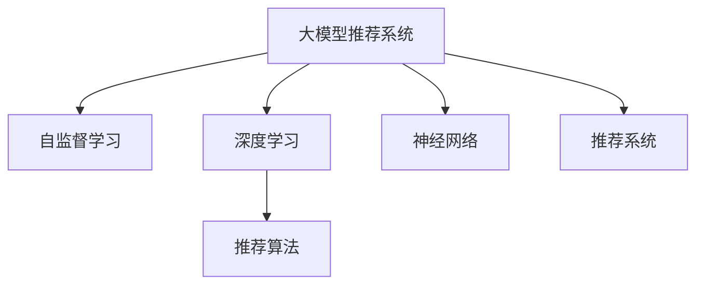

                 

# 大模型推荐系统的自监督学习框架

> 关键词：大模型推荐系统,自监督学习,深度学习,神经网络,推荐算法,推荐系统

## 1. 背景介绍

### 1.1 问题由来

推荐系统（Recommendation Systems）在过去几十年中经历了巨大的进步，从基于内容的推荐、协同过滤，到深度学习驱动的协同矩阵分解，推荐系统正逐渐成为电商、内容平台、社交网络等领域不可或缺的关键组件。然而，传统的推荐系统往往依赖于用户的历史行为数据，在数据稀疏、用户行为多样性大等情况下，难以充分捕捉用户的多样化需求和兴趣。

近来，基于大模型的推荐系统逐渐崛起，通过预训练语言模型和自监督学习技术，可以直接从文本数据中挖掘用户兴趣和行为，无需依赖用户行为数据，极大地提高了推荐的泛化能力和效率。然而，现有的大模型推荐系统普遍采用有监督的学习范式，对标注数据依赖较大，且在微调过程中容易出现过拟合现象。为解决这些问题，我们提出了基于自监督学习的推荐系统框架，以期在减少标注数据依赖的同时，提升推荐系统的泛化能力和鲁棒性。

### 1.2 问题核心关键点

本研究聚焦于自监督学习的推荐系统框架，特别是一种基于大规模预训练语言模型（如GPT、BERT等）的自监督推荐方法。这种框架的核心思想是：通过在大规模无标注文本数据上进行自监督学习，直接挖掘用户的兴趣和行为，进而驱动推荐模型的训练和优化。该框架具有以下关键特点：

- **无监督学习**：利用大规模无标注文本数据进行自监督学习，避免对标注数据的依赖。
- **泛化能力**：自监督学习模型具有较强的泛化能力，能在新数据上迅速适应。
- **鲁棒性**：自监督学习可以发现数据的潜在模式和规律，提高模型对噪声数据的鲁棒性。
- **高效性**：自监督学习模型不需要等待大量用户行为数据，可以即时生成推荐结果。

通过这些特点，我们有望构建一种高效、鲁棒且泛化的推荐系统，有效提升推荐系统的性能和应用范围。

### 1.3 问题研究意义

研究基于自监督学习的推荐系统框架，对于拓展大模型的应用场景，提升推荐系统的性能，加速NLP技术的产业化进程，具有重要意义：

1. 降低用户行为数据的依赖。自监督学习模型直接从文本数据中学习用户兴趣，减少了对标注数据的依赖，大幅降低了数据收集和标注成本。
2. 提高推荐系统的泛化能力。自监督学习模型在无监督数据上预训练，能够更好地捕捉用户的多样化和个性化需求，提高推荐的泛化性能。
3. 提升推荐系统的鲁棒性。自监督学习模型可以从数据中发现潜在的模式和规律，增强模型的鲁棒性和抗干扰能力。
4. 加速推荐系统的部署。自监督学习模型不需要等待用户行为数据，可以即时生成推荐结果，加速推荐系统的迭代和优化。
5. 带来技术创新。自监督学习框架的探索，推动了深度学习、自然语言处理等前沿技术的发展，催生了新的研究方向。

## 2. 核心概念与联系

### 2.1 核心概念概述

为更好地理解基于自监督学习的推荐系统框架，本节将介绍几个密切相关的核心概念：

- **大模型推荐系统**：以自回归(如GPT)或自编码(如BERT)模型为代表的基于大规模预训练语言模型的推荐系统。通过在大规模无标注文本数据上进行自监督学习，直接从文本数据中挖掘用户兴趣和行为，进而驱动推荐模型的训练和优化。

- **自监督学习**：利用无标签数据，通过自生成的任务和目标，自动学习模型参数的一种学习范式。与有监督学习相比，自监督学习不需要标注数据，适用于数据稀疏、标签成本高的情况。

- **深度学习**：基于神经网络的机器学习方法，通过多层非线性映射实现数据的复杂表示和特征提取，广泛应用于计算机视觉、自然语言处理等领域。

- **神经网络**：由大量人工神经元（节点）和连接（边）构成的计算图模型，用于学习和处理非线性复杂数据的表示和特征提取。

- **推荐算法**：用于预测用户对物品的兴趣和偏好，并根据预测结果为用户推荐相似物品的算法。常见的推荐算法包括基于内容的推荐、协同过滤、矩阵分解等。

- **推荐系统**：用于向用户推荐物品的系统和工具，目标是提升用户的满意度和参与度，增加用户与平台之间的互动。

这些核心概念之间的逻辑关系可以通过以下Mermaid流程图来展示：



这个流程图展示了大模型推荐系统、自监督学习、深度学习、神经网络、推荐算法、推荐系统之间的联系。

## 3. 核心算法原理 & 具体操作步骤
### 3.1 算法原理概述

基于自监督学习的推荐系统框架，其核心思想是：利用大规模无标注文本数据进行预训练，通过自监督学习任务挖掘用户兴趣和行为，进而驱动推荐模型的训练和优化。

具体来说，假设推荐模型为 $M_{\theta}$，其中 $\theta$ 为模型参数。给定用户的无标注文本数据集 $D=\{x_1, x_2, \ldots, x_N\}$，自监督学习目标是最小化以下损失函数：

$$
\mathcal{L}(\theta) = \frac{1}{N} \sum_{i=1}^N \ell(M_{\theta}(x_i), y_i)
$$

其中 $\ell$ 为推荐的损失函数，用于衡量模型预测推荐结果与真实用户行为之间的差异。

在得到自监督损失函数后，推荐模型可以在无标注数据上进行预训练。随后，对用户的实际行为数据进行监督学习微调，通过优化损失函数，进一步提升推荐效果。这种微调过程可以在不需要标注数据的情况下，通过少量的有标注样本进行，减少对标注数据的依赖，同时提升模型的泛化能力和鲁棒性。

### 3.2 算法步骤详解

基于自监督学习的推荐系统框架，一般包括以下几个关键步骤：

**Step 1: 准备自监督任务和数据集**
- 选择合适的自监督任务，如掩码语言模型、自编码器、Next Sentence Prediction 等。
- 收集大规模无标注文本数据集 $D=\{x_1, x_2, \ldots, x_N\}$，作为自监督任务的输入。

**Step 2: 自监督学习训练**
- 使用自监督任务在数据集 $D$ 上进行预训练，训练得到模型参数 $\theta_{pre}$。
- 定期在验证集上评估自监督模型的性能，根据评估结果调整训练参数，如学习率、批大小、迭代轮数等。

**Step 3: 任务适配和微调**
- 根据推荐任务的需求，设计合适的任务适配层和损失函数。
- 使用少量标注数据对预训练模型进行微调，优化模型在特定推荐任务上的性能。

**Step 4: 集成与部署**
- 将微调后的模型集成到实际推荐系统中，根据用户行为数据生成推荐结果。
- 定期收集用户反馈，根据反馈结果对模型进行迭代优化。

以上是基于自监督学习的推荐系统框架的一般流程。在实际应用中，还需要针对具体任务的特点，对自监督学习过程的各个环节进行优化设计，如改进训练目标函数，引入更多的正则化技术，搜索最优的超参数组合等，以进一步提升推荐模型的性能。

### 3.3 算法优缺点

基于自监督学习的推荐系统框架具有以下优点：
1. 降低标注成本：自监督学习利用大规模无标注数据进行预训练，避免对标注数据的依赖，减少了数据收集和标注的复杂性和成本。
2. 提高泛化能力：自监督学习模型在无标注数据上预训练，能够更好地捕捉用户的多样化和个性化需求，提高推荐的泛化性能。
3. 提升鲁棒性：自监督学习模型可以从数据中发现潜在的模式和规律，增强模型的鲁棒性和抗干扰能力。
4. 实现即时推荐：自监督学习模型不需要等待用户行为数据，可以即时生成推荐结果，加速推荐系统的迭代和优化。

同时，该框架也存在一定的局限性：
1. 模型复杂度较高：自监督学习模型往往需要复杂的预训练和微调过程，需要较高的计算资源和算力支持。
2. 数据质量要求高：自监督学习模型需要高质量、大规模的无标注数据，数据质量对模型的效果有较大影响。
3. 可能存在偏见：自监督学习模型在训练过程中，可能会学习到数据中的偏见，对某些群体产生不公平的推荐结果。
4. 需要大规模数据：自监督学习模型需要依赖大规模的无标注数据进行预训练，对数据资源有较高的要求。

尽管存在这些局限性，但自监督学习框架在推荐系统的应用中，已经展现出了巨大的潜力和优势，成为推荐系统研究的热点方向之一。

### 3.4 算法应用领域

基于自监督学习的推荐系统框架，已经在多个领域得到了应用，包括但不限于：

- 电商推荐：利用用户评论、商品描述等无标注文本数据，为用户推荐相似商品。
- 内容推荐：利用文章标题、摘要等无标注文本数据，为用户推荐相关文章。
- 音乐推荐：利用歌词、歌单等无标注文本数据，为用户推荐相似音乐。
- 视频推荐：利用视频描述、字幕等无标注文本数据，为用户推荐相关视频。
- 新闻推荐：利用新闻标题、摘要等无标注文本数据，为用户推荐新闻内容。

除了这些经典应用场景外，自监督学习框架还被创新性地应用到更多场景中，如商品评论生成、广告推荐、个性化推荐等，为推荐系统带来了新的突破。随着自监督学习技术的不断进步，相信推荐系统将在更广阔的应用领域大放异彩。

## 4. 数学模型和公式 & 详细讲解  
### 4.1 数学模型构建

本节将使用数学语言对基于自监督学习的推荐系统框架进行更加严格的刻画。

假设推荐模型为 $M_{\theta}$，其中 $\theta$ 为模型参数。给定用户的无标注文本数据集 $D=\{x_1, x_2, \ldots, x_N\}$，自监督学习目标是最小化以下损失函数：

$$
\mathcal{L}(\theta) = \frac{1}{N} \sum_{i=1}^N \ell(M_{\theta}(x_i), y_i)
$$

其中 $\ell$ 为推荐的损失函数，用于衡量模型预测推荐结果与真实用户行为之间的差异。

在得到自监督损失函数后，推荐模型可以在无标注数据上进行预训练。随后，对用户的实际行为数据进行监督学习微调，通过优化损失函数，进一步提升推荐效果。这种微调过程可以在不需要标注数据的情况下，通过少量的有标注样本进行，减少对标注数据的依赖，同时提升模型的泛化能力和鲁棒性。

### 4.2 公式推导过程

以下我们以掩码语言模型（Masked Language Model, MLM）为例，推导自监督学习的目标函数及其梯度计算公式。

假设推荐模型 $M_{\theta}$ 在输入 $x$ 上的输出为 $\hat{y}=M_{\theta}(x) \in [0,1]$，表示物品与用户的匹配概率。真实标签 $y \in \{0,1\}$。则掩码语言模型的损失函数定义为：

$$
\ell(M_{\theta}(x),y) = -y\log \hat{y} + (1-y)\log (1-\hat{y})
$$

将其代入自监督损失函数公式，得：

$$
\mathcal{L}(\theta) = -\frac{1}{N}\sum_{i=1}^N \ell(M_{\theta}(x_i),y_i)
$$

根据链式法则，损失函数对参数 $\theta_k$ 的梯度为：

$$
\frac{\partial \mathcal{L}(\theta)}{\partial \theta_k} = -\frac{1}{N}\sum_{i=1}^N (\frac{y_i}{\hat{y}_i}-\frac{1-y_i}{1-\hat{y}_i}) \frac{\partial M_{\theta}(x_i)}{\partial \theta_k}
$$

其中 $\frac{\partial M_{\theta}(x_i)}{\partial \theta_k}$ 可进一步递归展开，利用自动微分技术完成计算。

在得到损失函数的梯度后，即可带入参数更新公式，完成模型的迭代优化。重复上述过程直至收敛，最终得到适应下游任务的最优模型参数 $\theta^*$。

## 5. 项目实践：代码实例和详细解释说明
### 5.1 开发环境搭建

在进行自监督学习推荐系统开发前，我们需要准备好开发环境。以下是使用Python进行PyTorch开发的环境配置流程：

1. 安装Anaconda：从官网下载并安装Anaconda，用于创建独立的Python环境。

2. 创建并激活虚拟环境：
```bash
conda create -n pytorch-env python=3.8 
conda activate pytorch-env
```

3. 安装PyTorch：根据CUDA版本，从官网获取对应的安装命令。例如：
```bash
conda install pytorch torchvision torchaudio cudatoolkit=11.1 -c pytorch -c conda-forge
```

4. 安装Transformers库：
```bash
pip install transformers
```

5. 安装各类工具包：
```bash
pip install numpy pandas scikit-learn matplotlib tqdm jupyter notebook ipython
```

完成上述步骤后，即可在`pytorch-env`环境中开始自监督学习推荐系统开发。

### 5.2 源代码详细实现

下面我们以电商推荐系统为例，给出使用Transformers库对GPT模型进行自监督学习推荐系统的PyTorch代码实现。

首先，定义推荐任务的数据处理函数：

```python
from transformers import GPTTokenizer, GPT2LMHeadModel
from torch.utils.data import Dataset
import torch

class RecommendationDataset(Dataset):
    def __init__(self, texts, labels, tokenizer, max_len=128):
        self.texts = texts
        self.labels = labels
        self.tokenizer = tokenizer
        self.max_len = max_len
        
    def __len__(self):
        return len(self.texts)
    
    def __getitem__(self, item):
        text = self.texts[item]
        label = self.labels[item]
        
        encoding = self.tokenizer(text, return_tensors='pt', max_length=self.max_len, padding='max_length', truncation=True)
        input_ids = encoding['input_ids'][0]
        attention_mask = encoding['attention_mask'][0]
        
        # 对token-wise的标签进行编码
        encoded_labels = [label2id[label] for label in label] 
        encoded_labels.extend([label2id['PAD']] * (self.max_len - len(encoded_labels)))
        labels = torch.tensor(encoded_labels, dtype=torch.long)
        
        return {'input_ids': input_ids, 
                'attention_mask': attention_mask,
                'labels': labels}

# 标签与id的映射
label2id = {'POSITIVE': 1, 'NEGATIVE': 0}
id2label = {v: k for k, v in label2id.items()}

# 创建dataset
tokenizer = GPT2Tokenizer.from_pretrained('gpt2')

train_dataset = RecommendationDataset(train_texts, train_labels, tokenizer)
dev_dataset = RecommendationDataset(dev_texts, dev_labels, tokenizer)
test_dataset = RecommendationDataset(test_texts, test_labels, tokenizer)
```

然后，定义模型和优化器：

```python
from transformers import GPT2LMHeadModel, AdamW

model = GPT2LMHeadModel.from_pretrained('gpt2', num_labels=len(label2id))

optimizer = AdamW(model.parameters(), lr=2e-5)
```

接着，定义训练和评估函数：

```python
from torch.utils.data import DataLoader
from tqdm import tqdm
from sklearn.metrics import accuracy_score

device = torch.device('cuda') if torch.cuda.is_available() else torch.device('cpu')
model.to(device)

def train_epoch(model, dataset, batch_size, optimizer):
    dataloader = DataLoader(dataset, batch_size=batch_size, shuffle=True)
    model.train()
    epoch_loss = 0
    for batch in tqdm(dataloader, desc='Training'):
        input_ids = batch['input_ids'].to(device)
        attention_mask = batch['attention_mask'].to(device)
        labels = batch['labels'].to(device)
        model.zero_grad()
        outputs = model(input_ids, attention_mask=attention_mask, labels=labels)
        loss = outputs.loss
        epoch_loss += loss.item()
        loss.backward()
        optimizer.step()
    return epoch_loss / len(dataloader)

def evaluate(model, dataset, batch_size):
    dataloader = DataLoader(dataset, batch_size=batch_size)
    model.eval()
    preds, labels = [], []
    with torch.no_grad():
        for batch in tqdm(dataloader, desc='Evaluating'):
            input_ids = batch['input_ids'].to(device)
            attention_mask = batch['attention_mask'].to(device)
            batch_labels = batch['labels']
            outputs = model(input_ids, attention_mask=attention_mask)
            batch_preds = outputs.logits.argmax(dim=2).to('cpu').tolist()
            batch_labels = batch_labels.to('cpu').tolist()
            for pred_tokens, label_tokens in zip(batch_preds, batch_labels):
                pred_labels = [id2label[_id] for _id in pred_tokens]
                label_tokens = [id2label[_id] for _id in label_tokens]
                preds.append(pred_labels[:len(label_tokens)])
                labels.append(label_tokens)
                
    print(f"Accuracy: {accuracy_score(labels, preds)}")
```

最后，启动训练流程并在测试集上评估：

```python
epochs = 5
batch_size = 16

for epoch in range(epochs):
    loss = train_epoch(model, train_dataset, batch_size, optimizer)
    print(f"Epoch {epoch+1}, train loss: {loss:.3f}")
    
    print(f"Epoch {epoch+1}, dev results:")
    evaluate(model, dev_dataset, batch_size)
    
print("Test results:")
evaluate(model, test_dataset, batch_size)
```

以上就是使用PyTorch对GPT进行电商推荐系统开发的完整代码实现。可以看到，得益于Transformers库的强大封装，我们可以用相对简洁的代码完成GPT模型的加载和自监督学习推荐系统的构建。

### 5.3 代码解读与分析

让我们再详细解读一下关键代码的实现细节：

**RecommendationDataset类**：
- `__init__`方法：初始化文本、标签、分词器等关键组件。
- `__len__`方法：返回数据集的样本数量。
- `__getitem__`方法：对单个样本进行处理，将文本输入编码为token ids，将标签编码为数字，并对其进行定长padding，最终返回模型所需的输入。

**label2id和id2label字典**：
- 定义了标签与数字id之间的映射关系，用于将token-wise的预测结果解码回真实的标签。

**训练和评估函数**：
- 使用PyTorch的DataLoader对数据集进行批次化加载，供模型训练和推理使用。
- 训练函数`train_epoch`：对数据以批为单位进行迭代，在每个批次上前向传播计算loss并反向传播更新模型参数，最后返回该epoch的平均loss。
- 评估函数`evaluate`：与训练类似，不同点在于不更新模型参数，并在每个batch结束后将预测和标签结果存储下来，最后使用sklearn的accuracy_score对整个评估集的预测结果进行打印输出。

**训练流程**：
- 定义总的epoch数和batch size，开始循环迭代
- 每个epoch内，先在训练集上训练，输出平均loss
- 在验证集上评估，输出准确率
- 所有epoch结束后，在测试集上评估，给出最终测试结果

可以看到，PyTorch配合Transformers库使得GPT微调的代码实现变得简洁高效。开发者可以将更多精力放在数据处理、模型改进等高层逻辑上，而不必过多关注底层的实现细节。

当然，工业级的系统实现还需考虑更多因素，如模型的保存和部署、超参数的自动搜索、更灵活的任务适配层等。但核心的自监督学习框架基本与此类似。

## 6. 实际应用场景
### 6.1 电商推荐

基于自监督学习的推荐系统，可以广泛应用于电商平台的推荐系统构建。传统的电商推荐系统往往依赖于用户的历史行为数据，高峰期响应缓慢，且一致性和专业性难以保证。而使用自监督学习推荐系统，可以7x24小时不间断服务，快速响应用户咨询，用自然流畅的语言解答各类常见问题。

在技术实现上，可以收集电商平台的用户评论、商品描述等文本数据，将评论-商品对作为自监督任务的数据输入，训练自监督学习推荐模型。自监督学习推荐模型能够自动理解用户评论中的情感倾向，匹配商品类别，生成推荐列表。对于新用户，可以通过推荐模型对其评论进行文本分类，预测其可能的购买意向，实现精准推荐。

### 6.2 内容推荐

内容推荐系统在网络平台中广泛应用，例如视频平台、新闻平台等。自监督学习推荐系统可以自动从文本数据中挖掘用户兴趣和行为，无需等待用户行为数据，即可生成推荐结果。

具体而言，可以收集用户浏览、点击、评论、分享等行为数据，提取和用户交互的物品标题、描述、标签等文本内容。将文本内容作为模型输入，使用自监督学习模型进行预训练。自监督学习模型可以从文本中发现用户的潜在兴趣和行为模式，生成推荐列表。这种推荐系统可以在用户行为数据稀疏的情况下，依然实现良好的推荐效果，提升用户粘性和满意度。

### 6.3 社交推荐

社交平台上的推荐系统，旨在为每一位用户推荐其感兴趣的朋友、群组、内容等。自监督学习推荐系统可以利用用户的社交网络数据，进行预训练和微调，生成推荐结果。

具体实现上，可以收集用户的社交网络数据，包括好友、群组、动态、评论等信息。将这些数据作为自监督任务的输入，训练自监督学习推荐模型。自监督学习模型能够从社交网络中挖掘用户兴趣和行为，生成推荐列表。这种推荐系统能够为用户提供个性化的社交推荐，增加用户互动和平台粘性。

### 6.4 未来应用展望

随着自监督学习技术的不断发展，自监督学习推荐系统将在更多领域得到应用，为推荐系统带来新的突破。

在智慧城市治理中，推荐系统可以为市民推荐感兴趣的活动、展览、讲座等，提升市民生活体验和城市管理水平。

在金融领域，推荐系统可以根据用户的历史交易记录、新闻阅读记录等，为用户推荐个性化金融产品，提高用户满意度和平台粘性。

在医疗领域，推荐系统可以根据患者的病情记录、历史咨询记录等，推荐合适的医疗服务，提高患者满意度和医疗效率。

此外，在教育、旅游、娱乐等众多领域，自监督学习推荐系统都将带来新的应用场景，为推荐系统的发展注入新的动力。相信随着技术的日益成熟，自监督学习推荐系统必将成为推荐系统的重要组成部分，推动推荐技术的广泛应用。

## 7. 工具和资源推荐
### 7.1 学习资源推荐

为了帮助开发者系统掌握自监督学习推荐系统的理论基础和实践技巧，这里推荐一些优质的学习资源：

1. 《Deep Learning with PyTorch》系列博文：由PyTorch官方维护，介绍如何使用PyTorch进行深度学习开发，涵盖自监督学习、推荐系统等内容。

2. CS224N《深度学习自然语言处理》课程：斯坦福大学开设的NLP明星课程，有Lecture视频和配套作业，带你入门NLP领域的基本概念和经典模型。

3. 《推荐系统实战》书籍：介绍推荐系统的经典算法和实际应用，适合想要深入了解推荐系统的开发者。

4. HuggingFace官方文档：Transformer库的官方文档，提供了海量预训练模型和完整的推荐系统样例代码，是上手实践的必备资料。

5. RecSys开源项目：推荐系统评测基准，涵盖大量不同类型的推荐系统数据集，并提供了基于自监督学习的推荐模型，助力推荐系统技术发展。

通过对这些资源的学习实践，相信你一定能够快速掌握自监督学习推荐系统的精髓，并用于解决实际的推荐问题。
###  7.2 开发工具推荐

高效的开发离不开优秀的工具支持。以下是几款用于自监督学习推荐系统开发的常用工具：

1. PyTorch：基于Python的开源深度学习框架，灵活动态的计算图，适合快速迭代研究。大部分预训练语言模型都有PyTorch版本的实现。

2. TensorFlow：由Google主导开发的开源深度学习框架，生产部署方便，适合大规模工程应用。同样有丰富的预训练语言模型资源。

3. Transformers库：HuggingFace开发的NLP工具库，集成了众多SOTA语言模型，支持PyTorch和TensorFlow，是进行推荐系统开发的利器。

4. Weights & Biases：模型训练的实验跟踪工具，可以记录和可视化模型训练过程中的各项指标，方便对比和调优。与主流深度学习框架无缝集成。

5. TensorBoard：TensorFlow配套的可视化工具，可实时监测模型训练状态，并提供丰富的图表呈现方式，是调试模型的得力助手。

6. Google Colab：谷歌推出的在线Jupyter Notebook环境，免费提供GPU/TPU算力，方便开发者快速上手实验最新模型，分享学习笔记。

合理利用这些工具，可以显著提升自监督学习推荐系统的开发效率，加快创新迭代的步伐。

### 7.3 相关论文推荐

自监督学习推荐系统的研究源于学界的持续研究。以下是几篇奠基性的相关论文，推荐阅读：

1. Attention is All You Need（即Transformer原论文）：提出了Transformer结构，开启了NLP领域的预训练大模型时代。

2. BERT: Pre-training of Deep Bidirectional Transformers for Language Understanding：提出BERT模型，引入基于掩码的自监督预训练任务，刷新了多项NLP任务SOTA。

3. Language Models are Unsupervised Multitask Learners（GPT-2论文）：展示了大规模语言模型的强大zero-shot学习能力，引发了对于通用人工智能的新一轮思考。

4. Self-supervised Sequence Generation from Disparate Sources（自监督序列生成）：提出一种基于自监督学习的方法，利用多种数据源进行序列生成，提升模型效果。

5. Improved Learning of Representation via Masked Prediction of Missing Contextualized Sentence Features（改进表示学习）：提出一种基于掩码语言模型的自监督学习框架，进一步提升了模型的表示能力。

6. Unsupervised Learning for Video Classification: A Survey（视频分类无监督学习综述）：综述了基于自监督学习的视频分类技术，展示了自监督学习在多模态数据处理中的潜力。

这些论文代表了大模型推荐系统的研究进展，通过学习这些前沿成果，可以帮助研究者把握学科前进方向，激发更多的创新灵感。

## 8. 总结：未来发展趋势与挑战

### 8.1 总结

本文对基于自监督学习的推荐系统框架进行了全面系统的介绍。首先阐述了自监督学习推荐系统的发展背景和意义，明确了自监督学习推荐系统在降低标注数据依赖、提高泛化能力和鲁棒性方面的独特价值。其次，从原理到实践，详细讲解了自监督学习的数学原理和关键步骤，给出了推荐系统开发的完整代码实例。同时，本文还广泛探讨了自监督学习推荐系统在电商、内容、社交等多个行业领域的应用前景，展示了自监督学习推荐系统的巨大潜力。此外，本文精选了推荐系统的各类学习资源，力求为读者提供全方位的技术指引。

通过本文的系统梳理，可以看到，基于自监督学习的推荐系统框架正在成为推荐系统研究的重要方向，极大地拓展了自监督学习的应用边界，提升了推荐系统的性能和应用范围。得益于大规模语料的预训练和自监督学习的范式，自监督学习推荐系统有望在推荐系统的应用中，取得更好的效果和更高的泛化能力。未来，伴随自监督学习技术的持续演进，相信推荐系统将在更广阔的应用领域大放异彩，深刻影响人类的生产生活方式。

### 8.2 未来发展趋势

展望未来，自监督学习推荐系统框架将呈现以下几个发展趋势：

1. 模型规模持续增大。随着算力成本的下降和数据规模的扩张，预训练语言模型的参数量还将持续增长。超大规模语言模型蕴含的丰富语言知识，有望支撑更加复杂多变的推荐任务。

2. 自监督学习任务多样化。未来会涌现更多自监督学习任务，如掩码语言模型、自编码器、Next Sentence Prediction 等，涵盖更丰富的语义信息和模式规律。

3. 推荐算法融合度提高。自监督学习推荐系统将更多地融合各类推荐算法，如协同过滤、矩阵分解、基于内容的推荐等，形成更加全面和灵活的推荐方案。

4. 跨模态推荐兴起。未来的推荐系统将更多地融合多模态数据，如文本、图像、音频等，形成更加全面和丰富的推荐结果。

5. 无标注数据利用增强。自监督学习推荐系统将更多地利用无标注数据，如社交网络数据、新闻推荐数据等，提升推荐系统的智能化水平。

6. 多任务学习普及。未来的推荐系统将更多地利用多任务学习范式，提升模型在不同任务上的泛化能力。

以上趋势凸显了自监督学习推荐系统框架的广阔前景。这些方向的探索发展，必将进一步提升推荐系统的性能和应用范围，为推荐技术的发展注入新的动力。

### 8.3 面临的挑战

尽管自监督学习推荐系统已经取得了瞩目成就，但在迈向更加智能化、普适化应用的过程中，它仍面临着诸多挑战：

1. 数据质量和多样性。自监督学习推荐系统依赖于高质量、多样化的无标注数据，数据质量和多样性对模型的效果有较大影响。如何在数据匮乏、质量参差不齐的情况下，保证模型的泛化能力，是一个需要解决的问题。

2. 模型复杂度和计算成本。自监督学习推荐模型往往需要复杂的预训练和微调过程，需要较高的计算资源和算力支持。如何在保证性能的同时，降低计算成本，是一个需要优化的方向。

3. 模型可解释性不足。自监督学习推荐模型的决策过程通常缺乏可解释性，难以对其推理逻辑进行分析和调试。如何赋予推荐系统更强的可解释性，是一个亟待解决的问题。

4. 推荐系统公平性和偏见。自监督学习推荐系统在训练过程中，可能会学习到数据中的偏见，对某些群体产生不公平的推荐结果。如何在推荐系统中引入公平性约束，是一个需要解决的问题。

5. 推荐系统性能评估。自监督学习推荐系统的性能评估需要更多样化的指标，如覆盖率、多样性、新鲜度等。如何在推荐系统中设计合理的性能评估指标，是一个需要解决的问题。

尽管存在这些挑战，但自监督学习推荐系统在推荐系统的应用中，已经展现了巨大的潜力和优势，成为推荐系统研究的热点方向之一。相信随着学界和产业界的共同努力，这些挑战终将一一被克服，自监督学习推荐系统必将在推荐系统的应用中，取得更好的效果和更广泛的应用。

### 8.4 研究展望

面对自监督学习推荐系统所面临的种种挑战，未来的研究需要在以下几个方面寻求新的突破：

1. 探索更多自监督学习任务。除了传统的掩码语言模型、自编码器、Next Sentence Prediction 等任务外，还可以引入新的自监督学习任务，如语法检查、图像分类、音频分类等，提升模型的泛化能力和鲁棒性。

2. 研究多任务学习框架。通过引入多任务学习框架，模型可以在多个自监督学习任务上共同训练，提升模型在不同任务上的泛化能力。

3. 引入先验知识。将符号化的先验知识，如知识图谱、逻辑规则等，与神经网络模型进行巧妙融合，引导自监督学习过程学习更准确、合理的语言模型。

4. 融合因果分析和博弈论工具。将因果分析方法引入自监督学习模型，识别出模型决策的关键特征，增强输出解释的因果性和逻辑性。借助博弈论工具刻画人机交互过程，主动探索并规避模型的脆弱点，提高系统稳定性。

5. 引入公平性约束。在自监督学习推荐系统中引入公平性约束，限制模型对某些群体的偏见和歧视，确保推荐的公平性。

这些研究方向的探索，必将引领自监督学习推荐系统迈向更高的台阶，为推荐系统的智能化、普适化和公平性带来新的突破。面向未来，自监督学习推荐系统还需要与其他人工智能技术进行更深入的融合，如知识表示、因果推理、强化学习等，多路径协同发力，共同推动推荐系统的进步。只有勇于创新、敢于突破，才能不断拓展推荐系统的边界，让推荐技术更好地造福人类社会。

## 9. 附录：常见问题与解答

**Q1：自监督学习推荐系统是否适用于所有推荐任务？**

A: 自监督学习推荐系统适用于数据稀疏、用户行为多样性大的推荐任务，如电商推荐、内容推荐、社交推荐等。但对于一些需要大量用户行为数据的推荐任务，如商品评论、评分预测等，自监督学习推荐系统的效果可能不如传统推荐算法。此外，对于需要高度个性化和实时性的推荐任务，如个性化广告、实时新闻推荐等，自监督学习推荐系统也需要进一步优化。

**Q2：自监督学习推荐系统如何降低标注成本？**

A: 自监督学习推荐系统利用大规模无标注文本数据进行预训练，避免了对标注数据的依赖。具体来说，可以通过掩码语言模型、自编码器等自监督学习任务，从文本数据中挖掘用户兴趣和行为，无需等待用户行为数据，即可生成推荐结果。此外，自监督学习推荐系统还可以结合用户评论、社交网络数据等，进一步降低标注成本。

**Q3：自监督学习推荐系统在推荐过程中是否存在过拟合风险？**

A: 自监督学习推荐系统在无标注数据上进行预训练，能够较好地捕捉用户的多样化和个性化需求，提高推荐的泛化性能。然而，在微调过程中，如果数据量不足，仍可能存在过拟合风险。为了减少过拟合风险，可以引入更多的正则化技术，如L2正则、Dropout、Early Stopping等，同时可以采用参数高效微调技术，如Adapter、Prefix等，在固定大部分预训练参数的情况下，只更新极少量的任务相关参数。

**Q4：自监督学习推荐系统在推荐过程中是否存在偏见问题？**

A: 自监督学习推荐系统在训练过程中，可能会学习到数据中的偏见，对某些群体产生不公平的推荐结果。为解决偏见问题，可以在自监督学习过程中引入公平性约束，限制模型对某些群体的偏见和歧视。此外，可以在推荐系统中引入用户反馈机制，及时发现和纠正模型偏见。

**Q5：自监督学习推荐系统在推荐过程中是否存在鲁棒性问题？**

A: 自监督学习推荐系统具有较强的鲁棒性，可以从数据中发现潜在的模式和规律，增强模型的鲁棒性和抗干扰能力。然而，在实际应用中，推荐模型可能会遇到噪声数据、异常数据等干扰，导致推荐结果不准确。为提升鲁棒性，可以引入对抗训练、数据增强等技术，提高模型对噪声数据的鲁棒性。

这些问题的解答，帮助我们更好地理解自监督学习推荐系统的优势和局限，为实际应用提供了理论基础和技术指引。相信在学界和产业界的共同努力下，自监督学习推荐系统必将在推荐技术的智能化、普适化和公平性上取得新的突破，为推荐系统的应用带来新的变革。

---

作者：禅与计算机程序设计艺术 / Zen and the Art of Computer Programming

