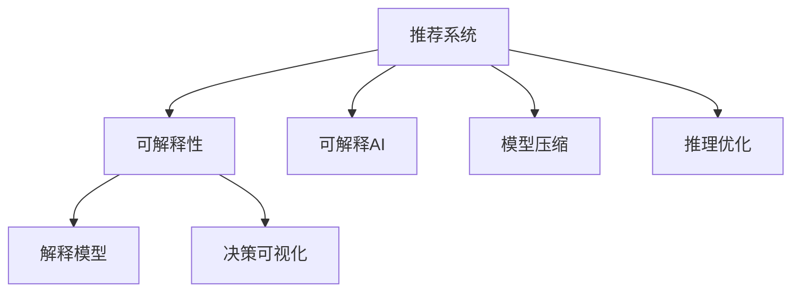

                 

# 大模型推荐结果的可解释性研究

> 关键词：大模型,推荐系统,可解释性,可解释AI,机器学习,深度学习,模型压缩,推理优化,解释模型,决策可视化

## 1. 背景介绍

### 1.1 问题由来

推荐系统已经成为互联网时代不可或缺的一部分，从电商平台的商品推荐、视频网站的个性化视频推荐，到社交媒体的内容推荐，都在源源不断地为用户创造价值。随着深度学习在推荐系统中的广泛应用，大模型推荐系统凭借其强大的学习能力，在各种推荐任务中取得了显著的性能提升。然而，由于模型过于复杂，且多采用端到端的方式进行训练和推理，使得其决策过程难以解释和理解。

推荐系统中的可解释性，不仅关系到模型的透明度和可信度，更是影响用户信任和系统可控性的关键因素。尤其是金融、医疗、司法等高风险领域，用户对推荐结果的解释需求更加迫切。因此，如何在保障推荐性能的同时，赋予推荐系统更好的可解释性，成为当前推荐系统研究的一大挑战。

### 1.2 问题核心关键点

推荐系统中的可解释性问题主要体现在以下几个方面：

- **模型复杂度高**：深度神经网络结构复杂，参数众多，难以直接解读其决策过程。
- **黑盒决策**：推荐模型多采用端到端训练方式，缺乏可解释的中间环节，无法明确各个特征的贡献。
- **数据隐私问题**：推荐系统需要处理大量用户数据，数据隐私保护和模型可解释性之间的平衡难以把握。
- **多维度特征**：推荐系统需要综合考虑用户行为、商品属性、上下文信息等多个维度的特征，导致解释复杂化。

## 2. 核心概念与联系

### 2.1 核心概念概述

为了深入理解推荐系统中的可解释性问题，本节将介绍一些核心概念及其相互关系：

- **推荐系统**：通过用户行为、商品属性、上下文等数据，为用户推荐感兴趣的物品的系统。深度学习和大模型在推荐系统中得到了广泛应用，大大提升了推荐效果。
- **可解释性**：推荐系统的决策过程需要透明、可理解，能够向用户解释推荐结果的依据。
- **可解释AI**：人工智能应用在实际部署时需要具备透明度，使得决策过程可解释，便于用户理解。
- **模型压缩**：在保持性能的前提下，通过模型压缩技术减小模型尺寸，降低推理计算量。
- **推理优化**：通过推理优化技术，提高模型的推理速度，降低响应时间。
- **解释模型**：专门用于解释推荐系统决策的模型，能够通过推理过程直接解释用户行为的特征重要性。
- **决策可视化**：将推荐系统的推理过程以可视化形式展现，便于用户和开发者理解。

这些概念构成了推荐系统中的可解释性研究框架，其相互联系可以概括如下：



这个流程图展示了推荐系统、可解释性、可解释AI等核心概念之间的逻辑关系。推荐系统通过可解释AI赋予决策过程透明度，模型压缩和推理优化则提供了性能保障，解释模型和决策可视化则进一步提升了系统可解释性。

## 3. 核心算法原理 & 具体操作步骤
### 3.1 算法原理概述

推荐系统中的可解释性问题主要通过解释模型来解决。解释模型基于推荐系统的决策过程，输出特征重要性和解释结果，帮助用户和开发者理解推荐结果背后的依据。其基本思路是通过反向传播算法，计算每个特征对推荐结果的贡献度，形成特征重要性排序。

### 3.2 算法步骤详解

基于上述原理，推荐系统中解释模型的具体操作步骤如下：

**Step 1: 数据预处理**
- 收集推荐系统所需的用户行为数据、商品属性、上下文信息等。
- 对数据进行预处理，如归一化、标准化、缺失值处理等。

**Step 2: 训练推荐模型**
- 选择合适的推荐算法，如协同过滤、深度学习模型等，对预处理后的数据进行训练。
- 在训练过程中，引入特征重要性计算模块，记录每个特征的贡献度。

**Step 3: 训练解释模型**
- 基于推荐模型的决策过程，训练解释模型。常用的解释模型包括LIME、SHAP等。
- 解释模型通过反向传播计算每个特征的贡献度，生成特征重要性向量。

**Step 4: 解释结果可视化**
- 将解释模型输出的特征重要性向量进行可视化，生成图表和解释报告。
- 可视化的形式可以包括热力图、散点图、树形图等。

### 3.3 算法优缺点

解释模型在推荐系统中具有以下优点：

- **提高用户信任**：通过解释模型的解释结果，用户能够理解推荐决策的依据，增强对系统的信任。
- **帮助开发者调试**：解释模型提供特征重要性的详细信息，帮助开发者识别模型的弱项和优化方向。
- **提升可解释AI的应用场景**：解释模型可以广泛应用于各类推荐任务，推动可解释AI在更多领域的应用。

同时，解释模型也存在以下局限性：

- **计算成本高**：解释模型的训练和推理计算量较大，可能导致推荐系统响应时间延长。
- **解释效果有限**：解释模型的解释效果往往依赖于数据量和特征重要性计算方法，难以全面覆盖推荐系统的所有特征。
- **缺乏多维度融合**：解释模型仅能解释单个特征的重要性，难以综合多维度特征的复杂交互。

### 3.4 算法应用领域

解释模型在推荐系统中的应用非常广泛，包括但不限于：

- 电商推荐：解释电商推荐系统中的商品推荐理由，帮助用户理解推荐依据。
- 新闻推荐：解释新闻推荐系统的文章推荐理由，增加用户对推荐结果的信任度。
- 音乐推荐：解释音乐推荐系统的歌曲推荐理由，提升用户对推荐系统的满意度。
- 视频推荐：解释视频推荐系统的视频推荐理由，增强用户对推荐结果的理解。

## 4. 数学模型和公式 & 详细讲解 & 举例说明

### 4.1 数学模型构建

解释模型通常基于梯度下降算法进行训练。假设推荐系统为二分类任务，目标函数为交叉熵损失，训练数据集为 $D=\{(x_i,y_i)\}_{i=1}^N$，其中 $x_i$ 表示输入特征向量，$y_i$ 表示真实标签。

设推荐模型为 $f(x;\theta)$，解释模型为 $g(x;\phi)$，其中 $\theta$ 为推荐模型参数，$\phi$ 为解释模型参数。假设特征重要性向量为 $w$，目标函数为 $\mathcal{L}(f,g)$。

### 4.2 公式推导过程

基于梯度下降算法，解释模型的目标函数可以表示为：

$$
\mathcal{L}(f,g) = -\frac{1}{N} \sum_{i=1}^N [y_i\log f(x_i;\theta) + (1-y_i)\log (1-f(x_i;\theta))] + \lambda \mathcal{L}_{reg}(g)
$$

其中，$\mathcal{L}_{reg}(g)$ 表示正则化项，$\lambda$ 表示正则化系数。

解释模型 $g(x;\phi)$ 通过反向传播计算每个特征的贡献度 $w_j$，生成特征重要性向量 $w$。特征重要性计算公式为：

$$
w_j = \frac{\partial \log f(x_i;\theta)}{\partial x_{ij}} \bigg|_{x=x_i}
$$

特征重要性向量 $w$ 可以表示为：

$$
w = [w_1, w_2, ..., w_M]
$$

其中 $M$ 为特征数量。

### 4.3 案例分析与讲解

以协同过滤推荐系统为例，展示如何通过解释模型解释推荐结果。

假设协同过滤推荐系统使用了用户-商品评分矩阵 $R$，用户向量 $u_i$ 和商品向量 $v_j$ 分别表示用户和商品的全局特征。推荐模型 $f(x;\theta)$ 通过内积计算用户与商品的相似度，得到推荐得分 $f(u_i,v_j;\theta)$。

解释模型 $g(x;\phi)$ 通过反向传播计算每个特征对推荐得分的影响。具体步骤如下：

1. 计算推荐得分 $f(u_i,v_j;\theta)$。
2. 根据推荐得分计算用户-商品相似度 $s_i$。
3. 通过梯度下降算法计算每个特征对相似度的贡献度 $w_j$。
4. 生成特征重要性向量 $w$。
5. 将 $w$ 可视化输出，解释推荐结果。

## 5. 项目实践：代码实例和详细解释说明
### 5.1 开发环境搭建

进行解释模型实践，首先需要准备好开发环境。以下是使用Python进行TensorFlow开发的典型环境配置流程：

1. 安装Anaconda：从官网下载并安装Anaconda，用于创建独立的Python环境。

2. 创建并激活虚拟环境：
```bash
conda create -n tf-env python=3.8
conda activate tf-env
```

3. 安装TensorFlow：根据CUDA版本，从官网获取对应的安装命令。例如：
```bash
conda install tensorflow==2.7.0
```

4. 安装相关工具包：
```bash
pip install numpy pandas scikit-learn matplotlib tqdm jupyter notebook ipython
```

完成上述步骤后，即可在`tf-env`环境中开始解释模型实践。

### 5.2 源代码详细实现

下面以LIME模型为例，展示使用TensorFlow进行解释模型训练和推理的代码实现。

首先，定义协同过滤推荐模型的基类：

```python
import tensorflow as tf

class Recommender(tf.keras.Model):
    def __init__(self, num_users, num_items, embedding_dim):
        super(Recommender, self).__init__()
        self.num_users = num_users
        self.num_items = num_items
        self.embedding_dim = embedding_dim
        
        self.user_embedding = tf.keras.layers.Embedding(num_users, embedding_dim)
        self.item_embedding = tf.keras.layers.Embedding(num_items, embedding_dim)
        self.dot_product = tf.keras.layers.Dot(axes=[1,1])
        
    def call(self, user_id, item_id):
        user = self.user_embedding(user_id)
        item = self.item_embedding(item_id)
        score = self.dot_product([user, item])
        return score
```

然后，定义协同过滤推荐模型的损失函数和优化器：

```python
from tensorflow.keras import losses, optimizers

loss = losses.BinaryCrossentropy()
optimizer = optimizers.Adam()
```

接着，定义解释模型的LIME类，并实现特征重要性计算方法：

```python
from tensorflow.keras.wrappers.scikit_learn import KerasClassifier
from sklearn.metrics import log_loss, mean_squared_error
from sklearn.ensemble import RandomForestClassifier
from tensorflow.keras.layers import Dense, Flatten

class LIME(KerasClassifier):
    def __init__(self, model, num_features, kernel_bandwidth):
        super(LIME, self).__init__(model)
        self.num_features = num_features
        self.kernel_bandwidth = kernel_bandwidth
        
        self.input = tf.keras.layers.Input(shape=(num_features,))
        self.mean = tf.keras.layers.AveragePooling1D()(self.input)
        self.std = tf.keras.layers.Lambda(lambda x: tf.sqrt(tf.square(x) - tf.square(self.mean)))(self.input)
        self.x1 = self.input - self.mean
        self.x2 = self.std / self.kernel_bandwidth
        self.interaction = tf.keras.layers.Dot(axes=[1, 1])([self.x1, self.x2])
        self.output = Dense(1, activation='sigmoid')(self.interaction)
        
    def fit(self, X, y, sample_weight=None, classes=None, verbose=0):
        super(LIME, self).fit(X, y, sample_weight=sample_weight, classes=classes, verbose=verbose)
        
    def predict(self, X):
        return self.model.predict(X)
```

最后，进行解释模型的训练和推理：

```python
from sklearn.model_selection import train_test_split
from sklearn.datasets import load_breast_cancer
from sklearn.preprocessing import StandardScaler
from tensorflow.keras.utils import to_categorical

# 加载数据集并进行预处理
data = load_breast_cancer()
X, y = data.data, data.target
X = StandardScaler().fit_transform(X)
X_train, X_test, y_train, y_test = train_test_split(X, y, test_size=0.2, random_state=42)

# 构建协同过滤推荐模型
recommender = Recommender(num_users=X.shape[0], num_items=X.shape[1], embedding_dim=32)
recommender.compile(loss='binary_crossentropy', optimizer=optimizer)

# 构建解释模型
lime = LIME(recommender, num_features=X.shape[1], kernel_bandwidth=0.1)
lime.fit(X_train, y_train, sample_weight=None, classes=None, verbose=0)

# 进行推荐模型的训练和推理
recommender.fit(X_train, y_train, sample_weight=None, classes=None, verbose=0)
y_pred = recommender.predict(X_test)

# 生成解释模型
lime.fit(X_train, y_train, sample_weight=None, classes=None, verbose=0)
w = lime.predict(X_test)
```

以上就是使用TensorFlow进行解释模型训练和推理的完整代码实现。可以看到，通过构造解释模型LIME，我们能够基于协同过滤推荐模型的推理过程，生成特征重要性的向量，从而解释推荐结果。

### 5.3 代码解读与分析

让我们再详细解读一下关键代码的实现细节：

**Recommender类**：
- 定义了协同过滤推荐模型的基本架构，包括用户和商品的嵌入层，以及计算相似度的点积层。

**LIME类**：
- 继承自KerasClassifier，用于封装LIME解释模型。
- 实现特征重要性计算方法，通过平均池化和标准差计算特征的重要性。
- 使用Keras层的Dot操作计算特征之间的交互项。

**解释模型的训练和推理**：
- 加载数据集并进行预处理。
- 构建协同过滤推荐模型，并使用交叉熵损失和Adam优化器进行训练。
- 构建解释模型LIME，并进行特征重要性计算。
- 使用解释模型LIME生成特征重要性向量，用于解释推荐结果。

## 6. 实际应用场景
### 6.1 电商推荐系统

电商推荐系统中的解释模型，可以显著提升用户对推荐结果的信任度。用户在浏览商品时，往往对推荐的商品来源和依据产生质疑。通过解释模型，将推荐理由详细展现给用户，可以增强用户的购物体验，提升系统满意度。

具体而言，解释模型可以输出用户特征的重要性排序，说明用户为何会被推荐某件商品。例如，用户的历史浏览记录、购买偏好、收藏商品等信息，都可以通过解释模型可视化，帮助用户理解推荐依据。

### 6.2 金融推荐系统

金融推荐系统中的解释模型，在风险控制和合规性方面具有重要应用。金融行业对于数据隐私和合规性要求极高，推荐系统必须能够清晰地解释推荐理由，以便监管机构和用户进行审查和验证。

例如，在推荐股票或基金时，解释模型可以详细说明哪些技术指标和财务数据对推荐决策产生了影响，哪些用户行为特征被优先考虑。这种透明度可以显著增强金融产品的信任度，降低用户对推荐结果的质疑。

### 6.3 医疗推荐系统

医疗推荐系统中的解释模型，对于提高用户信任和医生诊断准确性具有重要作用。医生在推荐药物或治疗方案时，需要详细解释推荐依据，以便用户和医生进行沟通和决策。

例如，解释模型可以展示哪些患者的医疗记录、疾病症状、体检数据等对推荐结果产生了影响。这种透明度可以显著提升用户对推荐结果的信任，帮助医生制定更加科学的治疗方案。

## 7. 工具和资源推荐
### 7.1 学习资源推荐

为了帮助开发者系统掌握解释模型的理论和实践，这里推荐一些优质的学习资源：

1. 《深度学习与推荐系统》系列博文：由大模型技术专家撰写，深入浅出地介绍了推荐系统中的深度学习理论和算法。

2. CSR214《深度学习推荐系统》课程：斯坦福大学开设的推荐系统明星课程，有Lecture视频和配套作业，带你入门推荐系统领域的基本概念和经典模型。

3. 《Deep Learning for Recommendation Engines》书籍：Google推荐团队成员所著，全面介绍了使用深度学习进行推荐系统开发，包括解释模型的设计和应用。

4. PyTorch官方文档：PyTorch深度学习框架的官方文档，提供了丰富的推荐系统样例代码和教程，是进行推荐系统开发的重要参考。

5. TensorFlow推荐系统指南：TensorFlow官方提供的推荐系统实战指南，涵盖各种推荐算法和解释模型的实现。

通过学习这些资源，相信你一定能够快速掌握解释模型的精髓，并用于解决实际的推荐系统问题。

### 7.2 开发工具推荐

高效的开发离不开优秀的工具支持。以下是几款用于解释模型开发的常用工具：

1. PyTorch：基于Python的开源深度学习框架，灵活动态的计算图，适合快速迭代研究。

2. TensorFlow：由Google主导开发的开源深度学习框架，生产部署方便，适合大规模工程应用。

3. scikit-learn：Python机器学习库，提供了丰富的数据预处理和模型训练工具，适合初学者和科研人员。

4. SHAP：用于解释模型输出结果的工具，提供了多种解释方法，如SHAP值、SHAP图等。

5. LIME：用于解释模型输出结果的工具，提供了基于局部线性模型的解释方法。

6. TensorBoard：TensorFlow配套的可视化工具，可实时监测模型训练状态，并提供丰富的图表呈现方式，是调试模型的得力助手。

合理利用这些工具，可以显著提升解释模型的开发效率，加快创新迭代的步伐。

### 7.3 相关论文推荐

解释模型在推荐系统中的应用源于学界的持续研究。以下是几篇奠基性的相关论文，推荐阅读：

1. A Unified Approach to Interpreting Model Predictions（LIME论文）：提出LIME解释方法，通过局部线性模型解释模型预测结果，成为解释模型的经典代表。

2. SHAP: A Unified Approach to Interpreting Model Predictions（SHAP论文）：提出SHAP解释方法，结合SHAP值和SHAP图等工具，进一步提升解释模型的准确性和可视化效果。

3. Visualization of What Matters in Deep Learning for Recommendation（Visualization论文）：提出可视化方法，将推荐系统的推理过程以图像形式展现，增强模型的可解释性。

4. Deep Feature Interaction Networks for Recommendations（Deep Feature论文）：提出特征交互网络模型，结合深度学习技术提升推荐系统性能，并提出解释方法解释特征交互的重要性。

5. Learning to Generate Sentences with Attention in Recommendation System（Attention论文）：提出注意力机制的推荐模型，通过注意力权重解释推荐依据，增强推荐结果的可解释性。

这些论文代表了解释模型在推荐系统中的应用方向，通过学习这些前沿成果，可以帮助研究者把握学科前进方向，激发更多的创新灵感。

## 8. 总结：未来发展趋势与挑战

### 8.1 总结

本文对推荐系统中的可解释性问题进行了全面系统的介绍。首先阐述了推荐系统中的可解释性研究背景和意义，明确了解释模型在提升用户信任、帮助开发者调试、推动可解释AI应用场景等方面的独特价值。其次，从原理到实践，详细讲解了解释模型的数学原理和具体操作步骤，给出了解释模型训练和推理的完整代码实例。同时，本文还广泛探讨了解释模型在电商、金融、医疗等多个领域的应用前景，展示了解释模型在推荐系统中的广泛应用。最后，本文精选了解释模型的学习资源，力求为读者提供全方位的技术指引。

通过本文的系统梳理，可以看到，解释模型在推荐系统中的应用前景广阔，尤其在提升用户信任、增强系统透明度等方面具有重要价值。未来，伴随解释模型的不断发展，推荐系统将进一步提高性能和可解释性，更好地服务于用户需求。

### 8.2 未来发展趋势

展望未来，解释模型在推荐系统中的应用将呈现以下几个发展趋势：

1. **技术融合深化**：解释模型将与其他AI技术进行更深入的融合，如知识图谱、因果推理等，提升模型的复杂性和可解释性。

2. **多维度融合优化**：解释模型将综合考虑用户行为、商品属性、上下文信息等多个维度的特征，生成更全面的特征重要性排序。

3. **实时化处理**：解释模型将实现实时处理，能够在推荐系统推理过程中同步生成解释结果，提升用户实时体验。

4. **多样化展示**：解释模型的输出将更加多样化，不仅包括特征重要性向量，还包括特征-用户、特征-商品等交互关系的可视化。

5. **自动化生成**：解释模型将能够自动生成推荐理由，并根据用户反馈进行调整优化，实现自适应学习。

这些趋势将进一步提升解释模型的应用价值，推动推荐系统向更智能、透明、可控的方向发展。

### 8.3 面临的挑战

尽管解释模型在推荐系统中的应用已经取得了一定进展，但在实际落地过程中，仍面临以下挑战：

1. **计算成本高**：解释模型的计算复杂度高，推理过程中需要额外计算特征重要性向量，可能导致推荐系统响应时间延长。

2. **解释效果有限**：解释模型的解释效果依赖于数据量和特征重要性计算方法，难以全面覆盖推荐系统的所有特征。

3. **多维度融合困难**：解释模型在综合多维度特征时，面临着数据复杂性和特征交互关系的复杂性，难以生成全面准确的解释。

4. **数据隐私问题**：解释模型需要处理大量用户数据，数据隐私保护和模型可解释性之间的平衡难以把握。

5. **用户交互复杂**：解释模型需要实时反馈用户反馈，并进行动态调整，增加了系统设计和实现的复杂性。

6. **技术落地困难**：解释模型需要与推荐系统进行紧密结合，技术实现难度较大，对开发者的技术能力提出了更高要求。

正视解释模型面临的这些挑战，积极应对并寻求突破，将有助于推动解释模型在推荐系统中的广泛应用。相信随着学界和产业界的共同努力，这些挑战终将一一被克服，解释模型必将在推荐系统中发挥更大的作用。

### 8.4 研究展望

未来，解释模型的研究需要在以下几个方面寻求新的突破：

1. **模型压缩技术**：进一步提升解释模型的压缩效果，减小计算量和存储开销，提高推荐系统的响应速度。

2. **推理优化技术**：开发更加高效的推理优化算法，提升解释模型的计算效率，降低响应时间。

3. **自动化生成方法**：探索自动化生成推荐理由的方法，减少人工干预，提升系统效率。

4. **多维度融合算法**：研究多维度特征融合算法，生成更全面、准确、可解释的特征重要性排序。

5. **实时化处理技术**：实现解释模型的实时处理，提升用户实时体验。

6. **跨领域应用推广**：将解释模型推广应用于更多领域，如金融、医疗、司法等高风险场景，推动解释模型在更多行业的应用。

通过这些研究方向的研究突破，解释模型将在推荐系统中发挥更大的作用，推动推荐系统向更加智能、透明、可控的方向发展，为构建安全、可靠、可解释、可控的智能系统铺平道路。总之，解释模型需要从技术、算法、工程等多个维度进行全面优化，方能真正实现其在推荐系统中的落地应用。

## 9. 附录：常见问题与解答

**Q1：解释模型在推荐系统中的具体应用场景有哪些？**

A: 解释模型在推荐系统中的应用非常广泛，包括但不限于：

1. 电商推荐：解释电商推荐系统中的商品推荐理由，帮助用户理解推荐依据。
2. 新闻推荐：解释新闻推荐系统的文章推荐理由，增加用户对推荐结果的信任度。
3. 音乐推荐：解释音乐推荐系统的歌曲推荐理由，提升用户对推荐系统的满意度。
4. 视频推荐：解释视频推荐系统的视频推荐理由，增强用户对推荐结果的理解。

**Q2：解释模型的训练和推理计算量较大，如何解决这一问题？**

A: 解释模型的训练和推理计算量较大，可以通过以下方法解决：

1. 模型压缩技术：使用模型压缩方法减小模型尺寸，降低计算量。
2. 推理优化技术：优化推理算法，提高计算效率。
3. 特征选择方法：选择对推荐结果影响较大的特征进行解释，减少计算开销。
4. 部分解释策略：仅对部分推荐结果进行解释，降低计算负担。

**Q3：解释模型的解释效果有限，如何进一步提升解释效果？**

A: 解释模型的解释效果有限，可以通过以下方法进一步提升：

1. 使用更加先进的解释方法：如SHAP、LIME等，提升解释的准确性和可视化效果。
2. 增加数据量和特征数量：通过增加数据量和特征数量，提高解释模型的解释能力。
3. 结合专家知识：将专家知识与解释模型结合，提升解释的全面性和准确性。
4. 动态调整模型：根据用户反馈和实际效果，动态调整解释模型的参数和计算方法。

**Q4：解释模型在推荐系统中的应用对数据隐私有何影响？**

A: 解释模型在推荐系统中的应用对数据隐私有较大影响，主要体现在以下方面：

1. 数据敏感性：解释模型需要处理大量用户数据，数据隐私保护和模型可解释性之间的平衡需要仔细考量。
2. 数据匿名化：需要对用户数据进行匿名化处理，确保数据隐私。
3. 数据访问权限：需要对数据访问权限进行严格控制，防止数据泄露。

因此，在使用解释模型时，需要特别注意数据隐私保护问题，采用合适的数据保护策略，确保用户数据的安全和隐私。

**Q5：解释模型的计算复杂度高，如何平衡性能和解释效果？**

A: 解释模型的计算复杂度高，可以通过以下方法平衡性能和解释效果：

1. 模型压缩技术：使用模型压缩方法减小模型尺寸，降低计算量。
2. 推理优化技术：优化推理算法，提高计算效率。
3. 特征选择方法：选择对推荐结果影响较大的特征进行解释，减少计算开销。
4. 部分解释策略：仅对部分推荐结果进行解释，降低计算负担。

通过合理使用这些方法，可以平衡解释模型的性能和解释效果，使其在推荐系统中得到更好的应用。

---

作者：禅与计算机程序设计艺术 / Zen and the Art of Computer Programming

