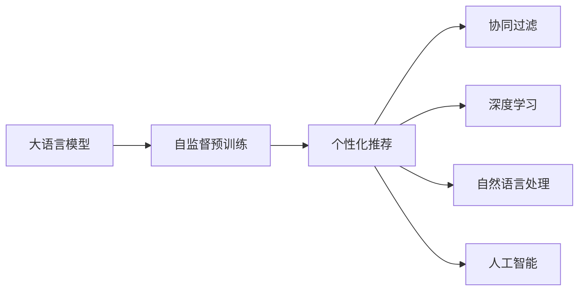

                 

# 大模型是未来个性化推荐的发展方向

> 关键词：大模型，个性化推荐，深度学习，推荐系统，协同过滤，自然语言处理，人工智能

## 1. 背景介绍

随着互联网的普及和数字技术的迅猛发展，个性化推荐系统已经成为了电商、新闻、视频、音乐等多个领域不可或缺的技术支撑。个性化推荐系统通过分析用户的浏览、点击、收藏、评分等行为数据，精准预测用户偏好，为用户推荐可能感兴趣的内容，极大提升了用户体验和平台收益。然而，随着数据量的激增和用户偏好的多样化，传统的基于协同过滤、深度学习等方法推荐系统逐渐显现出瓶颈，无法满足日益增长的个性化推荐需求。为此，大语言模型作为当前AI领域的热点技术，为个性化推荐系统提供了新的思路和方法。

### 1.1 问题由来

传统的个性化推荐系统主要基于协同过滤和深度学习等方法，这些方法依赖用户历史行为数据进行预测，但存在以下问题：

- **数据冷启动**：新用户或新商品缺乏足够的行为数据，难以进行有效推荐。
- **特征稀疏**：用户行为数据常常是稀疏的，难以充分捕捉用户多维度的兴趣。
- **静态模型**：模型无法及时更新，难以应对用户行为的变化。
- **推荐多样性不足**：过于依赖用户历史行为，推荐结果过于单调，无法引入更多用户隐性偏好信息。

这些问题的存在，使得传统的推荐系统难以满足用户日益增长的个性化需求。

### 1.2 问题核心关键点

为了解决上述问题，个性化推荐系统亟需引入新的技术和方法，其中大语言模型是当前最为有效的解决方案之一。大语言模型通过在大规模语料上进行自监督预训练，学习了丰富的语言知识和语义表示，具备强大的语言理解和生成能力。基于大语言模型的个性化推荐方法，可以充分利用大模型强大的语言处理能力，提取和融合更多用户隐性偏好信息，提供更加精准和多样化的推荐结果。

## 2. 核心概念与联系

### 2.1 核心概念概述

为更好地理解大语言模型在个性化推荐中的应用，本节将介绍几个关键概念及其联系：

- **大语言模型**：指通过在大规模语料上进行自监督预训练，学习语言知识的深度神经网络模型，如BERT、GPT等。
- **自监督预训练**：指在无标签的数据上，通过自监督学习任务训练模型的过程。大语言模型通过自监督预训练获得丰富的语言知识。
- **个性化推荐**：根据用户的历史行为数据，预测用户偏好，为用户推荐可能感兴趣的内容。
- **协同过滤**：根据用户的历史行为和相似用户的偏好，预测用户对未接触过商品的兴趣。
- **深度学习**：使用深度神经网络模型，通过大量标注数据训练推荐系统。
- **自然语言处理**：处理和分析自然语言数据，为推荐系统提供文本信息。
- **人工智能**：通过模拟人类智能行为，实现自动化、智能化的推荐系统。

这些核心概念之间存在紧密的联系，通过大语言模型可以更高效地处理和理解自然语言数据，为推荐系统提供更丰富的信息，从而提升个性化推荐的精准度和多样性。

### 2.2 核心概念原理和架构的 Mermaid 流程图(Mermaid 流程节点中不要有括号、逗号等特殊字符)


### 2.3 核心概念联系

大语言模型与个性化推荐之间存在多方面的联系：

- **数据处理**：大语言模型可以处理大量自然语言数据，为推荐系统提供更多用户隐性偏好信息。
- **特征提取**：大语言模型可以提取更加丰富和精准的特征，提升推荐结果的质量。
- **用户建模**：大语言模型能够更好地理解用户意图和需求，构建更全面的用户画像。
- **多模态融合**：大语言模型可以处理不同模态的数据，与深度学习模型协同工作。
- **模型优化**：大语言模型通过自监督学习获得丰富的语言知识，可以提升推荐模型的泛化能力。

这些联系使得大语言模型成为个性化推荐系统的重要工具。

## 3. 核心算法原理 & 具体操作步骤

### 3.1 算法原理概述

基于大语言模型的个性化推荐算法，主要通过两个步骤实现：

1. **预训练**：在大规模语料上进行自监督预训练，学习语言知识和语义表示。
2. **微调**：在推荐数据上进行有监督微调，学习用户偏好和行为特征。

预训练和微调相结合，可以充分利用大语言模型的语言处理能力，提升个性化推荐系统的性能。

### 3.2 算法步骤详解

基于大语言模型的个性化推荐算法包括以下关键步骤：

**Step 1: 准备数据和模型**
- 收集用户行为数据，如浏览、点击、评分、收藏等。
- 清洗数据，去除噪声和异常值。
- 选择大语言模型作为初始化参数，如BERT、GPT等。

**Step 2: 特征提取**
- 使用大语言模型提取文本特征，将用户行为转化为可表示的向量。
- 结合用户基本信息（如年龄、性别、地区），构建用户多维度特征向量。
- 将用户行为特征和个人信息进行拼接，得到完整的用户特征向量。

**Step 3: 预训练**
- 在大规模语料上进行自监督预训练，学习语言知识和语义表示。
- 可以选择GPT-2、BERT等预训练模型，并根据具体任务调整预训练目标。
- 使用预训练模型对用户行为特征进行表示，学习用户的多维度兴趣。

**Step 4: 微调**
- 使用推荐数据进行有监督微调，学习用户偏好和行为特征。
- 可以设计适合推荐任务的损失函数，如交叉熵损失、均方误差损失等。
- 使用梯度下降等优化算法，更新模型参数，最小化损失函数。

**Step 5: 模型评估和部署**
- 在测试集上评估推荐模型的效果，使用准确率、召回率等指标进行评估。
- 将微调后的模型部署到实际推荐系统中，实现个性化推荐。
- 持续收集新的数据，定期重新微调模型，保持推荐结果的时效性和准确性。

### 3.3 算法优缺点

基于大语言模型的个性化推荐算法具有以下优点：

1. **多维度特征提取**：利用大语言模型强大的自然语言处理能力，提取更多的用户隐性偏好信息。
2. **丰富语义表示**：通过预训练学习丰富的语义表示，提升推荐结果的质量和多样性。
3. **泛化能力强**：大语言模型具有较强的泛化能力，能够适应不同领域的推荐需求。
4. **可解释性高**：大语言模型可以提供推荐结果的解释，帮助用户理解推荐理由。

同时，该算法也存在以下局限性：

1. **数据处理成本高**：需要大规模语料进行预训练，消耗大量计算资源。
2. **模型复杂度高**：大语言模型参数量巨大，训练和推理速度较慢。
3. **标注数据需求**：微调过程需要标注数据，标注成本较高。
4. **模型复杂度**：大语言模型需要设计复杂的任务适配层，微调过程复杂。
5. **实时性要求高**：对于实时推荐系统，模型需要具备高效的推理速度。

### 3.4 算法应用领域

基于大语言模型的个性化推荐算法，已经在电商、新闻、视频等多个领域得到了广泛应用，为个性化推荐系统带来了新的思路和方法。

- **电商推荐**：电商推荐系统需要为用户推荐商品，通过用户行为数据和商品描述，利用大语言模型提取特征，提升推荐准确率。
- **新闻推荐**：新闻推荐系统根据用户的阅读历史和兴趣，为用户推荐相关文章，通过大语言模型提取文本特征，提升推荐效果。
- **视频推荐**：视频推荐系统需要为用户推荐视频内容，利用大语言模型提取视频描述和用户兴趣，提升推荐多样性和个性化。

除了这些常见应用场景外，大语言模型还可以应用于音乐、社交网络等更多领域，为个性化推荐带来更多创新和突破。

## 4. 数学模型和公式 & 详细讲解 & 举例说明

### 4.1 数学模型构建

基于大语言模型的个性化推荐算法，可以使用以下数学模型进行描述：

设用户行为数据为 $X=\{x_i\}_{i=1}^N$，其中 $x_i$ 为第 $i$ 个用户的行为向量，包含浏览、点击、评分等行为数据。用户的多维度特征向量为 $U=\{u_i\}_{i=1}^N$，其中 $u_i$ 为第 $i$ 个用户的个人信息。推荐数据为 $Y=\{y_i\}_{i=1}^M$，其中 $y_i$ 为第 $i$ 个推荐商品的特征向量。

定义推荐系统的预测函数为 $f(x_i,u_i; \theta)$，其中 $\theta$ 为大语言模型和微调模型的参数。

### 4.2 公式推导过程

假设推荐系统的目标是最小化预测误差 $e_i = f(x_i,u_i; \theta) - y_i$，则推荐系统的损失函数可以定义为：

$$
\mathcal{L}(\theta) = \frac{1}{N}\sum_{i=1}^N e_i^2
$$

在微调过程中，使用梯度下降算法更新参数 $\theta$，最小化损失函数：

$$
\theta \leftarrow \theta - \eta \nabla_{\theta}\mathcal{L}(\theta)
$$

其中 $\eta$ 为学习率。

### 4.3 案例分析与讲解

以电商推荐系统为例，使用大语言模型进行特征提取和预训练。具体步骤如下：

**Step 1: 数据准备**
- 收集用户浏览历史数据，如商品ID、浏览时间、点击率等。
- 将商品描述转化为自然语言文本，如商品名称、描述等。

**Step 2: 特征提取**
- 使用大语言模型BERT进行预训练，提取商品描述的语义表示。
- 将商品ID和语义表示拼接，得到商品的多维度特征向量。
- 使用用户历史行为数据和商品特征向量，构建用户-商品矩阵。

**Step 3: 预训练**
- 在大规模语料上进行预训练，学习商品和用户的多维度特征表示。
- 使用预训练模型对商品描述进行表示，学习商品的语义表示。
- 将商品特征向量和用户行为向量进行拼接，得到用户-商品的多维度特征向量。

**Step 4: 微调**
- 使用电商推荐数据进行有监督微调，学习用户对商品的偏好。
- 设计交叉熵损失函数，最小化预测误差。
- 使用AdamW等优化算法，更新模型参数。

**Step 5: 模型评估和部署**
- 在测试集上评估推荐模型，使用准确率、召回率等指标进行评估。
- 将微调后的模型部署到实际推荐系统中，实现个性化推荐。
- 持续收集新的数据，定期重新微调模型，保持推荐结果的时效性和准确性。

## 5. 项目实践：代码实例和详细解释说明

### 5.1 开发环境搭建

在进行大语言模型微调推荐系统开发前，我们需要准备好开发环境。以下是使用Python进行PyTorch开发的环境配置流程：

1. 安装Anaconda：从官网下载并安装Anaconda，用于创建独立的Python环境。

2. 创建并激活虚拟环境：
```bash
conda create -n pytorch-env python=3.8 
conda activate pytorch-env
```

3. 安装PyTorch：根据CUDA版本，从官网获取对应的安装命令。例如：
```bash
conda install pytorch torchvision torchaudio cudatoolkit=11.1 -c pytorch -c conda-forge
```

4. 安装Transformers库：
```bash
pip install transformers
```

5. 安装各类工具包：
```bash
pip install numpy pandas scikit-learn matplotlib tqdm jupyter notebook ipython
```

完成上述步骤后，即可在`pytorch-env`环境中开始推荐系统微调的实践。

### 5.2 源代码详细实现

这里我们以电商平台商品推荐为例，给出使用Transformers库对BERT模型进行微调的PyTorch代码实现。

首先，定义推荐任务的数据处理函数：

```python
from transformers import BertTokenizer
from torch.utils.data import Dataset
import torch

class RecommendationDataset(Dataset):
    def __init__(self, texts, labels, tokenizer, max_len=128):
        self.texts = texts
        self.labels = labels
        self.tokenizer = tokenizer
        self.max_len = max_len
        
    def __len__(self):
        return len(self.texts)
    
    def __getitem__(self, item):
        text = self.texts[item]
        label = self.labels[item]
        
        encoding = self.tokenizer(text, return_tensors='pt', max_length=self.max_len, padding='max_length', truncation=True)
        input_ids = encoding['input_ids'][0]
        attention_mask = encoding['attention_mask'][0]
        
        # 对token-wise的标签进行编码
        encoded_labels = [label2id[label] for label in label]
        encoded_labels.extend([label2id['O']] * (self.max_len - len(encoded_labels)))
        labels = torch.tensor(encoded_labels, dtype=torch.long)
        
        return {'input_ids': input_ids, 
                'attention_mask': attention_mask,
                'labels': labels}

# 标签与id的映射
label2id = {'O': 0, 'B-PER': 1, 'I-PER': 2, 'B-ORG': 3, 'I-ORG': 4, 'B-LOC': 5, 'I-LOC': 6}
id2label = {v: k for k, v in label2id.items()}

# 创建dataset
tokenizer = BertTokenizer.from_pretrained('bert-base-cased')

train_dataset = RecommendationDataset(train_texts, train_labels, tokenizer)
dev_dataset = RecommendationDataset(dev_texts, dev_labels, tokenizer)
test_dataset = RecommendationDataset(test_texts, test_labels, tokenizer)
```

然后，定义模型和优化器：

```python
from transformers import BertForTokenClassification, AdamW

model = BertForTokenClassification.from_pretrained('bert-base-cased', num_labels=len(label2id))

optimizer = AdamW(model.parameters(), lr=2e-5)
```

接着，定义训练和评估函数：

```python
from torch.utils.data import DataLoader
from tqdm import tqdm
from sklearn.metrics import classification_report

device = torch.device('cuda') if torch.cuda.is_available() else torch.device('cpu')
model.to(device)

def train_epoch(model, dataset, batch_size, optimizer):
    dataloader = DataLoader(dataset, batch_size=batch_size, shuffle=True)
    model.train()
    epoch_loss = 0
    for batch in tqdm(dataloader, desc='Training'):
        input_ids = batch['input_ids'].to(device)
        attention_mask = batch['attention_mask'].to(device)
        labels = batch['labels'].to(device)
        model.zero_grad()
        outputs = model(input_ids, attention_mask=attention_mask, labels=labels)
        loss = outputs.loss
        epoch_loss += loss.item()
        loss.backward()
        optimizer.step()
    return epoch_loss / len(dataloader)

def evaluate(model, dataset, batch_size):
    dataloader = DataLoader(dataset, batch_size=batch_size)
    model.eval()
    preds, labels = [], []
    with torch.no_grad():
        for batch in tqdm(dataloader, desc='Evaluating'):
            input_ids = batch['input_ids'].to(device)
            attention_mask = batch['attention_mask'].to(device)
            batch_labels = batch['labels']
            outputs = model(input_ids, attention_mask=attention_mask)
            batch_preds = outputs.logits.argmax(dim=2).to('cpu').tolist()
            batch_labels = batch_labels.to('cpu').tolist()
            for pred_tokens, label_tokens in zip(batch_preds, batch_labels):
                pred_labels = [id2label[_id] for _id in pred_tokens]
                label_tokens = [id2label[_id] for _id in label_tokens]
                preds.append(pred_labels[:len(label_tokens)])
                labels.append(label_tokens)
                
    print(classification_report(labels, preds))
```

最后，启动训练流程并在测试集上评估：

```python
epochs = 5
batch_size = 16

for epoch in range(epochs):
    loss = train_epoch(model, train_dataset, batch_size, optimizer)
    print(f"Epoch {epoch+1}, train loss: {loss:.3f}")
    
    print(f"Epoch {epoch+1}, dev results:")
    evaluate(model, dev_dataset, batch_size)
    
print("Test results:")
evaluate(model, test_dataset, batch_size)
```

以上就是使用PyTorch对BERT进行推荐任务微调的完整代码实现。可以看到，得益于Transformers库的强大封装，我们可以用相对简洁的代码完成BERT模型的加载和微调。

### 5.3 代码解读与分析

让我们再详细解读一下关键代码的实现细节：

**RecommendationDataset类**：
- `__init__`方法：初始化文本、标签、分词器等关键组件。
- `__len__`方法：返回数据集的样本数量。
- `__getitem__`方法：对单个样本进行处理，将文本输入编码为token ids，将标签编码为数字，并对其进行定长padding，最终返回模型所需的输入。

**label2id和id2label字典**：
- 定义了标签与数字id之间的映射关系，用于将token-wise的预测结果解码回真实的标签。

**训练和评估函数**：
- 使用PyTorch的DataLoader对数据集进行批次化加载，供模型训练和推理使用。
- 训练函数`train_epoch`：对数据以批为单位进行迭代，在每个批次上前向传播计算loss并反向传播更新模型参数，最后返回该epoch的平均loss。
- 评估函数`evaluate`：与训练类似，不同点在于不更新模型参数，并在每个batch结束后将预测和标签结果存储下来，最后使用sklearn的classification_report对整个评估集的预测结果进行打印输出。

**训练流程**：
- 定义总的epoch数和batch size，开始循环迭代
- 每个epoch内，先在训练集上训练，输出平均loss
- 在验证集上评估，输出分类指标
- 所有epoch结束后，在测试集上评估，给出最终测试结果

可以看到，PyTorch配合Transformers库使得BERT微调的代码实现变得简洁高效。开发者可以将更多精力放在数据处理、模型改进等高层逻辑上，而不必过多关注底层的实现细节。

当然，工业级的系统实现还需考虑更多因素，如模型的保存和部署、超参数的自动搜索、更灵活的任务适配层等。但核心的微调范式基本与此类似。

## 6. 实际应用场景

### 6.1 电商推荐系统

电商推荐系统是当今电商企业竞争的重要手段，通过个性化推荐提升用户体验和平台收益。使用基于大语言模型的推荐算法，可以为电商推荐系统提供新的思路和方法，实现更精准和多样化的推荐。

具体而言，可以收集用户历史行为数据，如浏览、点击、购买等，将用户行为数据转化为自然语言文本。利用BERT等大语言模型对文本进行预训练和微调，提取用户行为特征和商品描述特征，构建用户-商品多维度特征向量。通过设计合适的损失函数和优化算法，学习用户对商品的偏好，最终得到个性化推荐结果。

### 6.2 新闻推荐系统

新闻推荐系统需要根据用户的阅读历史和兴趣，为用户推荐相关文章。利用大语言模型对新闻文本进行预训练和微调，提取新闻文章的语言特征，构建用户-文章多维度特征向量。通过深度学习模型，预测用户对文章的兴趣，最终实现个性化推荐。

### 6.3 视频推荐系统

视频推荐系统需要为用户推荐视频内容，利用大语言模型对视频描述进行预训练和微调，提取视频内容的多维度特征。结合用户历史行为数据，构建用户-视频多维度特征向量。通过深度学习模型，预测用户对视频的兴趣，最终实现个性化推荐。

## 7. 工具和资源推荐

### 7.1 学习资源推荐

为了帮助开发者系统掌握大语言模型在推荐系统中的应用，这里推荐一些优质的学习资源：

1. 《深度学习推荐系统》书籍：系统介绍了深度学习推荐系统的原理、算法和应用，适合初学者和进阶者阅读。
2. 《Transformers权威指南》书籍：全面介绍了Transformer和BERT等大语言模型，适合NLP领域的研究者和开发者阅读。
3. Coursera《深度学习入门》课程：斯坦福大学开设的深度学习课程，适合入门NLP和推荐系统的学习者。
4 CS224N《深度学习自然语言处理》课程：斯坦福大学开设的NLP明星课程，有Lecture视频和配套作业，带你入门NLP领域的基本概念和经典模型。
5 HuggingFace官方文档：Transformers库的官方文档，提供了海量预训练模型和完整的微调样例代码，是上手实践的必备资料。

通过对这些资源的学习实践，相信你一定能够快速掌握大语言模型在推荐系统中的应用，并用于解决实际的推荐问题。

### 7.2 开发工具推荐

高效的开发离不开优秀的工具支持。以下是几款用于大语言模型微调推荐系统开发的常用工具：

1. PyTorch：基于Python的开源深度学习框架，灵活动态的计算图，适合快速迭代研究。大部分预训练语言模型都有PyTorch版本的实现。
2 TensorFlow：由Google主导开发的开源深度学习框架，生产部署方便，适合大规模工程应用。同样有丰富的预训练语言模型资源。
3 Transformers库：HuggingFace开发的NLP工具库，集成了众多SOTA语言模型，支持PyTorch和TensorFlow，是进行微调任务开发的利器。
4 Weights & Biases：模型训练的实验跟踪工具，可以记录和可视化模型训练过程中的各项指标，方便对比和调优。与主流深度学习框架无缝集成。
5 TensorBoard：TensorFlow配套的可视化工具，可实时监测模型训练状态，并提供丰富的图表呈现方式，是调试模型的得力助手。
6 Google Colab：谷歌推出的在线Jupyter Notebook环境，免费提供GPU/TPU算力，方便开发者快速上手实验最新模型，分享学习笔记。

合理利用这些工具，可以显著提升大语言模型微调推荐系统的开发效率，加快创新迭代的步伐。

### 7.3 相关论文推荐

大语言模型和推荐系统的发展源于学界的持续研究。以下是几篇奠基性的相关论文，推荐阅读：

1. Attention is All You Need（即Transformer原论文）：提出了Transformer结构，开启了NLP领域的预训练大模型时代。
2. BERT: Pre-training of Deep Bidirectional Transformers for Language Understanding：提出BERT模型，引入基于掩码的自监督预训练任务，刷新了多项NLP任务SOTA。
3. Deep Collaborative Filtering：提出了协同过滤推荐算法，是推荐系统领域的经典之作。
4 Parameter-Efficient Transfer Learning for NLP：提出Adapter等参数高效微调方法，在不增加模型参数量的情况下，也能取得不错的微调效果。
5. LoRA: Language-Oriented Representation Alignment：提出LoRA方法，使用自适应低秩表示，提升微调模型的参数效率。
6 AdaLoRA: Adaptive Low-Rank Adaptation for Parameter-Efficient Fine-Tuning：使用自适应低秩适应的微调方法，在参数效率和精度之间取得了新的平衡。

这些论文代表了大语言模型和推荐系统的发展脉络。通过学习这些前沿成果，可以帮助研究者把握学科前进方向，激发更多的创新灵感。

## 8. 总结：未来发展趋势与挑战

### 8.1 总结

本文对基于大语言模型的个性化推荐算法进行了全面系统的介绍。首先阐述了推荐系统和个性化推荐的背景和意义，明确了基于大语言模型的推荐方法在提升推荐效果方面的独特价值。其次，从原理到实践，详细讲解了大语言模型在推荐系统中的应用，包括预训练、特征提取、微调等关键步骤，给出了推荐任务开发的完整代码实例。同时，本文还广泛探讨了推荐系统在大电商、新闻、视频等多个领域的应用前景，展示了基于大语言模型的推荐方法在推荐系统中的应用潜力。

通过本文的系统梳理，可以看到，基于大语言模型的推荐方法正在成为推荐系统的重要工具，极大地提升了推荐系统的精准度和多样性，为推荐系统带来了新的活力和创新。未来，伴随大语言模型和推荐系统的持续演进，相信推荐系统将在更广阔的领域得到应用，为人工智能技术在各行各业的应用奠定坚实基础。

### 8.2 未来发展趋势

展望未来，大语言模型在推荐系统领域将呈现以下几个发展趋势：

1. **多模态融合**：大语言模型可以处理不同模态的数据，与深度学习模型协同工作，提升推荐效果。
2. **模型泛化性增强**：通过预训练获得丰富的语义表示，大语言模型具备更强的泛化能力，能够适应不同领域的推荐需求。
3. **模型高效性提升**：开发更加参数高效和计算高效的微调方法，提升推荐系统的实时性和响应速度。
4. **知识整合能力提升**：利用大语言模型学习更多领域的知识，提升推荐系统的知识整合能力，引入更多先验信息。
5. **多任务协同学习**：通过多任务学习，提升推荐系统的综合性能，同时节省标注数据的需求。
6. **模型可解释性增强**：利用可解释性技术，提升推荐系统的透明度和可解释性，满足用户对推荐结果的信任需求。

以上趋势凸显了大语言模型在推荐系统中的巨大潜力，这些方向的探索发展，必将进一步提升推荐系统的性能和应用范围，为推荐系统带来更多突破。

### 8.3 面临的挑战

尽管大语言模型在推荐系统领域取得了显著进展，但在迈向更加智能化、普适化应用的过程中，仍面临诸多挑战：

1. **数据处理成本高**：需要大规模语料进行预训练，消耗大量计算资源，带来高昂的开发成本。
2. **模型复杂度高**：大语言模型参数量巨大，训练和推理速度较慢，难以实时响应用户需求。
3. **标注数据需求高**：微调过程需要标注数据，标注成本较高，难以覆盖所有场景。
4. **模型鲁棒性不足**：对于域外数据，大语言模型泛化性能有限，难以应对复杂多变的推荐需求。
5. **知识整合难度大**：不同领域之间的知识整合难度较大，难以充分利用跨领域的知识。
6. **推荐多样性不足**：过于依赖用户历史行为，推荐结果单调，难以引入更多用户隐性偏好信息。

### 8.4 研究展望

面对推荐系统面临的诸多挑战，未来的研究需要在以下几个方面寻求新的突破：

1. **模型压缩与优化**：开发更加高效的压缩和优化方法，减小模型规模，提升推理速度，降低计算成本。
2. **知识图谱融合**：将知识图谱与大语言模型融合，提升推荐系统的知识整合能力，引入更多领域知识。
3. **可解释性增强**：利用可解释性技术，提升推荐系统的透明度和可解释性，满足用户对推荐结果的信任需求。
4. **跨领域迁移学习**：开发跨领域迁移学习方法，提高模型在不同领域之间的泛化能力，增强推荐系统的通用性。
5. **实时推荐系统**：开发实时推荐系统，提升推荐系统的响应速度和用户体验。
6. **用户行为模型**：研究用户行为模型，提升对用户隐性偏好的理解，提供更加精准的推荐结果。

这些研究方向将为推荐系统的持续优化和发展提供新的思路和方法，推动推荐系统走向更加智能化、普适化的未来。

## 9. 附录：常见问题与解答

**Q1：大语言模型微调推荐系统是否适用于所有推荐任务？**

A: 大语言模型微调推荐系统在大多数推荐任务上都能取得不错的效果，特别是对于数据量较小的任务。但对于一些特定领域的任务，如医学、法律等，仅仅依靠通用语料预训练的模型可能难以很好地适应。此时需要在特定领域语料上进一步预训练，再进行微调，才能获得理想效果。此外，对于一些需要时效性、个性化很强的任务，如对话、推荐等，微调方法也需要针对性的改进优化。

**Q2：微调过程中如何选择合适的学习率？**

A: 微调的学习率一般要比预训练时小1-2个数量级，如果使用过大的学习率，容易破坏预训练权重，导致过拟合。一般建议从1e-5开始调参，逐步减小学习率，直至收敛。也可以使用warmup策略，在开始阶段使用较小的学习率，再逐渐过渡到预设值。需要注意的是，不同的优化器(如AdamW、Adafactor等)以及不同的学习率调度策略，可能需要设置不同的学习率阈值。

**Q3：采用大语言模型微调推荐系统会面临哪些资源瓶颈？**

A: 目前主流的预训练大模型动辄以亿计的参数规模，对算力、内存、存储都提出了很高的要求。GPU/TPU等高性能设备是必不可少的，但即便如此，超大批次的训练和推理也可能遇到显存不足的问题。因此需要采用一些资源优化技术，如梯度积累、混合精度训练、模型并行等，来突破硬件瓶颈。同时，模型的存储和读取也可能占用大量时间和空间，需要采用模型压缩、稀疏化存储等方法进行优化。

**Q4：如何缓解微调过程中的过拟合问题？**

A: 过拟合是微调面临的主要挑战，尤其是在标注数据不足的情况下。常见的缓解策略包括：
1. 数据增强：通过回译、近义替换等方式扩充训练集
2. 正则化：使用L2正则、Dropout、Early Stopping等避免过拟合
3. 对抗训练：引入对抗样本，提高模型鲁棒性
4. 参数高效微调：只调整少量参数(如Adapter、Prefix等)，减小过拟合风险
5. 多模型集成：训练多个微调模型，取平均输出，抑制过拟合

这些策略往往需要根据具体任务和数据特点进行灵活组合。只有在数据、模型、训练、推理等各环节进行全面优化，才能最大限度地发挥大模型微调的威力。

**Q5：微调推荐系统在落地部署时需要注意哪些问题？**

A: 将微调推荐模型转化为实际应用，还需要考虑以下因素：
1. 模型裁剪：去除不必要的层和参数，减小模型尺寸，加快推理速度
2. 量化加速：将浮点模型转为定点模型，压缩存储空间，提高计算效率
3. 服务化封装：将模型封装为标准化服务接口，便于集成调用
4. 弹性伸缩：根据请求流量动态调整资源配置，平衡服务质量和成本
5. 监控告警：实时采集系统指标，设置异常告警阈值，确保服务稳定性
6. 安全防护：采用访问鉴权、数据脱敏等措施，保障数据和模型安全

大语言模型微调推荐系统需要考虑更多工程因素，以确保推荐系统的稳定性和安全性。

---

作者：禅与计算机程序设计艺术 / Zen and the Art of Computer Programming

