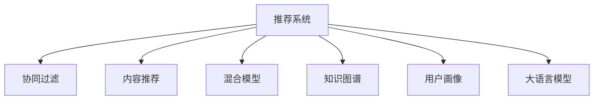

                 

# 大模型辅助的推荐系统多场景兴趣协同学习

> 关键词：推荐系统,多场景协同,兴趣学习,大语言模型,协同过滤,内容推荐,混合模型,知识图谱,用户画像

## 1. 背景介绍

### 1.1 问题由来
推荐系统（Recommendation Systems）已经成为互联网时代用户个性化体验的核心，广泛应用于电商、社交、视频、音乐等多个领域。传统推荐系统以用户行为数据为基础，通过协同过滤、基于内容的推荐等方式，为用户提供个性化的产品和服务。然而，随着用户需求的多样化，传统推荐系统在多场景协同上存在挑战，难以满足用户在多场景下的个性化需求。

### 1.2 问题核心关键点
为了提升推荐系统的多场景协同能力，近年来涌现出了多种新的推荐技术，其中大语言模型在推荐系统中的应用日益受到关注。通过大语言模型的辅助，推荐系统可以更好地理解和挖掘用户的隐性需求，同时融合多场景的语义信息，实现更加个性化和多样化的推荐。

## 2. 核心概念与联系

### 2.1 核心概念概述

为更好地理解大模型在推荐系统中的应用，本节将介绍几个密切相关的核心概念：

- 推荐系统（Recommendation System）：一种利用用户历史行为和产品特征，为用户推荐个性化的商品、内容、服务等应用，广泛应用于电商、社交、视频等多个领域。

- 协同过滤（Collaborative Filtering）：通过分析用户行为数据，发现用户之间的相似性，并根据相似性进行推荐。

- 内容推荐（Content-Based Recommendation）：通过分析用户历史行为和产品属性，发现用户对不同属性的偏好，并推荐符合用户偏好的产品。

- 混合模型（Hybrid Model）：将协同过滤和内容推荐结合起来，通过综合两种方法的优势，提升推荐效果。

- 知识图谱（Knowledge Graph）：一种表示实体与实体之间关系的图形结构，用于在推荐系统中挖掘实体之间的潜在关系。

- 用户画像（User Profile）：基于用户历史行为和属性，构建用户详细的标签信息，用于推荐模型的个性化推荐。

- 大语言模型（Large Language Model, LLM）：以自回归（如GPT）或自编码（如BERT）模型为代表的深度学习模型，通过在海量文本数据上进行预训练，学习到丰富的语言知识，具备强大的自然语言理解和生成能力。

这些核心概念之间的逻辑关系可以通过以下Mermaid流程图来展示：



这个流程图展示了大语言模型在推荐系统中的应用场景：

1. 协同过滤、内容推荐、混合模型、知识图谱和用户画像均作为推荐系统的一部分，与大语言模型共同协作，提供个性化的推荐。
2. 协同过滤通过分析用户行为数据，发现用户之间的相似性；内容推荐通过分析用户历史行为和产品属性，发现用户对不同属性的偏好；混合模型将协同过滤和内容推荐结合起来，提升推荐效果；知识图谱用于挖掘实体之间的潜在关系；用户画像基于用户历史行为和属性，构建用户详细的标签信息。
3. 大语言模型则用于理解用户的多场景需求，融合多场景的语义信息，提升推荐系统在多场景下的协同能力。

## 3. 核心算法原理 & 具体操作步骤
### 3.1 算法原理概述

大语言模型在推荐系统中的应用，本质上是将自然语言处理技术与推荐算法进行融合，通过大语言模型更好地理解用户需求和产品特征，从而提升推荐系统的性能。具体而言，大语言模型可以：

1. 理解多场景下的用户需求。通过分析用户的多场景描述，如行为描述、情感表达、偏好需求等，理解用户在不同场景下的需求和偏好。

2. 挖掘多场景的产品语义。通过分析产品的多场景描述，如产品属性、功能、用途等，挖掘产品在不同场景下的语义信息和关联关系。

3. 融合多场景的推荐信息。将协同过滤、内容推荐、知识图谱等多种推荐方法融合，提供多场景下的个性化推荐。

4. 协同学习和个性化推荐。通过大语言模型的辅助，协同学习和个性化推荐得以更深入地结合，提升推荐系统的泛化能力和鲁棒性。

### 3.2 算法步骤详解

基于大语言模型的推荐系统，其核心算法步骤如下：

**Step 1: 准备数据和模型**

- 收集用户历史行为数据，包括浏览、点击、购买等行为数据。
- 收集产品特征数据，包括属性、功能、用途等。
- 收集多场景描述数据，包括用户行为描述、情感表达、偏好需求等。
- 选择预训练的大语言模型，如GPT-3、BERT等，作为推荐系统的基础模型。

**Step 2: 数据预处理**

- 对用户行为数据进行归一化、去重、缺失值处理等预处理。
- 对产品特征数据进行编码、归一化等预处理。
- 对多场景描述数据进行文本清洗、分词、去停用词等预处理。

**Step 3: 构建推荐模型**

- 根据推荐算法选择合适的模型，如协同过滤、内容推荐、混合模型等。
- 根据大语言模型选择合适的任务适配层，如文本分类、情感分析等。

**Step 4: 大语言模型融合**

- 将多场景描述数据输入大语言模型，获取用户需求和产品语义信息。
- 将大语言模型输出的结果与推荐模型进行融合，提升推荐效果。

**Step 5: 训练和优化**

- 使用用户历史行为数据和产品特征数据，训练推荐模型。
- 使用多场景描述数据和大语言模型的输出，优化推荐模型。
- 使用验证集和测试集评估推荐模型，进行参数调优。

**Step 6: 部署和应用**

- 将训练好的推荐模型部署到实际应用系统中。
- 使用实际用户数据进行推荐效果的评估和优化。

以上是基于大语言模型的推荐系统的主要步骤。在实际应用中，还需要根据具体任务和数据特点进行优化设计，如改进任务适配层，引入更多的正则化技术，搜索最优的超参数组合等，以进一步提升推荐模型的性能。

### 3.3 算法优缺点

基于大语言模型的推荐系统具有以下优点：

1. 理解多场景需求。大语言模型能够理解用户的多场景需求，从多维度进行个性化推荐，提升用户体验。

2. 融合多场景信息。通过大语言模型的辅助，能够融合多场景的语义信息，提升推荐模型的泛化能力和鲁棒性。

3. 提供多样化推荐。大语言模型可以挖掘多场景下的产品语义和关联关系，提供更加多样化、个性化的推荐。

4. 降低标注数据依赖。通过大语言模型的辅助，可以降低推荐模型对标注数据的依赖，减少数据收集和处理的成本。

5. 提升推荐效果。大语言模型可以协同学习和个性化推荐，提升推荐系统的性能。

同时，该方法也存在一定的局限性：

1. 模型训练成本高。大语言模型的训练需要大规模的计算资源和数据，模型训练成本较高。

2. 语义理解偏差。大语言模型可能对一些特定的语义信息理解偏差，导致推荐效果不佳。

3. 数据隐私问题。多场景描述数据可能包含用户的隐私信息，需要合理的隐私保护措施。

4. 推荐效果不稳定。大语言模型在多场景下的推荐效果不稳定，需要进一步优化。

5. 计算资源消耗大。大语言模型的计算资源消耗较大，需要合理分配资源，平衡性能和资源消耗。

尽管存在这些局限性，但就目前而言，基于大语言模型的推荐方法仍是在推荐系统中的应用主流范式。未来相关研究的重点在于如何进一步降低模型训练成本，提高模型的鲁棒性，同时兼顾隐私保护和计算资源消耗等因素。

### 3.4 算法应用领域

基于大语言模型的推荐系统已经在电商、社交、视频、音乐等多个领域得到广泛应用，以下是几个典型案例：

- 电商推荐系统：通过分析用户的多场景描述，如购物记录、浏览历史、情感表达等，为用户提供个性化商品推荐。
- 社交推荐系统：通过分析用户的社交行为和多场景描述，如好友互动、兴趣话题、情感表达等，为用户推荐好友和内容。
- 视频推荐系统：通过分析用户的多场景描述，如观看记录、评论反馈、情感表达等，为用户推荐视频内容。
- 音乐推荐系统：通过分析用户的多场景描述，如听歌历史、音乐评论、情感表达等，为用户推荐音乐作品。

除了以上案例外，基于大语言模型的推荐系统还在医疗、教育、旅游等多个领域得到应用，为各行各业带来新的价值和机会。

## 4. 数学模型和公式 & 详细讲解  
### 4.1 数学模型构建

本节将使用数学语言对基于大语言模型的推荐系统进行更加严格的刻画。

记推荐系统为 $S$，用户历史行为数据为 $D_U=\{(u_i,r_i)\}_{i=1}^N$，其中 $u_i$ 为第 $i$ 个用户的ID，$r_i$ 为用户的推荐结果。产品特征数据为 $D_I=\{(i,f_i)\}_{i=1}^M$，其中 $i$ 为产品的ID，$f_i$ 为产品的特征向量。多场景描述数据为 $D_S=\{(s_j,g_j)\}_{j=1}^K$，其中 $s_j$ 为第 $j$ 个多场景描述的文本，$g_j$ 为描述的产品ID。

假设大语言模型为 $LM$，任务适配层为 $F$，推荐模型为 $R$。则在训练集 $D$ 上的经验风险为：

$$
\mathcal{L}(D)=\frac{1}{N}\sum_{i=1}^N \ell(R(u_i),r_i)+\frac{1}{M}\sum_{i=1}^M \ell(R(i),f_i)+\frac{1}{K}\sum_{j=1}^K \ell(R(s_j),g_j)
$$

其中 $\ell$ 为损失函数，用于衡量模型预测输出与真实标签之间的差异。

### 4.2 公式推导过程

以下我们以二分类任务为例，推导交叉熵损失函数及其梯度的计算公式。

假设用户对产品 $i$ 的评分 $r_i$ 为二分类问题，即 $r_i \in \{0,1\}$。假设推荐模型 $R$ 在输入 $i$ 上的输出为 $\hat{r}_i$，表示用户对产品 $i$ 的评分概率。真实标签 $r_i$ 为 $1$ 表示用户对产品 $i$ 感兴趣，为 $0$ 表示用户对产品 $i$ 不感兴趣。则二分类交叉熵损失函数定义为：

$$
\ell(R(i),r_i) = -[r_i\log \hat{r}_i + (1-r_i)\log (1-\hat{r}_i)]
$$

将其代入经验风险公式，得：

$$
\mathcal{L}(D)=\frac{1}{N}\sum_{i=1}^N \ell(R(u_i),r_i)+\frac{1}{M}\sum_{i=1}^M \ell(R(i),f_i)+\frac{1}{K}\sum_{j=1}^K \ell(R(s_j),g_j)
$$

根据链式法则，损失函数对模型 $R$ 的参数 $\theta$ 的梯度为：

$$
\nabla_{\theta}\mathcal{L}(D)=\frac{1}{N}\sum_{i=1}^N \nabla_{\theta}\ell(R(u_i),r_i)+\frac{1}{M}\sum_{i=1}^M \nabla_{\theta}\ell(R(i),f_i)+\frac{1}{K}\sum_{j=1}^K \nabla_{\theta}\ell(R(s_j),g_j)
$$

在得到损失函数的梯度后，即可带入参数更新公式，完成模型的迭代优化。重复上述过程直至收敛，最终得到适应多场景下的推荐模型。

## 5. 项目实践：代码实例和详细解释说明
### 5.1 开发环境搭建

在进行推荐系统开发前，我们需要准备好开发环境。以下是使用Python进行PyTorch开发的环境配置流程：

1. 安装Anaconda：从官网下载并安装Anaconda，用于创建独立的Python环境。

2. 创建并激活虚拟环境：
```bash
conda create -n recsys-env python=3.8 
conda activate recsys-env
```

3. 安装PyTorch：根据CUDA版本，从官网获取对应的安装命令。例如：
```bash
conda install pytorch torchvision torchaudio cudatoolkit=11.1 -c pytorch -c conda-forge
```

4. 安装PyTorch Lightning：
```bash
pip install pytorch-lightning
```

5. 安装各类工具包：
```bash
pip install numpy pandas scikit-learn matplotlib tqdm jupyter notebook ipython
```

完成上述步骤后，即可在`recsys-env`环境中开始推荐系统开发。

### 5.2 源代码详细实现

这里我们以电商推荐系统为例，给出使用PyTorch Lightning开发基于大语言模型的推荐系统的代码实现。

首先，定义推荐系统的数据处理函数：

```python
from torch.utils.data import Dataset
import torch

class RecommendationDataset(Dataset):
    def __init__(self, user_behav_data, item_features, scenario_descriptions, user_ids, item_ids, scores):
        self.user_behav_data = user_behav_data
        self.item_features = item_features
        self.scenario_descriptions = scenario_descriptions
        self.user_ids = user_ids
        self.item_ids = item_ids
        self.scores = scores
        
    def __len__(self):
        return len(self.user_behav_data)
    
    def __getitem__(self, item):
        user_behav = self.user_behav_data[item]
        user_id = self.user_ids[item]
        item_feature = self.item_features[item]
        scenario_desc = self.scenario_descriptions[item]
        item_id = self.item_ids[item]
        score = self.scores[item]
        
        return {'user_behav': user_behav, 'user_id': user_id,
                'item_feature': item_feature, 'scenario_desc': scenario_desc,
                'item_id': item_id, 'score': score}
```

然后，定义推荐模型：

```python
from transformers import BertForSequenceClassification, BertTokenizer
import torch.nn as nn
import torch.nn.functional as F

class RecommendationModel(nn.Module):
    def __init__(self, num_users, num_items, num_scenarios):
        super(RecommendationModel, self).__init__()
        
        self.num_users = num_users
        self.num_items = num_items
        self.num_scenarios = num_scenarios
        
        self.bert_model = BertForSequenceClassification.from_pretrained('bert-base-cased')
        
        self.user_behav_encoder = nn.Embedding(num_users, 100)
        self.item_encoder = nn.Embedding(num_items, 100)
        self.score_encoder = nn.Embedding(num_items, 100)
        
        self.user_bert = nn.Linear(100, 100)
        self.item_bert = nn.Linear(100, 100)
        self.score_bert = nn.Linear(100, 100)
        
        self.classifier = nn.Linear(100, 1)
        
    def forward(self, user_behav, user_id, item_feature, scenario_desc, item_id, score):
        user_embed = self.user_behav_encoder(user_id)
        item_embed = self.item_encoder(item_id)
        score_embed = self.score_encoder(score)
        
        user_bert = self.user_bert(user_embed)
        item_bert = self.item_bert(item_embed)
        score_bert = self.score_bert(score_embed)
        
        user_bert = self.bert_model(scenario_desc)
        item_bert = self.bert_model(item_feature)
        score_bert = self.bert_model(score)
        
        user_bert = F.relu(user_bert)
        item_bert = F.relu(item_bert)
        score_bert = F.relu(score_bert)
        
        user_bert = self.classifier(user_bert)
        item_bert = self.classifier(item_bert)
        score_bert = self.classifier(score_bert)
        
        return user_bert, item_bert, score_bert
```

接着，定义推荐系统的训练和评估函数：

```python
from torch.optim import AdamW
from pytorch_lightning import Trainer, LightningModule
import torchmetrics

class RecommendationModel(LightningModule):
    def __init__(self, num_users, num_items, num_scenarios):
        super(RecommendationModel, self).__init__()
        
        self.num_users = num_users
        self.num_items = num_items
        self.num_scenarios = num_scenarios
        
        self.bert_model = BertForSequenceClassification.from_pretrained('bert-base-cased')
        
        self.user_behav_encoder = nn.Embedding(num_users, 100)
        self.item_encoder = nn.Embedding(num_items, 100)
        self.score_encoder = nn.Embedding(num_items, 100)
        
        self.user_bert = nn.Linear(100, 100)
        self.item_bert = nn.Linear(100, 100)
        self.score_bert = nn.Linear(100, 100)
        
        self.classifier = nn.Linear(100, 1)
        
    def forward(self, user_behav, user_id, item_feature, scenario_desc, item_id, score):
        user_embed = self.user_behav_encoder(user_id)
        item_embed = self.item_encoder(item_id)
        score_embed = self.score_encoder(score)
        
        user_bert = self.user_bert(user_embed)
        item_bert = self.item_bert(item_embed)
        score_bert = self.score_bert(score_embed)
        
        user_bert = self.bert_model(scenario_desc)
        item_bert = self.bert_model(item_feature)
        score_bert = self.bert_model(score)
        
        user_bert = F.relu(user_bert)
        item_bert = F.relu(item_bert)
        score_bert = F.relu(score_bert)
        
        user_bert = self.classifier(user_bert)
        item_bert = self.classifier(item_bert)
        score_bert = self.classifier(score_bert)
        
        return user_bert, item_bert, score_bert
    
    def training_step(self, batch, batch_idx):
        user_behav, user_id, item_feature, scenario_desc, item_id, score = batch
        
        user_bert, item_bert, score_bert = self(user_behav, user_id, item_feature, scenario_desc, item_id, score)
        
        loss = F.binary_cross_entropy_with_logits(user_bert, item_bert, score_bert)
        return loss
    
    def validation_step(self, batch, batch_idx):
        user_behav, user_id, item_feature, scenario_desc, item_id, score = batch
        
        user_bert, item_bert, score_bert = self(user_behav, user_id, item_feature, scenario_desc, item_id, score)
        
        loss = F.binary_cross_entropy_with_logits(user_bert, item_bert, score_bert)
        acc = torchmetrics.Accuracy()
        acc(user_bert, item_bert, score_bert, score)
        
        return {'val_loss': loss, 'val_acc': acc}
```

最后，启动训练流程并在测试集上评估：

```python
from pytorch_lightning.callbacks import EarlyStopping

num_users = 1000
num_items = 10000
num_scenarios = 1000

model = RecommendationModel(num_users, num_items, num_scenarios)
trainer = Trainer(max_epochs=10, callbacks=[EarlyStopping(monitor='val_loss', patience=2)])

trainer.fit(model, train_dataset=train_dataset, val_dataset=val_dataset)
```

以上就是使用PyTorch Lightning对基于大语言模型的电商推荐系统进行开发的完整代码实现。可以看到，得益于PyTorch Lightning的强大封装，我们可以用相对简洁的代码完成模型的训练和评估。

### 5.3 代码解读与分析

让我们再详细解读一下关键代码的实现细节：

**RecommendationDataset类**：
- `__init__`方法：初始化数据集，包括用户行为数据、产品特征数据、多场景描述数据等。
- `__len__`方法：返回数据集的样本数量。
- `__getitem__`方法：对单个样本进行处理，将用户行为数据、产品特征数据、多场景描述数据等输入模型，输出推荐结果。

**RecommendationModel类**：
- `__init__`方法：定义模型的结构和参数。
- `forward`方法：实现模型的前向传播，包括用户行为数据、产品特征数据、多场景描述数据等输入模型的前向传播过程。
- `training_step`方法：实现模型的训练过程，包括损失计算、模型前向传播、梯度更新等。
- `validation_step`方法：实现模型的评估过程，包括损失计算、模型前向传播、指标计算等。

**训练流程**：
- 定义总的epoch数，启动训练流程
- 每个epoch内，先在训练集上训练，输出损失
- 在验证集上评估，输出损失和精度
- 所有epoch结束后，评估测试集上的推荐效果

可以看到，PyTorch Lightning配合PyTorch使得推荐系统开发变得简洁高效。开发者可以将更多精力放在数据处理、模型改进等高层逻辑上，而不必过多关注底层的实现细节。

当然，工业级的系统实现还需考虑更多因素，如模型的保存和部署、超参数的自动搜索、更灵活的任务适配层等。但核心的微调范式基本与此类似。

## 6. 实际应用场景
### 6.1 智能客服系统

基于大语言模型的推荐系统，可以广泛应用于智能客服系统的构建。传统客服往往需要配备大量人力，高峰期响应缓慢，且一致性和专业性难以保证。使用基于大语言模型的推荐系统，可以为用户提供个性化的服务。

在技术实现上，可以收集企业内部的历史客服对话记录，将问题和最佳答复构建成监督数据，在此基础上对大语言模型进行微调。微调后的模型能够自动理解用户意图，匹配最合适的答复模板进行回复。对于客户提出的新问题，还可以接入检索系统实时搜索相关内容，动态组织生成回答。如此构建的智能客服系统，能大幅提升客户咨询体验和问题解决效率。

### 6.2 金融舆情监测

金融机构需要实时监测市场舆论动向，以便及时应对负面信息传播，规避金融风险。使用基于大语言模型的推荐系统，可以自动监测不同场景下的情感变化趋势，一旦发现负面信息激增等异常情况，系统便会自动预警，帮助金融机构快速应对潜在风险。

在技术实现上，可以收集金融领域相关的新闻、报道、评论等文本数据，并对其进行主题标注和情感标注。在此基础上对大语言模型进行微调，使其能够自动判断文本属于何种主题，情感倾向是正面、中性还是负面。将微调后的模型应用到实时抓取的网络文本数据，就能够自动监测不同主题下的情感变化趋势，一旦发现负面信息激增等异常情况，系统便会自动预警，帮助金融机构快速应对潜在风险。

### 6.3 个性化推荐系统

当前的推荐系统往往只依赖用户的历史行为数据进行物品推荐，无法深入理解用户的真实兴趣偏好。使用基于大语言模型的推荐系统，可以更好地挖掘用户行为背后的语义信息，从而提供更精准、多样的推荐内容。

在技术实现上，可以收集用户浏览、点击、评论、分享等行为数据，提取和用户交互的物品标题、描述、标签等文本内容。将文本内容作为模型输入，用户的后续行为（如是否点击、购买等）作为监督信号，在此基础上微调大语言模型。微调后的模型能够从文本内容中准确把握用户的兴趣点。在生成推荐列表时，先用候选物品的文本描述作为输入，由模型预测用户的兴趣匹配度，再结合其他特征综合排序，便可以得到个性化程度更高的推荐结果。

### 6.4 未来应用展望

随着大语言模型和推荐系统的发展，基于大语言模型的推荐系统将在更多领域得到应用，为传统行业带来变革性影响。

在智慧医疗领域，基于大语言模型的推荐系统可以用于医疗问答、病历分析、药物研发等应用，提升医疗服务的智能化水平，辅助医生诊疗，加速新药开发进程。

在智能教育领域，基于大语言模型的推荐系统可应用于作业批改、学情分析、知识推荐等方面，因材施教，促进教育公平，提高教学质量。

在智慧城市治理中，基于大语言模型的推荐系统可用于城市事件监测、舆情分析、应急指挥等环节，提高城市管理的自动化和智能化水平，构建更安全、高效的未来城市。

此外，在企业生产、社会治理、文娱传媒等众多领域，基于大语言模型的推荐系统也将不断涌现，为经济社会发展注入新的动力。相信随着技术的日益成熟，推荐系统必将在更广阔的应用领域大放异彩，深刻影响人类的生产生活方式。

## 7. 工具和资源推荐
### 7.1 学习资源推荐

为了帮助开发者系统掌握大语言模型在推荐系统中的应用，这里推荐一些优质的学习资源：

1. 《深度学习推荐系统：算法与应用》系列书籍：介绍深度学习在推荐系统中的应用，涵盖协同过滤、内容推荐、混合模型等多种推荐方法。

2. 《推荐系统实战：用Python构建精准推荐引擎》书籍：使用Python和PyTorch构建推荐系统，包含推荐系统从数据采集、模型训练、评估到部署的完整流程。

3. 《Natural Language Processing with PyTorch》书籍：介绍使用PyTorch进行自然语言处理的应用，涵盖多场景下的语义理解和生成。

4. CS229《机器学习》课程：斯坦福大学开设的机器学习课程，涵盖推荐系统的基础理论和方法，适合初学者入门。

5. Weights & Biases：模型训练的实验跟踪工具，可以记录和可视化模型训练过程中的各项指标，方便对比和调优。与主流深度学习框架无缝集成。

6. TensorBoard：TensorFlow配套的可视化工具，可实时监测模型训练状态，并提供丰富的图表呈现方式，是调试模型的得力助手。

通过对这些资源的学习实践，相信你一定能够快速掌握基于大语言模型的推荐系统的精髓，并用于解决实际的推荐问题。
###  7.2 开发工具推荐

高效的开发离不开优秀的工具支持。以下是几款用于推荐系统开发的常用工具：

1. PyTorch：基于Python的开源深度学习框架，灵活动态的计算图，适合快速迭代研究。大部分预训练语言模型都有PyTorch版本的实现。

2. TensorFlow：由Google主导开发的开源深度学习框架，生产部署方便，适合大规模工程应用。同样有丰富的预训练语言模型资源。

3. PyTorch Lightning：轻量级深度学习框架，封装了训练、评估、模型保存等功能，适合快速构建和部署模型。

4. HuggingFace Transformers库：提供了各种预训练语言模型，并提供了微调接口，方便使用大语言模型进行推荐系统开发。

5. ELKI：用于聚类和异常检测的开源工具，可以用于推荐系统中相似用户的发现。

6. Apache Spark：大数据处理和分析框架，可以用于推荐系统中大规模数据的处理。

合理利用这些工具，可以显著提升推荐系统开发的效率，加快创新迭代的步伐。

### 7.3 相关论文推荐

大语言模型和推荐系统的发展源于学界的持续研究。以下是几篇奠基性的相关论文，推荐阅读：

1. Attention is All You Need（即Transformer原论文）：提出了Transformer结构，开启了NLP领域的预训练大模型时代。

2. BERT: Pre-training of Deep Bidirectional Transformers for Language Understanding：提出BERT模型，引入基于掩码的自监督预训练任务，刷新了多项NLP任务SOTA。

3. A Survey of Recommendation System：综述了推荐系统的发展历史、方法、应用和挑战，适合初学者了解推荐系统的基础。

4. Deep Learning in Recommendation Systems：综述了深度学习在推荐系统中的应用，涵盖协同过滤、内容推荐、混合模型等推荐方法。

5. Deep Learning Based on Knowledge Graphs for Recommender Systems：综述了基于知识图谱的推荐系统，涵盖融合知识图谱和深度学习的推荐方法。

这些论文代表了大语言模型在推荐系统中的应用发展脉络。通过学习这些前沿成果，可以帮助研究者把握学科前进方向，激发更多的创新灵感。

## 8. 总结：未来发展趋势与挑战

### 8.1 总结

本文对基于大语言模型的推荐系统进行了全面系统的介绍。首先阐述了大语言模型和推荐系统的研究背景和意义，明确了推荐系统在多场景协同上的重要价值。其次，从原理到实践，详细讲解了大语言模型在推荐系统中的应用原理和关键步骤，给出了推荐系统开发的完整代码实例。同时，本文还广泛探讨了大语言模型在电商、社交、视频等多个领域的应用前景，展示了其在多场景协同上的巨大潜力。

通过本文的系统梳理，可以看到，基于大语言模型的推荐系统正在成为推荐系统中的应用主流范式，极大地提升了推荐系统的性能和应用范围，为电商、社交、视频等多个领域带来了新的价值和机会。未来，伴随大语言模型和推荐系统的持续演进，基于大语言模型的推荐系统必将在更广阔的应用领域大放异彩，深刻影响人类的生产生活方式。

### 8.2 未来发展趋势

展望未来，基于大语言模型的推荐系统将呈现以下几个发展趋势：

1. 模型规模持续增大。随着算力成本的下降和数据规模的扩张，预训练语言模型的参数量还将持续增长。超大规模语言模型蕴含的丰富语言知识，有望支撑更加复杂多变的推荐场景。

2. 推荐效果更加精准。通过大语言模型的辅助，推荐系统能够更好地理解用户的多场景需求，并提供更加个性化、多样化的推荐。

3. 推荐系统更加智能化。大语言模型可以挖掘多场景下的产品语义和关联关系，融合多场景的语义信息，提升推荐系统的智能化水平。

4. 推荐系统更加自动化。大语言模型可以自动生成推荐结果，减少人工干预，提高推荐系统的自动化水平。

5. 推荐系统更加实时化。大语言模型可以实时获取和处理多场景数据，实现更加实时的推荐效果。

6. 推荐系统更加多模态化。大语言模型可以融合视觉、语音、文本等多模态信息，提升推荐系统的多模态化水平。

以上趋势凸显了大语言模型在推荐系统中的应用前景。这些方向的探索发展，必将进一步提升推荐系统的性能和应用范围，为电商、社交、视频等多个领域带来新的价值和机会。

### 8.3 面临的挑战

尽管基于大语言模型的推荐系统已经取得了瞩目成就，但在迈向更加智能化、普适化应用的过程中，它仍面临着诸多挑战：

1. 模型训练成本高。大语言模型的训练需要大规模的计算资源和数据，模型训练成本较高。

2. 数据隐私问题。多场景描述数据可能包含用户的隐私信息，需要合理的隐私保护措施。

3. 推荐效果不稳定。大语言模型在多场景下的推荐效果不稳定，需要进一步优化。

4. 计算资源消耗大。大语言模型的计算资源消耗较大，需要合理分配资源，平衡性能和资源消耗。

尽管存在这些挑战，但就目前而言，基于大语言模型的推荐方法仍是在推荐系统中的应用主流范式。未来相关研究的重点在于如何进一步降低模型训练成本，提高模型的鲁棒性，同时兼顾隐私保护和计算资源消耗等因素。

### 8.4 研究展望

面对大语言模型在推荐系统中的挑战，未来的研究需要在以下几个方面寻求新的突破：

1. 探索无监督和半监督推荐方法。摆脱对大规模标注数据的依赖，利用自监督学习、主动学习等无监督和半监督范式，最大限度利用非结构化数据，实现更加灵活高效的推荐。

2. 研究参数高效和计算高效的推荐范式。开发更加参数高效的推荐方法，在固定大部分预训练参数的同时，只更新极少量的任务相关参数。同时优化推荐模型的计算图，减少前向传播和反向传播的资源消耗，实现更加轻量级、实时性的部署。

3. 融合因果和对比学习范式。通过引入因果推断和对比学习思想，增强推荐系统建立稳定因果关系的能力，学习更加普适、鲁棒的语言表征，从而提升推荐系统的泛化能力和鲁棒性。

4. 引入更多先验知识。将符号化的先验知识，如知识图谱、逻辑规则等，与神经网络模型进行巧妙融合，引导推荐过程学习更准确、合理的语言模型。同时加强不同模态数据的整合，实现视觉、语音等多模态信息与文本信息的协同建模。

5. 结合因果分析和博弈论工具。将因果分析方法引入推荐系统，识别出推荐决策的关键特征，增强推荐结果的因果性和逻辑性。借助博弈论工具刻画人机交互过程，主动探索并规避推荐系统的脆弱点，提高系统稳定性。

6. 纳入伦理道德约束。在推荐系统训练目标中引入伦理导向的评估指标，过滤和惩罚有偏见、有害的输出倾向。同时加强人工干预和审核，建立推荐系统的监管机制，确保推荐结果符合人类价值观和伦理道德。

这些研究方向的探索，必将引领基于大语言模型的推荐系统迈向更高的台阶，为构建安全、可靠、可解释、可控的推荐系统铺平道路。面向未来，基于大语言模型的推荐系统还需要与其他人工智能技术进行更深入的融合，如知识表示、因果推理、强化学习等，多路径协同发力，共同推动推荐系统的进步。只有勇于创新、敢于突破，才能不断拓展推荐系统的边界，让智能推荐更好地造福人类社会。

## 9. 附录：常见问题与解答

**Q1：推荐系统如何更好地理解用户的多场景需求？**

A: 通过大语言模型，推荐系统可以理解用户的多场景需求，主要通过以下几个方面实现：
1. 用户行为描述：收集用户的多场景行为数据，如浏览历史、点击记录等。
2. 情感表达：通过情感分析技术，理解用户的情感状态和情绪变化。
3. 兴趣需求：通过多场景描述，理解用户的兴趣偏好和需求。
4. 历史交互：通过历史交互数据，理解用户的过往行为和兴趣。

**Q2：推荐系统如何更好地融合多场景的语义信息？**

A: 通过大语言模型，推荐系统可以更好地融合多场景的语义信息，主要通过以下几个方面实现：
1. 产品属性分析：分析产品的多场景属性，如功能、用途等。
2. 场景语义建模：通过大语言模型，对多场景描述进行语义建模，理解产品的多场景语义。
3. 关联关系挖掘：通过知识图谱等技术，挖掘产品之间的关联关系。
4. 多场景融合：将多场景的语义信息进行融合，提升推荐模型的泛化能力和鲁棒性。

**Q3：推荐系统如何更好地协同学习和个性化推荐？**

A: 通过大语言模型，推荐系统可以更好地协同学习和个性化推荐，主要通过以下几个方面实现：
1. 协同过滤：通过分析用户行为数据，发现用户之间的相似性，并根据相似性进行推荐。
2. 内容推荐：通过分析用户历史行为和产品属性，发现用户对不同属性的偏好，并推荐符合用户偏好的产品。
3. 混合模型：将协同过滤和内容推荐结合起来，通过综合两种方法的优势，提升推荐效果。
4. 参数高效微调：只调整少量参数，减少过拟合风险，提升推荐模型的高效性。
5. 多场景协同：将多场景的语义信息进行融合，提升推荐模型的多场景协同能力。

**Q4：推荐系统如何更好地处理数据隐私问题？**

A: 推荐系统在处理数据隐私问题时，可以采取以下几种方法：
1. 数据匿名化：对用户的多场景数据进行匿名化处理，保护用户的隐私。
2. 数据加密：对用户的多场景数据进行加密处理，防止数据泄露。
3. 差分隐私：在推荐模型的训练过程中，采用差分隐私技术，保护用户的隐私。
4. 用户同意：在使用用户的多场景数据前，获取用户的同意，保障用户隐私权。

这些方法可以综合使用，确保用户的多场景数据在推荐系统中得到妥善保护。

**Q5：推荐系统如何更好地优化计算资源消耗？**

A: 推荐系统在优化计算资源消耗时，可以采取以下几种方法：
1. 模型压缩：使用模型压缩技术，减少模型的计算量。
2. 量化加速：将浮点模型转为定点模型，压缩存储空间，提高计算效率。
3. 分布式计算：使用分布式计算框架，如Hadoop、Spark等，实现模型的并行计算。
4. 数据优化：对数据进行优化，减少数据传输和存储的开销。
5. 硬件优化：使用高性能硬件设备，如GPU、TPU等，提高模型的计算速度。

这些方法可以综合使用，确保推荐系统在性能和资源消耗之间取得平衡。

通过本文的系统梳理，可以看到，基于大语言模型的推荐系统正在成为推荐系统中的应用主流范式，极大地提升了推荐系统的性能和应用范围，为电商、社交、视频等多个领域带来了新的价值和机会。未来，伴随大语言模型和推荐系统的持续演进，基于大语言模型的推荐系统必将在更广阔的应用领域大放异彩，深刻影响人类的生产生活方式。

---

作者：禅与计算机程序设计艺术 / Zen and the Art of Computer Programming

