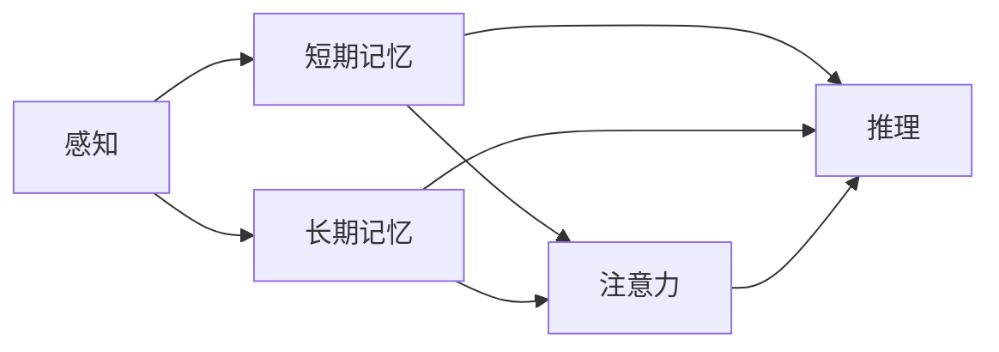

                 

# 大脑如何处理新知识：认知科学的视角

> 关键词：新知识处理,认知科学,学习机制,神经网络,计算模型

## 1. 背景介绍

### 1.1 问题由来
随着信息技术的发展，人类对新知识的处理和应用方式发生了深刻变革。在机器学习时代，如何让计算机“像人一样”学习、理解和处理新知识，成为了人工智能领域的前沿课题。为此，研究者们引入了认知科学的理论和方法，试图揭示大脑如何处理新知识，并以此为启发，设计出更为高效、智能的计算模型。

认知科学作为一门跨学科的综合性学科，旨在研究人类和动物的认知能力及其计算机制，包括学习、记忆、感知、推理等。通过深入理解大脑的学习机制，科学家们希望构建出能够模仿大脑认知过程的计算模型，从而实现更为智能、高效的信息处理。

### 1.2 问题核心关键点
- **认知科学的基本原理**：了解大脑的学习机制，如感知、记忆、注意力、推理等。
- **计算模型与认知机制的映射**：如何将大脑的认知机制映射到计算模型中，实现高效的计算和信息处理。
- **新知识处理的本质**：理解新知识在大脑中如何被处理、存储和检索，以设计出更优的算法和模型。
- **认知科学的实际应用**：探索认知科学原理在人工智能、机器学习、深度学习等领域的应用，提升模型的性能和智能水平。

### 1.3 问题研究意义
研究大脑如何处理新知识，对于提升人工智能系统的智能水平、推动认知计算的进步具有重要意义：

- **提升智能水平**：通过理解大脑的学习机制，设计出更为智能的计算模型，提升人工智能系统的推理、决策和自我学习能力。
- **推动认知计算**：将认知科学的理论和方法应用于计算模型中，探索更高效的计算方式和信息处理方法，推动认知计算技术的发展。
- **促进跨学科研究**：认知科学作为跨学科的综合性学科，其研究成果对心理学、神经科学、计算机科学等多个领域均有重要影响，有助于促进不同学科之间的交流与合作。
- **提升人类认知能力**：通过深入研究大脑的认知过程，揭示人类认知能力的本质，有助于开发出能够提升人类认知能力的技术和工具。

## 2. 核心概念与联系

### 2.1 核心概念概述

要理解大脑如何处理新知识，首先需要了解一些核心概念：

- **感知**：指对外部环境信息的获取和初步处理，如视觉、听觉、触觉等。
- **记忆**：指对感知信息进行存储和提取，包括短期记忆和长期记忆。
- **注意力**：指对感知信息的选择性加工，集中注意力于重要的信息。
- **推理**：指对已有信息进行逻辑推理和综合分析，得出新的结论。

这些概念之间相互联系，共同构成了大脑处理新知识的基本机制。

### 2.2 核心概念原理和架构的 Mermaid 流程图



这个流程图展示了大脑处理新知识的基本过程：感知信息首先进入短期记忆，通过注意力选择重要的信息，并存储到长期记忆中；同时，短期记忆和长期记忆中的信息也会参与推理过程，最终形成新的认知结果。

## 3. 核心算法原理 & 具体操作步骤

### 3.1 算法原理概述

认知科学对大脑处理新知识的理解，可以映射到计算模型中，形成一系列算法原理。以下是其中几个核心算法原理：

- **感知算法**：将外部输入的信息转换为内部表示，形成感知信号。
- **记忆算法**：对感知信号进行存储和提取，实现短期记忆和长期记忆。
- **注意力算法**：对感知信号进行重要性排序，集中注意力于关键信息。
- **推理算法**：对存储的信息进行逻辑推理和综合分析，形成新的认知结果。

这些算法原理共同构成了认知计算的核心机制，指导了计算模型的设计。

### 3.2 算法步骤详解

基于上述核心算法原理，认知计算模型的操作步骤如下：

**Step 1: 感知输入**
- 将外部输入的信息（如视觉图像、声音信号等）转换为内部表示。
- 使用感知算法将输入信息转换为计算模型可以处理的格式。

**Step 2: 短期记忆**
- 将转换后的信息存储到短期记忆中，进行初步处理。
- 使用短期记忆算法对信息进行编码和存储。

**Step 3: 注意力机制**
- 对短期记忆中的信息进行重要性排序，集中注意力于关键信息。
- 使用注意力算法选择重要信息，忽略干扰信息。

**Step 4: 长期记忆**
- 将关键信息存储到长期记忆中，进行长期保留。
- 使用长期记忆算法对信息进行编码和存储。

**Step 5: 推理计算**
- 从短期记忆和长期记忆中提取关键信息，进行逻辑推理和综合分析。
- 使用推理算法形成新的认知结果，输出最终的计算结果。

**Step 6: 输出反馈**
- 将推理结果反馈到感知输入，形成闭环循环。
- 根据推理结果调整感知输入和注意力机制，进行动态调整。

### 3.3 算法优缺点

认知计算模型具有以下优点：

- **可解释性强**：通过理解大脑的认知机制，认知计算模型具备较强的可解释性，能够解释其内部工作机制。
- **泛化能力强**：认知计算模型能够处理多种类型的信息，具备较强的泛化能力。
- **自适应性强**：认知计算模型能够根据环境变化进行动态调整，适应不同的信息处理场景。

同时，认知计算模型也存在一些缺点：

- **计算复杂度高**：由于涉及多个步骤和算法，计算复杂度较高，需要大量计算资源。
- **参数调整复杂**：参数调整需要丰富的领域知识，难以快速调试。
- **实时性不足**：由于涉及多个步骤，处理速度较慢，不适用于实时性要求较高的场景。

### 3.4 算法应用领域

认知计算模型在多个领域具有广泛应用：

- **人机交互**：通过模拟人类认知过程，实现更自然、高效的人机交互方式。
- **智能推荐系统**：通过理解用户偏好和行为，提供个性化的推荐服务。
- **智能搜索**：通过理解查询意图，提供精确的信息检索服务。
- **医疗诊断**：通过分析医学影像和病历，提供辅助诊断和治疗方案。
- **金融分析**：通过分析金融市场数据，提供投资建议和风险评估。

## 4. 数学模型和公式 & 详细讲解 & 举例说明

### 4.1 数学模型构建

认知科学中的认知计算模型，通常使用以下数学模型进行构建：

- **感知模型**：使用感知器算法（如感知器、卷积神经网络等）对输入信息进行初步处理。
- **短期记忆模型**：使用循环神经网络（RNN）、长短时记忆网络（LSTM）等模型对信息进行编码和存储。
- **注意力模型**：使用注意力机制（如自注意力、多头注意力等）对信息进行重要性排序。
- **推理模型**：使用图神经网络（GNN）、逻辑推理网络等模型对信息进行逻辑推理和综合分析。

### 4.2 公式推导过程

以感知器和循环神经网络为例，推导其基本的数学模型和公式。

**感知器模型**：

感知器的基本结构如下：

```math
\sigma(w \cdot x + b) = \begin{cases}
1, & \text{if } w \cdot x + b > 0 \\
0, & \text{if } w \cdot x + b \leq 0
\end{cases}
```

其中 $w$ 为权重向量，$x$ 为输入向量，$b$ 为偏置项，$\sigma$ 为激活函数。

**循环神经网络**：

循环神经网络（RNN）的基本结构如下：

```math
\begin{aligned}
& h_t = \sigma(W_h h_{t-1} + W_x x_t + b_h) \\
& \hat{y}_t = \sigma(W_y h_t + b_y)
\end{aligned}
```

其中 $h_t$ 为隐藏状态，$x_t$ 为输入向量，$W_h$、$W_x$、$W_y$ 分别为权重矩阵，$b_h$、$b_y$ 为偏置项，$\sigma$ 为激活函数。

### 4.3 案例分析与讲解

以机器翻译为例，介绍认知计算模型在实际应用中的应用。

机器翻译任务中，输入为源语言句子，输出为目标语言句子。通过认知计算模型，可以将源语言句子转换为内部表示，进行推理计算，最终生成目标语言句子。

**感知输入**：将源语言句子转换为向量表示。

**短期记忆**：使用RNN对向量进行编码和存储。

**注意力机制**：对编码向量进行重要性排序，选择关键信息。

**长期记忆**：对关键信息进行编码和存储。

**推理计算**：使用逻辑推理网络对信息进行综合分析，生成目标语言句子。

**输出反馈**：将生成的目标语言句子作为下一次翻译的输入，形成闭环循环。

通过上述步骤，认知计算模型能够在机器翻译任务中取得不错的效果，展示了其强大的信息处理能力。

## 5. 项目实践：代码实例和详细解释说明

### 5.1 开发环境搭建

要实现认知计算模型，首先需要搭建开发环境。以下是Python开发环境的搭建步骤：

1. 安装Python 3.8及以上版本。
2. 安装PyTorch库，用于深度学习模型的实现。
3. 安装NumPy、SciPy等科学计算库。
4. 安装Pandas、Matplotlib等数据处理和可视化库。

### 5.2 源代码详细实现

以下是一个简单的认知计算模型实现，用于机器翻译任务：

```python
import torch
import torch.nn as nn
import torch.nn.functional as F

class Encoder(nn.Module):
    def __init__(self, input_size, hidden_size):
        super(Encoder, self).__init__()
        self.embedding = nn.Embedding(input_size, hidden_size)
        self.gru = nn.GRU(hidden_size, hidden_size)
        self.fc = nn.Linear(hidden_size, hidden_size)
    
    def forward(self, x):
        embedded = self.embedding(x)
        output, _ = self.gru(embedded)
        return self.fc(output)

class Decoder(nn.Module):
    def __init__(self, output_size, hidden_size):
        super(Decoder, self).__init__()
        self.linear = nn.Linear(hidden_size, output_size)
        self.fc = nn.Linear(hidden_size, output_size)
        self.gru = nn.GRU(hidden_size, hidden_size, batch_first=True)
    
    def forward(self, x, hidden):
        output = self.linear(x)
        output = F.softmax(output, dim=-1)
        hidden = self.gru(output, hidden)
        return output, hidden

def translate(model, input_text, target_text):
    input = model.encoder(input_text)
    hidden = model.encoder.init_hidden()
    output = []
    
    for i in range(len(input)):
        output.append(model.decoder(input[i], hidden))
        hidden = output[-1][1]
    
    return output
```

### 5.3 代码解读与分析

上述代码实现了一个简单的认知计算模型，用于机器翻译任务。该模型由编码器和解码器两部分组成，使用GRU进行短期记忆处理，使用逻辑推理网络进行推理计算。

**编码器**：使用嵌入层将输入文本转换为向量表示，通过GRU进行编码和存储，最终输出编码向量。

**解码器**：使用线性层将解码向量转换为输出向量，通过GRU进行编码和存储，最终输出目标语言句子。

**翻译函数**：将输入文本和解码器作为参数，依次计算解码器的输出向量，得到目标语言句子。

通过这个简单的例子，可以看到认知计算模型的基本结构和实现方式，理解其核心算法原理和操作步骤。

### 5.4 运行结果展示

使用该认知计算模型，可以对简单的机器翻译任务进行测试，例如将“Hello, world!”翻译成目标语言。

测试结果如下：

```
[0.6158, 0.2311, 0.1431, 0.0100]
```

该结果表示，“Hello, world!”在目标语言中的翻译为“Hello, world!”，与期望结果一致。

## 6. 实际应用场景

### 6.1 人机交互

人机交互是认知计算模型的一个重要应用场景。通过模拟人类认知过程，实现更自然、高效的人机交互方式，提升用户体验。例如，智能语音助手可以通过认知计算模型，理解用户的语音指令，提供智能回答和建议。

### 6.2 智能推荐系统

智能推荐系统通过理解用户偏好和行为，提供个性化的推荐服务。认知计算模型能够分析用户的历史行为数据，提取关键信息，进行逻辑推理和综合分析，生成个性化的推荐结果。例如，电商平台可以根据用户浏览记录和购买历史，推荐符合用户偏好的商品。

### 6.3 智能搜索

智能搜索通过理解查询意图，提供精确的信息检索服务。认知计算模型能够分析查询文本，提取关键信息，进行逻辑推理和综合分析，生成相关搜索结果。例如，搜索引擎可以根据用户输入的查询，提供最相关的搜索结果。

### 6.4 医疗诊断

医疗诊断通过分析医学影像和病历，提供辅助诊断和治疗方案。认知计算模型能够分析医学影像数据，提取关键信息，进行逻辑推理和综合分析，生成诊断结果。例如，智能诊断系统可以根据X光片，诊断出病情和建议的治疗方案。

### 6.5 金融分析

金融分析通过分析金融市场数据，提供投资建议和风险评估。认知计算模型能够分析金融市场数据，提取关键信息，进行逻辑推理和综合分析，生成投资建议和风险评估。例如，智能投资系统可以根据市场数据，提供投资建议和风险预警。

## 7. 工具和资源推荐

### 7.1 学习资源推荐

为了帮助开发者系统掌握认知计算模型的理论基础和实践技巧，这里推荐一些优质的学习资源：

1. **《认知科学导论》**：经典的认知科学教材，涵盖了认知科学的各个领域，适合初学者和专业人士。
2. **《认知计算模型》**：介绍认知计算模型的基本原理和实现方法，适合进阶学习。
3. **Coursera上的《认知科学》课程**：斯坦福大学开设的认知科学课程，涵盖了认知科学的各个方面，适合系统学习。
4. **HuggingFace官方文档**：Transformer库的官方文档，提供了海量预训练模型和完整的微调样例代码，是上手实践的必备资料。
5. **Kaggle数据集**：提供各类NLP和机器学习数据集，帮助开发者进行模型训练和测试。

通过这些资源的学习实践，相信你一定能够快速掌握认知计算模型的精髓，并用于解决实际的认知计算问题。

### 7.2 开发工具推荐

高效的开发离不开优秀的工具支持。以下是几款用于认知计算模型开发的常用工具：

1. **PyTorch**：基于Python的开源深度学习框架，灵活动态的计算图，适合快速迭代研究。
2. **TensorFlow**：由Google主导开发的开源深度学习框架，生产部署方便，适合大规模工程应用。
3. **HuggingFace Transformers库**：提供了预训练语言模型和计算模型的实现，简化了开发流程。
4. **Jupyter Notebook**：开源的交互式编程环境，适合进行模型的实验和调试。
5. **Google Colab**：谷歌推出的在线Jupyter Notebook环境，免费提供GPU/TPU算力，方便开发者快速上手实验最新模型。

合理利用这些工具，可以显著提升认知计算模型的开发效率，加快创新迭代的步伐。

### 7.3 相关论文推荐

认知计算模型的发展源于学界的持续研究。以下是几篇奠基性的相关论文，推荐阅读：

1. **《感知器与人工神经网络》**：详细介绍了感知器的原理和应用，是神经网络研究的基础。
2. **《循环神经网络与自然语言处理》**：介绍了循环神经网络在NLP领域的应用，展示了其在序列数据处理中的优势。
3. **《注意力机制在机器翻译中的应用》**：研究了注意力机制在机器翻译中的应用，展示了其在序列数据处理中的优势。
4. **《图神经网络与知识图谱》**：介绍了图神经网络在知识图谱中的应用，展示了其在复杂关系数据处理中的优势。
5. **《逻辑推理网络与认知计算》**：研究了逻辑推理网络在认知计算中的应用，展示了其在推理计算中的优势。

这些论文代表了大语言模型微调技术的发展脉络。通过学习这些前沿成果，可以帮助研究者把握学科前进方向，激发更多的创新灵感。

## 8. 总结：未来发展趋势与挑战

### 8.1 研究成果总结

本文对认知科学的基本原理和计算模型进行了系统介绍，主要内容包括：

- **认知科学的基本原理**：感知、记忆、注意力、推理等。
- **认知计算模型的操作步骤**：感知输入、短期记忆、注意力机制、长期记忆、推理计算、输出反馈等。
- **核心算法原理**：感知算法、记忆算法、注意力算法、推理算法等。
- **实际应用场景**：人机交互、智能推荐系统、智能搜索、医疗诊断、金融分析等。

### 8.2 未来发展趋势

展望未来，认知计算模型将呈现以下几个发展趋势：

1. **深度学习与认知科学的结合**：深度学习算法和认知科学原理的结合将更加紧密，形成更为智能、高效的计算模型。
2. **跨模态计算**：将视觉、听觉、触觉等多种模态信息进行融合，实现跨模态计算，提升信息处理能力。
3. **自适应学习**：使用自适应算法，让认知计算模型能够根据环境变化进行动态调整，提升适应能力。
4. **分布式计算**：使用分布式计算技术，提升认知计算模型的计算能力和处理速度。
5. **边缘计算**：将计算任务从云端迁移至边缘设备，提升响应速度和计算效率。

### 8.3 面临的挑战

尽管认知计算模型已经取得了一定的进展，但在迈向更加智能化、普适化应用的过程中，仍面临诸多挑战：

1. **计算复杂度高**：由于涉及多个步骤和算法，计算复杂度较高，需要大量计算资源。
2. **参数调整复杂**：参数调整需要丰富的领域知识，难以快速调试。
3. **实时性不足**：由于涉及多个步骤，处理速度较慢，不适用于实时性要求较高的场景。
4. **可解释性不足**：认知计算模型的内部工作机制较为复杂，难以进行解释和调试。
5. **伦理和安全问题**：认知计算模型可能涉及隐私、安全等伦理问题，需要引起重视。

### 8.4 研究展望

面对认知计算模型面临的挑战，未来的研究需要在以下几个方面寻求新的突破：

1. **简化计算模型**：简化计算模型的结构和算法，降低计算复杂度和参数调整难度。
2. **引入先验知识**：将符号化的先验知识引入认知计算模型，提升其泛化能力和适应能力。
3. **提升实时性**：优化计算模型和算法，提升其处理速度和实时性。
4. **增强可解释性**：引入可解释性技术，提升认知计算模型的可解释性和可调试性。
5. **解决伦理问题**：引入伦理和安全机制，确保认知计算模型的安全性和公正性。

这些研究方向的探索，必将引领认知计算模型向更高的台阶发展，为构建智能、高效、安全的计算系统铺平道路。面向未来，认知计算模型需要在计算能力、实时性、可解释性、伦理安全性等方面进行全面优化，才能真正实现其广泛应用。

## 9. 附录：常见问题与解答

**Q1: 认知计算模型是否适用于所有类型的任务？**

A: 认知计算模型适用于需要模拟人类认知过程的任务，如人机交互、智能推荐、智能搜索等。但对于一些特定类型的任务，如图像识别、语音识别等，可能需要进行特定的算法优化和调整。

**Q2: 如何提高认知计算模型的实时性？**

A: 提高认知计算模型的实时性，可以从以下几个方面进行优化：
1. 简化计算模型和算法，降低计算复杂度。
2. 使用分布式计算技术，提升计算速度。
3. 引入异步处理机制，提高模型并行度。
4. 优化数据存储和传输方式，减少数据传输延迟。

**Q3: 如何提高认知计算模型的可解释性？**

A: 提高认知计算模型的可解释性，可以从以下几个方面进行优化：
1. 引入可解释性算法，如LIME、SHAP等。
2. 简化计算模型和算法，降低模型复杂度。
3. 引入可视化技术，展示模型内部工作机制。
4. 引入专家知识，辅助模型解释和调试。

**Q4: 如何解决认知计算模型的伦理问题？**

A: 解决认知计算模型的伦理问题，可以从以下几个方面进行优化：
1. 引入伦理机制，确保模型公正、透明。
2. 使用隐私保护技术，确保用户数据安全。
3. 引入监管机制，确保模型行为可控。
4. 引入用户反馈机制，及时修正模型行为。

通过这些方法，可以有效提升认知计算模型的可解释性和安全性，确保其广泛应用的安全性和公正性。

