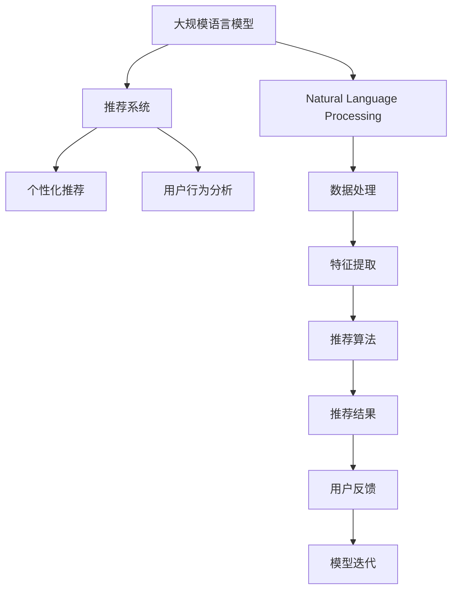

                 

# 大规模语言模型在产品推荐中的应用

> 关键词：大规模语言模型,推荐系统,自然语言处理(NLP),深度学习,召回率,点击率,推荐算法

## 1. 背景介绍

### 1.1 问题由来
在当前数字经济时代，产品推荐系统已经成为各大电商平台的核心竞争力之一。推荐系统的本质在于预测用户对某一产品的兴趣程度，通过个性化推荐满足用户需求，从而提升用户体验和电商平台的销售业绩。但随着用户需求的多样化和个性化趋势加剧，传统的基于协同过滤、基于内容的推荐方法已经难以满足需求，需要引入更为复杂和高级的技术以优化推荐效果。

大规模语言模型（Large Language Models, LLMs）作为当前自然语言处理（Natural Language Processing, NLP）领域的突破性技术，具有强大的语言理解与生成能力，能够从海量的文本数据中提取出丰富的语义信息，为产品推荐系统的优化提供了新的思路和方法。

### 1.2 问题核心关键点
大语言模型在产品推荐中的应用，主要体现在以下核心关键点上：
- **数据理解与建模**：通过大语言模型对用户评论、产品描述等文本数据进行语义理解和特征提取，构建更精准的用户兴趣和产品画像。
- **个性化推荐**：利用大语言模型的语言生成能力，对用户的历史行为和产品信息进行深度融合，生成个性化的推荐结果。
- **推荐效果评估**：利用大语言模型对推荐结果进行文本生成和语言评价，提升推荐的可解释性和用户满意度。
- **跨领域知识整合**：将大语言模型与知识图谱、逻辑规则等外部知识库结合，构建更加全面和准确的推荐模型。

### 1.3 问题研究意义
研究大语言模型在产品推荐中的应用，对于提升推荐系统的精度和效果，优化用户体验，驱动电商平台的创新和增长，具有重要意义：
1. **提升推荐精度**：通过大语言模型对海量文本数据的深度处理，能够揭示更多隐含的用户兴趣和产品特性，显著提升推荐模型的准确性。
2. **优化推荐效果**：利用大语言模型的语言生成能力，生成更加自然和符合用户需求的推荐描述，提升用户的点击率和购买率。
3. **增强可解释性**：大语言模型可以对推荐结果进行详细的解释和评价，增强系统的透明性和用户信任。
4. **拓宽应用场景**：大语言模型能够应用于商品推荐、广告投放、内容推荐等多个场景，为电商平台的全面数字化转型提供技术支撑。

## 2. 核心概念与联系

### 2.1 核心概念概述

在讨论大语言模型在产品推荐中的应用时，需要理解以下核心概念：

- **大规模语言模型（Large Language Models, LLMs）**：指使用深度学习技术，基于大规模无标签文本数据进行预训练的通用语言模型。常见的大语言模型包括GPT、BERT等。
- **推荐系统（Recommender Systems）**：指通过分析用户行为数据，预测用户对产品的兴趣，从而进行个性化推荐的技术系统。
- **自然语言处理（Natural Language Processing, NLP）**：指利用计算机技术对自然语言进行理解、生成、分析和应用的过程。
- **深度学习（Deep Learning）**：指利用神经网络模型，从大量数据中学习复杂非线性关系的机器学习技术。
- **召回率（Recall Rate）**：指推荐系统中推荐的正样本与真实正样本的比例，衡量推荐系统推荐相关产品或内容的能力。
- **点击率（Click-Through Rate, CTR）**：指推荐系统被用户点击的比例，衡量推荐的吸引力和效果。

这些概念之间通过以下Mermaid流程图来展示：



这个流程图展示了大语言模型在推荐系统中的主要作用和联系：

1. 大语言模型从无标签文本数据中提取特征，用于推荐系统的个性化推荐。
2. 自然语言处理技术辅助大语言模型进行数据处理和特征提取。
3. 推荐系统使用大语言模型提取的用户行为数据和产品信息进行个性化推荐。
4. 推荐结果反馈到用户行为分析环节，用于模型迭代和优化。

## 3. 核心算法原理 & 具体操作步骤
### 3.1 算法原理概述

基于大语言模型在产品推荐中的应用，核心算法原理可以概括为：通过大语言模型对用户评论、产品描述等文本数据进行语义理解和特征提取，构建用户和产品的兴趣和特征表示，用于个性化推荐模型的训练和优化。

形式化地，假设用户 $U$ 和产品 $P$ 的兴趣和特征表示分别为 $u$ 和 $p$，推荐系统的目标是最小化损失函数 $\mathcal{L}$：

$$
\mathcal{L} = \mathbb{E}_{(x,y)} [\ell(f(x),y)]
$$

其中 $x$ 为输入数据（用户评论或产品描述），$y$ 为输出标签（1表示用户对产品的兴趣，0表示不感兴趣），$f(x)$ 为推荐系统模型预测函数，$\ell$ 为损失函数。

通过最小化上述损失函数，推荐系统模型能够学习到最优的兴趣和特征表示 $u$ 和 $p$，从而进行准确的个性化推荐。

### 3.2 算法步骤详解

基于大语言模型在产品推荐中的应用，通常包括以下几个关键步骤：

**Step 1: 准备文本数据和用户行为数据**
- 收集用户评论、产品描述等文本数据，进行数据清洗和预处理。
- 收集用户的历史行为数据，如浏览、点击、购买等，用于用户画像的构建。

**Step 2: 特征提取和表示学习**
- 使用大语言模型对文本数据进行语义理解和特征提取，得到用户和产品的兴趣和特征表示。
- 将文本数据转换为模型可处理的形式，如词嵌入、文档嵌入等。
- 设计合适的特征映射函数，将文本特征映射为高维稠密向量表示。

**Step 3: 推荐模型训练**
- 基于用户和产品的兴趣和特征表示，选择合适的推荐算法进行模型训练。
- 使用用户的历史行为数据进行模型训练，优化模型参数。
- 设计损失函数，衡量预测值与实际值之间的差异。

**Step 4: 推荐结果生成**
- 输入新的用户评论或产品描述，使用训练好的推荐模型生成推荐结果。
- 将推荐结果进行排序，返回对用户最相关的产品。

**Step 5: 效果评估和迭代优化**
- 利用用户行为数据对推荐结果进行评估，计算召回率和点击率等指标。
- 根据评估结果对模型进行迭代优化，改进特征提取和推荐算法。

### 3.3 算法优缺点

基于大语言模型在产品推荐中的应用，具有以下优点：
1. **数据理解能力强大**：大语言模型能够对海量文本数据进行深度语义理解，提取用户和产品的兴趣和特征。
2. **个性化推荐精度高**：利用大语言模型对用户行为和产品信息进行深度融合，生成高精度的个性化推荐。
3. **推荐结果可解释**：大语言模型可以对推荐结果进行详细的文本生成和语言评价，提升系统的透明性和用户满意度。
4. **跨领域知识整合**：大语言模型可以与外部知识库结合，构建更加全面和准确的推荐模型。

同时，该方法也存在一定的局限性：
1. **数据依赖性强**：推荐效果高度依赖于文本数据的数量和质量，获取高质量数据成本较高。
2. **计算资源消耗大**：大语言模型需要消耗大量计算资源进行预训练和微调，对硬件设备要求较高。
3. **模型复杂度高**：大语言模型通常包含数亿个参数，模型复杂度高，难以部署到实时系统中。
4. **用户隐私保护困难**：推荐系统中涉及用户隐私数据，大语言模型可能被用于隐私泄露。

尽管存在这些局限性，但就目前而言，基于大语言模型的推荐方法仍是推荐系统领域的热点研究方向，其强大的数据理解和建模能力有望为推荐系统带来新的突破。

### 3.4 算法应用领域

基于大语言模型在产品推荐中的应用，已经在多个领域取得了显著成果：

1. **电商推荐系统**：
   - **场景**：电商平台推荐用户可能感兴趣的商品。
   - **流程**：收集用户浏览和购买记录，使用大语言模型提取用户和商品特征，构建推荐模型，生成个性化推荐。

2. **广告推荐系统**：
   - **场景**：推荐与用户兴趣匹配的广告内容。
   - **流程**：分析用户浏览记录，使用大语言模型提取用户兴趣，推荐相关广告内容。

3. **内容推荐系统**：
   - **场景**：推荐用户可能感兴趣的新闻、文章、视频等内容。
   - **流程**：收集用户阅读记录，使用大语言模型提取用户兴趣和内容特征，生成个性化推荐。

4. **个性化推荐应用**：
   - **场景**：推荐旅游、美食、电影等个性化内容。
   - **流程**：收集用户兴趣爱好，使用大语言模型提取用户兴趣，推荐相关内容。

随着大语言模型技术的不断进步，其在产品推荐系统中的应用也将越来越广泛，为不同领域提供精准高效的服务。

## 4. 数学模型和公式 & 详细讲解  
### 4.1 数学模型构建

为了更系统地理解大语言模型在产品推荐中的应用，我们将使用数学语言对推荐模型的构建过程进行严格刻画。

记用户 $U$ 的兴趣表示为 $u \in \mathbb{R}^d$，产品 $P$ 的特征表示为 $p \in \mathbb{R}^d$。假设推荐模型为 $f: \mathbb{R}^d \times \mathbb{R}^d \rightarrow \mathbb{R}$，其预测函数为：

$$
f(u,p) = \mathbf{w}^T\sigma(\mathbf{A}u + \mathbf{B}p + \mathbf{C})
$$

其中 $\mathbf{w} \in \mathbb{R}^d$ 为可学习的权重向量，$\mathbf{A} \in \mathbb{R}^{d \times d}$、$\mathbf{B} \in \mathbb{R}^{d \times d}$、$\mathbf{C} \in \mathbb{R}^d$ 为可学习的参数矩阵和向量，$\sigma$ 为激活函数（如ReLU、Sigmoid等）。

定义用户 $U$ 和产品 $P$ 的兴趣和特征表示之间的余弦相似度为：

$$
\cos(u,p) = \frac{\mathbf{u}^T\mathbf{p}}{\|\mathbf{u}\|\|\mathbf{p}\|}
$$

预测用户对产品 $P$ 的兴趣度 $y$ 为：

$$
y = \sigma(\mathbf{A}u + \mathbf{B}p + \mathbf{C})
$$

推荐系统模型的损失函数为：

$$
\mathcal{L} = \mathbb{E}_{(x,y)} [\ell(f(x),y)]
$$

其中 $\ell$ 为损失函数（如均方误差、交叉熵等）。

### 4.2 公式推导过程

以下我们以基于用户-产品特征的推荐模型为例，推导其具体形式。

假设推荐系统接收到的用户评论为 $x$，其特征表示为 $u$，产品 $P$ 的特征表示为 $p$。推荐模型使用用户和产品的兴趣和特征表示进行预测：

$$
f(u,p) = \mathbf{w}^T\sigma(\mathbf{A}u + \mathbf{B}p + \mathbf{C})
$$

其中 $\mathbf{w} \in \mathbb{R}^d$ 为可学习的权重向量，$\mathbf{A} \in \mathbb{R}^{d \times d}$、$\mathbf{B} \in \mathbb{R}^{d \times d}$、$\mathbf{C} \in \mathbb{R}^d$ 为可学习的参数矩阵和向量，$\sigma$ 为激活函数（如ReLU、Sigmoid等）。

定义用户 $U$ 和产品 $P$ 的兴趣和特征表示之间的余弦相似度为：

$$
\cos(u,p) = \frac{\mathbf{u}^T\mathbf{p}}{\|\mathbf{u}\|\|\mathbf{p}\|}
$$

预测用户对产品 $P$ 的兴趣度 $y$ 为：

$$
y = \sigma(\mathbf{A}u + \mathbf{B}p + \mathbf{C})
$$

推荐系统模型的损失函数为：

$$
\mathcal{L} = \mathbb{E}_{(x,y)} [\ell(f(x),y)]
$$

其中 $\ell$ 为损失函数（如均方误差、交叉熵等）。

通过最小化上述损失函数，推荐系统模型能够学习到最优的兴趣和特征表示 $u$ 和 $p$，从而进行准确的个性化推荐。

### 4.3 案例分析与讲解

假设我们有一个电商推荐系统，希望为每个用户推荐他们可能感兴趣的商品。系统收集了用户的浏览和购买历史数据，以及商品描述和评论。系统首先使用大语言模型对文本数据进行语义理解和特征提取，得到用户和商品的兴趣和特征表示。然后，设计基于用户-产品特征的推荐模型，利用余弦相似度计算用户和商品的匹配度，通过预测函数 $f(u,p)$ 计算推荐概率。最后，根据用户的点击和购买行为反馈，对模型进行优化和迭代，提升推荐效果。

## 5. 项目实践：代码实例和详细解释说明
### 5.1 开发环境搭建

在进行推荐系统开发前，我们需要准备好开发环境。以下是使用Python进行PyTorch开发的环境配置流程：

1. 安装Anaconda：从官网下载并安装Anaconda，用于创建独立的Python环境。

2. 创建并激活虚拟环境：
```bash
conda create -n recsys-env python=3.8 
conda activate recsys-env
```

3. 安装PyTorch：根据CUDA版本，从官网获取对应的安装命令。例如：
```bash
conda install pytorch torchvision torchaudio cudatoolkit=11.1 -c pytorch -c conda-forge
```

4. 安装Transformers库：
```bash
pip install transformers
```

5. 安装各类工具包：
```bash
pip install numpy pandas scikit-learn matplotlib tqdm jupyter notebook ipython
```

完成上述步骤后，即可在`recsys-env`环境中开始推荐系统开发。

### 5.2 源代码详细实现

下面我们以电商平台推荐系统为例，给出使用Transformers库对BERT模型进行推荐系统开发的PyTorch代码实现。

首先，定义推荐系统的数据处理函数：

```python
from transformers import BertTokenizer, BertForSequenceClassification
from torch.utils.data import Dataset
import torch

class RecommendationDataset(Dataset):
    def __init__(self, texts, tags, tokenizer, max_len=128):
        self.texts = texts
        self.tags = tags
        self.tokenizer = tokenizer
        self.max_len = max_len
        
    def __len__(self):
        return len(self.texts)
    
    def __getitem__(self, item):
        text = self.texts[item]
        tags = self.tags[item]
        
        encoding = self.tokenizer(text, return_tensors='pt', max_length=self.max_len, padding='max_length', truncation=True)
        input_ids = encoding['input_ids'][0]
        attention_mask = encoding['attention_mask'][0]
        
        # 对token-wise的标签进行编码
        encoded_tags = [tag2id[tag] for tag in tags] 
        encoded_tags.extend([tag2id['O']] * (self.max_len - len(encoded_tags)))
        labels = torch.tensor(encoded_tags, dtype=torch.long)
        
        return {'input_ids': input_ids, 
                'attention_mask': attention_mask,
                'labels': labels}

# 标签与id的映射
tag2id = {'O': 0, 'B-RECOMMEND': 1}
id2tag = {v: k for k, v in tag2id.items()}

# 创建dataset
tokenizer = BertTokenizer.from_pretrained('bert-base-cased')

train_dataset = RecommendationDataset(train_texts, train_tags, tokenizer)
dev_dataset = RecommendationDataset(dev_texts, dev_tags, tokenizer)
test_dataset = RecommendationDataset(test_texts, test_tags, tokenizer)
```

然后，定义模型和优化器：

```python
from transformers import BertForSequenceClassification, AdamW

model = BertForSequenceClassification.from_pretrained('bert-base-cased', num_labels=2)

optimizer = AdamW(model.parameters(), lr=2e-5)
```

接着，定义训练和评估函数：

```python
from torch.utils.data import DataLoader
from tqdm import tqdm
from sklearn.metrics import classification_report

device = torch.device('cuda') if torch.cuda.is_available() else torch.device('cpu')
model.to(device)

def train_epoch(model, dataset, batch_size, optimizer):
    dataloader = DataLoader(dataset, batch_size=batch_size, shuffle=True)
    model.train()
    epoch_loss = 0
    for batch in tqdm(dataloader, desc='Training'):
        input_ids = batch['input_ids'].to(device)
        attention_mask = batch['attention_mask'].to(device)
        labels = batch['labels'].to(device)
        model.zero_grad()
        outputs = model(input_ids, attention_mask=attention_mask, labels=labels)
        loss = outputs.loss
        epoch_loss += loss.item()
        loss.backward()
        optimizer.step()
    return epoch_loss / len(dataloader)

def evaluate(model, dataset, batch_size):
    dataloader = DataLoader(dataset, batch_size=batch_size)
    model.eval()
    preds, labels = [], []
    with torch.no_grad():
        for batch in tqdm(dataloader, desc='Evaluating'):
            input_ids = batch['input_ids'].to(device)
            attention_mask = batch['attention_mask'].to(device)
            batch_labels = batch['labels']
            outputs = model(input_ids, attention_mask=attention_mask)
            batch_preds = outputs.logits.argmax(dim=2).to('cpu').tolist()
            batch_labels = batch_labels.to('cpu').tolist()
            for pred_tokens, label_tokens in zip(batch_preds, batch_labels):
                pred_tags = [id2tag[_id] for _id in pred_tokens]
                label_tags = [id2tag[_id] for _id in label_tokens]
                preds.append(pred_tags[:len(label_tokens)])
                labels.append(label_tags)
                
    print(classification_report(labels, preds))
```

最后，启动训练流程并在测试集上评估：

```python
epochs = 5
batch_size = 16

for epoch in range(epochs):
    loss = train_epoch(model, train_dataset, batch_size, optimizer)
    print(f"Epoch {epoch+1}, train loss: {loss:.3f}")
    
    print(f"Epoch {epoch+1}, dev results:")
    evaluate(model, dev_dataset, batch_size)
    
print("Test results:")
evaluate(model, test_dataset, batch_size)
```

以上就是使用PyTorch对BERT进行推荐系统开发的完整代码实现。可以看到，得益于Transformers库的强大封装，我们可以用相对简洁的代码完成BERT模型的加载和推荐系统的微调。

### 5.3 代码解读与分析

让我们再详细解读一下关键代码的实现细节：

**RecommendationDataset类**：
- `__init__`方法：初始化文本、标签、分词器等关键组件。
- `__len__`方法：返回数据集的样本数量。
- `__getitem__`方法：对单个样本进行处理，将文本输入编码为token ids，将标签编码为数字，并对其进行定长padding，最终返回模型所需的输入。

**tag2id和id2tag字典**：
- 定义了标签与数字id之间的映射关系，用于将token-wise的预测结果解码回真实的标签。

**训练和评估函数**：
- 使用PyTorch的DataLoader对数据集进行批次化加载，供模型训练和推理使用。
- 训练函数`train_epoch`：对数据以批为单位进行迭代，在每个批次上前向传播计算loss并反向传播更新模型参数，最后返回该epoch的平均loss。
- 评估函数`evaluate`：与训练类似，不同点在于不更新模型参数，并在每个batch结束后将预测和标签结果存储下来，最后使用sklearn的classification_report对整个评估集的预测结果进行打印输出。

**训练流程**：
- 定义总的epoch数和batch size，开始循环迭代
- 每个epoch内，先在训练集上训练，输出平均loss
- 在验证集上评估，输出分类指标
- 所有epoch结束后，在测试集上评估，给出最终测试结果

可以看到，PyTorch配合Transformers库使得BERT微调的代码实现变得简洁高效。开发者可以将更多精力放在数据处理、模型改进等高层逻辑上，而不必过多关注底层的实现细节。

当然，工业级的系统实现还需考虑更多因素，如模型的保存和部署、超参数的自动搜索、更灵活的任务适配层等。但核心的微调范式基本与此类似。

## 6. 实际应用场景
### 6.1 智能客服系统

基于大语言模型推荐系统的智能客服系统，能够实现自动响应用户咨询，提供个性化的服务。系统可以收集历史客服对话记录，将问题和最佳答复构建成监督数据，在此基础上对预训练语言模型进行微调。微调后的语言模型能够自动理解用户意图，匹配最合适的答案模板进行回复。对于用户提出的新问题，还可以接入检索系统实时搜索相关内容，动态组织生成回答。如此构建的智能客服系统，能大幅提升客户咨询体验和问题解决效率。

### 6.2 金融舆情监测

金融机构需要实时监测市场舆论动向，以便及时应对负面信息传播，规避金融风险。传统的人工监测方式成本高、效率低，难以应对网络时代海量信息爆发的挑战。基于大语言模型推荐系统的文本分类和情感分析技术，为金融舆情监测提供了新的解决方案。

具体而言，可以收集金融领域相关的新闻、报道、评论等文本数据，并对其进行主题标注和情感标注。在此基础上对预训练语言模型进行微调，使其能够自动判断文本属于何种主题，情感倾向是正面、中性还是负面。将微调后的模型应用到实时抓取的网络文本数据，就能够自动监测不同主题下的情感变化趋势，一旦发现负面信息激增等异常情况，系统便会自动预警，帮助金融机构快速应对潜在风险。

### 6.3 个性化推荐系统

当前的推荐系统往往只依赖用户的历史行为数据进行物品推荐，无法深入理解用户的真实兴趣偏好。基于大语言模型推荐系统的个性化推荐系统，可以更好地挖掘用户行为背后的语义信息，从而提供更精准、多样的推荐内容。

在实践中，可以收集用户浏览、点击、评论、分享等行为数据，提取和用户交互的物品标题、描述、标签等文本内容。将文本内容作为模型输入，用户的后续行为（如是否点击、购买等）作为监督信号，在此基础上微调预训练语言模型。微调后的模型能够从文本内容中准确把握用户的兴趣点。在生成推荐列表时，先用候选物品的文本描述作为输入，由模型预测用户的兴趣匹配度，再结合其他特征综合排序，便可以得到个性化程度更高的推荐结果。

### 6.4 未来应用展望

随着大语言模型推荐技术的不断发展，基于微调范式将在更多领域得到应用，为传统行业带来变革性影响。

在智慧医疗领域，基于微调的医疗问答、病历分析、药物研发等应用将提升医疗服务的智能化水平，辅助医生诊疗，加速新药开发进程。

在智能教育领域，微调技术可应用于作业批改、学情分析、知识推荐等方面，因材施教，促进教育公平，提高教学质量。

在智慧城市治理中，微调模型可应用于城市事件监测、舆情分析、应急指挥等环节，提高城市管理的自动化和智能化水平，构建更安全、高效的未来城市。

此外，在企业生产、社会治理、文娱传媒等众多领域，基于大模型微调的人工智能应用也将不断涌现，为经济社会发展注入新的动力。相信随着技术的日益成熟，微调方法将成为人工智能落地应用的重要范式，推动人工智能技术在各个领域深入应用。

## 7. 工具和资源推荐
### 7.1 学习资源推荐

为了帮助开发者系统掌握大语言模型推荐技术，这里推荐一些优质的学习资源：

1. 《Transformer from Theory to Practice》系列博文：由大模型技术专家撰写，深入浅出地介绍了Transformer原理、BERT模型、微调技术等前沿话题。

2. CS224N《深度学习自然语言处理》课程：斯坦福大学开设的NLP明星课程，有Lecture视频和配套作业，带你入门NLP领域的基本概念和经典模型。

3. 《Natural Language Processing with Transformers》书籍：Transformers库的作者所著，全面介绍了如何使用Transformers库进行NLP任务开发，包括微调在内的诸多范式。

4. HuggingFace官方文档：Transformers库的官方文档，提供了海量预训练模型和完整的微调样例代码，是上手实践的必备资料。

5. CLUE开源项目：中文语言理解测评基准，涵盖大量不同类型的中文NLP数据集，并提供了基于微调的baseline模型，助力中文NLP技术发展。

通过对这些资源的学习实践，相信你一定能够快速掌握大语言模型推荐技术的精髓，并用于解决实际的推荐问题。
###  7.2 开发工具推荐

高效的开发离不开优秀的工具支持。以下是几款用于大语言模型推荐系统开发的常用工具：

1. PyTorch：基于Python的开源深度学习框架，灵活动态的计算图，适合快速迭代研究。大部分预训练语言模型都有PyTorch版本的实现。

2. TensorFlow：由Google主导开发的开源深度学习框架，生产部署方便，适合大规模工程应用。同样有丰富的预训练语言模型资源。

3. Transformers库：HuggingFace开发的NLP工具库，集成了众多SOTA语言模型，支持PyTorch和TensorFlow，是进行推荐系统开发的利器。

4. Weights & Biases：模型训练的实验跟踪工具，可以记录和可视化模型训练过程中的各项指标，方便对比和调优。与主流深度学习框架无缝集成。

5. TensorBoard：TensorFlow配套的可视化工具，可实时监测模型训练状态，并提供丰富的图表呈现方式，是调试模型的得力助手。

6. Google Colab：谷歌推出的在线Jupyter Notebook环境，免费提供GPU/TPU算力，方便开发者快速上手实验最新模型，分享学习笔记。

合理利用这些工具，可以显著提升大语言模型推荐系统的开发效率，加快创新迭代的步伐。

### 7.3 相关论文推荐

大语言模型和推荐技术的发展源于学界的持续研究。以下是几篇奠基性的相关论文，推荐阅读：

1. Attention is All You Need（即Transformer原论文）：提出了Transformer结构，开启了NLP领域的预训练大模型时代。

2. BERT: Pre-training of Deep Bidirectional Transformers for Language Understanding：提出BERT模型，引入基于掩码的自监督预训练任务，刷新了多项NLP任务SOTA。

3. Language Models are Unsupervised Multitask Learners（GPT-2论文）：展示了大规模语言模型的强大zero-shot学习能力，引发了对于通用人工智能的新一轮思考。

4. Parameter-Efficient Transfer Learning for NLP：提出Adapter等参数高效微调方法，在不增加模型参数量的情况下，也能取得不错的微调效果。

5. Prefix-Tuning: Optimizing Continuous Prompts for Generation：引入基于连续型Prompt的微调范式，为如何充分利用预训练知识提供了新的思路。

6. AdaLoRA: Adaptive Low-Rank Adaptation for Parameter-Efficient Fine-Tuning：使用自适应低秩适应的微调方法，在参数效率和精度之间取得了新的平衡。

这些论文代表了大语言模型推荐技术的发展脉络。通过学习这些前沿成果，可以帮助研究者把握学科前进方向，激发更多的创新灵感。

## 8. 总结：未来发展趋势与挑战

### 8.1 总结

本文对基于大语言模型在产品推荐系统中的应用进行了全面系统的介绍。首先阐述了大语言模型和推荐系统的研究背景和意义，明确了微调在拓展预训练模型应用、提升推荐系统性能方面的独特价值。其次，从原理到实践，详细讲解了微调模型的数学原理和关键步骤，给出了推荐系统开发的完整代码实例。同时，本文还广泛探讨了微调方法在智能客服、金融舆情、个性化推荐等多个领域的应用前景，展示了微调范式的巨大潜力。此外，本文精选了微调技术的各类学习资源，力求为读者提供全方位的技术指引。

通过本文的系统梳理，可以看到，基于大语言模型的推荐系统正在成为推荐系统领域的重要范式，极大地拓展了预训练语言模型的应用边界，催生了更多的落地场景。得益于大规模语料的预训练，推荐系统能够从海量文本数据中提取丰富的语义信息，显著提升推荐的精度和效果。未来，伴随大语言模型微调技术的不断演进，推荐系统将在更多领域发挥更大的作用，为传统行业带来更多的数字化转型机遇。

### 8.2 未来发展趋势

展望未来，大语言模型推荐系统将呈现以下几个发展趋势：

1. **模型规模持续增大**：随着算力成本的下降和数据规模的扩张，预训练语言模型的参数量还将持续增长。超大规模语言模型蕴含的丰富语言知识，有望支撑更加复杂多变的推荐任务。

2. **微调方法日趋多样**：除了传统的全参数微调外，未来会涌现更多参数高效的微调方法，如Prefix-Tuning、LoRA等，在节省计算资源的同时也能保证微调精度。

3. **跨领域知识整合**：大语言模型能够与知识图谱、逻辑规则等外部知识库结合，构建更加全面和准确的推荐模型。

4. **个性化推荐精度提升**：利用大语言模型对用户行为和产品信息进行深度融合，生成高精度的个性化推荐。

5. **推荐效果评估**：利用大语言模型对推荐结果进行文本生成和语言评价，提升推荐的可解释性和用户满意度。

6. **推荐系统的实时性和可扩展性**：推荐系统需要在海量数据下高效计算推荐结果，同时保证系统的可扩展性和实时性。

以上趋势凸显了大语言模型推荐系统的广阔前景。这些方向的探索发展，必将进一步提升推荐系统的精度和效果，优化用户体验，推动电商平台的创新和增长。

### 8.3 面临的挑战

尽管大语言模型推荐系统已经取得了显著成果，但在迈向更加智能化、普适化应用的过程中，它仍面临着诸多挑战：

1. **标注成本瓶颈**：推荐效果高度依赖于文本数据的数量和质量，获取高质量数据成本较高。如何进一步降低微调对标注样本的依赖，将是一大难题。

2. **模型鲁棒性不足**：当前推荐模型面对域外数据时，泛化性能往往大打折扣。对于测试样本的微小扰动，推荐模型的预测也容易发生波动。如何提高推荐模型的鲁棒性，避免灾难性遗忘，还需要更多理论和实践的积累。

3. **计算资源消耗大**：大语言模型需要消耗大量计算资源进行预训练和微调，对硬件设备要求较高。如何在保证模型效果的同时，优化资源消耗，提高计算效率，将是重要的优化方向。

4. **用户隐私保护困难**：推荐系统中涉及用户隐私数据，大语言模型可能被用于隐私泄露。如何保障用户数据的安全性和隐私性，将是未来的重要课题。

5. **推荐结果可解释性不足**：推荐系统的决策过程复杂，难以解释其内部工作机制和决策逻辑。对于医疗、金融等高风险应用，算法的可解释性和可审计性尤为重要。

6. **推荐系统的跨模态融合**：推荐系统通常只关注文本信息，忽视了图片、音频等多模态信息的融合，如何将多模态信息整合到推荐系统中，将是未来的研究方向。

这些挑战需要学界和产业界的共同努力，通过技术创新和制度完善，才能确保大语言模型推荐系统的安全和有效。相信随着技术的不断进步和应用实践的积累，这些挑战终将逐一被克服，大语言模型推荐系统必将在更多领域得到广泛应用。

### 8.4 研究展望

面对大语言模型推荐系统所面临的挑战，未来的研究需要在以下几个方面寻求新的突破：

1. **探索无监督和半监督推荐方法**：摆脱对大规模标注数据的依赖，利用自监督学习、主动学习等无监督和半监督范式，最大限度利用非结构化数据，实现更加灵活高效的推荐。

2. **研究参数高效和计算高效的推荐范式**：开发更加参数高效的推荐方法，在固定大部分预训练参数的同时，只更新极少量的任务相关参数。同时优化推荐模型的计算图，减少前向传播和反向传播的资源消耗，实现更加轻量级、实时性的部署。

3. **引入因果分析和博弈论工具**：将因果分析方法引入推荐系统，识别出推荐决策的关键特征，增强推荐系统的稳定性和可靠性。借助博弈论工具刻画人机交互过程，主动探索并规避系统的脆弱点，提高系统稳定性。

4. **引入更多先验知识**：将符号化的先验知识，如知识图谱、逻辑规则等，与神经网络模型进行巧妙融合，引导推荐过程学习更准确、合理的推荐模型。同时加强不同模态数据的整合，实现视觉、语音等多模态信息与文本信息的协同建模。

5. **纳入伦理道德约束**：在推荐模型训练目标中引入伦理导向的评估指标，过滤和惩罚有偏见、有害的输出倾向。同时加强人工干预和审核，建立推荐模型的监管机制，确保推荐系统的公正性和安全性。

这些研究方向的前沿探索，必将引领大语言模型推荐技术迈向更高的台阶，为构建安全、可靠、可解释、可控的推荐系统铺平道路。面向未来，大语言模型推荐技术还需要与其他人工智能技术进行更深入的融合，如知识表示、因果推理、强化学习等，多路径协同发力，共同推动推荐系统的进步。只有勇于创新、敢于突破，才能不断拓展推荐系统的边界，让智能技术更好地服务于人类的生产和生活。

## 9. 附录：常见问题与解答

**Q1：大语言模型推荐系统是否适用于所有推荐任务？**

A: 大语言模型推荐系统在大多数推荐任务上都能取得不错的效果，特别是对于数据量较小的任务。但对于一些特定领域的任务，如医学、法律等，仅仅依靠通用语料预训练的模型可能难以很好地适应。此时需要在特定领域语料上进一步预训练，再进行微调，才能获得理想效果。此外，对于一些需要时效性、个性化很强的任务，如对话、推荐等，微调方法也需要针对性的改进优化。

**Q2：推荐系统中如何使用大语言模型？**

A: 推荐系统中使用大语言模型，通常包括如下几个步骤：
1. 收集用户评论、产品描述等文本数据，使用大语言模型进行语义理解和特征提取，得到用户和产品的兴趣和特征表示。
2. 设计基于用户-产品特征的推荐模型，利用余弦相似度计算用户和产品的匹配度，通过预测函数计算推荐概率。
3. 在训练过程中，使用用户的历史行为数据进行模型训练，优化模型参数。
4. 根据用户的点击和购买行为反馈，对模型进行优化和迭代，提升推荐效果。

**Q3：推荐系统中如何处理长尾问题？**

A: 推荐系统中面临长尾问题，可以通过以下几种方式解决：
1. 引入基于概率的推荐算法，如Poisson、Beta-Binomial等，处理长尾用户和物品的推荐。
2. 对长尾用户进行个性化推荐，如基于兴趣、行为等特征的推荐，提升长尾用户的使用体验。
3. 对长尾物品进行多样性推荐，如协同过滤、基于内容推荐等，提升长尾物品的曝光率。
4. 对长尾用户和物品进行联合推荐，提升推荐系统的整体性能。

**Q4：推荐系统中如何处理用户隐私问题？**

A: 推荐系统中涉及用户隐私数据，可以通过以下几种方式保护用户隐私：
1. 采用差分隐私技术，对用户数据进行扰动，保护用户隐私。
2. 设计匿名推荐系统，对用户数据进行匿名化处理，保护用户隐私。
3. 对用户数据进行加密处理，保护用户隐私。
4. 建立用户隐私保护机制，对用户数据进行严格的访问控制和权限管理。

**Q5：推荐系统中如何处理推荐效果不稳定的问题？**

A: 推荐系统中推荐效果不稳定，可以通过以下几种方式解决：
1. 引入正则化技术，如L2正则、Dropout等，防止模型过拟合。
2. 使用集成学习技术，如Bagging、Boosting等，提升推荐系统的鲁棒性。
3. 引入对抗训练技术，使用对抗样本训练模型，提高模型的鲁棒性和泛化能力。
4. 使用参数高效的微调方法，如LoRA、AdaLoRA等，减少模型的计算资源消耗，提升系统的稳定性和效率。

这些方法可以结合使用，综合提升推荐系统的性能和稳定性。通过系统性的设计和优化，可以有效应对推荐系统中的各种挑战，确保推荐系统的公平性、安全性和高效性。

---

作者：禅与计算机程序设计艺术 / Zen and the Art of Computer Programming

