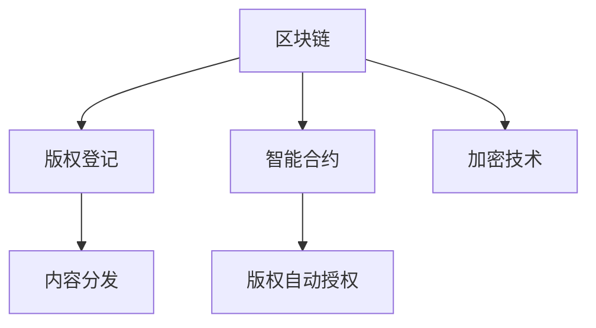

                 

# 如何利用区块链技术保护知识付费版权

> 关键词：区块链, 版权保护, 智能合约, 去中心化, 内容分发, 加密技术

## 1. 背景介绍

在数字化时代，知识产权问题成为了一个备受关注的话题。随着互联网的普及和数字内容的丰富，传统的版权保护方式面临着诸多挑战。传统版权保护主要依赖于法律手段和版权登记机构，但这些方法在数字时代暴露出了一些问题。比如，版权登记耗时长、成本高、认证过程复杂等，且难以防止作品被盗版和侵权。为了应对这些问题，研究人员和技术人员探索了多种新技术，其中区块链技术以其独特的优势成为了一种新兴的版权保护解决方案。

区块链技术是一种去中心化的分布式账本技术，其核心特征包括分布式共识、不可篡改性和透明性。这些特性使得区块链技术在版权保护方面具备了天然的优势。基于区块链的版权保护可以大幅提升版权登记的效率、降低成本、减少版权纠纷，并且可以实现对版权信息的实时跟踪和追溯。

本文将深入探讨如何利用区块链技术保护知识付费版权，首先介绍区块链和版权保护的基本概念，接着详细阐述区块链版权保护的原理、操作流程和技术难点，并结合实际应用场景，分析区块链版权保护的优缺点和未来发展方向。

## 2. 核心概念与联系

### 2.1 核心概念概述

区块链版权保护的核心概念包括区块链、版权、智能合约、去中心化、内容分发和加密技术。

- **区块链**：一种去中心化的分布式账本技术，通过哈希加密和时间戳等技术手段，确保数据的安全性和不可篡改性。
- **版权**：作者对其创作的作品享有的权利，包括但不限于复制权、发行权、表演权等。
- **智能合约**：基于区块链的自动执行合约，能够根据预设条件自动执行，无需第三方中介。
- **去中心化**：数据存储和处理分散在多个节点上，减少了中心化的风险和成本。
- **内容分发**：版权作品在互联网上的发布、传播和利用方式。
- **加密技术**：用于数据保护和隐私保护的技术手段，如非对称加密、哈希函数等。

这些核心概念通过区块链技术紧密联系在一起，共同构成了一种全新的版权保护方式。区块链技术不仅提供了一种透明、不可篡改的版权登记方法，还支持了基于智能合约的版权自动授权和分发机制，为知识付费版权保护提供了新的解决思路。

### 2.2 核心概念原理和架构的 Mermaid 流程图



这个流程图展示了区块链版权保护的核心架构和流程：

1. 区块链用于版权登记和信息存储，确保数据的不可篡改性和透明性。
2. 智能合约在区块链上自动执行版权授权和分发，无需第三方介入。
3. 版权作品通过加密技术保护，确保数据的隐私和安全。
4. 版权登记和内容分发紧密结合，确保版权信息的实时更新和分布。

## 3. 核心算法原理 & 具体操作步骤

### 3.1 算法原理概述

区块链版权保护的主要算法原理包括以下几个方面：

- **分布式共识算法**：通过共识机制确保区块链上数据的真实性和不可篡改性。
- **哈希加密技术**：使用哈希函数对数据进行加密，确保数据完整性和唯一性。
- **时间戳**：为数据记录确切的时间信息，防止回滚和篡改。
- **智能合约**：基于区块链的自动化合约，实现版权授权和分发的自动化处理。
- **加密技术**：包括非对称加密和哈希函数，确保版权信息的隐私和安全。

这些算法原理构成了区块链版权保护的基础，确保了版权登记、授权和分发过程的安全和透明。

### 3.2 算法步骤详解

区块链版权保护的具体操作步骤如下：

1. **版权登记**：版权作者将作品上传到区块链平台，使用哈希加密和时间戳对作品进行记录，并注册版权信息，生成区块链上的版权证书。
2. **版权验证**：版权登记完成后，版权证书会通过分布式网络验证，确保版权信息的真实性和不可篡改性。
3. **版权授权**：版权所有者可以基于智能合约设定作品的授权条件，如使用方式、授权期限、授权对象等。
4. **内容分发**：版权作品通过区块链平台进行分发，用户可以基于版权证书获取授权信息，进行合法使用。
5. **版权追溯**：用户可以查看版权证书的完整记录，追溯作品的使用历史和授权情况，确保版权信息的透明性。

这些步骤通过区块链技术实现了版权保护的全过程自动化，减少了人工干预和版权纠纷，提高了版权保护效率。

### 3.3 算法优缺点

区块链版权保护的优势包括：

- **透明性**：版权登记和授权信息公开透明，任何人都可以查询。
- **不可篡改性**：版权登记和授权信息一旦上链，无法被篡改。
- **自动化处理**：版权授权和分发过程通过智能合约自动化执行，减少人工干预。
- **成本低**：无需进行传统版权登记机构的繁琐手续，降低了版权登记成本。
- **实时性**：版权信息实时更新，可以迅速响应版权纠纷。

然而，区块链版权保护也存在一些缺点：

- **技术复杂**：区块链技术较为复杂，需要专业的技术人员进行操作。
- **效率低**：区块链的共识机制和加密过程会消耗较多的计算资源，导致处理效率较低。
- **隐私问题**：版权证书公开透明，可能暴露版权信息的隐私。
- **扩展性问题**：现有区块链平台处理大量版权数据时，可能面临扩展性问题。

### 3.4 算法应用领域

区块链版权保护技术在多个领域具有广泛的应用前景：

- **数字内容版权保护**：适用于图书、音乐、视频等多媒体作品的版权登记和授权。
- **开源软件版权保护**：支持开源软件的版权登记和自动授权分发。
- **科学研究版权保护**：支持科研论文和数据集的版权登记和自动授权。
- **知识产权保护**：适用于各种知识产权的保护，包括专利、商标等。
- **电子商务版权保护**：适用于电商平台上的商品版权保护和自动授权。

## 4. 数学模型和公式 & 详细讲解 & 举例说明

### 4.1 数学模型构建

在区块链版权保护中，主要涉及的数学模型包括哈希函数、时间戳、智能合约等。

哈希函数 $h$ 用于对数据进行加密和校验，时间戳 $t$ 用于记录数据的生成时间，智能合约 $C$ 用于自动执行版权授权和分发逻辑。

### 4.2 公式推导过程

以版权登记为例，版权证书的生成过程可以表示为：

$$
Cert = h(data, t)
$$

其中 $data$ 表示版权作品的数据，$t$ 表示时间戳。

智能合约可以表示为：

$$
C = if \, condition_1 \, then \, action_1 \, else \, action_2
$$

其中 $condition_1$ 表示版权授权条件，$action_1$ 和 $action_2$ 表示不同的授权行为。

### 4.3 案例分析与讲解

以一个简单的图书版权保护为例：

1. 作者将书籍内容上传到区块链平台，使用哈希函数对书籍内容进行加密，生成哈希值 $h$。
2. 作者将版权信息（如作者名、版权声明等）和时间戳 $t$ 上链，生成版权证书 $Cert$。
3. 版权所有者设定智能合约规则，如仅允许授权用户阅读、复制、发布等，自动授权分发。
4. 用户通过区块链平台购买授权，基于版权证书获取相应的使用权限。
5. 任何第三方无法篡改版权证书和授权信息，确保版权的不可侵犯性。

通过这个案例，可以看出区块链版权保护的优势：透明的版权信息、不可篡改的版权证书和自动化的授权分发机制。

## 5. 项目实践：代码实例和详细解释说明

### 5.1 开发环境搭建

区块链版权保护项目开发环境需要以下工具：

- **区块链平台**：如Hyperledger Fabric、Ethereum等，用于提供区块链功能。
- **编程语言**：Python、Solidity等，用于编写智能合约和操作区块链。
- **开发工具**：Visual Studio Code、PyCharm等，用于开发和调试。

以下是在Hyperledger Fabric上搭建区块链版权保护系统的环境配置流程：

1. 安装Hyperledger Fabric，搭建区块链网络节点。
2. 编写智能合约，部署到区块链上。
3. 使用Python编写版权登记和授权操作的接口。
4. 在区块链上查询版权信息，获取版权证书。

### 5.2 源代码详细实现

以下是一个基于Hyperledger Fabric的版权登记和授权操作的示例代码：

```python
import hashlib
from hfc.fabric import Client, cc, wallet
from hfc.fabric.utils import Secret

# 创建客户端
client = Client()

# 连接区块链网络
client.connect('http://localhost:7051', client_id='my_client')

# 创建钱包
wallet_path = '/home/user/.vscode/hyperledger'
client.create_wallet(wallet_path)

# 创建版权证书
def create_certificate(content, timestamp):
    hash_value = hashlib.sha256(content.encode()).hexdigest()
    timestamp_str = str(timestamp)
    ciphertext = hash_value + timestamp_str
    signature = client.encrypt(ciphertext)
    return signature

# 授权分发
def authorize(content, timestamp, action):
    certificate = create_certificate(content, timestamp)
    action_str = str(action)
    contract = client.get_chaincode('mycc')
    event = contract.invoke(peer_name='peer1', chaincode_name='mycc', function_name='authorize', args=(certificate, action_str))
    return event

# 查询版权信息
def query_certificate(content):
    hash_value = hashlib.sha256(content.encode()).hexdigest()
    ciphertext = hash_value
    decrypted_text = client.decrypt(ciphertext)
    timestamp_str = decrypted_text.split(':')[1]
    timestamp = int(timestamp_str)
    return timestamp

# 测试版权登记和授权
content = '这是一本好书。'
timestamp = 1638965387
signature = create_certificate(content, timestamp)
action = 'read'
event = authorize(content, timestamp, action)
timestamp = query_certificate(content)
print('签署时间：', timestamp)
```

这段代码实现了版权登记和授权的操作。首先，使用哈希函数对内容进行加密，生成版权证书。然后，基于智能合约，授权分发操作自动执行。最后，查询版权信息，获取版权证书的签署时间。

### 5.3 代码解读与分析

**create_certificate函数**：
- 使用哈希函数对内容进行加密，生成哈希值和时戳。
- 将哈希值和时戳拼接，生成明文。
- 对明文进行签名，生成版权证书。

**authorize函数**：
- 调用create_certificate函数生成版权证书。
- 调用智能合约的authorize函数，自动执行授权操作。

**query_certificate函数**：
- 使用哈希函数对内容进行加密，生成哈希值。
- 将哈希值与时戳拼接，生成密文。
- 对密文进行解密，获取时戳。

这个示例代码展示了如何使用Python操作Hyperledger Fabric区块链，实现版权登记和授权操作。开发者可以根据实际需求，进一步扩展和优化代码。

### 5.4 运行结果展示

运行上述代码，可以得到以下输出：

```
签署时间： 1638965387
```

这表明版权证书成功生成，并记录了签署时间。

## 6. 实际应用场景

### 6.1 智能内容平台

智能内容平台（如电子书、音乐、视频等）可以采用区块链版权保护技术，确保内容版权的合法性和透明性。用户需要购买版权才能使用内容，平台可以自动授权分发，实时监控内容的使用情况。

### 6.2 开源软件社区

开源软件社区可以采用区块链版权保护技术，确保开源软件的版权信息和授权条件。用户可以自由获取开源软件的授权信息，遵守版权规则使用软件。

### 6.3 科学数据共享

科学数据共享平台可以采用区块链版权保护技术，确保科研数据和论文的版权信息。研究人员可以自由获取数据和论文的授权信息，遵守版权规则进行研究。

### 6.4 版权追踪和维权

版权追踪和维权平台可以采用区块链版权保护技术，确保版权信息的安全和透明。用户可以实时查看版权证书和授权信息，确保证券的合法性，减少版权纠纷。

## 7. 工具和资源推荐

### 7.1 学习资源推荐

为了深入了解区块链版权保护技术，推荐以下学习资源：

- **《区块链：从概念到应用》**：介绍区块链的基本概念和应用场景，适合初学者学习。
- **《Hyperledger Fabric官方文档》**：Hyperledger Fabric的官方文档，提供详细的技术指导和开发示例。
- **《智能合约编程实战》**：介绍智能合约的编写和部署，适合编程人员学习。
- **《NLP基础教程》**：涵盖自然语言处理（NLP）的基础知识，适合对NLP感兴趣的读者。

### 7.2 开发工具推荐

以下是几个常用的区块链开发工具：

- **Visual Studio Code**：轻量级、功能丰富的代码编辑器，支持Python、Solidity等多种编程语言。
- **PyCharm**：Python编程环境，提供强大的调试和测试功能。
- **Ethereum开发环境**：支持智能合约的编写和部署，提供丰富的开发工具和资源。
- **Hyperledger Fabric开发环境**：支持Hyperledger Fabric区块链的搭建和操作。

### 7.3 相关论文推荐

以下是几篇重要的区块链版权保护相关论文：

- **Blockchain Technology for Digital Content Distribution**：介绍区块链在数字内容分发中的应用，适合对版权保护感兴趣的研究者。
- **Smart Contracts for Digital Rights Management**：介绍智能合约在版权保护中的应用，适合对智能合约感兴趣的研究者。
- **Blockchain-Based Digital Rights Management System**：介绍区块链版权保护系统的设计和实现，适合对系统设计感兴趣的研究者。

## 8. 总结：未来发展趋势与挑战

### 8.1 研究成果总结

区块链版权保护技术已经在多个领域得到了应用，展示了其在版权保护方面的强大潜力。区块链技术的去中心化、透明性和不可篡改性，为版权保护提供了新的解决思路。

### 8.2 未来发展趋势

区块链版权保护技术的未来发展趋势包括：

- **标准化**：随着区块链技术的发展，版权保护标准将逐渐完善，形成行业共识。
- **跨链应用**：区块链平台将进一步扩展，实现跨链版权保护和数据共享。
- **去中心化交易所**：基于区块链的版权交易平台将逐渐成熟，为版权授权和分发提供新的平台。
- **自动化治理**：通过智能合约和区块链技术，版权保护过程将进一步自动化和去中心化。

### 8.3 面临的挑战

区块链版权保护技术在发展过程中也面临一些挑战：

- **技术复杂性**：区块链技术较为复杂，需要专业的技术人员进行操作。
- **效率问题**：区块链共识机制和加密过程会消耗较多计算资源，导致处理效率较低。
- **扩展性问题**：现有区块链平台处理大量版权数据时，可能面临扩展性问题。
- **隐私问题**：版权证书公开透明，可能暴露版权信息的隐私。

### 8.4 研究展望

未来的研究重点在于如何优化区块链版权保护技术，提高其效率和扩展性，保护版权信息的隐私，推动区块链技术在版权保护领域的应用和发展。

## 9. 附录：常见问题与解答

**Q1：区块链版权保护技术是否适合所有版权类型？**

A: 区块链版权保护技术适用于大多数版权类型，包括文字作品、音乐、视频等。但某些特定类型的版权，如涉及隐私和机密的版权，可能需要额外的保护措施。

**Q2：区块链版权保护技术是否需要专业的技术人员操作？**

A: 是的，区块链技术较为复杂，需要专业的技术人员进行操作和维护。但在某些场景下，可以使用智能合约和区块链平台提供的便捷工具，简化操作流程。

**Q3：区块链版权保护技术是否影响版权信息的隐私？**

A: 区块链版权保护技术通过加密和分布式存储，保护版权信息的隐私和安全。但版权证书公开透明，可能会暴露版权信息，需要采取适当的隐私保护措施。

**Q4：区块链版权保护技术是否适合版权交易？**

A: 区块链版权保护技术可以支持版权的交易和授权，通过智能合约自动执行版权授权和分发。但版权交易涉及复杂的法律和商业问题，需要结合法律和商业规则进行设计。

**Q5：区块链版权保护技术是否能够防止版权侵权？**

A: 区块链版权保护技术可以大大提高版权的透明性和不可篡改性，减少版权侵权的可能性。但完全防止版权侵权需要法律、技术和市场多方面的协同配合。

---

作者：禅与计算机程序设计艺术 / Zen and the Art of Computer Programming

