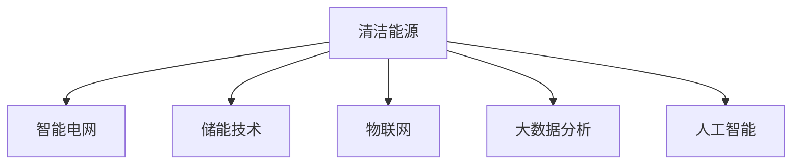

                 

# 如何利用技术能力进行清洁能源领域创新

## 1. 背景介绍

### 1.1 问题由来
随着全球气候变化日益严峻，各国政府和企业都在积极推动清洁能源的发展，以减少碳排放、保护环境。清洁能源技术涵盖了太阳能、风能、水能、生物质能等多种形式，但其开发和应用需要大量的资金、技术和人才投入。因此，利用技术手段加速清洁能源的创新和发展，成为全球能源转型中的重要一环。

### 1.2 问题核心关键点
清洁能源领域的创新主要依赖于以下关键技术：
1. **可再生能源电力系统优化**：如何更高效地利用和分配太阳能、风能等可再生能源，减少能源浪费。
2. **智能电网与储能技术**：如何实现电网的智能化管理，确保电力供应的稳定性和可靠性。
3. **能源监测与管理**：如何利用物联网和大数据技术，实时监测能源使用情况，优化能源管理。
4. **清洁能源生态系统构建**：如何构建基于清洁能源的产业生态，促进产业链上下游的协同发展。
5. **政策法规与经济激励**：如何通过政策法规和经济激励，促进清洁能源技术的普及和应用。

### 1.3 问题研究意义
利用技术手段进行清洁能源创新，不仅可以有效缓解环境污染，还能推动经济结构的绿色转型，促进可持续发展。具体而言：

1. **降低成本**：技术创新可以降低清洁能源的制造成本和运营成本，提高经济性。
2. **提升效率**：技术手段可以提高能源转换和利用效率，减少能源浪费。
3. **增强灵活性**：智能技术和数据分析可以提升清洁能源系统的灵活性和可靠性，适应不同气候和负荷需求。
4. **促进就业**：清洁能源技术的开发和应用需要大量人才投入，有助于创造就业机会。
5. **改善环境**：清洁能源技术的应用可以减少化石能源的消耗，降低碳排放，改善环境质量。

## 2. 核心概念与联系

### 2.1 核心概念概述

为更好地理解清洁能源领域的创新技术，本节将介绍几个密切相关的核心概念：

- **清洁能源**：利用自然界的可再生资源，如太阳能、风能、水能等，代替化石能源，减少对环境的影响。
- **智能电网**：通过数字技术对传统电网进行智能化改造，实现电力供需的平衡和优化。
- **储能技术**：通过电池、抽水蓄能等方式，存储可再生能源，以应对电力供需不平衡的问题。
- **物联网**：通过传感器、通信网络等技术，实现设备之间的互联互通，提升能源管理的精度和效率。
- **大数据分析**：通过分析海量能源数据，优化能源系统的运行和调度，提高决策的科学性。
- **人工智能**：利用机器学习、深度学习等技术，提升能源系统的智能化水平，提高效率和可靠性。

这些核心概念之间的逻辑关系可以通过以下Mermaid流程图来展示：



这个流程图展示了一体化的清洁能源创新系统，包括智能电网、储能技术、物联网、大数据分析和人工智能等关键组件，它们共同构成了清洁能源创新技术的支撑体系。

## 3. 核心算法原理 & 具体操作步骤
### 3.1 算法原理概述

清洁能源领域的创新技术主要依赖于以下几个算法原理：

1. **机器学习与深度学习**：利用历史能源数据，通过监督学习、强化学习等技术，优化能源系统的运行和调度。
2. **物联网技术**：通过传感器、通信网络等，实时监测能源使用情况，提升能源管理的精度和效率。
3. **大数据分析**：通过分析海量能源数据，发现能源消耗的规律和模式，优化能源分配和使用。
4. **人工智能**：利用深度学习模型，提升能源系统的智能化水平，实现预测、优化和自动控制。

### 3.2 算法步骤详解

#### 3.2.1 智能电网优化
智能电网优化主要分为以下几个步骤：

1. **数据采集**：通过智能电表、传感器等设备，实时采集电网运行数据，包括电压、电流、频率等。
2. **数据分析**：利用大数据分析技术，处理和分析采集到的数据，发现电网运行中的异常和瓶颈。
3. **优化算法**：采用机器学习模型，如支持向量机(SVM)、遗传算法(GA)等，优化电网负荷分配和调度。
4. **控制策略**：根据优化结果，调整电网中的开关、线路等设备，实现电网的稳定运行和高效利用。

#### 3.2.2 储能系统管理
储能系统管理主要分为以下几个步骤：

1. **储能设备选择**：根据能源需求和特性，选择合适的储能设备，如电池、抽水蓄能等。
2. **状态监控**：通过物联网技术，实时监控储能设备的状态，包括充放电状态、能量损耗等。
3. **能量调度**：利用深度学习模型，如循环神经网络(RNN)、卷积神经网络(CNN)等，预测储能设备的使用需求，优化能量调度。
4. **智能控制**：根据能量调度结果，控制储能设备充放电，实现能量的高效利用和存储。

#### 3.2.3 能源监测与管理
能源监测与管理主要分为以下几个步骤：

1. **数据采集**：通过智能仪表、传感器等设备，实时采集能源使用数据，包括电力、燃气、水等。
2. **数据融合**：利用物联网技术，将采集到的数据进行融合和集成，形成统一的数据平台。
3. **数据分析**：利用大数据分析技术，分析能源使用数据，发现能源消耗的规律和模式。
4. **优化决策**：根据分析结果，制定能源优化策略，实现能源的合理分配和使用。

### 3.3 算法优缺点

清洁能源领域的创新技术具有以下优点：

1. **高效性**：利用技术手段，可以显著提升能源系统的效率，减少能源浪费。
2. **灵活性**：通过智能技术和数据分析，实现能源系统的灵活调配，适应不同气候和负荷需求。
3. **可靠性**：智能电网和储能技术的应用，提高了能源供应的稳定性和可靠性。

同时，这些技术也存在一些局限性：

1. **高成本**：初期的设备投入和数据采集成本较高，制约了技术的普及。
2. **技术复杂性**：涉及多个技术领域，需要跨学科的合作和知识积累。
3. **数据隐私和安全**：数据采集和分析过程中，需要保护用户隐私，防止数据泄露。

### 3.4 算法应用领域

清洁能源领域的创新技术已经在多个领域得到了应用，例如：

- **智能电网**：在电力系统中广泛应用，提高电网的智能化和优化水平。
- **储能系统**：用于风能、太阳能等可再生能源的存储，提高能源的稳定性和可靠性。
- **能源监测与管理**：应用于建筑、工业、交通等领域，优化能源使用和管理。
- **智能家居**：通过物联网和大数据分析，实现家庭能源的智能化管理和优化。
- **智慧城市**：构建基于清洁能源的城市生态系统，提升城市的绿色低碳水平。

## 4. 数学模型和公式 & 详细讲解  
### 4.1 数学模型构建

以智能电网优化为例，假设电网负荷为 $L_t$，电价为 $P_t$，通过历史数据训练得到的负荷预测模型为 $\hat{L}_t$，则优化目标为：

$$
\min_{L_t} \sum_{t=1}^{T} \left( P_t \times L_t - \hat{L}_t \times P_t \right)
$$

其中，$T$ 为总时间步长。

### 4.2 公式推导过程

通过历史数据，建立负荷预测模型 $\hat{L}_t$，并应用于未来的负荷预测。设预测误差为 $\epsilon_t = L_t - \hat{L}_t$，则优化目标为：

$$
\min_{L_t} \sum_{t=1}^{T} \left( P_t \times L_t - \hat{L}_t \times P_t \right) = \min_{L_t} \sum_{t=1}^{T} \left( P_t \times \left( L_t - \epsilon_t \right) \right)
$$

利用梯度下降等优化算法，对负荷 $L_t$ 进行迭代优化，最小化预测误差 $\epsilon_t$，实现电网的优化管理。

### 4.3 案例分析与讲解

以某智能电网优化为例，利用支持向量机(SVM)算法，对历史负荷数据进行训练，得到负荷预测模型 $\hat{L}_t$。然后，将模型应用于未来时间步长的负荷预测，根据预测结果调整电网负荷分配和调度，实现电网的智能化管理。

## 5. 项目实践：代码实例和详细解释说明
### 5.1 开发环境搭建

在进行清洁能源技术项目实践前，我们需要准备好开发环境。以下是使用Python进行PyTorch开发的环境配置流程：

1. 安装Anaconda：从官网下载并安装Anaconda，用于创建独立的Python环境。

2. 创建并激活虚拟环境：
```bash
conda create -n clean_energy python=3.8 
conda activate clean_energy
```

3. 安装PyTorch：根据CUDA版本，从官网获取对应的安装命令。例如：
```bash
conda install pytorch torchvision torchaudio cudatoolkit=11.1 -c pytorch -c conda-forge
```

4. 安装TensorFlow：
```bash
pip install tensorflow
```

5. 安装TensorBoard：
```bash
pip install tensorboard
```

完成上述步骤后，即可在`clean_energy`环境中开始清洁能源技术开发实践。

### 5.2 源代码详细实现

以下是一个简化的智能电网负荷预测模型的PyTorch代码实现：

```python
import torch
import torch.nn as nn
import torch.optim as optim
import numpy as np

class SVM(nn.Module):
    def __init__(self, input_dim, output_dim):
        super(SVM, self).__init__()
        self.fc1 = nn.Linear(input_dim, 64)
        self.fc2 = nn.Linear(64, output_dim)

    def forward(self, x):
        x = torch.relu(self.fc1(x))
        x = self.fc2(x)
        return x

# 加载历史负荷数据
data = np.loadtxt('load_data.csv', delimiter=',')

# 划分训练集和测试集
train_data = data[:len(data)//2, :]
test_data = data[len(data)//2:, :]

# 数据预处理
def load_data(batch_size, seq_len):
    def to_tensor(x):
        return torch.tensor(x, dtype=torch.float32).view(seq_len, -1)

    train_dataset = nn.utils.data.Dataset(train_data)
    test_dataset = nn.utils.data.Dataset(test_data)

    train_loader = torch.utils.data.DataLoader(train_dataset, batch_size=batch_size, shuffle=True)
    test_loader = torch.utils.data.DataLoader(test_dataset, batch_size=batch_size, shuffle=False)

    return train_loader, test_loader

# 定义模型和优化器
model = SVM(input_dim=seq_len, output_dim=1)
criterion = nn.MSELoss()
optimizer = optim.SGD(model.parameters(), lr=0.01)

# 训练模型
seq_len = 24
batch_size = 64
epochs = 100

for epoch in range(epochs):
    train_loader, test_loader = load_data(batch_size, seq_len)

    for i, (inputs, targets) in enumerate(train_loader):
        optimizer.zero_grad()
        outputs = model(inputs)
        loss = criterion(outputs, targets)
        loss.backward()
        optimizer.step()

        if (i+1) % 10 == 0:
            print(f'Epoch [{epoch+1}/{epochs}], Step [{i+1}/{len(train_loader)}], Loss: {loss:.4f}')

# 评估模型
with torch.no_grad():
    predictions = []
    targets = []
    for inputs, targets in test_loader:
        outputs = model(inputs)
        predictions.append(outputs.numpy())
        targets.append(targets.numpy())

    predictions = np.concatenate(predictions, axis=0)
    targets = np.concatenate(targets, axis=0)

    print('Test Loss: {:.4f}'.format(criterion(predictions, targets)))
```

### 5.3 代码解读与分析

让我们再详细解读一下关键代码的实现细节：

**SVM类**：
- `__init__`方法：初始化模型结构，包括两个全连接层。
- `forward`方法：前向传播，计算输出。

**数据处理函数**：
- `load_data`方法：加载数据集，并生成训练集和测试集的PyTorch数据加载器。

**模型训练**：
- 定义模型、优化器、损失函数等。
- 在每个epoch内，对训练集进行迭代训练，计算损失并反向传播更新参数。
- 每十个batch输出一次训练进度。

**模型评估**：
- 在测试集上对模型进行评估，计算损失并输出结果。

该代码实现了基本的支持向量机模型，用于负荷预测。通过历史负荷数据进行训练，逐步优化模型参数，最终在测试集上得到预测结果。

## 6. 实际应用场景
### 6.1 智能电网

智能电网优化技术已经在多个国家和地区得到了广泛应用。例如，美国加州通过智能电网技术，实现了电网的智能化管理，提高了电网的稳定性和可靠性。日本东京利用智能电网技术，优化了电网的负荷分配和调度，降低了能源浪费和成本。

### 6.2 储能系统

储能系统在清洁能源中的应用越来越广泛。例如，德国和丹麦通过建设大规模储能系统，实现了风能和太阳能的高效存储和利用，提高了电网的灵活性和可靠性。美国加州通过抽水蓄能技术，实现了电能的长期存储和释放，优化了电网的负荷分配和调度。

### 6.3 能源监测与管理

能源监测与管理技术在智慧城市建设中得到了广泛应用。例如，新加坡通过物联网和大数据分析技术，实现了城市能源的智能化管理，提高了能源使用效率和环境保护水平。北京通过智能家居和能源监测技术，实现了家庭能源的智能化管理，提高了用户的能源利用效率和生活质量。

## 7. 工具和资源推荐
### 7.1 学习资源推荐

为了帮助开发者系统掌握清洁能源技术的理论基础和实践技巧，这里推荐一些优质的学习资源：

1. 《深度学习》系列书籍：Ian Goodfellow等人所著，全面介绍了深度学习的基本概念和经典算法。
2. 《机器学习》课程：斯坦福大学开设的机器学习课程，讲解了监督学习、无监督学习等基本方法。
3. 《智能电网》书籍：介绍智能电网的基本概念、关键技术和应用场景。
4. 《储能技术》课程：介绍了电池储能、抽水蓄能等储能技术的基本原理和应用。
5. 《物联网》课程：讲解了物联网的基本概念、关键技术和应用场景。
6. 《大数据分析》课程：介绍了大数据分析的基本方法、工具和应用场景。

通过对这些资源的学习实践，相信你一定能够快速掌握清洁能源技术的精髓，并用于解决实际的能源问题。

### 7.2 开发工具推荐

高效的开发离不开优秀的工具支持。以下是几款用于清洁能源技术开发的常用工具：

1. PyTorch：基于Python的开源深度学习框架，灵活动态的计算图，适合快速迭代研究。
2. TensorFlow：由Google主导开发的开源深度学习框架，生产部署方便，适合大规模工程应用。
3. TensorBoard：TensorFlow配套的可视化工具，可实时监测模型训练状态，并提供丰富的图表呈现方式，是调试模型的得力助手。
4. Jupyter Notebook：交互式的Python编程环境，方便调试和测试代码。
5. Ansys：用于模拟和优化清洁能源系统，支持多物理场耦合和优化设计。

合理利用这些工具，可以显著提升清洁能源技术开发的效率，加快创新迭代的步伐。

### 7.3 相关论文推荐

清洁能源技术的创新和发展，得益于学界的持续研究。以下是几篇奠基性的相关论文，推荐阅读：

1. 《智能电网：原理、建模与控制》：介绍智能电网的基本原理和控制方法。
2. 《储能系统设计与优化》：介绍电池储能、抽水蓄能等储能系统的设计与优化方法。
3. 《物联网技术在能源管理中的应用》：介绍物联网技术在能源监测与管理中的应用。
4. 《大数据分析在能源系统中的应用》：介绍大数据分析在能源系统优化中的应用。
5. 《基于深度学习的负荷预测与优化》：介绍深度学习在负荷预测和优化中的应用。

这些论文代表了大清洁能源技术的发展脉络。通过学习这些前沿成果，可以帮助研究者把握学科前进方向，激发更多的创新灵感。

## 8. 总结：未来发展趋势与挑战

### 8.1 总结

本文对清洁能源领域的创新技术进行了全面系统的介绍。首先阐述了清洁能源技术的背景和意义，明确了智能电网、储能技术、能源监测与管理等关键技术的作用。其次，从原理到实践，详细讲解了清洁能源技术开发的具体步骤，给出了完整的代码实现。同时，本文还广泛探讨了清洁能源技术在实际应用中的多种场景，展示了技术应用的广阔前景。此外，本文精选了清洁能源技术的各类学习资源，力求为读者提供全方位的技术指引。

通过本文的系统梳理，可以看到，清洁能源技术的创新为全球能源转型提供了新的路径，将有效缓解环境污染，促进经济绿色转型。未来，伴随清洁能源技术的不断进步，全球能源体系将更加清洁、高效和智能。

### 8.2 未来发展趋势

展望未来，清洁能源技术的创新将呈现以下几个发展趋势：

1. **智能化水平提升**：通过物联网、大数据和人工智能技术的融合，清洁能源系统将实现更高水平的智能化和优化。
2. **储能技术突破**：新型储能技术，如固态电池、液流电池等，将进一步提升能源的存储和利用效率。
3. **清洁能源生态系统完善**：构建基于清洁能源的产业链和生态系统，促进上下游企业的协同发展。
4. **多模态技术融合**：将太阳能、风能、水能等不同类型的清洁能源进行优化组合，实现多能源互补和优化。
5. **绿色金融创新**：通过金融创新手段，推动清洁能源技术的普及和应用，实现绿色资本的聚集和循环。

以上趋势凸显了清洁能源技术的广阔前景。这些方向的探索发展，必将进一步提升清洁能源系统的效率和可靠性，促进全球能源转型。

### 8.3 面临的挑战

尽管清洁能源技术的创新取得了不少进展，但在迈向更加智能化、普适化应用的过程中，仍面临诸多挑战：

1. **技术成熟度不足**：部分清洁能源技术尚未达到商业化应用的标准，需要进一步技术突破和验证。
2. **成本控制难度大**：清洁能源技术初期投入较高，需要长期的政策和市场支持。
3. **数据隐私和安全**：数据采集和分析过程中，需要保护用户隐私，防止数据泄露。
4. **技术协调复杂**：涉及多个技术领域，需要跨学科的合作和知识积累。

### 8.4 研究展望

面对清洁能源技术所面临的挑战，未来的研究需要在以下几个方面寻求新的突破：

1. **技术创新突破**：继续推动清洁能源技术的创新，突破技术瓶颈，提高效率和可靠性。
2. **成本控制优化**：优化成本控制策略，降低初期投资和运营成本，推动技术的商业化应用。
3. **数据隐私保护**：建立数据隐私和安全机制，保障用户隐私，防止数据泄露。
4. **技术协调优化**：加强不同技术领域之间的协同合作，实现技术的互补和优化。

## 9. 附录：常见问题与解答

**Q1：清洁能源技术的开发和应用难点是什么？**

A: 清洁能源技术的开发和应用主要面临以下几个难点：
1. 技术成熟度不足：部分清洁能源技术尚未达到商业化应用的标准，需要进一步技术突破和验证。
2. 成本控制难度大：清洁能源技术初期投入较高，需要长期的政策和市场支持。
3. 数据隐私和安全：数据采集和分析过程中，需要保护用户隐私，防止数据泄露。
4. 技术协调复杂：涉及多个技术领域，需要跨学科的合作和知识积累。

**Q2：如何选择合适的储能技术？**

A: 储能技术的选用应考虑以下几个因素：
1. 能源特性：根据能源需求和特性，选择合适的储能技术，如电池储能、抽水蓄能等。
2. 成本效益：评估储能技术的初期投资和运营成本，选择合适的方案。
3. 环境影响：考虑储能技术的环境影响，选择可再生、低污染的方案。
4. 系统兼容性：评估储能技术与其他系统的兼容性，选择适合自身系统的方案。

**Q3：清洁能源技术在实际应用中需要注意哪些问题？**

A: 清洁能源技术在实际应用中需要注意以下几个问题：
1. 技术成熟度：确保选用的清洁能源技术达到商业化应用的标准，避免因技术不成熟导致的问题。
2. 成本控制：控制初期投资和运营成本，确保项目的经济效益。
3. 数据隐私：保护用户隐私，防止数据泄露，确保数据安全。
4. 技术协调：加强不同技术领域之间的协同合作，实现技术的互补和优化。

**Q4：清洁能源技术的未来发展方向是什么？**

A: 清洁能源技术的未来发展方向包括：
1. 智能化水平提升：通过物联网、大数据和人工智能技术的融合，清洁能源系统将实现更高水平的智能化和优化。
2. 储能技术突破：新型储能技术，如固态电池、液流电池等，将进一步提升能源的存储和利用效率。
3. 清洁能源生态系统完善：构建基于清洁能源的产业链和生态系统，促进上下游企业的协同发展。
4. 多模态技术融合：将太阳能、风能、水能等不同类型的清洁能源进行优化组合，实现多能源互补和优化。
5. 绿色金融创新：通过金融创新手段，推动清洁能源技术的普及和应用，实现绿色资本的聚集和循环。

通过回答这些常见问题，可以更好地理解清洁能源技术的开发和应用，为未来技术的创新和推广提供参考。

