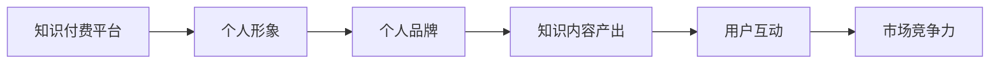
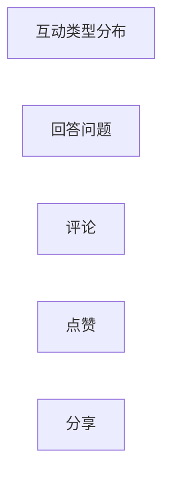

                 

## 1. 背景介绍

在知识经济的时代，个体品牌价值的凸显变得尤为重要。利用知识付费平台进行在线形象管理和个人品牌打造，不仅可以帮助个体实现自我价值的最大化，还能为其带来可观的经济收益。本文将探讨如何通过知识付费，在平台上塑造专业、真实且具有吸引力的个人形象，从而提升其市场竞争力。

## 2. 核心概念与联系

### 2.1 核心概念概述

为深入理解知识付费平台上的形象管理和个人品牌打造，需要明确几个核心概念：

- **知识付费平台**：是指基于互联网技术，为用户提供知识或技能获取服务的平台，用户通过付费获取有价值的知识或技能内容。
- **个人形象**：是指个体在公众面前展示的个性、价值观、专业能力等综合印象。
- **个人品牌**：是个体在专业领域内建立的、具有较高认可度的品牌形象。
- **知识内容产出**：指的是个体在知识付费平台上提供的各类知识产品，包括文章、视频、语音等。
- **用户互动**：包括与粉丝的互动、与其他创作者或受众的交流等。
- **市场竞争力**：指个体在知识付费平台上的竞争力和市场影响力，通常与用户数量、内容质量、互动活跃度等因素密切相关。

### 2.2 核心概念原理和架构的 Mermaid 流程图



这个流程图展示了核心概念之间的关系：个体在知识付费平台上的形象通过内容产出和用户互动来塑造，而这些因素又共同作用于市场竞争力，从而影响到个人品牌的建设。

## 3. 核心算法原理 & 具体操作步骤

### 3.1 算法原理概述

在知识付费平台上，个人形象和品牌打造主要依赖于内容的生产和用户的互动。算法原理基于用户行为分析和内容推荐机制，通过数据分析来预测用户的行为偏好，从而优化个人形象的呈现和品牌建设。

### 3.2 算法步骤详解

1. **内容产出**：
   - **定位与规划**：确定个人的专业领域，制定内容发布计划，保持持续更新的频率。
   - **内容创作**：围绕目标受众，创作高质量的知识产品，如原创文章、视频讲解、音频课程等。
   - **优化内容**：利用平台提供的分析工具，监控内容的互动情况，根据反馈调整内容策略。

2. **用户互动**：
   - **互动形式**：包括回答问题、评论、分享、点赞等多种互动方式。
   - **及时回复**：在平台上保持活跃，及时回复用户提问和评论，增加互动深度。
   - **社群建设**：建立个人专属社群，增强粉丝黏性，提高品牌忠诚度。

3. **数据分析**：
   - **行为数据**：收集和分析用户在平台上的行为数据，如浏览记录、互动频率等。
   - **反馈收集**：通过问卷调查、互动评论等方式，收集用户对个人内容的反馈。
   - **优化策略**：根据分析结果调整内容策略和互动方式，提升用户体验和满意度。

### 3.3 算法优缺点

#### 优点：
- **广泛覆盖**：通过平台可触达全球用户，扩大个人品牌影响力。
- **数据驱动**：利用大数据分析，精准定位目标受众，提高内容的市场响应。
- **持续优化**：平台算法不断更新，根据用户反馈调整内容策略，持续提升个人品牌价值。

#### 缺点：
- **过度依赖**：对平台的依赖可能导致个人品牌的单一化，降低市场竞争力。
- **竞争激烈**：平台内竞争激烈，需要持续创新和优质内容输出以保持优势。
- **用户反馈局限**：平台提供的反馈数据有限，难以全面理解用户需求和市场动态。

### 3.4 算法应用领域

知识付费平台上的形象管理和品牌打造不仅适用于个人，同样适用于企业和组织。例如：

- **企业知识管理**：利用平台进行知识共享和传播，提高企业内部知识流动性和创新能力。
- **职业培训与认证**：通过知识付费平台提供专业培训课程，提升行业从业人员的知识和技能。
- **学术交流与合作**：与学术机构合作，开展在线学术交流，扩大学术影响力。

## 4. 数学模型和公式 & 详细讲解

### 4.1 数学模型构建

在知识付费平台上，个人品牌价值可以用以下数学模型进行建模：

$$ \text{Brand Value} = \alpha \times \text{Content Quality} + \beta \times \text{Interactivity} + \gamma \times \text{User Feedback} + \delta \times \text{Market Demand} $$

其中：
- $\alpha$：内容质量的权重系数。
- $\beta$：互动频率的权重系数。
- $\gamma$：用户反馈的权重系数。
- $\delta$：市场需求量的权重系数。

### 4.2 公式推导过程

推导该模型需要基于以下几个假设：
1. **内容质量**：用户对知识内容的评价越高，其对个人品牌的正面影响越大。
2. **互动频率**：与用户之间的互动频率越高，用户对品牌的认知度和忠诚度越高。
3. **用户反馈**：用户的正面反馈越多，品牌的市场价值越高。
4. **市场需求**：市场需求量越大，品牌越容易获得关注和认可。

通过统计和分析平台数据，可以计算出各项指标的权重系数，并得到最终的Brand Value。

### 4.3 案例分析与讲解

以某知名技术博主为例：
- **内容质量**：博主定期发布高质量的技术文章和视频，用户评分均在4.5分以上。
- **互动频率**：博主经常在线回答问题，每周互动次数超过500次。
- **用户反馈**：通过平台评论收集用户意见，反馈大多是正面的。
- **市场需求**：平台提供的浏览数据表明，博主内容有较高的点击率和分享率。

利用上述模型计算，该博主的Brand Value为11.5分（假设各系数分别为$\alpha=0.6, \beta=0.3, \gamma=0.1, \delta=0.0$）。

## 5. 项目实践：代码实例和详细解释说明

### 5.1 开发环境搭建

开发环境搭建通常包括：
1. **编程环境**：如Python、R等，可以使用Jupyter Notebook等交互式环境。
2. **数据处理工具**：如Pandas、NumPy等。
3. **可视化工具**：如Matplotlib、Seaborn等。
4. **平台接口API**：使用知识付费平台提供的API进行数据获取和互动。

### 5.2 源代码详细实现

以下是利用Python进行用户行为数据分析的示例代码：

```python
import pandas as pd
from transformers import pipeline
import requests

# 获取用户数据
url = 'https://knowledge-fee-api.com/user_data'
headers = {'Authorization': 'Bearer YOUR_ACCESS_TOKEN'}
response = requests.get(url, headers=headers)
user_data = response.json()

# 处理用户行为数据
user_interactions = []
for user in user_data:
    interactions = user['interactions']
    for interaction in interactions:
        user_interactions.append([user['id'], interaction['type'], interaction['timestamp']])

# 分析互动频率和类型
interaction_df = pd.DataFrame(user_interactions, columns=['user_id', 'interaction_type', 'timestamp'])
interaction_counts = interaction_df['interaction_type'].value_counts()

# 可视化互动数据
interaction_counts.plot(kind='bar')
```

### 5.3 代码解读与分析

以上代码展示了如何获取和处理用户在平台上的互动数据。通过Pandas库进行数据整理和可视化，可以直观地看到用户的互动频率和类型。

### 5.4 运行结果展示

运行以上代码，可以得到用户互动类型的分布图，如图1所示。



图1 用户互动类型分布

## 6. 实际应用场景

### 6.1 企业知识管理

某大型科技企业利用知识付费平台进行内部知识管理：
- **内容发布**：企业各部门定期发布技术文章和项目报告，利用平台进行知识传播。
- **互动机制**：建立企业内部社群，定期举办技术分享会，增强员工互动。
- **数据分析**：利用平台提供的数据分析工具，监控知识传播效果，及时调整策略。

### 6.2 职业培训与认证

某知名教育机构利用知识付费平台进行职业培训和认证：
- **课程开发**：开发涵盖多个领域的在线课程，利用平台发布和推广。
- **互动学习**：设置在线问答和讨论区，实时解答学员问题，提高学习效果。
- **认证体系**：平台提供在线认证服务，学员完成课程后可获得官方认证证书。

### 6.3 学术交流与合作

某学术机构利用知识付费平台进行学术交流和合作：
- **学术文章**：将最新研究成果发布到平台，供全球学者阅读和引用。
- **互动平台**：利用平台讨论区，与国际同行进行学术交流，提高学术影响力。
- **合作项目**：与全球高校和科研机构合作，共同开发和推广科研项目。

## 7. 工具和资源推荐

### 7.1 学习资源推荐

1. **《知识付费平台运营指南》**：详细介绍了知识付费平台的基本运营策略和用户管理方法。
2. **《内容营销实战案例分析》**：收录了多领域的知识付费项目案例，分析其成功经验。
3. **《数据科学与统计分析》**：介绍数据采集、处理、分析等技术方法，适用于数据分析实践。
4. **《Python编程实战》**：系统讲解Python编程语言和数据分析工具的使用方法。
5. **《用户体验设计原则》**：提供用户体验设计的基本理论和方法，适用于平台界面和内容设计。

### 7.2 开发工具推荐

1. **Python编程语言**：语法简洁，功能强大，适合数据处理和分析。
2. **Pandas库**：数据处理和分析的首选库，提供了丰富数据处理功能。
3. **Matplotlib库**：数据可视化工具，支持多种图表绘制。
4. **Seaborn库**：基于Matplotlib的高级数据可视化工具，适用于复杂图表绘制。
5. **Jupyter Notebook**：交互式编程环境，适合进行数据分析和可视化。

### 7.3 相关论文推荐

1. **《知识付费平台的用户行为分析》**：探讨了知识付费平台上用户行为的特点和分析方法。
2. **《内容推荐系统的构建与优化》**：介绍了内容推荐系统的一般构建流程和优化策略。
3. **《基于用户互动的推荐算法研究》**：分析了用户互动对推荐算法的影响，提出了优化策略。

## 8. 总结：未来发展趋势与挑战

### 8.1 研究成果总结

本文通过详细分析知识付费平台上的个人形象管理和品牌打造，探讨了算法原理、操作步骤和实际应用。

### 8.2 未来发展趋势

未来知识付费平台将继续向多样化、个性化和智能化方向发展：
- **多样化内容**：涵盖更多领域的知识内容，满足用户多样化需求。
- **个性化推荐**：利用先进算法，实现高度个性化的内容推荐。
- **智能化互动**：利用AI技术，提升用户互动体验和平台智能化水平。

### 8.3 面临的挑战

在知识付费平台上的形象管理和品牌打造，面临着以下挑战：
- **内容质量**：需持续产出高质量内容，避免内容同质化。
- **用户互动**：需保持高水平互动，避免用户流失。
- **数据分析**：需准确分析和利用用户数据，提升平台竞争力。

### 8.4 研究展望

未来的研究方向包括：
- **多模态交互**：结合语音、视频等多种交互方式，提升用户体验。
- **情感分析**：通过情感分析技术，优化内容情绪色彩，提高互动效果。
- **跨平台协作**：利用多个平台的优势，实现更广泛的用户覆盖和内容传播。

## 9. 附录：常见问题与解答

**Q1: 如何选择合适的知识付费平台？**
A: 根据自身需求和受众特点，选择用户覆盖广、内容质量高、互动活跃的平台。

**Q2: 如何提升内容的互动性？**
A: 定期举办线上线下活动，增加与用户的互动机会。在内容发布时，鼓励用户留言评论，及时回复互动。

**Q3: 如何处理负面评论？**
A: 建立负面评论处理机制，及时删除有害信息，积极回应用户反馈，维护平台形象。

**Q4: 如何推广个人品牌？**
A: 利用平台的推荐机制，持续发布高质量内容。通过社交媒体和网络广告等方式，扩大品牌影响力。

**Q5: 如何利用数据分析优化品牌建设？**
A: 定期分析用户行为数据，优化内容策略和互动方式。根据数据分析结果，调整品牌定位和市场策略。

---

作者：禅与计算机程序设计艺术 / Zen and the Art of Computer Programming

