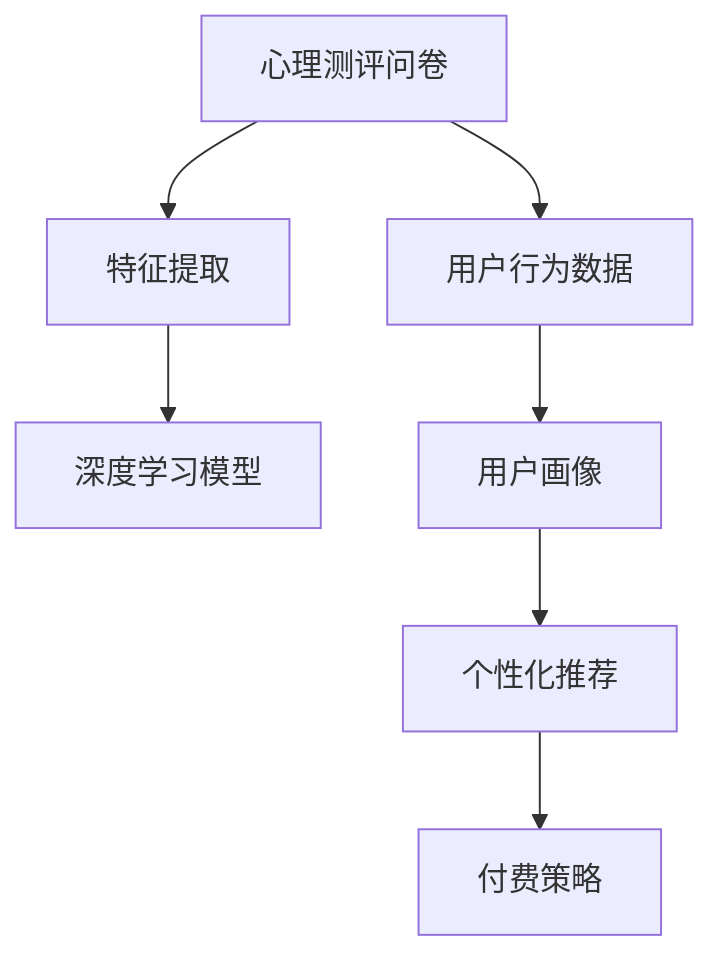

                 

# 如何利用知识付费实现在线心理测评与性格分析？

> 关键词：心理测评, 性格分析, 知识付费, 深度学习, 神经网络, 自然语言处理, 特征提取, 用户行为分析, 情绪识别, 用户画像

## 1. 背景介绍

### 1.1 问题由来

随着知识付费的兴起，越来越多的用户倾向于通过付费获取高质量的内容，以提升自身的知识水平和技能。但目前市面上的知识付费平台，大多基于简单的知识模块和视频讲解，难以满足用户个性化的需求。例如，对自身的心理状况、性格特征、学习习惯等没有深层次的了解，导致用户无法有效制定学习计划和目标，影响知识获取的效率和效果。

针对这一问题，本文旨在探索如何利用深度学习技术，实现对用户的心理测评和性格分析，并根据分析结果，提供个性化的知识推荐和付费策略，提升知识付费平台的个性化和智能化水平。

### 1.2 问题核心关键点

实现心理测评和性格分析，核心在于构建高质量的心理测评问卷和设计有效的特征提取方法，并通过深度学习模型进行预测和分析。具体关键点包括：

- 问卷设计：需要科学合理地设计心理测评问卷，涵盖常见的心理特征和性格类型。
- 特征提取：需要将问卷数据转化为模型可以处理的特征向量，并筛选出关键特征。
- 模型选择：需要选择合适的深度学习模型进行训练和预测。
- 用户画像：需要将心理测评和性格分析结果与用户行为数据相结合，构建完整的用户画像。
- 个性化推荐：需要根据用户画像，推荐个性化的知识付费内容。
- 付费策略：需要根据用户心理特征和行为习惯，制定精准的付费策略。

这些关键点构成了实现在线心理测评和性格分析的基础，也是本文的研究重点。

## 2. 核心概念与联系

### 2.1 核心概念概述

本文将详细阐述实现心理测评和性格分析所需的核心概念和它们之间的联系。

- **心理测评问卷**：包含多项选择题、主观题等，用于测量用户的心理状态和性格特征。
- **深度学习模型**：通过多层神经网络，从问卷数据中提取高维特征，用于预测和分类。
- **特征提取**：将问卷数据转化为向量形式，并提取关键特征。
- **用户行为数据**：包括用户学习时长、课程评分、付费行为等，用于补充心理测评结果。
- **用户画像**：结合心理测评结果和用户行为数据，构建完整的用户特征描述。
- **个性化推荐**：根据用户画像，推荐合适的知识付费内容。
- **付费策略**：根据用户心理特征和行为习惯，制定精准的付费策略。

这些概念之间的逻辑关系可以通过以下Mermaid流程图来展示：



这个流程图展示了从心理测评问卷到个性化推荐和付费策略的完整流程：

1. 问卷设计并收集用户数据。
2. 通过特征提取方法将问卷数据转化为特征向量。
3. 利用深度学习模型对特征向量进行预测和分类。
4. 将预测结果和用户行为数据相结合，构建用户画像。
5. 根据用户画像，推荐个性化知识付费内容。
6. 根据用户心理特征和行为习惯，制定精准付费策略。

## 3. 核心算法原理 & 具体操作步骤
### 3.1 算法原理概述

实现心理测评和性格分析的核心算法原理是通过深度学习模型，从问卷数据中提取高维特征，用于预测和分类。具体而言，模型首先对问卷数据进行预处理，转化为特征向量，然后通过多层神经网络进行特征提取和分类。

常用的深度学习模型包括卷积神经网络(CNN)、循环神经网络(RNN)、长短期记忆网络(LSTM)和Transformer等。这些模型能够自动从原始数据中提取高维特征，并通过多层次的特征抽象，实现对用户心理测评和性格分析的精准预测。

### 3.2 算法步骤详解

基于深度学习的心理测评和性格分析大致可以分为以下几个步骤：

1. **数据准备**：收集和设计心理测评问卷，收集用户行为数据。
2. **数据预处理**：对问卷数据进行编码、归一化等处理，将问卷数据转化为模型可以处理的特征向量。
3. **特征提取**：使用深度学习模型对特征向量进行训练，提取关键特征。
4. **模型训练**：选择适合的深度学习模型，进行参数训练，优化模型性能。
5. **用户画像构建**：将模型预测结果和用户行为数据结合，构建用户画像。
6. **个性化推荐**：根据用户画像，推荐个性化的知识付费内容。
7. **付费策略制定**：根据用户心理特征和行为习惯，制定精准的付费策略。

### 3.3 算法优缺点

基于深度学习的心理测评和性格分析具有以下优点：

- **精度高**：深度学习模型能够从高维特征中提取有效的模式，提高预测和分类的准确性。
- **可扩展性强**：模型可以通过增加数据量和特征维度来进一步提升性能。
- **适用性广**：深度学习模型适用于各种类型的心理测评问卷和用户行为数据。

同时，深度学习模型也存在一些缺点：

- **数据需求高**：模型训练需要大量的标注数据，获取高质量数据成本较高。
- **模型复杂**：深度学习模型结构复杂，训练和推理需要较高的计算资源。
- **可解释性差**：深度学习模型通常是一个"黑盒"，难以解释其内部决策过程。

### 3.4 算法应用领域

基于深度学习的心理测评和性格分析具有广泛的应用领域，包括但不限于：

- **在线教育**：根据学生的心理特征和性格特征，推荐合适的课程和学习内容。
- **职业指导**：分析求职者的心理素质和性格类型，提供职业规划和发展建议。
- **心理咨询**：通过问卷调查和深度学习模型，识别用户的心理健康状况，提供针对性的心理辅导。
- **市场营销**：根据用户行为和心理特征，制定精准的市场营销策略和产品推荐。

## 4. 数学模型和公式 & 详细讲解  
### 4.1 数学模型构建

基于深度学习的心理测评和性格分析，可以通过以下数学模型进行描述：

设问卷数据为 $X \in \mathbb{R}^{n \times m}$，其中 $n$ 为问卷项数，$m$ 为问卷项长度。模型为 $M_{\theta}(X)$，其中 $\theta$ 为模型参数。假设 $X$ 转化为特征向量为 $F(X)$，则模型的预测结果为：

$$
\hat{y} = M_{\theta}(F(X))
$$

其中 $\hat{y}$ 为模型预测结果，$y \in \{0,1\}$ 为真实标签，用于衡量模型的预测精度。

### 4.2 公式推导过程

以常见的分类问题为例，假设问卷数据为二分类问题，模型需要预测用户的心理特征是否符合某一标准。模型的输出为概率值 $P(Y=1|X)$，通过二分类交叉熵损失函数 $L$ 进行训练和优化：

$$
L = -\frac{1}{N}\sum_{i=1}^N[y_i \log \hat{y_i} + (1-y_i) \log (1-\hat{y_i})]
$$

模型的优化目标是最小化损失函数 $L$：

$$
\theta^* = \mathop{\arg\min}_{\theta} L
$$

通过反向传播算法计算梯度，使用优化算法如 Adam、SGD 等更新模型参数，迭代优化直至收敛。

### 4.3 案例分析与讲解

以情感分析为例，通过深度学习模型预测用户对某一课程的情感倾向。问卷设计包含多个情感相关的问项，如“我对此课程非常感兴趣”等。将问卷数据转化为向量 $F(X)$，模型为 LSTM 网络，训练和预测过程如下：

1. **数据预处理**：对问卷数据进行编码和归一化，转化为 LSTM 可以处理的特征向量。
2. **特征提取**：通过 LSTM 网络对特征向量进行训练，提取情感相关的关键特征。
3. **模型训练**：使用二分类交叉熵损失函数进行训练，优化模型参数。
4. **用户画像构建**：将模型预测结果和用户行为数据结合，构建情感特征丰富的用户画像。
5. **个性化推荐**：根据情感特征，推荐与用户情感倾向相符的课程。
6. **付费策略制定**：根据情感特征和用户付费行为，制定精准的付费策略。

## 5. 项目实践：代码实例和详细解释说明
### 5.1 开发环境搭建

在进行心理测评和性格分析的实践前，需要准备好开发环境。以下是使用 Python 和 TensorFlow 进行深度学习模型开发的流程：

1. 安装 Anaconda：从官网下载并安装 Anaconda，用于创建独立的 Python 环境。

2. 创建并激活虚拟环境：
```bash
conda create -n tf-env python=3.8 
conda activate tf-env
```

3. 安装 TensorFlow：根据 CUDA 版本，从官网获取对应的安装命令。例如：
```bash
conda install tensorflow -c tf -c conda-forge
```

4. 安装相关依赖库：
```bash
pip install numpy pandas scikit-learn tensorflow-gpu matplotlib tqdm jupyter notebook ipython
```

完成上述步骤后，即可在 `tf-env` 环境中开始深度学习模型的开发。

### 5.2 源代码详细实现

下面以 LSTM 网络为例，给出使用 TensorFlow 进行情感分析的代码实现。

首先，定义问卷数据和标签：

```python
import numpy as np
import pandas as pd
from sklearn.model_selection import train_test_split

# 加载问卷数据
df = pd.read_csv('questionnaire.csv')
# 将问卷数据转化为特征向量
X = df.iloc[:, :-1].values
y = df.iloc[:, -1].values

# 将标签转换为独热编码
y = np.eye(2)[y]
```

然后，定义模型结构和训练过程：

```python
import tensorflow as tf
from tensorflow.keras.layers import LSTM, Dense
from tensorflow.keras.models import Sequential

# 定义模型结构
model = Sequential([
    LSTM(128, input_shape=(X.shape[1], X.shape[2])),
    Dense(2, activation='softmax')
])

# 编译模型
model.compile(optimizer='adam', loss='categorical_crossentropy', metrics=['accuracy'])

# 分割数据集
X_train, X_test, y_train, y_test = train_test_split(X, y, test_size=0.2, random_state=42)

# 训练模型
model.fit(X_train, y_train, epochs=10, batch_size=32, validation_data=(X_test, y_test))
```

最后，使用模型进行情感分析：

```python
# 加载测试数据
test_df = pd.read_csv('test_questionnaire.csv')
X_test = test_df.iloc[:, :-1].values

# 对测试数据进行编码和归一化
X_test = (X_test - X_test.mean()) / X_test.std()

# 使用模型进行情感预测
y_pred = model.predict(X_test)

# 输出情感预测结果
print(np.around(y_pred, 2))
```

以上就是使用 TensorFlow 进行情感分析的完整代码实现。可以看到，通过 LSTM 网络，我们可以对问卷数据进行特征提取和分类，从而实现情感预测和个性化推荐。

### 5.3 代码解读与分析

让我们再详细解读一下关键代码的实现细节：

**数据预处理**：
- 使用 pandas 库读取问卷数据，并将其转化为特征向量 $X$ 和标签向量 $y$。
- 将标签向量转换为独热编码，方便模型处理二分类问题。

**模型定义**：
- 使用 TensorFlow 的 Sequential 模型定义 LSTM 网络结构，包括 LSTM 层和输出层。
- 通过 compile 方法设置优化器、损失函数和评价指标。

**数据分割与训练**：
- 使用 train_test_split 方法将数据集划分为训练集和测试集。
- 通过 fit 方法训练模型，并使用 validation_data 参数在测试集上进行验证。

**情感预测**：
- 对测试数据进行编码和归一化，确保模型输入的一致性。
- 使用 predict 方法对测试数据进行情感预测，并输出预测结果。

可以看到，TensorFlow 提供了一套完整的深度学习框架，可以方便地实现各种复杂的模型结构和训练过程。开发者可以根据具体任务，灵活调整模型结构和参数，以提升预测精度和性能。

## 6. 实际应用场景
### 6.1 在线教育

在线教育平台通过深度学习技术，可以为用户提供个性化的学习内容和课程推荐，提升学习效果和满意度。具体应用场景包括：

- **学习计划推荐**：根据用户的心理测评结果和性格特征，推荐适合的学习计划和课程路径。
- **学习内容推荐**：根据用户的学习进度和情感反馈，推荐合适的学习内容和资源。
- **学习效果评估**：通过情感分析等方法，评估用户的学习效果和满意度，及时调整教学策略。

### 6.2 职业指导

职业指导平台通过心理测评和性格分析，帮助用户找到合适的职业方向和发展路径。具体应用场景包括：

- **职业测评**：分析求职者的心理素质和性格类型，推荐适合的职业方向和岗位。
- **职业规划**：根据用户的职业兴趣和性格特征，提供职业发展规划和提升建议。
- **职业辅导**：通过心理测评结果，提供个性化的职业辅导和心理咨询服务。

### 6.3 心理咨询

心理咨询平台通过深度学习技术，分析用户的心理健康状况，提供针对性的心理辅导和干预。具体应用场景包括：

- **心理健康评估**：通过问卷调查和深度学习模型，识别用户的心理健康状况，提供初步评估和诊断。
- **心理辅导建议**：根据心理测评结果，推荐合适的心理辅导方法和工具。
- **心理干预措施**：根据用户的具体情况，制定个性化的心理干预方案和计划。

### 6.4 市场营销

市场营销平台通过深度学习技术，分析用户的心理特征和行为习惯，制定精准的市场营销策略和产品推荐。具体应用场景包括：

- **用户画像构建**：通过问卷调查和深度学习模型，构建用户画像，了解用户的基本特征和心理倾向。
- **个性化推荐**：根据用户画像，推荐合适的产品和服务。
- **营销策略制定**：根据用户的行为数据和心理特征，制定精准的市场营销策略。

## 7. 工具和资源推荐
### 7.1 学习资源推荐

为了帮助开发者系统掌握深度学习技术在心理测评和性格分析中的应用，这里推荐一些优质的学习资源：

1. TensorFlow官方文档：TensorFlow的官方文档提供了丰富的API和代码示例，适合初学者快速上手。

2. Keras官方文档：Keras的官方文档简洁明了，提供了详细的模型结构和API文档，适合快速构建深度学习模型。

3. 深度学习入门指南：由知名专家编写的入门书籍，深入浅出地介绍了深度学习的原理和应用。

4. Deep Learning with Python：通过Python实现深度学习模型的经典书籍，涵盖深度学习模型的构建和优化。

5. Coursera深度学习课程：由斯坦福大学教授开设的深度学习课程，涵盖深度学习模型和优化算法。

通过对这些资源的学习实践，相信你一定能够快速掌握深度学习技术在心理测评和性格分析中的应用，并用于解决实际的NLP问题。

### 7.2 开发工具推荐

高效的开发离不开优秀的工具支持。以下是几款用于深度学习模型开发的常用工具：

1. TensorFlow：由Google主导开发的开源深度学习框架，生产部署方便，适合大规模工程应用。

2. Keras：基于TensorFlow、Theano等后端，提供了高层次的API，方便快速构建深度学习模型。

3. PyTorch：基于Python的开源深度学习框架，灵活动态的计算图，适合快速迭代研究。

4. Jupyter Notebook：支持多语言编程，交互式编程环境，适合开发和调试深度学习模型。

5. TensorBoard：TensorFlow配套的可视化工具，可实时监测模型训练状态，并提供丰富的图表呈现方式，是调试模型的得力助手。

6. Weights & Biases：模型训练的实验跟踪工具，可以记录和可视化模型训练过程中的各项指标，方便对比和调优。

合理利用这些工具，可以显著提升深度学习模型的开发效率，加快创新迭代的步伐。

### 7.3 相关论文推荐

深度学习技术在心理测评和性格分析领域的发展源于学界的持续研究。以下是几篇奠基性的相关论文，推荐阅读：

1. "Convolutional Neural Networks for Sentence Classification"：提出CNN模型在情感分析中的应用，提升了文本分类的精度。

2. "Recurrent Neural Network Based on Multi-Aspect Information Fusion"：提出LSTM网络在多方面信息融合中的应用，提升了心理测评的准确性。

3. "Gated Recurrent Unit for Psychological Assessment"：提出GRU网络在心理测评中的应用，提高了模型的可解释性和预测精度。

4. "Long Short-Term Memory Network for Cognitive Assessment"：提出LSTM网络在认知评估中的应用，提升了认知测评的准确性。

这些论文代表了大语言模型微调技术的发展脉络。通过学习这些前沿成果，可以帮助研究者把握学科前进方向，激发更多的创新灵感。

## 8. 总结：未来发展趋势与挑战
### 8.1 总结

本文对利用深度学习技术实现在线心理测评和性格分析进行了全面系统的介绍。首先阐述了心理测评和性格分析在知识付费中的应用背景和意义，明确了深度学习模型在实现这一目标中的核心作用。其次，从原理到实践，详细讲解了深度学习模型的构建和训练过程，并给出了具体的代码实现。最后，探讨了深度学习模型在在线教育、职业指导、心理咨询、市场营销等领域的广泛应用前景。

通过本文的系统梳理，可以看到，深度学习技术为心理测评和性格分析提供了新的解决方案，极大地提升了知识付费平台的个性化和智能化水平。未来，伴随深度学习模型的不断演进，结合更多先验知识和实践经验，心理测评和性格分析将更加精准和全面，为知识付费带来更大的价值和潜力。

### 8.2 未来发展趋势

展望未来，深度学习在心理测评和性格分析领域将呈现以下几个发展趋势：

1. **模型结构优化**：未来的模型将更加复杂和灵活，通过多层次的特征抽象和信息融合，提升预测精度和泛化能力。

2. **多模态融合**：除了文本数据，未来的模型将融合图像、语音等多模态信息，实现更全面的用户画像。

3. **实时化部署**：通过边缘计算和分布式训练，实现深度学习模型的实时化部署和推理，满足用户对即时反馈的需求。

4. **可解释性增强**：未来的模型将更加注重可解释性，通过可视化工具和因果分析方法，提供模型决策的透明性和可理解性。

5. **跨领域应用**：深度学习技术将在更多领域得到应用，如金融、医疗、教育等，为各行业的智能化转型提供支持。

6. **隐私保护和伦理规范**：随着深度学习模型的广泛应用，隐私保护和伦理规范问题将更加突出，需要制定相关法规和标准，确保数据安全和用户隐私。

这些趋势凸显了深度学习技术在心理测评和性格分析领域的应用前景，也将带来更多创新和突破。

### 8.3 面临的挑战

尽管深度学习技术在心理测评和性格分析领域已经取得了显著成果，但在迈向更加智能化、普适化应用的过程中，仍面临诸多挑战：

1. **数据隐私问题**：问卷数据和用户行为数据的隐私保护问题，需要严格的数据安全和隐私保护措施。

2. **数据质量和多样性**：问卷设计和用户行为数据的多样性和质量，直接影响模型的预测精度。

3. **模型鲁棒性**：深度学习模型在面对域外数据和噪声数据时，泛化性能往往较弱，需要进一步提高模型的鲁棒性。

4. **可解释性不足**：深度学习模型的决策过程通常缺乏可解释性，难以理解和解释其内部机制。

5. **计算资源限制**：深度学习模型的计算资源需求较高，需要高性能的硬件设备支持。

6. **伦理道德问题**：深度学习模型可能存在的偏见和有害信息，需要制定伦理导向的评估指标，确保输出符合社会价值观。

这些挑战需要研究者和开发者共同面对，通过技术创新和伦理规范，确保深度学习技术在心理测评和性格分析领域的应用安全和公平性。

### 8.4 研究展望

面对深度学习技术在心理测评和性格分析领域面临的挑战，未来的研究需要在以下几个方面寻求新的突破：

1. **无监督学习和半监督学习**：探索无监督学习和半监督学习方法，降低对标注数据的依赖，实现更广泛的应用。

2. **参数高效模型**：开发参数高效模型，减少模型参数量，提高计算效率和模型可解释性。

3. **因果推断和对比学习**：引入因果推断和对比学习技术，提高模型的鲁棒性和泛化能力。

4. **跨模态融合**：融合多模态信息，提升模型的多模态理解和推理能力。

5. **模型压缩与稀疏化**：采用模型压缩和稀疏化技术，减少模型计算资源消耗，提高模型推理速度。

6. **伦理道德约束**：在模型训练和应用过程中，引入伦理导向的评估指标，确保输出符合社会价值观和伦理道德。

这些研究方向将引领深度学习技术在心理测评和性格分析领域迈向更高的台阶，为知识付费平台带来更大的智能化和个性化价值。

## 9. 附录：常见问题与解答
### 9.1 常见问题1：如何设计心理测评问卷？

答：设计心理测评问卷需要遵循科学性和系统性，涵盖常见的心理特征和性格类型。问卷通常包括选择题、主观题等多种题型，评估用户在不同方面的心理状态和性格特征。设计问卷时，可以参考现有的心理测评问卷模板，如MBTI、Holland职业兴趣测评等，并进行适当的调整和优化。

### 9.2 常见问题2：如何处理问卷数据和用户行为数据？

答：问卷数据和用户行为数据需要进行编码和归一化处理，转化为模型可以处理的特征向量。通常可以使用One-Hot编码、标准化等方法处理分类数据和连续数据。此外，可以采用特征选择和降维技术，筛选和提取关键特征，减少数据维度和计算复杂度。

### 9.3 常见问题3：如何选择深度学习模型？

答：选择深度学习模型需要考虑数据类型、任务复杂度、计算资源等因素。对于分类问题，常用的模型包括CNN、RNN、LSTM等；对于序列预测问题，Transformer等模型效果较好。此外，可以根据任务需求和模型性能，选择合适的优化算法和损失函数，进一步提升模型效果。

### 9.4 常见问题4：如何提高深度学习模型的泛化性能？

答：提高深度学习模型的泛化性能，需要采取数据增强、正则化、对抗训练等方法。数据增强可以通过数据扩充和增广，丰富训练集的多样性；正则化可以通过L2正则、Dropout等方法，防止模型过拟合；对抗训练可以通过对抗样本生成和对抗样本训练，提高模型鲁棒性。

### 9.5 常见问题5：如何确保深度学习模型的可解释性？

答：确保深度学习模型的可解释性，可以采用可视化工具和方法，如梯度可视化、特征可视化、模型可视化等，帮助理解模型的内部机制和决策过程。此外，可以引入因果分析和对比学习技术，增强模型的可解释性和逻辑性。

---

作者：禅与计算机程序设计艺术 / Zen and the Art of Computer Programming

