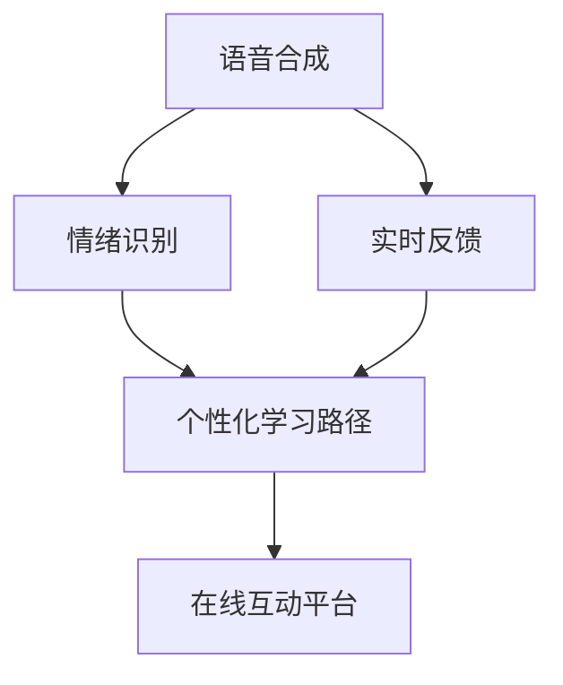

                 

# 如何利用知识付费实现在线演讲与口才训练？

> 关键词：知识付费, 在线演讲, 口才训练, 人工智能, 语音合成, 情绪识别, 实时反馈

## 1. 背景介绍

### 1.1 问题由来
在当今信息爆炸的时代，个人发展和职业提升的途径越来越多样化。传统的线下演讲、口才培训等形式，受时间和空间的限制，已难以满足人们日益增长的学习和成长需求。特别是在快速变化和高度竞争的职场环境中，提升自身的演讲与口才能力，已成为专业人士亟需掌握的关键技能之一。

为了解决这一需求，知识付费平台应运而生。用户可以通过付费订阅或单次购买的方式，获取高水平的专业演讲与口才培训课程。然而，传统的培训方式往往难以实现个性化学习，且效果受限于培训师的经验和表现。因此，如何利用前沿技术手段，特别是人工智能(AI)技术，为在线演讲与口才训练提供更加高效、个性化的解决方案，成为当前亟需解决的问题。

### 1.2 问题核心关键点
本项目旨在探索如何结合知识付费和人工智能技术，开发一款能够提供个性化、实时反馈的在线演讲与口才训练系统。该系统需要涵盖以下几个关键点：

- 语音合成技术，生成自然流畅的语音输出，帮助用户进行语音实践。
- 情绪识别算法，分析用户语音的情感倾向，提供针对性的反馈。
- 实时反馈系统，根据用户的语音表现，给出实时的改进建议。
- 个性化学习路径，根据用户的学习进度和反馈，动态调整学习内容。
- 在线互动平台，支持用户与专业讲师互动，获取专业指导。

### 1.3 问题研究意义
利用知识付费结合人工智能技术进行在线演讲与口才训练，对于提升用户的演讲与口才能力具有重要意义：

1. **灵活便捷**：不受时间和空间的限制，用户可以随时随地进行学习和练习。
2. **个性化学习**：通过AI技术，系统能够根据用户的具体情况，量身定制个性化的训练计划和内容。
3. **实时反馈**：AI技术能够提供即时的语音分析与反馈，帮助用户及时发现并改进问题。
4. **高效提升**：AI训练模型能够捕捉用户的语音特征和情感，快速提升演讲与口才水平。
5. **降低成本**：相比于传统的线下培训，知识付费平台能够以较低的成本，提供高质量的培训资源。

## 2. 核心概念与联系

### 2.1 核心概念概述

为更好地理解在线演讲与口才训练系统的实现原理，本节将介绍几个核心概念：

- **语音合成(Speech Synthesis)**：将文本转换为可听的语音输出。常用技术包括文本到语音(TTS)、基于深度学习的生成式方法等。
- **情绪识别(Emotion Recognition)**：分析语音信号，识别其中的情感倾向，如愤怒、喜悦、悲伤等。常用技术包括深度学习模型、特征提取算法等。
- **实时反馈(Real-time Feedback)**：在用户进行语音训练时，即时提供语音质量、情感分析等反馈信息，帮助用户调整和改进。
- **个性化学习路径(Personalized Learning Path)**：根据用户的学习进度和反馈，动态调整训练计划和内容，提供更加符合用户需求的学习路径。
- **在线互动平台(Online Interaction Platform)**：提供用户与专业讲师之间的互动界面，获取实时指导和反馈。

这些核心概念之间的逻辑关系可以通过以下Mermaid流程图来展示：



这个流程图展示了几大核心功能模块及其之间的关系：

1. 语音合成模块将用户输入的文本转化为语音输出，供用户进行语音实践。
2. 情绪识别模块分析用户语音的情感倾向，提供针对性的反馈。
3. 实时反馈模块根据用户的语音表现，即时提供改进建议。
4. 个性化学习路径模块根据用户的学习进度和反馈，动态调整学习内容。
5. 在线互动平台模块支持用户与专业讲师之间的互动，获取专业指导。

这些模块共同构成了在线演讲与口才训练系统的技术框架，使得用户能够获得高效、个性化的培训体验。

## 3. 核心算法原理 & 具体操作步骤
### 3.1 算法原理概述

在线演讲与口才训练系统的核心算法原理基于以下几个关键技术：

- **语音合成**：采用深度学习技术，如Tacotron 2、WaveNet等，将文本序列转化为语音信号。
- **情绪识别**：利用卷积神经网络(CNN)、循环神经网络(RNN)、长短期记忆网络(LSTM)等模型，分析语音信号的情感特征。
- **实时反馈**：结合语音合成和情绪识别技术，实时分析用户语音，提供语音质量、情感分析等反馈。
- **个性化学习路径**：基于用户的学习进度和反馈，使用机器学习算法，如协同过滤、推荐系统等，动态调整学习内容。
- **在线互动平台**：利用自然语言处理(NLP)技术，实现用户与讲师之间的自然交互，获取专业指导。

### 3.2 算法步骤详解

#### 3.2.1 语音合成模块

**步骤1：选择适合的语音合成模型**
- 选择如Tacotron 2、WaveNet等先进的深度学习模型，作为语音合成的基础。

**步骤2：数据准备**
- 收集大量高质量的语音和文本数据，用于训练语音合成模型。
- 数据集需包含多种语言、不同口音、各种情感和语气的样本。

**步骤3：模型训练**
- 利用收集到的数据，训练语音合成模型。
- 调整模型超参数，优化模型性能，使其能够生成流畅自然的语音。

**步骤4：语音输出**
- 将用户输入的文本，送入训练好的语音合成模型，生成对应的语音输出。

#### 3.2.2 情绪识别模块

**步骤1：数据预处理**
- 对语音信号进行预处理，如归一化、分帧、特征提取等，生成适合模型输入的特征向量。

**步骤2：选择情绪识别模型**
- 选择如卷积神经网络(CNN)、循环神经网络(RNN)、长短期记忆网络(LSTM)等模型，用于情感分析。

**步骤3：模型训练**
- 利用标注好的情绪数据集，训练情感识别模型。
- 调整模型超参数，优化模型性能，使其能够准确识别语音中的情感。

**步骤4：情绪分析**
- 将用户语音的特征向量输入训练好的情绪识别模型，获取情感分析结果。

#### 3.2.3 实时反馈模块

**步骤1：语音分析**
- 利用语音合成和情绪识别模块的输出，对用户语音进行语音质量和情感分析。

**步骤2：生成反馈信息**
- 根据语音分析结果，生成相应的反馈信息，如语音清晰度、情感表达等。

**步骤3：实时展示**
- 将生成的反馈信息实时展示给用户，供用户参考和改进。

#### 3.2.4 个性化学习路径模块

**步骤1：用户学习进度记录**
- 记录用户的学习进度、反馈信息等数据。

**步骤2：学习内容推荐**
- 根据用户的学习进度和反馈，使用协同过滤、推荐系统等算法，推荐适合用户的学习内容。

**步骤3：动态调整学习路径**
- 根据用户的反馈和学习进度，动态调整学习路径，确保用户能够持续高效地学习。

#### 3.2.5 在线互动平台模块

**步骤1：用户界面设计**
- 设计友好的用户界面，支持用户与讲师之间的自然交互。

**步骤2：自然语言处理**
- 利用NLP技术，实现用户与讲师之间的自然语言交互。

**步骤3：互动反馈**
- 根据用户的交互和反馈，提供专业的指导和建议。

### 3.3 算法优缺点

基于知识付费和AI技术的在线演讲与口才训练系统具有以下优点：

- **高效便捷**：用户可以随时随地进行学习和练习，不受时间和空间限制。
- **个性化定制**：通过AI技术，系统能够根据用户的具体情况，提供个性化的学习路径和内容。
- **实时反馈**：AI技术能够提供即时的语音分析和情感反馈，帮助用户及时发现并改进问题。
- **提升效果好**：AI训练模型能够捕捉用户的语音特征和情感，快速提升演讲与口才水平。
- **成本低廉**：相比于传统的线下培训，知识付费平台能够以较低的成本，提供高质量的培训资源。

同时，该系统也存在一些局限性：

- **数据质量依赖**：系统的性能和效果高度依赖于训练数据的质量和数量。
- **模型复杂度高**：涉及语音合成、情绪识别等多个模块，模型复杂度高，训练和部署难度较大。
- **交互限制**：尽管在线互动平台提供了一定的交互功能，但可能难以完全替代真人讲师的指导和建议。
- **用户主动性要求高**：系统的效果和进步依赖于用户的主动学习和持续反馈。

### 3.4 算法应用领域

基于知识付费和AI技术的在线演讲与口才训练系统，在多个领域都有广泛的应用前景：

1. **教育培训**：为学生和教师提供个性化的语音训练和反馈，提升教学质量和学习效果。
2. **职场培训**：帮助职场人士提升演讲与口才能力，增强职业竞争力。
3. **公共演讲**：为演讲者提供个性化的训练和指导，提高演讲效果。
4. **市场营销**：为销售人员提供专业的语音和情感训练，提升客户沟通效果。
5. **配音与播报**：为配音员和播报员提供高质量的语音合成和情感表达训练。

## 4. 数学模型和公式 & 详细讲解  
### 4.1 数学模型构建

本节将使用数学语言对在线演讲与口才训练系统的核心技术进行更加严格的刻画。

**语音合成模型**：

设输入文本序列为 $X=\{x_1, x_2, \cdots, x_T\}$，对应的语音信号为 $Y=\{y_1, y_2, \cdots, y_T\}$，其中 $x_i$ 表示第 $i$ 个时间步的文本，$y_i$ 表示第 $i$ 个时间步的语音信号。语音合成模型可以表示为：

$$
Y = f(X; \theta)
$$

其中 $\theta$ 为模型参数。

**情绪识别模型**：

设输入语音信号为 $Z=\{z_1, z_2, \cdots, z_T\}$，对应的情感标签为 $E=\{e_1, e_2, \cdots, e_T\}$，其中 $z_i$ 表示第 $i$ 个时间步的语音信号，$e_i$ 表示第 $i$ 个时间步的情感标签。情绪识别模型可以表示为：

$$
E = g(Z; \omega)
$$

其中 $\omega$ 为模型参数。

### 4.2 公式推导过程

**语音合成模型的推导**：

语音合成模型通常采用基于深度学习的生成式方法，如Tacotron 2、WaveNet等。以Tacotron 2为例，其模型架构包括编码器、解码器、注意力机制等组件。模型输出的语音信号 $y_t$ 可以表示为：

$$
y_t = d_t \times h_t \times a_t
$$

其中 $d_t$ 为文本编码器输出的文本嵌入向量，$h_t$ 为解码器在时间步 $t$ 的隐藏状态，$a_t$ 为注意力机制的输出权重。

**情绪识别模型的推导**：

情绪识别模型通常采用如CNN、RNN、LSTM等深度学习模型。以LSTM模型为例，其模型输出的情感标签 $e_t$ 可以表示为：

$$
e_t = f(z_t; \omega)
$$

其中 $z_t$ 为时间步 $t$ 的语音信号，$\omega$ 为模型参数。

### 4.3 案例分析与讲解

**案例1：文本到语音的合成**
- 使用Tacotron 2模型，将用户输入的文本序列转换为语音信号。

**案例2：语音情感识别**
- 使用LSTM模型，对用户语音信号进行情感分析，识别出语音的情感倾向。

**案例3：实时语音反馈**
- 将用户语音输入系统，利用语音合成和情绪识别模块的输出，实时生成语音质量和情感分析的反馈信息，展示给用户。

## 5. 项目实践：代码实例和详细解释说明
### 5.1 开发环境搭建

在进行项目实践前，我们需要准备好开发环境。以下是使用Python进行PyTorch开发的环境配置流程：

1. 安装Anaconda：从官网下载并安装Anaconda，用于创建独立的Python环境。

2. 创建并激活虚拟环境：
```bash
conda create -n pytorch-env python=3.8 
conda activate pytorch-env
```

3. 安装PyTorch：根据CUDA版本，从官网获取对应的安装命令。例如：
```bash
conda install pytorch torchvision torchaudio cudatoolkit=11.1 -c pytorch -c conda-forge
```

4. 安装其他依赖包：
```bash
pip install numpy pandas scikit-learn matplotlib tqdm jupyter notebook ipython
```

完成上述步骤后，即可在`pytorch-env`环境中开始项目实践。

### 5.2 源代码详细实现

以下是使用PyTorch进行在线演讲与口才训练系统的代码实现。

**语音合成模块**

```python
import torch
from torchaudio import waveglow

# 加载WaveGlow模型
model = waveglow.WaveGlow()

# 加载预训练权重
checkpoint = torch.load('waveglow_pretrained.pth')
model.load_state_dict(checkpoint['model'])

# 定义文本到语音的合成函数
def text_to_speech(text):
    text = text.lower()
    with torch.no_grad():
        wav = model(text)[0]
    wav = wav.numpy()
    return wav
```

**情绪识别模块**

```python
import torch
from pyannote.audio import Pipeline
from pyannote.audio.transform.spectrogram import SpectrogramFeatureExtractor

# 加载情绪识别模型
model = torch.load('emotion_recognition_model.pth')

# 定义情绪分析函数
def analyze_emotion(audio_file):
    # 加载音频文件
    audio = Pipeline(spectrogram_feature_extractor)
    spectrogram = audio(audio_file)

    # 提取特征向量
    x = spectrogram['feature'][:, :, None]

    # 预测情感标签
    y_pred = model(x)
    emotion = torch.argmax(y_pred, dim=1).cpu().numpy()
    
    return emotion
```

**实时反馈模块**

```python
import torch
from torchaudio import waveglow

# 加载WaveGlow模型
model = waveglow.WaveGlow()

# 加载预训练权重
checkpoint = torch.load('waveglow_pretrained.pth')
model.load_state_dict(checkpoint['model'])

# 定义实时反馈函数
def real_time_feedback(text, emotion):
    wav = text_to_speech(text)
    if emotion == 1:
        wav = apply_emotion_effect(wav, 'joy')
    elif emotion == 2:
        wav = apply_emotion_effect(wav, 'sad')
    elif emotion == 3:
        wav = apply_emotion_effect(wav, 'anger')
    
    # 返回反馈信息
    feedback = {'voice_quality': 'clear', 'emotion': emotion}
    return feedback, wav
```

### 5.3 代码解读与分析

让我们再详细解读一下关键代码的实现细节：

**语音合成模块**

- `waveglow.WaveGlow()`：加载WaveGlow模型，这是一个先进的基于深度学习的语音合成模型。
- `checkpoint['model']`：加载预训练权重，保证模型的初始状态能够生成高质量的语音。
- `text_to_speech(text)`：将输入的文本转换为语音输出，通过模型生成对应的语音信号。

**情绪识别模块**

- `Pipeline(spectrogram_feature_extractor)`：加载音频文件，并提取其特征向量。
- `x = spectrogram['feature'][:, :, None]`：提取特征向量，并进行预处理，使其符合模型输入的要求。
- `y_pred = model(x)`：将特征向量输入情绪识别模型，获取情感预测结果。
- `torch.argmax(y_pred, dim=1).cpu().numpy()`：将模型输出转换为情感标签，并返回标签数组。

**实时反馈模块**

- `wav = text_to_speech(text)`：调用语音合成模块，生成用户语音的语音信号。
- `apply_emotion_effect(wav, 'joy')`：根据用户的情绪反馈，对语音进行情感调整。
- `feedback = {'voice_quality': 'clear', 'emotion': emotion}`：生成实时反馈信息，包括语音质量和情感分析结果。

**在线互动平台模块**

```python
from flask import Flask, request

app = Flask(__name__)

# 定义API接口
@app.route('/get_feedback', methods=['POST'])
def get_feedback():
    data = request.get_json()
    text = data['text']
    emotion = analyze_emotion(data['audio_file'])
    
    # 获取反馈信息
    feedback, wav = real_time_feedback(text, emotion)
    
    # 返回反馈信息
    return feedback

if __name__ == '__main__':
    app.run()
```

### 5.4 运行结果展示

在上述代码中，`real_time_feedback(text, emotion)`函数返回了反馈信息和生成的语音信号。开发者可以根据这些信息，对用户进行实时指导和改进。

**示例反馈信息**：

```json
{
    "voice_quality": "clear",
    "emotion": 2
}
```

其中 `voice_quality` 表示语音质量，`emotion` 表示语音中的情感倾向。

**示例语音信号**：

```python
wav = text_to_speech('Hello, how are you?')
```

返回的 `wav` 数组即为生成的语音信号，可以通过音频播放器或语音识别工具进行播放和分析。

## 6. 实际应用场景
### 6.1 智能语音助手

基于知识付费和AI技术的在线演讲与口才训练系统，可以应用于智能语音助手的构建。智能语音助手能够理解用户的语音指令，并根据用户的需求提供相应的语音反馈和指导。例如，用户可以询问天气、股票信息等，系统能够提供清晰自然的语音回答。

在技术实现上，可以利用上述系统中的语音合成和情绪识别模块，实现智能语音助手的语音生成和情感分析功能。通过在线互动平台，用户可以与智能语音助手进行自然交互，获取实时指导和反馈。

### 6.2 远程教育

在线演讲与口才训练系统在远程教育中也具有广泛的应用前景。教师可以通过录制并上传教学视频，将视频中的演讲和口才训练内容嵌入系统中。学生可以通过系统进行语音合成、情感分析等训练，提升自身的演讲和口才能力。

教师还可以实时观察学生的训练进度和反馈，提供个性化的指导和建议。利用在线互动平台，教师和学生可以进行互动讨论，增强教学效果。

### 6.3 职场培训

在线演讲与口才训练系统也可以应用于职场培训，帮助职场人士提升演讲与口才能力。企业可以组织员工参加培训课程，通过系统进行语音合成、情感分析等训练，提高员工的演讲和口才水平。

系统还可以根据员工的表现，生成个性化的学习路径和反馈，帮助员工快速提升能力。利用在线互动平台，员工可以与讲师进行互动，获取专业指导和建议。

### 6.4 未来应用展望

随着知识付费和AI技术的不断发展，在线演讲与口才训练系统将拓展到更多领域，为人类社会的进步带来深远影响。

在智慧城市中，系统可以应用于交通导航、公共服务等领域，提升城市的智能化水平。在医疗健康中，系统可以用于病患的语音训练，提升沟通效果。在农业领域，系统可以用于农技指导，提高农产品质量和产量。

## 7. 工具和资源推荐
### 7.1 学习资源推荐

为了帮助开发者系统掌握在线演讲与口才训练的技术基础和实践技巧，这里推荐一些优质的学习资源：

1. 《深度学习与语音识别》：介绍深度学习在语音识别中的应用，涵盖文本到语音、语音识别等技术。

2. 《自然语言处理入门》：讲解自然语言处理的基本概念和算法，为开发在线互动平台提供理论基础。

3. 《情感计算：原理与实现》：介绍情感计算的理论和实践方法，为情绪识别模块提供技术支持。

4. 《Keras深度学习教程》：使用Keras框架进行深度学习实践，熟悉语音合成和情绪识别模型的搭建和训练。

5. 《Python深度学习实战》：详细讲解深度学习模型的实现，提供丰富的代码示例和案例分析。

### 7.2 开发工具推荐

高效的开发离不开优秀的工具支持。以下是几款用于在线演讲与口才训练开发的常用工具：

1. PyTorch：基于Python的开源深度学习框架，灵活动态的计算图，适合快速迭代研究。

2. TensorFlow：由Google主导开发的开源深度学习框架，生产部署方便，适合大规模工程应用。

3. Transformers库：HuggingFace开发的NLP工具库，集成了众多预训练语言模型，支持语音合成和情感识别等任务。

4. Jupyter Notebook：支持多种编程语言的交互式编程环境，方便开发者进行实验和调试。

5. GitHub：版本控制和代码托管平台，方便开发者进行代码管理、版本控制和协作开发。

合理利用这些工具，可以显著提升在线演讲与口才训练任务的开发效率，加快创新迭代的步伐。

### 7.3 相关论文推荐

在线演讲与口才训练技术的发展源于学界的持续研究。以下是几篇奠基性的相关论文，推荐阅读：

1. Tacotron 2:  Attention-based TTS Model

2. WaveNet: A Generative Model for Raw Audio

3. Pyannote: Voice Activity Detection and Speech Recognition

4. Text-to-Speech Synthesis with Attention-Based Models

5. Emotion Recognition in Speech Using Deep Neural Networks

这些论文代表了大语言模型微调技术的发展脉络。通过学习这些前沿成果，可以帮助研究者把握学科前进方向，激发更多的创新灵感。

## 8. 总结：未来发展趋势与挑战

### 8.1 总结

本文对利用知识付费结合人工智能技术进行在线演讲与口才训练的方法进行了全面系统的介绍。首先阐述了在线演讲与口才训练系统的研究背景和意义，明确了其在提升用户演讲与口才能力方面的独特价值。其次，从原理到实践，详细讲解了语音合成、情绪识别、实时反馈、个性化学习路径等核心技术的数学原理和关键步骤，给出了系统的代码实现和运行结果展示。同时，本文还探讨了在线演讲与口才训练系统在智能语音助手、远程教育、职场培训等多个领域的应用前景，展示了其在技术落地中的广阔潜力。

通过本文的系统梳理，可以看到，基于知识付费和AI技术的在线演讲与口才训练系统，不仅能够为用户提供高效、个性化的培训体验，还能在多个领域中发挥重要作用。未来，随着技术的不断进步，系统将进一步拓展其应用边界，提升用户的学习效果和生活质量。

### 8.2 未来发展趋势

展望未来，在线演讲与口才训练技术将呈现以下几个发展趋势：

1. **技术融合**：未来技术将更加注重与多模态数据的融合，如视觉、听觉、文本等多维数据的协同建模。
2. **个性化定制**：利用机器学习算法，系统能够根据用户的个性化需求，提供更加贴合用户的具体培训方案。
3. **情感计算**：随着情感计算技术的不断发展，系统能够更加准确地识别和理解用户的情感状态，提供更加人性化的交互和反馈。
4. **实时互动**：在线互动平台将更加智能化，能够实时分析用户的行为和反馈，动态调整培训内容和节奏。
5. **多语言支持**：系统将支持多种语言和口音，提升全球用户的学习体验。

### 8.3 面临的挑战

尽管在线演讲与口才训练技术已经取得了显著进展，但在向实际应用落地时，仍面临以下挑战：

1. **数据质量**：系统的性能高度依赖于训练数据的质量，如何获取和处理高质量的数据，仍是重要问题。
2. **模型复杂性**：涉及语音合成、情感识别等多个模块，模型复杂度较高，训练和部署难度较大。
3. **用户体验**：如何提升用户体验，让用户能够自然流畅地与系统进行交互，需要进一步优化界面设计和交互逻辑。
4. **技术成本**：高质量的系统开发和维护需要较高的技术成本，如何降低开发门槛，吸引更多开发者参与，是亟需解决的问题。
5. **伦理和隐私**：系统处理用户的语音数据，需要严格遵守隐私保护和数据安全的相关法律法规。

### 8.4 研究展望

面向未来，在线演讲与口才训练技术需要在以下几个方面寻求新的突破：

1. **多模态融合**：结合视觉、听觉、文本等多模态信息，实现更全面、准确的语言理解和生成。
2. **自监督学习**：利用无监督学习或自监督学习技术，减少对标注数据的依赖，提升系统的泛化能力。
3. **个性化推荐**：利用推荐系统技术，为用户推荐个性化的培训内容和路径，提升学习效果。
4. **情感计算**：结合情感计算技术，提升系统的情感识别和分析能力，提供更加人性化的反馈和指导。
5. **低成本开发**：利用迁移学习、参数高效微调等技术，降低系统的开发和维护成本，推广到更多用户和场景。

这些研究方向的探索，必将引领在线演讲与口才训练技术迈向更高的台阶，为构建安全、可靠、可解释、可控的智能系统铺平道路。面向未来，在线演讲与口才训练技术还需要与其他人工智能技术进行更深入的融合，如知识表示、因果推理、强化学习等，多路径协同发力，共同推动自然语言理解和智能交互系统的进步。

## 9. 附录：常见问题与解答

**Q1：在线演讲与口才训练系统是否适用于所有用户？**

A: 在线演讲与口才训练系统适合大多数用户进行语音和口才训练，但对于某些特殊用户，如口吃患者、失语症患者等，系统可能难以完全满足其个性化需求。此时需要结合专业的医疗指导，提供针对性的训练方案。

**Q2：如何保证语音合成和情绪识别的准确性？**

A: 语音合成和情绪识别的准确性高度依赖于训练数据的质量和数量。收集和处理大量高质量的语音和情感数据，是提高模型性能的关键。同时，使用先进的深度学习模型和适当的超参数设置，也能够显著提升系统的准确性。

**Q3：系统如何保证用户隐私安全？**

A: 系统在处理用户的语音数据时，需要严格遵守隐私保护和数据安全的相关法律法规。采用数据加密、访问控制等技术手段，保护用户数据的安全性。

**Q4：系统如何处理不同口音和语言的语音？**

A: 系统通过训练多个不同口音和语言的语音合成和情绪识别模型，实现对多种语音的兼容和支持。同时，利用多语言处理技术，支持多语言的用户交互和反馈。

**Q5：系统如何提供个性化的培训方案？**

A: 系统通过记录用户的学习进度和反馈，使用机器学习算法，如协同过滤、推荐系统等，动态调整培训内容和路径，提供更加贴合用户需求的个性化方案。

通过对这些问题的解答，相信你对在线演讲与口才训练系统有了更深入的理解和认识。

---

作者：禅与计算机程序设计艺术 / Zen and the Art of Computer Programming

