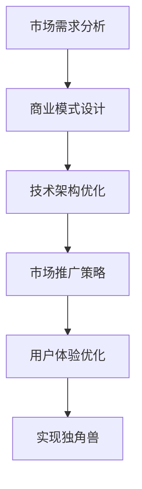

                 

# 如何将Side Project转化为独角兽

## 1. 背景介绍

### 1.1 问题由来
在软件开发行业中，开发者的个人兴趣项目通常被统称为Side Project。Side Project的开发通常源于开发者的个人爱好或兴趣，不受商业目标的驱动，旨在解决个人或小众群体的问题。然而，这些Side Project往往面临资源不足、商业化困难等挑战，难以实现大规模商业应用。如何将Side Project转化为独角兽（即估值超过10亿美元的初创公司），成为许多开发者和企业家梦寐以求的目标。

### 1.2 问题核心关键点
将Side Project转化为独角兽，需要解决几个核心问题：
1. **市场需求分析**：了解目标市场和用户需求，确保产品有价值。
2. **商业模式设计**：制定合理的商业模式，实现盈利。
3. **技术架构优化**：优化技术架构，确保系统可扩展性和可维护性。
4. **市场推广策略**：设计有效的市场推广策略，提高产品知名度。
5. **用户体验优化**：提升用户体验，提高用户黏性。

## 2. 核心概念与联系

### 2.1 核心概念概述

为更好地理解如何实现Side Project到独角兽的转变，本节将介绍几个关键概念及其相互联系：

- **Side Project**：开发者的个人兴趣项目，旨在解决特定问题或提升技能。
- **独角兽公司**：估值超过10亿美元的初创公司，通常具有强大的创新能力和市场影响力。
- **市场需求分析**：通过市场调研和用户访谈，确定产品的目标市场和用户需求。
- **商业模式设计**：制定收费模式、广告收入、订阅服务等多种盈利方式。
- **技术架构优化**：选择合适的技术栈，设计可扩展、可维护的系统架构。
- **市场推广策略**：通过SEO、内容营销、社交媒体等手段，提高产品曝光度和用户增长。
- **用户体验优化**：提升产品易用性、界面设计和功能，增强用户满意度和忠诚度。

这些概念之间的逻辑关系可以通过以下Mermaid流程图来展示：



这个流程图展示了将Side Project转化为独角兽的过程：首先通过市场需求分析确定目标市场和用户需求，然后设计适合的商业模式，再优化技术架构以支撑产品发展，接着制定有效的市场推广策略，最后不断优化用户体验，最终实现独角兽的成长。

## 3. 核心算法原理 & 具体操作步骤
### 3.1 算法原理概述

将Side Project转化为独角兽的过程，本质上是一种复杂的系统工程，涉及多学科知识和技能。以下是该过程中涉及的一些核心算法原理：

1. **市场需求分析算法**：通过数据挖掘和机器学习算法，从用户行为数据中提取市场需求信息，指导产品设计和迭代。
2. **商业模式设计算法**：利用财务模型和经济学原理，设计出能够实现可持续盈利的商业模式。
3. **技术架构优化算法**：应用软件架构设计原则和最佳实践，设计出可扩展、可维护、高可用性的技术架构。
4. **市场推广策略算法**：结合市场营销学理论和数据分析技术，制定有效的市场推广策略。
5. **用户体验优化算法**：采用用户界面设计原则和心理学理论，提升用户体验。

### 3.2 算法步骤详解

将Side Project转化为独角兽的具体操作步骤如下：

**Step 1: 市场需求分析**
- **数据收集**：通过问卷调查、用户访谈等方式收集用户需求和行为数据。
- **数据预处理**：清洗和处理数据，去除噪音和异常值。
- **数据建模**：使用机器学习算法（如聚类分析、关联规则挖掘等）分析用户需求和行为模式。
- **需求提取**：从数据模型中提取关键需求和痛点，指导产品设计。

**Step 2: 商业模式设计**
- **收入来源分析**：分析潜在收入来源，如广告、订阅、销售等。
- **成本结构分析**：分析运营成本、技术成本、营销成本等。
- **盈利模式设计**：结合收入来源和成本结构，设计合理的盈利模式。
- **商业计划书编制**：制定详细的商业计划书，明确公司发展战略和目标。

**Step 3: 技术架构优化**
- **技术栈选择**：选择适合的编程语言、框架、数据库等技术栈。
- **架构设计**：设计模块化、可扩展、高可用的系统架构。
- **性能优化**：通过代码优化、数据库优化、缓存策略等提高系统性能。
- **安全设计**：设计全面的安全机制，防止数据泄露和系统攻击。

**Step 4: 市场推广策略**
- **目标市场确定**：明确目标市场和用户群体。
- **品牌定位**：设计独特的品牌标识和定位。
- **内容营销**：通过博客、视频、社交媒体等发布有价值的内容，提升品牌知名度。
- **广告投放**：通过搜索引擎优化、社交媒体广告等手段，增加曝光度。

**Step 5: 用户体验优化**
- **界面设计**：设计简洁、直观的用户界面。
- **功能迭代**：根据用户反馈不断优化和增加新功能。
- **用户测试**：通过A/B测试、用户访谈等方式收集用户反馈。
- **用户教育**：通过教程、指南等方式提高用户使用率。

### 3.3 算法优缺点

将Side Project转化为独角兽的算法具有以下优点：
1. **系统性**：通过多学科融合的方法，确保产品从需求分析到市场推广的各个环节都得到充分考虑和优化。
2. **可扩展性**：灵活的架构设计和市场策略，使得产品能够快速适应市场变化和用户需求。
3. **数据驱动**：通过数据驱动的方法，提高决策的科学性和准确性。

同时，该算法也存在一些缺点：
1. **复杂度高**：涉及多个学科和技能，需要跨领域的专业知识。
2. **实施周期长**：从市场需求分析到用户体验优化，各个环节需要时间积累和不断迭代。
3. **资源需求大**：在市场推广和用户体验优化环节，需要大量的时间和金钱投入。

尽管存在这些缺点，但该算法仍然是目前将Side Project转化为独角兽的最佳实践，为开发者和企业家提供了全面的指导和策略。

### 3.4 算法应用领域

将Side Project转化为独角兽的算法不仅可以应用于软件开发领域，还可以拓展到多个行业，如电子商务、医疗健康、金融科技等。在实际应用中，需要根据不同行业特点，对算法进行适当的调整和优化。

## 4. 数学模型和公式 & 详细讲解  
### 4.1 数学模型构建

将Side Project转化为独角兽的过程，涉及到许多数学模型和公式。以下是几个关键模型及其构建方式：

- **市场需求分析模型**：基于用户行为数据的聚类分析模型，用于提取用户需求。
- **商业模式模型**：基于收入和成本的财务模型，用于设计盈利模式。
- **技术架构优化模型**：基于软件架构设计原则的模块化模型，用于设计系统架构。
- **市场推广模型**：基于市场调研数据的回归分析模型，用于预测市场效果。
- **用户体验优化模型**：基于用户反馈的回归模型，用于优化用户界面和功能。

### 4.2 公式推导过程

以市场需求分析为例，假设我们收集到用户行为数据 $D = \{(x_i, y_i)\}_{i=1}^N$，其中 $x_i$ 为用户行为特征，$y_i$ 为用户反馈（如满意度、购买率等）。我们使用K-means聚类算法，将用户行为数据分为 $K$ 个簇，每个簇代表一种用户需求。聚类过程的目标是最大化簇内相似度，最小化簇间相似度。数学表达式如下：

$$
\min_{C, \mu_k, \sigma_k} \sum_{i=1}^N \sum_{k=1}^K \alpha_k \| x_i - \mu_k \|^2
$$

其中 $\alpha_k$ 为簇 $k$ 的权重，$\mu_k$ 为簇 $k$ 的质心，$\sigma_k$ 为簇 $k$ 的协方差矩阵。通过求解该优化问题，我们可以得到用户需求的分组情况。

### 4.3 案例分析与讲解

假设我们开发了一款天气预报应用，希望通过市场需求分析确定目标市场和用户需求。收集了1000个用户的数据，包括地理位置、使用时长、反馈满意度等。通过聚类分析，我们将用户分为三类：长期用户、偶然用户、低频用户。分析结果显示，长期用户最关注的是准确性和实时性，偶然用户关注的是界面美观度，低频用户则希望增加更多的气象服务。根据这些需求，我们可以设计出不同的产品版本，满足不同用户群体的需求。

## 5. 项目实践：代码实例和详细解释说明
### 5.1 开发环境搭建

在进行市场需求分析实践前，我们需要准备好开发环境。以下是使用Python进行Scikit-learn开发的Python环境配置流程：

1. 安装Anaconda：从官网下载并安装Anaconda，用于创建独立的Python环境。

2. 创建并激活虚拟环境：
```bash
conda create -n pyenv python=3.8 
conda activate pyenv
```

3. 安装Scikit-learn：
```bash
pip install scikit-learn
```

4. 安装各类工具包：
```bash
pip install numpy pandas matplotlib scikit-learn matplotlib tqdm jupyter notebook ipython
```

完成上述步骤后，即可在`pyenv`环境中开始市场需求分析实践。

### 5.2 源代码详细实现

下面我们以聚类分析为例，给出使用Scikit-learn库对用户行为数据进行聚类分析的Python代码实现。

首先，定义数据处理函数：

```python
import pandas as pd
from sklearn.cluster import KMeans
from sklearn.preprocessing import StandardScaler
from sklearn.metrics import silhouette_score

def preprocess_data(data_path):
    data = pd.read_csv(data_path)
    features = data[['latitude', 'longitude', 'use_duration', 'satisfaction']]
    labels = data['satisfaction']
    return features, labels

def calculate_silhouette(features, labels):
    model = KMeans(n_clusters=3, random_state=0)
    model.fit(features)
    silhouette = silhouette_score(features, model.labels_)
    return silhouette

features, labels = preprocess_data('user_data.csv')
silhouette = calculate_silhouette(features, labels)
print(f'Silhouette score: {silhouette:.3f}')
```

然后，定义聚类分析函数：

```python
from sklearn.decomposition import PCA

def perform_clustering(features):
    model = KMeans(n_clusters=3, random_state=0)
    model.fit(features)
    labels = model.labels_
    components = model.components_
    explained_variance = model.explained_variance_ratio_.sum()
    return labels, components, explained_variance
```

最后，启动聚类分析流程：

```python
labels, components, explained_variance = perform_clustering(features)
print(f'Explained variance: {explained_variance:.3f}')
```

以上就是使用Scikit-learn库进行聚类分析的完整代码实现。可以看到，通过简单的代码实现，我们就可以完成用户行为数据的聚类分析，得到用户需求的分组情况。

### 5.3 代码解读与分析

让我们再详细解读一下关键代码的实现细节：

**preprocess_data函数**：
- 定义了数据预处理函数，用于读取用户行为数据，提取相关特征和标签。
- 使用KMeans聚类算法对用户行为数据进行聚类分析，计算轮廓系数评估聚类效果。

**calculate_silhouette函数**：
- 计算聚类结果的轮廓系数，用于评估聚类效果。轮廓系数越高，表示聚类效果越好。

**perform_clustering函数**：
- 使用KMeans聚类算法对用户行为数据进行聚类分析，得到用户需求的分组情况。
- 输出聚类结果和解释方差比例，用于评估聚类质量和数据拟合程度。

通过以上代码的实现，我们可以对用户行为数据进行聚类分析，从而更好地理解用户需求，指导产品设计和迭代。

## 6. 实际应用场景
### 6.1 智能家居系统

基于市场需求分析，智能家居系统可以针对不同用户的需求设计出不同的功能和界面。例如，对于喜欢科技的用户，可以设计智能语音助手、远程监控等功能；对于喜欢舒适的用户，可以设计智能灯光、温度调节等功能。通过市场调研和聚类分析，可以确定不同用户的需求，设计出符合用户期望的产品。

### 6.2 在线教育平台

在线教育平台可以基于市场需求分析，设计出符合不同用户需求的课程和教学方式。例如，对于小学生，可以设计生动有趣的互动课程；对于大学生，可以设计深入专业的研究课程。通过市场调研和聚类分析，可以确定不同用户群体的需求，设计出符合用户期望的教育产品。

### 6.3 健康管理应用

健康管理应用可以基于市场需求分析，设计出符合不同用户需求的健康管理方案。例如，对于老年人，可以设计简单易用的健康监测和提醒功能；对于年轻白领，可以设计健身计划和营养搭配等功能。通过市场调研和聚类分析，可以确定不同用户的需求，设计出符合用户期望的健康管理产品。

### 6.4 未来应用展望

随着市场需求分析技术的发展，未来将有更多创新应用场景涌现。例如，在医疗、金融、物流等行业，可以通过市场需求分析，设计出更符合用户需求的创新产品，提升用户体验和业务价值。

## 7. 工具和资源推荐
### 7.1 学习资源推荐

为了帮助开发者系统掌握市场需求分析的理论基础和实践技巧，这里推荐一些优质的学习资源：

1. 《机器学习实战》系列博文：由数据科学家撰写，详细介绍了市场需求分析的基本概念和常用方法。

2. 《数据分析实战》课程：由知名大学开设的在线课程，涵盖数据挖掘、聚类分析等知识点，是入门市场分析的好资源。

3. 《用户研究方法》书籍：介绍了用户研究和市场需求分析的基本方法，结合案例进行讲解。

4. 《K-means聚类算法》论文：提供了聚类算法的基本原理和实现步骤，是技术实现的参考。

5. Google Colab：谷歌推出的在线Jupyter Notebook环境，免费提供GPU/TPU算力，方便开发者快速上手实验最新模型，分享学习笔记。

通过对这些资源的学习实践，相信你一定能够快速掌握市场需求分析的精髓，并用于解决实际的业务问题。
###  7.2 开发工具推荐

高效的开发离不开优秀的工具支持。以下是几款用于市场需求分析开发的常用工具：

1. Python：基于Python的开源数据分析语言，支持丰富的库和框架，适合数据处理和算法实现。

2. Jupyter Notebook：基于Web的数据分析和编程环境，方便代码编写和结果展示。

3. Pandas：基于Python的数据处理库，提供了强大的数据清洗和分析功能。

4. Scikit-learn：基于Python的机器学习库，提供了丰富的聚类、回归、分类等算法实现。

5. K-means：基于Python的聚类算法实现，简单易用，适合初学者上手。

合理利用这些工具，可以显著提升市场需求分析任务的开发效率，加快创新迭代的步伐。

### 7.3 相关论文推荐

市场需求分析技术的发展源于学界的持续研究。以下是几篇奠基性的相关论文，推荐阅读：

1. K-means: Algorithms for Vector Quantization：经典的聚类算法论文，介绍了K-means算法的原理和实现步骤。

2. An Introduction to Data Clustering：一本综述性书籍，介绍了多种聚类算法及其应用场景。

3. Market Segmentation with Clustering：一篇应用案例文章，展示了如何通过聚类分析进行市场细分。

4. Demand Analysis for NLP Products：一篇研究论文，展示了如何通过市场需求分析改进NLP产品的设计。

这些论文代表市场需求分析技术的发展脉络。通过学习这些前沿成果，可以帮助研究者把握学科前进方向，激发更多的创新灵感。

## 8. 总结：未来发展趋势与挑战

### 8.1 总结

本文对市场需求分析将Side Project转化为独角兽的过程进行了全面系统的介绍。首先阐述了市场需求分析的重要性及其在产品设计和迭代中的关键作用。其次，从原理到实践，详细讲解了市场需求分析的数学原理和关键步骤，给出了市场需求分析任务开发的完整代码实例。同时，本文还广泛探讨了市场需求分析在多个行业领域的应用前景，展示了市场需求分析技术的广泛应用。

通过本文的系统梳理，可以看到，市场需求分析技术在将Side Project转化为独角兽的过程中发挥着至关重要的作用。需求分析不仅能够帮助开发者快速定位目标市场和用户需求，还能指导产品设计、技术架构优化、市场推广和用户体验优化等多个环节，确保产品从需求分析到市场推广的各个环节都得到充分考虑和优化。

### 8.2 未来发展趋势

展望未来，市场需求分析技术将呈现以下几个发展趋势：

1. **自动化**：通过自动化工具和算法，提高市场需求分析的效率和准确性。

2. **多模态数据融合**：结合图像、语音、文本等多种数据源，全面了解用户需求和行为。

3. **实时分析**：通过实时数据流分析，快速响应市场变化和用户需求。

4. **深度学习**：结合深度学习技术，提高市场需求分析的复杂度和精度。

5. **个性化推荐**：通过用户画像和行为分析，提供个性化的市场分析和产品设计。

6. **跨领域应用**：市场需求分析技术将拓展到更多领域，如金融、医疗、教育等。

以上趋势凸显了市场需求分析技术的广阔前景。这些方向的探索发展，必将进一步提升市场需求分析模型的精度和应用范围，为产品设计和市场推广提供更科学、更精准的指导。

### 8.3 面临的挑战

尽管市场需求分析技术已经取得了瞩目成就，但在迈向更加智能化、普适化应用的过程中，它仍面临着诸多挑战：

1. **数据质量问题**：市场数据往往存在噪音、缺失等问题，影响分析结果的准确性。

2. **算法复杂度**：市场需求分析涉及多个学科和技能，算法复杂度较高，需要跨领域的专业知识。

3. **模型可解释性**：市场需求分析模型的决策过程复杂，难以解释其内部工作机制和推理逻辑。

4. **资源投入大**：市场调研和数据分析需要大量时间和金钱投入，尤其是大规模数据集的处理和分析。

5. **隐私保护**：市场需求分析涉及大量用户数据，如何保护用户隐私和数据安全，是重要的问题。

6. **需求多变**：市场需求变化快，模型需要快速迭代和更新，以适应新需求。

正视市场需求分析面临的这些挑战，积极应对并寻求突破，将是大规模市场需求分析技术迈向成熟的必由之路。相信随着学界和产业界的共同努力，这些挑战终将一一被克服，市场需求分析技术必将在构建安全、可靠、可解释、可控的智能系统铺平道路。

### 8.4 研究展望

面对市场需求分析所面临的挑战，未来的研究需要在以下几个方面寻求新的突破：

1. **数据增强技术**：通过数据增强技术，提高市场数据的质量和多样性。

2. **多领域融合**：结合多领域知识和技术，提高市场需求分析的全面性和准确性。

3. **模型可解释性**：引入可解释性模型和技术，提高市场需求分析模型的透明度和可解释性。

4. **自动化工具**：开发自动化工具和平台，降低市场需求分析的门槛，提高工作效率。

5. **隐私保护技术**：结合隐私保护技术，保护用户隐私和数据安全。

这些研究方向的探索，必将引领市场需求分析技术迈向更高的台阶，为产品设计和市场推广提供更科学、更精准的指导。面向未来，市场需求分析技术还需要与其他人工智能技术进行更深入的融合，如自然语言处理、计算机视觉等，多路径协同发力，共同推动智能系统的进步。

## 9. 附录：常见问题与解答

**Q1：市场需求分析是否适用于所有行业？**

A: 市场需求分析在大多数行业都适用，尤其是涉及用户需求和行为分析的领域。但不同行业的具体需求和应用场景有所不同，需要根据行业特点进行适当调整和优化。

**Q2：如何选择适合的市场调研方法和工具？**

A: 选择适合的市场调研方法和工具，需要考虑数据的可获取性、分析复杂度、结果准确性等因素。常用的方法包括问卷调查、用户访谈、社交媒体分析等。常用的工具包括Excel、Google Analytics、SurveyMonkey等。需要根据具体情况选择最合适的方法和工具。

**Q3：如何进行用户画像和行为分析？**

A: 用户画像和行为分析是市场需求分析的重要环节。可以通过收集和分析用户数据，包括基本信息、行为数据、反馈数据等，构建用户画像。使用数据分析工具和算法，如聚类分析、关联规则挖掘等，发现用户的行为模式和需求。

**Q4：市场需求分析在产品设计中如何应用？**

A: 市场需求分析的结果可以指导产品设计和迭代。根据用户需求和行为分析结果，设计符合用户期望的产品功能和界面。在产品迭代过程中，不断收集用户反馈，优化产品功能和用户体验。

**Q5：如何评估市场需求分析模型的效果？**

A: 评估市场需求分析模型的效果，通常通过以下指标：准确率、召回率、F1值、轮廓系数等。可以构建测试集进行模型评估，比较不同算法和模型的效果。同时，通过用户反馈和市场反应，评估模型在实际应用中的表现。

通过对这些问题的解答，相信你一定能够更好地理解和应用市场需求分析技术，将其应用于实际的业务场景中。

