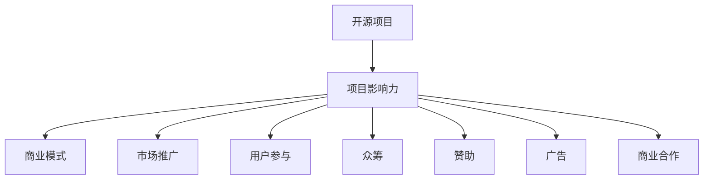

                 

# 如何将开源项目影响力转化为财务收益：全面指南

> 关键词：开源项目, 项目影响力, 财务收益, 商业模式, 市场推广, 用户参与, 众筹, 赞助, 广告, 商业合作

## 1. 背景介绍

### 1.1 问题由来

近年来，开源社区蓬勃发展，众多优秀的开源项目在技术创新、社区参与、社会责任等方面取得了显著成就，成为推动科技创新和行业发展的重要力量。然而，在开源项目影响力不断提升的同时，如何将这种影响力转化为实际的财务收益，仍然是一个重要的挑战。

开源项目通常依赖于社区贡献者的志愿劳动，缺乏明确的商业模式和财务支持，导致其在推广、维护和扩展方面存在较大困难。如何有效地将开源项目的价值和影响力转化为实际的财务收益，是开源项目可持续发展的关键问题之一。

### 1.2 问题核心关键点

开源项目影响力的转化问题主要集中在以下几个方面：

- 选择合适的商业模式：如何将开源项目的独特价值和影响力转化为商业收入。
- 制定有效的市场推广策略：如何精准地将项目和产品推向目标市场，吸引潜在用户和客户。
- 建立良好的用户参与机制：如何吸引更多用户和贡献者参与，增强项目的影响力和参与度。
- 探索多样化的财务支持方式：如何通过众筹、赞助、广告、商业合作等方式，实现财务可持续。
- 实施高效的运营和维护策略：如何确保项目长期稳定运行，提升用户体验和满意度。

本文将系统地探讨这些关键问题，为开源项目管理者提供全面的开源项目影响力转化指南。

## 2. 核心概念与联系

### 2.1 核心概念概述

为更好地理解开源项目影响力的转化，本节将介绍几个密切相关的核心概念：

- 开源项目：指通过公开源代码的方式，允许任何人在遵循特定开源协议的条件下，使用、修改和分发代码的软件项目。典型的开源项目如Linux Kernel、Apache Hadoop等。
- 项目影响力：指开源项目在技术、社区、社会等方面产生的积极影响和价值。包括技术创新、社区活跃度、市场认知度等。
- 商业模式：指开源项目通过何种方式实现财务收入，如广告、赞助、产品销售等。
- 市场推广：指开源项目如何通过各种渠道和手段，提升项目和产品的市场知名度和用户获取量。
- 用户参与：指开源项目如何吸引和激励社区用户和贡献者积极参与项目开发、测试和推广。
- 众筹：指通过互联网平台，公开募集项目启动资金或持续支持的方式，支持开源项目的发展。
- 赞助：指企业和个人通过资金、资源等形式，对开源项目进行财务支持。
- 广告：指开源项目通过广告渠道，进行项目和产品的推广。
- 商业合作：指开源项目与其他企业和机构进行合作，实现技术交流、产品集成和市场拓展。

这些核心概念之间的逻辑关系可以通过以下Mermaid流程图来展示：



这个流程图展示开源项目的核心概念及其之间的关系：

1. 开源项目通过开源协议和社区贡献，积累技术、社区和市场影响力。
2. 项目影响力通过多种方式转化为商业模式。
3. 通过市场推广策略，提升项目和产品的市场认知度和用户获取量。
4. 用户参与机制增强项目的影响力和社区活跃度。
5. 通过众筹、赞助、广告和商业合作等方式，实现财务可持续。

这些概念共同构成了开源项目影响力的转化框架，使得开源项目能够实现可持续的商业化发展。

## 3. 核心算法原理 & 具体操作步骤

### 3.1 算法原理概述

开源项目影响力的转化，本质上是一个项目管理和商业化的过程。其核心思想是：

1. **价值挖掘**：识别和挖掘开源项目的独特价值和优势。
2. **市场匹配**：将项目的价值与市场需求相匹配，找到适合的市场推广和商业合作机会。
3. **用户培养**：通过用户参与机制，吸引更多用户和贡献者，提升项目影响力和社区活跃度。
4. **资金筹集**：探索多样化的资金筹集方式，确保项目财务可持续。
5. **商业变现**：通过多种商业模式，实现项目的财务收益。

### 3.2 算法步骤详解

基于开源项目影响力转化的核心思想，以下步骤详述了开源项目影响力的转化过程：

**Step 1: 识别项目独特价值**

- 分析项目的技术优势、市场潜力、社区影响力等，明确项目独特的竞争优势和市场定位。
- 列出项目的关键功能和特点，以及它们在技术、市场、社会等方面的应用场景和价值。

**Step 2: 制定市场推广策略**

- 确定目标市场和用户群体，了解其需求和偏好。
- 设计多样化的市场推广渠道，如网站、社交媒体、技术论坛等。
- 制定推广内容，包括技术白皮书、案例分析、用户评价等，提升项目曝光度和认知度。

**Step 3: 建立用户参与机制**

- 设计有效的社区管理机制，激励用户积极参与项目开发、测试和推广。
- 引入众包任务和奖励机制，吸引更多贡献者参与项目开发。
- 通过邮件列表、社交媒体群组等方式，保持社区成员的活跃度和参与度。

**Step 4: 探索财务支持方式**

- 了解和利用各种众筹平台（如Kickstarter、Indiegogo），筹集项目启动资金和持续支持。
- 寻求企业和个人的赞助，提供项目所需的资金、资源和技术支持。
- 通过广告渠道，提升项目曝光度，吸引更多用户和客户。
- 探索商业合作机会，通过技术授权、产品集成等方式，实现商业收益。

**Step 5: 实施商业变现策略**

- 根据市场需求，设计和推出适合的产品或服务。
- 通过销售、订阅、增值服务等模式，实现项目商业变现。
- 建立完善的售后服务和支持体系，提升用户满意度和忠诚度。

### 3.3 算法优缺点

开源项目影响力的转化方法具有以下优点：

- 提升项目商业化能力：通过市场推广和商业合作，提升项目影响力和市场份额。
- 吸引更多贡献者：通过用户参与机制和众筹支持，增强社区活跃度和贡献者动力。
- 财务可持续：通过多种财务支持方式，实现项目的财务可持续。
- 技术迭代加速：通过商业合作和市场反馈，加速技术创新和迭代。

同时，该方法也存在以下局限性：

- 对项目管理能力要求高：需要具备良好的项目管理和商业化能力，才能实现财务转化。
- 资金筹集难度大：尤其是对于新的开源项目，筹集资金可能需要较长时间和较大成本。
- 市场推广效果不确定：市场推广效果受多种因素影响，需要持续优化和调整策略。
- 用户需求多样：用户需求和市场变化复杂，需要灵活应对和调整产品策略。

尽管存在这些局限性，但就目前而言，开源项目影响力的转化方法仍是最有效的商业化途径之一。未来相关研究应重点关注如何进一步提升项目管理能力，降低资金筹集难度，增强市场推广效果，灵活应对用户需求变化。

### 3.4 算法应用领域

开源项目影响力的转化方法在多个领域已得到成功应用，如：

- 软件开发：通过技术授权、产品集成等方式，实现软件商业化。
- 云计算服务：提供基于开源项目的云服务，实现收入增长。
- 数据平台：基于开源项目的数据平台，提供数据服务和解决方案。
- 开源硬件：通过开源硬件项目，实现产品化和市场推广。
- 开源教育：开发基于开源项目的教育平台，提供在线课程和培训服务。

除了上述这些典型应用外，开源项目影响力的转化方法也被应用于更多领域中，如能源、医疗、交通等，为各行各业带来新的技术和管理创新。

## 4. 数学模型和公式 & 详细讲解 & 举例说明

### 4.1 数学模型构建

本节将使用数学语言对开源项目影响力的转化过程进行更加严格的刻画。

记开源项目为 $P$，其独特价值为 $V$，市场匹配度为 $M$，用户参与度为 $U$，财务支持为 $F$，商业收益为 $R$。则转化过程可表示为：

$$
R = f(V, M, U, F)
$$

其中 $f$ 为转化函数，反映了开源项目价值、市场匹配、用户参与、财务支持等因素对商业收益的影响。

### 4.2 公式推导过程

以下我们以软件开发为例，推导开源项目商业收益的转化公式。

设软件开发项目的独特价值为 $V$，包括技术创新、用户体验、社区影响力等。市场匹配度为 $M$，即项目价值与市场需求的一致性。用户参与度为 $U$，包括社区活跃度、贡献者数量、用户反馈等。财务支持为 $F$，包括众筹、赞助、广告等收入。商业收益为 $R$，包括产品销售、服务订阅等收入。

则转化公式为：

$$
R = V \cdot M \cdot U \cdot F
$$

其中 $V$、$M$、$U$、$F$ 分别代表项目的独特价值、市场匹配度、用户参与度、财务支持。

### 4.3 案例分析与讲解

以下是一个开源项目影响力转化的实际案例：

**案例：Apache Hadoop**

Apache Hadoop 是著名的开源分布式计算框架，具有高度的技术创新性和广泛的市场应用。

1. **识别项目独特价值**：Hadoop 在数据处理和存储领域具有显著的技术优势，能够支持大规模数据分布式处理。
2. **制定市场推广策略**：通过技术论坛、博客、会议等渠道，推广 Hadoop 的应用和价值，提升市场认知度。
3. **建立用户参与机制**：建立活跃的社区，通过邮件列表、代码贡献、问题解答等方式，吸引更多用户和贡献者。
4. **探索财务支持方式**：通过 Hadoop 基金会的多元化资金支持，包括企业赞助、开源社区的捐赠、商业合作等。
5. **实施商业变现策略**：推出基于 Hadoop 的企业版产品，提供企业级的数据处理和分析服务，实现商业收益。

通过以上策略，Hadoop 成功实现了从开源项目到商业产品的转化，成为数据处理领域的标准解决方案。

## 5. 项目实践：代码实例和详细解释说明

### 5.1 开发环境搭建

在进行开源项目影响力转化实践前，我们需要准备好开发环境。以下是使用Python进行开源项目影响力转化实验的环境配置流程：

1. 安装Anaconda：从官网下载并安装Anaconda，用于创建独立的Python环境。

2. 创建并激活虚拟环境：
```bash
conda create -n open-source-env python=3.8 
conda activate open-source-env
```

3. 安装Python必要的工具包：
```bash
pip install numpy pandas scikit-learn matplotlib tqdm jupyter notebook ipython
```

4. 安装Git版本控制系统，方便获取和管理开源项目代码。
```bash
pip install gitpython
```

完成上述步骤后，即可在`open-source-env`环境中开始项目实践。

### 5.2 源代码详细实现

这里我们以一个假想的开源社区为例，介绍如何通过用户参与和众筹方式实现开源项目影响力的转化。

**项目名称**：OpenSourceProject

**目标**：开发一款开源社区管理系统，用于社区的管理、用户管理和资源共享。

**开发流程**：

1. 创建Git仓库，并邀请贡献者参与项目开发。
```bash
git clone https://github.com/OpenSourceProject/management-system.git
cd management-system
git init
git remote add origin https://github.com/OpenSourceProject/management-system.git
```

2. 设计用户参与机制，激励更多用户参与。
```python
from flask import Flask, request

app = Flask(__name__)

@app.route('/contribute', methods=['POST'])
def contribute():
    # 记录用户贡献信息
    user = request.form.get('user')
    contribution = request.form.get('contribution')
    # 发送贡献邮件或增加积分奖励
    # ...
    return 'Thank you for contributing!'

if __name__ == '__main__':
    app.run(debug=True)
```

3. 通过Kickstarter等众筹平台筹集项目启动资金。
```bash
# 注册Kickstarter账户
# 创建项目页面
# 设置目标金额和项目细节
# 邀请支持者并分享项目进展
```

4. 通过GitHub等开源社区平台展示项目进展，吸引更多贡献者。
```bash
# 创建GitHub仓库
# 发布项目进展和更新
# 与社区成员互动，解答问题
```

5. 实现项目功能，并通过商业合作获取商业收益。
```python
from flask import Flask, request

app = Flask(__name__)

@app.route('/project', methods=['POST'])
def project():
    # 调用商业合作伙伴提供的API或服务
    # 实现项目功能
    # 返回项目功能响应
    return 'Project function completed!'

if __name__ == '__main__':
    app.run(debug=True)
```

### 5.3 代码解读与分析

让我们再详细解读一下关键代码的实现细节：

**Flask应用程序**：
- 使用Flask框架，方便快速构建Web应用。
- 设计贡献页面，记录用户贡献信息，并通过邮件或积分奖励激励用户。
- 实现项目功能，调用商业合作伙伴提供的API或服务。

**Kickstarter众筹**：
- 在Kickstarter上注册账户，创建项目页面。
- 设置筹资目标和项目细节，通过社交媒体和邮件邀请支持者。
- 定期更新项目进展，增强支持者的信任和参与度。

**GitHub社区展示**：
- 在GitHub上创建仓库，发布项目代码和更新。
- 与社区成员互动，回答技术问题，增强社区活跃度。
- 通过GitHub Issue和Pull Request等工具，管理项目贡献和反馈。

**商业合作**：
- 通过商业合作伙伴提供的API或服务，实现项目功能。
- 与商业合作伙伴进行谈判和合作，获取商业收益和资源支持。

可以看到，开源项目影响力的转化过程需要多方面的协同工作，包括用户参与机制、众筹支持、社区展示和商业合作等。开发者需要具备良好的项目管理和商业化能力，才能实现财务转化。

## 6. 实际应用场景

### 6.1 软件开发

开源软件开发项目通常面临资金不足和市场推广的挑战。通过用户参与和众筹支持，可以有效解决这些问题。

**案例**：Linux Kernel

Linux Kernel 是一个开源的操作系统内核项目，通过社区贡献和用户参与，逐步成为全球最流行的操作系统之一。

1. **用户参与机制**：Linux Kernel 通过邮件列表、代码贡献和问题解答等方式，吸引了全球数万名开发者参与项目开发。
2. **众筹支持**：Linux Kernel 基金会通过Red Hat等企业赞助和社区捐赠，获取了稳定的财务支持。
3. **商业合作**：Linux Kernel 通过技术授权和商业支持，实现商业变现，支持项目的发展。

### 6.2 云计算服务

开源云计算项目通过提供开源软件，支持企业部署和管理云服务。

**案例**：Apache Hadoop

Apache Hadoop 是一个开源分布式计算框架，通过商业合作和支持，成为全球领先的云数据处理解决方案。

1. **用户参与机制**：Apache Hadoop 通过社区贡献和用户参与，积累了丰富的技术资源和社区支持。
2. **众筹支持**：Apache Hadoop 基金会通过企业赞助和社区捐赠，获得财务支持。
3. **商业合作**：Apache Hadoop 通过商业合作伙伴提供的集成服务和产品，实现商业变现，支持项目发展。

### 6.3 数据平台

开源数据平台通过提供开源软件和数据分析服务，支持企业的数据处理和分析需求。

**案例**：Apache Spark

Apache Spark 是一个开源的大数据处理框架，通过商业合作和支持，成为全球领先的数据处理平台。

1. **用户参与机制**：Apache Spark 通过社区贡献和用户参与，积累了丰富的技术资源和社区支持。
2. **众筹支持**：Apache Spark 基金会通过企业赞助和社区捐赠，获得财务支持。
3. **商业合作**：Apache Spark 通过商业合作伙伴提供的集成服务和产品，实现商业变现，支持项目发展。

### 6.4 开源硬件

开源硬件项目通过提供开源硬件设计和开发资源，支持企业开发和部署硬件解决方案。

**案例**：Arduino

Arduino 是一个开源的硬件开发平台，通过社区贡献和用户参与，支持全球硬件开发者的需求。

1. **用户参与机制**：Arduino 通过社区贡献和用户参与，积累了丰富的硬件开发资源和社区支持。
2. **众筹支持**：Arduino 通过Kickstarter等众筹平台，获得财务支持。
3. **商业合作**：Arduino 通过商业合作伙伴提供的集成服务和硬件产品，实现商业变现，支持项目发展。

## 7. 工具和资源推荐

### 7.1 学习资源推荐

为了帮助开发者系统掌握开源项目影响力的转化理论基础和实践技巧，这里推荐一些优质的学习资源：

1. **《开源项目管理：从零到一》**：详细介绍开源项目管理和财务转化的全流程，涵盖用户参与、众筹、市场推广等多个环节。
2. **《开源社区建设与运营》**：系统介绍开源社区建设和管理的最佳实践，提升社区活跃度和用户参与度。
3. **《开源软件商业模式》**：深入探讨开源软件项目的商业模式选择和设计，实现商业化发展。
4. **《开源项目财务管理》**：介绍开源项目财务管理的核心概念和实操技巧，确保财务可持续。
5. **《开源项目市场推广》**：详细介绍开源项目的市场推广策略和方法，提升项目曝光度和用户获取量。

通过对这些资源的学习实践，相信你一定能够快速掌握开源项目影响力的转化精髓，并用于解决实际的开源项目问题。

### 7.2 开发工具推荐

高效的开发离不开优秀的工具支持。以下是几款用于开源项目影响力的转化开发的常用工具：

1. **Git版本控制系统**：用于版本控制和代码管理，支持协作开发和贡献者管理。
2. **Kickstarter众筹平台**：提供众筹支持，帮助开源项目获取启动资金和持续支持。
3. **GitHub社区平台**：展示项目进展，吸引社区成员参与和贡献。
4. **Flask Web框架**：方便构建Web应用，实现用户参与和项目功能展示。
5. **商业合作伙伴平台**：如Docker Hub、AWS Marketplace等，提供商业合作和支持。

合理利用这些工具，可以显著提升开源项目影响力的转化任务的开发效率，加快创新迭代的步伐。

### 7.3 相关论文推荐

开源项目影响力的转化技术的发展源于学界的持续研究。以下是几篇奠基性的相关论文，推荐阅读：

1. **《开源项目的社区管理和财务转化》**：系统介绍开源项目的社区管理和财务转化的理论和实践。
2. **《开源项目的市场推广策略》**：探讨开源项目的市场推广策略和方法，提升项目曝光度和用户获取量。
3. **《开源项目的用户参与机制》**：介绍开源项目的用户参与机制和激励策略，增强社区活跃度和贡献者动力。
4. **《开源项目的商业合作模式》**：探讨开源项目的商业合作模式和实现路径，确保财务可持续。
5. **《开源项目的财务支持方式》**：介绍开源项目的财务支持方式和资源筹集策略，确保项目财务可持续。

这些论文代表了大规模项目影响力的转化技术的发展脉络。通过学习这些前沿成果，可以帮助研究者把握学科前进方向，激发更多的创新灵感。

## 8. 总结：未来发展趋势与挑战

### 8.1 总结

本文对开源项目影响力的转化方法进行了全面系统的介绍。首先阐述了开源项目影响力转化的研究背景和意义，明确了项目管理和商业化的核心思想。其次，从原理到实践，详细讲解了开源项目影响力的转化数学模型和关键步骤，给出了开源项目影响力转化任务开发的完整代码实例。同时，本文还广泛探讨了开源项目影响力转化的应用场景，展示了开源项目影响力的转化方法的广泛应用前景。此外，本文精选了开源项目影响力的转化技术的各类学习资源，力求为开发者提供全方位的技术指引。

通过本文的系统梳理，可以看到，开源项目影响力的转化方法正在成为开源项目商业化发展的重要途径，极大地提升了开源项目的市场竞争力和财务可持续性。未来，伴随开源项目的不断创新和发展，开源项目影响力的转化方法也将不断演进，为开源社区的可持续发展注入新的动力。

### 8.2 未来发展趋势

展望未来，开源项目影响力的转化技术将呈现以下几个发展趋势：

1. **用户参与机制多样化**：开源社区将探索更多激励用户参与的方式，如积分奖励、任务众包、社区认证等，提升社区活跃度和贡献者动力。
2. **众筹支持渠道多样化**：开源项目将利用多种众筹平台，如Kickstarter、Indiegogo、Gofundme等，获取更多的启动资金和持续支持。
3. **市场推广策略创新**：开源项目将探索更多市场推广渠道，如社交媒体广告、技术博客、在线讲座等，提升项目曝光度和用户获取量。
4. **商业合作模式多样化**：开源项目将探索更多商业合作模式，如技术授权、服务集成、咨询支持等，实现商业变现。
5. **财务支持方式多样化**：开源项目将探索更多财务支持方式，如企业赞助、政府资助、基金支持等，确保财务可持续。
6. **项目管理工具创新**：开源项目将探索更多项目管理工具，如JIRA、Confluence、GitLab等，提升项目管理和协作效率。

这些趋势凸显了开源项目影响力的转化技术的广阔前景。这些方向的探索发展，必将进一步提升开源项目的商业化能力和市场竞争力，推动开源社区的可持续发展。

### 8.3 面临的挑战

尽管开源项目影响力的转化技术已经取得了显著成果，但在迈向更加智能化、普适化应用的过程中，它仍面临诸多挑战：

1. **项目管理能力不足**：开源项目通常缺乏专业的项目管理经验和资源，导致项目管理效率低下。
2. **市场推广效果不确定**：市场推广效果受多种因素影响，需要持续优化和调整策略。
3. **财务支持难度大**：尤其是对于新的开源项目，筹集资金可能需要较长时间和较大成本。
4. **用户需求多样**：用户需求和市场变化复杂，需要灵活应对和调整产品策略。
5. **社区参与度不稳定**：社区成员的活跃度和参与度受多种因素影响，需要持续激励和维护。

尽管存在这些挑战，但开源项目影响力的转化技术仍然是开源项目商业化发展的重要途径。未来相关研究需要在项目管理、市场推广、财务支持、用户参与等方面进一步探索和优化。

### 8.4 研究展望

面对开源项目影响力的转化所面临的种种挑战，未来的研究需要在以下几个方面寻求新的突破：

1. **项目管理工具的优化**：开发更加高效、灵活的项目管理工具，提升项目管理效率和协作能力。
2. **市场推广策略的创新**：探索更多市场推广渠道和策略，提升项目曝光度和用户获取量。
3. **财务支持方式的创新**：探索更多财务支持方式和渠道，确保开源项目财务可持续。
4. **用户参与机制的创新**：探索更多激励用户参与的方式，增强社区活跃度和贡献者动力。
5. **商业合作模式的创新**：探索更多商业合作模式和机会，实现商业变现。
6. **财务管理方法的创新**：开发更加科学、透明的财务管理方法，确保开源项目财务透明和可持续。

这些研究方向的探索，必将引领开源项目影响力的转化技术迈向更高的台阶，为开源社区的可持续发展提供更强大的动力。面向未来，开源项目影响力的转化技术还需要与其他人工智能技术进行更深入的融合，如知识表示、因果推理、强化学习等，多路径协同发力，共同推动开源社区的进步。

## 9. 附录：常见问题与解答

**Q1：开源项目如何选择适合的商业模式？**

A: 开源项目应根据自身技术优势和市场需求，选择合适的商业模式。如技术授权、产品销售、服务订阅、社区支持等。需考虑目标用户群体的需求和支付能力，以及项目的独特价值和竞争优势。

**Q2：如何提高开源项目的市场推广效果？**

A: 开源项目可以通过多样化的市场推广渠道，如社交媒体、技术博客、在线讲座等，提升项目曝光度和用户获取量。同时，制定清晰的推广内容，吸引更多目标用户和客户。

**Q3：如何增强开源项目的用户参与机制？**

A: 开源项目可以通过激励机制、社区认证、任务众包等方式，吸引更多用户和贡献者参与项目开发和推广。建立活跃的社区，保持社区成员的活跃度和参与度。

**Q4：开源项目如何筹集启动资金和持续支持？**

A: 开源项目可以通过Kickstarter、Indiegogo等众筹平台，获取项目启动资金和持续支持。同时，寻求企业赞助、政府资助、基金支持等多样化财务支持方式。

**Q5：开源项目如何实现商业变现？**

A: 开源项目可以通过技术授权、产品销售、服务订阅、商业合作等方式，实现商业变现。需根据市场需求和用户反馈，设计和推出适合的产品或服务。

通过这些常见问题的解答，相信你对开源项目影响力的转化有了更深刻的理解，能够更好地应用于实际开源项目管理和商业化实践中。

---

作者：禅与计算机程序设计艺术 / Zen and the Art of Computer Programming

