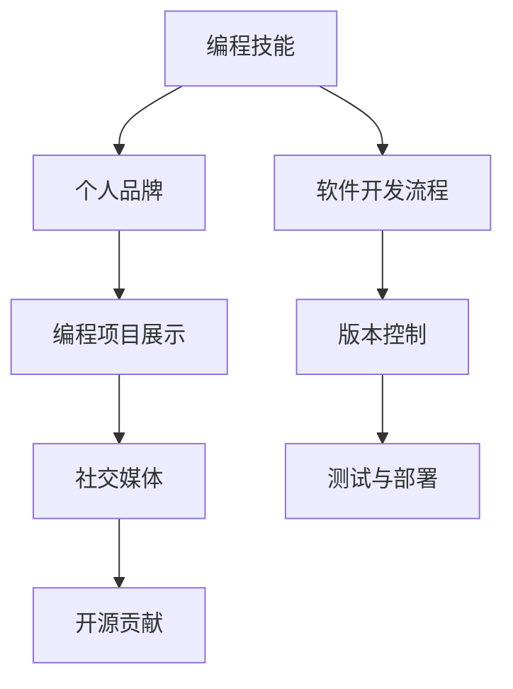

                 

## 1. 背景介绍

在当今快速发展的数字化时代，个人品牌建设已经成为个人职业发展的重要组成部分。无论你是软件开发人员、数据科学家、AI工程师，还是其他技术领域的专业人士，拥有一套出色的编程技能并有效利用这些技能来提升个人品牌价值，都是至关重要的。本文将探讨如何将编程技能应用于个人品牌建设，包括选择正确的平台、优化编程项目、以及如何在社交媒体上展示你的技术能力和成果。

## 2. 核心概念与联系

### 2.1 核心概念概述

在深入探讨如何将编程技能应用于个人品牌建设之前，我们需要先了解一些核心概念及其联系：

- **编程技能**：包括但不限于编程语言（如Python、Java、JavaScript等）、算法与数据结构、软件开发流程、版本控制（如Git）、测试与部署等。
- **个人品牌**：指的是个人在特定行业或技术领域内建立的声誉、认知度和影响力。
- **编程项目展示**：指通过编写和分享编程项目来展示个人技能和专业知识，吸引潜在雇主、合作伙伴或社区成员的注意。
- **社交媒体**：包括LinkedIn、GitHub、Stack Overflow等，是展示编程技能和个人品牌的有效平台。
- **开源贡献**：参与开源项目，通过提交代码、修复Bug、撰写文档等方式为社区做出贡献，可以显著提升个人品牌的可见度和影响力。

### 2.2 核心概念原理和架构的 Mermaid 流程图



这个流程图展示了编程技能如何通过展示编程项目、利用社交媒体以及参与开源贡献来支持个人品牌建设。同时，软件开发流程、版本控制、测试与部署等技术实践也对个人品牌建设有间接影响。

## 3. 核心算法原理 & 具体操作步骤

### 3.1 算法原理概述

个人品牌建设的算法原理可以抽象为通过编程技能来构建和维护一个有影响力的在线形象。这涉及到了多个步骤，包括选择展示平台、创建和优化编程项目、以及有效利用社交媒体和开源贡献。

### 3.2 算法步骤详解

#### 3.2.1 选择展示平台

- **GitHub**：开源项目的托管平台，适合展示技术能力和编程项目。GitHub提供的Issues和Pull Requests功能也可以用于讨论和反馈。
- **LinkedIn**：专业社交网络，适合建立行业联系和展示职业成就。
- **Stack Overflow**：问答社区，适合分享技术问题和解决方案，展示解决问题的能力。

#### 3.2.2 创建和优化编程项目

- **选择有价值的项目**：选择能够解决实际问题、有广泛应用前景的项目，避免过于狭窄的领域。
- **文档完善**：项目文档应包含清晰的README文件、代码注释、项目结构说明等，以便于他人理解和贡献。
- **持续更新**：定期更新项目，修复Bug，添加新功能，保持项目活跃度和社区参与度。

#### 3.2.3 利用社交媒体

- **内容分享**：在LinkedIn、Twitter等平台上分享编程项目进展、技术见解和行业动态，提升个人品牌知名度。
- **互动交流**：积极参与讨论，回复他人的问题，展示专业知识和乐于助人的态度。
- **建立网络**：通过参与行业活动、加入技术社区，与行业内其他专业人士建立联系。

#### 3.2.4 开源贡献

- **选择开源项目**：选择与你技术领域相关、维护活跃的开源项目进行贡献。
- **提交代码和Bug修复**：根据项目的贡献指南，提交代码或修复Bug，展示你的编程技能。
- **撰写文档和教程**：帮助项目团队完善文档和教程，提升项目的可用性和可理解性。

### 3.3 算法优缺点

#### 3.3.1 优点

- **广泛曝光**：开源贡献和项目展示可以在全球范围内吸引潜在雇主和合作伙伴的关注。
- **技术成长**：通过参与开源项目和项目优化，不断提升技术水平和解决问题能力。
- **社区认同**：积极参与社区活动和互动，可以获得社区的认同和支持。

#### 3.3.2 缺点

- **时间投入**：编程项目展示和开源贡献需要大量的时间和精力投入。
- **竞争激烈**：技术领域竞争激烈，要在众多开发者中脱颖而出，需要持续的努力和创新。
- **公开曝光**：编程项目的任何问题都可能被公众关注和讨论，需要谨慎处理。

### 3.4 算法应用领域

编程技能应用于个人品牌建设的技术应用领域非常广泛，包括但不限于以下几个方面：

- **技术专家认证**：通过在特定领域展示技术和项目，获得认证机构的认可，提升个人信誉。
- **技术咨询和顾问**：利用编程技能和项目展示，为公司或客户提供技术咨询和顾问服务。
- **产品和技术创新**：通过个人项目展示和开源贡献，展示创新能力和技术实力，吸引投资和合作。

## 4. 数学模型和公式 & 详细讲解 & 举例说明

### 4.1 数学模型构建

个人品牌建设可以建模为一个多目标优化问题，目标包括提高技术影响力、建立行业联系和展示职业成就。

设目标函数 $f(x)$ 表示个人品牌价值，包含技术影响力、社交网络和职业成就的加权和。其中，$w_1$、$w_2$、$w_3$ 为不同目标的权重。

目标函数如下：

$$
f(x) = w_1 \times \text{技术影响力} + w_2 \times \text{社交网络} + w_3 \times \text{职业成就}
$$

### 4.2 公式推导过程

为了最大化个人品牌价值，我们需要求解目标函数 $f(x)$ 的最优解。假设我们有一个关于编程技能的评价指标 $g(x)$，表示编程技能水平。那么，目标函数可以进一步简化为：

$$
f(x) = w_1 \times g(x) + w_2 \times \text{社交网络} + w_3 \times \text{职业成就}
$$

其中，$w_1$ 表示技术影响力对个人品牌价值的影响程度，$w_2$ 表示社交网络的影响程度，$w_3$ 表示职业成就的影响程度。

### 4.3 案例分析与讲解

假设一个软件开发人员希望最大化其个人品牌价值，他可以采用以下策略：

- **提高技术影响力**：通过参与开源项目、撰写技术博客、参加技术会议等方式，提升编程技能评价指标 $g(x)$。
- **建立社交网络**：在LinkedIn、GitHub等平台上积极互动，扩大社交圈，增加社交网络权重。
- **展示职业成就**：通过在LinkedIn上更新职业成就，如获得的技术认证、参与的重大项目等，提升职业成就权重。

## 5. 项目实践：代码实例和详细解释说明

### 5.1 开发环境搭建

1. **选择编程语言和框架**：
   - 选择Python作为主要编程语言，因为它有丰富的库和社区支持。
   - 使用Flask或Django等Web框架，方便搭建个人项目展示平台。

2. **安装必要的库和工具**：
   - 使用pip安装Flask、Git、GitHub API等库。
   - 设置GitHub OAuth认证，方便在社交媒体上自动化发布内容。

3. **配置开发环境**：
   - 使用VS Code等编辑器。
   - 设置虚拟环境和依赖管理工具，如Python的virtualenv或conda。

### 5.2 源代码详细实现

以下是一个简单的Python Flask应用，用于展示个人编程项目：

```python
from flask import Flask, request, jsonify
import git

app = Flask(__name__)

@app.route('/projects')
def projects():
    repo = git.Repo('path/to/your/project')
    commits = list(repo.iter_commits('master'))
    return jsonify([commit.hexsha for commit in commits])

if __name__ == '__main__':
    app.run(debug=True)
```

这个应用展示了项目最近提交的SHA值，可以通过API访问。

### 5.3 代码解读与分析

- **Flask框架**：使用Flask框架搭建一个Web应用，方便展示编程项目。
- **Git库**：使用Git库获取项目的最新提交信息。
- **API接口**：通过API接口，用户可以访问项目最新提交信息，了解项目进展。

### 5.4 运行结果展示

运行上述代码后，可以通过访问`http://localhost:5000/projects`来查看项目的最新提交信息。

## 6. 实际应用场景

### 6.1 技术专家认证

假设一个软件工程师希望成为一名认证的技术专家，他可以：

- **选择展示项目**：选择具有广泛应用前景的编程项目，如开源项目。
- **优化项目**：通过添加新功能、修复Bug等方式，保持项目活跃。
- **发布技术见解**：在GitHub、GitLab等平台上发布技术见解和代码，吸引同行关注。

### 6.2 技术咨询和顾问

一个技术顾问希望通过编程技能提升其职业地位，可以：

- **优化展示平台**：通过GitHub展示个人编程项目和代码，吸引潜在客户。
- **参与开源项目**：参与开源项目，展示技术能力和团队合作精神。
- **编写技术博客**：在个人博客或Medium上发布技术文章，分享行业洞见。

### 6.3 产品和技术创新

一个创业者希望通过编程技能吸引投资者，可以：

- **展示创新项目**：通过GitHub和GitLab展示创新项目的代码和文档。
- **获得社区支持**：积极参与开源社区，获得社区成员的认可和支持。
- **寻求技术合作**：通过展示技术实力，吸引其他技术专家和团队合作。

## 7. 工具和资源推荐

### 7.1 学习资源推荐

1. **Flask官方文档**：详细介绍了Flask框架的使用方法，适合初学者入门。
2. **Python编程之美**：一本经典教材，深入浅出地介绍了Python编程技术和最佳实践。
3. **开源项目入门指南**：由GitHub官方编写，介绍了如何参与开源项目和贡献代码。
4. **Stack Overflow指南**：官方提供的指南，介绍如何在Stack Overflow上提问和回答问题。
5. **LinkedIn使用指南**：官方提供的指南，介绍如何使用LinkedIn展示职业成就和建立网络。

### 7.2 开发工具推荐

1. **VS Code**：一个轻量级但功能强大的代码编辑器，支持多种编程语言和插件扩展。
2. **Git**：版本控制系统，适合管理和分享代码。
3. **GitHub**：开源项目的托管平台，适合展示编程项目和代码。
4. **Flask**：轻量级的Web框架，适合搭建展示平台。
5. **Stack Overflow API**：用于获取和发布技术问答数据的API。

### 7.3 相关论文推荐

1. **编程技能和个人品牌价值的关系研究**：研究编程技能如何影响个人品牌价值，提出量化模型和优化策略。
2. **开源贡献对个人职业发展的影响**：分析开源贡献对职业发展和技术影响力的关系，提供案例和数据支持。
3. **社交媒体在技术社区中的作用**：探讨社交媒体如何影响技术社区的互动和知识共享，提供实证分析。

## 8. 总结：未来发展趋势与挑战

### 8.1 研究成果总结

本文探讨了如何将编程技能应用于个人品牌建设，通过编程项目展示、社交媒体利用和开源贡献等手段，提升个人在技术领域的影响力和职业地位。

### 8.2 未来发展趋势

1. **编程项目的展示**：随着技术社区的不断发展，编程项目展示将更加注重社区贡献和创新能力。
2. **社交媒体的利用**：社交媒体平台将提供更多功能和工具，方便开发者展示技术成就和获得反馈。
3. **开源贡献的扩展**：开源贡献将更加注重跨领域合作和知识共享，推动技术进步和社区发展。

### 8.3 面临的挑战

1. **时间管理和精力投入**：编程项目展示和开源贡献需要大量的时间和精力，开发者需要合理规划。
2. **技术竞争和合作**：技术领域竞争激烈，同时需要积极寻求合作，共同推动技术进步。
3. **技术和社交媒体的结合**：需要将编程技能和社交媒体技术有机结合，提升展示效果和影响力。

### 8.4 研究展望

未来的研究可以聚焦于以下几个方面：

1. **编程技能与个人品牌价值的数学模型**：构建更准确的数学模型，量化编程技能对个人品牌价值的影响。
2. **编程项目展示平台的改进**：开发更先进的编程项目展示平台，提供更好的用户体验和展示效果。
3. **社交媒体技术的应用**：研究社交媒体技术如何更好地服务于编程技能展示和社区互动。

## 9. 附录：常见问题与解答

**Q1：如何平衡技术展示和个人生活？**

A: 技术展示和个人生活需要合理规划时间和精力，优先选择具有长期价值的项目和贡献。可以通过定期发布更新、批量处理任务等方式，提高效率。

**Q2：如何选择展示平台？**

A: 根据展示内容和技术领域选择适合的平台，如GitHub适合展示代码和开源项目，LinkedIn适合展示职业成就和建立网络。

**Q3：如何提高社交媒体互动效果？**

A: 积极参与讨论、及时回复评论和提问，展示专业知识和乐于助人的态度，吸引更多关注和互动。

**Q4：如何管理开源项目？**

A: 使用Git进行版本控制，定期更新项目代码和文档，保持项目的活跃度和可维护性。

**Q5：如何利用编程技能提升职业地位？**

A: 通过参与开源项目、撰写技术文章、建立个人品牌等方式，展示技术实力和专业能力，吸引潜在雇主和合作伙伴。

---

作者：禅与计算机程序设计艺术 / Zen and the Art of Computer Programming

