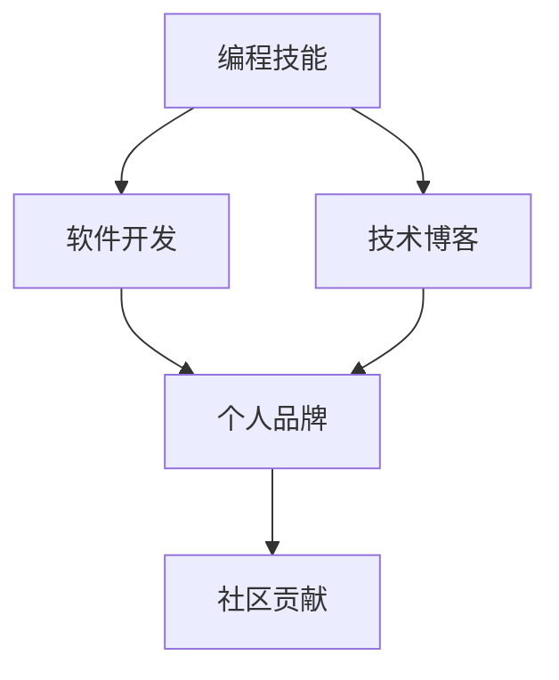

                 

# 如何将编程技能应用于个人品牌建设

> 关键词：编程技能, 个人品牌, 软件开发, 技术博客, 社区贡献

## 1. 背景介绍

在当今数字化时代，个人品牌建设已成为成功职业生涯的重要一环。无论是程序员、软件架构师还是CTO，都有必要了解如何将编程技能巧妙地融入个人品牌建设中，以提升职业影响力、获取更多职业机会、实现自我价值最大化。本文旨在为IT从业者提供一个全面的指南，探讨如何将编程技能转化为强大的个人品牌资产。

## 2. 核心概念与联系

### 2.1 核心概念概述

在深入探讨编程技能如何助力个人品牌建设之前，我们先明确几个核心概念及其相互联系：

- **编程技能**：指编程语言、算法、数据结构、软件工程等方面的知识和技术。
- **个人品牌**：指个人在职场或专业领域内树立的形象和声誉，包括技术能力、软技能、专业背景等。
- **软件开发**：涵盖软件设计、编码、测试、维护等全流程，是编程技能的主要应用场景。
- **技术博客**：通过撰写技术文章分享经验、展示技能，是展示编程技能的有效平台。
- **社区贡献**：在开源社区中参与项目、解决问题、贡献代码，能够提升个人在技术圈内的影响力和认可度。

这些概念通过互相作用，共同构成了一个IT从业者建立和发展个人品牌的基础框架。

### 2.2 核心概念原理和架构的 Mermaid 流程图



这个流程图展示了编程技能如何通过软件开发、技术博客和社区贡献，逐步构建并提升个人品牌的过程。

## 3. 核心算法原理 & 具体操作步骤

### 3.1 算法原理概述

编程技能应用于个人品牌建设的算法原理可以概括为以下几个步骤：

1. **技能积累**：持续学习和提升编程技能。
2. **技能展示**：通过软件开发项目和技术博客展现技能。
3. **影响扩大**：在开源社区贡献代码，参与技术讨论，扩大影响力。
4. **品牌构建**：在个人社交媒体和专业平台上展示个人品牌形象。

每个步骤都有其独特的算法原理，下面将详细探讨。

### 3.2 算法步骤详解

#### 3.2.1 技能积累

技能积累是个人品牌建设的基础。主要通过以下几种方式：

- **持续学习**：参加培训课程、阅读技术书籍、观看技术视频，不断更新知识体系。
- **实践项目**：参与开源项目或自主开发小项目，积累实战经验。
- **参与竞赛**：参加编程比赛和挑战，提升技术水平和问题解决能力。

#### 3.2.2 技能展示

技能展示是通过具体的项目和技术博客将个人技能呈现给外界。具体步骤包括：

- **软件开发项目**：在GitHub等平台上发布项目代码，撰写项目文档和README文件，详细记录项目背景、技术栈、使用方法等。
- **技术博客**：定期撰写技术文章，分享学习心得、项目经验、问题解决方案等，通过平台如Medium、CSDN等发布。

#### 3.2.3 影响扩大

在开源社区的贡献是扩大个人影响力和知名度的高效方式。主要步骤包括：

- **提交代码**：在GitHub、Stack Overflow等平台提交代码，解决他人问题，展示解决问题的能力。
- **参与讨论**：在技术论坛、社交媒体上积极参与技术讨论，分享见解，展示专业水平。
- **贡献开源**：参与开源项目，为项目贡献代码、文档或测试，提升个人在技术社区中的地位。

#### 3.2.4 品牌构建

品牌构建是通过个人社交媒体和专业平台进一步展示个人形象和专业背景。具体步骤包括：

- **社交媒体**：在LinkedIn、GitHub、Twitter等平台上展示项目成果、技术文章，与行业专家互动，建立行业人脉。
- **专业平台**：在CSDN、知乎等技术社区创建个人账号，发布高质量技术文章，积累专业声誉。

### 3.3 算法优缺点

编程技能应用于个人品牌建设的算法具有以下优点：

- **高效性**：通过实际项目和技术博客展示技能，能够快速积累和展示专业知识。
- **广泛性**：开源社区的贡献可以扩大个人影响，建立行业声誉。
- **持久性**：技术博客和GitHub项目代码长期保存，有助于持续积累和展示个人品牌。

同时，该算法也存在一些缺点：

- **时间投入**：持续学习和项目开发需要大量时间和精力。
- **技术门槛**：需要一定的技术水平和项目管理能力。
- **曝光限制**：技术博客和GitHub代码库的曝光率可能受限于个人传播能力和平台流量。

### 3.4 算法应用领域

编程技能应用于个人品牌建设的主要应用领域包括：

- **软件开发领域**：通过参与项目和贡献代码，展示编程技能，提升行业影响力。
- **技术博客领域**：通过撰写技术文章，分享知识，展示专业水平。
- **开源社区领域**：通过社区贡献，扩大个人影响力，建立技术声誉。
- **专业社交平台**：通过社交媒体和专业平台展示个人形象和专业背景，建立行业人脉。

## 4. 数学模型和公式 & 详细讲解 & 举例说明

### 4.1 数学模型构建

为更好地量化编程技能对个人品牌建设的贡献，我们可以构建一个简单的数学模型。假设个人品牌价值可以分解为技术能力、项目影响力、社区贡献和专业形象四个维度。每个维度的价值贡献可以用公式表示如下：

$$
V = A \times T + B \times P + C \times Q + D \times I
$$

其中：

- $V$：个人品牌总价值。
- $A$：技术能力提升系数。
- $T$：技术能力提升量。
- $B$：项目影响力提升系数。
- $P$：项目影响力提升量。
- $C$：社区贡献提升系数。
- $Q$：社区贡献提升量。
- $D$：专业形象提升系数。
- $I$：专业形象提升量。

### 4.2 公式推导过程

假设每个维度的提升量均为1，则模型简化为：

$$
V = A + B + C + D
$$

其中，$A$、$B$、$C$、$D$分别为不同维度的提升系数。这些系数可以通过实际影响力和市场调研来确定。例如，技术能力提升系数$A$可以通过个人项目的技术难度、创新性、代码质量等因素综合评定。

### 4.3 案例分析与讲解

以GitHub上的一个开源项目为例，分析其对个人品牌建设的贡献。该项目使用了最先进的编程技术，解决了实际问题，得到了社区的广泛认可。其GitHub页面的star数、fork数和issue解决量等指标，分别代表了技术能力、项目影响力和社区贡献。同时，项目维护者通过技术博客分享项目经验和解决方案，提升了个人专业形象。

## 5. 项目实践：代码实例和详细解释说明

### 5.1 开发环境搭建

要实现编程技能在个人品牌建设中的应用，首先需要搭建一个开发环境。以下是一个基本搭建流程：

1. **选择编程语言和工具**：根据个人专业背景和兴趣，选择合适的编程语言和开发工具，如Python、Java、JavaScript等。
2. **安装开发环境**：安装编程语言对应的IDE（如PyCharm、Visual Studio Code等）和必要的依赖包，如Git、Docker等。
3. **创建GitHub账户**：在GitHub上创建个人账户，上传Git仓库，设置仓库权限，开始提交代码。
4. **撰写技术博客**：选择一个技术博客平台，注册账号，撰写技术文章，定期更新博客内容。

### 5.2 源代码详细实现

以下是一个简单的Python项目，用于展示如何通过GitHub展示编程技能。项目包含README文件、代码实现和测试。

```python
# README文件
# 这是一个简单的Python项目，用于展示如何通过GitHub展示编程技能。
# 项目包含以下功能：
# 1. 编写一个求和函数
# 2. 编写一个字典遍历函数
# 3. 编写一个简单的单元测试

# 求和函数
def sum_numbers(numbers):
    total = 0
    for num in numbers:
        total += num
    return total

# 字典遍历函数
def print_dict_keys(dictionary):
    for key in dictionary:
        print(key)

# 单元测试
def test_sum_numbers():
    assert sum_numbers([1, 2, 3]) == 6
    assert sum_numbers([0, 0, 0]) == 0

def test_print_dict_keys():
    test_dict = {'a': 1, 'b': 2, 'c': 3}
    print_dict_keys(test_dict)
    assert len(list(test_dict.keys())) == 3

# 运行测试
if __name__ == '__main__':
    test_sum_numbers()
    test_print_dict_keys()
```

### 5.3 代码解读与分析

项目中的每个函数都有详细的注释，代码结构清晰，便于他人理解和复用。README文件详细说明了项目的功能和使用方法，代码仓库中包含项目文档和测试，展示了一个完整的项目开发流程。

### 5.4 运行结果展示

运行项目后，可以展示项目的执行结果和测试结果，展示项目的开发和部署能力。同时，可以在GitHub上推送代码，展示项目的实现和贡献。

## 6. 实际应用场景

### 6.1 软件开发领域

在软件开发领域，个人品牌建设可以通过以下场景实现：

- **开源项目贡献**：参与开源项目，贡献代码、修复bug、优化代码，展示技术能力和项目影响力。
- **自主项目展示**：自主开发项目，并将其部署到GitHub上，展示个人技术实力和项目成果。
- **技术分享与讨论**：在技术博客或社区论坛上分享项目经验和解决方案，参与技术讨论，展示专业水平。

### 6.2 技术博客领域

技术博客是展示编程技能的重要平台。通过以下场景，可以在技术博客上提升个人品牌：

- **撰写技术文章**：定期撰写技术文章，分享学习心得、项目经验、问题解决方案等。
- **参与技术交流**：在技术社区或社交平台上参与技术交流，展示专业水平和解决问题的能力。
- **分享代码示例**：在技术文章中分享代码示例和项目实现，展示实际编程能力。

### 6.3 开源社区领域

开源社区是展示编程技能的另一个重要平台。通过以下场景，可以在开源社区上提升个人品牌：

- **贡献代码**：在GitHub、Stack Overflow等平台提交代码，解决他人问题，展示解决问题的能力。
- **参与讨论**：在技术论坛、社交媒体上积极参与技术讨论，分享见解，展示专业水平。
- **贡献开源**：参与开源项目，为项目贡献代码、文档或测试，提升个人在技术社区中的地位。

### 6.4 专业社交平台

专业社交平台是展示个人形象和专业背景的重要场所。通过以下场景，可以在专业社交平台上提升个人品牌：

- **社交媒体展示**：在LinkedIn、GitHub、Twitter等平台上展示项目成果、技术文章，与行业专家互动，建立行业人脉。
- **专业平台发布**：在CSDN、知乎等技术社区创建个人账号，发布高质量技术文章，积累专业声誉。
- **参与行业活动**：参加行业会议、技术讲座，与业内专家交流，提升个人影响力。

## 7. 工具和资源推荐

### 7.1 学习资源推荐

要高效地将编程技能应用于个人品牌建设，以下是几个优质的学习资源推荐：

1. **Udacity和Coursera**：提供大量编程和技术相关课程，包括软件开发、数据科学、机器学习等。
2. **LeetCode和HackerRank**：提供编程挑战和竞赛，提升技术能力和解决问题的能力。
3. **Stack Overflow和GitHub**：学习和分享编程知识，解决问题，展示技术实力。
4. **Medium和CSDN**：发布技术文章，分享学习心得，提升个人品牌影响力。
5. **LinkedIn和GitHub**：展示项目成果，建立行业人脉，提升个人知名度。

通过这些资源，可以快速积累编程技能，提升个人品牌建设的质量和效果。

### 7.2 开发工具推荐

高效的开发工具能够提升编程效率，加快个人品牌建设的进程。以下是几款推荐的开发工具：

1. **Visual Studio Code**：一款轻量级、功能强大的代码编辑器，支持多种编程语言和插件扩展。
2. **Git**：版本控制系统，支持代码管理和协作，是GitHub等平台的基础。
3. **Docker**：容器化技术，简化项目部署和管理，提升开发效率。
4. **Jupyter Notebook**：支持Python等编程语言的交互式编程，便于技术分享和讨论。
5. **Google Colab**：提供免费的GPU和TPU资源，支持Python编程和机器学习实验。

合理利用这些工具，可以显著提升编程技能应用于个人品牌建设的效率，加速品牌建设进程。

### 7.3 相关论文推荐

编程技能和品牌建设的理论研究为实践提供了科学依据。以下是几篇具有代表性的论文推荐：

1. **"Programming: The Key to Career Success" by Geoffrey R. Donaldson**：探讨了编程技能在职业发展中的重要作用，强调了持续学习和实践的重要性。
2. **"Brand Building in the Digital Age: A Guide for Programmers" by David S. de Koning**：详细介绍了如何在数字时代通过编程技能构建个人品牌，提供了具体的策略和工具。
3. **"Technical Writing and Brand Building: How Programmers Can Communicate Their Skills" by Simon Palma**：讨论了技术写作在品牌建设中的作用，提供了撰写技术文章的技巧和最佳实践。
4. **"The Role of Contributing to Open Source in Personal Branding" by Alex Martin**：分析了开源贡献在提升个人品牌中的重要性，提供了参与开源项目的策略和方法。
5. **"Social Media and Professional Development: A Guide for Programmers" by Laura S. Green**：探讨了社交媒体在个人品牌建设中的作用，提供了社交媒体使用的技巧和最佳实践。

这些论文提供了深入的理论支持和实践指导，有助于进一步理解和提升编程技能在个人品牌建设中的应用。

## 8. 总结：未来发展趋势与挑战

### 8.1 研究成果总结

本文探讨了将编程技能应用于个人品牌建设的原理和操作步骤，总结了当前的主要研究方向和实践成果。编程技能通过软件开发、技术博客、开源社区和个人社交平台等渠道，展示个人技术能力、项目影响力、社区贡献和专业形象，从而构建和提升个人品牌。

### 8.2 未来发展趋势

未来，编程技能在个人品牌建设中的应用将呈现以下趋势：

1. **多技能融合**：随着技术的不断进步，未来的IT从业者需要掌握更多跨学科技能，如数据科学、人工智能、云计算等，以提升竞争力。
2. **持续学习和创新**：编程技能需要不断更新，与最新的技术趋势保持同步，持续创新才能保持品牌竞争力。
3. **跨平台展示**：除了传统技术博客和开源社区，新的社交平台和多媒体工具也将成为展示编程技能的重要渠道。
4. **社区驱动**：开源社区和专业论坛在个人品牌建设中扮演越来越重要的角色，社区参与和贡献将决定个人影响力的提升。
5. **个性化展示**：通过个性化内容展示，如视频博客、直播编程等，提升个人品牌的吸引力和传播力。

### 8.3 面临的挑战

尽管编程技能在个人品牌建设中具有显著的优势，但仍面临一些挑战：

1. **时间管理**：持续学习和项目开发需要大量时间和精力，如何平衡工作和个人发展成为一大难题。
2. **技术更新**：技术日新月异，需要不断学习和适应新技术，保持技能的前沿性。
3. **市场竞争**：激烈的市场竞争使得个人品牌建设需要更加专业和精准的策略。
4. **内容质量**：高质量的技术文章和项目展示是个人品牌建设的基础，但高质量内容的生产需要时间和精力的投入。

### 8.4 研究展望

未来，如何克服这些挑战，进一步提升编程技能在个人品牌建设中的作用，将成为重要的研究方向。以下是几个可能的研究方向：

1. **高效学习工具**：开发智能化的学习工具，帮助程序员高效学习和掌握新技术。
2. **个性化展示平台**：开发更多个性化展示平台，如视频博客、直播编程等，提升品牌吸引力。
3. **社区协作工具**：开发高效协作工具，促进开源社区和专业论坛的互动和贡献，提升个人影响力。
4. **智能内容生成**：利用自然语言处理和人工智能技术，生成高质量的技术文章和代码示例，降低内容生产的难度和时间成本。

这些研究方向将有助于提升编程技能在个人品牌建设中的应用效果，促进IT行业的健康发展和个人职业成长。

## 9. 附录：常见问题与解答

**Q1：如何选择合适的编程语言和技术栈？**

A: 选择编程语言和技术栈需要考虑以下因素：
1. **项目需求**：根据项目的具体需求选择适合的编程语言和技术栈。例如，Web开发项目常用JavaScript和React，数据科学项目常用Python和R。
2. **技术熟悉度**：选择自己熟悉和擅长的编程语言和技术栈，可以提升开发效率和质量。
3. **社区和资源**：选择有大量社区支持和丰富资源的语言和技术栈，可以方便学习和问题解决。

**Q2：如何快速提升编程技能？**

A: 提升编程技能需要持续学习和实践，以下是几个建议：
1. **持续学习**：参加培训课程、阅读技术书籍、观看技术视频，不断更新知识体系。
2. **项目实践**：参与开源项目或自主开发小项目，积累实战经验。
3. **编程竞赛**：参加编程比赛和挑战，提升技术水平和问题解决能力。

**Q3：如何展示编程技能在个人品牌建设中？**

A: 展示编程技能可以通过以下几个渠道：
1. **技术博客**：撰写技术文章，分享学习心得、项目经验、问题解决方案等，通过平台如Medium、CSDN等发布。
2. **开源社区**：在GitHub、Stack Overflow等平台提交代码，解决他人问题，展示解决问题的能力。
3. **专业平台**：在LinkedIn、GitHub、Twitter等平台上展示项目成果、技术文章，与行业专家互动，建立行业人脉。

**Q4：如何平衡工作和个人品牌建设？**

A: 平衡工作和个人品牌建设需要合理安排时间和资源，以下是几个建议：
1. **时间管理**：合理安排工作时间和个人学习时间，制定详细的学习计划和目标。
2. **优先级设置**：根据个人和职业发展目标，合理设置工作任务和品牌建设的优先级。
3. **团队合作**：与团队成员协作，分工明确，提升工作效率，腾出更多时间进行个人发展。

---

作者：禅与计算机程序设计艺术 / Zen and the Art of Computer Programming

